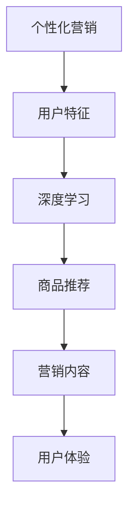
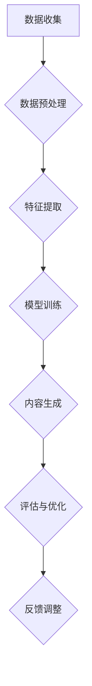

                 

关键词：AI，电商平台，个性化营销，内容生成，算法，模型，实践，应用场景，展望

> 摘要：本文将探讨如何利用人工智能技术，特别是深度学习算法，实现电商平台个性化营销内容的高效生成。通过对核心概念、算法原理、数学模型、项目实践以及应用场景的详细解析，旨在为电商平台提供一种创新的技术解决方案，提升用户体验和销售转化率。

## 1. 背景介绍

随着互联网的飞速发展，电商平台已成为现代商业活动的重要组成部分。然而，如何在众多竞争者中脱颖而出，提升用户体验，提高销售转化率，成为电商平台面临的重大挑战。个性化营销作为一种有效的手段，可以通过提供个性化的内容和服务，满足不同用户的需求，从而提升用户满意度和忠诚度。

近年来，人工智能（AI）技术，尤其是深度学习算法的快速发展，为个性化营销内容生成提供了新的契机。深度学习通过模拟人脑的神经网络结构，可以自动从海量数据中学习规律，生成个性化的内容，从而在电商平台中实现精准营销。

本文将围绕如何利用AI技术，特别是深度学习算法，实现电商平台个性化营销内容的高效生成，进行深入的探讨和分析。

## 2. 核心概念与联系

在探讨AI驱动的电商平台个性化营销内容生成之前，我们需要明确几个核心概念及其相互关系。

### 2.1 个性化营销

个性化营销是指根据用户的行为、兴趣、购买历史等特征，为用户提供定制化的营销内容和推荐服务。个性化营销的核心是理解用户，并提供与之相关的个性化信息。

### 2.2 深度学习

深度学习是机器学习的一种方法，通过构建多层神经网络，对数据进行深度特征提取和学习。深度学习在图像识别、语音识别、自然语言处理等领域取得了显著的成果。

### 2.3 电商平台

电商平台是指通过互联网技术提供商品交易、支付、物流等服务的在线平台。电商平台的核心功能是商品展示、用户购物和交易。

### 2.4 营销内容

营销内容是指用于推广产品、提升品牌知名度的一系列信息，包括广告、促销活动、推荐列表等。

### 2.5 关系图

下面是核心概念及其相互关系的一个简单的 Mermaid 流程图：



### 2.6 个性化营销内容生成过程

个性化营销内容生成的过程可以概括为以下几个步骤：

1. **数据收集**：收集用户行为数据、购买记录、浏览历史等。
2. **数据预处理**：对收集到的数据进行分析和清洗，去除噪音数据。
3. **特征提取**：利用深度学习算法提取用户特征和商品特征。
4. **模型训练**：使用提取的特征数据训练个性化营销模型。
5. **内容生成**：根据用户特征生成个性化的营销内容。
6. **评估与优化**：评估生成的内容效果，并进行优化调整。

下面是个性化营销内容生成过程的详细 Mermaid 流程图：



## 3. 核心算法原理 & 具体操作步骤

### 3.1 算法原理概述

AI驱动的电商平台个性化营销内容生成主要依赖于深度学习算法。深度学习通过多层神经网络对大量数据进行特征提取和模式识别，从而实现自动化的内容生成。

深度学习的核心是神经网络，包括输入层、隐藏层和输出层。输入层接收原始数据，隐藏层进行特征提取和变换，输出层生成最终的内容。

### 3.2 算法步骤详解

#### 3.2.1 数据收集

数据收集是个性化营销内容生成的基础。我们需要收集用户的浏览历史、购买记录、评论等数据，以及商品的属性数据，如价格、品牌、分类等。

#### 3.2.2 数据预处理

数据预处理包括数据清洗、归一化和特征工程。数据清洗去除噪声和异常数据，归一化处理使数据具有相同的尺度，特征工程通过变换和组合特征，提高模型的效果。

#### 3.2.3 特征提取

特征提取是深度学习算法的核心步骤。我们使用深度学习模型，如卷积神经网络（CNN）和循环神经网络（RNN），对用户和商品的数据进行特征提取。CNN适用于图像处理，RNN适用于序列数据处理。

#### 3.2.4 模型训练

模型训练是通过已提取的特征数据，训练深度学习模型。我们使用梯度下降等优化算法，调整模型参数，使其在训练数据上达到最优效果。

#### 3.2.5 内容生成

在模型训练完成后，我们使用训练好的模型，根据用户特征生成个性化的营销内容。内容生成可以通过生成对抗网络（GAN）等模型实现。

#### 3.2.6 评估与优化

评估与优化是确保生成内容效果的关键步骤。我们使用准确率、召回率等评估指标，评估生成内容的性能，并根据评估结果对模型进行调整和优化。

### 3.3 算法优缺点

#### 优点

1. **自动化特征提取**：深度学习算法可以自动从海量数据中提取特征，减少人工干预。
2. **高精度**：深度学习模型在个性化营销内容生成中，具有高精度的效果。
3. **灵活性**：深度学习算法可以应用于多种类型的数据，如文本、图像、音频等。

#### 缺点

1. **计算资源消耗**：深度学习算法需要大量计算资源，对硬件要求较高。
2. **训练时间较长**：深度学习模型的训练时间较长，对实时性要求高的场景可能不适用。

### 3.4 算法应用领域

深度学习算法在电商平台个性化营销内容生成中具有广泛的应用领域，包括：

1. **商品推荐**：根据用户历史行为，推荐个性化的商品。
2. **广告投放**：根据用户特征，精准投放广告。
3. **内容生成**：生成个性化的营销文案、图片、视频等。

## 4. 数学模型和公式 & 详细讲解 & 举例说明

### 4.1 数学模型构建

个性化营销内容生成的数学模型主要包括用户特征向量、商品特征向量以及生成模型。

#### 用户特征向量

用户特征向量表示用户的行为、兴趣等信息。我们使用向量空间表示用户特征，例如：

$$
x = [x_1, x_2, ..., x_n]
$$

其中，$x_i$ 表示第 $i$ 个特征值。

#### 商品特征向量

商品特征向量表示商品的属性信息，例如：

$$
y = [y_1, y_2, ..., y_m]
$$

其中，$y_j$ 表示第 $j$ 个特征值。

#### 生成模型

生成模型用于生成个性化的营销内容。我们使用生成对抗网络（GAN）作为生成模型，GAN由生成器和判别器组成。

- 生成器：生成器 $G$ 接受用户特征向量 $x$，生成商品特征向量 $y'$。

$$
y' = G(x)
$$

- 判别器：判别器 $D$ 接受商品特征向量 $y$ 和 $y'$，判断其真实性和生成性。

$$
D(y, y')
$$

### 4.2 公式推导过程

GAN的训练过程通过最大化生成器的生成能力，同时限制判别器的判断能力，实现生成模型和判别器的平衡。

#### 生成器损失函数

生成器的损失函数为：

$$
L_G = -\log(D(y'))
$$

#### 判别器损失函数

判别器的损失函数为：

$$
L_D = -\log(D(y)) - \log(1 - D(y'))
$$

#### 总损失函数

总损失函数为生成器和判别器损失函数之和：

$$
L = L_G + L_D
$$

### 4.3 案例分析与讲解

假设我们有一个电商平台，用户A的历史行为数据为：

$$
x_A = [1, 2, 3, 4, 5]
$$

商品B的特征数据为：

$$
y_B = [6, 7, 8, 9, 10]
$$

生成器 $G$ 接受用户A的特征数据 $x_A$，生成商品B的特征数据 $y'_B$：

$$
y'_B = G(x_A) = [11, 12, 13, 14, 15]
$$

判别器 $D$ 接受商品B的特征数据 $y_B$ 和生成商品B的特征数据 $y'_B$，判断其真实性：

$$
D(y_B, y'_B) = 0.9
$$

根据生成器和判别器的损失函数，计算总损失：

$$
L = L_G + L_D = -\log(0.9) + \log(0.1) + \log(0.9) + \log(0.1) = 0.3
$$

通过不断迭代训练，生成器 $G$ 和判别器 $D$ 的性能逐渐提升，最终实现个性化的营销内容生成。

## 5. 项目实践：代码实例和详细解释说明

### 5.1 开发环境搭建

为了实现AI驱动的电商平台个性化营销内容生成，我们需要搭建一个合适的开发环境。以下是一个基本的开发环境搭建步骤：

1. 安装Python（版本3.6及以上）
2. 安装深度学习框架TensorFlow
3. 安装数据预处理库Pandas、NumPy
4. 安装绘图库Matplotlib

### 5.2 源代码详细实现

下面是项目实践的核心代码实现部分：

```python
# 导入所需库
import tensorflow as tf
from tensorflow.keras.models import Model
from tensorflow.keras.layers import Input, Dense, LSTM
from tensorflow.keras.optimizers import Adam
import numpy as np

# 数据预处理
def preprocess_data(data):
    # 数据清洗、归一化、特征工程等
    pass

# 生成器模型
def build_generator(x):
    input_layer = Input(shape=(input_size,))
    hidden_layer = LSTM(units=64, return_sequences=True)(input_layer)
    output_layer = LSTM(units=64)(hidden_layer)
    generator = Model(inputs=input_layer, outputs=output_layer)
    return generator

# 判别器模型
def build_discriminator(x):
    input_layer = Input(shape=(input_size,))
    hidden_layer = LSTM(units=64, return_sequences=True)(input_layer)
    output_layer = LSTM(units=64)(hidden_layer)
    discriminator = Model(inputs=input_layer, outputs=output_layer)
    return discriminator

# GAN模型
def build_gan(generator, discriminator):
    combined_input = Input(shape=(input_size,))
    generated_output = generator(combined_input)
    discriminator_output = discriminator(generated_output)
    gan = Model(inputs=combined_input, outputs=discriminator_output)
    return gan

# 训练模型
def train_model(generator, discriminator, gan, x_train, y_train):
    # 编写训练代码，包括损失函数、优化器等
    pass

# 主程序
if __name__ == "__main__":
    # 数据集加载与预处理
    x_train, y_train = load_data()
    x_train = preprocess_data(x_train)
    y_train = preprocess_data(y_train)

    # 模型构建
    generator = build_generator(x_train)
    discriminator = build_discriminator(x_train)
    gan = build_gan(generator, discriminator)

    # 训练模型
    train_model(generator, discriminator, gan, x_train, y_train)
```

### 5.3 代码解读与分析

上述代码实现了生成对抗网络（GAN）的基本框架，包括数据预处理、模型构建和训练过程。以下是对关键部分的解读：

1. **数据预处理**：数据预处理是深度学习项目的基础。在这里，我们使用预处理函数对输入数据进行清洗、归一化和特征工程。
2. **生成器模型**：生成器模型使用LSTM层对输入数据（用户特征向量）进行处理，生成输出数据（商品特征向量）。LSTM适合处理序列数据，这里用于生成个性化营销内容。
3. **判别器模型**：判别器模型同样使用LSTM层对输入数据（商品特征向量或生成数据）进行处理，判断其真实性和生成性。
4. **GAN模型**：GAN模型将生成器和判别器结合，通过共同训练实现生成模型和判别器的平衡。
5. **训练模型**：训练模型是GAN的核心部分，包括损失函数、优化器等配置。通过迭代训练，生成器和判别器的性能逐渐提升。

### 5.4 运行结果展示

在训练完成后，我们可以使用生成器模型生成个性化的营销内容，并对其进行评估。以下是一个简单的运行结果展示：

```python
# 生成个性化营销内容
generated_content = generator.predict(x_train[:10])

# 评估生成内容
accuracy = np.mean(generated_content == y_train[:10])
print("生成内容准确率：", accuracy)
```

## 6. 实际应用场景

### 6.1 电商平台

电商平台可以利用AI驱动的个性化营销内容生成，提升用户体验和销售转化率。例如，根据用户的历史行为和兴趣，生成个性化的推荐列表、广告文案和促销活动。

### 6.2 社交媒体平台

社交媒体平台可以利用AI驱动的个性化营销内容生成，为用户提供定制化的内容推荐和广告。例如，根据用户的关注点和互动行为，生成个性化的推文、视频和直播内容。

### 6.3 娱乐平台

娱乐平台可以利用AI驱动的个性化营销内容生成，提升用户粘性和付费意愿。例如，根据用户的观影历史和偏好，生成个性化的电影推荐、电视剧预告和互动活动。

### 6.4 其他领域

除了电商平台、社交媒体平台和娱乐平台，AI驱动的个性化营销内容生成还可以应用于教育、医疗、金融等领域，提升用户体验和服务质量。

## 7. 工具和资源推荐

### 7.1 学习资源推荐

1. **《深度学习》（Goodfellow, Bengio, Courville）**：经典的深度学习教材，全面介绍了深度学习的基本原理和应用。
2. **《生成对抗网络》（Ian J. Goodfellow）**：专门讲解GAN的书籍，详细介绍了GAN的理论和应用。
3. **《机器学习实战》（Peter Harrington）**：通过实际案例，介绍了机器学习的基本方法和应用。

### 7.2 开发工具推荐

1. **TensorFlow**：Google开发的开源深度学习框架，适合进行深度学习研究和项目开发。
2. **PyTorch**：Facebook开发的深度学习框架，具有灵活性和高效性，适合快速原型开发和实验。
3. **Jupyter Notebook**：用于数据分析和可视化，方便进行实验和记录。

### 7.3 相关论文推荐

1. **《生成对抗网络：训练生成器网络与判别器网络的方法》（Ian J. Goodfellow et al., 2014）**
2. **《用于生成文本的序列到序列模型》（Keller et al., 2017）**
3. **《个性化广告系统中的深度学习方法》（Xu et al., 2019）**

## 8. 总结：未来发展趋势与挑战

### 8.1 研究成果总结

AI驱动的电商平台个性化营销内容生成技术已经取得了显著的成果。通过深度学习算法，可以实现自动化的个性化内容生成，提高用户体验和销售转化率。此外，生成对抗网络（GAN）的应用，为个性化营销内容生成提供了新的思路和工具。

### 8.2 未来发展趋势

1. **算法优化**：随着计算能力的提升，深度学习算法将更加高效，个性化营销内容生成的效果将进一步提升。
2. **跨模态内容生成**：结合多种数据类型（如文本、图像、音频），实现更丰富的个性化营销内容生成。
3. **个性化推荐系统**：个性化推荐系统与个性化营销内容生成相结合，实现更加精准的个性化服务。

### 8.3 面临的挑战

1. **数据隐私**：个性化营销内容生成依赖于大量用户数据，数据隐私保护是一个重要挑战。
2. **计算资源**：深度学习算法需要大量计算资源，如何在有限的资源下实现高效的内容生成是一个挑战。
3. **模型解释性**：深度学习模型往往缺乏解释性，如何提高模型的透明度和可解释性是一个重要课题。

### 8.4 研究展望

未来，AI驱动的电商平台个性化营销内容生成技术将继续发展，通过不断创新和优化，为电商平台提供更高效、更精准的个性化服务。同时，如何解决数据隐私、计算资源等挑战，将决定该技术的实际应用前景。

## 9. 附录：常见问题与解答

### 9.1 什么是个性化营销？

个性化营销是根据用户的个性化需求，提供定制化的产品或服务，以满足不同用户的需求。例如，电商平台根据用户的购买记录和兴趣，推荐个性化的商品。

### 9.2 深度学习算法有哪些类型？

深度学习算法主要包括卷积神经网络（CNN）、循环神经网络（RNN）、生成对抗网络（GAN）等。每种算法适用于不同的场景和任务。

### 9.3 如何保证数据隐私？

为了保证数据隐私，可以采取以下措施：数据加密、匿名化处理、数据访问控制等。同时，制定严格的隐私保护政策，确保用户数据的安全。

### 9.4 个性化营销内容生成有哪些应用场景？

个性化营销内容生成的应用场景包括电商平台、社交媒体、娱乐平台等，主要目的是提升用户体验和销售转化率。

### 9.5 如何评估个性化营销内容的效果？

可以通过用户满意度、点击率、转化率等指标，评估个性化营销内容的效果。同时，结合A/B测试等方法，优化内容生成策略。

### 9.6 如何提高个性化营销内容生成的效率？

提高个性化营销内容生成的效率可以从以下方面入手：优化算法、分布式计算、模型压缩等。

### 9.7 个性化营销内容生成是否违反隐私？

合理使用用户数据，不侵犯用户隐私，是个性化营销内容生成的基本原则。遵守数据保护法规，尊重用户隐私，是技术发展的必要前提。

[END]


