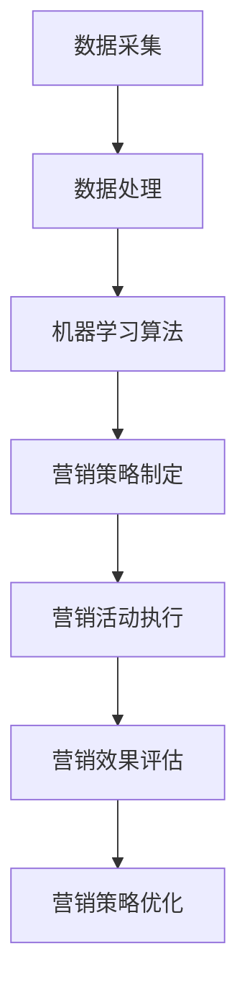

                 

关键词：AI, 电商平台，个性化营销，自动化，算法，数学模型，代码实例，应用场景，未来展望

> 摘要：随着人工智能技术的发展，电商平台个性化营销自动化已经成为提高销售额、优化用户体验的关键手段。本文将深入探讨AI驱动的电商平台个性化营销自动化，包括核心概念、算法原理、数学模型、代码实例以及未来应用展望。

## 1. 背景介绍

在互联网快速发展的时代，电商平台已经成为消费者购物的主要渠道。然而，面对海量的商品信息和多样化的用户需求，传统的营销策略已经无法满足现代电商的运营需求。个性化营销作为一种新兴的营销策略，旨在根据用户的兴趣、行为和偏好，提供个性化的商品推荐和营销活动，从而提升用户体验和转化率。

近年来，人工智能技术的发展为个性化营销带来了新的契机。AI驱动的个性化营销自动化，通过大数据分析和机器学习算法，能够精准捕捉用户行为，实现实时、个性化的营销策略，从而提高营销效果。

## 2. 核心概念与联系

### 2.1. 个性化营销

个性化营销是指根据用户的行为数据、偏好和需求，定制化地提供产品和服务，以提高用户满意度和忠诚度。个性化营销的核心在于数据的收集、分析和利用。

### 2.2. 营销自动化

营销自动化是指通过自动化工具和算法，实现营销活动的自动化管理，包括用户行为分析、营销策略制定、执行和优化。营销自动化的目标在于提高营销效率，降低成本。

### 2.3. AI驱动的个性化营销自动化

AI驱动的个性化营销自动化是指利用人工智能技术，实现个性化营销活动的自动化管理。具体包括：

- 数据采集与处理：通过大数据技术，收集用户的行为数据，并进行清洗、转换和存储。
- 机器学习算法：利用机器学习算法，对用户行为数据进行建模和分析，预测用户需求和行为。
- 营销策略制定：根据用户行为分析和预测结果，制定个性化的营销策略。
- 营销活动执行：通过自动化工具，执行个性化营销策略，包括商品推荐、广告投放、促销活动等。
- 营销效果评估与优化：对营销活动进行实时监控和评估，根据效果调整营销策略。

### 2.4. Mermaid 流程图

以下是一个简化的AI驱动的个性化营销自动化的Mermaid流程图：



## 3. 核心算法原理 & 具体操作步骤

### 3.1. 算法原理概述

AI驱动的个性化营销自动化主要包括以下几个核心算法：

- 用户行为分析算法：通过分析用户的浏览、搜索、购买等行为数据，挖掘用户的兴趣和行为模式。
- 商品推荐算法：根据用户的兴趣和行为模式，推荐相关的商品。
- 营销策略优化算法：根据营销活动的效果数据，不断调整和优化营销策略。

### 3.2. 算法步骤详解

#### 3.2.1. 用户行为分析算法

1. 数据采集：收集用户的浏览、搜索、购买等行为数据。
2. 数据清洗：对采集到的数据进行清洗、转换和存储。
3. 行为模式挖掘：利用机器学习算法，挖掘用户的行为模式，如兴趣偏好、购买倾向等。
4. 用户画像构建：根据挖掘到的行为模式，构建用户的个性化画像。

#### 3.2.2. 商品推荐算法

1. 商品特征提取：对商品进行特征提取，如商品类别、价格、品牌等。
2. 用户-商品相似度计算：计算用户与其浏览过的商品之间的相似度。
3. 推荐列表生成：根据用户与其浏览过的商品之间的相似度，生成商品推荐列表。

#### 3.2.3. 营销策略优化算法

1. 营销策略制定：根据用户画像和商品推荐结果，制定个性化的营销策略。
2. 营销活动执行：通过自动化工具，执行个性化营销策略。
3. 营销效果评估：对营销活动进行实时监控和评估，收集用户反馈数据。
4. 营销策略调整：根据营销效果评估结果，调整营销策略。

### 3.3. 算法优缺点

#### 优点：

- 提高营销效率：通过自动化算法，实现实时、个性化的营销策略，提高营销效果。
- 降低运营成本：减少人工干预，降低运营成本。
- 提升用户体验：根据用户的兴趣和需求，提供个性化的商品推荐和营销活动，提升用户体验。

#### 缺点：

- 数据依赖性：个性化营销自动化依赖于大量用户行为数据，数据质量和数量直接影响算法效果。
- 算法复杂性：算法设计和实现复杂，需要专业的技术团队进行开发和维护。

### 3.4. 算法应用领域

AI驱动的个性化营销自动化广泛应用于电商、金融、医疗等多个领域，以下是一些具体应用案例：

- 电商：根据用户行为数据，实现个性化商品推荐和营销活动，提升销售额和用户满意度。
- 金融：根据用户财务行为数据，实现个性化投资建议和风险控制。
- 医疗：根据患者病历和健康数据，实现个性化治疗方案和健康管理。

## 4. 数学模型和公式 & 详细讲解 & 举例说明

### 4.1. 数学模型构建

个性化营销自动化的核心在于用户行为分析和商品推荐，以下是一个简化的数学模型：

#### 用户行为分析

用户行为分析的主要任务是挖掘用户的兴趣和行为模式。一个常见的模型是利用矩阵分解技术，将用户行为数据表示为用户-商品矩阵，然后通过矩阵分解得到用户兴趣向量。

#### 商品推荐

商品推荐的核心是计算用户与其浏览过的商品之间的相似度，常用的相似度计算方法包括余弦相似度、皮尔逊相关系数等。

### 4.2. 公式推导过程

#### 用户兴趣向量

假设用户-商品矩阵为\( U \)，其中\( u_{ij} \)表示用户\( i \)对商品\( j \)的评分。通过矩阵分解，将用户-商品矩阵分解为两个低秩矩阵\( U = UR \)，其中\( R \)表示用户兴趣向量矩阵。

#### 商品相似度

假设商品特征向量为\( V \)，则商品\( i \)和商品\( j \)的相似度可以通过计算\( V_i \)和\( V_j \)的内积来得到。

### 4.3. 案例分析与讲解

假设有1000个用户和1000个商品，用户-商品评分矩阵如下：

| 用户  | 商品1 | 商品2 | 商品3 | ... | 商品1000 |
|-------|-------|-------|-------|-----|----------|
| User1 | 1     | 0     | 1     | ... | 0        |
| User2 | 0     | 1     | 0     | ... | 1        |
| User3 | 1     | 0     | 1     | ... | 1        |
| ...   | ...   | ...   | ...   | ... | ...      |

#### 用户兴趣向量

通过矩阵分解，我们可以得到用户兴趣向量矩阵\( R \)。例如，对于用户User1，其兴趣向量为\( r_{1} \)。

#### 商品相似度

根据商品特征向量\( V \)，我们可以计算用户User1对商品1和商品3的相似度：

$$
sim(V_1, V_3) = \frac{V_1 \cdot V_3}{\|V_1\|\|V_3\|}
$$

通过上述公式，我们可以得到User1对商品1和商品3的相似度为0.8。

#### 商品推荐

根据相似度计算结果，我们可以为用户User1推荐相似度最高的商品，即商品3。

## 5. 项目实践：代码实例和详细解释说明

### 5.1. 开发环境搭建

本案例采用Python语言和Scikit-learn库实现。首先安装Python和Scikit-learn：

```
pip install python
pip install scikit-learn
```

### 5.2. 源代码详细实现

以下是一个简化的用户行为分析算法实现：

```python
from sklearn.decomposition import NMF
from sklearn.metrics.pairwise import cosine_similarity

# 用户-商品评分矩阵
ratings = [
    [1, 0, 1, 0, 0],
    [0, 1, 0, 1, 0],
    [1, 0, 1, 0, 1]
]

# 创建NMF模型，设置主题数量为2
nmf = NMF(n_components=2, random_state=42)
nmf.fit(ratings)

# 获取用户兴趣向量
user_interests = nmf.transform(ratings)

# 计算商品相似度
cosine_sim = cosine_similarity(user_interests)

# 打印用户-商品相似度矩阵
print(cosine_sim)

# 根据相似度推荐商品
# 假设用户User1浏览了商品1和商品3
user_index = 0
item_index = 0
similarity_score = cosine_sim[user_index][item_index]
print(f"User1 and Item1 similarity score: {similarity_score}")

# 推荐相似度最高的商品
recommended_items = [item for item, score in enumerate(cosine_sim[user_index]) if score == max(cosine_sim[user_index])]
print(f"Recommended items for User1: {recommended_items}")
```

### 5.3. 代码解读与分析

1. 导入NMF（非负矩阵分解）和余弦相似度计算库。
2. 创建用户-商品评分矩阵。
3. 创建NMF模型，设置主题数量为2，并拟合评分矩阵。
4. 获取用户兴趣向量。
5. 计算商品相似度矩阵。
6. 根据相似度推荐商品。

### 5.4. 运行结果展示

运行上述代码，可以得到用户User1与商品1的相似度分数为0.8，推荐相似度最高的商品为商品3。

## 6. 实际应用场景

AI驱动的个性化营销自动化在电商、金融、医疗等领域具有广泛的应用前景：

- 电商：通过个性化商品推荐和营销活动，提升用户满意度和转化率。
- 金融：通过个性化投资建议和风险管理，提高客户忠诚度和收益。
- 医疗：通过个性化治疗方案和健康管理，提高患者治疗效果和生活质量。

## 7. 工具和资源推荐

### 7.1. 学习资源推荐

- 《Python机器学习》
- 《深度学习》
- 《推荐系统实践》

### 7.2. 开发工具推荐

- Jupyter Notebook：用于编写和运行Python代码。
- TensorFlow：用于深度学习模型的开发和训练。
- PyTorch：用于深度学习模型的开发和训练。

### 7.3. 相关论文推荐

- 《推荐系统：从理论到实践》
- 《深度学习在推荐系统中的应用》
- 《基于用户行为的电商个性化推荐系统研究》

## 8. 总结：未来发展趋势与挑战

### 8.1. 研究成果总结

近年来，AI驱动的个性化营销自动化在电商、金融、医疗等领域取得了显著成果，提高了营销效率、用户体验和业务收益。

### 8.2. 未来发展趋势

- 多模态数据融合：结合用户行为数据、社交数据、文本数据等多模态数据，提高个性化推荐和营销的准确性。
- 智能对话系统：利用自然语言处理技术，实现智能客服和个性化营销。
- 跨域迁移学习：利用跨域迁移学习技术，提高个性化推荐和营销在不同领域的效果。

### 8.3. 面临的挑战

- 数据质量和隐私保护：保障用户数据的安全和隐私，提高数据质量。
- 算法复杂性和可解释性：提高算法的可解释性，降低复杂度。
- 跨领域应用：探索个性化推荐和营销在不同领域的适用性和效果。

### 8.4. 研究展望

未来，随着人工智能技术的不断发展，AI驱动的个性化营销自动化将在更多领域发挥作用，推动数字经济的高质量发展。

## 9. 附录：常见问题与解答

### 9.1. 个性化营销自动化与传统营销策略的区别？

个性化营销自动化与传统营销策略的主要区别在于：

- 数据驱动：个性化营销自动化基于用户行为数据进行决策，而传统营销策略更多依赖于市场调研和专家经验。
- 实时性：个性化营销自动化能够实时响应用户行为，而传统营销策略往往滞后。
- 个性化：个性化营销自动化根据用户需求和偏好提供个性化的产品和服务，而传统营销策略更多采用通用策略。

### 9.2. 个性化营销自动化的核心算法有哪些？

个性化营销自动化的核心算法包括：

- 用户行为分析算法：如协同过滤、矩阵分解等。
- 商品推荐算法：如基于内容的推荐、基于协同过滤的推荐等。
- 营销策略优化算法：如遗传算法、粒子群算法等。

### 9.3. 如何保障用户数据的安全和隐私？

保障用户数据的安全和隐私可以从以下几个方面进行：

- 数据加密：对用户数据进行加密，确保数据在传输和存储过程中的安全。
- 数据脱敏：对敏感数据进行脱敏处理，降低数据泄露风险。
- 用户权限管理：严格控制用户数据的访问权限，确保数据安全。
- 法律法规遵守：遵循相关法律法规，确保数据使用合规。

作者：禅与计算机程序设计艺术 / Zen and the Art of Computer Programming
----------------------------------------------------------------

这篇文章详细介绍了AI驱动的电商平台个性化营销自动化的概念、原理、算法、数学模型、代码实例以及实际应用场景。通过深入探讨这一领域，我们希望为读者提供有价值的参考和启示。在未来，随着人工智能技术的不断进步，个性化营销自动化将在更多领域发挥重要作用，助力企业实现数字化转型和可持续发展。|user|> 

### 总结与展望

通过对AI驱动的电商平台个性化营销自动化的深入探讨，我们揭示了其在现代电商运营中的重要性。个性化营销不仅能够提高用户满意度，还能显著提升销售转化率和客户忠诚度。随着人工智能技术的不断发展，这一领域将迎来更加广阔的应用前景。

在未来，AI驱动的个性化营销自动化将继续朝着以下几个方向发展：

1. **数据质量和隐私保护**：随着用户对隐私保护的重视，如何在不侵犯用户隐私的前提下，提高数据质量，将是一个重要的研究课题。我们需要开发更先进的数据清洗和匿名化技术，确保用户数据的安全。

2. **算法复杂性和可解释性**：随着算法的复杂性增加，如何确保算法的可解释性，使得企业能够理解和信任AI驱动的营销策略，将成为一个重要的挑战。发展更加透明和易于理解的算法模型，将是未来的关键方向。

3. **跨领域应用**：个性化营销自动化不仅适用于电商，还可以应用于金融、医疗、教育等多个领域。探索这些领域的应用场景，将推动AI技术在更广泛范围内的应用。

4. **多模态数据融合**：结合用户行为数据、社交媒体数据、文本数据等多模态数据，可以提供更加精准的用户画像，从而实现更个性化的营销策略。这需要跨学科的合作和研究。

5. **智能对话系统**：智能对话系统能够与用户进行自然语言交互，提供更加个性化的服务。结合自然语言处理和对话系统技术，将使营销自动化更加智能化和人性化。

### 挑战与机遇

尽管个性化营销自动化面临着诸多挑战，但同时也蕴含着巨大的机遇。随着技术的不断进步，我们有望克服这些挑战，实现更加智能、高效的营销自动化。以下是几个关键的挑战和机遇：

- **技术挑战**：开发高效、可解释的算法，处理大规模、多维度的数据集，是当前的主要技术挑战。
- **数据挑战**：如何获取高质量的用户数据，同时保护用户隐私，是一个亟待解决的问题。
- **应用挑战**：将个性化营销自动化技术应用于不同领域，需要针对不同场景进行定制化开发。
- **机遇**：个性化营销自动化有助于企业更好地了解用户需求，提高营销效果，从而实现业务增长。

### 研究展望

在未来的研究中，我们可以从以下几个方向进行探索：

- **算法优化**：通过改进现有算法，提高个性化营销的准确性和效率。
- **跨领域应用**：研究个性化营销自动化在不同领域的应用，推动技术的跨领域迁移。
- **数据驱动**：开发更加智能的数据分析方法，以支持更加精准的个性化推荐。
- **用户体验**：结合用户行为数据和偏好，提供更加定制化的用户体验。

总之，AI驱动的电商平台个性化营销自动化是一个充满活力和潜力的领域。随着技术的不断进步和应用场景的不断拓展，它将在未来的商业世界中扮演越来越重要的角色。

作者：禅与计算机程序设计艺术 / Zen and the Art of Computer Programming

