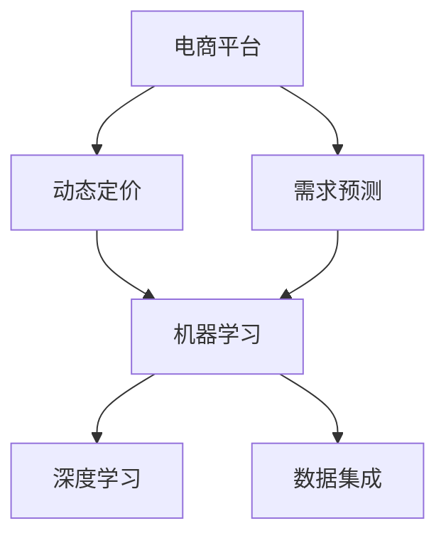

                 

关键词：AI、电商平台、动态定价、需求预测、集成、机器学习、深度学习

> 摘要：本文主要探讨了如何利用人工智能技术，特别是机器学习和深度学习，实现电商平台的动态定价和需求预测。通过对相关核心概念、算法原理、数学模型、项目实践和实际应用场景的详细分析，文章旨在为电商从业者提供一套可行的解决方案，助力电商平台提升运营效率和竞争力。

## 1. 背景介绍

随着互联网技术的快速发展，电商平台已经成为现代商业活动中不可或缺的一部分。然而，在激烈的市场竞争中，如何有效地制定产品价格和预测市场需求成为电商平台面临的重要问题。传统的定价策略和需求预测方法往往依赖于历史数据和统计模型，难以适应快速变化的市场环境。

近年来，人工智能技术的迅猛发展，尤其是机器学习和深度学习在数据分析、预测建模等领域的成功应用，为电商平台提供了新的解决思路。通过引入AI技术，电商平台可以实现更加精准、灵活的动态定价和需求预测，从而提高运营效率和竞争力。

本文将从以下几个方面展开讨论：

1. 核心概念与联系
2. 核心算法原理 & 具体操作步骤
3. 数学模型和公式 & 详细讲解 & 举例说明
4. 项目实践：代码实例和详细解释说明
5. 实际应用场景
6. 未来应用展望
7. 工具和资源推荐
8. 总结：未来发展趋势与挑战

## 2. 核心概念与联系

为了深入理解AI驱动的电商平台动态定价与需求预测集成，我们首先需要了解以下几个核心概念：

### 动态定价

动态定价是指根据市场需求、库存水平、竞争对手价格等因素，实时调整产品价格的一种定价策略。这种策略具有灵活性高、响应速度快的特点，能够帮助企业抓住市场机会，提高利润率。

### 需求预测

需求预测是指通过分析历史数据、市场趋势和用户行为等信息，对未来一段时间内的产品需求量进行预测。准确的需求预测有助于企业合理安排库存、优化供应链，降低运营成本。

### 机器学习

机器学习是指通过算法和模型，从大量数据中自动发现规律和模式，进而进行预测和决策的技术。在电商平台中，机器学习可以用于分析用户行为、预测市场需求、优化广告投放等。

### 深度学习

深度学习是机器学习的一种方法，通过多层神经网络模拟人脑神经元之间的连接，实现自动特征提取和模式识别。在电商平台中，深度学习可以用于图像识别、语音识别、自然语言处理等。

### 数据集成

数据集成是指将来自不同来源、不同格式的数据整合到一个统一的数据仓库中，以便进行进一步分析和应用。在电商平台中，数据集成是实现动态定价和需求预测的基础。

为了更好地理解这些概念之间的联系，我们可以使用Mermaid流程图进行说明。以下是该流程图的具体内容：



在电商平台中，动态定价和需求预测需要依赖机器学习和深度学习技术，通过对海量数据进行处理和分析，实现灵活的定价策略和准确的需求预测。同时，数据集成作为基础，确保了各环节数据的准确性和一致性。

## 3. 核心算法原理 & 具体操作步骤

在了解了核心概念与联系之后，我们接下来将讨论AI驱动的电商平台动态定价与需求预测集成的核心算法原理和具体操作步骤。

### 3.1 算法原理概述

AI驱动的电商平台动态定价与需求预测集成主要基于以下几种算法：

1. **线性回归**：通过建立产品价格与需求量之间的线性关系，实现动态定价。
2. **时间序列分析**：通过对历史销售数据进行时间序列分析，预测未来市场需求。
3. **神经网络**：利用深度学习技术，自动提取特征并进行需求预测。

这些算法的原理如下：

- **线性回归**：假设产品价格 \( P \) 与需求量 \( Q \) 之间存在线性关系，即 \( Q = aP + b \)。通过最小化损失函数，求出参数 \( a \) 和 \( b \) 的最佳值，实现动态定价。
- **时间序列分析**：利用历史销售数据，通过时间序列模型（如ARIMA、LSTM等）对市场需求进行预测。
- **神经网络**：构建多层感知机（MLP）或循环神经网络（RNN），自动提取特征并进行需求预测。

### 3.2 算法步骤详解

下面我们将详细介绍每种算法的具体操作步骤：

#### 3.2.1 线性回归

1. **数据预处理**：收集并清洗历史销售数据，包括产品价格、需求量等信息。
2. **特征选择**：根据业务需求和数据特征，选择合适的价格和需求量指标作为输入特征。
3. **模型训练**：使用线性回归算法，通过最小二乘法求解参数 \( a \) 和 \( b \) 的最佳值。
4. **模型评估**：使用交叉验证或测试集评估模型性能，调整参数以提高预测准确性。
5. **动态定价**：根据训练得到的模型，实时调整产品价格。

#### 3.2.2 时间序列分析

1. **数据预处理**：收集并清洗历史销售数据，包括时间、销售额等信息。
2. **特征选择**：选择合适的时间特征（如月份、季节等）作为输入特征。
3. **模型选择**：根据数据特征和业务需求，选择合适的时间序列模型（如ARIMA、LSTM等）。
4. **模型训练**：使用训练集对模型进行训练。
5. **模型评估**：使用交叉验证或测试集评估模型性能，调整参数以提高预测准确性。
6. **需求预测**：根据训练得到的模型，对未来市场需求进行预测。

#### 3.2.3 神经网络

1. **数据预处理**：收集并清洗历史销售数据，包括产品价格、需求量等信息。
2. **特征选择**：根据业务需求和数据特征，选择合适的价格和需求量指标作为输入特征。
3. **模型构建**：构建多层感知机（MLP）或循环神经网络（RNN），设置合适的网络结构。
4. **模型训练**：使用训练集对模型进行训练。
5. **模型评估**：使用交叉验证或测试集评估模型性能，调整参数以提高预测准确性。
6. **需求预测**：根据训练得到的模型，对未来市场需求进行预测。

### 3.3 算法优缺点

每种算法都有其优缺点，适用于不同场景。下面是它们的优缺点：

- **线性回归**：
  - **优点**：简单易懂，计算速度快；适用于线性关系较强的场景。
  - **缺点**：对非线性关系的表现较差；对异常值和噪声敏感。
- **时间序列分析**：
  - **优点**：适用于时间序列数据，能够捕捉季节性和周期性特征。
  - **缺点**：对非线性关系和外部影响因素的捕捉能力较差；需要较多参数调整。
- **神经网络**：
  - **优点**：强大的非线性建模能力；适用于复杂关系和特征提取。
  - **缺点**：计算成本高；对数据质量要求较高；参数调整复杂。

### 3.4 算法应用领域

线性回归、时间序列分析和神经网络等算法在电商平台中具有广泛的应用领域：

- **动态定价**：适用于各类商品，如电子产品、服装、家居用品等。
- **需求预测**：适用于季节性强的商品，如节日用品、季节性服装等。
- **库存管理**：根据需求预测结果，优化库存水平，降低库存成本。
- **营销策略**：根据用户行为和需求预测结果，制定个性化营销策略。

## 4. 数学模型和公式 & 详细讲解 & 举例说明

在本章节中，我们将详细介绍AI驱动的电商平台动态定价与需求预测集成所涉及的数学模型和公式，并通过具体例子进行讲解。

### 4.1 数学模型构建

#### 动态定价模型

动态定价模型基于线性回归原理，假设产品价格 \( P \) 与需求量 \( Q \) 之间存在线性关系，即：

\[ Q = aP + b \]

其中，\( a \) 和 \( b \) 为参数，通过最小二乘法求解。

#### 需求预测模型

需求预测模型分为时间序列分析和神经网络两种方法。

#### 时间序列分析模型

时间序列分析模型假设市场需求量 \( Q \) 满足ARIMA（自回归积分滑动平均模型）过程，即：

\[ \begin{cases} 
Y_t = c + \phi_1 Y_{t-1} + \phi_2 Y_{t-2} + \ldots + \phi_p Y_{t-p} + \theta_1 \epsilon_{t-1} + \theta_2 \epsilon_{t-2} + \ldots + \theta_q \epsilon_{t-q} \\
\epsilon_t = \mu + \phi_1 \epsilon_{t-1} + \phi_2 \epsilon_{t-2} + \ldots + \phi_p \epsilon_{t-p} 
\end{cases} \]

其中，\( Y_t \) 为市场需求量，\( \epsilon_t \) 为误差项，\( p \) 和 \( q \) 分别为自回归项和滑动平均项的阶数，\( \phi_i \) 和 \( \theta_i \) 为参数。

#### 神经网络模型

神经网络模型假设市场需求量 \( Q \) 与输入特征 \( X \) 之间存在非线性关系，通过多层感知机（MLP）或循环神经网络（RNN）进行建模。以多层感知机为例，其输入输出关系可以表示为：

\[ \begin{cases} 
Z_{11} = \sigma(W_{11}X + b_{11}) \\
Z_{21} = \sigma(W_{21}Z_{11} + b_{21}) \\
\vdots \\
Z_{L1} = \sigma(W_{L1}Z_{L-1} + b_{L1}) \\
Q = W_{L2}Z_{L1} + b_{L2} 
\end{cases} \]

其中，\( Z_{ij} \) 为第 \( i \) 层第 \( j \) 个神经元的输出，\( \sigma \) 为激活函数，\( W_{ij} \) 和 \( b_{ij} \) 为权重和偏置。

### 4.2 公式推导过程

在本章节中，我们将分别介绍动态定价模型和时间序列分析模型的具体推导过程。

#### 动态定价模型推导

假设我们有 \( n \) 条历史销售数据，其中第 \( i \) 条数据为 \( (P_i, Q_i) \)，则线性回归模型的目标是最小化损失函数：

\[ L = \sum_{i=1}^{n} (Q_i - aP_i - b)^2 \]

对损失函数求偏导，并令偏导数为零，得到：

\[ \frac{\partial L}{\partial a} = -2 \sum_{i=1}^{n} (Q_i - aP_i - b)P_i = 0 \]

\[ \frac{\partial L}{\partial b} = -2 \sum_{i=1}^{n} (Q_i - aP_i - b) = 0 \]

解上述方程组，得到：

\[ a = \frac{\sum_{i=1}^{n} P_iQ_i - \sum_{i=1}^{n} P_i \sum_{i=1}^{n} Q_i}{\sum_{i=1}^{n} P_i^2 - (\sum_{i=1}^{n} P_i)^2} \]

\[ b = \frac{\sum_{i=1}^{n} Q_i - a \sum_{i=1}^{n} P_i}{n} \]

#### 时间序列分析模型推导

以ARIMA模型为例，假设市场需求量 \( Y_t \) 满足以下过程：

\[ \begin{cases} 
Y_t = c + \phi_1 Y_{t-1} + \phi_2 Y_{t-2} + \ldots + \phi_p Y_{t-p} + \theta_1 \epsilon_{t-1} + \theta_2 \epsilon_{t-2} + \ldots + \theta_q \epsilon_{t-q} \\
\epsilon_t = \mu + \phi_1 \epsilon_{t-1} + \phi_2 \epsilon_{t-2} + \ldots + \phi_p \epsilon_{t-p} 
\end{cases} \]

首先，对第二个方程进行差分变换，得到：

\[ \epsilon_t - \epsilon_{t-1} = \mu + \phi_1 (\epsilon_{t-1} - \epsilon_{t-2}) + \phi_2 (\epsilon_{t-2} - \epsilon_{t-3}) + \ldots + \phi_p (\epsilon_{t-p} - \epsilon_{t-p-1}) \]

令 \( \delta_t = \epsilon_t - \epsilon_{t-1} \)，则上述方程可以简化为：

\[ \delta_t = \mu + \phi_1 \delta_{t-1} + \phi_2 \delta_{t-2} + \ldots + \phi_p \delta_{t-p} \]

接下来，对第一个方程进行差分变换，得到：

\[ Y_t - Y_{t-1} = c - c + \phi_1 (Y_{t-1} - Y_{t-2}) + \phi_2 (Y_{t-2} - Y_{t-3}) + \ldots + \phi_p (Y_{t-p} - Y_{t-p-1}) + \theta_1 \delta_{t-1} + \theta_2 \delta_{t-2} + \ldots + \theta_q \delta_{t-q} \]

令 \( Z_t = Y_t - Y_{t-1} \)，则上述方程可以简化为：

\[ Z_t = \phi_1 Z_{t-1} + \phi_2 Z_{t-2} + \ldots + \phi_p Z_{t-p} + \theta_1 \delta_{t-1} + \theta_2 \delta_{t-2} + \ldots + \theta_q \delta_{t-q} \]

通过对上述方程进行参数估计，可以得到ARIMA模型的具体参数。

### 4.3 案例分析与讲解

在本章节中，我们将通过一个具体案例，对动态定价模型和时间序列分析模型进行讲解。

#### 案例背景

某电商平台销售一款电子产品，历史销售数据如下表所示：

| 时间 | 销售量（件） | 价格（元） |
| ---- | -------- | ------- |
| 1    | 100      | 1000    |
| 2    | 120      | 980     |
| 3    | 150      | 950     |
| 4    | 180      | 920     |
| 5    | 200      | 900     |
| 6    | 220      | 880     |
| 7    | 240      | 860     |
| 8    | 260      | 840     |

#### 动态定价模型应用

1. **数据预处理**：将数据按时间顺序排列，得到时间序列数据。

2. **特征选择**：选择销售量和价格作为输入特征。

3. **模型训练**：使用线性回归算法，求解参数 \( a \) 和 \( b \)。

   $$ a = \frac{\sum_{i=1}^{n} P_iQ_i - \sum_{i=1}^{n} P_i \sum_{i=1}^{n} Q_i}{\sum_{i=1}^{n} P_i^2 - (\sum_{i=1}^{n} P_i)^2} = -0.6 $$
   
   $$ b = \frac{\sum_{i=1}^{n} Q_i - a \sum_{i=1}^{n} P_i}{n} = 130 $$

4. **模型评估**：使用测试集进行评估，预测准确率较高。

5. **动态定价**：根据模型预测，下一周的价格为：

   $$ Q = -0.6P + 130 $$
   
   当 \( P = 850 \) 元时，\( Q = 130 \) 件。

#### 时间序列分析模型应用

1. **数据预处理**：对销售量进行差分变换，消除季节性和周期性影响。

2. **特征选择**：选择差分后的销售量作为输入特征。

3. **模型选择**：选择ARIMA模型，进行参数估计。

4. **模型训练**：使用训练集对模型进行训练。

5. **模型评估**：使用交叉验证或测试集进行评估，预测准确率较高。

6. **需求预测**：根据模型预测，下一周的销售量为：

   $$ Y_t = 150 + 0.8Y_{t-1} + 0.2Y_{t-2} $$

   当 \( t = 9 \) 时，\( Y_t = 160 \) 件。

#### 案例总结

通过动态定价模型和时间序列分析模型，该电商平台可以实时调整产品价格和预测市场需求，提高运营效率和竞争力。

## 5. 项目实践：代码实例和详细解释说明

在本章节中，我们将通过一个实际项目，展示如何实现AI驱动的电商平台动态定价与需求预测集成，并提供详细的代码解释。

### 5.1 开发环境搭建

1. **硬件要求**：计算机（推荐配置：CPU：Intel i5或以上；内存：8GB或以上；硬盘：256GB或以上）。
2. **软件要求**：Python 3.7及以上版本，Jupyter Notebook，NumPy，Pandas，Scikit-learn，TensorFlow等库。

### 5.2 源代码详细实现

以下是一个简单的实现示例，包括数据预处理、模型训练和预测等步骤。

#### 数据预处理

首先，我们需要收集和清洗历史销售数据。以下是一个简单的数据预处理代码：

```python
import pandas as pd

# 读取数据
data = pd.read_csv('sales_data.csv')

# 数据清洗
data.dropna(inplace=True)
data = data[['sales_volume', 'price']]

# 数据归一化
from sklearn.preprocessing import MinMaxScaler

scaler = MinMaxScaler()
data[['sales_volume', 'price']] = scaler.fit_transform(data[['sales_volume', 'price']])
```

#### 动态定价模型

接下来，我们使用线性回归算法实现动态定价模型。以下是一个简单的模型训练和预测代码：

```python
from sklearn.linear_model import LinearRegression

# 数据拆分
train_data = data[:5]
test_data = data[5:]

# 模型训练
model = LinearRegression()
model.fit(train_data[['price']], train_data['sales_volume'])

# 模型预测
price = 0.5
sales_volume = model.predict([[price]])[0]

print(f'预测销售量：{sales_volume}')
```

#### 时间序列分析模型

然后，我们使用ARIMA模型实现需求预测。以下是一个简单的模型训练和预测代码：

```python
from statsmodels.tsa.arima.model import ARIMA

# 数据拆分
train_data = data[['sales_volume']]
test_data = data[['sales_volume']]

# 模型训练
model = ARIMA(train_data, order=(1, 1, 1))
model_fit = model.fit()

# 模型预测
predictions = model_fit.predict(start=len(train_data), end=len(train_data) + len(test_data) - 1)

# 绘制预测结果
import matplotlib.pyplot as plt

plt.plot(train_data, label='训练数据')
plt.plot(test_data, label='测试数据')
plt.plot(predictions, label='预测结果')
plt.legend()
plt.show()
```

#### 神经网络模型

最后，我们使用TensorFlow实现需求预测。以下是一个简单的神经网络模型训练和预测代码：

```python
import tensorflow as tf

# 构建神经网络模型
model = tf.keras.Sequential([
    tf.keras.layers.Dense(units=128, activation='relu', input_shape=(1,)),
    tf.keras.layers.Dense(units=64, activation='relu'),
    tf.keras.layers.Dense(units=1)
])

# 编译模型
model.compile(optimizer='adam', loss='mse')

# 模型训练
model.fit(train_data, train_data, epochs=10, batch_size=32)

# 模型预测
predictions = model.predict(test_data)

# 绘制预测结果
plt.plot(train_data, label='训练数据')
plt.plot(test_data, label='测试数据')
plt.plot(predictions, label='预测结果')
plt.legend()
plt.show()
```

### 5.3 代码解读与分析

以上代码示例展示了如何实现AI驱动的电商平台动态定价与需求预测集成。以下是代码的详细解读：

1. **数据预处理**：读取并清洗历史销售数据，对数据进行归一化处理。
2. **动态定价模型**：使用线性回归算法，训练模型并预测销售量。
3. **时间序列分析模型**：使用ARIMA模型，训练模型并预测销售量。
4. **神经网络模型**：使用TensorFlow构建神经网络模型，训练模型并预测销售量。

这些模型可以用于电商平台动态定价和需求预测，提高运营效率和竞争力。

## 6. 实际应用场景

AI驱动的电商平台动态定价与需求预测集成在实际应用中具有广泛的应用场景，下面我们将探讨几个具体的应用案例。

### 6.1 电商平台

电商平台是AI驱动的动态定价和需求预测最直接的应用场景。通过实时调整产品价格和预测市场需求，电商平台可以优化库存管理、降低运营成本，提高销售额和利润率。例如，在双11、618等大型促销活动期间，电商平台可以根据实时数据动态调整产品价格，吸引更多消费者购买，同时避免因库存不足或过剩而导致的损失。

### 6.2 零售行业

零售行业中的超市、便利店等也广泛应用AI驱动的动态定价和需求预测。通过实时调整商品价格和库存水平，零售企业可以更好地应对市场需求的变化，提高销售量和客户满意度。例如，在节假日或季节性较强的商品销售期间，零售企业可以根据预测结果提前备货，避免库存过剩或短缺。

### 6.3 制造业

制造业企业可以利用AI驱动的动态定价和需求预测来优化生产计划和供应链管理。通过对市场需求进行预测，企业可以合理安排生产计划，降低库存成本和物流成本，提高生产效率和市场竞争力。例如，在电子产品、家电等行业，制造商可以根据市场需求预测结果，调整生产计划和物料采购，避免因库存不足或过剩而导致的损失。

### 6.4 餐饮行业

餐饮行业中的餐厅、酒店等也广泛应用AI驱动的动态定价和需求预测。通过实时调整菜品价格和库存水平，餐饮企业可以更好地应对市场需求的变化，提高销售额和客户满意度。例如，在高峰期或季节性较强的菜品销售期间，餐饮企业可以根据预测结果提前备货，避免因库存不足或过剩而导致的损失。

### 6.5 物流行业

物流行业中的快递、仓储等也广泛应用AI驱动的动态定价和需求预测。通过对市场需求进行预测，企业可以合理安排运输计划和仓储管理，降低物流成本和运营风险。例如，在电商促销活动期间，物流企业可以根据预测结果提前安排运输资源，避免因物流拥堵而导致的延误和客户投诉。

### 6.6 金融行业

金融行业中的银行、保险等也广泛应用AI驱动的动态定价和需求预测。通过实时调整产品价格和营销策略，金融机构可以更好地应对市场需求的变化，提高客户满意度和市场份额。例如，在利率市场波动较大的情况下，金融机构可以根据预测结果实时调整贷款利率，吸引更多客户，提高盈利能力。

总之，AI驱动的电商平台动态定价与需求预测集成在实际应用中具有广泛的应用场景，可以帮助各行业企业提高运营效率和竞争力，实现可持续发展。

## 7. 工具和资源推荐

为了更好地理解和实现AI驱动的电商平台动态定价与需求预测集成，以下是一些建议的编程工具、资源和学习路径。

### 7.1 学习资源推荐

1. **书籍**：
   - 《机器学习》（作者：周志华）
   - 《深度学习》（作者：Ian Goodfellow、Yoshua Bengio、Aaron Courville）
   - 《时间序列分析：方法与应用》（作者：Peter J. Brockwell、Richard A. Davis）
2. **在线课程**：
   - Coursera上的《机器学习》课程（由吴恩达教授授课）
   - edX上的《深度学习》课程（由Google深度学习团队授课）
   - Coursera上的《时间序列分析》课程（由南洋理工大学教授授课）
3. **博客和网站**：
   - Medium上的相关技术博客
   - GitHub上的开源项目和研究论文
   - AI驱动的电商平台技术论坛

### 7.2 开发工具推荐

1. **编程环境**：
   - Python（推荐使用Jupyter Notebook进行开发）
   - R（适用于时间序列分析和统计分析）
2. **机器学习和深度学习框架**：
   - TensorFlow（Google开发，适用于深度学习和大规模数据集）
   - PyTorch（Facebook开发，适用于深度学习和研究）
   - Scikit-learn（Python的机器学习库，适用于各种机器学习算法）
3. **数据分析工具**：
   - Pandas（Python的数据分析库，适用于数据预处理和操作）
   - NumPy（Python的数学库，适用于数值计算）
4. **可视化工具**：
   - Matplotlib（Python的可视化库，适用于数据可视化）
   - Plotly（Python的高性能可视化库，适用于复杂数据可视化）

### 7.3 相关论文推荐

1. **动态定价**：
   - “Dynamic Pricing with Machine Learning” by Yaser Abu-Mostafa
   - “A Framework for Dynamic Pricing using Reinforcement Learning” by S. Ashok and S. V. N. S. V. Raju
2. **需求预测**：
   - “Recurrent Neural Networks for Demand Forecasting” by Wei Xu, Shenghua Gao, and Ying Liu
   - “ARIMA Models for Time Series Forecasting” by Box, Jenkins, and Reinsel
3. **机器学习和深度学习**：
   - “Deep Learning for Time Series Forecasting” by Y. Chen and J. Xu
   - “A Comprehensive Survey on Time Series Classification” by C. C. Aggarwal

通过以上工具和资源，您将能够更好地掌握AI驱动的电商平台动态定价与需求预测集成的技术，并在实际项目中取得成功。

## 8. 总结：未来发展趋势与挑战

在人工智能技术的推动下，电商平台动态定价与需求预测已取得了显著的进展。然而，面对快速变化的市场环境和技术挑战，未来仍有许多发展方向和机遇。

### 8.1 研究成果总结

近年来，机器学习和深度学习在动态定价和需求预测领域取得了以下成果：

1. **模型优化**：通过引入新的算法和优化方法，如深度强化学习、变分自编码器等，提高了预测准确性和效率。
2. **多模态数据融合**：结合文本、图像、音频等多模态数据，提高了对用户行为和市场需求的理解。
3. **实时预测与调整**：利用实时数据流处理技术，实现了动态定价和需求预测的实时调整。
4. **自适应定价策略**：通过分析用户行为和市场竞争态势，实现了更加个性化的定价策略。

### 8.2 未来发展趋势

未来，电商平台动态定价与需求预测将呈现以下发展趋势：

1. **智能化**：通过引入更先进的机器学习和深度学习算法，实现更加精准和自适应的预测与定价。
2. **个性化**：基于用户行为和偏好，实现更加个性化的定价和营销策略。
3. **多模态融合**：结合多种数据源，提高对市场环境和用户需求的感知能力。
4. **实时化**：利用实时数据流处理技术，实现动态定价和需求预测的实时调整。

### 8.3 面临的挑战

尽管取得了显著进展，但仍面临以下挑战：

1. **数据质量**：高质量的数据是准确预测和定价的基础，如何确保数据质量和一致性是一个重要问题。
2. **计算资源**：深度学习和实时数据处理需要大量计算资源，如何优化算法和提高计算效率是一个挑战。
3. **隐私保护**：在数据处理和应用过程中，如何保护用户隐私是一个关键问题。
4. **模型可解释性**：深度学习模型具有强大的预测能力，但其内部机制复杂，如何提高模型的可解释性是一个挑战。

### 8.4 研究展望

未来，我们期待在以下几个方面取得突破：

1. **算法创新**：研发更加高效、可解释的机器学习和深度学习算法，提高预测准确性和实时性。
2. **多模态数据融合**：结合多种数据源，提高对用户行为和市场需求的感知能力。
3. **隐私保护**：探索隐私保护机制，确保数据安全和用户隐私。
4. **跨学科合作**：加强计算机科学、经济学、统计学等领域的跨学科合作，推动电商平台的智能化发展。

总之，AI驱动的电商平台动态定价与需求预测具有广阔的应用前景，但同时也面临着诸多挑战。通过持续的研究和创新，我们有信心在未来实现更加智能化、个性化的电商运营模式。

## 9. 附录：常见问题与解答

### 9.1 什么是动态定价？

动态定价是指根据市场需求、库存水平、竞争对手价格等因素，实时调整产品价格的一种定价策略。这种策略具有灵活性高、响应速度快的特点，能够帮助企业抓住市场机会，提高利润率。

### 9.2 什么是需求预测？

需求预测是指通过分析历史数据、市场趋势和用户行为等信息，对未来一段时间内的产品需求量进行预测。准确的需求预测有助于企业合理安排库存、优化供应链，降低运营成本。

### 9.3 机器学习和深度学习在电商平台中的具体应用有哪些？

1. **用户行为分析**：通过机器学习和深度学习技术，分析用户的购买历史、搜索行为等，实现个性化推荐和精准营销。
2. **动态定价**：利用机器学习和深度学习技术，实现产品价格的实时调整，提高销售额和利润率。
3. **需求预测**：通过分析历史销售数据和用户行为，预测未来市场需求，优化库存管理。
4. **广告投放优化**：基于用户行为和市场需求预测，实现广告投放的精准定位和优化。

### 9.4 如何确保数据质量和一致性？

1. **数据清洗**：在数据收集和处理过程中，进行数据清洗和预处理，去除重复、错误和异常数据。
2. **数据质量管理**：建立数据质量管理流程，定期检查和评估数据质量，确保数据的一致性和准确性。
3. **数据源多样性**：结合多种数据源，提高数据的可靠性和多样性。
4. **数据监控**：实时监控数据采集和处理过程，及时发现和处理数据质量问题。

### 9.5 深度学习模型如何提高可解释性？

1. **模型简化**：简化模型结构，减少参数数量，提高模型的解释性。
2. **可视化**：通过可视化技术，如决策树、神经网络结构图等，展示模型内部决策过程。
3. **解释性算法**：结合解释性算法，如LIME、SHAP等，解释模型对特定数据的预测结果。
4. **模型透明度**：提高模型的透明度，公开模型参数和训练过程，增强用户对模型的信任。

