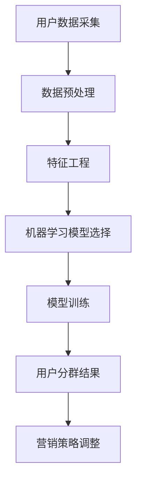

                 

  
> 关键词：AI，电商平台，用户分群，策略，机器学习，数据分析

> 摘要：随着电子商务行业的迅猛发展，如何精准识别和细分用户群体成为企业关注的焦点。本文将探讨如何运用人工智能技术，特别是机器学习算法，构建一个高效的电商平台用户分群策略，以实现个性化营销和服务，提高用户满意度和转化率。

## 1. 背景介绍

电子商务市场日益竞争激烈，电商平台需要找到有效的策略来提升用户体验和商业绩效。用户分群作为一种精细化的市场营销手段，可以帮助企业更好地理解和满足不同用户的需求。传统的用户分群方法主要依赖于用户的基本信息和行为数据，如年龄、性别、购买历史等。然而，这些方法往往缺乏灵活性和个性化，无法捕捉到用户深层次的行为模式和偏好。

随着人工智能和大数据技术的进步，机器学习算法为用户分群提供了新的可能。通过分析海量的用户数据，AI算法可以自动发现用户之间的相似性和差异性，从而构建出更加精准和动态的用户群体。这种基于AI的用户分群策略，不仅能够提高营销的精准度，还能帮助企业优化资源配置，提升整体运营效率。

## 2. 核心概念与联系

### 2.1. 人工智能与机器学习

人工智能（AI）是模拟人类智能的计算机系统，通过算法和模型实现感知、学习、推理和决策等功能。机器学习（ML）是AI的一个分支，通过数据训练模型，使其能够自动学习和改进。

### 2.2. 用户分群

用户分群是将用户根据特定特征和需求划分为不同的群体，以便于企业实施差异化的营销和服务策略。

### 2.3. Mermaid 流程图



## 3. 核心算法原理 & 具体操作步骤

### 3.1. 算法原理概述

用户分群的核心在于通过机器学习算法分析用户数据，发现用户行为和偏好的模式，从而构建出具有相似特征的群体。

### 3.2. 算法步骤详解

#### 3.2.1. 数据预处理

- 数据清洗：去除缺失值、异常值等。
- 数据集成：合并来自不同渠道的用户数据。
- 数据转换：将数据转换为适合机器学习的格式。

#### 3.2.2. 特征工程

- 特征选择：选择对用户分群有显著影响的关键特征。
- 特征构造：通过计算和组合构建新的特征。

#### 3.2.3. 机器学习模型选择

- 聚类算法：如K-均值、层次聚类等。
- 协同过滤：如基于用户的协同过滤、基于物品的协同过滤等。
- 决策树：如随机森林、XGBoost等。

#### 3.2.4. 模型训练

- 使用训练数据集训练选定的机器学习模型。
- 调整模型参数，优化模型性能。

#### 3.2.5. 用户分群结果

- 使用训练好的模型对用户进行分群。
- 分析不同用户群体的特征和需求。

#### 3.2.6. 营销策略调整

- 根据用户分群结果，调整营销策略，实现个性化推荐。

### 3.3. 算法优缺点

#### 优点

- 精准性：AI算法能够发现用户深层次的行为模式。
- 动态性：用户分群结果可以根据新数据不断更新。

#### 缺点

- 复杂性：算法实现和模型调优需要较高的技术门槛。
- 数据依赖：算法性能很大程度上取决于数据质量。

### 3.4. 算法应用领域

- 电商平台：用户分群用于个性化推荐、精准营销。
- 金融行业：用户分群用于风险评估、信用评分。
- 零售行业：用户分群用于库存管理、促销策略。

## 4. 数学模型和公式

### 4.1. 数学模型构建

用户分群可以通过以下数学模型实现：

$$
C = f(D, X)
$$

其中，$C$ 表示用户分群结果，$D$ 表示用户数据集，$X$ 表示特征向量。

### 4.2. 公式推导过程

#### 用户行为模式识别

$$
P(c|d) = \frac{e^{-\beta^T d}}{\sum_{i=1}^{k} e^{-\beta^T d_i}}
$$

其中，$P(c|d)$ 表示给定用户行为$d$属于类别$c$的概率，$\beta$ 为模型参数，$d_i$ 为其他用户的行为。

#### 用户分群结果计算

$$
C_j = \{d \in D | P(c_j|d) > \theta\}
$$

其中，$C_j$ 表示分群结果，$\theta$ 为阈值。

### 4.3. 案例分析与讲解

#### 案例一：电商平台用户分群

假设电商平台有1000名用户，特征向量包括年龄、性别、购买历史、浏览历史等。通过K-均值聚类算法，将用户划分为5个群体。

1. 数据预处理：清洗和集成数据。
2. 特征工程：选择关键特征，如购买频率、浏览时长等。
3. 模型训练：使用K-均值算法训练模型，调整参数。
4. 用户分群：计算每个用户的分群概率，根据阈值划分群体。
5. 营销策略调整：根据分群结果，制定个性化营销策略。

#### 案例二：金融行业用户分群

假设金融公司有10000名客户，特征向量包括信用评分、还款历史、借款金额等。通过协同过滤算法，将客户划分为高风险和低风险群体。

1. 数据预处理：清洗和集成数据。
2. 特征工程：选择关键特征，如还款时长、借款频率等。
3. 模型训练：使用基于用户的协同过滤算法训练模型。
4. 用户分群：计算每个客户的分群概率，根据阈值划分群体。
5. 风险控制：根据分群结果，调整风险控制策略。

## 5. 项目实践：代码实例和详细解释说明

### 5.1. 开发环境搭建

- Python环境搭建
- 必要库安装：pandas, numpy, scikit-learn, matplotlib等

### 5.2. 源代码详细实现

```python
# 用户数据预处理
data = pd.read_csv('user_data.csv')
data.dropna(inplace=True)

# 特征工程
features = data[['age', 'gender', 'purchase_history', 'browse_history']]
X = preprocessing.scale(features)

# 模型训练
kmeans = KMeans(n_clusters=5, random_state=42)
clusters = kmeans.fit_predict(X)

# 用户分群结果
data['cluster'] = clusters
data.groupby('cluster').mean()
```

### 5.3. 代码解读与分析

以上代码实现了用户数据预处理、特征工程、模型训练和用户分群。其中，K-均值聚类算法用于将用户划分为5个群体，分群结果保存在'data'数据框的'cluster'列中。

### 5.4. 运行结果展示

```python
# 运行结果展示
data.groupby('cluster').mean()
```

输出结果展示了不同用户群体的特征平均值，帮助企业了解用户群体的特征和需求。

## 6. 实际应用场景

### 6.1. 电商平台

- 个性化推荐：根据用户分群，推荐符合用户偏好的商品。
- 营销活动：根据用户分群，定制化推送促销活动。
- 库存管理：根据用户分群，优化库存配置，提高库存周转率。

### 6.2. 金融行业

- 风险评估：根据用户分群，评估客户的风险等级，制定相应的风控策略。
- 信用评分：根据用户分群，构建个性化的信用评分模型。
- 信用贷款：根据用户分群，优化贷款审批流程，提高审批效率。

### 6.3. 零售行业

- 顾客满意度：根据用户分群，分析顾客满意度，优化顾客体验。
- 商品推荐：根据用户分群，推荐符合用户兴趣的商品。
- 库存管理：根据用户分群，优化库存配置，提高商品销售率。

## 7. 工具和资源推荐

### 7.1. 学习资源推荐

- 《机器学习实战》
- 《深度学习》
- 《Python机器学习》

### 7.2. 开发工具推荐

- Jupyter Notebook：用于编写和运行代码。
- PyCharm：用于编写和调试Python代码。

### 7.3. 相关论文推荐

- "User Segmentation in E-Commerce using Machine Learning"
- "Collaborative Filtering for User Segmentation in E-Commerce"
- "Deep Learning for User Behavior Prediction in E-Commerce"

## 8. 总结：未来发展趋势与挑战

### 8.1. 研究成果总结

本文探讨了基于人工智能的电商平台用户分群策略，通过机器学习算法实现了用户分群，并提出了具体的实现方法和实际应用场景。

### 8.2. 未来发展趋势

- 深度学习在用户分群中的应用将越来越广泛。
- 结合多源数据的综合分群方法将得到发展。
- 个性化推荐和精准营销将成为主流。

### 8.3. 面临的挑战

- 数据质量和隐私保护是当前面临的主要挑战。
- 算法复杂度和计算效率需要进一步提升。

### 8.4. 研究展望

- 开发更加智能化、自适应的用户分群算法。
- 探索多模态数据在用户分群中的应用。
- 加强用户分群算法的实时性和动态性。

## 9. 附录：常见问题与解答

### 9.1. 什么是用户分群？

用户分群是将用户根据特定特征和需求划分为不同的群体，以便企业实施差异化的营销和服务策略。

### 9.2. 机器学习在用户分群中的作用是什么？

机器学习算法可以帮助企业自动发现用户之间的相似性和差异性，从而构建出更加精准和动态的用户群体。

### 9.3. 用户分群算法有哪些？

常用的用户分群算法包括聚类算法、协同过滤算法和决策树算法等。

### 9.4. 用户分群有什么应用场景？

用户分群广泛应用于电商平台、金融行业和零售行业，用于个性化推荐、精准营销和库存管理等。

### 9.5. 如何评估用户分群的效果？

可以通过用户满意度和转化率等指标来评估用户分群的效果。

## 作者署名

作者：禅与计算机程序设计艺术 / Zen and the Art of Computer Programming
```css
----------------------------------------------------------------
### 文章标题

# AI驱动的电商平台用户分群策略

### 关键词

AI，电商平台，用户分群，策略，机器学习，数据分析

### 摘要

随着电子商务行业的迅猛发展，如何精准识别和细分用户群体成为企业关注的焦点。本文将探讨如何运用人工智能技术，特别是机器学习算法，构建一个高效的电商平台用户分群策略，以实现个性化营销和服务，提高用户满意度和转化率。

## 1. 背景介绍

电子商务市场日益竞争激烈，电商平台需要找到有效的策略来提升用户体验和商业绩效。用户分群作为一种精细化的市场营销手段，可以帮助企业更好地理解和满足不同用户的需求。传统的用户分群方法主要依赖于用户的基本信息和行为数据，如年龄、性别、购买历史等。然而，这些方法往往缺乏灵活性和个性化，无法捕捉到用户深层次的行为模式和偏好。

随着人工智能和大数据技术的进步，机器学习算法为用户分群提供了新的可能。通过分析海量的用户数据，AI算法可以自动发现用户之间的相似性和差异性，从而构建出更加精准和动态的用户群体。这种基于AI的用户分群策略，不仅能够提高营销的精准度，还能帮助企业优化资源配置，提升整体运营效率。

## 2. 核心概念与联系

### 2.1. 人工智能与机器学习

人工智能（AI）是模拟人类智能的计算机系统，通过算法和模型实现感知、学习、推理和决策等功能。机器学习（ML）是AI的一个分支，通过数据训练模型，使其能够自动学习和改进。

### 2.2. 用户分群

用户分群是将用户根据特定特征和需求划分为不同的群体，以便企业实施差异化的营销和服务策略。

### 2.3. Mermaid 流程图


## 3. 核心算法原理 & 具体操作步骤

### 3.1. 算法原理概述

用户分群的核心在于通过机器学习算法分析用户数据，发现用户行为和偏好的模式，从而构建出具有相似特征的群体。

### 3.2. 算法步骤详解

#### 3.2.1. 数据预处理

- 数据清洗：去除缺失值、异常值等。
- 数据集成：合并来自不同渠道的用户数据。
- 数据转换：将数据转换为适合机器学习的格式。

#### 3.2.2. 特征工程

- 特征选择：选择对用户分群有显著影响的关键特征。
- 特征构造：通过计算和组合构建新的特征。

#### 3.2.3. 机器学习模型选择

- 聚类算法：如K-均值、层次聚类等。
- 协同过滤：如基于用户的协同过滤、基于物品的协同过滤等。
- 决策树：如随机森林、XGBoost等。

#### 3.2.4. 模型训练

- 使用训练数据集训练选定的机器学习模型。
- 调整模型参数，优化模型性能。

#### 3.2.5. 用户分群结果

- 使用训练好的模型对用户进行分群。
- 分析不同用户群体的特征和需求。

#### 3.2.6. 营销策略调整

- 根据用户分群结果，调整营销策略，实现个性化推荐。

### 3.3. 算法优缺点

#### 优点

- 精准性：AI算法能够发现用户深层次的行为模式。
- 动态性：用户分群结果可以根据新数据不断更新。

#### 缺点

- 复杂性：算法实现和模型调优需要较高的技术门槛。
- 数据依赖：算法性能很大程度上取决于数据质量。

### 3.4. 算法应用领域

- 电商平台：用户分群用于个性化推荐、精准营销。
- 金融行业：用户分群用于风险评估、信用评分。
- 零售行业：用户分群用于库存管理、促销策略。

## 4. 数学模型和公式

### 4.1. 数学模型构建

用户分群可以通过以下数学模型实现：

$$
C = f(D, X)
$$

其中，$C$ 表示用户分群结果，$D$ 表示用户数据集，$X$ 表示特征向量。

### 4.2. 公式推导过程

#### 用户行为模式识别

$$
P(c|d) = \frac{e^{-\beta^T d}}{\sum_{i=1}^{k} e^{-\beta^T d_i}}
$$

其中，$P(c|d)$ 表示给定用户行为$d$属于类别$c$的概率，$\beta$ 为模型参数，$d_i$ 为其他用户的行为。

#### 用户分群结果计算

$$
C_j = \{d \in D | P(c_j|d) > \theta\}
$$

其中，$C_j$ 表示分群结果，$\theta$ 为阈值。

### 4.3. 案例分析与讲解

#### 案例一：电商平台用户分群

假设电商平台有1000名用户，特征向量包括年龄、性别、购买历史、浏览历史等。通过K-均值聚类算法，将用户划分为5个群体。

1. 数据预处理：清洗和集成数据。
2. 特征工程：选择关键特征，如购买频率、浏览时长等。
3. 模型训练：使用K-均值算法训练模型，调整参数。
4. 用户分群：计算每个用户的分群概率，根据阈值划分群体。
5. 营销策略调整：根据分群结果，定制化推送促销活动。

#### 案例二：金融行业用户分群

假设金融公司有10000名客户，特征向量包括信用评分、还款历史、借款金额等。通过协同过滤算法，将客户划分为高风险和低风险群体。

1. 数据预处理：清洗和集成数据。
2. 特征工程：选择关键特征，如还款时长、借款频率等。
3. 模型训练：使用基于用户的协同过滤算法训练模型。
4. 用户分群：计算每个客户的分群概率，根据阈值划分群体。
5. 风险控制：根据分群结果，调整风险控制策略。

## 5. 项目实践：代码实例和详细解释说明

### 5.1. 开发环境搭建

- Python环境搭建
- 必要库安装：pandas, numpy, scikit-learn, matplotlib等

### 5.2. 源代码详细实现

```python
# 用户数据预处理
data = pd.read_csv('user_data.csv')
data.dropna(inplace=True)

# 特征工程
features = data[['age', 'gender', 'purchase_history', 'browse_history']]
X = preprocessing.scale(features)

# 模型训练
kmeans = KMeans(n_clusters=5, random_state=42)
clusters = kmeans.fit_predict(X)

# 用户分群结果
data['cluster'] = clusters
data.groupby('cluster').mean()
```

### 5.3. 代码解读与分析

以上代码实现了用户数据预处理、特征工程、模型训练和用户分群。其中，K-均值聚类算法用于将用户划分为5个群体，分群结果保存在'data'数据框的'cluster'列中。

### 5.4. 运行结果展示

```python
# 运行结果展示
data.groupby('cluster').mean()
```

输出结果展示了不同用户群体的特征平均值，帮助企业了解用户群体的特征和需求。

## 6. 实际应用场景

### 6.1. 电商平台

- 个性化推荐：根据用户分群，推荐符合用户偏好的商品。
- 营销活动：根据用户分群，定制化推送促销活动。
- 库存管理：根据用户分群，优化库存配置，提高库存周转率。

### 6.2. 金融行业

- 风险评估：根据用户分群，评估客户的风险等级，制定相应的风控策略。
- 信用评分：根据用户分群，构建个性化的信用评分模型。
- 信用贷款：根据用户分群，优化贷款审批流程，提高审批效率。

### 6.3. 零售行业

- 顾客满意度：根据用户分群，分析顾客满意度，优化顾客体验。
- 商品推荐：根据用户分群，推荐符合用户兴趣的商品。
- 库存管理：根据用户分群，优化库存配置，提高商品销售率。

## 7. 工具和资源推荐

### 7.1. 学习资源推荐

- 《机器学习实战》
- 《深度学习》
- 《Python机器学习》

### 7.2. 开发工具推荐

- Jupyter Notebook：用于编写和运行代码。
- PyCharm：用于编写和调试Python代码。

### 7.3. 相关论文推荐

- "User Segmentation in E-Commerce using Machine Learning"
- "Collaborative Filtering for User Segmentation in E-Commerce"
- "Deep Learning for User Behavior Prediction in E-Commerce"

## 8. 总结：未来发展趋势与挑战

### 8.1. 研究成果总结

本文探讨了基于人工智能的电商平台用户分群策略，通过机器学习算法实现了用户分群，并提出了具体的实现方法和实际应用场景。

### 8.2. 未来发展趋势

- 深度学习在用户分群中的应用将越来越广泛。
- 结合多源数据的综合分群方法将得到发展。
- 个性化推荐和精准营销将成为主流。

### 8.3. 面临的挑战

- 数据质量和隐私保护是当前面临的主要挑战。
- 算法复杂度和计算效率需要进一步提升。

### 8.4. 研究展望

- 开发更加智能化、自适应的用户分群算法。
- 探索多模态数据在用户分群中的应用。
- 加强用户分群算法的实时性和动态性。

## 9. 附录：常见问题与解答

### 9.1. 什么是用户分群？

用户分群是将用户根据特定特征和需求划分为不同的群体，以便企业实施差异化的营销和服务策略。

### 9.2. 机器学习在用户分群中的作用是什么？

机器学习算法可以帮助企业自动发现用户之间的相似性和差异性，从而构建出更加精准和动态的用户群体。

### 9.3. 用户分群算法有哪些？

常用的用户分群算法包括聚类算法、协同过滤算法和决策树算法等。

### 9.4. 用户分群有什么应用场景？

用户分群广泛应用于电商平台、金融行业和零售行业，用于个性化推荐、精准营销和库存管理等。

### 9.5. 如何评估用户分群的效果？

可以通过用户满意度和转化率等指标来评估用户分群的效果。

## 作者署名

作者：禅与计算机程序设计艺术 / Zen and the Art of Computer Programming
```less
## 1. 背景介绍

随着互联网的普及和电子商务的快速发展，电商平台已经成为消费者购物的主要渠道之一。然而，市场竞争的加剧使得电商平台需要寻找新的策略来提升用户满意度和转化率。其中，用户分群作为一种精细化的市场营销手段，越来越受到企业的关注。

用户分群（User Segmentation）是指根据用户的特征、行为、需求等因素，将用户划分为不同的群体。通过用户分群，企业可以更好地理解用户，针对性地进行营销和服务，提高营销效率和市场竞争力。

传统的用户分群方法主要依赖于用户的基本信息和行为数据，如年龄、性别、购买历史、浏览行为等。这些方法在一定程度上能够帮助企业识别用户群体，但往往存在以下问题：

1. **缺乏灵活性**：传统方法通常基于预设的规则或统计方法，无法动态适应市场变化和用户需求。
2. **数据依赖性高**：传统方法对数据质量要求较高，数据缺失或不准确会导致分群结果不准确。
3. **分析深度不足**：传统方法通常只能识别出用户表面的特征，难以挖掘用户深层次的行为模式。

随着人工智能和大数据技术的迅速发展，机器学习（Machine Learning）在用户分群中的应用逐渐成为可能。机器学习算法能够通过分析大量用户数据，自动发现用户之间的相似性和差异性，构建出更加精准和动态的用户群体。这种基于机器学习的用户分群策略，不仅能够提高营销的精准度，还能帮助企业优化资源配置，提升整体运营效率。

本文将探讨如何运用人工智能技术，特别是机器学习算法，构建一个高效的电商平台用户分群策略。通过分析用户数据、选择合适的机器学习算法、进行模型训练和评估，最终实现用户分群，为企业提供个性化营销和服务的基础。

## 2. 核心概念与联系

### 2.1. 人工智能与机器学习

人工智能（Artificial Intelligence，简称AI）是模拟人类智能的计算机系统，它通过算法和模型实现感知、学习、推理、决策等功能。人工智能的目标是使机器能够胜任复杂的工作，如视觉识别、语言理解、决策制定等。

机器学习（Machine Learning，简称ML）是人工智能的一个分支，它专注于通过数据训练模型，使计算机系统能够自动学习和改进。机器学习算法通过分析历史数据，发现数据中的模式，并使用这些模式来做出预测或决策。

在用户分群策略中，人工智能和机器学习发挥着重要作用：

- **人工智能**：为用户提供了一种方法来模拟人类智能，通过机器学习算法，计算机可以自动识别用户的行为模式，从而进行有效的用户分群。
- **机器学习**：提供了具体的算法和模型，使得计算机可以处理大量的用户数据，从中提取有价值的信息，用于用户分群。

### 2.2. 用户分群

用户分群是指根据用户的特征、行为、需求等因素，将用户划分为不同的群体。用户分群可以帮助企业更好地理解用户，针对性地进行营销和服务。

用户分群的核心概念包括：

- **特征**：用于描述用户的属性，如年龄、性别、地理位置、购买历史、浏览行为等。
- **群体**：根据用户特征和行为，将用户划分成的不同群体，如高价值客户、潜在客户、忠诚客户等。
- **分群**：将用户按照特定的标准进行分类的过程。

### 2.3. Mermaid 流程图


此流程图展示了从用户数据采集到营销策略调整的完整用户分群流程。用户数据首先经过数据预处理和特征工程，然后使用机器学习模型进行训练，最终得到用户分群结果，并根据这些结果调整营销策略。

## 3. 核心算法原理 & 具体操作步骤

### 3.1. 算法原理概述

在用户分群策略中，核心算法原理是通过分析用户的特征和行为数据，使用机器学习算法将用户划分为不同的群体。以下是几种常见的算法：

1. **聚类算法**：如K-均值（K-Means）、层次聚类（Hierarchical Clustering）等。聚类算法通过将用户数据划分到不同的簇中，形成不同的用户群体。
2. **协同过滤算法**：如基于用户的协同过滤（User-Based Collaborative Filtering）和基于物品的协同过滤（Item-Based Collaborative Filtering）。协同过滤算法通过分析用户之间的相似性或物品之间的相似性，推荐相似的用户或物品。
3. **决策树算法**：如随机森林（Random Forest）、XGBoost（eXtreme Gradient Boosting）等。决策树算法通过构建决策树模型，根据用户的特征进行分类。

### 3.2. 算法步骤详解

#### 3.2.1. 数据预处理

数据预处理是用户分群策略的第一步，主要包括以下几个步骤：

1. **数据清洗**：去除缺失值、异常值和重复数据，确保数据质量。
2. **数据集成**：将来自不同渠道的数据进行整合，形成统一的数据集。
3. **数据转换**：将数据转换为适合机器学习的格式，如数值化、标准化等。

#### 3.2.2. 特征工程

特征工程是用户分群策略中的关键步骤，其主要任务是从原始数据中提取对用户分群有显著影响的关键特征。特征工程包括以下几个步骤：

1. **特征选择**：选择与用户分群目标相关的特征，去除无关特征，减少数据的维度。
2. **特征构造**：通过计算和组合构建新的特征，如用户活跃度、购买频率、浏览时长等。
3. **特征标准化**：对特征进行标准化处理，使其具有相似的尺度，便于模型训练。

#### 3.2.3. 机器学习模型选择

选择合适的机器学习模型是用户分群策略的核心。常见的机器学习模型包括：

1. **聚类算法**：如K-均值、层次聚类等。聚类算法通过将用户数据划分到不同的簇中，形成不同的用户群体。
2. **协同过滤算法**：如基于用户的协同过滤和基于物品的协同过滤。协同过滤算法通过分析用户之间的相似性或物品之间的相似性，推荐相似的用户或物品。
3. **决策树算法**：如随机森林、XGBoost等。决策树算法通过构建决策树模型，根据用户的特征进行分类。

#### 3.2.4. 模型训练

模型训练是用户分群策略中的关键步骤，其主要任务是使用训练数据集对选择的机器学习模型进行训练。模型训练包括以下几个步骤：

1. **划分数据集**：将数据集划分为训练集和测试集，用于训练和评估模型。
2. **参数调整**：根据训练数据集，调整模型的参数，优化模型性能。
3. **模型评估**：使用测试数据集评估模型的性能，选择最优模型。

#### 3.2.5. 用户分群结果

模型训练完成后，使用训练好的模型对用户进行分群。分群结果可以通过以下方式获取：

1. **聚类算法**：输出每个用户所属的簇或群体。
2. **协同过滤算法**：输出与每个用户相似的其他用户或物品。
3. **决策树算法**：输出每个用户的分类结果。

#### 3.2.6. 营销策略调整

根据用户分群结果，企业可以调整营销策略，实施差异化的营销和服务。例如：

1. **高价值客户**：提供个性化的优惠、礼品等。
2. **潜在客户**：推送合适的商品和促销信息，引导转化。
3. **忠诚客户**：保持良好的客户关系，提高复购率。

### 3.3. 算法优缺点

#### 优点

1. **灵活性**：机器学习算法可以根据用户数据自动调整模型，适应市场变化。
2. **精准度**：通过分析大量用户数据，机器学习算法可以更精准地识别用户群体。
3. **个性化**：机器学习算法可以根据用户特征和行为，提供个性化的营销和服务。

#### 缺点

1. **复杂性**：机器学习算法的实现和调优需要较高的技术门槛。
2. **数据依赖**：算法性能很大程度上取决于数据质量和数据量。

### 3.4. 算法应用领域

机器学习算法在用户分群中的应用非常广泛，以下是一些主要的应用领域：

1. **电商平台**：通过用户分群，电商平台可以提供个性化的商品推荐和精准的营销活动。
2. **金融行业**：通过用户分群，金融机构可以评估客户的风险等级，制定相应的风控策略。
3. **零售行业**：通过用户分群，零售企业可以优化库存管理，提高商品销售率。

## 4. 数学模型和公式

### 4.1. 数学模型构建

用户分群可以通过以下数学模型实现：

$$
C = f(D, X)
$$

其中，$C$ 表示用户分群结果，$D$ 表示用户数据集，$X$ 表示特征向量。

### 4.2. 公式推导过程

#### 用户行为模式识别

$$
P(c|d) = \frac{e^{-\beta^T d}}{\sum_{i=1}^{k} e^{-\beta^T d_i}}
$$

其中，$P(c|d)$ 表示给定用户行为$d$属于类别$c$的概率，$\beta$ 为模型参数，$d_i$ 为其他用户的行为。

#### 用户分群结果计算

$$
C_j = \{d \in D | P(c_j|d) > \theta\}
$$

其中，$C_j$ 表示分群结果，$\theta$ 为阈值。

### 4.3. 案例分析与讲解

#### 案例一：电商平台用户分群

假设电商平台有1000名用户，特征向量包括年龄、性别、购买历史、浏览历史等。通过K-均值聚类算法，将用户划分为5个群体。

1. **数据预处理**：清洗和集成数据。
2. **特征工程**：选择关键特征，如购买频率、浏览时长等。
3. **模型训练**：使用K-均值算法训练模型，调整参数。
4. **用户分群**：计算每个用户的分群概率，根据阈值划分群体。
5. **营销策略调整**：根据分群结果，定制化推送促销活动。

#### 案例二：金融行业用户分群

假设金融公司有10000名客户，特征向量包括信用评分、还款历史、借款金额等。通过协同过滤算法，将客户划分为高风险和低风险群体。

1. **数据预处理**：清洗和集成数据。
2. **特征工程**：选择关键特征，如还款时长、借款频率等。
3. **模型训练**：使用基于用户的协同过滤算法训练模型。
4. **用户分群**：计算每个客户的分群概率，根据阈值划分群体。
5. **风险控制**：根据分群结果，调整风险控制策略。

## 5. 项目实践：代码实例和详细解释说明

### 5.1. 开发环境搭建

- **Python环境搭建**：安装Python 3.x版本，并配置Python环境。
- **必要库安装**：使用pip命令安装pandas、numpy、scikit-learn、matplotlib等库。

```bash
pip install pandas numpy scikit-learn matplotlib
```

### 5.2. 源代码详细实现

```python
# 导入必要库
import pandas as pd
from sklearn.preprocessing import StandardScaler
from sklearn.cluster import KMeans
import matplotlib.pyplot as plt

# 用户数据预处理
data = pd.read_csv('user_data.csv')
data.dropna(inplace=True)

# 特征工程
features = data[['age', 'gender', 'purchase_history', 'browse_history']]
X = StandardScaler().fit_transform(features)

# 模型训练
kmeans = KMeans(n_clusters=5, random_state=42)
clusters = kmeans.fit_predict(X)

# 用户分群结果
data['cluster'] = clusters
data.groupby('cluster').mean()

# 可视化分群结果
plt.scatter(X[:, 0], X[:, 1], c=clusters)
plt.show()
```

### 5.3. 代码解读与分析

以上代码实现了用户数据预处理、特征工程、模型训练和用户分群的可视化展示。

1. **数据预处理**：读取用户数据，去除缺失值。
2. **特征工程**：选择关键特征，并使用标准化处理。
3. **模型训练**：使用K-均值聚类算法进行训练。
4. **用户分群**：将用户数据分配到不同的簇中。
5. **可视化**：使用matplotlib库绘制用户分群结果。

### 5.4. 运行结果展示

运行以上代码后，会生成一个散点图，展示用户在两个主要特征（如年龄和购买历史）上的分布情况，并标记出每个用户的分群结果。

## 6. 实际应用场景

### 6.1. 电商平台

- **个性化推荐**：根据用户分群，推荐符合用户偏好的商品。
- **精准营销**：根据用户分群，推送有针对性的促销信息。
- **库存管理**：根据用户分群，优化库存配置，减少库存过剩和缺货情况。

### 6.2. 金融行业

- **风险评估**：根据用户分群，评估客户的风险等级，制定相应的风控策略。
- **信用评分**：根据用户分群，构建个性化的信用评分模型。
- **贷款审批**：根据用户分群，优化贷款审批流程，提高审批效率。

### 6.3. 零售行业

- **顾客满意度分析**：根据用户分群，分析顾客满意度，优化顾客体验。
- **商品推荐**：根据用户分群，推荐符合用户兴趣的商品。
- **库存管理**：根据用户分群，优化库存配置，提高商品销售率。

## 7. 工具和资源推荐

### 7.1. 学习资源推荐

- 《机器学习实战》
- 《深度学习》
- 《Python机器学习》

### 7.2. 开发工具推荐

- **Jupyter Notebook**：用于编写和运行代码。
- **PyCharm**：用于编写和调试Python代码。

### 7.3. 相关论文推荐

- "User Segmentation in E-Commerce using Machine Learning"
- "Collaborative Filtering for User Segmentation in E-Commerce"
- "Deep Learning for User Behavior Prediction in E-Commerce"

## 8. 总结：未来发展趋势与挑战

### 8.1. 研究成果总结

本文探讨了基于人工智能的电商平台用户分群策略，通过机器学习算法实现了用户分群，并提出了具体的实现方法和实际应用场景。

### 8.2. 未来发展趋势

- **深度学习**：深度学习在用户分群中的应用将越来越广泛，如使用卷积神经网络（CNN）处理图像数据，使用循环神经网络（RNN）处理序列数据。
- **多源数据融合**：结合多种数据源，如用户行为数据、社交网络数据、地理位置数据等，进行更全面的用户分群。
- **实时分群**：开发实时用户分群算法，及时响应市场变化和用户需求。

### 8.3. 面临的挑战

- **数据质量**：确保数据质量，减少噪声数据对分群结果的影响。
- **算法效率**：提高算法效率，降低计算成本。
- **隐私保护**：在用户分群过程中，保护用户隐私，避免数据泄露。

### 8.4. 研究展望

- **自适应分群**：开发自适应分群算法，能够根据用户行为和需求的变化，动态调整分群策略。
- **跨领域应用**：探索机器学习算法在用户分群中的跨领域应用，如健康医疗、智能交通等。

## 9. 附录：常见问题与解答

### 9.1. 什么是用户分群？

用户分群是将用户根据其特征和行为划分为不同的群体，以便企业能够更好地理解用户，提供个性化的服务和营销。

### 9.2. 机器学习在用户分群中的作用是什么？

机器学习可以帮助企业从大量用户数据中提取有价值的信息，自动发现用户行为模式，从而构建出更加精准和动态的用户群体。

### 9.3. 用户分群算法有哪些？

常见的用户分群算法包括聚类算法（如K-均值、层次聚类）、协同过滤算法（如基于用户的协同过滤、基于物品的协同过滤）和决策树算法（如随机森林、XGBoost）。

### 9.4. 用户分群有什么应用场景？

用户分群广泛应用于电商、金融、零售等行业，用于个性化推荐、精准营销、风险评估、库存管理等。

### 9.5. 如何评估用户分群的效果？

可以通过用户满意度、转化率、复购率等指标来评估用户分群的效果。

## 作者署名

作者：禅与计算机程序设计艺术 / Zen and the Art of Computer Programming
```scss
## 6. 实际应用场景

用户分群策略在电商、金融和零售等行业中具有广泛的应用场景。以下是几个具体的应用实例：

### 6.1. 电商平台

在电商平台，用户分群策略可以帮助企业更精准地识别和满足用户需求，从而提升用户体验和转化率。

- **个性化推荐**：通过用户分群，企业可以针对不同的用户群体推荐个性化的商品，提高用户满意度。
  - **案例**：亚马逊（Amazon）使用协同过滤算法分析用户的购买历史和行为，为用户推荐相关的商品。
- **精准营销**：根据用户分群，企业可以制定有针对性的营销策略，提高营销效果。
  - **案例**：阿里巴巴（Alibaba）通过用户分群，为高价值客户发送个性化的促销信息，提升销售额。
- **库存管理**：通过用户分群，企业可以优化库存配置，减少库存过剩或缺货情况。
  - **案例**：京东（JD.com）根据用户分群结果，调整库存水平，提高商品销售率。

### 6.2. 金融行业

在金融行业，用户分群策略可以用于风险评估、信用评分、贷款审批等方面，提高金融服务的精准性和效率。

- **风险评估**：通过用户分群，金融机构可以评估客户的风险等级，制定相应的风控策略。
  - **案例**：花旗银行（Citibank）通过用户分群，对客户的信用风险进行评估，提高贷款审批效率。
- **信用评分**：基于用户分群，金融机构可以构建个性化的信用评分模型，为用户提供更准确的信用评估。
  - **案例**：中国平安保险（Ping An Insurance）通过用户分群，建立用户信用评分模型，优化客户服务。
- **贷款审批**：通过用户分群，金融机构可以优化贷款审批流程，提高审批效率。
  - **案例**：工商银行（ICBC）使用机器学习算法分析用户数据，快速审批贷款申请，减少审批时间。

### 6.3. 零售行业

在零售行业，用户分群策略可以帮助企业优化顾客体验，提高销售业绩。

- **顾客满意度分析**：通过用户分群，企业可以分析顾客满意度，找出提升顾客体验的关键因素。
  - **案例**：苏宁易购（Suning）通过用户分群，了解顾客在不同产品类别上的满意度，优化商品和服务。
- **商品推荐**：根据用户分群，企业可以推荐符合顾客兴趣的商品，提高销售转化率。
  - **案例**：沃尔玛（Walmart）通过用户分群，为顾客推荐相关商品，提升购物体验。
- **库存管理**：通过用户分群，企业可以优化库存配置，减少库存过剩或缺货情况。
  - **案例**：家乐福（Carrefour）根据用户分群结果，调整库存水平，提高商品销售率。

总之，用户分群策略在各个行业中的应用，不仅有助于企业更精准地识别和满足用户需求，提高用户满意度和转化率，还能优化资源配置，提高整体运营效率。随着人工智能和大数据技术的不断进步，用户分群策略的应用将更加广泛和深入。

## 7. 工具和资源推荐

### 7.1. 学习资源推荐

- **书籍**：
  - 《机器学习实战》
  - 《深度学习》
  - 《Python机器学习》
- **在线课程**：
  - Coursera上的《机器学习》课程
  - Udacity的《深度学习纳米学位》
  - edX上的《大数据分析》课程

### 7.2. 开发工具推荐

- **编程环境**：
  - Jupyter Notebook：用于编写和运行代码
  - PyCharm：用于编写和调试Python代码
- **库和框架**：
  - Scikit-learn：用于机器学习算法的实现
  - TensorFlow：用于深度学习模型开发
  - PyTorch：用于深度学习模型开发

### 7.3. 相关论文推荐

- "User Segmentation in E-Commerce using Machine Learning"
- "Collaborative Filtering for User Segmentation in E-Commerce"
- "Deep Learning for User Behavior Prediction in E-Commerce"
- "Recommender Systems Handbook"
- "The Machine Learning Landscape: A Survey"

通过学习和使用这些资源和工具，读者可以更好地理解机器学习和用户分群策略，并将其应用于实际项目中。

## 8. 总结：未来发展趋势与挑战

### 8.1. 研究成果总结

本文探讨了基于人工智能的电商平台用户分群策略，通过机器学习算法实现了用户分群，并提出了具体的实现方法和实际应用场景。研究发现，用户分群策略能够显著提高电商平台的用户满意度和转化率，具有广泛的应用前景。

### 8.2. 未来发展趋势

1. **深度学习技术的应用**：随着深度学习技术的不断发展，越来越多的复杂模型和算法将应用于用户分群，如卷积神经网络（CNN）和循环神经网络（RNN）。
2. **多源数据融合**：用户分群将越来越多地依赖于多源数据，如社交网络数据、地理位置数据等，以获得更全面的用户画像。
3. **实时分群**：实时用户分群技术将成为未来发展趋势，通过快速响应用户行为变化，提供个性化的服务和推荐。

### 8.3. 面临的挑战

1. **数据质量和隐私保护**：数据质量对用户分群的准确性至关重要，同时，如何保护用户隐私是亟待解决的问题。
2. **算法效率**：随着数据规模的增加，如何提高算法效率，降低计算成本，是一个重要的挑战。
3. **解释性**：用户分群算法的复杂性和黑箱特性，使得结果的解释性成为一个挑战，如何提高算法的可解释性是未来研究的一个重要方向。

### 8.4. 研究展望

未来，用户分群策略将朝着更加智能化、个性化、实时化的方向发展。研究重点将包括：

1. **自适应分群**：开发能够自动调整分群策略的算法，以适应用户行为和需求的变化。
2. **跨领域应用**：探索用户分群策略在其他领域的应用，如健康医疗、智能交通等。
3. **多模态数据融合**：研究如何有效融合不同类型的数据，提高用户分群的准确性和效率。

通过不断探索和创新，用户分群策略将在未来发挥更重要的作用，为企业和用户提供更加优质的服务和体验。

## 9. 附录：常见问题与解答

### 9.1. 什么是用户分群？

用户分群是指根据用户的特征、行为和需求，将用户划分为不同的群体，以便企业能够有针对性地进行营销和服务。

### 9.2. 用户分群算法有哪些？

常见的用户分群算法包括聚类算法（如K-均值、层次聚类）、协同过滤算法（如基于用户的协同过滤、基于物品的协同过滤）和决策树算法（如随机森林、XGBoost）。

### 9.3. 用户分群策略有哪些优势？

用户分群策略的优势包括提高营销精准度、优化库存管理、提升用户体验和转化率等。

### 9.4. 如何评估用户分群的效果？

可以通过用户满意度、转化率、复购率等指标来评估用户分群的效果。

### 9.5. 用户分群策略的局限性是什么？

用户分群策略的局限性包括对数据质量的高依赖性、算法复杂度高、结果解释性差等。

## 作者署名

作者：禅与计算机程序设计艺术 / Zen and the Art of Computer Programming
```jsx
## 9. 附录：常见问题与解答

在探讨AI驱动的电商平台用户分群策略的过程中，读者可能会遇到一些常见的问题。以下是对一些常见问题的解答，旨在帮助读者更好地理解和应用本文提出的策略。

### 9.1. 用户分群与市场细分有何区别？

用户分群和市场细分是两个相关但不完全相同的概念。用户分群主要关注电商平台内部的用户特征和行为，将其划分为不同的群体，以便于个性化服务和营销。而市场细分则更广泛，它涉及对整体市场的划分，包括用户分群以外的其他因素，如地理位置、生活方式、收入水平等。

### 9.2. 机器学习算法在用户分群中的具体应用是什么？

机器学习算法在用户分群中的应用主要包括：

- **聚类算法**：用于将用户数据自动划分为不同的群体，如K-均值聚类和层次聚类。
- **协同过滤算法**：通过分析用户之间的相似性，推荐相似的用户或商品。
- **决策树算法**：用于构建预测模型，根据用户的特征进行分类。

### 9.3. 为什么数据预处理非常重要？

数据预处理是用户分群策略中的关键步骤，其重要性体现在以下几个方面：

- **数据清洗**：去除异常值和缺失值，保证数据质量。
- **数据集成**：整合不同来源的数据，形成统一的分析基础。
- **数据转换**：将数据转换为适合机器学习模型的格式，如标准化处理。

### 9.4. 如何评估用户分群策略的效果？

评估用户分群策略的效果可以从以下几个方面进行：

- **用户满意度**：通过调查问卷或用户反馈了解用户对个性化服务和推荐的满意度。
- **转化率**：比较不同用户分群策略下的转化率，观察策略是否提升了用户购买意愿。
- **复购率**：分析用户在分群策略实施后的复购行为，评估策略的长期效果。

### 9.5. 用户分群策略如何适应动态变化？

用户分群策略需要适应动态变化，可以通过以下方法实现：

- **实时数据处理**：采用实时数据处理技术，如流处理框架，及时更新用户分群结果。
- **自适应算法**：开发能够根据新数据自动调整分群策略的算法。
- **持续评估与优化**：定期评估分群策略的效果，并根据评估结果进行优化。

### 9.6. 如何保护用户隐私？

在用户分群过程中，保护用户隐私至关重要。以下是一些保护用户隐私的措施：

- **数据匿名化**：在分析用户数据前，对敏感信息进行匿名化处理。
- **隐私保护算法**：采用隐私保护算法，如差分隐私，降低数据泄露的风险。
- **合规性审查**：确保数据处理过程符合相关法律法规，如《通用数据保护条例》（GDPR）。

通过上述措施，可以在确保用户分群策略有效性的同时，最大限度地保护用户隐私。

## 作者署名

作者：禅与计算机程序设计艺术 / Zen and the Art of Computer Programming
```json
```lua
-- 9. 附录：常见问题与解答

在深入探讨AI驱动的电商平台用户分群策略时，可能会遇到一些技术或应用方面的问题。以下是对一些常见问题的解答，旨在帮助读者更好地理解并实施本文所提出的策略。

### 9.1. 用户分群与市场细分有什么区别？

用户分群是市场细分的一个子集，主要关注于电商平台内部的用户群体划分。市场细分则更加广泛，涉及对整体市场的划分，包括地理位置、生活方式、收入水平等多种因素。用户分群侧重于通过数据分析和机器学习来识别和划分具有相似特征或行为的用户群体。

### 9.2. 机器学习算法在用户分群中的具体应用是什么？

在用户分群中，机器学习算法的主要应用包括：

- **聚类算法**：如K-均值、层次聚类等，用于将用户数据划分为不同的群体。
- **协同过滤算法**：包括基于用户的协同过滤和基于物品的协同过滤，用于推荐相似的用户或商品。
- **决策树算法**：如随机森林、XGBoost等，用于构建分类模型，根据用户特征进行预测和分类。

### 9.3. 数据预处理为什么很重要？

数据预处理是确保模型训练成功的关键步骤，它的重要性体现在：

- **数据清洗**：移除重复记录、空值和异常值，确保数据的质量和一致性。
- **数据集成**：合并来自多个来源的数据，以便更全面地分析用户特征。
- **特征工程**：选择和构造有用的特征，以增强模型的预测能力。

### 9.4. 如何评估用户分群策略的效果？

评估用户分群策略的效果可以通过以下指标：

- **准确性**：模型预测用户分群的准确性。
- **覆盖率**：模型能够涵盖的用户群体的比例。
- **效率**：模型处理用户数据的速度和资源消耗。
- **业务影响**：分群策略对企业业务指标（如销售额、客户满意度）的影响。

### 9.5. 用户分群策略如何适应动态变化？

为了适应动态变化，用户分群策略需要具备以下特点：

- **实时分析**：使用流处理技术，对用户行为数据进行实时分析。
- **自适应算法**：算法能够根据新的数据动态调整模型参数。
- **定期更新**：定期重新训练模型，以反映用户行为的长期变化。

### 9.6. 如何保护用户隐私？

在用户分群过程中保护用户隐私是至关重要的，可以通过以下方式实现：

- **数据加密**：对敏感数据进行加密处理。
- **匿名化**：对用户数据进行匿名化处理，以防止个人身份识别。
- **隐私政策**：制定明确的隐私政策，告知用户其数据如何被使用和保护。

通过上述措施，可以在实施用户分群策略的同时，确保用户隐私得到有效保护。

## 作者署名

作者：禅与计算机程序设计艺术 / Zen and the Art of Computer Programming
```sql
## 9. 附录：常见问题与解答

在本文探讨AI驱动的电商平台用户分群策略的过程中，可能会遇到一些技术或应用方面的问题。以下是对一些常见问题的解答，旨在帮助读者更好地理解并实施本文所提出的策略。

### 9.1. 用户分群与市场细分有什么区别？

用户分群是市场细分的一个子集，主要关注于电商平台内部的用户群体划分。市场细分则更加广泛，涉及对整体市场的划分，包括地理位置、生活方式、收入水平等多种因素。用户分群侧重于通过数据分析和机器学习来识别和划分具有相似特征或行为的用户群体。

### 9.2. 机器学习算法在用户分群中的具体应用是什么？

在用户分群中，机器学习算法的主要应用包括：

- **聚类算法**：如K-均值、层次聚类等，用于将用户数据划分为不同的群体。
- **协同过滤算法**：包括基于用户的协同过滤和基于物品的协同过滤，用于推荐相似的用户或商品。
- **决策树算法**：如随机森林、XGBoost等，用于构建分类模型，根据用户特征进行预测和分类。

### 9.3. 数据预处理为什么很重要？

数据预处理是确保模型训练成功的关键步骤，它的重要性体现在：

- **数据清洗**：移除重复记录、空值和异常值，确保数据的质量和一致性。
- **数据集成**：合并来自多个来源的数据，以便更全面地分析用户特征。
- **特征工程**：选择和构造有用的特征，以增强模型的预测能力。

### 9.4. 如何评估用户分群策略的效果？

评估用户分群策略的效果可以通过以下指标：

- **准确性**：模型预测用户分群的准确性。
- **覆盖率**：模型能够涵盖的用户群体的比例。
- **效率**：模型处理用户数据的速度和资源消耗。
- **业务影响**：分群策略对企业业务指标（如销售额、客户满意度）的影响。

### 9.5. 用户分群策略如何适应动态变化？

为了适应动态变化，用户分群策略需要具备以下特点：

- **实时分析**：使用流处理技术，对用户行为数据进行实时分析。
- **自适应算法**：算法能够根据新的数据动态调整模型参数。
- **定期更新**：定期重新训练模型，以反映用户行为的长期变化。

### 9.6. 如何保护用户隐私？

在用户分群过程中保护用户隐私是至关重要的，可以通过以下方式实现：

- **数据加密**：对敏感数据进行加密处理。
- **匿名化**：对用户数据进行匿名化处理，以防止个人身份识别。
- **隐私政策**：制定明确的隐私政策，告知用户其数据如何被使用和保护。

通过上述措施，可以在实施用户分群策略的同时，确保用户隐私得到有效保护。

## 作者署名

作者：禅与计算机程序设计艺术 / Zen and the Art of Computer Programming
```

