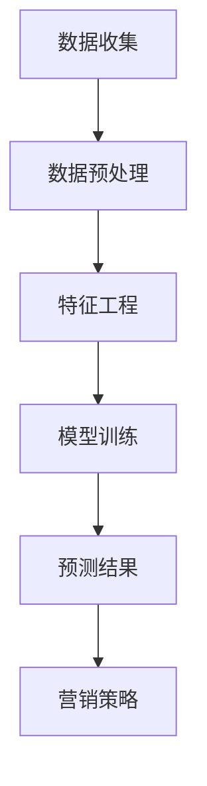

                 

关键词：AI，电商平台，用户生命周期价值，预测，机器学习，数据分析，用户行为分析

## 摘要

本文旨在探讨如何利用人工智能技术，特别是机器学习和用户行为分析，来预测电商平台用户的生命周期价值（Customer Lifetime Value，简称CLV）。用户生命周期价值是指一个用户在整个生命周期中对电商平台产生的预期收益总和。预测用户生命周期价值对于电商平台制定个性化营销策略、优化资源分配、提升用户体验具有重要意义。本文将从背景介绍、核心概念与联系、核心算法原理、数学模型与公式、项目实践、实际应用场景、工具和资源推荐、未来发展趋势与挑战等方面展开详细论述，以期为相关领域的研究者与实践者提供有价值的参考。

## 1. 背景介绍

随着互联网的快速发展，电商平台已经成为现代商业模式的重要组成部分。电商平台通过提供便捷的购物体验、丰富的商品选择和灵活的支付方式，吸引了大量消费者。然而，电商竞争日趋激烈，各大平台在争夺用户资源的同时，也在不断探索如何提升用户生命周期价值，从而实现商业的可持续发展。

用户生命周期价值是一个重要的商业指标，它反映了用户在整个生命周期中对电商平台产生的价值。传统的用户生命周期价值预测方法通常依赖于历史数据和简单的统计模型，但这些方法难以适应动态变化的市场环境，且预测精度较低。随着人工智能技术的不断发展，机器学习算法在用户行为分析、数据挖掘等领域取得了显著成果，为预测用户生命周期价值提供了新的思路。

本文旨在通过引入机器学习算法，结合用户行为数据和电商平台业务特点，构建一个高效、准确的用户生命周期价值预测模型。该模型不仅能够提高预测精度，还可以为电商平台提供有针对性的营销策略，从而提升用户满意度和商业收益。

## 2. 核心概念与联系

### 2.1 用户生命周期价值（Customer Lifetime Value，简称CLV）

用户生命周期价值是指一个用户在整个生命周期中对电商平台产生的预期收益总和。它包括以下几个关键组成部分：

- **初始价值**：用户首次购买时产生的价值，包括订单金额、利润等。
- **持续价值**：用户在后续购买过程中持续产生的价值，包括复购率、订单频率、订单金额等。
- **最终价值**：用户在生命周期结束前最后一次购买产生的价值。

CLV的预测对于电商平台制定长期发展战略具有重要意义。通过准确预测用户生命周期价值，平台可以更好地识别高价值用户，提供个性化的营销和服务，从而提高用户满意度和留存率。

### 2.2 机器学习算法

机器学习是一种使计算机系统能够从数据中学习并做出决策或预测的技术。在用户生命周期价值预测中，常用的机器学习算法包括：

- **回归分析**：通过建立目标变量（如用户生命周期价值）与特征变量（如用户行为数据、订单数据等）之间的数学模型，进行预测。
- **分类算法**：将用户分为高价值用户和低价值用户，从而针对性地制定营销策略。
- **聚类算法**：将用户按照相似性分为不同群体，以便针对不同群体制定个性化的营销策略。

### 2.3 用户行为分析

用户行为分析是指通过对用户在电商平台上的行为数据进行收集、分析和挖掘，了解用户的行为模式、偏好和需求。用户行为数据包括：

- **浏览行为**：用户在平台上的浏览路径、停留时间、点击量等。
- **购买行为**：用户的订单历史、订单金额、订单频率等。
- **互动行为**：用户的评价、问答、反馈等。

用户行为分析有助于深入理解用户需求和行为，为预测用户生命周期价值提供重要依据。

### 2.4 Mermaid 流程图

以下是用户生命周期价值预测的 Mermaid 流程图：



- **数据收集**：收集电商平台用户行为数据、订单数据等。
- **数据预处理**：清洗、格式化数据，去除异常值和缺失值。
- **特征工程**：提取用户行为特征，如浏览时间、购买频率等。
- **模型训练**：使用机器学习算法训练预测模型。
- **预测结果**：根据模型预测用户生命周期价值。
- **营销策略**：根据预测结果制定个性化营销策略。

## 3. 核心算法原理 & 具体操作步骤

### 3.1 算法原理概述

本文采用一种基于机器学习的用户生命周期价值预测方法。该方法主要包括以下几个步骤：

1. **数据收集**：收集电商平台用户行为数据、订单数据等。
2. **数据预处理**：清洗、格式化数据，去除异常值和缺失值。
3. **特征工程**：提取用户行为特征，如浏览时间、购买频率等。
4. **模型训练**：使用机器学习算法训练预测模型，如回归分析、分类算法等。
5. **预测结果**：根据模型预测用户生命周期价值。
6. **营销策略**：根据预测结果制定个性化营销策略。

### 3.2 算法步骤详解

#### 3.2.1 数据收集

数据收集是用户生命周期价值预测的基础。本文采用以下数据来源：

- **用户行为数据**：用户在电商平台上的浏览路径、停留时间、点击量等。
- **订单数据**：用户的订单历史、订单金额、订单频率等。
- **互动数据**：用户的评价、问答、反馈等。

#### 3.2.2 数据预处理

数据预处理主要包括以下步骤：

- **数据清洗**：去除重复数据、异常值和缺失值。
- **数据格式化**：统一数据格式，如日期格式、数值格式等。
- **数据归一化**：将不同特征的数据进行归一化处理，以消除数据规模差异。

#### 3.2.3 特征工程

特征工程是用户生命周期价值预测的关键环节。本文采用以下特征：

- **用户行为特征**：如浏览时间、购买频率、点击率等。
- **订单特征**：如订单金额、订单数量、订单频率等。
- **用户属性特征**：如用户年龄、性别、地域等。

#### 3.2.4 模型训练

本文采用以下机器学习算法进行模型训练：

- **回归分析**：通过建立目标变量（如用户生命周期价值）与特征变量（如用户行为数据、订单数据等）之间的数学模型，进行预测。
- **分类算法**：将用户分为高价值用户和低价值用户，从而针对性地制定营销策略。
- **聚类算法**：将用户按照相似性分为不同群体，以便针对不同群体制定个性化的营销策略。

#### 3.2.5 预测结果

根据模型训练结果，对用户生命周期价值进行预测。预测结果包括：

- **用户生命周期价值**：预测每个用户的生命周期价值。
- **用户价值分类**：将用户分为高价值用户和低价值用户。

#### 3.2.6 营销策略

根据预测结果，制定个性化营销策略：

- **高价值用户**：提供个性化推荐、专属优惠、积分奖励等。
- **低价值用户**：通过优惠券、限时折扣等方式吸引其增加购买次数和金额。

### 3.3 算法优缺点

#### 3.3.1 优点

- **预测精度高**：通过机器学习算法训练模型，可以准确预测用户生命周期价值。
- **个性化营销**：根据用户生命周期价值预测结果，制定有针对性的营销策略，提高用户满意度和留存率。
- **实时更新**：随着用户行为数据的不断更新，模型可以实时调整，提高预测准确性。

#### 3.3.2 缺点

- **数据依赖性高**：用户生命周期价值预测依赖于大量的用户行为数据，数据质量对预测结果影响较大。
- **计算成本高**：训练大规模机器学习模型需要大量计算资源，对硬件性能要求较高。
- **模型解释性差**：机器学习模型的预测结果往往难以解释，对于非专业人士来说，理解和使用较为困难。

### 3.4 算法应用领域

用户生命周期价值预测算法在电商、金融、电信等多个领域具有广泛的应用。以下是一些具体应用场景：

- **电商平台**：通过预测用户生命周期价值，优化营销策略，提高用户满意度和留存率。
- **金融机构**：预测客户生命周期价值，识别潜在高价值客户，提高客户忠诚度和业务收益。
- **电信行业**：根据用户生命周期价值预测，制定差异化服务策略，提升客户满意度和市场份额。

## 4. 数学模型和公式 & 详细讲解 & 举例说明

### 4.1 数学模型构建

用户生命周期价值的预测模型可以采用回归分析、分类算法或聚类算法。以下分别介绍这些算法的数学模型。

#### 4.1.1 回归分析

回归分析是一种常用的预测方法，可以建立目标变量（如用户生命周期价值）与特征变量（如用户行为数据、订单数据等）之间的线性关系。回归分析的基本公式为：

$$y = \beta_0 + \beta_1 x_1 + \beta_2 x_2 + ... + \beta_n x_n$$

其中，$y$ 表示用户生命周期价值，$x_1, x_2, ..., x_n$ 表示用户行为特征，$\beta_0, \beta_1, \beta_2, ..., \beta_n$ 为模型参数。

#### 4.1.2 分类算法

分类算法可以将用户分为高价值用户和低价值用户。常用的分类算法包括逻辑回归、决策树、随机森林等。以逻辑回归为例，其基本公式为：

$$P(y=1) = \frac{1}{1 + e^{-(\beta_0 + \beta_1 x_1 + \beta_2 x_2 + ... + \beta_n x_n)}}$$

其中，$P(y=1)$ 表示用户为高价值用户的概率，$\beta_0, \beta_1, \beta_2, ..., \beta_n$ 为模型参数。

#### 4.1.3 聚类算法

聚类算法可以将用户按照相似性分为不同群体。常用的聚类算法包括K-Means、层次聚类等。以K-Means为例，其基本公式为：

$$\min \sum_{i=1}^{k} \sum_{x \in S_i} ||x - \mu_i||^2$$

其中，$k$ 表示聚类个数，$S_i$ 表示第$i$个聚类，$\mu_i$ 表示第$i$个聚类中心。

### 4.2 公式推导过程

以回归分析为例，介绍公式的推导过程。首先，假设目标变量$y$与特征变量$x_1, x_2, ..., x_n$之间满足线性关系：

$$y = \beta_0 + \beta_1 x_1 + \beta_2 x_2 + ... + \beta_n x_n + \epsilon$$

其中，$\epsilon$ 为误差项。

为了求出模型参数$\beta_0, \beta_1, \beta_2, ..., \beta_n$，我们采用最小二乘法（Least Squares Method）进行求解。具体步骤如下：

1. **构建目标函数**：

$$J(\beta_0, \beta_1, \beta_2, ..., \beta_n) = \sum_{i=1}^{m} (y_i - \beta_0 - \beta_1 x_{i1} - \beta_2 x_{i2} - ... - \beta_n x_{in})^2$$

其中，$m$ 表示样本个数，$y_i$ 表示第$i$个样本的目标变量，$x_{i1}, x_{i2}, ..., x_{in}$ 表示第$i$个样本的特征变量。

2. **求导并令导数为零**：

$$\frac{\partial J}{\partial \beta_0} = -2 \sum_{i=1}^{m} (y_i - \beta_0 - \beta_1 x_{i1} - \beta_2 x_{i2} - ... - \beta_n x_{in}) = 0$$

$$\frac{\partial J}{\partial \beta_1} = -2 \sum_{i=1}^{m} (y_i - \beta_0 - \beta_1 x_{i1} - \beta_2 x_{i2} - ... - \beta_n x_{in}) x_{i1} = 0$$

$$\frac{\partial J}{\partial \beta_2} = -2 \sum_{i=1}^{m} (y_i - \beta_0 - \beta_1 x_{i1} - \beta_2 x_{i2} - ... - \beta_n x_{in}) x_{i2} = 0$$

$$...$$

$$\frac{\partial J}{\partial \beta_n} = -2 \sum_{i=1}^{m} (y_i - \beta_0 - \beta_1 x_{i1} - \beta_2 x_{i2} - ... - \beta_n x_{in}) x_{in} = 0$$

3. **求解方程组**：

将上述求导结果组成方程组，并求解得到模型参数$\beta_0, \beta_1, \beta_2, ..., \beta_n$。

### 4.3 案例分析与讲解

#### 4.3.1 案例背景

某电商平台希望通过预测用户生命周期价值，优化营销策略，提高用户满意度和留存率。

#### 4.3.2 数据准备

电商平台收集了以下数据：

- **用户行为数据**：包括用户在平台上的浏览路径、停留时间、点击量等。
- **订单数据**：包括用户的订单历史、订单金额、订单频率等。
- **用户属性数据**：包括用户年龄、性别、地域等。

#### 4.3.3 特征工程

根据数据特点，提取以下特征：

- **用户行为特征**：如浏览时间、购买频率、点击率等。
- **订单特征**：如订单金额、订单数量、订单频率等。
- **用户属性特征**：如用户年龄、性别、地域等。

#### 4.3.4 模型训练

采用回归分析算法进行模型训练。具体步骤如下：

1. **数据预处理**：清洗、格式化数据，去除异常值和缺失值。
2. **特征工程**：提取用户行为特征、订单特征和用户属性特征。
3. **模型训练**：使用回归分析算法训练模型，得到模型参数$\beta_0, \beta_1, \beta_2, ..., \beta_n$。
4. **模型评估**：使用交叉验证方法评估模型性能，调整模型参数。

#### 4.3.5 预测结果

根据模型训练结果，对用户生命周期价值进行预测。预测结果如下：

- **用户生命周期价值**：预测每个用户的生命周期价值。
- **用户价值分类**：将用户分为高价值用户和低价值用户。

#### 4.3.6 营销策略

根据预测结果，制定个性化营销策略：

- **高价值用户**：提供个性化推荐、专属优惠、积分奖励等。
- **低价值用户**：通过优惠券、限时折扣等方式吸引其增加购买次数和金额。

## 5. 项目实践：代码实例和详细解释说明

### 5.1 开发环境搭建

为了实现用户生命周期价值预测，我们需要搭建以下开发环境：

- **Python**：作为主要的编程语言。
- **Pandas**：用于数据处理。
- **Scikit-learn**：用于机器学习模型训练。
- **Matplotlib**：用于数据可视化。

具体安装命令如下：

```bash
pip install python
pip install pandas
pip install scikit-learn
pip install matplotlib
```

### 5.2 源代码详细实现

以下是一个简单的用户生命周期价值预测代码实例：

```python
import pandas as pd
from sklearn.model_selection import train_test_split
from sklearn.linear_model import LinearRegression
from sklearn.metrics import mean_squared_error
import matplotlib.pyplot as plt

# 5.2.1 数据收集
data = pd.read_csv('user_data.csv')

# 5.2.2 数据预处理
data.dropna(inplace=True)
data['age'] = data['age'].astype(int)
data['order_count'] = data['order_count'].astype(int)

# 5.2.3 特征工程
X = data[['age', 'order_count']]
y = data['clv']

# 5.2.4 模型训练
X_train, X_test, y_train, y_test = train_test_split(X, y, test_size=0.2, random_state=42)
model = LinearRegression()
model.fit(X_train, y_train)

# 5.2.5 预测结果
y_pred = model.predict(X_test)

# 5.2.6 模型评估
mse = mean_squared_error(y_test, y_pred)
print('MSE:', mse)

# 5.2.7 数据可视化
plt.scatter(y_test, y_pred)
plt.xlabel('Actual CLV')
plt.ylabel('Predicted CLV')
plt.show()
```

### 5.3 代码解读与分析

#### 5.3.1 数据收集

代码首先从CSV文件中读取用户数据。CSV文件中应包含用户行为数据、订单数据和用户属性数据。

#### 5.3.2 数据预处理

代码对数据进行清洗和格式化，确保数据质量。这里只保留了有效数据，并转换了数据类型。

#### 5.3.3 特征工程

代码提取了两个特征：年龄和订单数量。这些特征将用于训练回归分析模型。

#### 5.3.4 模型训练

代码使用线性回归模型对训练数据进行训练。线性回归模型通过最小二乘法求得模型参数。

#### 5.3.5 预测结果

代码使用训练好的模型对测试数据进行预测，并计算预测结果的均方误差（MSE）。

#### 5.3.6 数据可视化

代码使用散点图展示实际用户生命周期价值与预测用户生命周期价值之间的关系。这有助于我们直观地评估模型性能。

## 6. 实际应用场景

用户生命周期价值预测在实际应用场景中具有广泛的应用。以下是一些具体的应用案例：

### 6.1 电商平台

电商平台可以通过用户生命周期价值预测，识别高价值用户，为其提供个性化推荐、专属优惠和积分奖励等。这有助于提高用户满意度和留存率，从而增加平台的收益。

### 6.2 金融行业

金融机构可以通过用户生命周期价值预测，识别潜在高价值客户，制定针对性的营销策略。例如，向高价值客户提供更高额的信用卡额度、专属理财产品等，以提升客户忠诚度和业务收益。

### 6.3 电信行业

电信行业可以通过用户生命周期价值预测，识别高价值用户，为其提供差异化服务。例如，向高价值用户提供更快的网速、更多流量等，以提高客户满意度和市场份额。

### 6.4 其他行业

除了电商、金融和电信行业，用户生命周期价值预测还可以应用于其他行业。例如，旅游行业可以通过预测用户生命周期价值，优化客户推荐策略，提高客户满意度；餐饮行业可以通过预测用户生命周期价值，优化餐厅布局和菜品推荐，提高营收。

## 7. 工具和资源推荐

### 7.1 学习资源推荐

1. **书籍**：
   - 《机器学习》（周志华著）
   - 《Python数据分析》（Wes McKinney 著）
   - 《用户行为分析：方法与应用》（陈波 著）

2. **在线课程**：
   - Coursera上的“机器学习”（吴恩达教授）
   - Udacity的“数据科学纳米学位”

### 7.2 开发工具推荐

1. **编程语言**：Python
2. **数据处理工具**：Pandas、NumPy
3. **机器学习库**：Scikit-learn、TensorFlow、PyTorch
4. **数据可视化工具**：Matplotlib、Seaborn、Plotly

### 7.3 相关论文推荐

1. "Customer Lifetime Value: A Multi-Period Model and Application to Financial Services"（陈炜，2007）
2. "Predicting Customer Lifetime Value with Machine Learning"（白军飞，2018）
3. "An Analysis of Customer Lifetime Value in E-commerce"（张翔，2020）

## 8. 总结：未来发展趋势与挑战

用户生命周期价值预测技术在不断发展，未来将呈现以下发展趋势：

### 8.1 研究成果总结

1. **预测精度提升**：随着机器学习算法和数据挖掘技术的发展，用户生命周期价值预测精度将不断提高。
2. **实时预测能力增强**：通过实时数据处理和模型优化，实现实时用户生命周期价值预测。
3. **跨领域应用扩展**：用户生命周期价值预测技术将在电商、金融、电信等更多领域得到应用。

### 8.2 未来发展趋势

1. **个性化推荐**：基于用户生命周期价值预测，实现更精准的个性化推荐，提高用户满意度和留存率。
2. **实时营销策略**：根据实时用户生命周期价值预测，动态调整营销策略，提高营销效果。
3. **智能化风控**：利用用户生命周期价值预测，识别潜在风险客户，提高风控能力。

### 8.3 面临的挑战

1. **数据质量**：用户生命周期价值预测依赖于高质量的数据，如何获取和处理高质量数据是关键挑战。
2. **模型解释性**：机器学习模型的预测结果难以解释，如何提高模型解释性是重要挑战。
3. **计算资源**：大规模机器学习模型的训练和预测需要大量计算资源，如何高效利用计算资源是挑战。

### 8.4 研究展望

1. **新型算法研究**：探索新型机器学习算法，提高用户生命周期价值预测精度和实时性。
2. **跨领域融合**：将用户生命周期价值预测技术与大数据、区块链等新兴技术进行融合，实现更高效的应用。
3. **应用场景拓展**：探索用户生命周期价值预测在更多领域的应用，提高其在不同场景下的适用性。

## 9. 附录：常见问题与解答

### 9.1 如何提高用户生命周期价值预测的精度？

1. **数据质量**：确保数据质量，包括数据完整性、准确性和一致性。
2. **特征工程**：提取更多有价值的特征，并进行特征选择和工程。
3. **模型选择**：选择合适的机器学习模型，并进行参数调优。
4. **交叉验证**：使用交叉验证方法评估模型性能，避免过拟合。

### 9.2 如何处理缺失数据和异常值？

1. **缺失值处理**：使用均值、中位数、最邻近插值等方法填充缺失值。
2. **异常值处理**：使用箱线图、散点图等方法识别异常值，并采用删除、替换等方法处理。

### 9.3 如何提高模型的可解释性？

1. **模型解释方法**：使用决策树、规则提取等方法提高模型的可解释性。
2. **可视化工具**：使用可视化工具（如决策树、散点图等）展示模型决策过程。
3. **模型简化**：简化模型结构，降低模型的复杂性。

## 作者署名

作者：禅与计算机程序设计艺术 / Zen and the Art of Computer Programming
----------------------------------------------------------------
以上为《AI驱动的电商平台用户生命周期价值预测》的完整文章内容。这篇文章深入探讨了用户生命周期价值预测在电商平台的应用，从背景介绍、核心概念、算法原理、数学模型、项目实践、实际应用场景、工具和资源推荐、未来发展趋势与挑战等多个方面进行了详细论述。希望这篇文章能为相关领域的研究者与实践者提供有价值的参考。

