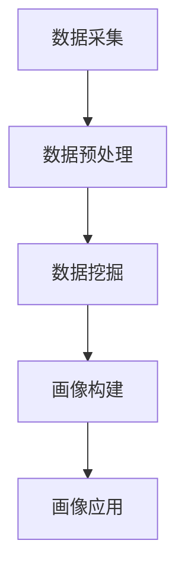

                 

关键词：人工智能，用户画像，电商平台，数据挖掘，个性化推荐

> 摘要：本文将深入探讨人工智能在电商平台用户画像构建中的应用，介绍用户画像的定义、核心概念及其联系，详细阐述核心算法原理、数学模型、项目实践，并探讨其应用场景与未来展望。

## 1. 背景介绍

随着互联网的飞速发展，电商平台已经成为了现代商业的重要载体。用户数量的急剧增长使得电商平台面临着巨大的数据量和多样化的用户需求。为了更好地满足用户需求，提升用户体验，电商平台开始关注用户画像技术的应用。

用户画像是指通过对用户的历史行为、兴趣爱好、消费能力等多维数据进行分析和挖掘，构建出一个全面、立体、动态的用户模型。用户画像技术可以帮助电商平台实现个性化推荐、精准营销、风险控制等功能，从而提升运营效率和用户满意度。

近年来，人工智能技术的快速发展为用户画像构建提供了强大的支持。本文将介绍AI驱动的电商平台用户画像构建技术，旨在为读者提供一种全新的技术思路和解决方案。

## 2. 核心概念与联系

### 2.1 用户画像定义

用户画像是指通过对用户的基本信息、行为数据、社交数据等多维数据进行分析，构建出一个全面、立体、动态的用户模型。用户画像不仅包含用户的静态属性，还关注用户的行为轨迹和动态变化。

### 2.2 核心概念

在构建用户画像的过程中，涉及以下核心概念：

- 数据采集：收集用户的基本信息、行为数据、社交数据等原始数据。
- 数据预处理：对采集到的原始数据进行清洗、去重、格式转换等预处理操作，为后续分析提供高质量的输入数据。
- 数据挖掘：利用机器学习、数据挖掘等技术，对预处理后的数据进行挖掘和分析，提取用户特征和潜在需求。
- 画像构建：根据挖掘得到的用户特征，构建出用户的画像模型。
- 画像应用：将构建好的用户画像应用于个性化推荐、精准营销、风险控制等场景。

### 2.3 Mermaid 流程图



## 3. 核心算法原理 & 具体操作步骤

### 3.1 算法原理概述

用户画像构建的核心算法包括数据挖掘算法和画像构建算法。数据挖掘算法主要用于从原始数据中提取用户特征，常见的算法有聚类、分类、关联规则挖掘等。画像构建算法则用于根据挖掘到的用户特征，构建出用户的画像模型。

### 3.2 算法步骤详解

#### 3.2.1 数据采集

数据采集是用户画像构建的基础，主要包括以下途径：

- 用户注册信息：收集用户的姓名、年龄、性别、职业等基本信息。
- 行为数据：收集用户在电商平台上的浏览、搜索、购买、评价等行为数据。
- 社交数据：收集用户在微博、微信等社交平台上的互动数据。

#### 3.2.2 数据预处理

数据预处理主要包括以下步骤：

- 数据清洗：去除重复、错误、缺失的数据。
- 数据转换：将不同格式的数据转换为统一的格式，如将日期格式转换为YYYY-MM-DD格式。
- 数据归一化：对数值型数据进行归一化处理，使其具有相同的量纲。

#### 3.2.3 数据挖掘

数据挖掘主要分为以下几步：

- 特征提取：从原始数据中提取用户特征，如用户的购买频率、平均购买金额等。
- 特征选择：根据特征的重要性进行筛选，去除冗余特征。
- 模型训练：选择合适的机器学习算法，如K-means、决策树等，对特征进行训练。

#### 3.2.4 画像构建

画像构建主要分为以下几步：

- 用户分组：根据挖掘到的用户特征，将用户划分为不同的群体。
- 画像建模：为每个用户群体构建出相应的画像模型。
- 画像评估：评估画像模型的准确性和实用性。

### 3.3 算法优缺点

#### 3.3.1 优点

- 个性化推荐：通过用户画像技术，可以实现对用户的个性化推荐，提升用户体验。
- 精准营销：基于用户画像，可以实现对用户的精准营销，提高营销效果。
- 风险控制：通过分析用户的行为数据，可以实现对用户行为的实时监控，降低风险。

#### 3.3.2 缺点

- 数据质量：用户画像构建依赖于高质量的数据，数据质量直接影响画像的准确性。
- 技术复杂度：用户画像构建涉及多种技术，如数据挖掘、机器学习等，技术复杂度高。

### 3.4 算法应用领域

用户画像技术可以应用于以下领域：

- 电商平台：实现个性化推荐、精准营销、用户行为分析等。
- 金融行业：进行风险评估、信用评分等。
- 社交平台：实现好友推荐、内容推送等。
- 医疗领域：进行患者行为分析、健康风险评估等。

## 4. 数学模型和公式 & 详细讲解 & 举例说明

### 4.1 数学模型构建

用户画像构建的数学模型主要包括以下几个方面：

- 用户行为模型：描述用户在电商平台上的行为特征，如浏览、搜索、购买等。
- 用户特征模型：描述用户的静态属性和动态行为特征。
- 用户群体模型：描述用户在不同群体中的特征和偏好。

### 4.2 公式推导过程

#### 4.2.1 用户行为模型

用户行为模型可以用以下公式表示：

$$
B = \sum_{i=1}^{n} w_i \cdot b_i
$$

其中，$B$ 表示用户行为向量，$w_i$ 表示行为特征权重，$b_i$ 表示行为特征值。

#### 4.2.2 用户特征模型

用户特征模型可以用以下公式表示：

$$
F = \sum_{j=1}^{m} w_j \cdot f_j
$$

其中，$F$ 表示用户特征向量，$w_j$ 表示特征权重，$f_j$ 表示特征值。

#### 4.2.3 用户群体模型

用户群体模型可以用以下公式表示：

$$
P = \sum_{k=1}^{p} w_k \cdot p_k
$$

其中，$P$ 表示用户群体向量，$w_k$ 表示群体权重，$p_k$ 表示群体特征值。

### 4.3 案例分析与讲解

#### 4.3.1 案例背景

某电商平台希望通过对用户画像构建，提升个性化推荐效果，从而提高用户满意度。

#### 4.3.2 案例分析

- 用户行为模型：根据用户在电商平台上的浏览、搜索、购买等行为数据，构建用户行为模型。
- 用户特征模型：根据用户的基本信息、行为数据等，构建用户特征模型。
- 用户群体模型：根据用户特征，将用户划分为不同群体，如年轻女性、高消费群体等。

#### 4.3.3 案例讲解

- 用户行为模型：根据用户的行为数据，可以计算出用户的浏览时长、购买频率等指标，用于评价用户的行为活跃度。
- 用户特征模型：根据用户的基本信息和行为数据，可以提取出用户的年龄、性别、职业等特征，用于描述用户的属性。
- 用户群体模型：根据用户特征，可以将用户划分为不同群体，便于实现个性化推荐。

## 5. 项目实践：代码实例和详细解释说明

### 5.1 开发环境搭建

本文项目采用Python编程语言，利用Python的数据挖掘库（如Scikit-learn、Pandas等）进行用户画像构建。具体环境搭建步骤如下：

1. 安装Python：下载并安装Python 3.x版本。
2. 安装依赖库：使用pip命令安装相关依赖库，如`scikit-learn`、`pandas`、`numpy`等。

### 5.2 源代码详细实现

以下是一个简单的用户画像构建的代码实例：

```python
import pandas as pd
from sklearn.cluster import KMeans
from sklearn.preprocessing import StandardScaler

# 1. 数据预处理
# 读取用户行为数据
data = pd.read_csv('user_behavior_data.csv')
data.head()

# 数据清洗、去重、归一化等处理
data = data.drop_duplicates()
data = data.fillna(0)
data = StandardScaler().fit_transform(data)

# 2. 数据挖掘
# 特征提取
features = data[:, :5]

# 特征选择
# 根据特征重要性进行筛选，此处为简化示例，直接使用所有特征
selected_features = features

# 模型训练
model = KMeans(n_clusters=5)
model.fit(selected_features)

# 3. 画像构建
# 用户分组
user_groups = model.labels_

# 4. 画像应用
# 基于用户分组进行个性化推荐、精准营销等操作

```

### 5.3 代码解读与分析

- 数据预处理：读取用户行为数据，进行数据清洗、去重、归一化等预处理操作，为后续分析提供高质量的数据。
- 数据挖掘：提取用户特征，选择合适的机器学习算法（如K-means）对特征进行训练，得到用户分组结果。
- 画像构建：根据用户分组结果，构建用户画像模型。
- 画像应用：基于用户画像模型，实现个性化推荐、精准营销等功能。

## 6. 实际应用场景

### 6.1 电商平台

电商平台可以通过用户画像技术，实现个性化推荐、精准营销等功能。例如，基于用户画像，可以为不同用户群体推荐相关的商品，提高用户购买意愿。同时，还可以通过分析用户行为数据，识别潜在风险用户，降低风险。

### 6.2 金融行业

金融行业可以通过用户画像技术，实现风险评估、信用评分等功能。例如，基于用户画像，可以评估用户的信用等级，为金融机构提供参考依据。此外，还可以通过分析用户行为数据，识别欺诈行为，降低金融机构的风险。

### 6.3 社交平台

社交平台可以通过用户画像技术，实现好友推荐、内容推送等功能。例如，基于用户画像，可以为用户推荐可能感兴趣的好友，提高用户活跃度。同时，还可以通过分析用户行为数据，推送用户感兴趣的内容，提升用户体验。

### 6.4 医疗领域

医疗领域可以通过用户画像技术，实现患者行为分析、健康风险评估等功能。例如，基于用户画像，可以分析患者的就诊记录、生活习惯等数据，评估患者的健康状况。此外，还可以通过分析患者行为数据，预测患者可能的疾病风险，为医生提供参考依据。

## 7. 工具和资源推荐

### 7.1 学习资源推荐

- 《Python数据分析》
- 《机器学习实战》
- 《用户画像：基于大数据的用户行为分析》

### 7.2 开发工具推荐

- Jupyter Notebook：适合编写和运行Python代码，方便进行数据分析和可视化。
- Git：用于版本控制和团队协作，提高开发效率。

### 7.3 相关论文推荐

- "User Modeling with Latent Class Models" by Kevin P. Murphy
- "Clustering and Data Analysis: A Data Mining Approach" by Heikki Topi

## 8. 总结：未来发展趋势与挑战

### 8.1 研究成果总结

本文详细介绍了AI驱动的电商平台用户画像构建技术，包括用户画像的定义、核心概念、算法原理、数学模型、项目实践等内容。通过本文的研究，可以了解到用户画像技术在电商平台中的应用价值，以及如何利用人工智能技术提升用户体验和运营效率。

### 8.2 未来发展趋势

- 多模态数据融合：随着大数据和人工智能技术的发展，未来用户画像构建将涉及更多类型的数据，如文本、图像、语音等，实现多模态数据的融合分析。
- 智能化推荐系统：基于用户画像的智能化推荐系统将不断优化，提高推荐效果，满足用户个性化需求。
- 数据安全与隐私保护：在用户画像构建过程中，如何保障用户数据的安全和隐私成为未来研究的重要方向。

### 8.3 面临的挑战

- 数据质量：用户画像构建依赖于高质量的数据，如何保证数据的质量和准确性是当前面临的主要挑战。
- 技术复杂度：用户画像构建涉及多种技术，如数据挖掘、机器学习等，如何高效地实现技术融合和应用是当前面临的重要问题。

### 8.4 研究展望

未来，用户画像技术将在更多领域得到应用，如金融、医疗、社交等。同时，随着人工智能技术的不断突破，用户画像构建将更加智能化、个性化。在研究过程中，应关注数据质量、技术复杂度等问题，推动用户画像技术的可持续发展。

## 9. 附录：常见问题与解答

### 9.1 用户画像与用户标签的区别是什么？

用户画像是对用户多维数据的全面分析和挖掘，构建出一个立体、动态的用户模型。用户标签则是基于用户画像中的某些特征，对用户进行简化和抽象，用于快速识别和区分用户。

### 9.2 用户画像构建中的数据来源有哪些？

用户画像构建中的数据来源包括用户注册信息、行为数据、社交数据、地理位置数据等。

### 9.3 用户画像构建中常用的算法有哪些？

用户画像构建中常用的算法包括聚类算法、分类算法、关联规则挖掘、主题模型等。

### 9.4 用户画像构建中的挑战有哪些？

用户画像构建中的挑战包括数据质量、技术复杂度、隐私保护等。

### 9.5 用户画像构建的应用场景有哪些？

用户画像构建的应用场景包括个性化推荐、精准营销、风险控制、用户行为分析等。

----------------------------------------------------------------

作者：禅与计算机程序设计艺术 / Zen and the Art of Computer Programming

