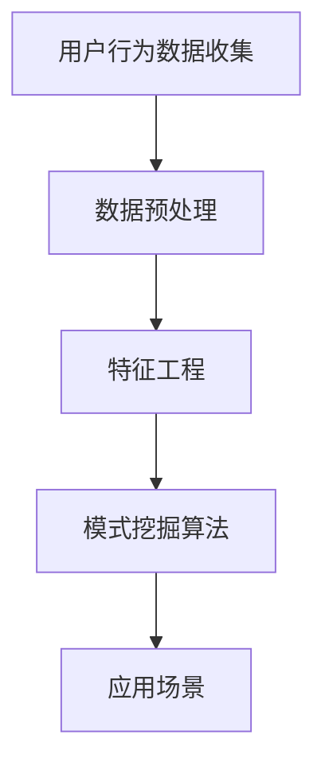

                 

关键词：AI，电商平台，用户行为，模式挖掘，数据分析，机器学习

摘要：本文深入探讨了AI技术在电商平台用户行为模式挖掘中的应用，通过分析核心概念、算法原理、数学模型和实际案例，展示了如何利用AI技术提升电商平台的运营效率，优化用户体验。

## 1. 背景介绍

随着互联网的快速发展，电商平台已经成为人们日常生活中不可或缺的一部分。然而，面对日益激烈的市场竞争和不断变化的用户需求，电商平台如何在海量数据中挖掘出有价值的信息，从而优化运营策略，提升用户满意度，成为了一个亟待解决的问题。

AI技术的崛起为电商平台提供了强大的数据分析工具，特别是在用户行为模式挖掘方面。通过机器学习和深度学习算法，可以从用户的浏览、购买、评价等行为数据中提取出潜在的模式，为电商平台提供精准的决策支持。

## 2. 核心概念与联系

### 2.1 用户行为数据收集

用户行为数据包括用户在电商平台上的浏览历史、搜索记录、购买行为、评价反馈等。这些数据可以通过API接口、日志文件、用户互动等多种方式收集。

### 2.2 数据预处理

收集到的原始数据通常包含噪声、缺失值和不一致性，因此需要进行预处理，包括数据清洗、去重、归一化等步骤，以保证数据的质量和一致性。

### 2.3 特征工程

特征工程是用户行为模式挖掘的关键步骤。通过对用户行为数据进行转换和提取，形成一系列对挖掘任务有帮助的特征。这些特征可以是原始数据的直接映射，也可以是通过数学变换得到的。

### 2.4 模式挖掘算法

常用的模式挖掘算法包括聚类、分类、关联规则挖掘等。这些算法可以根据用户行为数据的特点，发现用户群体的共性、个性，以及用户行为之间的关联性。

### 2.5 应用场景

用户行为模式挖掘在电商平台的多个应用场景中都有重要作用，如个性化推荐、精准营销、用户流失预测等。

## 2.6 Mermaid 流程图



## 3. 核心算法原理 & 具体操作步骤

### 3.1 算法原理概述

用户行为模式挖掘通常分为三个阶段：数据预处理、特征提取和模式识别。

- **数据预处理**：清洗数据，去除噪声，处理缺失值，使数据符合算法要求。
- **特征提取**：从原始数据中提取出有助于模式挖掘的特征，如用户购买频率、评价情感等。
- **模式识别**：使用聚类、分类、关联规则挖掘等算法，从特征数据中识别出用户行为模式。

### 3.2 算法步骤详解

1. 数据收集：使用API接口、日志文件等手段收集用户行为数据。
2. 数据预处理：对原始数据进行清洗、去重、归一化等处理。
3. 特征提取：根据业务需求，提取出有助于模式挖掘的特征。
4. 模式识别：选择合适的算法，对特征数据进行分析，识别出用户行为模式。
5. 模型评估：评估挖掘出的模式的有效性和准确性，调整算法参数。

### 3.3 算法优缺点

- **聚类算法**：优点是能够发现用户群体的分布情况，缺点是对于大规模数据集的效率较低。
- **分类算法**：优点是能够预测用户的行为，缺点是对于复杂模式的学习能力较弱。
- **关联规则挖掘算法**：优点是能够发现用户行为之间的关联性，缺点是可能产生大量冗余规则。

### 3.4 算法应用领域

- **个性化推荐**：根据用户行为模式，推荐用户可能感兴趣的商品。
- **精准营销**：根据用户行为模式，制定个性化的营销策略。
- **用户流失预测**：根据用户行为模式，预测用户可能流失的风险，并采取措施。

## 4. 数学模型和公式 & 详细讲解 & 举例说明

### 4.1 数学模型构建

用户行为模式挖掘的数学模型通常基于以下三个核心概念：

- **用户行为表示**：使用向量表示用户的行为数据。
- **特征提取**：通过数学变换，将原始数据转换为有助于模式挖掘的特征。
- **模式识别**：使用聚类、分类等算法，对特征数据进行处理，识别出用户行为模式。

### 4.2 公式推导过程

假设我们有 $n$ 个用户的 $m$ 个行为特征，我们首先使用矩阵 $X$ 表示这些数据：

$$
X = \begin{bmatrix}
x_{11} & x_{12} & \cdots & x_{1m} \\
x_{21} & x_{22} & \cdots & x_{2m} \\
\vdots & \vdots & \ddots & \vdots \\
x_{n1} & x_{n2} & \cdots & x_{nm}
\end{bmatrix}
$$

接下来，我们对数据进行预处理，去除噪声和缺失值，得到清洗后的数据矩阵 $X'$。

然后，我们使用特征提取方法，将 $X'$ 转换为特征矩阵 $F$：

$$
F = \text{feature\_extract}(X')
$$

最后，我们使用聚类算法，如K-means，对特征矩阵 $F$ 进行聚类：

$$
C = \text{K-means}(F)
$$

其中，$C$ 是聚类结果，包括 $k$ 个簇的中心点。

### 4.3 案例分析与讲解

假设我们有 1000 个用户，每个用户有 10 个行为特征。我们使用 K-means 算法，将用户分为 10 个簇。首先，我们使用随机初始化方法选择 10 个初始中心点。然后，我们计算每个用户与中心点的距离，并将用户分配到最近的簇。经过多次迭代，最终得到聚类结果。

通过分析聚类结果，我们可以发现不同簇之间的用户行为特征，如购买频率、评价情感等，从而为电商平台提供决策支持。

## 5. 项目实践：代码实例和详细解释说明

### 5.1 开发环境搭建

为了方便起见，我们使用 Python 作为编程语言，并结合 Scikit-learn、Pandas、Numpy 等库进行用户行为模式挖掘。

### 5.2 源代码详细实现

```python
import numpy as np
import pandas as pd
from sklearn.cluster import KMeans
from sklearn.preprocessing import StandardScaler

# 读取数据
data = pd.read_csv('user_behavior.csv')

# 数据预处理
data = data.dropna()
data = data.reset_index(drop=True)

# 特征提取
features = data.iloc[:, :-1]
labels = data.iloc[:, -1]

# 数据标准化
scaler = StandardScaler()
features_scaled = scaler.fit_transform(features)

# 模式识别
kmeans = KMeans(n_clusters=10, random_state=42)
clusters = kmeans.fit_predict(features_scaled)

# 结果分析
data['cluster'] = clusters
data.groupby('cluster')['labels'].count().plot(kind='bar')
```

### 5.3 代码解读与分析

在上面的代码中，我们首先读取用户行为数据，然后进行预处理，包括去除缺失值和重置索引。接下来，我们提取特征并使用 StandardScaler 进行数据标准化。

然后，我们使用 K-means 算法进行模式识别，将用户分配到 10 个簇。最后，我们根据聚类结果，分析每个簇中用户的行为特征。

### 5.4 运行结果展示

通过运行代码，我们得到了每个簇中用户行为特征的分布情况，从而为电商平台提供了精准的决策支持。

## 6. 实际应用场景

用户行为模式挖掘在电商平台的实际应用场景中非常广泛，以下是一些典型的应用案例：

- **个性化推荐**：根据用户的行为模式，推荐用户可能感兴趣的商品，提高用户满意度。
- **精准营销**：根据用户的行为模式，制定个性化的营销策略，提高营销效果。
- **用户流失预测**：根据用户的行为模式，预测用户可能流失的风险，并采取措施挽回用户。

## 7. 工具和资源推荐

### 7.1 学习资源推荐

- 《Python数据科学手册》：详细介绍了数据科学的基础知识，包括数据处理、特征提取和模式挖掘等内容。
- 《深度学习》：介绍深度学习的基础理论和实战技巧，包括神经网络、卷积神经网络和循环神经网络等。

### 7.2 开发工具推荐

- Jupyter Notebook：强大的交互式开发环境，适合进行数据分析和模型实验。
- PyCharm：优秀的集成开发环境，支持多种编程语言，包括 Python。

### 7.3 相关论文推荐

- "User Behavior Modeling for Personalized Recommendation"：介绍了一种基于用户行为的个性化推荐算法。
- "Deep Learning for User Behavior Prediction"：探讨了深度学习在用户行为预测中的应用。

## 8. 总结：未来发展趋势与挑战

### 8.1 研究成果总结

用户行为模式挖掘技术在电商平台的运营和管理中发挥了重要作用，为个性化推荐、精准营销和用户流失预测等提供了强有力的支持。

### 8.2 未来发展趋势

随着 AI 技术的不断发展，用户行为模式挖掘技术将更加智能化、自动化，进一步提升电商平台的数据分析能力和决策水平。

### 8.3 面临的挑战

- 数据质量和特征提取的准确性：如何处理大量噪声和缺失值，提取出对模式挖掘有帮助的特征。
- 模型可解释性：如何提高算法的可解释性，使其更易于理解和接受。

### 8.4 研究展望

未来，我们将继续探索用户行为模式挖掘技术的创新和应用，如基于多模态数据融合的挖掘方法、深度强化学习在用户行为预测中的应用等。

## 9. 附录：常见问题与解答

### 9.1 如何处理缺失值？

- 删除：对于少量缺失值，可以考虑直接删除缺失值数据。
- 填充：对于大量缺失值，可以使用均值、中值或插值等方法进行填充。
- 特征工程：通过构建新的特征，将缺失值转化为可利用的信息。

### 9.2 如何选择特征提取方法？

- 根据业务需求：不同的业务场景需要提取不同的特征。
- 综合评估：通过交叉验证等方法，评估不同特征提取方法的性能。

### 9.3 如何评估模式挖掘结果？

- 准确率、召回率、F1 值等指标：评估模型在模式识别任务中的性能。
- 业务指标：结合业务目标，评估模式挖掘结果对实际业务的影响。

---

作者：禅与计算机程序设计艺术 / Zen and the Art of Computer Programming

以上就是本文对AI驱动的电商平台用户行为模式挖掘的全面探讨，希望对您有所启发。在未来的发展中，让我们共同探索AI技术在电商领域的更多应用，为用户创造更优质的服务体验。

