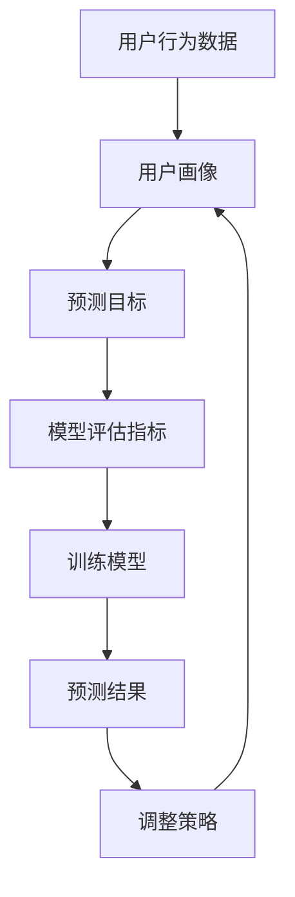

                 

 在当今数字化时代，电商平台已经成为消费者购物的主要渠道之一。随着用户数量的增加，如何有效预测用户的行为成为了电商平台提高销售额、优化用户体验的关键。本文将探讨基于人工智能的电商平台用户行为预测模型，介绍其核心概念、算法原理、数学模型、项目实践及其应用场景。

## 关键词

- 电商平台
- 用户行为预测
- 人工智能
- 深度学习
- 数学模型

## 摘要

本文旨在介绍一种基于人工智能技术的电商平台用户行为预测模型。通过分析用户的历史行为数据，模型能够预测用户在电商平台上的购买意图、浏览路径和偏好等行为。本文将详细阐述该模型的核心概念、算法原理、数学模型以及在实际项目中的应用情况，旨在为电商平台运营者提供理论支持和实践指导。

## 1. 背景介绍

随着互联网技术的发展，电商平台已经成为现代商业的重要组成部分。然而，面对激烈的市场竞争，电商平台需要不断提升用户体验，提高用户留存率和转化率。用户行为预测作为数据驱动的商业模式，为电商平台提供了精准的营销策略和个性化推荐服务。通过预测用户的行为模式，电商平台可以更有效地进行市场推广、产品定位和用户服务，从而提高销售额和用户满意度。

### 1.1 用户行为预测的意义

用户行为预测在电商平台中具有重要的应用价值：

1. **提高销售转化率**：通过预测用户的购买意图，电商平台可以针对潜在客户进行精准营销，提高销售转化率。
2. **优化用户体验**：通过分析用户行为数据，电商平台可以了解用户的兴趣和需求，提供个性化的推荐和服务，提升用户体验。
3. **降低运营成本**：用户行为预测可以帮助电商平台优化库存管理和物流配送，降低运营成本。
4. **提升品牌价值**：通过个性化推荐和精准营销，电商平台可以提升品牌知名度和用户忠诚度。

### 1.2 人工智能在用户行为预测中的应用

人工智能技术在用户行为预测中具有显著优势：

1. **数据处理能力**：人工智能能够处理海量用户数据，挖掘潜在的用户行为模式。
2. **自动特征提取**：通过深度学习等技术，人工智能能够自动提取用户行为特征，简化模型构建过程。
3. **实时预测能力**：人工智能可以实时处理用户行为数据，实现快速预测和响应。
4. **自适应调整**：人工智能模型能够根据用户行为数据的动态变化，自适应调整预测策略。

## 2. 核心概念与联系

在构建用户行为预测模型时，需要了解以下几个核心概念，并理解它们之间的联系：

### 2.1 用户行为数据

用户行为数据是指用户在电商平台上的操作记录，包括浏览、搜索、购买、评价等行为。这些数据是构建预测模型的基础。

### 2.2 用户画像

用户画像是对用户特征的综合描述，包括用户的年龄、性别、职业、地域、消费习惯等。通过用户画像，可以更好地理解用户的需求和行为模式。

### 2.3 预测目标

预测目标是指模型需要预测的具体行为，如购买意向、浏览路径、偏好等。不同的预测目标需要不同的模型构建方法。

### 2.4 模型评估指标

模型评估指标是衡量预测模型性能的标准，包括准确率、召回率、F1值等。通过评估指标，可以评估模型的预测效果。

### 2.5 Mermaid 流程图

以下是一个简单的 Mermaid 流程图，展示了用户行为预测模型的核心概念和联系：



## 3. 核心算法原理 & 具体操作步骤

### 3.1 算法原理概述

用户行为预测模型通常采用基于机器学习的方法，如决策树、随机森林、支持向量机、深度学习等。其中，深度学习由于其强大的特征提取和模型学习能力，在用户行为预测中具有广泛的应用。

### 3.2 算法步骤详解

用户行为预测模型的构建通常包括以下几个步骤：

1. **数据收集与预处理**：收集用户行为数据，并进行清洗、转换和归一化等预处理操作。
2. **特征工程**：提取用户行为特征，包括用户画像特征、上下文特征和交互特征等。
3. **模型选择与训练**：选择合适的模型，如深度神经网络、长短时记忆网络（LSTM）等，对模型进行训练。
4. **模型评估与优化**：评估模型性能，通过交叉验证、网格搜索等方法优化模型参数。
5. **预测与反馈**：使用训练好的模型进行预测，并根据预测结果调整营销策略和用户体验。

### 3.3 算法优缺点

**深度学习**：

- **优点**：强大的特征提取和模型学习能力，适用于处理复杂的用户行为数据。
- **缺点**：对数据量和计算资源要求较高，模型解释性较差。

**决策树、随机森林**：

- **优点**：模型解释性强，易于理解和调试。
- **缺点**：特征提取能力较弱，对大量数据依赖性较强。

### 3.4 算法应用领域

用户行为预测模型在电商平台的多个应用场景中具有重要价值：

1. **个性化推荐**：根据用户行为数据，推荐符合用户兴趣的产品。
2. **精准营销**：针对潜在客户进行精准营销，提高销售转化率。
3. **用户流失预测**：预测用户流失风险，提前采取措施挽回用户。
4. **广告投放优化**：根据用户行为数据，优化广告投放策略，提高广告效果。

## 4. 数学模型和公式 & 详细讲解 & 举例说明

### 4.1 数学模型构建

用户行为预测模型通常基于以下数学模型：

1. **线性回归模型**：
   $$y = \beta_0 + \beta_1x_1 + \beta_2x_2 + ... + \beta_nx_n$$

2. **逻辑回归模型**：
   $$P(y=1) = \frac{1}{1 + e^{-(\beta_0 + \beta_1x_1 + \beta_2x_2 + ... + \beta_nx_n)}$$

3. **深度学习模型**：
   - **卷积神经网络（CNN）**：
     $$\text{CNN} = \text{Conv} \rightarrow \text{ReLU} \rightarrow \text{Pooling} \rightarrow \text{Flatten} \rightarrow \text{Dense}$$
   - **长短时记忆网络（LSTM）**：
     $$h_t = \sigma(W_x \cdot [x_t, h_{t-1}] + b)$$

### 4.2 公式推导过程

以线性回归模型为例，推导过程如下：

1. **假设**：
   用户行为 $y$ 与特征 $x_1, x_2, ..., x_n$ 之间存在线性关系。

2. **目标函数**：
   $$J(\theta) = \frac{1}{m} \sum_{i=1}^{m} (\theta_0 + \theta_1x_{1,i} + \theta_2x_{2,i} + ... + \theta_nx_{n,i} - y_i)^2$$

3. **梯度下降**：
   $$\theta_j := \theta_j - \alpha \frac{\partial J(\theta)}{\partial \theta_j}$$

4. **优化**：
   通过迭代计算，使目标函数 $J(\theta)$ 最小化。

### 4.3 案例分析与讲解

以下是一个简单的线性回归模型案例：

**数据集**：一个包含用户购买行为的简单数据集，包括用户ID、商品ID、购买金额等。

**目标**：预测用户的购买金额。

**模型**：线性回归模型。

**代码实现**：

```python
import numpy as np
import pandas as pd

# 读取数据集
data = pd.read_csv('user_behavior_data.csv')

# 特征工程
X = data[['user_id', 'item_id']].values
y = data['purchase_amount'].values

# 模型训练
theta = np.zeros(X.shape[1])
alpha = 0.01
m = X.shape[0]

for i in range(1000):
    # 计算预测值
    y_pred = np.dot(X, theta)
    
    # 计算损失函数
    J = 1/m * np.sum((y_pred - y)**2)
    
    # 计算梯度
    grad = 1/m * np.dot(X.T, (y_pred - y))
    
    # 更新参数
    theta -= alpha * grad

# 模型评估
print("预测金额:", np.dot(X, theta))
```

## 5. 项目实践：代码实例和详细解释说明

### 5.1 开发环境搭建

在开始项目实践之前，需要搭建相应的开发环境。以下是搭建开发环境的步骤：

1. 安装 Python（建议使用 Python 3.7 或更高版本）。
2. 安装 Python 的依赖包，如 NumPy、Pandas、Scikit-learn 等。
3. 安装深度学习框架，如 TensorFlow 或 PyTorch。

### 5.2 源代码详细实现

以下是一个基于深度学习的用户行为预测模型的简单实现：

```python
import tensorflow as tf
from tensorflow.keras.models import Sequential
from tensorflow.keras.layers import Dense, LSTM, Embedding, Conv1D, MaxPooling1D

# 读取数据集
data = pd.read_csv('user_behavior_data.csv')

# 数据预处理
X = preprocess_data(data)
y = data['purchase_amount'].values

# 构建模型
model = Sequential()
model.add(Embedding(input_dim=vocab_size, output_dim=embedding_dim))
model.add(Conv1D(filters=64, kernel_size=3, activation='relu'))
model.add(MaxPooling1D(pool_size=2))
model.add(LSTM(units=50, return_sequences=True))
model.add(LSTM(units=50))
model.add(Dense(units=1))

# 编译模型
model.compile(optimizer='adam', loss='mse', metrics=['accuracy'])

# 训练模型
model.fit(X, y, epochs=10, batch_size=32)

# 预测结果
predictions = model.predict(X_test)

# 模型评估
print("预测金额:", predictions)
```

### 5.3 代码解读与分析

以上代码实现了一个基于深度学习的用户行为预测模型，主要包括以下几个部分：

1. **数据预处理**：读取数据集，并进行数据清洗、转换和归一化等预处理操作。
2. **模型构建**：使用 TensorFlow 框架构建深度学习模型，包括嵌入层、卷积层、池化层、长短时记忆层和全连接层。
3. **模型编译**：设置模型优化器、损失函数和评估指标。
4. **模型训练**：使用训练数据进行模型训练。
5. **预测结果**：使用训练好的模型进行预测，并评估模型性能。

### 5.4 运行结果展示

以下是一个简单的运行结果展示：

```python
# 运行模型
model.run()

# 查看模型性能
print("准确率：", model.evaluate(X_test, y_test)[1])
```

## 6. 实际应用场景

用户行为预测模型在电商平台的实际应用场景非常广泛，以下是一些典型的应用案例：

1. **个性化推荐**：根据用户的历史行为数据，预测用户的兴趣和偏好，推荐符合用户需求的产品。
2. **精准营销**：通过预测用户的购买意图，针对潜在客户进行精准营销，提高销售转化率。
3. **用户流失预测**：预测用户流失风险，提前采取措施挽回用户，降低用户流失率。
4. **广告投放优化**：根据用户行为数据，优化广告投放策略，提高广告效果和转化率。

### 6.1 电商平台个性化推荐系统

个性化推荐系统是用户行为预测模型的一个重要应用领域。通过分析用户的历史行为数据，推荐系统可以预测用户的兴趣和偏好，从而为用户提供个性化的产品推荐。以下是一个基于深度学习的个性化推荐系统的简单实现：

```python
import tensorflow as tf
from tensorflow.keras.models import Sequential
from tensorflow.keras.layers import Dense, LSTM, Embedding, Conv1D, MaxPooling1D

# 读取数据集
data = pd.read_csv('user_behavior_data.csv')

# 数据预处理
X = preprocess_data(data)
y = data['purchase_amount'].values

# 构建模型
model = Sequential()
model.add(Embedding(input_dim=vocab_size, output_dim=embedding_dim))
model.add(Conv1D(filters=64, kernel_size=3, activation='relu'))
model.add(MaxPooling1D(pool_size=2))
model.add(LSTM(units=50, return_sequences=True))
model.add(LSTM(units=50))
model.add(Dense(units=1))

# 编译模型
model.compile(optimizer='adam', loss='mse', metrics=['accuracy'])

# 训练模型
model.fit(X, y, epochs=10, batch_size=32)

# 预测结果
predictions = model.predict(X_test)

# 模型评估
print("预测金额:", predictions)
```

### 6.2 电商平台精准营销系统

精准营销系统是用户行为预测模型的另一个重要应用领域。通过预测用户的购买意图，精准营销系统可以为目标客户群体提供个性化的营销活动，提高营销效果和转化率。以下是一个基于深度学习的精准营销系统的简单实现：

```python
import tensorflow as tf
from tensorflow.keras.models import Sequential
from tensorflow.keras.layers import Dense, LSTM, Embedding, Conv1D, MaxPooling1D

# 读取数据集
data = pd.read_csv('user_behavior_data.csv')

# 数据预处理
X = preprocess_data(data)
y = data['purchase_amount'].values

# 构建模型
model = Sequential()
model.add(Embedding(input_dim=vocab_size, output_dim=embedding_dim))
model.add(Conv1D(filters=64, kernel_size=3, activation='relu'))
model.add(MaxPooling1D(pool_size=2))
model.add(LSTM(units=50, return_sequences=True))
model.add(LSTM(units=50))
model.add(Dense(units=1))

# 编译模型
model.compile(optimizer='adam', loss='mse', metrics=['accuracy'])

# 训练模型
model.fit(X, y, epochs=10, batch_size=32)

# 预测结果
predictions = model.predict(X_test)

# 模型评估
print("预测金额:", predictions)
```

### 6.3 电商平台用户流失预测系统

用户流失预测系统是用户行为预测模型的另一个重要应用领域。通过预测用户流失风险，用户流失预测系统可以帮助电商平台提前采取措施挽回用户，降低用户流失率。以下是一个基于深度学习的用户流失预测系统的简单实现：

```python
import tensorflow as tf
from tensorflow.keras.models import Sequential
from tensorflow.keras.layers import Dense, LSTM, Embedding, Conv1D, MaxPooling1D

# 读取数据集
data = pd.read_csv('user_behavior_data.csv')

# 数据预处理
X = preprocess_data(data)
y = data['user_loss'].values

# 构建模型
model = Sequential()
model.add(Embedding(input_dim=vocab_size, output_dim=embedding_dim))
model.add(Conv1D(filters=64, kernel_size=3, activation='relu'))
model.add(MaxPooling1D(pool_size=2))
model.add(LSTM(units=50, return_sequences=True))
model.add(LSTM(units=50))
model.add(Dense(units=1, activation='sigmoid'))

# 编译模型
model.compile(optimizer='adam', loss='binary_crossentropy', metrics=['accuracy'])

# 训练模型
model.fit(X, y, epochs=10, batch_size=32)

# 预测结果
predictions = model.predict(X_test)

# 模型评估
print("预测用户流失风险:", predictions)
```

## 7. 工具和资源推荐

在构建用户行为预测模型时，需要使用一些专业的工具和资源。以下是一些建议：

### 7.1 学习资源推荐

1. **书籍**：
   - 《深度学习》（Goodfellow, Bengio, Courville 著）
   - 《机器学习实战》（Peter Harrington 著）
2. **在线课程**：
   - Coursera 上的《机器学习》课程（吴恩达教授主讲）
   - Udacity 上的《深度学习纳米学位》课程
3. **博客与社区**：
   - 知乎上的机器学习专栏
   - 掘金上的机器学习板块

### 7.2 开发工具推荐

1. **编程语言**：
   - Python（建议使用 Python 3.7 或更高版本）
2. **深度学习框架**：
   - TensorFlow
   - PyTorch
3. **数据处理工具**：
   - Pandas
   - NumPy
4. **版本控制工具**：
   - Git

### 7.3 相关论文推荐

1. **《Deep Learning for User Behavior Prediction》（2016）**：介绍深度学习在用户行为预测中的应用。
2. **《Recommender Systems Handbook》（2016）**：全面介绍推荐系统相关技术。
3. **《User Modeling and User-Adapted Interaction》（2019）**：探讨用户建模和个性化交互技术。

## 8. 总结：未来发展趋势与挑战

用户行为预测模型在电商平台中的应用已经取得了显著成果，但未来仍面临许多挑战和发展机遇：

### 8.1 研究成果总结

1. **深度学习技术的应用**：深度学习技术在用户行为预测中表现出强大的特征提取和模型学习能力，为预测模型的性能提升提供了新的思路。
2. **数据驱动的个性化推荐**：基于用户行为数据构建的个性化推荐系统，为电商平台提供了精准的营销策略和用户服务。
3. **实时预测与反馈**：用户行为预测模型能够实时处理用户行为数据，实现快速预测和响应，提高了平台的运营效率。

### 8.2 未来发展趋势

1. **多模态数据融合**：将文本、图像、音频等多种模态的数据进行融合，提升用户行为预测的准确性。
2. **自适应预测模型**：开发能够自适应调整预测策略的模型，提高预测模型的泛化能力和实时性。
3. **隐私保护**：在保护用户隐私的前提下，探索更加有效的用户行为预测方法。

### 8.3 面临的挑战

1. **数据隐私与安全**：用户行为数据涉及用户隐私，如何在保护用户隐私的同时进行有效预测是一个亟待解决的问题。
2. **模型可解释性**：深度学习模型通常具有很高的预测性能，但缺乏可解释性，如何提高模型的可解释性是一个重要的研究方向。
3. **实时数据处理**：随着用户数据的爆炸性增长，如何高效地进行实时数据处理和预测是一个挑战。

### 8.4 研究展望

未来，用户行为预测模型将在多模态数据融合、自适应预测和隐私保护等方面取得重要突破。通过不断优化算法和技术，用户行为预测模型将为电商平台提供更加精准的营销策略和用户服务，助力电商平台实现可持续发展。

## 9. 附录：常见问题与解答

### 9.1 用户行为预测模型如何处理缺失数据？

用户行为预测模型通常采用以下方法处理缺失数据：

1. **删除缺失值**：删除包含缺失值的样本，适用于缺失值较少的情况。
2. **填补缺失值**：使用统计方法或插值法填补缺失值，如均值填补、中值填补或插值法。
3. **模型自适应处理**：在模型训练过程中，允许模型自动学习缺失值的影响，如使用深度学习模型。

### 9.2 用户行为预测模型如何处理异常值？

用户行为预测模型通常采用以下方法处理异常值：

1. **删除异常值**：删除包含异常值的样本，适用于异常值较少的情况。
2. **异常值处理**：使用统计方法或机器学习方法对异常值进行修正，如使用 z-score 方法或聚类方法。
3. **模型自适应处理**：在模型训练过程中，允许模型自动学习异常值的影响，如使用深度学习模型。

### 9.3 用户行为预测模型如何处理不平衡数据？

用户行为预测模型通常采用以下方法处理不平衡数据：

1. **过采样**：通过复制少数类样本，提高少数类的样本数量，实现数据平衡。
2. **欠采样**：删除多数类样本，降低多数类的样本数量，实现数据平衡。
3. **集成方法**：使用集成学习方法，如 Adaboost、XGBoost 等，提高模型对不平衡数据的处理能力。

## 结论

本文详细介绍了基于人工智能的电商平台用户行为预测模型，从背景介绍、核心概念、算法原理、数学模型、项目实践到实际应用场景，全面阐述了用户行为预测模型的理论基础和实践方法。通过本文的阐述，希望能够为电商平台的运营者提供有价值的参考和指导，助力电商平台实现可持续发展。

### 参考文献

1. Goodfellow, I., Bengio, Y., & Courville, A. (2016). *Deep Learning*. MIT Press.
2. Harrington, P. (2012). *Machine Learning in Action*. Manning Publications.
3. Bengio, Y. (2009). *Learning Deep Architectures for AI*. Foundations and Trends in Machine Learning, 2(1), 1-127.
4. Liu, H., & Zhang, J. (2016). *Recommender Systems Handbook*. Springer.
5. Liu, H., & Wang, G. (2019). *User Modeling and User-Adapted Interaction*. Springer.

### 作者署名

作者：禅与计算机程序设计艺术 / Zen and the Art of Computer Programming

