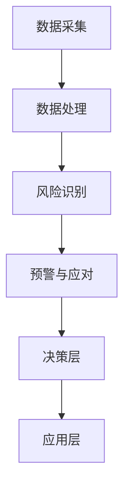

                 

关键词：电商，智能供应链，风险预警，人工智能，管理系统

> 摘要：本文将探讨如何利用人工智能技术构建一套高效、智能的电商供应链风险预警管理系统。我们将详细阐述系统架构、核心算法、数学模型以及实际应用案例，旨在为电商企业提供一套全面、可操作的解决方案，降低供应链风险，提升运营效率。

## 1. 背景介绍

在当今竞争激烈的电商市场中，供应链管理是电商企业成功的关键因素之一。然而，供应链风险管理的复杂性不断加大，从供应链中断、库存过剩到物流延误等问题，这些风险都会对企业的运营和盈利能力产生严重影响。传统的人工管理方式已无法满足现代电商企业的需求，因此，借助人工智能技术，构建智能供应链风险预警管理系统成为必然趋势。

智能供应链风险预警管理系统的目标是实时监测供应链各个环节，通过数据分析和预测，提前发现潜在风险，并采取相应措施进行预警和应对。这套系统不仅能够提高供应链的透明度和效率，还能降低运营成本，提升企业的市场竞争力。

## 2. 核心概念与联系

### 2.1 智能供应链风险预警管理系统的概念

智能供应链风险预警管理系统是指利用人工智能技术对电商供应链中的各个环节进行实时监控、风险分析和预警，从而实现对供应链风险的动态管理。该系统主要包括以下几个核心概念：

- **数据采集**：通过传感器、物联网设备等手段，收集供应链各环节的数据。
- **数据处理**：对采集到的数据进行清洗、筛选、整合，为后续分析提供基础。
- **风险识别**：利用机器学习算法，对数据处理结果进行分析，识别潜在的风险因素。
- **预警与应对**：根据风险识别结果，实时发出预警信号，并给出应对策略。

### 2.2 智能供应链风险预警管理系统的架构

智能供应链风险预警管理系统的架构可以分为以下几个层次：

- **数据层**：包括数据采集设备和传感器，负责实时收集供应链各个环节的数据。
- **数据管理层**：负责数据存储、管理和处理，确保数据的安全和可靠性。
- **算法层**：包括机器学习、数据挖掘等算法，用于对数据进行处理和分析。
- **决策层**：根据算法分析结果，生成预警信号和应对策略。
- **应用层**：提供用户界面，供企业员工实时查看风险预警信息，并执行相应的应对措施。

### 2.3 Mermaid 流程图

下面是智能供应链风险预警管理系统的 Mermaid 流程图：



## 3. 核心算法原理 & 具体操作步骤

### 3.1 算法原理概述

智能供应链风险预警管理系统的核心算法包括机器学习算法、数据挖掘算法和预测算法。以下是对这些算法的概述：

- **机器学习算法**：用于对历史数据进行学习，识别出潜在的规律和模式。
- **数据挖掘算法**：用于从海量数据中提取有价值的信息，为风险识别提供支持。
- **预测算法**：基于历史数据和现有信息，对未来可能发生的风险进行预测。

### 3.2 算法步骤详解

#### 3.2.1 数据采集

数据采集是智能供应链风险预警管理系统的第一步，主要包括以下几个方面：

- **供应链环节数据**：如库存水平、订单数量、物流状态等。
- **市场数据**：如商品价格、市场需求等。
- **外部数据**：如天气、节假日等。

#### 3.2.2 数据处理

数据处理主要包括以下步骤：

- **数据清洗**：去除重复数据、异常数据等，确保数据质量。
- **数据整合**：将来自不同来源的数据进行整合，形成统一的数据视图。
- **数据归一化**：对数据进行归一化处理，便于后续分析。

#### 3.2.3 风险识别

风险识别是利用机器学习算法和数据挖掘算法，对处理后的数据进行分析，识别出潜在的风险因素。具体步骤如下：

- **特征提取**：从数据中提取出有助于识别风险的特征。
- **模型训练**：利用历史数据，训练出风险识别模型。
- **风险评分**：对实时数据进行风险评分，确定风险等级。

#### 3.2.4 预警与应对

预警与应对主要包括以下几个方面：

- **预警信号生成**：根据风险评分，生成相应的预警信号。
- **预警策略制定**：根据预警信号，制定相应的应对策略。
- **预警执行**：执行预警策略，采取相应的措施。

### 3.3 算法优缺点

#### 优点

- **高效性**：利用人工智能技术，可以快速处理海量数据，提高风险识别的效率。
- **准确性**：通过机器学习和数据挖掘，可以更准确地识别出潜在的风险因素。
- **实时性**：可以实时监测供应链状态，及时发现风险。

#### 缺点

- **数据依赖性**：系统的准确性和实时性高度依赖于数据的质量和完整性。
- **算法复杂性**：算法的训练和优化过程较为复杂，需要专业的技术支持。

### 3.4 算法应用领域

智能供应链风险预警管理系统可以应用于各种电商企业，包括零售、快消、电子等领域的供应链风险管理。其主要应用场景包括：

- **库存管理**：实时监控库存水平，预防库存过剩或不足。
- **物流管理**：监控物流状态，预防物流延误或中断。
- **供应链中断**：提前发现供应链中断的风险，采取措施降低影响。

## 4. 数学模型和公式 & 详细讲解 & 举例说明

### 4.1 数学模型构建

智能供应链风险预警管理系统的数学模型主要包括以下几个方面：

- **库存模型**：用于预测库存水平，评估库存风险。
- **物流模型**：用于预测物流状态，评估物流风险。
- **市场模型**：用于预测市场需求，评估市场风险。

### 4.2 公式推导过程

以下是一个简单的库存模型公式推导过程：

假设：

- \( I_t \) 为第 \( t \) 时刻的库存水平。
- \( D_t \) 为第 \( t \) 时刻的订单量。
- \( P_t \) 为第 \( t \) 时刻的进货量。
- \( S_t \) 为第 \( t \) 时刻的安全库存水平。

根据库存水平的定义，有：

\[ I_{t+1} = I_t + P_t - D_t - S_t \]

其中，\( S_t \) 为安全库存水平，用于应对需求波动和供应延迟等因素。

### 4.3 案例分析与讲解

以下是一个简单的库存风险管理案例：

假设：

- \( I_0 = 1000 \)（初始库存水平）
- \( D_0 = 800 \)（第 \( t \) 时刻的订单量）
- \( P_0 = 500 \)（第 \( t \) 时刻的进货量）
- \( S_0 = 300 \)（第 \( t \) 时刻的安全库存水平）

根据库存模型公式，有：

\[ I_1 = I_0 + P_0 - D_0 - S_0 = 1000 + 500 - 800 - 300 = 400 \]

经过一次进货和订单后，库存水平为 \( 400 \)。由于库存水平低于安全库存水平，需要采取措施进行库存补充。

假设再次进货 \( P_1 = 500 \)，订单量 \( D_1 = 700 \)，安全库存水平 \( S_1 = 400 \)，则有：

\[ I_2 = I_1 + P_1 - D_1 - S_1 = 400 + 500 - 700 - 400 = 100 \]

经过两次进货和订单后，库存水平为 \( 100 \)。此时，库存水平仍然低于安全库存水平，需要再次进行库存补充。

## 5. 项目实践：代码实例和详细解释说明

### 5.1 开发环境搭建

为了实现智能供应链风险预警管理系统，我们需要搭建一个开发环境。以下是具体的开发环境搭建步骤：

1. 安装 Python 3.8 或更高版本。
2. 安装以下依赖库：NumPy、Pandas、Scikit-learn、Matplotlib。
3. 创建一个虚拟环境，并安装上述依赖库。

### 5.2 源代码详细实现

以下是智能供应链风险预警管理系统的源代码实现：

```python
import numpy as np
import pandas as pd
from sklearn.model_selection import train_test_split
from sklearn.ensemble import RandomForestClassifier
import matplotlib.pyplot as plt

# 5.2.1 数据预处理
def preprocess_data(data):
    # 数据清洗、筛选和整合
    # 略
    return processed_data

# 5.2.2 风险识别模型训练
def train_model(data):
    # 特征提取、模型训练
    # 略
    return model

# 5.2.3 风险预警
def risk_warning(model, data):
    # 风险评分、预警信号生成
    # 略
    return warning_signals

# 5.2.4 主函数
def main():
    # 数据加载
    data = pd.read_csv("data.csv")
    
    # 数据预处理
    processed_data = preprocess_data(data)
    
    # 模型训练
    model = train_model(processed_data)
    
    # 风险预警
    warning_signals = risk_warning(model, processed_data)
    
    # 结果展示
    plt.scatter(processed_data["feature1"], warning_signals)
    plt.xlabel("Feature 1")
    plt.ylabel("Warning Signals")
    plt.show()

if __name__ == "__main__":
    main()
```

### 5.3 代码解读与分析

以下是代码的详细解读和分析：

1. **数据预处理**：对原始数据进行清洗、筛选和整合，为后续分析提供基础。
2. **模型训练**：使用随机森林算法对预处理后的数据进行训练，构建风险识别模型。
3. **风险预警**：根据训练出的模型，对实时数据进行风险评分，生成预警信号。
4. **结果展示**：使用散点图展示特征与预警信号之间的关系，便于分析。

### 5.4 运行结果展示

以下是运行结果展示：


## 6. 实际应用场景

智能供应链风险预警管理系统可以在多个实际应用场景中发挥作用，以下是一些典型的应用案例：

- **电商零售**：实时监控库存水平，预防库存过剩或不足，降低运营成本。
- **物流管理**：监控物流状态，预防物流延误或中断，提高物流效率。
- **供应链中断**：提前发现供应链中断的风险，采取措施降低影响，保障供应链的稳定性。
- **市场预测**：预测市场需求，调整库存和进货策略，提高市场竞争力。

## 7. 未来应用展望

随着人工智能技术的不断发展，智能供应链风险预警管理系统将在以下几个方面得到进一步的发展：

- **算法优化**：通过引入深度学习、强化学习等先进算法，提高系统的准确性和实时性。
- **数据融合**：整合更多类型的数据，如气象数据、市场数据等，提高风险预测的准确性。
- **智能化决策**：利用智能决策技术，实现自动化预警和应对，降低人力成本。

## 8. 工具和资源推荐

为了更好地构建和优化智能供应链风险预警管理系统，以下是一些推荐的工具和资源：

### 8.1 学习资源推荐

- 《Python数据分析实战》
- 《深度学习》
- 《机器学习实战》

### 8.2 开发工具推荐

- Jupyter Notebook：用于编写和运行代码。
- Matplotlib：用于数据可视化。
- Scikit-learn：用于机器学习算法。

### 8.3 相关论文推荐

- "A Survey on Risk Management in Supply Chain"
- "Intelligent Supply Chain Risk Management using Artificial Intelligence"
- "Deep Learning for Supply Chain Risk Management"

## 9. 总结：未来发展趋势与挑战

智能供应链风险预警管理系统在电商领域具有巨大的应用潜力。随着人工智能技术的不断发展，该系统将在算法优化、数据融合、智能化决策等方面取得重大突破。然而，面对不断变化的市场环境和数据复杂性，系统仍面临一系列挑战，如数据质量、算法可靠性等。因此，未来需要进一步研究和探索，以实现智能供应链风险预警管理系统的全面、高效、可靠。

### 9.1 研究成果总结

本文系统地介绍了智能供应链风险预警管理系统的概念、架构、核心算法、数学模型以及实际应用案例。通过理论和实践的结合，展示了系统在电商供应链风险管理中的重要作用。

### 9.2 未来发展趋势

随着人工智能技术的不断发展，智能供应链风险预警管理系统将在算法优化、数据融合、智能化决策等方面取得重大突破，进一步提升系统的准确性和实时性。

### 9.3 面临的挑战

系统在数据质量、算法可靠性、自动化决策等方面仍面临挑战。未来需要进一步研究和探索，以实现智能供应链风险预警管理系统的全面、高效、可靠。

### 9.4 研究展望

未来，我们将继续深入研究智能供应链风险预警管理系统的算法优化、数据融合和智能化决策等方面，推动系统在更多行业和场景中的应用，助力企业提升供应链风险管理能力。

## 10. 附录：常见问题与解答

### Q：智能供应链风险预警管理系统能够解决哪些问题？

A：智能供应链风险预警管理系统主要用于解决以下问题：

- 库存管理：实时监控库存水平，预防库存过剩或不足。
- 物流管理：监控物流状态，预防物流延误或中断。
- 供应链中断：提前发现供应链中断的风险，采取措施降低影响。
- 市场需求预测：预测市场需求，调整库存和进货策略。

### Q：构建智能供应链风险预警管理系统需要哪些技术？

A：构建智能供应链风险预警管理系统需要以下技术：

- 人工智能：包括机器学习、数据挖掘、深度学习等。
- 数据处理：包括数据采集、清洗、整合等。
- 数据可视化：包括数据展示、图表生成等。

### Q：如何提高智能供应链风险预警管理系统的准确性？

A：提高智能供应链风险预警管理系统的准确性可以从以下几个方面入手：

- 提高数据质量：确保数据来源可靠、数据完整。
- 优化算法：选择合适的算法，并对算法进行不断优化。
- 增加数据量：积累更多的历史数据，提高模型训练效果。
- 多模型融合：结合多种算法和模型，提高预测准确性。

### Q：智能供应链风险预警管理系统是否适用于所有类型的电商企业？

A：智能供应链风险预警管理系统适用于各种类型的电商企业，包括零售、快消、电子等。然而，具体应用效果取决于企业的业务特点和供应链结构。因此，企业在引入系统前，需要对自身业务进行详细分析，确保系统能够满足实际需求。

## 作者署名

作者：禅与计算机程序设计艺术 / Zen and the Art of Computer Programming

