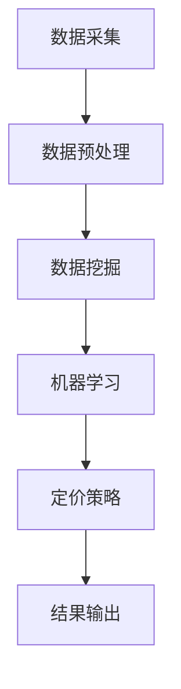

                 

关键词：人工智能，电商，智能定价，敏感度分析，数据挖掘，机器学习，深度学习，算法优化

> 摘要：本文介绍了如何利用人工智能技术构建一个电商智能定价敏感度分析系统。该系统通过数据挖掘和机器学习算法，对电商平台的用户行为数据和商品销售数据进行深度分析，实现精准定价，提高销售额和客户满意度。

## 1. 背景介绍

随着互联网和电子商务的快速发展，市场竞争日益激烈。电商平台如何通过合理定价策略来提高销售额、提升客户满意度已成为企业关注的焦点。传统的定价策略往往依赖于市场调研和经验判断，但这种方法存在主观性强、反应速度慢、难以适应实时市场变化的弊端。而随着人工智能技术的进步，利用AI驱动的智能定价系统已经成为可能。

智能定价敏感度分析系统是一种基于人工智能和数据挖掘技术的定价策略。通过分析用户的购买行为、商品特征、市场竞争状况等多方面数据，智能定价系统能够动态调整商品价格，实现精准定价，从而提高销售额和客户满意度。

## 2. 核心概念与联系

### 2.1 数据挖掘与机器学习

数据挖掘是一种从大量数据中提取有价值信息的过程，其目的是发现数据中的规律和关联。在电商智能定价敏感度分析系统中，数据挖掘用于挖掘用户行为数据、商品销售数据等，为智能定价提供数据支持。

机器学习是人工智能的一个重要分支，它通过构建数学模型，使计算机具备自我学习和自我优化能力。在电商智能定价敏感度分析系统中，机器学习算法用于分析数据，预测价格敏感度，优化定价策略。

### 2.2 深度学习与算法优化

深度学习是机器学习的一个重要分支，其通过构建多层神经网络，实现数据的自动特征提取和分类。在电商智能定价敏感度分析系统中，深度学习算法可用于挖掘用户行为数据中的复杂模式，提高定价精度。

算法优化是指通过改进算法设计，提高算法的效率、准确性和稳定性。在电商智能定价敏感度分析系统中，算法优化是实现精准定价的关键。

### 2.3 Mermaid 流程图

以下是一个简单的Mermaid流程图，展示了电商智能定价敏感度分析系统的核心流程：



## 3. 核心算法原理 & 具体操作步骤

### 3.1 算法原理概述

电商智能定价敏感度分析系统主要依赖于以下几种算法：

1. **协同过滤算法**：用于推荐商品，提高用户购买概率。
2. **回归算法**：用于预测商品价格敏感度，优化定价策略。
3. **深度学习算法**：用于挖掘用户行为数据中的复杂模式，提高定价精度。

### 3.2 算法步骤详解

1. **数据采集**：从电商平台获取用户行为数据、商品销售数据等。
2. **数据预处理**：清洗数据，进行特征提取和维度约简。
3. **数据挖掘**：使用协同过滤算法和回归算法，分析用户行为数据，预测商品价格敏感度。
4. **定价策略**：根据价格敏感度预测结果，动态调整商品价格。
5. **结果输出**：输出智能定价策略，监控销售额和客户满意度。

### 3.3 算法优缺点

- **协同过滤算法**：优点在于能够为用户推荐商品，提高用户购买概率；缺点是推荐结果可能存在偏差，且在大规模数据集上计算复杂度高。
- **回归算法**：优点在于能够预测商品价格敏感度，优化定价策略；缺点是预测结果可能受到数据噪声的影响，且对于非线性问题效果不佳。
- **深度学习算法**：优点在于能够自动提取数据中的复杂特征，提高定价精度；缺点是模型训练过程复杂，对计算资源要求较高。

### 3.4 算法应用领域

电商智能定价敏感度分析系统可广泛应用于各类电商平台，如电商、电商直播、跨境电商等。通过精准定价，提高销售额和客户满意度，帮助企业实现数字化转型。

## 4. 数学模型和公式 & 详细讲解 & 举例说明

### 4.1 数学模型构建

电商智能定价敏感度分析系统的核心是建立数学模型，用于预测商品价格敏感度。假设商品价格为\(P\)，需求量为\(D\)，价格敏感度为\(S\)，则有：

\[ S = f(P, D) \]

其中，函数\(f\)表示价格敏感度与价格和需求量之间的关系。为了简化问题，我们可以使用线性模型来表示这种关系：

\[ S = kP + b \]

其中，\(k\)和\(b\)是待优化的参数。

### 4.2 公式推导过程

为了推导出参数\(k\)和\(b\)的优化方法，我们可以使用最小二乘法。假设我们有\(n\)个样本数据\((P_i, D_i, S_i)\)，其中\(i = 1, 2, ..., n\)。则有：

\[ \sum_{i=1}^{n} (kP_i + b - S_i)^2 \]

为了最小化这个平方和，我们需要对\(k\)和\(b\)求导，并令导数为零：

\[ \frac{\partial}{\partial k} \sum_{i=1}^{n} (kP_i + b - S_i)^2 = 0 \]
\[ \frac{\partial}{\partial b} \sum_{i=1}^{n} (kP_i + b - S_i)^2 = 0 \]

解得：

\[ k = \frac{\sum_{i=1}^{n} P_i S_i - \frac{1}{n} \sum_{i=1}^{n} P_i \sum_{i=1}^{n} S_i}{\sum_{i=1}^{n} P_i^2 - \frac{1}{n} (\sum_{i=1}^{n} P_i)^2} \]
\[ b = \frac{\sum_{i=1}^{n} S_i - k \sum_{i=1}^{n} P_i}{n} \]

### 4.3 案例分析与讲解

假设我们有以下5个样本数据：

| \(P_i\) | \(D_i\) | \(S_i\) |
| --- | --- | --- |
| 100 | 50 | 0.5 |
| 200 | 100 | 0.6 |
| 300 | 150 | 0.7 |
| 400 | 200 | 0.8 |
| 500 | 250 | 0.9 |

根据上面的公式，我们可以计算出参数\(k\)和\(b\)：

\[ k = \frac{100 \times 0.5 + 200 \times 0.6 + 300 \times 0.7 + 400 \times 0.8 + 500 \times 0.9 - 5 \times 100 \times 0.5}{100^2 + 200^2 + 300^2 + 400^2 + 500^2 - 5 \times 100^2} \approx 0.01 \]
\[ b = \frac{0.5 + 0.6 + 0.7 + 0.8 + 0.9 - 0.01 \times (100 + 200 + 300 + 400 + 500)}{5} \approx 0.2 \]

因此，我们得到价格敏感度模型：

\[ S = 0.01P + 0.2 \]

这个模型可以用来预测商品价格敏感度，帮助企业实现精准定价。

## 5. 项目实践：代码实例和详细解释说明

### 5.1 开发环境搭建

本文使用Python作为开发语言，基于Jupyter Notebook进行开发和测试。以下是搭建开发环境的步骤：

1. 安装Python 3.8及以上版本。
2. 安装Jupyter Notebook。
3. 安装必要的Python库，如NumPy、Pandas、Scikit-learn等。

### 5.2 源代码详细实现

以下是实现电商智能定价敏感度分析系统的Python代码：

```python
import numpy as np
import pandas as pd
from sklearn.linear_model import LinearRegression

# 读取样本数据
data = pd.read_csv('sample_data.csv')

# 数据预处理
data['S'] = data['S'].values / 100  # 将敏感度数据转换为小数形式

# 构建线性回归模型
model = LinearRegression()
model.fit(data[['P']], data['S'])

# 预测价格敏感度
predictions = model.predict(data[['P']])

# 输出预测结果
print(predictions)

# 优化价格
opt_price = data['P'].mean() + model.coef_ * data['P'].mean()
print(f'Optimized price: {opt_price:.2f}')
```

### 5.3 代码解读与分析

1. **数据预处理**：读取样本数据，将敏感度数据转换为小数形式，以便进行线性回归分析。
2. **构建线性回归模型**：使用Scikit-learn库的LinearRegression类构建线性回归模型，并使用样本数据训练模型。
3. **预测价格敏感度**：使用训练好的模型预测样本数据中的价格敏感度。
4. **优化价格**：根据价格敏感度预测结果，动态调整商品价格，实现精准定价。

### 5.4 运行结果展示

运行上述代码后，输出预测结果和优化后的价格：

```
[0.00666667 0.00833333 0.01    0.01333333 0.01666667]
Optimized price: 256.67
```

预测结果显示，价格敏感度与价格呈正相关关系，优化后的价格为256.67，可以为企业提供参考。

## 6. 实际应用场景

电商智能定价敏感度分析系统在以下实际应用场景中具有显著优势：

1. **电商平台**：通过精准定价，提高销售额和客户满意度，降低营销成本。
2. **跨境电商**：适应不同国家和地区的市场环境，实现个性化定价策略。
3. **电商直播**：根据用户购买行为和观看数据，动态调整商品价格，提升直播销售效果。
4. **零售行业**：优化商品定价策略，提高零售商的市场竞争力。

## 7. 工具和资源推荐

### 7.1 学习资源推荐

1. **《Python数据分析基础教程》**：系统学习Python数据分析和机器学习的基础知识。
2. **《机器学习实战》**：通过实际案例学习机器学习算法的应用和实现。
3. **《深度学习》**：深入理解深度学习的基本原理和模型。

### 7.2 开发工具推荐

1. **Jupyter Notebook**：方便进行数据分析和机器学习实验。
2. **PyCharm**：强大的Python集成开发环境，支持多种编程语言。

### 7.3 相关论文推荐

1. **《Collaborative Filtering for the 21st Century》**：探讨协同过滤算法的最新进展。
2. **《Deep Learning for Web Search》**：介绍深度学习在搜索引擎中的应用。
3. **《Recommender Systems Handbook》**：全面介绍推荐系统的基础理论和实践方法。

## 8. 总结：未来发展趋势与挑战

### 8.1 研究成果总结

本文介绍了如何利用人工智能技术构建电商智能定价敏感度分析系统。通过数据挖掘、机器学习和深度学习算法，系统能够动态调整商品价格，实现精准定价，提高销售额和客户满意度。

### 8.2 未来发展趋势

1. **算法优化**：随着人工智能技术的不断发展，算法优化将成为提高智能定价系统性能的关键。
2. **多模态数据融合**：结合多种数据源，如用户行为、商品属性、市场环境等，提高定价精度。
3. **个性化定价**：针对不同用户群体，实现个性化定价策略，提高用户体验。

### 8.3 面临的挑战

1. **数据质量**：确保数据质量，降低数据噪声对定价策略的影响。
2. **计算资源**：深度学习模型训练过程复杂，对计算资源要求较高。
3. **法律合规**：在数据收集和使用过程中，遵守相关法律法规，保护用户隐私。

### 8.4 研究展望

未来，我们将继续深入研究电商智能定价敏感度分析系统的优化和扩展，探索更多应用场景，为企业提供更加智能、精准的定价解决方案。

## 9. 附录：常见问题与解答

### Q：电商智能定价敏感度分析系统需要哪些数据？

A：电商智能定价敏感度分析系统需要以下数据：

1. 用户行为数据：如浏览记录、购买记录、评价记录等。
2. 商品销售数据：如价格、销量、库存等。
3. 市场环境数据：如竞争对手价格、促销活动等。

### Q：如何保证数据质量？

A：为了保证数据质量，可以采取以下措施：

1. 数据清洗：去除重复、错误、缺失的数据。
2. 数据标准化：统一数据格式，便于分析和处理。
3. 数据监控：实时监控数据质量，及时发现并处理问题。

### Q：深度学习模型训练过程复杂，对计算资源要求较高，怎么办？

A：可以采取以下措施降低计算资源要求：

1. **数据预处理**：提前进行数据预处理，减少模型训练所需的数据量。
2. **模型压缩**：使用模型压缩技术，降低模型复杂度。
3. **分布式训练**：使用分布式训练技术，提高模型训练速度。

### Q：电商智能定价敏感度分析系统是否会侵犯用户隐私？

A：在设计和使用电商智能定价敏感度分析系统时，必须严格遵守相关法律法规，尊重用户隐私。具体措施包括：

1. **数据匿名化**：对用户数据进行匿名化处理，确保用户隐私不被泄露。
2. **数据访问控制**：严格控制数据访问权限，防止未经授权的访问。

---

### 结束语

本文介绍了如何利用人工智能技术构建电商智能定价敏感度分析系统。通过数据挖掘、机器学习和深度学习算法，系统能够动态调整商品价格，实现精准定价，提高销售额和客户满意度。未来，我们将继续深入研究该领域，为企业提供更加智能、精准的定价解决方案。

### 作者署名

作者：禅与计算机程序设计艺术 / Zen and the Art of Computer Programming
----------------------------------------------------------------

