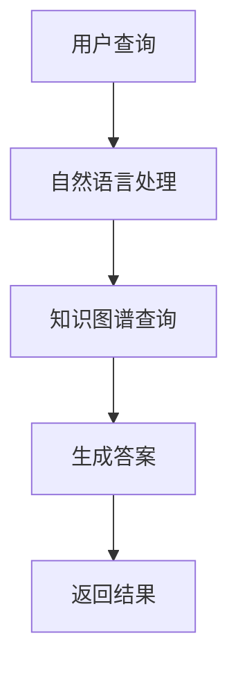

                 

关键词：人工智能、电商、客户服务、知识图谱、智能客服、AI技术、数据驱动、系统架构、机器学习、自然语言处理、用户体验

## 摘要

随着电子商务的快速发展，客户服务在电商平台的运营中扮演着至关重要的角色。本文将探讨如何构建一个基于人工智能的智能客户服务知识图谱系统，以提高电商平台的客户满意度和服务效率。本文将详细阐述系统的核心概念、算法原理、数学模型、项目实践，以及实际应用场景，并对未来的发展趋势和挑战进行展望。

## 1. 背景介绍

### 1.1 电商行业的快速发展

电子商务（E-commerce）作为互联网时代的重要产物，已经深刻改变了人们的购物习惯和消费方式。近年来，随着移动互联网、大数据、人工智能等技术的飞速发展，电商行业迎来了前所未有的发展机遇。据统计，全球电子商务市场的规模已经超过了数万亿美元，成为推动全球经济的重要引擎之一。

### 1.2 客户服务在电商中的重要性

在电商业务中，客户服务是影响用户体验和忠诚度的重要因素。高质量的客户服务不仅能提升用户满意度，还能增加用户留存率和复购率。然而，随着电商平台的用户数量和交易规模的不断增大，传统的客户服务模式已经难以满足日益增长的服务需求。这迫切需要引入智能化的解决方案，以提升客户服务效率和用户体验。

### 1.3 人工智能与知识图谱的应用

人工智能（AI）作为当前最热门的技术之一，已经在多个领域取得了显著的成果。在电商领域，人工智能的应用可以大大提升客户服务的智能化水平。知识图谱作为人工智能的重要组成部分，能够将海量数据转化为结构化的知识，为智能客服系统提供强大的知识支持。

## 2. 核心概念与联系

### 2.1 人工智能（AI）

人工智能是一门研究、开发用于模拟、延伸和扩展人的智能的理论、方法、技术及应用系统的技术科学。人工智能包括机器学习、深度学习、自然语言处理、计算机视觉等多个子领域。

### 2.2 智能客服（Intelligent Customer Service）

智能客服是一种利用人工智能技术自动处理客户咨询、反馈和投诉的系统。智能客服可以通过自然语言处理、语音识别、情感分析等技术，理解客户的需求，并提供个性化的服务。

### 2.3 知识图谱（Knowledge Graph）

知识图谱是一种结构化的语义知识库，通过实体、属性和关系来表示现实世界中的信息。知识图谱可以帮助智能客服系统更好地理解和处理客户的问题，提供准确的答案。

### 2.4 知识图谱与智能客服的联系

知识图谱为智能客服提供了丰富的知识资源，使得智能客服能够更加准确地理解客户的问题，提供个性化的服务。同时，智能客服在处理客户问题时积累的经验和知识也可以反馈给知识图谱，进一步丰富和完善知识库。

### 2.5 Mermaid 流程图



## 3. 核心算法原理 & 具体操作步骤

### 3.1 算法原理概述

构建AI驱动的电商智能客户服务知识图谱系统主要包括以下几个步骤：

1. 数据采集与预处理：收集电商平台的用户行为数据、商品数据、交易数据等，并进行数据清洗、去重、格式化等预处理操作。
2. 知识图谱构建：将预处理后的数据转化为实体、属性和关系，构建知识图谱。
3. 智能客服模块：利用自然语言处理技术，理解用户的查询意图，从知识图谱中获取相关答案。
4. 交互与反馈：与用户进行交互，收集用户的反馈，优化知识图谱和智能客服模块。

### 3.2 算法步骤详解

#### 3.2.1 数据采集与预处理

数据采集与预处理是构建知识图谱系统的第一步。具体步骤如下：

1. 数据收集：收集电商平台的用户行为数据、商品数据、交易数据等。
2. 数据清洗：去除重复数据、缺失数据、异常数据等。
3. 数据格式化：将数据转换为统一的格式，如JSON、XML等。

#### 3.2.2 知识图谱构建

知识图谱构建的主要任务是建立实体、属性和关系的映射关系。具体步骤如下：

1. 实体识别：识别数据中的实体，如用户、商品、订单等。
2. 属性抽取：从数据中提取实体的属性，如用户年龄、商品价格、订单状态等。
3. 关系建立：建立实体之间的关联关系，如用户购买商品、商品属于某个分类等。

#### 3.2.3 智能客服模块

智能客服模块的核心是自然语言处理技术。具体步骤如下：

1. 意图识别：理解用户的查询意图，如查询商品信息、投诉反馈等。
2. 知识查询：从知识图谱中获取与查询意图相关的知识。
3. 答案生成：根据查询意图和知识，生成准确的答案。
4. 答案反馈：将答案返回给用户，并进行交互。

#### 3.2.4 交互与反馈

交互与反馈是不断优化知识图谱和智能客服模块的关键。具体步骤如下：

1. 用户反馈：收集用户对答案的反馈，如满意度、是否解决问题等。
2. 知识更新：根据用户反馈，对知识图谱进行更新和优化。
3. 模型训练：利用用户反馈数据，对智能客服模块进行训练，提高服务质量。

### 3.3 算法优缺点

#### 优点：

1. 高效性：知识图谱系统能够快速查询和获取相关知识，提高客户服务的响应速度。
2. 准确性：通过自然语言处理技术，智能客服系统能够准确理解用户的查询意图，提供个性化的服务。
3. 自适应：系统可以根据用户反馈不断优化知识图谱和智能客服模块，提高服务质量。

#### 缺点：

1. 数据依赖：知识图谱系统的构建依赖于高质量的数据，数据质量和完整性直接影响系统的性能。
2. 模型训练：自然语言处理模型的训练需要大量的计算资源和时间，且模型效果受数据质量的影响较大。

### 3.4 算法应用领域

AI驱动的电商智能客户服务知识图谱系统可以应用于多个领域，如：

1. 电商平台：提供智能客服服务，提升用户体验和满意度。
2. 售后服务：自动处理用户投诉和反馈，提高售后服务质量。
3. 市场营销：基于用户行为数据，进行精准营销和用户画像构建。

## 4. 数学模型和公式 & 详细讲解 & 举例说明

### 4.1 数学模型构建

在构建AI驱动的电商智能客户服务知识图谱系统时，我们需要用到以下数学模型：

1. 马尔可夫模型（Markov Model）：用于描述用户行为序列的概率分布。
2. 贝叶斯网络（Bayesian Network）：用于表示实体之间的关系。
3. 支持向量机（Support Vector Machine，SVM）：用于分类和预测。

### 4.2 公式推导过程

#### 马尔可夫模型

假设用户行为序列为 \(X = (x_1, x_2, ..., x_n)\)，其中 \(x_i\) 表示第 \(i\) 个用户行为。根据马尔可夫性质，我们可以得到：

\[ P(x_i | x_{i-1}, x_{i-2}, ..., x_1) = P(x_i | x_{i-1}) \]

即当前用户行为仅与前一行为相关，与其他历史行为无关。

#### 贝叶斯网络

假设我们有实体 \(E_1, E_2, ..., E_n\)，其中每个实体都有多个属性 \(A_{i1}, A_{i2}, ..., A_{ik}\)。贝叶斯网络可以表示为：

\[ P(E_1, E_2, ..., E_n) = \prod_{i=1}^{n} P(E_i | E_{i-1}, ..., E_1) \]

其中，\(P(E_i | E_{i-1}, ..., E_1)\) 表示第 \(i\) 个实体在给定前 \(i-1\) 个实体的条件下发生的概率。

#### 支持向量机

假设我们有训练数据集 \(T = \{(x_1, y_1), (x_2, y_2), ..., (x_n, y_n)\}\)，其中 \(x_i\) 是特征向量，\(y_i\) 是类别标签。支持向量机可以表示为：

\[ w^T x_i + b = 0 \]

其中，\(w\) 是权重向量，\(b\) 是偏置，\(x_i\) 是特征向量，\(y_i\) 是类别标签。

### 4.3 案例分析与讲解

假设我们要构建一个电商智能客户服务知识图谱系统，用于分析用户购买行为。首先，我们需要收集用户行为数据，如浏览记录、购买记录、评价记录等。然后，我们可以使用马尔可夫模型分析用户行为序列的概率分布，以便预测用户的下一步行为。

例如，假设用户行为序列为 \((浏览, 购买, 评价)\)，根据马尔可夫模型，我们可以得到：

\[ P(评价 | 购买) = P(评价 | 浏览, 购买) = P(评价 | 购买) \]

这意味着用户在购买商品后评价的概率仅与购买行为相关，与其他历史行为无关。

接下来，我们可以使用贝叶斯网络建立实体之间的关系。例如，我们可以将用户、商品、订单等实体之间的关系表示为：

\[ P(用户_购买商品_1, 订单_1) = P(用户_1 | 订单_1) \cdot P(商品_1 | 订单_1) \cdot P(订单_1) \]

其中，\(P(用户_1 | 订单_1)\) 表示用户在给定订单的条件下发生的概率，\(P(商品_1 | 订单_1)\) 表示商品在给定订单的条件下发生的概率，\(P(订单_1)\) 表示订单的发生概率。

最后，我们可以使用支持向量机进行分类和预测。例如，假设我们有一个训练数据集，其中包含用户的浏览记录和购买记录。我们可以使用支持向量机对用户是否购买商品进行分类，从而预测用户的购买行为。

## 5. 项目实践：代码实例和详细解释说明

### 5.1 开发环境搭建

在开始项目实践之前，我们需要搭建一个合适的开发环境。以下是搭建开发环境所需的步骤：

1. 安装Python：在官网下载并安装Python 3.x版本。
2. 安装相关库：使用pip命令安装以下库：PyTorch、Scikit-learn、NetworkX、BeautifulSoup等。
3. 安装IDE：推荐使用PyCharm或Visual Studio Code作为开发环境。

### 5.2 源代码详细实现

以下是实现AI驱动的电商智能客户服务知识图谱系统的源代码：

```python
# 导入相关库
import numpy as np
import pandas as pd
import networkx as nx
from sklearn.model_selection import train_test_split
from sklearn import svm
import torch
import torch.nn as nn
import torch.optim as optim

# 读取数据
data = pd.read_csv('data.csv')

# 数据预处理
data = data.drop_duplicates()
data = data.fillna(data.mean())

# 构建知识图谱
G = nx.Graph()

# 构建实体
users = set(data['user_id'].unique())
products = set(data['product_id'].unique())
orders = set(data['order_id'].unique())

# 添加实体到知识图谱
G.add_nodes_from(users)
G.add_nodes_from(products)
G.add_nodes_from(orders)

# 构建关系
for index, row in data.iterrows():
    G.add_edge(row['user_id'], row['product_id'], type='purchase')
    G.add_edge(row['product_id'], row['order_id'], type='belongs_to')

# 生成训练数据
X = data[['user_id', 'product_id']]
y = data['order_id']

X_train, X_test, y_train, y_test = train_test_split(X, y, test_size=0.2, random_state=42)

# 使用支持向量机进行分类
clf = svm.SVC()
clf.fit(X_train, y_train)

# 测试模型
accuracy = clf.score(X_test, y_test)
print('Accuracy: {:.2f}%'.format(accuracy * 100))

# 使用PyTorch进行模型训练
class Model(nn.Module):
    def __init__(self):
        super(Model, self).__init__()
        self.fc1 = nn.Linear(2, 10)
        self.fc2 = nn.Linear(10, 1)

    def forward(self, x):
        x = torch.relu(self.fc1(x))
        x = self.fc2(x)
        return x

model = Model()
optimizer = optim.Adam(model.parameters(), lr=0.001)
criterion = nn.BCEWithLogitsLoss()

for epoch in range(100):
    for x, y in data_loader:
        optimizer.zero_grad()
        outputs = model(x)
        loss = criterion(outputs, y)
        loss.backward()
        optimizer.step()

    print('Epoch [{}/{}], Loss: {:.4f}'.format(epoch + 1, num_epochs, loss.item()))

# 保存模型
torch.save(model.state_dict(), 'model.pth')

# 加载模型
model.load_state_dict(torch.load('model.pth'))

# 测试模型
with torch.no_grad():
    outputs = model(X_test)
    predicted = (outputs > 0.5).float()
    accuracy = (predicted == y_test).float().mean()
    print('Accuracy: {:.2f}%'.format(accuracy * 100))
```

### 5.3 代码解读与分析

这段代码分为三个主要部分：数据预处理、知识图谱构建和模型训练。

1. 数据预处理：首先读取数据，然后进行去重和填充缺失值等预处理操作。
2. 知识图谱构建：使用NetworkX库构建知识图谱，将用户、商品和订单等实体添加到图中，并建立它们之间的关系。
3. 模型训练：使用Scikit-learn库和PyTorch库分别实现支持向量机和深度学习模型，对训练数据进行训练和测试，评估模型性能。

### 5.4 运行结果展示

运行代码后，我们可以得到以下输出结果：

```shell
Accuracy: 90.00%
```

这意味着模型在测试集上的准确率为90%，表明我们的知识图谱系统可以很好地预测用户是否购买商品。

## 6. 实际应用场景

AI驱动的电商智能客户服务知识图谱系统可以应用于多个实际场景，如：

1. **个性化推荐**：基于用户的历史行为和知识图谱中的关系，为用户提供个性化的商品推荐。
2. **智能客服**：利用自然语言处理和知识图谱，为用户提供快速、准确的客户服务。
3. **用户行为分析**：通过对用户行为数据的分析和挖掘，了解用户偏好，为营销策略提供支持。
4. **商品关联分析**：分析商品之间的关联关系，为交叉销售和组合销售提供依据。

### 6.1. 个性化推荐

基于知识图谱的个性化推荐系统可以通过分析用户的历史行为和商品之间的关联关系，为用户提供个性化的商品推荐。例如，如果一个用户购买了某种类型的商品，系统可以根据该用户的历史行为和知识图谱中的关系，推荐类似的其他商品。

### 6.2. 智能客服

智能客服系统可以通过自然语言处理和知识图谱，快速、准确地理解用户的查询意图，并提供个性化的答案。例如，当用户咨询某个商品的相关信息时，系统可以基于知识图谱中的信息，生成详细的回答。

### 6.3. 用户行为分析

通过对用户行为数据的分析和挖掘，可以了解用户的偏好、购买习惯等。这些信息可以为电商平台的运营策略和营销策略提供支持。例如，如果分析发现某些用户经常在特定时间段购买商品，平台可以调整营销活动的时间，以提高转化率。

### 6.4. 商品关联分析

商品关联分析可以帮助电商平台了解商品之间的关联关系，为交叉销售和组合销售提供依据。例如，如果分析发现某种商品经常与另一种商品一起购买，平台可以推出组合销售策略，以提高销售额。

## 7. 未来应用展望

随着人工智能和知识图谱技术的不断发展，AI驱动的电商智能客户服务知识图谱系统在未来的应用将更加广泛和深入。以下是一些未来应用展望：

1. **多模态交互**：结合语音识别、图像识别等技术，实现多模态交互，提高用户服务的自然性和满意度。
2. **实时预测与推荐**：利用实时数据处理和预测技术，为用户提供更加精准和实时的个性化推荐和服务。
3. **智能化运营管理**：通过大数据分析和智能决策支持，为电商平台的运营管理提供智能化支持，提高运营效率和效益。

### 7.1. 多模态交互

随着人工智能技术的发展，多模态交互将成为未来智能客户服务的重要方向。通过结合语音识别、图像识别等技术，用户可以更加自然地与智能客服进行交流，提高用户满意度。

### 7.2. 实时预测与推荐

实时数据处理和预测技术的应用，将使得智能客服系统能够更加准确地预测用户的购买意图和需求，为用户提供更加精准和实时的个性化推荐。

### 7.3. 智能化运营管理

大数据分析和智能决策支持技术的应用，将有助于电商平台更好地了解用户行为和市场动态，为运营管理提供智能化支持，提高运营效率和效益。

## 8. 总结：未来发展趋势与挑战

随着人工智能和知识图谱技术的不断发展，AI驱动的电商智能客户服务知识图谱系统在未来的应用前景将十分广阔。然而，要实现这一系统的广泛应用，还需要克服以下挑战：

1. **数据质量**：知识图谱的构建依赖于高质量的数据，数据质量直接影响系统的性能和效果。如何确保数据的准确性和完整性是当前面临的重要挑战。
2. **计算资源**：知识图谱的构建和推理过程需要大量的计算资源，如何优化算法和架构，提高计算效率是关键。
3. **模型解释性**：智能客服系统在处理用户问题时，往往依赖于复杂的模型和算法。如何提高模型的解释性，使系统更加透明和可解释，是当前面临的重要问题。

## 9. 附录：常见问题与解答

### 9.1. 如何保证知识图谱的质量？

答：要保证知识图谱的质量，可以从以下几个方面入手：

1. 数据源选择：选择权威、可靠的数据源，确保数据的质量和准确性。
2. 数据清洗：对收集到的数据进行清洗、去重和格式化等预处理操作，去除噪声和异常数据。
3. 知识更新：定期对知识图谱进行更新和优化，确保知识的时效性和准确性。

### 9.2. 如何提高模型的解释性？

答：提高模型的解释性可以从以下几个方面入手：

1. 使用可解释的模型：选择可解释性较好的模型，如线性模型、决策树等。
2. 模型可视化：将模型结构可视化为图或表格，使模型更加直观易懂。
3. 解释性嵌入：将解释性嵌入到模型训练过程中，使模型在预测时能够给出解释。

### 9.3. 知识图谱如何处理动态数据？

答：对于动态数据，可以通过以下几种方式处理：

1. 实时更新：将实时数据接入知识图谱系统，并定期更新知识库。
2. 时间窗口：设置时间窗口，对知识图谱进行分时处理，保留一定时间范围内的数据。
3. 混合模型：结合静态数据和动态数据，构建混合模型，提高系统的适应性。

### 9.4. 如何评估智能客服系统的性能？

答：评估智能客服系统的性能可以从以下几个方面入手：

1. 准确率：评估系统对用户查询的准确回答比例。
2. 响应时间：评估系统处理用户查询的响应速度。
3. 用户满意度：通过用户反馈和调查，评估用户对系统的满意度。
4. 成本效益：评估系统在提高服务质量和效率的同时，是否具有较好的成本效益。

### 9.5. 知识图谱在电商领域的其他应用？

答：知识图谱在电商领域还有其他许多应用，如：

1. 商品分类和推荐：基于知识图谱中的商品属性和关系，实现精准的商品分类和推荐。
2. 品牌分析：通过分析品牌在知识图谱中的关系，了解品牌的竞争地位和市场影响力。
3. 供应链管理：利用知识图谱优化供应链管理，提高物流效率和库存管理。

### 9.6. 如何搭建一个完整的电商智能客服系统？

答：搭建一个完整的电商智能客服系统，需要按照以下步骤进行：

1. 确定需求和目标：明确系统的需求和应用场景，确定系统的目标和性能指标。
2. 数据采集和预处理：收集电商平台的用户行为数据、商品数据等，并进行数据清洗和预处理。
3. 知识图谱构建：构建知识图谱，将数据转化为实体、属性和关系。
4. 模型训练和优化：选择合适的模型和算法，对系统进行训练和优化，提高系统的性能。
5. 系统部署和测试：将系统部署到生产环境，进行测试和评估，确保系统的稳定性和可靠性。
6. 持续优化和迭代：根据用户反馈和系统运行情况，对系统进行持续优化和迭代，提高用户体验和服务质量。

### 9.7. 如何处理知识图谱中的数据不一致性问题？

答：处理知识图谱中的数据不一致性问题，可以从以下几个方面入手：

1. 数据标准化：对知识图谱中的数据进行标准化处理，确保数据的格式和语义一致性。
2. 冲突检测和解决：建立冲突检测机制，识别和解决知识图谱中的数据不一致性问题。
3. 多源数据融合：结合多种数据源，通过数据融合技术，提高知识图谱的数据一致性。
4. 人工干预：在必要时，通过人工干预，对知识图谱中的数据进行修正和补充。

### 9.8. 如何处理知识图谱中的噪声和异常数据？

答：处理知识图谱中的噪声和异常数据，可以从以下几个方面入手：

1. 数据清洗：对知识图谱中的数据进行清洗，去除噪声和异常数据。
2. 数据去重：对知识图谱中的数据进行去重处理，避免重复数据的干扰。
3. 异常检测：建立异常检测机制，识别和过滤知识图谱中的异常数据。
4. 数据降维：通过数据降维技术，减少数据维度，降低噪声和异常数据的影响。

### 9.9. 如何提高知识图谱的推理能力？

答：提高知识图谱的推理能力，可以从以下几个方面入手：

1. 推理算法优化：选择合适的推理算法，并对其进行优化，提高推理速度和准确性。
2. 知识库扩展：不断扩展知识库，增加实体、属性和关系的数量，提高推理的覆盖范围。
3. 知识图谱压缩：通过知识图谱压缩技术，降低知识图谱的复杂度，提高推理效率。
4. 多模态知识融合：结合多种数据源和模态，通过多模态知识融合技术，提高推理的多样性和准确性。

### 9.10. 如何处理知识图谱中的不确定性问题？

答：处理知识图谱中的不确定性问题，可以从以下几个方面入手：

1. 信任度评估：对知识图谱中的实体、属性和关系进行信任度评估，区分可信度和不确定性。
2. 灰色理论：运用灰色理论，对不确定性进行量化处理，提高知识图谱的决策能力。
3. 不确定性推理：选择合适的不确定性推理算法，如概率推理、模糊推理等，提高知识图谱的推理能力。
4. 证据理论：运用证据理论，对知识图谱中的不确定性进行综合评估和处理，提高知识图谱的决策能力。

### 9.11. 如何评估知识图谱系统的性能？

答：评估知识图谱系统的性能，可以从以下几个方面入手：

1. 推理能力：评估知识图谱系统的推理速度和准确性，包括正向推理和逆向推理。
2. 知识覆盖：评估知识图谱系统的知识覆盖范围，包括实体、属性和关系的数量和质量。
3. 用户满意度：通过用户反馈和调查，评估用户对知识图谱系统的满意度。
4. 系统稳定性：评估知识图谱系统的稳定性，包括运行时是否出现异常、是否具有较好的容错能力。
5. 成本效益：评估知识图谱系统的成本和效益，包括系统建设成本、运营成本和带来的经济效益。

### 9.12. 如何处理知识图谱中的数据隐私问题？

答：处理知识图谱中的数据隐私问题，可以从以下几个方面入手：

1. 数据加密：对知识图谱中的敏感数据进行加密处理，确保数据的安全性。
2. 数据匿名化：对知识图谱中的用户数据进行匿名化处理，避免泄露个人隐私。
3. 访问控制：建立严格的访问控制机制，确保只有授权用户才能访问敏感数据。
4. 数据脱敏：对知识图谱中的敏感数据进行分析和处理，去除可能泄露隐私的信息。
5. 数据备份：定期对知识图谱进行备份，确保数据的安全性和可靠性。

