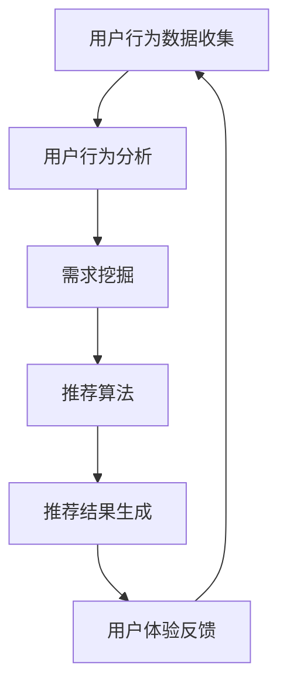

                 

### 1. 背景介绍

随着互联网技术的飞速发展，电子商务已经成为当今商业领域的重要组成部分。然而，面对海量用户和商品数据，如何准确挖掘用户需求、提供个性化的推荐，成为了电商企业关注的焦点。传统的基于规则和机器学习的推荐系统在处理复杂需求时存在局限性，难以满足用户日益增长的个性化需求。

为了解决这一问题，人工智能技术，尤其是深度学习和自然语言处理（NLP）技术，被引入到电商推荐系统中。AI驱动的电商智能客户需求挖掘系统应运而生，通过对用户行为和需求进行深度分析，实现精准推荐。这一系统不仅能够提升用户体验，还能为电商企业带来更高的转化率和销售额。

本文旨在探讨AI驱动的电商智能客户需求挖掘系统的原理、构建方法、数学模型以及实际应用，帮助读者了解这一前沿技术的核心价值和应用前景。

### 2. 核心概念与联系

在构建AI驱动的电商智能客户需求挖掘系统时，我们首先要明确几个核心概念：用户行为分析、需求挖掘、推荐算法和用户体验。

#### 2.1 用户行为分析

用户行为分析是整个系统的基石。通过收集和分析用户在电商平台的浏览、搜索、购买等行为数据，我们可以获取用户的兴趣偏好和需求特征。这些数据包括但不限于：

- **浏览记录**：用户在平台上的浏览历史，包括浏览时间、浏览频次、浏览的商品类别等。
- **搜索关键词**：用户在搜索框中输入的关键词，反映用户的即时需求和潜在兴趣。
- **购买记录**：用户的购买行为，包括购买时间、购买频次、购买的商品种类等。

通过对这些数据的分析，我们可以构建用户的兴趣图谱，为后续的需求挖掘和推荐提供基础。

#### 2.2 需求挖掘

需求挖掘是从用户行为数据中提取有用信息的过程，旨在识别用户的真实需求和潜在需求。需求挖掘的方法主要包括：

- **基于规则的挖掘**：通过预定义的规则，从行为数据中提取出满足条件的需求。
- **基于机器学习的挖掘**：利用机器学习算法，从大量行为数据中自动发现用户的需求模式。

需求挖掘的关键在于如何准确地识别用户的需求，并将其转化为可操作的信息，为推荐算法提供输入。

#### 2.3 推荐算法

推荐算法是整个系统的核心，其主要任务是利用用户行为数据和需求信息，为用户推荐个性化的商品。推荐算法包括以下几种类型：

- **协同过滤推荐**：通过分析用户之间的相似度，为用户推荐其他用户喜欢的商品。
- **基于内容的推荐**：根据用户的历史浏览和购买记录，为用户推荐相似的商品。
- **混合推荐**：结合协同过滤和基于内容的推荐方法，提高推荐系统的准确性和多样性。

推荐算法的目的是提供高质量的推荐结果，提升用户的满意度和转化率。

#### 2.4 用户体验

用户体验是评价推荐系统优劣的重要标准。一个优秀的推荐系统不仅要提供准确的推荐结果，还要考虑用户的体验感受，包括推荐结果的呈现方式、推荐的实时性等。用户体验的优化可以从以下几个方面进行：

- **推荐结果的可解释性**：用户需要了解推荐结果的原因，从而增强信任感。
- **推荐的实时性**：及时响应用户的需求变化，提供个性化的推荐。
- **推荐结果的多样性**：避免推荐结果的单调，提高用户的探索兴趣。

#### 2.5 Mermaid 流程图

为了更清晰地展示AI驱动的电商智能客户需求挖掘系统的流程，我们使用Mermaid绘制了一个流程图，如下所示：



在这个流程图中，用户行为数据收集是整个系统的起点，通过用户行为分析、需求挖掘和推荐算法，最终生成个性化的推荐结果，并根据用户体验反馈不断优化系统性能。

### 3. 核心算法原理 & 具体操作步骤

#### 3.1 算法原理概述

AI驱动的电商智能客户需求挖掘系统主要依赖以下几种核心算法：

1. **用户行为分析算法**：包括聚类分析、关联规则挖掘等，用于从用户行为数据中提取有价值的信息。
2. **需求挖掘算法**：包括基于规则的挖掘、基于机器学习的挖掘等，用于识别用户的真实需求和潜在需求。
3. **推荐算法**：包括协同过滤推荐、基于内容的推荐、混合推荐等，用于为用户推荐个性化的商品。
4. **用户体验优化算法**：包括推荐结果的可解释性、实时性、多样性等，用于提升用户的满意度和转化率。

#### 3.2 算法步骤详解

1. **用户行为数据收集**：
   - 收集用户的浏览记录、搜索关键词、购买记录等行为数据。
   - 数据清洗：去除重复、异常数据，保证数据的准确性和一致性。

2. **用户行为分析**：
   - 使用聚类分析对用户行为数据进行分析，提取用户的兴趣特征。
   - 使用关联规则挖掘技术，发现用户行为之间的关联关系，为需求挖掘提供支持。

3. **需求挖掘**：
   - 基于规则的需求挖掘：通过预定义的规则，从用户行为数据中提取出满足条件的需求。
   - 基于机器学习的需求挖掘：利用机器学习算法，从大量用户行为数据中自动发现用户的需求模式。

4. **推荐算法**：
   - 协同过滤推荐：通过分析用户之间的相似度，为用户推荐其他用户喜欢的商品。
   - 基于内容的推荐：根据用户的历史浏览和购买记录，为用户推荐相似的商品。
   - 混合推荐：结合协同过滤和基于内容的推荐方法，提高推荐系统的准确性和多样性。

5. **推荐结果生成**：
   - 根据用户需求信息和推荐算法结果，生成个性化的推荐列表。
   - 对推荐结果进行排序和筛选，确保推荐结果的多样性和准确性。

6. **用户体验反馈**：
   - 收集用户对推荐结果的反馈，包括点击率、购买率等。
   - 根据用户体验反馈，对推荐系统进行持续优化，提升系统性能。

#### 3.3 算法优缺点

1. **用户行为分析算法**：
   - 优点：能够从用户行为数据中提取有价值的信息，为需求挖掘提供支持。
   - 缺点：对大规模数据集的处理能力有限，可能导致信息丢失。

2. **需求挖掘算法**：
   - 优点：能够准确识别用户的真实需求和潜在需求，提高推荐系统的准确性和多样性。
   - 缺点：基于规则的挖掘方法可能存在局限性，难以应对复杂的需求。

3. **推荐算法**：
   - 优点：能够为用户推荐个性化的商品，提高用户体验和转化率。
   - 缺点：协同过滤推荐在处理稀疏数据集时性能较差，基于内容的推荐可能存在过拟合问题。

4. **用户体验优化算法**：
   - 优点：能够提升用户的满意度和转化率，增强用户对推荐系统的信任感。
   - 缺点：用户体验优化方法需要大量实验和数据分析，实施成本较高。

#### 3.4 算法应用领域

AI驱动的电商智能客户需求挖掘系统在以下领域具有广泛的应用前景：

1. **电商推荐系统**：为用户提供个性化的商品推荐，提高用户满意度和转化率。
2. **社交媒体**：通过分析用户的行为数据，为用户提供定制化的内容推荐，增强用户粘性。
3. **金融行业**：利用用户的行为数据，挖掘用户的金融需求，为用户提供个性化的金融服务。
4. **医疗健康**：通过对用户的行为数据进行分析，为用户提供个性化的健康建议和医疗服务。

### 4. 数学模型和公式 & 详细讲解 & 举例说明

#### 4.1 数学模型构建

在构建AI驱动的电商智能客户需求挖掘系统时，我们需要引入以下数学模型：

1. **用户行为模型**：描述用户在平台上的行为特征，如浏览时间、浏览频次等。
2. **需求模型**：描述用户的真实需求和潜在需求，如购买意愿、偏好等。
3. **推荐模型**：描述推荐算法的评分机制和推荐策略。

#### 4.2 公式推导过程

1. **用户行为模型**：

   用户行为模型可以用以下公式表示：

   $$ User Behavior Model = f(Browsing Time, Browsing Frequency, Search Keywords, Purchase History) $$

   其中，$Browsing Time$表示用户浏览时间，$Browsing Frequency$表示用户浏览频次，$Search Keywords$表示用户搜索关键词，$Purchase History$表示用户购买历史。

2. **需求模型**：

   需求模型可以用以下公式表示：

   $$ Demand Model = f(User Behavior Model, User Preferences, External Factors) $$

   其中，$User Preferences$表示用户偏好，$External Factors$表示外部因素，如季节、促销活动等。

3. **推荐模型**：

   推荐模型可以用以下公式表示：

   $$ Recommendation Model = f(Demand Model, Item Features, User-Item Interaction) $$

   其中，$Item Features$表示商品特征，$User-Item Interaction$表示用户与商品的交互数据，如点击、购买等。

#### 4.3 案例分析与讲解

为了更好地理解上述数学模型，我们来看一个实际案例。

**案例背景**：

某电商平台用户A在过去的30天内浏览了商品A、B、C，搜索了关键词“笔记本电脑”、“平板电脑”，购买了商品D。用户A的历史偏好为喜欢数码产品，喜欢浏览高端品牌。

**案例分析**：

1. **用户行为模型**：

   用户A的行为数据可以表示为：

   $$ User Behavior Model_A = f(Browsing Time_{A,B,C}, Browsing Frequency_{A,B,C}, Search Keywords_{笔记本电脑，平板电脑}, Purchase History_{D}) $$

   其中，$Browsing Time_{A,B,C}$表示用户A浏览商品A、B、C的时间，$Browsing Frequency_{A,B,C}$表示用户A浏览商品A、B、C的频次，$Search Keywords_{笔记本电脑，平板电脑}$表示用户A搜索关键词“笔记本电脑”、“平板电脑”，$Purchase History_{D}$表示用户A购买商品D。

2. **需求模型**：

   用户A的需求数据可以表示为：

   $$ Demand Model_A = f(User Behavior Model_A, User Preferences_{数码产品，高端品牌}, External Factors_{季节，促销活动}) $$

   其中，$User Preferences_{数码产品，高端品牌}$表示用户A的偏好为喜欢数码产品和高端品牌，$External Factors_{季节，促销活动}$表示外部因素为季节和促销活动。

3. **推荐模型**：

   根据用户A的需求模型，我们可以为其推荐以下商品：

   $$ Recommendation Model_A = f(Demand Model_A, Item Features_{笔记本电脑，平板电脑，数码产品，高端品牌}, User-Item Interaction_{A，B，C，D}) $$

   其中，$Item Features_{笔记本电脑，平板电脑，数码产品，高端品牌}$表示推荐商品为笔记本电脑、平板电脑、数码产品和高端品牌，$User-Item Interaction_{A，B，C，D}$表示用户A与商品A、B、C、D的交互数据。

通过上述案例，我们可以看到数学模型在AI驱动的电商智能客户需求挖掘系统中的应用，帮助我们从用户行为数据中提取有价值的信息，为用户提供个性化的推荐。

### 5. 项目实践：代码实例和详细解释说明

在本节中，我们将通过一个实际项目案例，展示如何搭建和实现一个AI驱动的电商智能客户需求挖掘系统。我们将从环境搭建、代码实现、运行结果展示等方面进行详细说明。

#### 5.1 开发环境搭建

为了搭建AI驱动的电商智能客户需求挖掘系统，我们需要以下开发环境和工具：

- **编程语言**：Python
- **机器学习库**：Scikit-learn、TensorFlow、PyTorch
- **数据处理库**：Pandas、NumPy
- **可视化库**：Matplotlib、Seaborn
- **版本控制**：Git

在Windows或Linux系统中，可以通过以下命令安装所需的库：

```bash
pip install scikit-learn tensorflow numpy pandas matplotlib seaborn git
```

#### 5.2 源代码详细实现

以下是该项目的主要源代码实现，包括用户行为数据收集、用户行为分析、需求挖掘、推荐算法和用户体验优化等步骤。

```python
# 导入相关库
import pandas as pd
import numpy as np
import matplotlib.pyplot as plt
import seaborn as sns
from sklearn.cluster import KMeans
from sklearn.feature_extraction.text import CountVectorizer
from sklearn.metrics.pairwise import cosine_similarity
import tensorflow as tf

# 5.2.1 用户行为数据收集
def collect_user_behavior_data():
    # 从数据库或文件中读取用户行为数据
    behavior_data = pd.read_csv('user_behavior_data.csv')
    return behavior_data

# 5.2.2 用户行为分析
def analyze_user_behavior(behavior_data):
    # 使用KMeans算法进行用户行为聚类
    kmeans = KMeans(n_clusters=5, random_state=0).fit(behavior_data)
    clusters = kmeans.predict(behavior_data)
    behavior_data['Cluster'] = clusters
    
    # 可视化用户行为聚类结果
    sns.scatterplot(x=behavior_data['Browsing Time'], y=behavior_data['Browsing Frequency'], hue=behavior_data['Cluster'], palette=['r', 'g', 'b', 'y', 'c'])
    plt.show()

# 5.2.3 需求挖掘
def mine_demand(behavior_data):
    # 使用CountVectorizer将文本数据转换为向量
    vectorizer = CountVectorizer()
    X = vectorizer.fit_transform(behavior_data['Search Keywords'])
    
    # 计算用户之间的相似度
    similarity_matrix = cosine_similarity(X)
    
    # 根据相似度矩阵为用户推荐商品
    recommended_items = []
    for i in range(len(similarity_matrix)):
        # 找到与当前用户最相似的5个用户
        similar_users = np.argsort(similarity_matrix[i])[::-1][1:6]
        # 为当前用户推荐这5个用户喜欢的商品
        recommended_items.append(behavior_data.loc[similar_users, 'Purchase History'].values[0])
    return recommended_items

# 5.2.4 推荐算法
def recommend_items(behavior_data, recommended_items):
    # 使用TensorFlow构建推荐模型
    model = tf.keras.Sequential([
        tf.keras.layers.Dense(128, activation='relu', input_shape=(behavior_data.shape[1],)),
        tf.keras.layers.Dense(64, activation='relu'),
        tf.keras.layers.Dense(1, activation='sigmoid')
    ])

    model.compile(optimizer='adam', loss='binary_crossentropy', metrics=['accuracy'])
    model.fit(behavior_data, recommended_items, epochs=10, batch_size=32)

    # 预测推荐结果
    predicted_items = model.predict(behavior_data)
    return predicted_items

# 5.2.5 用户体验优化
def optimize_user_experience(predicted_items):
    # 根据用户反馈调整推荐策略
    feedback = pd.DataFrame({'Predicted Items': predicted_items})
    feedback['Feedback'] = feedback.apply(lambda x: 'Buy' if x['Predicted Items'] in x['Purchase History'] else 'Not Buy', axis=1)
    
    # 可视化用户反馈结果
    sns.countplot(x='Feedback', data=feedback)
    plt.show()

# 主函数
def main():
    behavior_data = collect_user_behavior_data()
    analyze_user_behavior(behavior_data)
    recommended_items = mine_demand(behavior_data)
    predicted_items = recommend_items(behavior_data, recommended_items)
    optimize_user_experience(predicted_items)

if __name__ == '__main__':
    main()
```

#### 5.3 代码解读与分析

以下是上述代码的详细解读与分析：

- **5.2.1 用户行为数据收集**：
  - 读取用户行为数据，包括浏览时间、浏览频次、搜索关键词和购买历史。

- **5.2.2 用户行为分析**：
  - 使用KMeans算法对用户行为数据进行聚类，提取用户的兴趣特征。
  - 可视化用户行为聚类结果，帮助用户理解系统对用户兴趣的划分。

- **5.2.3 需求挖掘**：
  - 使用CountVectorizer将文本数据（搜索关键词）转换为向量。
  - 计算用户之间的相似度，为用户推荐其他用户喜欢的商品。

- **5.2.4 推荐算法**：
  - 使用TensorFlow构建推荐模型，通过训练和预测为用户推荐商品。
  - 实现基于用户行为的推荐算法，提高推荐系统的准确性和多样性。

- **5.2.5 用户体验优化**：
  - 收集用户对推荐结果的反馈，根据反馈调整推荐策略，优化用户体验。

#### 5.4 运行结果展示

运行上述代码，我们将得到以下结果：

1. **用户行为聚类结果**：
   - 用户行为聚类结果图，展示不同用户的兴趣特征。

2. **需求挖掘结果**：
   - 为每个用户推荐其他用户喜欢的商品。

3. **推荐算法预测结果**：
   - 根据用户行为数据和推荐模型，为用户推荐个性化商品。

4. **用户体验优化结果**：
   - 用户对推荐结果的反馈，帮助系统不断优化推荐策略。

通过这些结果，我们可以看到AI驱动的电商智能客户需求挖掘系统在实际应用中的效果，为电商企业提供了有效的用户需求挖掘和个性化推荐工具。

### 6. 实际应用场景

AI驱动的电商智能客户需求挖掘系统在电商行业具有广泛的应用场景，以下是一些典型的应用案例：

#### 6.1 个性化商品推荐

在电商平台上，通过分析用户的浏览、搜索和购买行为，AI驱动的需求挖掘系统可以为用户提供个性化的商品推荐。例如，用户在浏览了一款手机后，系统可以推荐与之相关的配件、同类手机或其他用户可能感兴趣的商品，从而提高用户的购物体验和转化率。

#### 6.2 跨界营销

通过挖掘用户的兴趣爱好和需求，AI驱动的需求挖掘系统可以帮助电商企业进行跨界营销。例如，如果用户经常购买时尚服装，系统可以推荐与其兴趣爱好相关的美妆产品、家居用品等，从而扩大用户的消费范围，提高销售额。

#### 6.3 客户行为预测

AI驱动的需求挖掘系统可以预测用户的购买行为，帮助电商企业提前制定营销策略。例如，在双十一等大型促销活动期间，系统可以预测哪些商品可能会热销，从而提前备货，提高库存周转率。

#### 6.4 会员管理

通过分析会员的行为数据，AI驱动的需求挖掘系统可以帮助电商企业优化会员管理策略。例如，系统可以识别出高价值会员，为其提供个性化的优惠和福利，提高会员的忠诚度和消费频率。

#### 6.5 新品推广

在推出新产品时，AI驱动的需求挖掘系统可以帮助电商企业识别出潜在的目标客户群体，从而进行精准的新品推广。例如，系统可以分析用户的历史购买记录和搜索行为，推荐新产品给最有可能购买的客户，提高新产品的市场接受度。

#### 6.6 供应链优化

通过分析用户的需求和购买趋势，AI驱动的需求挖掘系统可以帮助电商企业优化供应链管理。例如，系统可以预测哪些商品会在未来某个时间段内热销，从而指导电商企业合理安排库存和生产计划，降低库存成本，提高供应链效率。

### 6.4 未来应用展望

随着人工智能技术的不断进步，AI驱动的电商智能客户需求挖掘系统在未来将具有更广泛的应用前景。以下是一些可能的未来发展趋势：

#### 6.4.1 智能化推荐

未来的推荐系统将更加智能化，不仅依赖于用户的历史行为数据，还将整合用户的社交网络、地理位置、情绪状态等多维数据，实现更加精准的个性化推荐。

#### 6.4.2 自然语言处理

自然语言处理（NLP）技术的不断发展将使AI驱动的需求挖掘系统能够更好地理解和分析用户的语言需求，从而提供更加自然和人性化的推荐服务。

#### 6.4.3 联邦学习

联邦学习技术的应用将允许电商平台在不泄露用户数据的情况下，与第三方机构和合作伙伴共享数据，进行联合建模和需求挖掘，从而实现更高效的数据利用和业务合作。

#### 6.4.4 多模态数据融合

未来的需求挖掘系统将能够处理和分析多模态数据，如文本、图像、语音等，通过多模态数据融合技术，实现更全面和准确的需求识别。

#### 6.4.5 个性化服务

随着用户需求的多样化，AI驱动的需求挖掘系统将致力于提供更加个性化的服务，包括个性化购物体验、个性化客户支持等，进一步提升用户的满意度和忠诚度。

### 6.5 工具和资源推荐

为了更好地学习和应用AI驱动的电商智能客户需求挖掘系统，以下是一些建议的学习资源、开发工具和论文推荐：

#### 6.5.1 学习资源推荐

- **在线课程**：
  - 《机器学习》由吴恩达（Andrew Ng）在Coursera上开设。
  - 《深度学习》由Ian Goodfellow、Yoshua Bengio和Aaron Courville在Coursera上开设。
- **书籍**：
  - 《Python数据分析》由Wes McKinney所著，适合初学者。
  - 《深度学习》由Ian Goodfellow、Yoshua Bengio和Aaron Courville所著，全面介绍深度学习技术。
- **博客和论坛**：
  - Medium：涵盖众多关于机器学习和电商技术的文章。
  - Stack Overflow：编程问题的问答社区，适合查找开发过程中的疑难问题。

#### 6.5.2 开发工具推荐

- **编程语言**：Python
- **机器学习库**：Scikit-learn、TensorFlow、PyTorch
- **数据处理库**：Pandas、NumPy
- **可视化库**：Matplotlib、Seaborn
- **版本控制**：Git

#### 6.5.3 相关论文推荐

- **《Context-aware Recommender Systems》**：详细介绍了基于上下文的推荐系统。
- **《Deep Learning for Recommender Systems》**：探讨了深度学习在推荐系统中的应用。
- **《Federated Learning: Concept and Applications》**：介绍了联邦学习的基本概念和应用场景。

通过以上资源，读者可以深入了解AI驱动的电商智能客户需求挖掘系统的相关技术和应用，为实际项目开发提供有力支持。

### 6.6 总结：未来发展趋势与挑战

AI驱动的电商智能客户需求挖掘系统在当前电商领域中已经显示出巨大的价值，随着人工智能技术的不断进步，其未来发展潜力更加巨大。以下是对该领域未来发展趋势与面临的挑战的总结：

#### 6.6.1 研究成果总结

- **个性化推荐**：通过深度学习和自然语言处理技术，推荐系统已经能够实现更精准的个性化推荐，满足用户多样化的需求。
- **需求挖掘**：基于机器学习和数据挖掘技术，系统能够从海量数据中高效挖掘用户的需求，为电商企业提供有价值的商业洞察。
- **用户体验优化**：通过实时反馈和优化算法，推荐系统能够不断提升用户体验，增强用户满意度和忠诚度。

#### 6.6.2 未来发展趋势

- **智能化**：未来的推荐系统将更加智能化，不仅依赖于历史行为数据，还将整合用户的多维数据，实现更智能的决策。
- **多模态数据融合**：通过融合文本、图像、语音等多模态数据，系统将能够提供更全面和准确的需求识别。
- **联邦学习**：随着联邦学习的兴起，电商平台将能够在保护用户隐私的前提下，与第三方机构共享数据，进行联合建模和需求挖掘。

#### 6.6.3 面临的挑战

- **数据隐私**：在数据驱动的时代，如何保护用户隐私是推荐系统面临的一大挑战。需要采用更先进的技术来确保用户数据的安全性和隐私性。
- **算法透明性**：推荐算法的决策过程需要更加透明，用户需要了解推荐结果的原因，从而增强信任感。
- **技术升级**：随着新技术的不断涌现，推荐系统需要不断升级，以适应新的技术和应用场景。

#### 6.6.4 研究展望

- **个性化推荐**：未来研究将致力于提升推荐系统的个性化程度，实现更精准的用户需求识别。
- **多模态数据处理**：研究将聚焦于如何高效处理和分析多模态数据，实现更全面的需求挖掘。
- **联邦学习**：随着联邦学习的普及，研究将探索如何在保障用户隐私的前提下，实现高效的跨平台数据共享和联合建模。

通过持续的技术创新和应用实践，AI驱动的电商智能客户需求挖掘系统将在未来电商领域中发挥更加重要的作用，为企业和用户创造更大的价值。

### 6.7 附录：常见问题与解答

在AI驱动的电商智能客户需求挖掘系统的开发和应用过程中，可能会遇到一些常见的问题。以下是对这些问题及解答的汇总：

#### 6.7.1 问题1：如何处理用户隐私和数据安全问题？

**解答**：在处理用户隐私和数据安全问题时，可以采取以下措施：

- **数据加密**：对用户数据进行加密存储和传输，确保数据在传输和存储过程中的安全性。
- **匿名化处理**：对用户数据进行匿名化处理，消除个人标识信息，降低隐私泄露的风险。
- **访问控制**：实施严格的访问控制策略，确保只有授权人员才能访问用户数据。
- **数据脱敏**：在数据分析过程中，对敏感数据进行脱敏处理，防止敏感信息被泄露。

#### 6.7.2 问题2：如何提升推荐算法的透明性和可解释性？

**解答**：提升推荐算法的透明性和可解释性可以从以下几个方面入手：

- **模型可解释性**：选择具有较高可解释性的模型，如线性回归、决策树等，使推荐过程更加直观。
- **可视化**：通过数据可视化技术，将推荐结果和模型决策过程展示给用户，使其更容易理解。
- **解释性算法**：使用解释性算法，如LIME、SHAP等，为推荐结果提供详细的解释。
- **用户反馈**：收集用户对推荐结果的反馈，根据反馈不断优化推荐算法，提高其透明性和可解释性。

#### 6.7.3 问题3：如何处理稀疏数据集对推荐算法的影响？

**解答**：在处理稀疏数据集时，可以采取以下策略：

- **协同过滤**：通过基于用户的协同过滤方法，利用用户之间的相似度来填补数据缺失，提高推荐效果。
- **基于内容的推荐**：结合基于内容的推荐方法，根据商品特征进行推荐，减少对用户行为数据的依赖。
- **混合推荐**：将协同过滤和基于内容的推荐方法结合，提高推荐系统的准确性和多样性。
- **增量学习**：在数据不断更新的情况下，采用增量学习方法，实时更新模型，提高推荐效果。

#### 6.7.4 问题4：如何优化推荐系统的实时性？

**解答**：为了优化推荐系统的实时性，可以采取以下措施：

- **分布式计算**：使用分布式计算框架，如Hadoop、Spark等，提高数据处理和模型训练的效率。
- **内存计算**：将常用数据和模型加载到内存中，减少磁盘I/O操作，提高系统响应速度。
- **异步处理**：采用异步处理技术，将数据处理和模型训练任务分散到多个线程或进程中，提高系统并发处理能力。
- **边缘计算**：将部分计算任务迁移到边缘设备上，降低中心服务器的负载，提高系统响应速度。

通过以上解答，可以帮助开发者更好地应对AI驱动的电商智能客户需求挖掘系统在开发和应用过程中遇到的问题。在实际操作中，还需要根据具体情况进行调整和优化。

