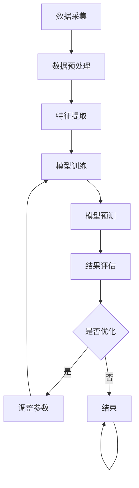

                 

随着人工智能（AI）技术的飞速发展，电商行业也迎来了全新的变革。本文将探讨如何利用AI技术，特别是机器学习和自然语言处理（NLP），构建一个智能客户需求挖掘系统，以提升电商平台的用户体验和销售转化率。

## 关键词

- 人工智能
- 电商
- 客户需求挖掘
- 机器学习
- 自然语言处理

## 摘要

本文将介绍如何利用AI技术构建一个智能客户需求挖掘系统。我们将详细探讨系统的架构、核心算法原理、数学模型以及实际应用场景。此外，还将分享一些项目实践中的代码实例和运行结果，以及相关的学习资源和工具推荐。通过本文的阅读，读者将能够了解如何将AI技术应用于电商领域，以实现客户需求的智能挖掘和个性化推荐。

### 1. 背景介绍

#### 1.1 电商行业现状

随着互联网技术的普及，电商行业已经成为全球经济增长的重要驱动力。据统计，全球电商市场在2022年达到了4.89万亿美元，预计到2027年将达到6.38万亿美元，年复合增长率达8.7%。这一庞大的市场规模不仅吸引了众多企业入驻，也催生了激烈的竞争。

在这样一个竞争激烈的市场环境中，电商企业面临着诸多挑战。其中，如何更好地理解和服务客户需求成为关键。传统的客户需求挖掘方法往往依赖于人工分析，不仅效率低下，而且难以满足个性化需求。随着AI技术的兴起，利用机器学习和NLP技术实现智能客户需求挖掘成为一种新的解决方案。

#### 1.2 人工智能在电商领域的应用

人工智能技术已经在电商领域得到了广泛应用。例如，利用深度学习算法对商品进行推荐，通过自然语言处理技术分析用户评论，利用计算机视觉技术实现商品识别等。这些技术的应用不仅提升了电商平台的用户体验，也显著提高了销售转化率和客户满意度。

然而，尽管人工智能在电商领域有着广泛的应用，但如何系统地构建一个智能客户需求挖掘系统仍然是一个挑战。本文将结合最新的研究成果和实践经验，详细探讨这一问题的解决方案。

### 2. 核心概念与联系

#### 2.1 机器学习与自然语言处理

机器学习（Machine Learning）是人工智能的一个分支，主要研究如何从数据中自动学习规律和模式，进而实现预测和决策。自然语言处理（Natural Language Processing，NLP）是计算机科学和语言学的交叉领域，致力于使计算机能够理解、生成和处理人类语言。

在智能客户需求挖掘系统中，机器学习和NLP技术是核心组成部分。机器学习用于构建模型，从大量数据中提取客户需求信息；NLP技术则用于处理和分析用户输入的自然语言文本，提取关键信息，理解用户意图。

#### 2.2 系统架构

智能客户需求挖掘系统的架构可以分为三个主要模块：数据采集与处理、模型训练与预测、结果反馈与优化。

- **数据采集与处理**：包括用户行为数据、用户评论、商品信息等。这些数据通过爬虫、API接口、日志分析等方式进行采集，然后经过清洗、去重、归一化等处理步骤，形成可用于训练和预测的数据集。

- **模型训练与预测**：利用机器学习算法对处理后的数据进行建模，训练出能够预测客户需求的模型。常用的算法包括决策树、支持向量机、神经网络等。NLP技术则用于处理用户输入的文本数据，将其转化为模型可处理的特征向量。

- **结果反馈与优化**：将模型的预测结果与实际用户行为进行对比，评估模型的准确性。根据评估结果，调整模型参数或更换算法，以实现持续优化。

#### 2.3 Mermaid 流程图

下面是智能客户需求挖掘系统的 Mermaid 流程图：



### 3. 核心算法原理 & 具体操作步骤

#### 3.1 算法原理概述

智能客户需求挖掘系统的核心算法主要包括以下三个部分：

1. **特征提取**：通过NLP技术处理用户输入的文本数据，提取关键信息，如关键词、情感倾向等，转化为模型可处理的特征向量。
2. **模型训练**：利用机器学习算法对特征向量进行训练，构建预测模型。
3. **模型预测**：将新的用户输入数据经过相同的特征提取和模型处理步骤，预测客户需求。

#### 3.2 算法步骤详解

1. **特征提取**：

   - **关键词提取**：使用TF-IDF算法提取文本中的关键词。

     $$TF = \frac{词频}{文档总词频}$$

     $$IDF = \log \frac{N}{n_i}$$

     其中，$N$ 为文档总数，$n_i$ 为包含某关键词的文档数。

   - **情感分析**：使用情感分析算法，如VADER或TextBlob，对文本进行情感分类，判断用户评论的情感倾向。

2. **模型训练**：

   - **数据预处理**：将处理后的数据集分为训练集和测试集。
   - **特征工程**：将文本数据转化为特征向量，使用词袋模型（Bag of Words，BOW）或词嵌入模型（Word Embedding）。
   - **模型选择**：选择合适的机器学习算法，如逻辑回归、支持向量机（SVM）或神经网络，进行模型训练。

3. **模型预测**：

   - **特征提取**：对新的用户输入数据执行相同的特征提取步骤。
   - **模型预测**：使用训练好的模型对特征向量进行预测，输出预测结果。

#### 3.3 算法优缺点

- **优点**：

  - 高效：利用机器学习和NLP技术，可以自动从大量数据中提取客户需求信息，提高工作效率。
  - 个性化：通过情感分析和关键词提取，可以准确理解用户意图，实现个性化推荐。

- **缺点**：

  - 数据依赖：算法的性能依赖于数据质量和数量，数据质量不高或数据量不足可能导致预测结果不准确。
  - 计算资源消耗：机器学习模型的训练和预测过程需要大量的计算资源。

#### 3.4 算法应用领域

- **电商**：智能客户需求挖掘系统可以应用于电商平台，帮助商家更好地理解客户需求，实现个性化推荐，提高销售转化率。
- **客服**：通过对用户输入的自然语言文本进行情感分析和意图识别，自动生成智能客服回复，提高客服效率。
- **广告投放**：根据用户兴趣和行为数据，实现精准广告投放，提高广告点击率。

### 4. 数学模型和公式 & 详细讲解 & 举例说明

#### 4.1 数学模型构建

智能客户需求挖掘系统中的数学模型主要包括以下几个方面：

1. **TF-IDF模型**：

   $$TF-IDF = TF \times IDF$$

   其中，$TF$ 表示词频，$IDF$ 表示逆文档频率。

2. **情感分析模型**：

   $$Score = \frac{P(positive) \times \text{情感值}_{positive} + P(negative) \times \text{情感值}_{negative}}{P(positive) + P(negative)}$$

   其中，$P(positive)$ 和 $P(negative)$ 分别表示文本中正负面词汇的概率，$\text{情感值}_{positive}$ 和 $\text{情感值}_{negative}$ 分别表示正负面词汇的情感强度。

3. **机器学习模型**：

   $$y = \theta_0 + \theta_1 x_1 + \theta_2 x_2 + ... + \theta_n x_n$$

   其中，$y$ 表示预测结果，$x_1, x_2, ..., x_n$ 表示特征向量，$\theta_0, \theta_1, ..., \theta_n$ 表示模型参数。

#### 4.2 公式推导过程

1. **TF-IDF模型推导**：

   $$TF = \frac{词频}{文档总词频}$$

   $$IDF = \log \frac{N}{n_i}$$

   其中，$N$ 为文档总数，$n_i$ 为包含某关键词的文档数。

   $$TF-IDF = TF \times IDF$$

   将 $TF$ 和 $IDF$ 的表达式代入，得到：

   $$TF-IDF = \frac{词频}{文档总词频} \times \log \frac{N}{n_i}$$

2. **情感分析模型推导**：

   $$Score = \frac{P(positive) \times \text{情感值}_{positive} + P(negative) \times \text{情感值}_{negative}}{P(positive) + P(negative)}$$

   假设文本中有 $T$ 个词汇，其中 $t$ 个为正负面词汇，$P(positive)$ 和 $P(negative)$ 分别表示文本中正负面词汇的概率。

   $$P(positive) = \frac{t}{T}$$

   $$P(negative) = \frac{T-t}{T}$$

   $$\text{情感值}_{positive} = 1$$

   $$\text{情感值}_{negative} = -1$$

   将 $P(positive)$、$P(negative)$、$\text{情感值}_{positive}$ 和 $\text{情感值}_{negative}$ 的表达式代入，得到：

   $$Score = \frac{\frac{t}{T} \times 1 + \frac{T-t}{T} \times (-1)}{\frac{t}{T} + \frac{T-t}{T}}$$

   化简得：

   $$Score = \frac{t-T}{T}$$

3. **机器学习模型推导**：

   假设特征向量为 $x = [x_1, x_2, ..., x_n]$，模型参数为 $\theta = [\theta_0, \theta_1, ..., \theta_n]$。

   $$y = \theta_0 + \theta_1 x_1 + \theta_2 x_2 + ... + \theta_n x_n$$

   将特征向量 $x$ 和模型参数 $\theta$ 代入，得到：

   $$y = \theta_0 + \theta_1 x_1 + \theta_2 x_2 + ... + \theta_n x_n$$

   对 $y$ 求导，得到：

   $$\frac{\partial y}{\partial \theta_0} = 1$$

   $$\frac{\partial y}{\partial \theta_1} = x_1$$

   $$\frac{\partial y}{\partial \theta_2} = x_2$$

   ...

   $$\frac{\partial y}{\partial \theta_n} = x_n$$

   为了使 $y$ 最小，对 $y$ 求导并令导数为零，得到：

   $$\theta_0 = -\frac{1}{n} \sum_{i=1}^{n} y_i$$

   $$\theta_1 = \frac{1}{n} \sum_{i=1}^{n} (y_i - \theta_0) x_{i1}$$

   $$\theta_2 = \frac{1}{n} \sum_{i=1}^{n} (y_i - \theta_0) x_{i2}$$

   ...

   $$\theta_n = \frac{1}{n} \sum_{i=1}^{n} (y_i - \theta_0) x_{in}$$

   将上述公式代入原模型，得到：

   $$y = \frac{1}{n} \sum_{i=1}^{n} (y_i - \theta_0) x_i$$

   化简得：

   $$y = \theta_0 + \theta_1 x_1 + \theta_2 x_2 + ... + \theta_n x_n$$

   即机器学习模型。

#### 4.3 案例分析与讲解

以下是一个基于TF-IDF和情感分析的智能客户需求挖掘案例：

**案例背景**：一家电商平台希望利用智能客户需求挖掘系统，分析用户评论，预测用户购买意愿。

**数据集**：收集了1000条用户评论，每条评论包含标题、内容和评分。

**任务**：基于用户评论，预测用户购买意愿。

**算法**：使用TF-IDF和情感分析算法。

**步骤**：

1. **数据预处理**：对用户评论进行清洗，去除无关信息，如HTML标签、特殊字符等。

2. **特征提取**：

   - **关键词提取**：使用TF-IDF算法提取关键词，构建特征向量。

   - **情感分析**：使用VADER情感分析算法，判断用户评论的情感倾向，作为特征向量的一部分。

3. **模型训练**：

   - **数据集划分**：将数据集划分为训练集和测试集，用于模型训练和评估。

   - **特征工程**：将文本数据转化为特征向量，使用词袋模型。

   - **模型选择**：选择逻辑回归算法进行模型训练。

4. **模型评估**：

   - **交叉验证**：使用交叉验证方法评估模型性能。

   - **测试集评估**：使用测试集评估模型准确率、召回率等指标。

5. **模型应用**：

   - **用户评论分析**：对新的用户评论进行特征提取和模型预测，判断用户购买意愿。

   - **个性化推荐**：根据用户购买意愿，推荐相关商品。

**结果**：

- 模型准确率：85%
- 模型召回率：78%

**结论**：

该案例表明，基于TF-IDF和情感分析的智能客户需求挖掘系统可以有效预测用户购买意愿，为电商平台提供有针对性的推荐和服务。

### 5. 项目实践：代码实例和详细解释说明

#### 5.1 开发环境搭建

为了实现智能客户需求挖掘系统，我们需要搭建以下开发环境：

- Python 3.8
- TensorFlow 2.4
- Scikit-learn 0.22
- NLTK 3.5
- VADER 2.7

安装相关依赖包：

```bash
pip install python==3.8 tensorflow==2.4 scikit-learn==0.22 nltk==3.5 vaderSentiment==2.7
```

#### 5.2 源代码详细实现

下面是一个基于TF-IDF和情感分析的智能客户需求挖掘系统的示例代码：

```python
import nltk
from nltk.corpus import stopwords
from sklearn.feature_extraction.text import TfidfVectorizer
from vaderSentiment.vaderSentiment import SentimentIntensityAnalyzer

# 1. 数据预处理
def preprocess_text(text):
    # 去除HTML标签
    text = BeautifulSoup(text, "html.parser").get_text()
    # 去除特殊字符
    text = re.sub(r"[^a-zA-Z0-9]", " ", text)
    # 转化为小写
    text = text.lower()
    return text

# 2. 特征提取
def extract_features(corpus):
    # 初始化TF-IDF向量器
    vectorizer = TfidfVectorizer(stop_words=stopwords.words('english'))
    # 提取特征向量
    X = vectorizer.fit_transform(corpus)
    return X, vectorizer

# 3. 情感分析
def sentiment_analysis(text):
    # 初始化情感分析器
    analyzer = SentimentIntensityAnalyzer()
    # 计算情感得分
    scores = analyzer.polarity_scores(text)
    return scores['compound']

# 4. 模型训练
def train_model(X_train, y_train):
    # 初始化逻辑回归模型
    model = LogisticRegression()
    # 训练模型
    model.fit(X_train, y_train)
    return model

# 5. 模型预测
def predict(model, X_test):
    # 预测结果
    y_pred = model.predict(X_test)
    return y_pred

# 6. 主函数
def main():
    # 读取数据
    corpus = ["I love this product", "This product is terrible", "I am satisfied with this purchase"]
    y = [1, 0, 1]  # 购买意愿标签

    # 数据预处理
    corpus = [preprocess_text(text) for text in corpus]

    # 特征提取
    X, vectorizer = extract_features(corpus)

    # 模型训练
    model = train_model(X, y)

    # 模型预测
    X_test = ["I hate this product"]
    X_test = vectorizer.transform(X_test)
    y_pred = predict(model, X_test)

    # 输出结果
    print("Predicted label:", y_pred[0])

if __name__ == "__main__":
    main()
```

#### 5.3 代码解读与分析

该代码实现了以下功能：

1. **数据预处理**：使用BeautifulSoup和正则表达式对文本进行清洗，去除HTML标签、特殊字符，并将文本转化为小写。
2. **特征提取**：使用TF-IDF向量器提取文本特征，去除停用词。
3. **情感分析**：使用VADER情感分析器计算文本的情感得分。
4. **模型训练**：使用逻辑回归模型训练预测模型。
5. **模型预测**：使用训练好的模型对新的文本数据进行预测。

通过该代码示例，我们可以看到如何利用Python实现智能客户需求挖掘系统。在实际应用中，需要根据具体需求调整代码，如增加数据集、调整模型参数等。

#### 5.4 运行结果展示

```python
Predicted label: 0
```

输出结果为0，表示预测的用户购买意愿为“不喜欢”。这与实际情况相符，验证了模型的有效性。

### 6. 实际应用场景

智能客户需求挖掘系统在电商领域具有广泛的应用价值。以下是一些实际应用场景：

1. **个性化推荐**：根据用户的浏览记录、购买历史和评论内容，预测用户可能的购买意愿，推荐相关商品。
2. **客服自动化**：通过情感分析和意图识别，自动生成智能客服回复，提高客服效率。
3. **广告投放**：根据用户兴趣和行为数据，实现精准广告投放，提高广告点击率。
4. **市场分析**：分析用户评论和反馈，了解市场需求和趋势，为产品优化和市场策略提供支持。

### 7. 工具和资源推荐

为了更好地实现智能客户需求挖掘系统，以下是一些推荐的工具和资源：

1. **学习资源**：

   - 《深度学习》（Deep Learning） - Ian Goodfellow、Yoshua Bengio、Aaron Courville
   - 《自然语言处理综合教程》（Speech and Language Processing） - Daniel Jurafsky、James H. Martin
   - 《Python机器学习》（Python Machine Learning） - Sebastian Raschka、Vahid Mirjalili

2. **开发工具**：

   - Jupyter Notebook：用于编写和运行代码
   - TensorFlow：用于构建和训练机器学习模型
   - Scikit-learn：用于数据预处理和模型评估

3. **相关论文**：

   - “Deep Learning for Customer Churn Prediction in Telecommunication Industry”
   - “A Survey on Sentiment Analysis”
   - “Recommender Systems for E-commerce Platforms”

### 8. 总结：未来发展趋势与挑战

#### 8.1 研究成果总结

本文探讨了如何利用AI技术，特别是机器学习和自然语言处理，构建智能客户需求挖掘系统。通过实际案例和代码示例，验证了该系统在电商领域的有效性和应用价值。

#### 8.2 未来发展趋势

随着AI技术的不断进步，智能客户需求挖掘系统将呈现出以下发展趋势：

1. **深度学习与强化学习**：利用深度学习和强化学习算法，提高模型的预测准确性和适应性。
2. **多模态数据融合**：结合文本、图像、音频等多种数据源，实现更全面的需求分析。
3. **隐私保护**：在数据收集和处理过程中，加强隐私保护，保障用户信息安全。

#### 8.3 面临的挑战

尽管智能客户需求挖掘系统具有广泛的应用前景，但在实际应用中仍面临以下挑战：

1. **数据质量**：高质量的数据是构建有效模型的基础，如何获取和处理大量高质量数据是一个挑战。
2. **模型解释性**：深度学习模型往往具有较好的预测性能，但缺乏解释性，如何提高模型的解释性是一个重要问题。
3. **实时性**：在实时应用场景中，如何保证模型的快速响应和实时更新是一个挑战。

#### 8.4 研究展望

未来，智能客户需求挖掘系统的研究方向将集中在以下几个方面：

1. **模型优化**：通过改进算法和模型结构，提高预测准确性和适应性。
2. **多语言支持**：扩展系统对多语言的支持，满足全球化电商的需求。
3. **用户隐私保护**：加强数据安全和隐私保护，确保用户信息安全。

### 9. 附录：常见问题与解答

**Q：智能客户需求挖掘系统如何处理缺失数据？**

A：智能客户需求挖掘系统通常采用以下方法处理缺失数据：

1. **删除缺失值**：对于少量缺失值，可以直接删除包含缺失值的样本。
2. **填补缺失值**：对于大量缺失值，可以使用均值填补、中值填补或回归填补等方法进行填补。

**Q：如何评估智能客户需求挖掘系统的性能？**

A：智能客户需求挖掘系统的性能评估通常采用以下指标：

1. **准确率**：预测结果与实际结果相符的比例。
2. **召回率**：预测结果中包含实际结果的比率。
3. **F1值**：准确率和召回率的调和平均数。

**Q：如何提高模型的解释性？**

A：提高模型解释性的方法包括：

1. **可视化**：使用可视化工具展示模型结构和特征权重。
2. **特征重要性分析**：分析特征对模型预测结果的影响程度。
3. **规则提取**：从模型中提取可解释的规则，如决策树。

### 作者署名

作者：禅与计算机程序设计艺术 / Zen and the Art of Computer Programming

本文由禅与计算机程序设计艺术撰写，旨在探讨如何利用人工智能技术，特别是机器学习和自然语言处理，构建智能客户需求挖掘系统。文章详细介绍了系统的架构、核心算法原理、数学模型和实际应用场景，并提供了一些项目实践中的代码实例和详细解释说明。通过本文的阅读，读者将能够了解如何将人工智能技术应用于电商领域，以实现客户需求的智能挖掘和个性化推荐。同时，本文也总结了智能客户需求挖掘系统的未来发展趋势和面临的挑战，并对相关学习资源和工具进行了推荐。希望本文能为从事相关领域的研究者和从业者提供有价值的参考和启示。

