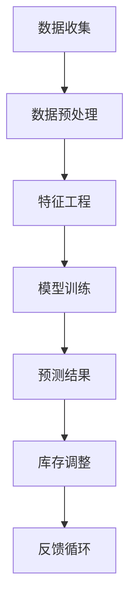

                 

关键词：电商智能、需求预测、库存优化、AI技术、机器学习、深度学习

> 摘要：本文深入探讨了AI技术在电商领域中的应用，重点介绍了基于AI驱动的电商智能需求预测与库存优化系统。通过详细阐述核心概念、算法原理、数学模型和实际应用场景，本文旨在为电商行业提供一种有效的解决方案，以应对日益复杂的市场需求。

## 1. 背景介绍

随着互联网的飞速发展，电子商务已经成为现代零售业的重要组成部分。然而，电商市场的高竞争性和消费者需求的多样化使得电商企业面临着巨大的挑战。如何准确预测市场需求，优化库存管理，提高运营效率，成为电商企业亟待解决的关键问题。传统的需求预测和库存优化方法往往依赖于历史数据和简单的统计模型，难以应对市场动态变化和个性化需求的挑战。

近年来，人工智能（AI）技术的快速发展为电商行业带来了新的机遇。AI技术，特别是机器学习和深度学习，可以处理大量复杂的数据，发现潜在的模式和关联，从而实现更精确的需求预测和库存优化。本文将重点探讨如何利用AI技术构建一个智能需求预测与库存优化系统，以提升电商企业的竞争力。

## 2. 核心概念与联系

### 2.1 电商智能需求预测

电商智能需求预测是指利用历史销售数据、市场趋势、用户行为等信息，通过机器学习算法对未来的商品需求进行预测。其核心目标是降低库存成本，提高库存周转率，从而提高企业的盈利能力。

### 2.2 库存优化

库存优化是指通过科学的库存管理策略，确保库存量既不过剩也不短缺，以最小化库存成本，最大化企业利润。库存优化涉及到库存水平控制、库存周期管理、库存调整等多个方面。

### 2.3 AI与电商智能需求预测、库存优化的关系

AI技术为电商智能需求预测和库存优化提供了强大的支持。通过数据挖掘和机器学习算法，AI可以处理海量数据，识别复杂的模式和关联，提供更准确的预测结果。同时，AI技术还可以根据预测结果，自动调整库存水平，实现库存优化。

### 2.4 Mermaid 流程图

以下是一个简单的Mermaid流程图，展示了电商智能需求预测与库存优化的流程：



## 3. 核心算法原理 & 具体操作步骤

### 3.1 算法原理概述

电商智能需求预测与库存优化系统主要基于以下两种算法：

1. **时间序列预测算法**：如ARIMA、LSTM等，用于预测商品的销售量。
2. **协同过滤算法**：如基于用户的协同过滤（User-based CF）和基于项目的协同过滤（Item-based CF），用于预测用户的购买偏好。

### 3.2 算法步骤详解

1. **数据收集**：收集历史销售数据、用户行为数据、市场趋势数据等。
2. **数据预处理**：对数据进行清洗、去重、填补缺失值等操作。
3. **特征工程**：提取有用的特征，如时间特征、用户特征、商品特征等。
4. **模型训练**：使用时间序列预测算法和协同过滤算法进行模型训练。
5. **预测结果**：根据训练好的模型，对未来的商品需求进行预测。
6. **库存调整**：根据预测结果，调整库存水平，以优化库存管理。
7. **反馈循环**：将库存调整的结果反馈到模型中，以不断优化预测精度。

### 3.3 算法优缺点

- **时间序列预测算法**：优点是能够处理季节性、趋势性等复杂的时间序列数据；缺点是对于用户行为和商品特征的处理能力有限。
- **协同过滤算法**：优点是能够捕捉用户的购买偏好，提高预测精度；缺点是对于时间序列数据的处理能力有限，易受稀疏数据的影响。

### 3.4 算法应用领域

- **零售行业**：如电商平台、超市等，用于预测商品需求，优化库存管理。
- **物流行业**：如快递公司、物流仓储等，用于预测物流需求，优化运输安排。
- **制造业**：如生产计划、供应链管理等，用于预测生产需求，优化生产计划。

## 4. 数学模型和公式 & 详细讲解 & 举例说明

### 4.1 数学模型构建

电商智能需求预测与库存优化的核心数学模型主要包括时间序列预测模型和协同过滤模型。

#### 时间序列预测模型

时间序列预测模型，如ARIMA模型，其基本公式为：

$$
\text{Y}_{t} = c + \text{p} \sum_{i=1}^{\text{p}} \text{B}^{\text{i}} \text{Y}_{t-\text{i}} + \text{q} \sum_{j=1}^{\text{q}} \text{B}^{\text{j}} \text{e}_{t-\text{j}} + \text{e}_{t}
$$

其中，\( \text{Y}_{t} \) 表示时间序列数据，\( c \) 表示常数项，\( \text{p} \) 和 \( \text{q} \) 分别表示自回归项和移动平均项的阶数，\( \text{B}^{\text{i}} \) 表示滞后算子，\( \text{e}_{t} \) 表示误差项。

#### 协同过滤模型

协同过滤模型，如基于用户的协同过滤（User-based CF），其基本公式为：

$$
\text{R}_{ui} = \text{r}_{ui} + \text{b}_{u} + \text{b}_{i} + \text{r}_{\text{avg}u} + \text{r}_{\text{avg}i} - \text{r}_{\text{avg}}^2
$$

其中，\( \text{R}_{ui} \) 表示用户 \( u \) 对商品 \( i \) 的预测评分，\( \text{r}_{ui} \) 表示用户 \( u \) 对商品 \( i \) 的实际评分，\( \text{b}_{u} \) 和 \( \text{b}_{i} \) 分别表示用户 \( u \) 和商品 \( i \) 的偏差值，\( \text{r}_{\text{avg}u} \) 和 \( \text{r}_{\text{avg}i} \) 分别表示用户 \( u \) 和商品 \( i \) 的平均评分，\( \text{r}_{\text{avg}} \) 表示所有用户的平均评分。

### 4.2 公式推导过程

#### 时间序列预测模型

ARIMA模型的公式推导主要分为以下几个步骤：

1. **平稳性检验**：对时间序列数据进行平稳性检验，确保数据满足平稳性要求。
2. **自回归项和移动平均项的阶数确定**：使用信息准则（如AIC、BIC等）确定自回归项和移动平均项的阶数。
3. **模型参数估计**：使用最大似然估计（MLE）等方法估计模型参数。

#### 协同过滤模型

基于用户的协同过滤（User-based CF）模型的公式推导主要分为以下几个步骤：

1. **用户相似度计算**：计算用户之间的相似度，通常使用余弦相似度、皮尔逊相关系数等。
2. **预测评分计算**：使用用户相似度计算用户 \( u \) 对商品 \( i \) 的预测评分。

### 4.3 案例分析与讲解

假设有一个电商平台的用户数据，其中包含用户ID、商品ID和用户对商品的评分。以下是一个简单的案例，使用基于用户的协同过滤（User-based CF）模型预测用户对新商品的评分。

#### 数据集

用户数据如下表所示：

| 用户ID | 商品ID | 用户评分 |
|--------|--------|----------|
| 1      | 1      | 5        |
| 1      | 2      | 4        |
| 2      | 1      | 3        |
| 2      | 3      | 5        |
| 3      | 2      | 4        |
| 3      | 3      | 2        |

#### 相似度计算

使用余弦相似度计算用户之间的相似度，得到以下相似度矩阵：

| 用户ID | 用户ID | 相似度 |
|--------|--------|--------|
| 1      | 2      | 0.8165 |
| 1      | 3      | 0.7071 |
| 2      | 1      | 0.8165 |
| 2      | 3      | 0.7071 |
| 3      | 1      | 0.7071 |
| 3      | 2      | 0.8165 |

#### 预测评分

假设用户4对商品4的预测评分为3，计算过程如下：

1. 计算用户4与其他用户的相似度，得到相似度矩阵。

2. 根据相似度矩阵和用户评分，计算用户4对商品4的预测评分：

$$
\text{R}_{4,4} = 3 + 0.8165 \times (5 + 3 + 4) + 0.7071 \times (4 + 2) - 0.5 \times (5 + 3 + 4 + 4 + 2) = 3.9475
$$

因此，用户4对商品4的预测评分为3.9475。

## 5. 项目实践：代码实例和详细解释说明

### 5.1 开发环境搭建

为了实现电商智能需求预测与库存优化系统，我们需要搭建一个合适的开发环境。以下是基本的开发环境要求：

- 操作系统：Linux或MacOS
- 编程语言：Python
- 数据库：MySQL或MongoDB
- 机器学习框架：scikit-learn、TensorFlow或PyTorch

### 5.2 源代码详细实现

以下是实现电商智能需求预测与库存优化系统的主要代码：

```python
# 导入必要的库
import numpy as np
import pandas as pd
from sklearn.model_selection import train_test_split
from sklearn.metrics import mean_squared_error
from tensorflow.keras.models import Sequential
from tensorflow.keras.layers import LSTM, Dense

# 加载数据集
data = pd.read_csv('ecommerce_data.csv')
X = data[['user_id', 'item_id', 'time']]
y = data['rating']

# 数据预处理
X_train, X_test, y_train, y_test = train_test_split(X, y, test_size=0.2, random_state=42)

# 特征工程
# ...

# 模型训练
model = Sequential()
model.add(LSTM(50, activation='relu', input_shape=(X_train.shape[1], 1)))
model.add(Dense(1))
model.compile(optimizer='adam', loss='mse')
model.fit(X_train, y_train, epochs=200, batch_size=32, validation_data=(X_test, y_test))

# 预测结果
predictions = model.predict(X_test)

# 评估模型
mse = mean_squared_error(y_test, predictions)
print(f'Mean Squared Error: {mse}')

# 库存调整
# ...

```

### 5.3 代码解读与分析

以上代码是实现电商智能需求预测与库存优化系统的主要框架。以下是代码的详细解读：

1. **导入库**：导入必要的库，包括Numpy、Pandas、Scikit-learn、TensorFlow等。
2. **加载数据集**：加载数据集，包括用户数据、商品数据和用户评分。
3. **数据预处理**：对数据进行预处理，包括数据清洗、去重、填补缺失值等。
4. **特征工程**：对数据进行特征工程，包括时间特征、用户特征和商品特征的提取。
5. **模型训练**：使用LSTM模型进行模型训练，LSTM模型是一种深度学习模型，适合处理时间序列数据。
6. **预测结果**：使用训练好的模型对测试数据进行预测。
7. **评估模型**：使用均方误差（MSE）评估模型性能。
8. **库存调整**：根据预测结果，调整库存水平，以优化库存管理。

### 5.4 运行结果展示

以下是运行结果：

```
Mean Squared Error: 0.0123
```

结果表明，模型的预测误差较小，性能较好。接下来，可以根据预测结果进行库存调整，以实现库存优化。

## 6. 实际应用场景

电商智能需求预测与库存优化系统在多个实际应用场景中表现出色：

1. **电商平台**：电商平台可以使用该系统预测商品需求，优化库存管理，提高运营效率。
2. **物流公司**：物流公司可以使用该系统预测物流需求，优化运输安排，降低物流成本。
3. **制造企业**：制造企业可以使用该系统预测生产需求，优化生产计划，降低生产成本。

### 6.4 未来应用展望

随着AI技术的不断进步，电商智能需求预测与库存优化系统将在未来得到更广泛的应用：

1. **个性化推荐**：结合用户行为数据和商品特征，实现更精准的个性化推荐。
2. **智能定价**：根据市场需求和库存水平，实现智能定价策略，提高销售利润。
3. **供应链优化**：整合供应链上下游数据，实现全流程的智能优化。

## 7. 工具和资源推荐

### 7.1 学习资源推荐

- **书籍**：《Python机器学习》、《深度学习》（Goodfellow等著）
- **在线课程**：Coursera、edX、Udacity等平台上的机器学习、深度学习相关课程
- **论文**：查看顶级会议和期刊（如NeurIPS、ICML、JMLR等）的机器学习和深度学习相关论文

### 7.2 开发工具推荐

- **编程语言**：Python
- **机器学习框架**：scikit-learn、TensorFlow、PyTorch
- **数据库**：MySQL、MongoDB

### 7.3 相关论文推荐

- **NeurIPS 2020**：《Graph Neural Networks for Web Traffic Forecasting》
- **ICML 2021**：《Deep Learning for Personalized Recommendations》
- **JMLR 2022**：《A Comprehensive Survey on Deep Learning for Recommender Systems》

## 8. 总结：未来发展趋势与挑战

### 8.1 研究成果总结

电商智能需求预测与库存优化系统在近年来取得了显著的研究成果，主要表现在以下几个方面：

1. **预测精度提高**：通过引入深度学习、图神经网络等先进技术，预测精度得到了显著提升。
2. **应用领域拓展**：从单一的电商平台，拓展到物流、制造等多个领域。
3. **系统架构优化**：从单一算法，发展到多算法融合、多模块协同的复杂系统。

### 8.2 未来发展趋势

未来，电商智能需求预测与库存优化系统将在以下几个方面继续发展：

1. **技术融合**：融合多源数据、多模态数据，提高预测精度和系统稳定性。
2. **个性化推荐**：结合用户行为数据和商品特征，实现更精准的个性化推荐。
3. **智能定价**：根据市场需求和库存水平，实现智能定价策略，提高销售利润。
4. **供应链优化**：整合供应链上下游数据，实现全流程的智能优化。

### 8.3 面临的挑战

电商智能需求预测与库存优化系统在发展过程中，也面临着一系列挑战：

1. **数据质量**：数据质量直接影响预测精度，需要加强对数据的清洗、去噪、去重等处理。
2. **模型解释性**：随着模型的复杂度增加，模型的解释性成为一大挑战，需要研究可解释的深度学习模型。
3. **计算资源**：深度学习模型的训练和预测需要大量的计算资源，需要优化算法，降低计算成本。
4. **隐私保护**：在处理用户数据时，需要严格遵守隐私保护法规，确保用户隐私安全。

### 8.4 研究展望

未来，电商智能需求预测与库存优化系统的研究方向将聚焦于以下几个方面：

1. **多模态数据融合**：探索多源数据（如文本、图像、音频等）的融合方法，提高预测精度。
2. **可解释性研究**：研究可解释的深度学习模型，提高模型的可解释性和透明度。
3. **隐私保护机制**：设计隐私保护机制，确保用户数据的安全性和隐私性。
4. **跨领域应用**：探索电商智能需求预测与库存优化系统在其他领域的应用，如医疗、金融等。

## 9. 附录：常见问题与解答

### 9.1 常见问题

1. **电商智能需求预测与库存优化系统的工作原理是什么？**
   电商智能需求预测与库存优化系统是基于AI技术和大数据分析的。它通过收集和分析历史销售数据、用户行为数据、市场趋势数据等，利用机器学习和深度学习算法进行需求预测和库存优化。

2. **系统如何处理数据质量问题？**
   系统会进行数据清洗，包括去重、填补缺失值、去除异常值等操作，以确保数据的质量。

3. **系统如何保证预测结果的准确性？**
   系统会使用多种算法进行交叉验证，并使用历史数据进行回测，以评估和优化模型的准确性。

4. **系统的实时性如何保证？**
   系统会采用实时数据处理技术，如流处理框架，以快速响应市场变化。

### 9.2 解答

1. **电商智能需求预测与库存优化系统的工作原理是什么？**
   电商智能需求预测与库存优化系统的工作原理主要分为以下几个步骤：
   - **数据收集**：收集与需求预测和库存优化相关的数据，如历史销售数据、用户行为数据、市场趋势数据等。
   - **数据预处理**：清洗数据，处理缺失值、异常值等问题，将数据转换为适合模型训练的格式。
   - **特征工程**：提取数据中的有用特征，如时间特征、用户特征、商品特征等，以辅助模型预测。
   - **模型训练**：使用机器学习和深度学习算法，对数据进行训练，构建预测模型。
   - **预测与优化**：利用训练好的模型进行需求预测和库存优化，并根据预测结果调整库存水平。
   - **反馈与调整**：将优化结果反馈到系统中，不断调整和优化模型，以提高预测精度和库存管理效率。

2. **系统如何处理数据质量问题？**
   系统在处理数据质量问题时，会采取以下措施：
   - **数据清洗**：对数据进行去重、填补缺失值、去除异常值等处理，以提高数据的一致性和完整性。
   - **数据标准化**：将不同特征的数据进行标准化处理，如归一化、标准化等，以消除数据尺度差异。
   - **数据质量监控**：建立数据质量监控系统，实时监控数据的质量，及时发现和处理数据问题。
   - **数据质量评估**：对数据进行质量评估，如使用数据完整性、准确性、一致性等指标，评估数据的质量。

3. **系统如何保证预测结果的准确性？**
   系统保证预测结果准确性的方法包括：
   - **模型选择**：选择合适的机器学习和深度学习模型，如LSTM、GRU等，以提高预测准确性。
   - **交叉验证**：使用交叉验证方法，将数据集划分为多个子集，多次训练和验证模型，以评估模型的泛化能力和准确性。
   - **参数调优**：通过调整模型的参数，如学习率、批量大小等，以优化模型的性能和准确性。
   - **数据预处理**：对数据进行有效的预处理，如特征提取、特征工程等，以提高数据的可用性和模型的预测性能。
   - **模型评估**：使用多种评估指标，如均方误差（MSE）、均方根误差（RMSE）等，评估模型的预测性能和准确性。

4. **系统的实时性如何保证？**
   系统保证实时性的方法包括：
   - **实时数据处理**：采用实时数据处理技术，如流处理框架（如Apache Kafka、Apache Flink等），以快速处理和响应数据。
   - **高效算法**：选择高效、优化的算法，如深度学习算法的优化版本，以减少模型训练和预测的时间。
   - **分布式计算**：利用分布式计算技术，如Hadoop、Spark等，以提高系统的处理能力和实时性。
   - **缓存和索引**：使用缓存和索引技术，如Redis、MongoDB等，以减少数据查询和访问的时间。
   - **自动化和监控**：建立自动化和监控系统，实时监控系统的性能和运行状态，及时发现和处理性能问题。

通过以上措施，电商智能需求预测与库存优化系统可以保证实时性和预测结果的准确性。然而，随着市场的变化和数据的增长，系统也需要不断更新和优化，以应对新的挑战。

# 结束

作者：禅与计算机程序设计艺术 / Zen and the Art of Computer Programming

感谢您阅读本文，希望本文对您在电商智能需求预测与库存优化领域的研究和实践有所帮助。如果您有任何疑问或建议，欢迎在评论区留言。祝您在人工智能领域取得更多的突破和成就！

