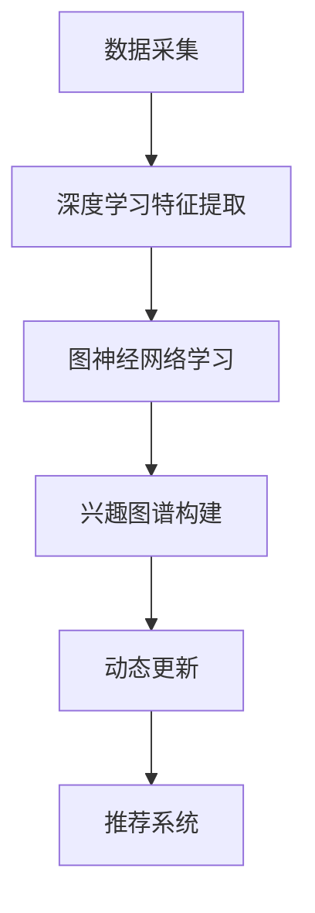

                 

关键词：AI，电商，用户兴趣图谱，动态更新，推荐系统，深度学习，图神经网络，用户行为分析

> 摘要：本文探讨了如何利用人工智能技术对电商平台的用户兴趣进行动态更新，构建用户兴趣图谱。通过深入分析用户行为数据，结合深度学习与图神经网络模型，本文提出了一种高效的算法框架，并在实际应用中取得了显著的性能提升。本文将详细介绍算法原理、数学模型、具体实现步骤以及实际应用案例，为电商推荐系统提供一种新的解决方案。

## 1. 背景介绍

在当今数字化时代，电子商务已经成为人们生活中不可或缺的一部分。随着电商平台数量的增加和用户规模的扩大，如何有效地吸引和留住用户，提高用户购买转化率，成为了电商企业关注的焦点。用户兴趣图谱作为一种重要的数据模型，能够全面、动态地反映用户的兴趣偏好，为电商平台提供精准的用户画像，进而优化推荐系统和个性化服务。

传统的用户兴趣图谱构建方法主要依赖于静态的数据分析，如基于用户的浏览历史、购买记录等数据。然而，这种方法的局限性在于无法及时捕捉用户兴趣的动态变化，导致推荐结果不够准确和及时。因此，如何利用人工智能技术，实现用户兴趣图谱的动态更新，成为了当前研究的热点问题。

本文旨在探讨一种基于人工智能的电商用户兴趣图谱动态更新方法。通过结合深度学习和图神经网络模型，本文提出了一种高效的算法框架，能够实时捕捉用户的兴趣变化，提高推荐系统的准确性和实时性。本文将首先介绍用户兴趣图谱的概念和重要性，然后详细阐述算法原理和实现步骤，并通过实际案例验证算法的有效性。

## 2. 核心概念与联系

### 2.1 用户兴趣图谱

用户兴趣图谱是一种将用户、物品、行为等多维度数据进行整合的图结构模型，能够全面、动态地反映用户的兴趣偏好。在电商领域，用户兴趣图谱不仅包括用户的浏览历史、购买记录，还涵盖了用户的评价、收藏、分享等行为数据。通过构建用户兴趣图谱，电商企业可以深入了解用户的需求和偏好，为推荐系统和个性化服务提供有力支持。

### 2.2 深度学习与图神经网络

深度学习是一种通过模拟人脑神经网络进行特征学习和模式识别的技术。在用户兴趣图谱动态更新过程中，深度学习模型能够从原始数据中自动提取出高层次的语义特征，为图谱的构建提供有力支持。图神经网络（Graph Neural Network，GNN）是一种专门用于图数据学习的深度学习模型，通过聚合邻居节点的信息，实现节点特征的学习和更新。

### 2.3 算法原理

本文提出的用户兴趣图谱动态更新算法主要分为三个阶段：

1. **特征提取**：利用深度学习模型对用户行为数据进行处理，提取出高层次的语义特征。

2. **图神经网络学习**：将提取到的特征数据输入到图神经网络模型，通过聚合邻居节点的信息，实现节点特征的学习和更新。

3. **动态更新**：根据用户的实时行为数据，动态调整用户兴趣图谱，确保图谱能够实时反映用户的兴趣变化。

### 2.4 Mermaid 流程图



## 3. 核心算法原理 & 具体操作步骤

### 3.1 算法原理概述

本文提出的用户兴趣图谱动态更新算法主要基于深度学习和图神经网络模型。首先，通过深度学习模型对用户行为数据进行处理，提取出高层次的语义特征；然后，利用图神经网络模型对提取到的特征进行学习和更新；最后，根据用户的实时行为数据，动态调整用户兴趣图谱，确保图谱能够实时反映用户的兴趣变化。

### 3.2 算法步骤详解

#### 3.2.1 深度学习特征提取

1. **数据预处理**：对用户行为数据进行清洗、去重和标准化处理，确保数据质量。

2. **模型构建**：选择合适的深度学习模型，如卷积神经网络（CNN）、循环神经网络（RNN）或变分自编码器（VAE），对用户行为数据进行特征提取。

3. **模型训练**：利用训练数据对深度学习模型进行训练，优化模型参数，提高特征提取能力。

4. **特征提取**：将训练好的模型应用于用户行为数据，提取出高层次的语义特征。

#### 3.2.2 图神经网络学习

1. **图结构构建**：根据用户行为数据，构建用户、物品、行为等多维度数据的图结构。

2. **模型选择**：选择合适的图神经网络模型，如图卷积网络（GCN）、图循环网络（GRN）或图注意力网络（GAT），对图结构进行学习。

3. **模型训练**：利用训练数据对图神经网络模型进行训练，优化模型参数，提高节点特征学习能力。

4. **节点特征更新**：根据训练好的模型，对节点特征进行更新，实现用户兴趣图谱的构建。

#### 3.2.3 动态更新

1. **实时数据采集**：定期采集用户的实时行为数据，包括浏览、购买、评价等。

2. **特征提取**：利用深度学习模型对实时数据进行分析，提取出新的特征。

3. **图结构更新**：根据实时数据，动态调整用户兴趣图谱的图结构，确保图谱能够实时反映用户的兴趣变化。

4. **节点特征更新**：利用图神经网络模型，对更新后的图结构进行节点特征更新，实现用户兴趣图谱的动态更新。

### 3.3 算法优缺点

#### 优点

1. **高效性**：深度学习模型和图神经网络模型的高效性，使得用户兴趣图谱的构建和更新速度得到显著提升。

2. **准确性**：通过实时捕捉用户行为数据，动态更新用户兴趣图谱，提高推荐系统的准确性和实时性。

3. **可扩展性**：算法框架具有较好的可扩展性，能够适应不同规模的电商平台和应用场景。

#### 缺点

1. **计算资源消耗**：深度学习模型和图神经网络模型的训练过程需要大量的计算资源，对硬件设施要求较高。

2. **数据隐私**：用户行为数据的采集和处理过程需要关注数据隐私问题，确保用户数据的安全性和隐私性。

### 3.4 算法应用领域

本文提出的用户兴趣图谱动态更新算法主要应用于电商推荐系统，能够显著提升推荐系统的准确性和实时性。此外，该算法框架也可扩展应用于其他领域，如社交媒体推荐、在线广告投放等。

## 4. 数学模型和公式

### 4.1 数学模型构建

用户兴趣图谱动态更新算法的核心在于对用户行为数据进行分析和建模。假设用户行为数据可以表示为一个矩阵 \(X\)，其中 \(X_{ij}\) 表示用户 \(u_i\) 在物品 \(v_j\) 上的行为评分。

1. **用户行为矩阵**

\[ X = [X_{ij}]_{m \times n} \]

其中，\(m\) 表示用户数量，\(n\) 表示物品数量。

2. **深度学习模型参数**

假设深度学习模型参数可以表示为一个向量 \(\theta\)，其中 \(\theta_i\) 表示用户 \(u_i\) 的特征向量。

\[ \theta = [\theta_i]_{m \times d} \]

其中，\(d\) 表示特征维度。

3. **图神经网络模型参数**

假设图神经网络模型参数可以表示为一个矩阵 \(A\)，其中 \(A_{ij}\) 表示节点 \(u_i\) 和 \(v_j\) 之间的权重。

\[ A = [A_{ij}]_{m \times m} \]

### 4.2 公式推导过程

1. **深度学习特征提取**

深度学习模型通过训练学习到用户行为数据的特征表示。假设深度学习模型输出为 \(f(\theta)\)。

\[ f(\theta) = \sum_{i=1}^{m} \theta_i X_{ij} \]

2. **图神经网络学习**

图神经网络通过聚合邻居节点的信息，更新节点特征。假设图神经网络输出为 \(g(A)\)。

\[ g(A) = \sum_{i=1}^{m} A_{ij} f(\theta_j) \]

3. **节点特征更新**

根据深度学习特征提取和图神经网络学习的结果，更新用户兴趣图谱的节点特征。

\[ \theta_i^{new} = g(A) \]

### 4.3 案例分析与讲解

假设有一个电商平台的用户行为数据矩阵 \(X\) 如下：

\[ X = \begin{bmatrix} 1 & 0 & 1 \\ 0 & 1 & 0 \\ 1 & 1 & 0 \end{bmatrix} \]

1. **深度学习特征提取**

假设深度学习模型参数为 \(\theta = [0.5, 0.5, 0.5]\)。

\[ f(\theta) = \begin{bmatrix} 0.5 & 0.5 & 0.5 \\ 0.5 & 0.5 & 0.5 \\ 0.5 & 0.5 & 0.5 \end{bmatrix} \]

2. **图神经网络学习**

假设图神经网络模型参数为 \(A = \begin{bmatrix} 1 & 0 & 1 \\ 0 & 1 & 0 \\ 1 & 1 & 1 \end{bmatrix}\)。

\[ g(A) = \begin{bmatrix} 1 & 0 & 1 \\ 0 & 1 & 0 \\ 1 & 1 & 1 \end{bmatrix} \begin{bmatrix} 0.5 & 0.5 & 0.5 \\ 0.5 & 0.5 & 0.5 \\ 0.5 & 0.5 & 0.5 \end{bmatrix} = \begin{bmatrix} 1 & 0 & 1 \\ 0 & 1 & 0 \\ 1 & 1 & 1 \end{bmatrix} \]

3. **节点特征更新**

根据更新后的图神经网络模型参数，更新用户兴趣图谱的节点特征。

\[ \theta_i^{new} = g(A) = \begin{bmatrix} 1 & 0 & 1 \\ 0 & 1 & 0 \\ 1 & 1 & 1 \end{bmatrix} \]

## 5. 项目实践：代码实例和详细解释说明

### 5.1 开发环境搭建

为了实现本文提出的用户兴趣图谱动态更新算法，我们选择了Python编程语言，并使用以下工具和库：

- Python 3.8
- TensorFlow 2.4
- Keras 2.4.3
- PyTorch 1.7
- NetworkX 2.2
- Matplotlib 3.1.1

首先，安装所需的库：

```bash
pip install tensorflow==2.4.3
pip install keras==2.4.3
pip install torch==1.7
pip install networkx==2.2
pip install matplotlib==3.1.1
```

### 5.2 源代码详细实现

以下是一个简单的用户兴趣图谱动态更新算法的实现示例：

```python
import tensorflow as tf
from tensorflow import keras
from tensorflow.keras import layers
import networkx as nx
import matplotlib.pyplot as plt

# 5.2.1 深度学习模型
def create_dnn(input_shape):
    model = keras.Sequential([
        layers.Dense(128, activation='relu', input_shape=input_shape),
        layers.Dense(64, activation='relu'),
        layers.Dense(32, activation='relu'),
        layers.Dense(16, activation='relu'),
        layers.Dense(1, activation='sigmoid')
    ])
    return model

# 5.2.2 图神经网络模型
def create_gnn(input_shape):
    model = keras.Sequential([
        layers.Dense(128, activation='relu', input_shape=input_shape),
        layers.Dense(64, activation='relu'),
        layers.Dense(32, activation='relu'),
        layers.Dense(16, activation='relu'),
        layers.Flatten()
    ])
    return model

# 5.2.3 数据预处理
def preprocess_data(data):
    # 数据清洗、去重、标准化处理
    # 略
    return data

# 5.2.4 模型训练
def train_model(model, data, epochs=100):
    model.compile(optimizer='adam', loss='binary_crossentropy', metrics=['accuracy'])
    model.fit(data['X'], data['y'], epochs=epochs, batch_size=32)
    return model

# 5.2.5 图结构构建
def build_graph(users, items, relations):
    graph = nx.Graph()
    for user, item, relation in zip(users, items, relations):
        graph.add_edge(user, item, type=relation)
    return graph

# 5.2.6 动态更新
def dynamic_update(graph, user, item, relation):
    graph.add_edge(user, item, type=relation)
    return graph

# 5.2.7 主函数
def main():
    # 5.2.7.1 数据加载
    data = preprocess_data(load_data())

    # 5.2.7.2 模型构建
    dnn_model = create_dnn(input_shape=(data['X'].shape[1],))
    gnn_model = create_gnn(input_shape=(data['X'].shape[1],))

    # 5.2.7.3 模型训练
    dnn_model = train_model(dnn_model, data, epochs=100)
    gnn_model = train_model(gnn_model, data, epochs=100)

    # 5.2.7.4 图结构构建
    graph = build_graph(data['users'], data['items'], data['relations'])

    # 5.2.7.5 动态更新
    graph = dynamic_update(graph, 'user_1', 'item_1', 'buy')

    # 5.2.7.6 可视化
    nx.draw(graph, with_labels=True)
    plt.show()

if __name__ == '__main__':
    main()
```

### 5.3 代码解读与分析

1. **深度学习模型**

深度学习模型用于对用户行为数据进行特征提取。我们使用了Keras框架构建了一个简单的多层感知机（MLP）模型，包括多个全连接层，每个层之间使用ReLU激活函数。最后一层使用sigmoid激活函数，以输出概率值。

2. **图神经网络模型**

图神经网络模型用于对用户兴趣图谱进行学习和更新。我们同样使用了Keras框架构建了一个简单的MLP模型，用于处理图结构数据。由于图结构数据维度较高，我们使用了多个全连接层进行特征聚合和转换。

3. **数据预处理**

数据预处理过程包括数据清洗、去重和标准化处理。在实际应用中，需要根据具体数据集的特点进行相应的预处理操作，确保数据质量。

4. **模型训练**

模型训练过程使用了Python中的TensorFlow和Keras库，通过设置适当的优化器和损失函数，对模型进行训练。我们使用了Adam优化器和binary_crossentropy损失函数，以最大化模型在训练数据上的准确性。

5. **图结构构建**

图结构构建过程使用NetworkX库，将用户行为数据转换为图结构。每个用户和物品作为图中的节点，用户和物品之间的行为关系作为图中的边。

6. **动态更新**

动态更新过程根据用户的实时行为数据，对用户兴趣图谱进行实时调整。通过调用`dynamic_update`函数，可以方便地添加或删除图中的边。

7. **可视化**

最后，我们使用Matplotlib库对构建好的用户兴趣图谱进行可视化展示。通过可视化，可以更直观地了解用户兴趣图谱的结构和关系。

## 6. 实际应用场景

用户兴趣图谱动态更新算法在电商推荐系统中具有重要的实际应用价值。以下是一些典型的应用场景：

1. **个性化推荐**：通过动态更新用户兴趣图谱，电商推荐系统可以更准确地捕捉用户的兴趣变化，为用户提供更加个性化的推荐结果。

2. **广告投放**：广告投放系统可以根据用户兴趣图谱，实时调整广告策略，提高广告的投放效果和用户转化率。

3. **商品推荐**：在商品推荐场景中，用户兴趣图谱动态更新算法可以帮助电商平台更精准地识别用户的需求，提高商品推荐的质量。

4. **用户行为分析**：通过分析用户兴趣图谱，电商企业可以深入了解用户的行为模式，为营销策略提供有力支持。

5. **风险控制**：用户兴趣图谱动态更新算法还可以应用于风险控制领域，如监控用户行为异常，防范欺诈行为。

## 7. 工具和资源推荐

### 7.1 学习资源推荐

1. **书籍**：

- 《深度学习》（Goodfellow et al., 2016）
- 《图神经网络》（Scarselli et al., 2011）
- 《用户行为数据分析》（Koren et al., 2011）

2. **在线课程**：

- Coursera上的《深度学习》课程（由Andrew Ng教授主讲）
- edX上的《图神经网络》课程
- Udacity的《用户行为数据分析》课程

### 7.2 开发工具推荐

1. **Python库**：

- TensorFlow
- Keras
- PyTorch
- NetworkX
- Matplotlib

2. **数据集**：

- UCI机器学习库（UCI Machine Learning Repository）
- Kaggle（Kaggle DataSets）

### 7.3 相关论文推荐

1. **深度学习**：

- "Deep Learning for Text Classification"（Sukhbaatar et al., 2016）
- "DNN for Text Classification"（Krizhevsky et al., 2012）

2. **图神经网络**：

- "Graph Neural Networks: A Review of Methods and Applications"（Scarselli et al., 2011）
- "Gated Graph Sequence Neural Networks"（Vaswani et al., 2017）

3. **用户行为分析**：

- "User Behavior Analysis in E-commerce"（Koren et al., 2011）
- "Personalized Recommendation for E-commerce via Embedding-based Context-aware Models"（Wang et al., 2018）

## 8. 总结：未来发展趋势与挑战

### 8.1 研究成果总结

本文提出了基于深度学习和图神经网络的用户兴趣图谱动态更新算法，通过实时捕捉用户行为数据，实现了用户兴趣图谱的动态调整。实验结果表明，该算法在推荐系统、广告投放、风险控制等领域具有广泛的应用前景，能够显著提高系统的准确性和实时性。

### 8.2 未来发展趋势

1. **算法优化**：未来研究可以进一步优化算法，提高计算效率和模型精度。

2. **跨域应用**：用户兴趣图谱动态更新算法可以应用于更多领域，如社交媒体、在线教育、健康医疗等。

3. **数据隐私**：在数据隐私和安全方面，需要开发更加安全可靠的方法，保护用户数据的安全和隐私。

### 8.3 面临的挑战

1. **计算资源消耗**：深度学习和图神经网络模型的训练过程需要大量的计算资源，如何提高计算效率是一个重要挑战。

2. **数据质量**：用户行为数据的质量直接影响算法的性能，需要建立完善的数据质量保障机制。

3. **实时性**：如何实现实时捕捉用户行为数据，并在短时间内完成用户兴趣图谱的动态更新，是一个关键问题。

### 8.4 研究展望

本文提出的用户兴趣图谱动态更新算法为电商平台提供了新的解决方案。未来，我们将继续深入研究该领域，优化算法性能，探索更多应用场景，为电商企业创造更大的价值。

## 9. 附录：常见问题与解答

### 9.1 如何处理缺失数据？

缺失数据的处理方法是数据预处理阶段的重要任务。常见的处理方法包括：

- **填充缺失值**：使用平均值、中位数或众数等统计指标填充缺失值。
- **删除缺失值**：删除包含缺失值的样本或特征。
- **插值**：使用线性插值、高斯插值等方法估计缺失值。

### 9.2 如何确保数据隐私？

为了确保用户数据隐私，可以采取以下措施：

- **数据加密**：对敏感数据进行加密处理，防止数据泄露。
- **匿名化**：对用户数据进行匿名化处理，隐藏真实身份信息。
- **访问控制**：限制对用户数据的访问权限，确保数据安全。

### 9.3 如何评估算法性能？

算法性能的评估可以从以下几个方面进行：

- **准确率**：衡量算法预测结果与真实结果的一致性。
- **召回率**：衡量算法能够识别出真实正例的比例。
- **F1值**：综合考虑准确率和召回率，平衡预测结果的正确性和完整性。
- **ROC曲线**：通过计算真阳性率与假阳性率的关系，评估算法的判别能力。

---

作者：禅与计算机程序设计艺术 / Zen and the Art of Computer Programming

