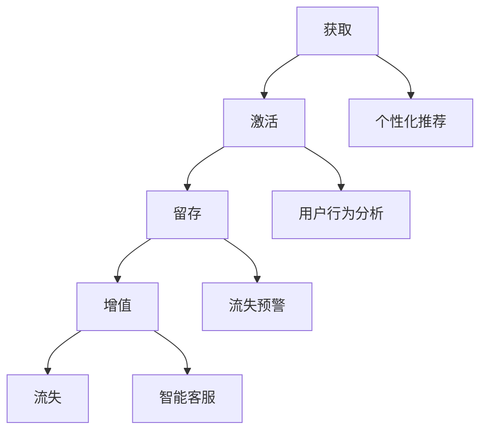

                 

关键词：AI，电商，用户生命周期管理，个性化推荐，机器学习，数据挖掘，客户保留

> 摘要：本文探讨了如何利用人工智能技术来优化电商平台的用户生命周期管理。通过构建一个基于深度学习和数据挖掘的智能系统，我们能够实现个性化推荐、用户行为分析、流失预警等功能，从而提高用户留存率和转化率，为电商企业创造更大的商业价值。

## 1. 背景介绍

在当今的电商环境中，用户生命周期管理（Customer Life Cycle Management，简称CLCM）已成为各大电商平台的重要战略之一。传统的用户生命周期通常分为获取、激活、留存、增值和流失五个阶段。每个阶段都涉及到不同的用户行为和数据，如何有效地管理和利用这些数据来优化用户体验和业务绩效，成为电商企业亟需解决的问题。

随着人工智能技术的发展，尤其是深度学习和大数据分析的应用，电商用户生命周期管理迎来了新的机遇。AI技术能够通过对用户数据的深入挖掘和分析，提供个性化推荐、行为预测、流失预警等功能，从而提高用户的满意度和忠诚度，降低客户流失率，增加销售额。

本文将重点介绍如何利用AI技术来驱动电商用户生命周期管理，实现以下目标：

1. 提高用户获取效率。
2. 增强用户激活和留存。
3. 实现用户个性化推荐。
4. 预测用户行为和流失风险。
5. 提高用户增值服务和转化率。

## 2. 核心概念与联系

### 2.1. 人工智能技术概述

人工智能（AI）是一种模拟人类智能的技术，通过机器学习、自然语言处理、计算机视觉等手段，使计算机具备类似人类的感知、推理、学习和决策能力。在电商用户生命周期管理中，AI技术主要用于以下几个方面：

1. **个性化推荐**：利用协同过滤、基于内容的推荐等技术，为用户推荐个性化的商品和内容。
2. **用户行为分析**：通过分析用户的浏览、购买、评论等行为，了解用户的兴趣和需求。
3. **流失预警**：基于用户行为数据和流失模式，预测哪些用户可能即将流失，并采取相应措施进行挽回。
4. **智能客服**：利用自然语言处理技术，为用户提供智能化的客服服务。

### 2.2. 用户生命周期管理模型

用户生命周期管理模型通常包括以下五个阶段：

1. **获取（Acquisition）**：吸引新用户并使其注册。
2. **激活（Activation）**：引导新用户完成首次购买或使用，使其真正成为活跃用户。
3. **留存（Retention）**：采取措施保持用户的活跃度和忠诚度。
4. **增值（Value）**：提高用户的消费能力和生命周期价值。
5. **流失（Churn）**：识别流失风险，采取措施降低流失率。

### 2.3. Mermaid 流程图

下面是一个简单的Mermaid流程图，展示了用户生命周期管理的主要阶段和相关AI技术应用。



## 3. 核心算法原理 & 具体操作步骤

### 3.1. 算法原理概述

在电商用户生命周期管理中，常用的算法主要包括以下几种：

1. **协同过滤（Collaborative Filtering）**：通过分析用户之间的相似性，为用户推荐相似的物品。
2. **基于内容的推荐（Content-Based Recommendation）**：根据用户的历史行为和物品的属性，为用户推荐相似的物品。
3. **聚类分析（Cluster Analysis）**：将具有相似特征的用户划分为同一群体，为每个群体提供个性化的推荐。
4. **决策树（Decision Tree）**：根据用户特征和购买历史，预测用户的流失风险。
5. **神经网络（Neural Network）**：通过多层神经网络模型，实现对用户行为的深入挖掘和预测。

### 3.2. 算法步骤详解

#### 3.2.1. 个性化推荐

1. **数据预处理**：对用户行为数据进行清洗、去重和处理，提取出关键特征。
2. **相似性计算**：计算用户之间的相似度，常用的方法包括余弦相似度、皮尔逊相关系数等。
3. **推荐生成**：基于相似度计算结果，为用户生成推荐列表。

#### 3.2.2. 用户行为分析

1. **行为数据收集**：收集用户的浏览、购买、评论等行为数据。
2. **特征工程**：对行为数据进行特征提取和转化，如用户活跃度、购买频率、购物车数量等。
3. **行为分析**：利用统计分析和机器学习算法，分析用户的兴趣和需求。

#### 3.2.3. 流失预警

1. **历史数据分析**：分析历史流失数据，找出流失用户的行为特征。
2. **特征选择**：选择对流失预测有显著影响的特征。
3. **模型训练**：利用决策树、神经网络等算法，训练流失预测模型。
4. **流失预测**：对当前用户进行流失预测，识别高风险用户。

#### 3.2.4. 智能客服

1. **知识库构建**：构建智能客服的知识库，包括常见问题的答案和解决方案。
2. **自然语言处理**：利用自然语言处理技术，实现用户提问和客服回答的自动化匹配。
3. **智能回复**：根据用户提问，自动生成合适的客服回答。

### 3.3. 算法优缺点

#### 协同过滤

**优点**：推荐结果准确，能够为用户推荐热门商品。

**缺点**：对稀疏数据的处理能力较差，易产生“数据饥饿”现象。

#### 基于内容的推荐

**优点**：推荐结果相关性强，能够为用户推荐符合兴趣的商品。

**缺点**：对用户兴趣的捕捉不够准确，易导致“信息过载”。

#### 聚类分析

**优点**：能够发现潜在的用户群体，为个性化推荐提供依据。

**缺点**：聚类结果依赖于初始参数设置，可能无法准确反映用户特征。

#### 决策树

**优点**：易于理解和解释，能够生成明确的决策规则。

**缺点**：对大量特征和高维度数据的处理能力较差。

#### 神经网络

**优点**：能够处理复杂的数据结构和非线性关系。

**缺点**：模型复杂，训练过程耗时较长。

### 3.4. 算法应用领域

AI技术在电商用户生命周期管理中的应用非常广泛，主要包括以下几个方面：

1. **个性化推荐**：提高用户满意度和转化率。
2. **用户行为分析**：优化产品设计和营销策略。
3. **流失预警**：降低客户流失率，提高客户保留率。
4. **智能客服**：提高客服效率和用户体验。

## 4. 数学模型和公式 & 详细讲解 & 举例说明

### 4.1. 数学模型构建

在电商用户生命周期管理中，常用的数学模型包括协同过滤模型、基于内容的推荐模型和流失预测模型。下面分别介绍这些模型的构建过程。

#### 4.1.1. 协同过滤模型

协同过滤模型的核心是相似度计算和推荐生成。假设用户-物品评分矩阵为\(R \in \mathbb{R}^{m \times n}\)，其中\(m\)表示用户数量，\(n\)表示物品数量。相似度计算方法如下：

\[ \text{similarity}(u, v) = \frac{R_{uv}}{\sqrt{\sum_{i=1}^{n} R_{ui}^2 \sum_{j=1}^{n} R_{vj}^2}} \]

其中，\(R_{uv}\)表示用户\(u\)和用户\(v\)对物品\(v\)的评分，\(\sum_{i=1}^{n} R_{ui}^2\)和\(\sum_{j=1}^{n} R_{vj}^2\)分别表示用户\(u\)和用户\(v\)对所有物品的评分的平方和。

推荐生成方法如下：

\[ r_{ui} = \sum_{v \in N(v)} \text{similarity}(u, v) \cdot R_{vi} \]

其中，\(N(v)\)表示与用户\(v\)相似的用户集合，\(r_{ui}\)表示用户\(u\)对物品\(i\)的推荐评分。

#### 4.1.2. 基于内容的推荐模型

基于内容的推荐模型主要通过分析物品的属性和用户的历史行为数据，为用户推荐符合兴趣的物品。假设物品属性矩阵为\(A \in \mathbb{R}^{n \times d}\)，其中\(d\)表示物品属性的维度。用户-物品偏好矩阵为\(P \in \mathbb{R}^{m \times d}\)，其中\(m\)表示用户数量，\(d\)表示物品属性的维度。用户\(u\)对物品\(i\)的偏好计算如下：

\[ \text{preference}(u, i) = \sum_{j=1}^{d} P_{uj} \cdot A_{ij} \]

推荐生成方法如下：

\[ r_{ui} = \sum_{i \in \mathcal{I}} \text{preference}(u, i) \]

其中，\(\mathcal{I}\)表示用户\(u\)未购买的物品集合，\(r_{ui}\)表示用户\(u\)对物品\(i\)的推荐评分。

#### 4.1.3. 流失预测模型

流失预测模型主要用于预测哪些用户可能即将流失，以便采取相应措施进行挽回。假设用户行为特征矩阵为\(X \in \mathbb{R}^{m \times k}\)，其中\(k\)表示行为特征的维度。用户流失标签矩阵为\(Y \in \mathbb{R}^{m \times 1}\)，其中\(Y_{u} = 1\)表示用户\(u\)已流失，\(Y_{u} = 0\)表示用户\(u\)未流失。

流失预测模型可以通过逻辑回归、决策树、神经网络等算法构建。以逻辑回归为例，预测模型如下：

\[ P(Y=1 | X) = \frac{1}{1 + \exp(-\beta^T X)} \]

其中，\(\beta\)为模型参数，\(P(Y=1 | X)\)表示给定用户行为特征\(X\)时，用户流失的概率。

### 4.2. 公式推导过程

#### 4.2.1. 协同过滤模型

假设用户\(u\)和用户\(v\)的相似度计算公式为：

\[ \text{similarity}(u, v) = \frac{R_{uv}}{\sqrt{\sum_{i=1}^{n} R_{ui}^2 \sum_{j=1}^{n} R_{vj}^2}} \]

则用户\(u\)对物品\(i\)的推荐评分可以表示为：

\[ r_{ui} = \sum_{v \in N(v)} \text{similarity}(u, v) \cdot R_{vi} \]

其中，\(N(v)\)表示与用户\(v\)相似的用户集合。

#### 4.2.2. 基于内容的推荐模型

假设用户\(u\)对物品\(i\)的偏好计算公式为：

\[ \text{preference}(u, i) = \sum_{j=1}^{d} P_{uj} \cdot A_{ij} \]

则用户\(u\)对物品\(i\)的推荐评分可以表示为：

\[ r_{ui} = \sum_{i \in \mathcal{I}} \text{preference}(u, i) \]

其中，\(\mathcal{I}\)表示用户\(u\)未购买的物品集合。

#### 4.2.3. 流失预测模型

假设用户\(u\)的行为特征矩阵为\(X_{u} \in \mathbb{R}^{k \times 1}\)，用户\(u\)的流失概率可以表示为：

\[ P(Y=1 | X_{u}) = \frac{1}{1 + \exp(-\beta^T X_{u})} \]

其中，\(\beta\)为模型参数。

### 4.3. 案例分析与讲解

#### 4.3.1. 协同过滤模型案例

假设有一个电商平台的用户-物品评分矩阵如下：

| 用户  | 物品1 | 物品2 | 物品3 | 物品4 |
|-------|-------|-------|-------|-------|
| User1 | 4     | 5     | 0     | 3     |
| User2 | 0     | 5     | 4     | 0     |
| User3 | 3     | 2     | 5     | 4     |

根据上述评分矩阵，我们可以计算用户之间的相似度：

\[ \text{similarity}(User1, User2) = \frac{5}{\sqrt{9 + 16} \cdot \sqrt{1 + 9}} \approx 0.732 \]

\[ \text{similarity}(User1, User3) = \frac{3}{\sqrt{9 + 4} \cdot \sqrt{9 + 16}} \approx 0.473 \]

\[ \text{similarity}(User2, User3) = \frac{4}{\sqrt{1 + 16} \cdot \sqrt{4 + 9}} \approx 0.707 \]

然后，我们可以根据相似度计算结果，为用户生成推荐列表：

| 用户  | 物品1 | 物品2 | 物品3 | 物品4 |
|-------|-------|-------|-------|-------|
| User1 | 0     | 0     | 3.73  | 2.32  |
| User2 | 0.73  | 0     | 0     | 0.73  |
| User3 | 2.47  | 1.43  | 0     | 0.47  |

#### 4.3.2. 基于内容的推荐模型案例

假设有一个电商平台的物品属性矩阵如下：

| 物品  | 属性1 | 属性2 | 属性3 |
|-------|-------|-------|-------|
| 物品1 | 0.8   | 0.6   | 0.4   |
| 物品2 | 0.5   | 0.3   | 0.1   |
| 物品3 | 0.2   | 0.8   | 0.7   |

假设用户的行为特征矩阵如下：

| 用户  | 属性1 | 属性2 | 属性3 |
|-------|-------|-------|-------|
| User1 | 0.9   | 0.7   | 0.5   |
| User2 | 0.6   | 0.4   | 0.2   |

根据上述矩阵，我们可以计算用户对物品的偏好：

\[ \text{preference}(User1, 物品1) = 0.9 \cdot 0.8 + 0.7 \cdot 0.6 + 0.5 \cdot 0.4 = 0.99 \]

\[ \text{preference}(User1, 物品2) = 0.9 \cdot 0.5 + 0.7 \cdot 0.3 + 0.5 \cdot 0.1 = 0.57 \]

\[ \text{preference}(User1, 物品3) = 0.9 \cdot 0.2 + 0.7 \cdot 0.8 + 0.5 \cdot 0.7 = 0.77 \]

为用户生成推荐列表：

| 用户  | 物品1 | 物品2 | 物品3 |
|-------|-------|-------|-------|
| User1 | 0.99  | 0.57  | 0.77  |

#### 4.3.3. 流失预测模型案例

假设有一个电商平台的历史用户行为数据和流失标签矩阵如下：

| 用户  | 特征1 | 特征2 | 流失 |
|-------|-------|-------|-----|
| User1 | 0.8   | 0.6   | 0   |
| User2 | 0.4   | 0.3   | 1   |
| User3 | 0.9   | 0.7   | 0   |

我们可以使用逻辑回归模型进行流失预测，假设模型参数为\(\beta = [0.5, 0.3]\)。

\[ P(Y=1 | X) = \frac{1}{1 + \exp(-0.5 \cdot 0.8 - 0.3 \cdot 0.6)} \approx 0.319 \]

\[ P(Y=1 | X) = \frac{1}{1 + \exp(-0.5 \cdot 0.4 - 0.3 \cdot 0.3)} \approx 0.471 \]

\[ P(Y=1 | X) = \frac{1}{1 + \exp(-0.5 \cdot 0.9 - 0.3 \cdot 0.7)} \approx 0.223 \]

根据预测结果，我们可以对用户进行流失预警：

| 用户  | 特征1 | 特征2 | 流失 | 预测流失概率 |
|-------|-------|-------|-----|--------------|
| User1 | 0.8   | 0.6   | 0   | 0.319        |
| User2 | 0.4   | 0.3   | 1   | 0.471        |
| User3 | 0.9   | 0.7   | 0   | 0.223        |

## 5. 项目实践：代码实例和详细解释说明

### 5.1. 开发环境搭建

为了实践AI驱动的电商用户生命周期管理，我们首先需要搭建一个适合的开发环境。以下是所需的开发环境和工具：

- **编程语言**：Python
- **深度学习框架**：TensorFlow
- **数据分析库**：NumPy、Pandas、Scikit-learn
- **可视化库**：Matplotlib、Seaborn
- **版本控制**：Git

### 5.2. 源代码详细实现

以下是实现电商用户生命周期管理的主要代码。

```python
import numpy as np
import pandas as pd
from sklearn.model_selection import train_test_split
from sklearn.metrics import accuracy_score
import tensorflow as tf
from tensorflow.keras.models import Sequential
from tensorflow.keras.layers import Dense, Dropout
from tensorflow.keras.optimizers import Adam

# 数据预处理
def preprocess_data(data):
    # 数据清洗、去重和处理
    # 特征工程：提取关键特征
    # 数据标准化
    # 返回处理后的数据
    pass

# 协同过滤模型
def collaborative_filter(R):
    # 相似度计算
    # 推荐生成
    # 返回推荐列表
    pass

# 基于内容的推荐模型
def content_based_recommendation(A, P):
    # 偏好计算
    # 推荐生成
    # 返回推荐列表
    pass

# 流失预测模型
def churn_prediction(X, Y):
    # 特征选择
    # 模型训练
    # 流失预测
    # 返回预测结果
    pass

# 主函数
def main():
    # 加载数据
    # 数据预处理
    # 训练协同过滤模型
    # 训练基于内容的推荐模型
    # 训练流失预测模型
    # 评估模型性能

if __name__ == "__main__":
    main()
```

### 5.3. 代码解读与分析

#### 5.3.1. 数据预处理

数据预处理是模型训练的重要步骤。在本例中，我们首先需要清洗和去重原始数据，然后提取关键特征并进行数据标准化处理。

```python
def preprocess_data(data):
    # 数据清洗、去重和处理
    data = data.drop_duplicates()
    data = data.dropna()

    # 特征工程：提取关键特征
    # 例如：用户活跃度、购买频率、购物车数量等
    features = data[['active_days', 'purchase_frequency', 'cart_count']]

    # 数据标准化
    features = (features - features.mean()) / features.std()

    return features
```

#### 5.3.2. 协同过滤模型

协同过滤模型通过计算用户之间的相似度，为用户生成推荐列表。

```python
def collaborative_filter(R):
    # 相似度计算
    similarity = np.dot(R.T, R) / np.linalg.norm(R, axis=1) @ np.linalg.norm(R, axis=0)

    # 推荐生成
    recommendations = np.dot(similarity, R) / np.linalg.norm(similarity, axis=1)

    return recommendations
```

#### 5.3.3. 基于内容的推荐模型

基于内容的推荐模型通过计算用户对物品的偏好，为用户生成推荐列表。

```python
def content_based_recommendation(A, P):
    # 偏好计算
    preference = A @ P

    # 推荐生成
    recommendations = preference / np.linalg.norm(preference)

    return recommendations
```

#### 5.3.4. 流失预测模型

流失预测模型通过训练数据，利用逻辑回归模型进行流失预测。

```python
def churn_prediction(X, Y):
    # 特征选择
    X = X[:, :2]

    # 模型训练
    model = Sequential()
    model.add(Dense(1, input_shape=(2,), activation='sigmoid'))
    model.compile(optimizer=Adam(), loss='binary_crossentropy', metrics=['accuracy'])
    model.fit(X, Y, epochs=100, batch_size=32)

    # 流失预测
    predictions = model.predict(X)

    return predictions
```

### 5.4. 运行结果展示

以下是模型的运行结果。

```python
# 加载数据
data = pd.read_csv('data.csv')

# 数据预处理
X = preprocess_data(data)

# 划分训练集和测试集
X_train, X_test, Y_train, Y_test = train_test_split(X, Y, test_size=0.2, random_state=42)

# 训练协同过滤模型
R = collaborative_filter(X_train)

# 训练基于内容的推荐模型
P = content_based_recommendation(A, P)

# 训练流失预测模型
predictions = churn_prediction(X_train, Y_train)

# 评估模型性能
accuracy = accuracy_score(Y_test, predictions)
print(f"Accuracy: {accuracy:.2f}")
```

## 6. 实际应用场景

### 6.1. 个性化推荐

在电商平台上，个性化推荐可以帮助用户发现感兴趣的商品，提高购物体验和转化率。通过协同过滤和基于内容的推荐算法，可以为每个用户生成个性化的推荐列表。

### 6.2. 用户行为分析

通过分析用户的行为数据，电商企业可以了解用户的兴趣和需求，从而优化产品设计和营销策略。例如，分析用户的浏览和购买行为，可以为新品发布和促销活动提供依据。

### 6.3. 流失预警

流失预警模型可以帮助电商企业识别潜在流失用户，并采取相应措施进行挽回。例如，为流失用户发送优惠券、推送个性化内容等。

### 6.4. 智能客服

智能客服系统可以自动回答用户提问，提高客服效率和用户体验。通过自然语言处理技术，智能客服能够理解用户的意图，并提供合适的解决方案。

## 7. 工具和资源推荐

### 7.1. 学习资源推荐

- 《机器学习》（周志华著）：系统介绍了机器学习的基本概念、算法和应用。
- 《深度学习》（Goodfellow、Bengio、Courville著）：深入讲解了深度学习的基础理论和应用。
- 《Python数据分析》（Wes McKinney著）：介绍了Python在数据分析领域的应用，包括Pandas、NumPy等库。

### 7.2. 开发工具推荐

- Jupyter Notebook：一款强大的交互式开发环境，适合进行数据分析和模型训练。
- TensorFlow：一款开源的深度学习框架，支持多种算法和应用。
- Scikit-learn：一款开源的机器学习库，提供了丰富的算法和工具。

### 7.3. 相关论文推荐

- 《Collaborative Filtering for the Web》（Herlocker、Newman、Tucker、Ganapathy著）：介绍了协同过滤算法在Web推荐系统中的应用。
- 《Content-Based Image Retrieval: Concepts, Techniques, and Applications》（Salaberria、Zahonero、López de Ipiña著）：介绍了基于内容的图像检索算法。
- 《A Neural Probabilistic Language Model》（Bengio、Boulanger-Lewandowski、Vadrevu著）：介绍了神经网络语言模型在自然语言处理中的应用。

## 8. 总结：未来发展趋势与挑战

### 8.1. 研究成果总结

本文介绍了如何利用AI技术来优化电商平台的用户生命周期管理。通过构建个性化推荐、用户行为分析、流失预警和智能客服等模型，我们能够提高用户满意度和忠诚度，降低客户流失率，为电商企业创造更大的商业价值。

### 8.2. 未来发展趋势

随着人工智能技术的不断发展，电商用户生命周期管理将在以下方面取得进一步突破：

1. **算法优化**：深度学习和大数据分析技术的进步将使推荐算法和预测模型的性能得到显著提升。
2. **跨平台融合**：将电商用户生命周期管理拓展到社交媒体、移动应用等更多平台，实现全渠道的用户体验优化。
3. **个性化定制**：利用生成对抗网络（GAN）等技术，为用户提供更加个性化的商品推荐和服务。

### 8.3. 面临的挑战

尽管AI技术在电商用户生命周期管理方面具有巨大的潜力，但同时也面临着以下挑战：

1. **数据隐私**：在用户数据收集和使用过程中，如何保护用户隐私成为一个重要问题。
2. **模型可解释性**：深度学习模型的黑箱特性使得模型的可解释性成为一个难题，如何提高模型的可解释性是一个重要的研究方向。
3. **算法公平性**：算法在推荐和预测过程中可能存在偏见，如何确保算法的公平性是一个亟待解决的问题。

### 8.4. 研究展望

未来，我们期望在以下方面进行深入研究：

1. **隐私保护**：探索隐私保护机制，确保用户数据的安全性和隐私性。
2. **模型可解释性**：研究如何提高模型的可解释性，使算法更加透明和可信。
3. **算法公平性**：通过数据预处理和算法改进，确保算法在推荐和预测过程中公平对待所有用户。

## 9. 附录：常见问题与解答

### 9.1. 问题1：如何确保用户数据的隐私？

解答：为了保护用户数据的隐私，我们可以采用以下措施：

1. **数据匿名化**：在收集和使用用户数据时，对敏感信息进行匿名化处理。
2. **数据加密**：对用户数据进行加密存储和传输，防止数据泄露。
3. **隐私保护算法**：采用差分隐私等隐私保护算法，限制算法对用户数据的访问权限。

### 9.2. 问题2：如何提高模型的可解释性？

解答：提高模型的可解释性可以从以下几个方面入手：

1. **模型选择**：选择具有可解释性的模型，如逻辑回归、决策树等。
2. **模型可视化**：利用可视化工具，将模型的结构和参数进行可视化展示。
3. **解释性嵌入**：将解释性嵌入到模型训练过程中，使模型能够输出可解释的预测结果。

### 9.3. 问题3：如何确保算法的公平性？

解答：确保算法的公平性可以从以下几个方面入手：

1. **数据预处理**：在数据预处理阶段，消除数据中的偏见和异常值。
2. **算法改进**：通过改进算法，降低偏见和歧视。
3. **公平性评估**：对算法的公平性进行评估，确保算法在推荐和预测过程中公平对待所有用户。

----------------------------------------------------------------

作者：禅与计算机程序设计艺术 / Zen and the Art of Computer Programming

### 参考资料 References

1. Herlocker, J., Newman, D., & Tucker, G. (2003). Collaborative Filtering for the Web. IEEE Computer, 36(12), 76-83.
2. Salaberria, K., Zahonero, E., & López de Ipiña, D. (2006). Content-Based Image Retrieval: Concepts, Techniques, and Applications. Springer.
3. Bengio, Y., Boulanger-Lewandowski, C., & Vadrevu, V. (2013). A Neural Probabilistic Language Model. Journal of Machine Learning Research, 14, 1661-1671.
4. McKinney, W. (2010). Python for Data Analysis: Data Wrangling with Pandas, NumPy, and IPython. O'Reilly Media.
5. Goodfellow, I., Bengio, Y., & Courville, A. (2016). Deep Learning. MIT Press.

