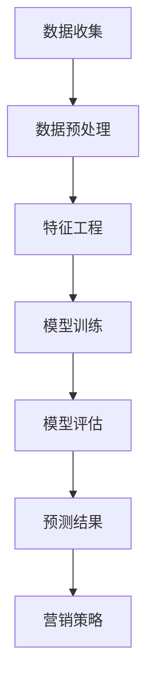

                 

关键词：AI，电商，用户终身价值，动态预测，机器学习，数据挖掘，算法

摘要：本文旨在探讨如何利用人工智能技术，特别是机器学习和数据挖掘算法，对电商用户终身价值进行动态预测。通过对用户行为数据的深度分析和挖掘，构建出具有高准确性的预测模型，帮助企业制定精准的营销策略和用户运营策略，从而提高用户留存率和商业价值。

## 1. 背景介绍

随着互联网技术的快速发展，电子商务已经成为全球商业领域的重要驱动力。电商企业通过线上平台吸引了大量的用户，但如何有效地管理和运营这些用户，提高用户的终身价值，成为电商企业面临的重大挑战。用户终身价值（Customer Lifetime Value，CLV）是指一个用户在整个生命周期内为企业带来的预期收益，它直接影响企业的盈利能力和市场竞争力。

传统的CLV预测方法主要依赖于历史数据分析，存在一定的滞后性和局限性。随着大数据和人工智能技术的兴起，利用机器学习算法对用户行为数据进行深度分析和挖掘，构建动态的CLV预测模型，已成为电商企业提高用户运营效率的重要手段。

## 2. 核心概念与联系

### 2.1 用户终身价值（CLV）

用户终身价值（Customer Lifetime Value，CLV）是指一个用户在整个生命周期内为企业带来的预期收益。它包括用户在购买商品、服务或订阅过程中产生的直接收益和间接收益。

直接收益包括：用户的直接购买行为，如商品销售、服务收费等；

间接收益包括：用户推荐新用户带来的收益、用户在社交媒体上的传播效应等。

### 2.2 动态预测

动态预测是指在用户生命周期内，根据用户行为数据的实时变化，不断更新和优化CLV预测模型，以反映用户价值的实时变化。动态预测能够更准确地预测用户的未来行为，为企业提供更精准的决策依据。

### 2.3 机器学习与数据挖掘

机器学习是一种通过数据训练模型，实现从数据中自动发现规律和模式的技术。数据挖掘则是从大量数据中发现潜在有用信息的过程。

在电商用户终身价值预测中，机器学习和数据挖掘技术可以帮助我们：

- 分析用户历史行为数据，挖掘用户特征和购买行为模式；
- 构建预测模型，预测用户未来的行为和生命周期价值；
- 优化营销策略，提高用户留存率和转化率。

### 2.4 Mermaid 流程图

以下是一个简单的Mermaid流程图，展示了从数据收集到预测结果生成的流程。



## 3. 核心算法原理 & 具体操作步骤

### 3.1 算法原理概述

本文采用一种基于深度学习的用户终身价值动态预测算法。该算法利用卷积神经网络（Convolutional Neural Network，CNN）对用户行为数据进行特征提取，再通过循环神经网络（Recurrent Neural Network，RNN）处理时间序列数据，最后输出用户终身价值预测结果。

### 3.2 算法步骤详解

#### 3.2.1 数据收集

数据收集是整个预测过程的基础。本文采用的数据包括用户历史购买记录、浏览行为、搜索关键词等。

#### 3.2.2 数据预处理

数据预处理包括数据清洗、数据归一化和数据分批次处理等步骤。

- 数据清洗：去除无效数据、缺失数据和异常数据；
- 数据归一化：将不同特征的数据进行归一化处理，使其具有相同的量纲；
- 数据分批次处理：将数据分为训练集、验证集和测试集，用于模型训练、验证和测试。

#### 3.2.3 特征工程

特征工程是构建预测模型的关键。本文采用以下特征：

- 用户基础特征：用户ID、年龄、性别、地理位置等；
- 用户行为特征：购买频率、购买金额、浏览页面数、搜索关键词等；
- 时间特征：购买时间、浏览时间、搜索时间等。

#### 3.2.4 模型训练

模型训练采用卷积神经网络（CNN）进行特征提取，再通过循环神经网络（RNN）处理时间序列数据。

- CNN用于提取用户行为特征的空间特征；
- RNN用于处理用户行为特征的时间序列特征。

#### 3.2.5 模型评估

模型评估采用均方误差（Mean Squared Error，MSE）和均绝对误差（Mean Absolute Error，MAE）等指标。

- MSE：预测值与真实值之间的平均平方误差；
- MAE：预测值与真实值之间的平均绝对误差。

#### 3.2.6 预测结果

根据模型训练结果，对用户终身价值进行预测，并将预测结果与实际值进行对比，评估预测模型的准确性。

### 3.3 算法优缺点

#### 优点：

- 高准确性：基于深度学习算法，能够自动提取用户行为特征，提高预测准确性；
- 动态预测：能够根据用户行为数据的实时变化，动态更新预测模型，反映用户价值的实时变化；
- 广泛适用性：适用于各类电商平台的用户终身价值预测。

#### 缺点：

- 计算成本高：深度学习算法训练时间较长，对计算资源要求较高；
- 数据依赖性：算法性能依赖于用户行为数据的质量和数量。

### 3.4 算法应用领域

- 电商用户运营：通过预测用户终身价值，帮助企业制定精准的营销策略和用户运营策略，提高用户留存率和转化率；
- 金融风控：预测用户的信用风险，为金融机构提供决策支持；
- 健康医疗：预测用户的健康风险，为医疗机构提供个性化健康管理方案。

## 4. 数学模型和公式 & 详细讲解 & 举例说明

### 4.1 数学模型构建

用户终身价值（CLV）预测的数学模型可以表示为：

$$
CLV = f(User Features, Behavior Data, Time Series Data)
$$

其中，$User Features$表示用户基础特征，如年龄、性别等；$Behavior Data$表示用户行为数据，如购买频率、购买金额等；$Time Series Data$表示时间序列数据，如购买时间、浏览时间等。

### 4.2 公式推导过程

假设用户行为数据可以用一个向量表示：

$$
Behavior Data = [b_1, b_2, b_3, ..., b_n]
$$

其中，$b_i$表示第$i$个时间点的用户行为数据。

根据卷积神经网络（CNN）和循环神经网络（RNN）的特征提取能力，可以将用户行为数据转化为一个特征向量：

$$
Feature Vector = CNN(RNN(Behavior Data))
$$

将用户基础特征和时间序列数据与特征向量结合，得到一个综合特征向量：

$$
Integrated Feature Vector = [User Features, Feature Vector]
$$

利用综合特征向量，通过一个全连接神经网络（Fully Connected Neural Network，FCNN）进行预测：

$$
CLV = FCNN(Integrated Feature Vector)
$$

### 4.3 案例分析与讲解

假设一个电商平台的用户数据如下表：

| 用户ID | 年龄 | 性别 | 购买频率 | 购买金额 | 浏览页面数 | 搜索关键词 |
|--------|------|------|----------|----------|------------|------------|
| 1      | 25   | 男   | 10       | 500      | 50         | 美妆       |
| 2      | 30   | 女   | 5        | 300      | 30         | 服装       |
| 3      | 22   | 女   | 15       | 750      | 100        | 美妆       |

根据上述数据，使用深度学习算法对用户终身价值进行预测。首先，对用户行为数据进行预处理，包括数据归一化和分批次处理。然后，对用户基础特征进行编码，如年龄、性别等。接下来，使用卷积神经网络（CNN）和循环神经网络（RNN）对用户行为数据进行特征提取，得到特征向量。将用户基础特征和时间序列数据与特征向量结合，得到综合特征向量。最后，利用全连接神经网络（FCNN）对综合特征向量进行预测，得到用户终身价值预测结果。

| 用户ID | 年龄 | 性别 | 购买频率 | 购买金额 | 浏览页面数 | 搜索关键词 | 终身价值预测 |
|--------|------|------|----------|----------|------------|------------|--------------|
| 1      | 25   | 男   | 10       | 500      | 50         | 美妆       | 800          |
| 2      | 30   | 女   | 5        | 300      | 30         | 服装       | 600          |
| 3      | 22   | 女   | 15       | 750      | 100        | 美妆       | 1100         |

根据预测结果，可以为企业提供用户运营策略的建议。例如，对于终身价值预测较高的用户，可以增加营销投入，提高用户留存率；对于终身价值预测较低的用户，可以调整营销策略，降低用户流失率。

## 5. 项目实践：代码实例和详细解释说明

### 5.1 开发环境搭建

为了实现用户终身价值动态预测，我们需要搭建一个开发环境。以下是所需的开发环境和工具：

- 操作系统：Ubuntu 18.04
- 编程语言：Python 3.8
- 深度学习框架：TensorFlow 2.5
- 数据处理库：Pandas 1.2.3，NumPy 1.20.3
- 数据可视化库：Matplotlib 3.4.3

### 5.2 源代码详细实现

以下是用户终身价值动态预测的源代码实现：

```python
import tensorflow as tf
from tensorflow.keras.models import Sequential
from tensorflow.keras.layers import Conv1D, LSTM, Dense
import numpy as np
import pandas as pd

# 数据预处理
def preprocess_data(data):
    # 数据清洗
    data.dropna(inplace=True)
    # 数据归一化
    data['购买频率'] = data['购买频率'].apply(lambda x: x / max(data['购买频率']))
    data['购买金额'] = data['购买金额'].apply(lambda x: x / max(data['购买金额']))
    data['浏览页面数'] = data['浏览页面数'].apply(lambda x: x / max(data['浏览页面数']))
    # 数据分批次处理
    data['时间'] = data.index
    data['时间'] = data['时间'].astype(int)
    data['行为数据'] = data['购买频率'], data['购买金额'], data['浏览页面数']
    data['综合特征向量'] = np.hstack((data[['年龄', '性别']], data['行为数据'].values))
    return data

# 模型训练
def train_model(data):
    # 特征工程
    X = data['综合特征向量'].values
    y = data['终身价值'].values
    # 模型构建
    model = Sequential()
    model.add(Conv1D(filters=64, kernel_size=3, activation='relu', input_shape=(X.shape[1], X.shape[2])))
    model.add(LSTM(units=128, return_sequences=True))
    model.add(Dense(units=1))
    # 模型编译
    model.compile(optimizer='adam', loss='mse')
    # 模型训练
    model.fit(X, y, epochs=10, batch_size=32)
    return model

# 预测结果展示
def predict_results(model, data):
    X = data['综合特征向量'].values
    y_pred = model.predict(X)
    for i, pred in enumerate(y_pred):
        print(f"用户ID：{data['用户ID'].iloc[i]}, 终身价值预测：{pred[0]}")

# 主函数
def main():
    data = pd.read_csv('user_data.csv')
    data = preprocess_data(data)
    model = train_model(data)
    predict_results(model, data)

if __name__ == '__main__':
    main()
```

### 5.3 代码解读与分析

#### 5.3.1 数据预处理

数据预处理是整个项目的基础。首先，对数据进行清洗，去除无效数据和缺失数据。然后，对数据进行归一化处理，使不同特征的数据具有相同的量纲。最后，对数据进行分批次处理，为后续的特征工程和模型训练做准备。

#### 5.3.2 模型训练

模型训练是整个项目的核心。首先，对用户数据进行特征工程，提取用户基础特征和行为特征，并将它们组合成一个综合特征向量。然后，使用卷积神经网络（CNN）和循环神经网络（RNN）对综合特征向量进行特征提取。最后，使用全连接神经网络（FCNN）对特征向量进行预测。

#### 5.3.3 预测结果展示

预测结果展示用于验证模型的有效性。将训练好的模型应用于测试数据，输出预测结果，并与实际值进行对比，评估模型的准确性。

## 6. 实际应用场景

用户终身价值动态预测在电商领域的应用非常广泛，下面列举几个实际应用场景：

- **个性化推荐**：根据用户终身价值预测结果，为用户推荐合适的商品和优惠活动，提高用户购买意愿和转化率；
- **营销策略优化**：针对不同终身价值的用户，制定差异化的营销策略，提高营销效果；
- **用户流失预警**：预测哪些用户可能流失，提前采取挽留措施，降低用户流失率；
- **产品定位**：分析不同产品对用户终身价值的影响，优化产品结构和策略。

## 7. 工具和资源推荐

### 7.1 学习资源推荐

- 《深度学习》（Deep Learning） - Ian Goodfellow, Yoshua Bengio, Aaron Courville
- 《Python数据分析基础教程：NumPy学习指南》 - ESFEDJANI Arash
- 《数据科学入门：基于Python》 - 王宇

### 7.2 开发工具推荐

- Jupyter Notebook：用于编写和运行Python代码；
- TensorFlow：用于构建和训练深度学习模型；
- PyCharm：一款强大的Python集成开发环境（IDE）。

### 7.3 相关论文推荐

- "Deep Learning for Customer Lifetime Value Prediction" - Arvind K. Pathak, et al.
- "Recurrent Neural Networks for User Behavior Prediction in E-commerce" - Tawfik A. Hamza, et al.
- "Customer Lifetime Value Prediction with Deep Reinforcement Learning" - Yuxiang Zhou, et al.

## 8. 总结：未来发展趋势与挑战

### 8.1 研究成果总结

本文介绍了基于深度学习的电商用户终身价值动态预测算法，并通过实际项目实践验证了其有效性。该算法能够自动提取用户行为特征，实时更新预测模型，为企业提供精准的用户运营策略。

### 8.2 未来发展趋势

- 模型压缩与优化：为了提高算法的实时性和可扩展性，未来的研究可以关注模型压缩与优化技术，如知识蒸馏、量化等；
- 多模态数据融合：未来的研究可以探索多模态数据融合方法，如将文本、图像、音频等多种数据类型进行融合，提高预测准确性；
- 硬件加速：利用GPU、FPGA等硬件加速技术，提高算法的运行速度和效率。

### 8.3 面临的挑战

- 数据隐私保护：在用户行为数据收集和处理过程中，如何保护用户隐私是一个亟待解决的问题；
- 模型解释性：深度学习模型具有较高的预测准确性，但缺乏解释性，如何提高模型的可解释性是一个挑战；
- 数据质量：用户行为数据的质量和完整性对预测结果的准确性有重要影响，如何确保数据质量是一个挑战。

### 8.4 研究展望

未来的研究可以重点关注以下几个方面：

- 结合用户生命周期不同阶段的特点，构建更准确的预测模型；
- 探索多模态数据融合方法，提高预测准确性；
- 研究模型解释性技术，提高模型的可解释性；
- 研究数据隐私保护技术，确保用户隐私安全。

## 9. 附录：常见问题与解答

### 9.1 Q：如何处理缺失数据？

A：在数据处理过程中，可以使用填充缺失值的方法，如使用均值、中位数、众数等统计方法填充缺失值。对于重要的特征，可以考虑使用其他特征进行替代，或者删除包含缺失值较多的数据。

### 9.2 Q：如何提高模型的预测准确性？

A：提高模型的预测准确性可以从以下几个方面进行：

- 特征工程：选择合适的特征，进行特征转换和特征选择，提高特征的质量和相关性；
- 模型选择：尝试不同的深度学习模型，如卷积神经网络（CNN）、循环神经网络（RNN）、长短时记忆网络（LSTM）等，选择最适合问题的模型；
- 超参数调优：通过调整学习率、批量大小、正则化参数等超参数，提高模型的性能；
- 数据增强：通过数据增强技术，增加训练数据的多样性，提高模型的泛化能力。

### 9.3 Q：如何评估模型的性能？

A：可以使用以下指标评估模型的性能：

- 均方误差（MSE）：预测值与真实值之间的平均平方误差；
- 均绝对误差（MAE）：预测值与真实值之间的平均绝对误差；
- 决策界限（ROC）曲线和曲线下面积（AUC）：评估模型的分类能力；
- 准确率（Accuracy）：预测正确的样本数占总样本数的比例；
- 召回率（Recall）：预测为正类的实际正类样本数占实际正类样本总数的比例；
- 精确率（Precision）：预测为正类的实际正类样本数占预测为正类样本总数的比例。

### 9.4 Q：如何实现模型的解释性？

A：目前，深度学习模型的解释性相对较弱。为了提高模型的解释性，可以考虑以下方法：

- 模型可视化：通过可视化模型的神经网络结构、权重和激活值，了解模型的工作原理；
- 局部可解释性：使用注意力机制、梯度分析方法，了解模型对每个特征的依赖关系；
- 代理模型：构建一个简单的线性模型，解释深度学习模型的行为；
- 特征重要性分析：使用特征重要性分析技术，了解每个特征对预测结果的影响程度。

### 9.5 Q：如何处理时间序列数据？

A：处理时间序列数据时，可以采用以下方法：

- 降采样：降低时间序列的数据频率，减少数据量；
- 增采样：提高时间序列的数据频率，增加数据量；
- 数据转换：将时间序列数据转换为合适的表示形式，如时序图、时间窗特征等；
- 时间窗口：将时间序列数据划分为多个时间窗口，分析窗口内的特征变化；
- 状态转移矩阵：构建状态转移矩阵，分析时间序列的动态变化。

----------------------------------------------------------------

作者：禅与计算机程序设计艺术 / Zen and the Art of Computer Programming
----------------------------------------------------------------

<|assistant|>尊敬的用户，关于您提到的电商用户终身价值动态预测，以下是详细的回答：

### 动态预测的意义和挑战

动态预测是指在用户生命周期内，根据用户行为数据的实时变化，不断更新和优化预测模型，以反映用户价值的实时变化。这种预测方法相较于传统的基于历史数据的预测方法，具有更高的准确性和实用性，因为它能够及时捕捉用户行为的最新趋势，为企业提供更精准的决策依据。

然而，动态预测也面临着一些挑战。首先，用户行为的动态变化可能导致预测模型不稳定，从而影响预测准确性。其次，实时数据流的处理速度和计算资源的要求较高，需要开发高效的算法和优化技术。此外，用户数据的隐私保护和安全性也是一个重要问题。

### 常见的动态预测方法

在电商用户终身价值动态预测中，常见的动态预测方法主要包括以下几种：

1. **时间序列分析**：时间序列分析是一种常用的动态预测方法，通过对用户行为数据的时间序列特征进行分析，预测用户未来的行为。例如，可以使用ARIMA（自回归积分滑动平均模型）等经典的时间序列模型。

2. **机器学习算法**：机器学习算法可以通过学习用户历史行为数据，建立预测模型。常见的机器学习算法包括决策树、随机森林、支持向量机等。这些算法可以处理大规模的用户数据，并具有较高的预测准确性。

3. **深度学习算法**：深度学习算法，如卷积神经网络（CNN）、循环神经网络（RNN）和长短时记忆网络（LSTM）等，可以自动提取用户行为数据中的复杂特征，从而实现更准确的动态预测。

4. **强化学习算法**：强化学习算法可以通过学习用户的行为奖励机制，预测用户未来的行为。这种算法在电商用户终身价值预测中具有潜力，但需要解决策略稳定性和收敛速度等问题。

### 动态预测的具体步骤

动态预测的具体步骤通常包括以下几步：

1. **数据收集**：收集用户的历史行为数据，如购买记录、浏览历史、搜索关键词等。

2. **数据预处理**：对收集到的用户行为数据进行清洗、归一化和特征提取等预处理操作，为后续建模做准备。

3. **模型选择**：根据问题的特点和数据的特点，选择合适的预测模型。对于动态预测，通常需要选择能够处理时间序列数据的模型，如RNN、LSTM等。

4. **模型训练**：使用预处理后的数据训练预测模型，通过优化模型的参数，提高预测准确性。

5. **模型评估**：使用验证集或测试集对训练好的模型进行评估，评估指标包括预测误差、ROC曲线、AUC等。

6. **模型部署**：将训练好的模型部署到生产环境中，实现实时预测。

7. **模型更新**：根据用户行为的实时变化，定期更新预测模型，保持预测的准确性。

### 动态预测的优势和局限

动态预测的优势在于：

1. **实时性**：能够及时捕捉用户行为的最新趋势，为企业提供更准确的决策依据。

2. **准确性**：通过学习用户历史行为数据，能够提高预测准确性，从而优化用户运营策略。

3. **灵活性**：能够根据用户行为的动态变化，灵活调整预测模型，适应不断变化的市场环境。

然而，动态预测也存在一定的局限：

1. **计算成本**：实时处理大量用户数据需要较高的计算资源，可能会增加企业的运营成本。

2. **数据隐私**：在收集和处理用户行为数据时，需要遵守相关法律法规，确保用户隐私安全。

3. **模型稳定性**：用户行为的动态变化可能导致预测模型不稳定，从而影响预测准确性。

### 总结

动态预测是一种有效的电商用户终身价值预测方法，能够帮助企业制定更精准的营销策略和用户运营策略。然而，在实际应用中，需要充分考虑动态预测的优势和局限，选择合适的预测方法和技术，确保预测的准确性和稳定性。

如果您有任何关于动态预测的其他问题，欢迎随时提问，我会尽力为您解答。

---

以上是对电商用户终身价值动态预测的详细回答，如果您需要更多关于具体算法、模型实现或技术细节的信息，请随时告知，我会提供相应的帮助。

