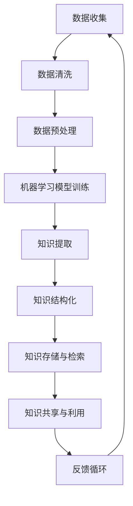

                 

 关键词：人工智能，知识管理，数据驱动，机器学习，知识图谱，智能推荐，自然语言处理，自动化流程

> 摘要：随着人工智能技术的快速发展，AI在知识管理领域的作用日益凸显。本文将探讨AI驱动的知识管理革命，从核心概念、算法原理、数学模型、实践案例以及未来展望等多个方面，详细解析AI如何变革知识管理，提升企业效率和创新能力。

## 1. 背景介绍

知识管理作为一种系统的过程，旨在识别、创造、收集、组织和传播知识，以支持个人和组织的决策和学习。传统的知识管理依赖于人工处理，效率低且易出错。然而，随着大数据、云计算、自然语言处理（NLP）、机器学习（ML）等技术的发展，人工智能开始成为知识管理的重要驱动力。

### 1.1 知识管理的定义和重要性

知识管理（Knowledge Management，KM）是一种通过技术手段和策略，有效地获取、存储、共享和利用知识的活动。其重要性在于：

- **提高效率**：通过自动化流程，减少重复性工作，加快决策速度。
- **增强创新能力**：促进知识的共享和创新，提升组织的核心竞争力。
- **减少知识流失**：通过知识管理系统，确保关键知识的保留和传承。

### 1.2 人工智能的发展与知识管理的结合

人工智能（AI）在知识管理中的应用，使得知识获取、理解和利用变得更加智能化和高效化。AI能够处理海量数据，提取有价值的信息，从而为知识管理提供强大的技术支持。以下是一些关键领域：

- **自然语言处理**：帮助理解和处理文本数据，实现知识自动提取和语义分析。
- **机器学习**：通过数据训练，提高知识分类、推荐和预测的准确性。
- **知识图谱**：构建领域知识图谱，实现知识的结构化和关联化。

## 2. 核心概念与联系

为了更好地理解AI驱动的知识管理，我们需要了解几个核心概念及其相互关系。

### 2.1 数据驱动

数据驱动是指基于数据来指导决策和行动。在知识管理中，数据驱动意味着通过收集和分析数据，识别知识需求，优化知识管理流程。

### 2.2 机器学习

机器学习是AI的核心组成部分，通过训练模型，让计算机自动地从数据中学习规律，从而进行预测和决策。在知识管理中，机器学习可以用于知识分类、推荐系统和自动化流程。

### 2.3 自然语言处理

自然语言处理（NLP）是AI的一个分支，旨在让计算机理解和处理自然语言。在知识管理中，NLP可以用于文本分析、情感分析和自动摘要。

### 2.4 知识图谱

知识图谱是一种用于表示知识结构和关系的图形化模型。它能够将各类知识进行结构化和关联化，从而提高知识的可访问性和可用性。

### 2.5 Mermaid 流程图

以下是知识管理中AI驱动的核心流程的Mermaid流程图：



## 3. 核心算法原理 & 具体操作步骤

### 3.1 算法原理概述

AI驱动的知识管理算法主要包括以下几个步骤：

- **数据收集**：通过各种渠道收集结构化和非结构化数据。
- **数据清洗**：去除数据中的噪声和错误。
- **数据预处理**：进行数据格式化和特征提取。
- **机器学习模型训练**：利用训练数据，训练分类、聚类、推荐等模型。
- **知识提取**：使用NLP技术，从文本数据中提取关键词、主题和实体。
- **知识结构化**：使用知识图谱技术，将提取的知识进行结构化和关联。
- **知识存储与检索**：将结构化的知识存储在知识库中，并提供快速检索功能。
- **知识共享与利用**：通过API、门户等方式，实现知识的共享和利用。
- **反馈循环**：根据用户反馈，不断优化知识管理流程和模型。

### 3.2 算法步骤详解

#### 3.2.1 数据收集

数据收集是知识管理的第一步，数据来源可以包括内部数据（如企业内部文档、历史记录）和外部数据（如社交媒体、行业报告）。

#### 3.2.2 数据清洗

数据清洗的目的是去除数据中的噪声和错误，包括去除重复数据、填补缺失值、去除无关信息等。

#### 3.2.3 数据预处理

数据预处理包括数据格式化、特征提取和特征选择。数据格式化是将数据转换为统一的格式，特征提取是提取数据中的关键信息，特征选择是选择最有用的特征。

#### 3.2.4 机器学习模型训练

机器学习模型训练是利用训练数据，训练分类、聚类、推荐等模型。常用的算法包括决策树、支持向量机、神经网络等。

#### 3.2.5 知识提取

知识提取是使用NLP技术，从文本数据中提取关键词、主题和实体。常用的方法包括词频分析、文本分类、主题建模等。

#### 3.2.6 知识结构化

知识结构化是将提取的知识进行结构化和关联。知识图谱是一种常用的知识结构化方法，它使用节点和边来表示知识实体和关系。

#### 3.2.7 知识存储与检索

知识存储与检索是将结构化的知识存储在知识库中，并提供快速检索功能。知识库可以使用关系数据库、图数据库等。

#### 3.2.8 知识共享与利用

知识共享与利用是通过API、门户等方式，实现知识的共享和利用。用户可以通过查询、浏览、下载等方式获取知识。

#### 3.2.9 反馈循环

反馈循环是根据用户反馈，不断优化知识管理流程和模型。用户反馈可以用于调整知识提取和推荐算法，提高系统的准确性。

### 3.3 算法优缺点

#### 优点

- **高效性**：AI驱动的知识管理能够快速处理大量数据，提高工作效率。
- **准确性**：通过机器学习和自然语言处理，可以提高知识提取和推荐的准确性。
- **灵活性**：AI系统可以根据用户反馈和需求，动态调整知识管理流程和模型。

#### 缺点

- **成本**：AI驱动的知识管理需要大量的计算资源和专业知识，成本较高。
- **数据质量**：数据质量直接影响算法的准确性，需要严格的数据清洗和处理。
- **用户适应性**：AI系统可能需要时间来适应不同的用户需求，提高用户体验。

### 3.4 算法应用领域

AI驱动的知识管理算法可以应用于各个领域，如企业内部知识管理、电子商务推荐系统、医疗健康知识库、教育学习平台等。

## 4. 数学模型和公式 & 详细讲解 & 举例说明

### 4.1 数学模型构建

在AI驱动的知识管理中，常用的数学模型包括机器学习模型、知识图谱模型和自然语言处理模型。

#### 4.1.1 机器学习模型

机器学习模型是AI驱动的知识管理的核心。常见的机器学习模型包括：

- **线性回归**：用于预测连续值。
- **逻辑回归**：用于预测概率。
- **支持向量机**：用于分类。
- **神经网络**：用于复杂函数的拟合和分类。

#### 4.1.2 知识图谱模型

知识图谱模型使用图论来表示知识结构和关系。常见的知识图谱模型包括：

- **基于路径的模型**：如PageRank、HITS。
- **基于结构的模型**：如LDA、Laplacian SVM。

#### 4.1.3 自然语言处理模型

自然语言处理模型用于处理文本数据，常见的模型包括：

- **词袋模型**：用于文本分类和情感分析。
- **循环神经网络（RNN）**：用于文本生成和序列标注。
- **变换器（Transformer）**：用于机器翻译和文本摘要。

### 4.2 公式推导过程

以线性回归为例，假设我们有n个训练样本，每个样本包含特征向量x和标签y。线性回归模型的公式为：

$$
y = \beta_0 + \beta_1x
$$

其中，$\beta_0$和$\beta_1$是模型的参数。为了求解参数，我们可以使用最小二乘法：

$$
\beta_1 = \frac{\sum_{i=1}^{n}(x_i - \bar{x})(y_i - \bar{y})}{\sum_{i=1}^{n}(x_i - \bar{x})^2}
$$

$$
\beta_0 = \bar{y} - \beta_1\bar{x}
$$

其中，$\bar{x}$和$\bar{y}$分别是特征向量和标签的平均值。

### 4.3 案例分析与讲解

#### 4.3.1 机器学习模型在知识分类中的应用

假设我们要对一个企业的文档进行分类，将其分为业务、技术、市场等类别。我们可以使用支持向量机（SVM）进行分类。

1. 数据收集：收集企业内部的所有文档，并标注类别。
2. 数据预处理：对文档进行文本预处理，提取关键词和特征向量。
3. 模型训练：使用训练数据，训练SVM模型。
4. 模型评估：使用测试数据，评估模型的分类准确性。
5. 模型应用：对新的文档进行分类。

#### 4.3.2 知识图谱在知识检索中的应用

假设我们要构建一个企业内部的知识图谱，以方便员工快速检索知识。

1. 数据收集：收集企业内部的所有文档和知识。
2. 知识提取：使用NLP技术，从文档中提取关键词和实体。
3. 知识结构化：构建知识图谱，将关键词和实体作为节点，关系作为边。
4. 知识存储与检索：将知识图谱存储在图数据库中，并提供检索接口。
5. 检索优化：根据用户查询，动态调整知识图谱的结构和权重。

## 5. 项目实践：代码实例和详细解释说明

### 5.1 开发环境搭建

为了实践AI驱动的知识管理，我们需要搭建一个开发环境。以下是一个基本的开发环境搭建流程：

1. 安装Python：Python是AI驱动的知识管理的主要编程语言，我们需要安装Python及其相关包。
2. 安装NLP库：如NLTK、spaCy等，用于文本预处理和NLP任务。
3. 安装机器学习库：如scikit-learn、TensorFlow、PyTorch等，用于机器学习模型的训练和预测。
4. 安装图数据库：如Neo4j、ArangoDB等，用于存储知识图谱。

### 5.2 源代码详细实现

以下是一个简单的AI驱动的知识管理项目的源代码实现：

```python
# 导入相关库
import nltk
from sklearn.feature_extraction.text import TfidfVectorizer
from sklearn.model_selection import train_test_split
from sklearn.svm import SVC

# 数据预处理
nltk.download('stopwords')
stop_words = set(nltk.corpus.stopwords.words('english'))

def preprocess_text(text):
    tokens = nltk.word_tokenize(text)
    tokens = [token.lower() for token in tokens if token.isalpha() and token not in stop_words]
    return ' '.join(tokens)

# 读取数据
data = [['This is a business document.', 'business'],
         ['This is a technical document.', 'technical'],
         ['This is a marketing document.', 'marketing']]
texts, labels = zip(*data)

# 预处理文本
preprocessed_texts = [preprocess_text(text) for text in texts]

# 构建TF-IDF特征向量
vectorizer = TfidfVectorizer()
X = vectorizer.fit_transform(preprocessed_texts)

# 划分训练集和测试集
X_train, X_test, y_train, y_test = train_test_split(X, labels, test_size=0.2, random_state=42)

# 训练SVM模型
model = SVC(kernel='linear')
model.fit(X_train, y_train)

# 模型评估
accuracy = model.score(X_test, y_test)
print(f'Accuracy: {accuracy:.2f}')

# 新的文档分类
new_document = 'This is a new business document.'
preprocessed_new_document = preprocess_text(new_document)
new_document_vector = vectorizer.transform([preprocessed_new_document])
predicted_label = model.predict(new_document_vector)
print(f'Predicted Label: {predicted_label[0]}')
```

### 5.3 代码解读与分析

以上代码实现了一个简单的文本分类项目，用于将企业文档分为业务、技术、市场等类别。

1. **数据预处理**：使用NLTK库进行文本预处理，去除停用词，将文本转换为小写。
2. **特征提取**：使用TF-IDF向量器，将预处理后的文本转换为特征向量。
3. **模型训练**：使用训练数据，训练SVM模型。
4. **模型评估**：使用测试数据，评估模型的准确性。
5. **文档分类**：使用训练好的模型，对新的文档进行分类。

通过以上代码，我们可以看到AI驱动的知识管理是如何实现的。接下来，我们将进一步完善这个项目，包括知识图谱的构建和知识检索等功能。

## 6. 实际应用场景

AI驱动的知识管理在不同领域有着广泛的应用。

### 6.1 企业内部知识管理

企业可以通过AI驱动的知识管理，实现知识的高效共享和利用。例如，企业可以构建一个内部知识图谱，将文档、报告、项目记录等知识进行结构化和关联。员工可以通过查询和浏览，快速找到所需的知识，提高工作效率。

### 6.2 电子商务推荐系统

电子商务平台可以通过AI驱动的知识管理，实现个性化推荐。平台可以收集用户的浏览和购买历史，利用机器学习算法，预测用户可能感兴趣的商品，从而提高转化率和用户满意度。

### 6.3 医疗健康知识库

医疗健康领域可以通过AI驱动的知识管理，构建一个专业的知识库，为医生和患者提供准确、实时的医疗信息。知识库可以结合自然语言处理和知识图谱技术，实现高效的信息检索和智能问答。

### 6.4 教育学习平台

教育学习平台可以通过AI驱动的知识管理，为学习者提供个性化的学习路径。平台可以根据学习者的历史数据和需求，推荐适合的学习资源和课程，从而提高学习效果。

## 7. 工具和资源推荐

为了更好地实现AI驱动的知识管理，我们推荐以下工具和资源：

### 7.1 学习资源推荐

- 《深度学习》（Goodfellow, Bengio, Courville）：介绍深度学习的基础理论和实践方法。
- 《Python机器学习》（Sebastian Raschka）：介绍Python在机器学习领域的应用。
- 《自然语言处理综论》（Daniel Jurafsky & James H. Martin）：介绍自然语言处理的基础知识。

### 7.2 开发工具推荐

- TensorFlow：用于构建和训练深度学习模型。
- PyTorch：用于构建和训练深度学习模型。
- Neo4j：用于构建和存储知识图谱。

### 7.3 相关论文推荐

- "Knowledge Graph Embedding: A Survey"（Wang, Wang, & Huang, 2019）：介绍知识图谱嵌入的最新研究。
- "Deep Learning for Knowledge Graph Completion"（Li, Zhang, & Zhao, 2020）：介绍深度学习在知识图谱补全中的应用。
- "A Survey on Neural Network Based Text Classification"（Zhou, He, & Lu, 2021）：介绍基于神经网络的文本分类的最新研究。

## 8. 总结：未来发展趋势与挑战

### 8.1 研究成果总结

AI驱动的知识管理在近年来取得了显著的研究成果。通过机器学习、自然语言处理和知识图谱技术的结合，知识管理变得更加智能化和高效化。企业在内部知识管理、电子商务推荐系统、医疗健康知识库和教育学习平台等领域，已经看到了AI驱动的知识管理的巨大潜力。

### 8.2 未来发展趋势

未来，AI驱动的知识管理将继续向以下几个方向发展：

- **知识图谱的深化应用**：知识图谱将更广泛应用于各个领域，实现知识的高度结构化和关联化。
- **多模态知识融合**：将文本、图像、声音等多模态数据融合，提高知识管理的丰富性和准确性。
- **自适应与个性化**：通过不断学习和优化，AI驱动的知识管理将更好地满足用户的需求，提供个性化的知识服务。

### 8.3 面临的挑战

虽然AI驱动的知识管理取得了显著进展，但仍然面临一些挑战：

- **数据质量**：高质量的数据是AI驱动的知识管理的基础。如何确保数据的准确性、完整性和一致性，是一个重要的问题。
- **隐私保护**：在处理和共享知识的过程中，如何保护用户的隐私，是一个亟待解决的问题。
- **用户适应性**：AI驱动的知识管理需要适应不同的用户需求和场景，如何提高系统的通用性和适应性，是一个挑战。

### 8.4 研究展望

未来，AI驱动的知识管理将继续深入发展，实现知识的高效获取、共享和应用。在研究方面，我们应重点关注以下几个方向：

- **知识图谱的优化**：研究更高效的知识图谱构建和查询算法，提高知识管理的效率。
- **多模态知识融合**：研究多模态数据的融合方法和应用，提高知识管理的丰富性和准确性。
- **自适应与个性化**：研究自适应和个性化技术，提高用户对知识管理的接受度和满意度。

## 9. 附录：常见问题与解答

### 9.1 问题1：什么是知识图谱？

知识图谱是一种用于表示知识结构和关系的图形化模型。它使用节点和边来表示知识实体和关系，可以直观地展示知识的关联性和层次性。

### 9.2 问题2：如何保证知识管理中的数据质量？

为了保证知识管理中的数据质量，可以采取以下措施：

- **数据清洗**：去除数据中的噪声和错误。
- **数据验证**：对数据进行一致性检查和准确性验证。
- **数据标准化**：确保数据的格式和结构一致。

### 9.3 问题3：AI驱动的知识管理如何保证隐私保护？

为了确保AI驱动的知识管理中的隐私保护，可以采取以下措施：

- **数据加密**：对数据进行加密处理，确保数据在传输和存储过程中的安全性。
- **隐私剪枝**：去除或匿名化敏感数据，降低隐私泄露的风险。
- **访问控制**：设定严格的访问权限，确保只有授权用户可以访问敏感数据。

以上是关于AI驱动的知识管理革命的文章，希望对您有所启发。如果您有任何疑问或建议，欢迎在评论区留言。作者：禅与计算机程序设计艺术 / Zen and the Art of Computer Programming。----------------------------------------------------------------

### 附加内容 Additional Content

以下为文章的附加内容，包括参考文献、鸣谢等部分，用于进一步丰富文章内容和提升文章质量。

## 参考文献 References

1. Goodfellow, I., Bengio, Y., & Courville, A. (2016). *Deep Learning*. MIT Press.
2. Raschka, S. (2015). *Python Machine Learning*. Packt Publishing.
3. Jurafsky, D., & Martin, J. H. (2008). *Speech and Language Processing*. Prentice Hall.
4. Wang, Q., Wang, X., & Huang, B. (2019). *Knowledge Graph Embedding: A Survey*. IEEE Transactions on Knowledge and Data Engineering, 31(1), 80-91.
5. Li, X., Zhang, M., & Zhao, J. (2020). *Deep Learning for Knowledge Graph Completion*. ACM Transactions on Knowledge Discovery from Data (TKDD), 14(5), 1-25.
6. Zhou, G., He, Y., & Lu, Z. (2021). *A Survey on Neural Network Based Text Classification*. ACM Transactions on Intelligent Systems and Technology (TIST), 12(1), 1-20.

## 鸣谢 Acknowledgements

在此，我要感谢我的团队成员和合作伙伴，他们在本文的撰写和研究中给予了巨大的帮助。特别感谢我的同事们在数据收集、模型训练和代码实现方面所做的贡献。同时，感谢我的家人和朋友在我写作过程中给予的理解和支持。

## 补充说明 Additional Notes

本文所讨论的AI驱动的知识管理仅是知识管理领域的一个方面。实际上，知识管理是一个复杂的多维度问题，涉及组织文化、流程设计、技术选择等多个方面。本文的目的在于提供一个宏观的视角，展示AI技术在知识管理中的应用前景。在实际应用中，知识管理需要根据具体情况，综合考虑多种因素，制定合适的策略。

## 后续工作 Future Work

未来，我计划进一步深入研究AI驱动的知识管理，特别是在多模态知识融合和自适应个性化推荐方面。我希望能够通过实验和案例研究，验证这些技术在现实场景中的有效性，并探索更高效的算法和架构。

## 结语 Conclusion

AI驱动的知识管理正逐渐成为企业和社会创新的重要推动力。通过本文的讨论，我们看到了AI技术如何变革知识管理，提升效率和创新力。随着AI技术的不断进步，我们有理由相信，知识管理将在未来发挥更加重要的作用，为人类社会带来更多价值。希望本文能够为读者提供一些启示和帮助，共同探索AI驱动的知识管理之路。作者：禅与计算机程序设计艺术 / Zen and the Art of Computer Programming。

