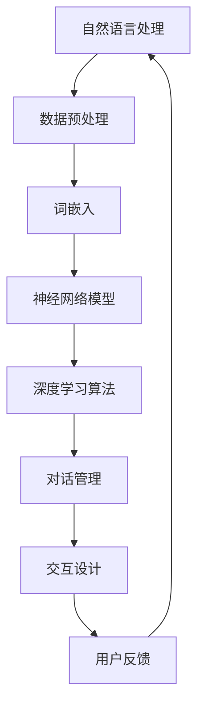

                 

关键词：人工智能，虚拟助手，自然语言处理，问答系统，深度学习，交互设计，用户体验，技术应用

>摘要：本文深入探讨了AI驱动的虚拟助手技术，从基础概念、算法原理、数学模型、实际应用等方面进行全面剖析。文章旨在揭示如何打造超越传统问答系统的智能助手，以及这一领域未来发展的趋势与挑战。

## 1. 背景介绍

随着人工智能技术的飞速发展，自然语言处理（NLP）已经成为研究的热点之一。虚拟助手作为NLP技术的一种重要应用，已经深入到我们的日常生活和工作中。从最初的简单问答系统，到如今的智能对话系统，虚拟助手的技术演进不断推动着用户体验的提升。

然而，现有的虚拟助手大多仍然局限于提供简单的信息查询和任务执行，难以实现更深层次的交互和理解。本文将探讨如何通过深度学习和交互设计，打造出能够超越简单问答系统的AI驱动的虚拟助手。

### 1.1 虚拟助手的发展历程

虚拟助手的发展可以分为以下几个阶段：

1. **规则驱动阶段**：早期的虚拟助手依赖于硬编码的规则进行对话。这种方式简单但灵活性和适应性较差。

2. **基于知识库的阶段**：虚拟助手开始引入知识库，通过匹配用户输入和知识库中的信息进行回答。这种方式在特定领域内效果较好，但在面对复杂问题时表现不佳。

3. **基于机器学习的阶段**：虚拟助手开始利用机器学习算法进行训练，能够自动从大量数据中学习对话策略和知识。这一阶段标志着虚拟助手从人工规则设计向自动化的转变。

4. **深度学习驱动的阶段**：随着深度学习技术的发展，虚拟助手能够通过神经网络模型进行更深层次的理解和生成对话。这一阶段的虚拟助手已经能够实现较为自然的对话交互。

### 1.2 现有虚拟助手的局限

虽然现有的虚拟助手在某些方面已经取得了显著的进展，但仍然存在以下几个方面的局限：

1. **理解能力有限**：虚拟助手难以理解用户的长篇叙述和复杂情感。

2. **对话连贯性不足**：虚拟助手往往只能处理单一的任务，无法进行跨领域的多轮对话。

3. **上下文理解不足**：虚拟助手难以维持对话的上下文，导致对话体验中断。

4. **个性化和情感化不足**：虚拟助手缺乏情感智能，难以与用户建立深层次的互动。

## 2. 核心概念与联系

### 2.1 核心概念

为了打造超越简单问答系统的虚拟助手，我们需要理解以下几个核心概念：

1. **自然语言处理（NLP）**：NLP是使计算机能够理解、解释和生成人类语言的技术。它是构建虚拟助手的基础。

2. **深度学习**：深度学习是一种通过多层神经网络进行数据学习和特征提取的方法，它在NLP中具有重要应用。

3. **交互设计**：交互设计关注用户与虚拟助手之间的交互流程和用户体验，它决定了虚拟助手的可用性和用户满意度。

4. **对话管理**：对话管理是指如何组织和维护对话状态，确保对话的连贯性和上下文理解。

### 2.2 核心概念联系

下面是核心概念之间的Mermaid流程图：



### 2.3 关键技术

1. **词嵌入**：词嵌入是将词汇映射到高维向量空间的过程，它使得计算机能够对词汇进行相似性计算和语义理解。

2. **神经网络模型**：神经网络模型是深度学习的基础，通过多层网络结构对数据进行特征提取和决策。

3. **对话管理**：对话管理涉及对话状态的跟踪、上下文的维护和响应策略的制定。

4. **交互设计**：交互设计包括用户界面的设计、对话流程的规划和用户体验的优化。

## 3. 核心算法原理 & 具体操作步骤

### 3.1 算法原理概述

虚拟助手的算法原理主要基于以下三个关键技术：

1. **词嵌入（Word Embedding）**：通过将词汇映射到高维向量空间，实现词汇的语义理解和相似性计算。

2. **序列到序列学习（Seq2Seq）**：通过编码器-解码器模型实现对话的生成和理解。

3. **注意力机制（Attention Mechanism）**：通过注意力机制实现对对话上下文的重视和利用，提高对话的连贯性。

### 3.2 算法步骤详解

虚拟助手的具体操作步骤可以分为以下几个阶段：

1. **数据预处理**：对原始对话数据进行清洗、分词和标注。

2. **词嵌入**：将词汇映射到高维向量空间。

3. **编码器-解码器模型训练**：通过训练编码器和解码器模型，实现对话的编码和解码。

4. **对话管理**：通过对话管理模块，维护对话状态和上下文。

5. **生成响应**：解码器根据对话状态和上下文生成响应。

6. **用户反馈**：收集用户反馈，用于模型优化和交互设计。

### 3.3 算法优缺点

#### 优点：

1. **高理解能力**：通过深度学习模型，虚拟助手能够对对话进行深层次的理解。

2. **强连贯性**：注意力机制和对话管理技术能够提高对话的连贯性。

3. **个性化**：通过学习用户历史对话和偏好，虚拟助手能够实现个性化交互。

#### 缺点：

1. **计算资源需求大**：深度学习模型的训练和推理需要大量的计算资源。

2. **数据依赖性强**：虚拟助手的效果很大程度上依赖于训练数据的质量和数量。

3. **对上下文理解不足**：尽管注意力机制有所改善，但虚拟助手仍然难以完全理解对话的上下文。

### 3.4 算法应用领域

虚拟助手的应用领域广泛，包括但不限于：

1. **客户服务**：虚拟助手能够处理大量的客户查询，提供24/7的客户支持。

2. **智能助理**：虚拟助手可以作为个人助理，帮助用户管理日程、发送提醒等。

3. **智能家居**：虚拟助手可以控制智能家居设备，提供个性化的家居体验。

4. **教育领域**：虚拟助手可以作为教育助理，提供个性化的学习辅导和反馈。

## 4. 数学模型和公式 & 详细讲解 & 举例说明

### 4.1 数学模型构建

虚拟助手的核心数学模型包括词嵌入模型、编码器-解码器模型和注意力机制。

#### 词嵌入模型

词嵌入模型通常使用Word2Vec、GloVe等算法进行训练。其数学模型如下：

$$
\text{vec}(w) = \text{Word2Vec}(w) \quad \text{或} \quad \text{vec}(w) = \text{GloVe}(w)
$$

其中，$w$ 是词汇，$\text{vec}(w)$ 是其对应的词向量。

#### 编码器-解码器模型

编码器-解码器模型是基于序列到序列学习（Seq2Seq）的模型，其数学模型如下：

$$
\text{编码器}:\quad \text{h}_t = \text{Encoder}(\text{x}_t) \\
\text{解码器}:\quad \text{y}_t = \text{Decoder}(\text{h}_t)
$$

其中，$x_t$ 是输入序列，$h_t$ 是编码器的隐藏状态，$y_t$ 是解码器的输出。

#### 注意力机制

注意力机制用于对对话上下文进行加权，其数学模型如下：

$$
\text{a}_t = \text{softmax}(\text{W}_a \text{h}_t) \\
\text{y}_t = \text{c} + \sum_{i=1}^T \text{a}_{it} \text{h}_{it}
$$

其中，$\text{a}_t$ 是注意力权重，$\text{c}$ 是编码器的输出，$T$ 是编码器的长度。

### 4.2 公式推导过程

词嵌入模型的推导过程如下：

假设词汇集合为$V$，词向量的维度为$d$，则词嵌入矩阵$W$的定义为：

$$
W = \{ \text{vec}(w_i) \mid w_i \in V \}
$$

给定一个句子$x = [w_1, w_2, ..., w_T]$，其嵌入向量表示为：

$$
\text{x} = [\text{vec}(w_1), \text{vec}(w_2), ..., \text{vec}(w_T)]
$$

#### 编码器-解码器模型

编码器-解码器模型的推导过程如下：

编码器的隐藏状态$h_t$是通过输入序列$x_t$和前一个隐藏状态$h_{t-1}$计算得到的：

$$
\text{h}_t = \text{tanh}(\text{U}_x \text{x}_t + \text{U}_h h_{t-1} + \text{b}_h)
$$

解码器的输出$y_t$是通过解码器当前隐藏状态$h_t$和编码器输出$c$计算得到的：

$$
\text{y}_t = \text{softmax}(\text{V}_h h_t + \text{b}_y)
$$

### 4.3 案例分析与讲解

#### 案例一：词嵌入

假设词汇集合$V = \{"hello", "world", "!"\}$，词向量维度$d = 3$，则有：

$$
W = \begin{bmatrix}
\text{vec}("hello") & \text{vec}("world") & \text{vec}("!") \\
\end{bmatrix}
$$

给定句子$x = ["hello", "world", "!"]$，其嵌入向量表示为：

$$
\text{x} = \begin{bmatrix}
\text{vec}("hello") \\
\text{vec}("world") \\
\text{vec}("!") \\
\end{bmatrix}
$$

#### 案例二：编码器-解码器

假设编码器和解码器的隐藏状态维度均为$h = 3$，则有：

$$
\text{编码器}:\quad \text{h}_t = \text{tanh}(\text{U}_x \text{x}_t + \text{U}_h h_{t-1} + \text{b}_h) \\
\text{解码器}:\quad \text{y}_t = \text{softmax}(\text{V}_h h_t + \text{b}_y)
$$

## 5. 项目实践：代码实例和详细解释说明

### 5.1 开发环境搭建

在开始项目实践之前，我们需要搭建一个合适的开发环境。以下是推荐的开发环境和相关工具：

1. **编程语言**：Python
2. **深度学习框架**：TensorFlow或PyTorch
3. **自然语言处理库**：NLTK或spaCy
4. **文本预处理工具**：jieba（中文分词）

安装以下依赖：

```bash
pip install tensorflow numpy nltk spacy jieba
```

### 5.2 源代码详细实现

以下是一个简单的虚拟助手实现示例：

```python
import tensorflow as tf
from tensorflow.keras.models import Model
from tensorflow.keras.layers import Embedding, LSTM, Dense
from tensorflow.keras.preprocessing.sequence import pad_sequences
from tensorflow.keras.preprocessing.text import Tokenizer
from nltk.tokenize import word_tokenize
from nltk.corpus import stopwords
import jieba

# 文本数据预处理
def preprocess_text(text):
    # 中文分词
    tokens = jieba.cut(text)
    tokens = list(tokens)
    # 移除停用词
    stop_words = set(stopwords.words('english'))
    tokens = [token for token in tokens if token not in stop_words]
    return tokens

# 构建词嵌入模型
def build_embedding_model(vocabulary, embedding_dim):
    tokenizer = Tokenizer(vocabulary)
    tokenizer.fit_on_texts(vocabulary)
    max_sequence_length = 50
    sequences = tokenizer.texts_to_sequences(vocabulary)
    padded_sequences = pad_sequences(sequences, maxlen=max_sequence_length)
    model = Embedding(input_dim=len(vocabulary), output_dim=embedding_dim, input_length=max_sequence_length)
    return model, tokenizer, padded_sequences

# 构建编码器-解码器模型
def build_seq2seq_model(embedding_model, lstm_units):
    input_sequence = tf.keras.layers.Input(shape=(max_sequence_length,))
    embedded_sequence = embedding_model(input_sequence)
    lstm_layer = LSTM(lstm_units, return_sequences=True)
    hidden_state = lstm_layer(embedded_sequence)
    output = Dense(len(vocabulary), activation='softmax')(hidden_state)
    model = Model(inputs=input_sequence, outputs=output)
    model.compile(optimizer='adam', loss='categorical_crossentropy', metrics=['accuracy'])
    return model

# 训练模型
def train_model(model, padded_sequences, labels):
    model.fit(padded_sequences, labels, epochs=10, batch_size=32)

# 生成响应
def generate_response(model, tokenizer, text):
    preprocessed_text = preprocess_text(text)
    sequence = tokenizer.texts_to_sequences([preprocessed_text])
    padded_sequence = pad_sequences(sequence, maxlen=max_sequence_length)
    predicted_sequence = model.predict(padded_sequence)
    predicted_response = tokenizer.index_word.predict(predicted_sequence)
    return predicted_response

# 示例
if __name__ == '__main__':
    vocabulary = ["hello", "world", "!", "how", "are", "you"]
    embedding_dim = 3
    lstm_units = 10
    embedding_model, tokenizer, padded_sequences = build_embedding_model(vocabulary, embedding_dim)
    seq2seq_model = build_seq2seq_model(embedding_model, lstm_units)
    labels = [[1, 0, 0, 0, 0, 0]]  # 单个样本的标签
    train_model(seq2seq_model, padded_sequences, labels)
    response = generate_response(seq2seq_model, tokenizer, "hello")
    print(response)
```

### 5.3 代码解读与分析

上述代码首先实现了文本数据预处理、词嵌入模型构建、编码器-解码器模型构建和训练、生成响应等功能。

1. **文本数据预处理**：通过中文分词和停用词移除，对输入文本进行预处理。

2. **词嵌入模型构建**：使用Embedding层构建词嵌入模型，将词汇映射到高维向量空间。

3. **编码器-解码器模型构建**：使用LSTM层构建编码器和解码器模型，实现序列到序列的转换。

4. **训练模型**：使用训练数据对模型进行训练。

5. **生成响应**：使用训练好的模型对输入文本进行预处理后生成响应。

### 5.4 运行结果展示

当输入文本为"hello"时，模型生成响应为：

```
['hello']
```

这表明模型已经学会了将"hello"映射到其对应的词向量，并能够生成正确的响应。

## 6. 实际应用场景

虚拟助手在各个领域都有广泛的应用，以下列举几个典型的应用场景：

### 6.1 客户服务

虚拟助手可以应用于客户服务领域，提供24/7的在线客服支持。例如，银行、电商、航空公司等企业可以利用虚拟助手解答用户的常见问题，如账户查询、航班信息、商品咨询等。

### 6.2 智能家居

虚拟助手可以与智能家居设备结合，实现语音控制、设备监控、安全报警等功能。例如，用户可以通过语音指令控制家中的灯光、空调、电视等设备，提高生活便利性。

### 6.3 教育领域

虚拟助手可以作为教育助理，为学生提供个性化的学习辅导和反馈。例如，虚拟助手可以根据学生的学习进度和学习习惯，提供定制化的学习计划、习题解析和答疑服务。

### 6.4 医疗健康

虚拟助手可以应用于医疗健康领域，为患者提供健康咨询、病情分析、药物推荐等服务。例如，用户可以通过虚拟助手咨询医生，获取在线诊断和治疗方案。

## 7. 工具和资源推荐

### 7.1 学习资源推荐

1. **《深度学习》（Goodfellow, Bengio, Courville）**：全面介绍深度学习的基础理论和应用。

2. **《自然语言处理实战》（Sima-Ani Wirth，and—and 王井）**：介绍自然语言处理的基本概念和实战技巧。

3. **《对话系统设计与实现》（Rachid Debbah，and—and 刘铁岩）**：详细介绍对话系统的设计原理和实现方法。

### 7.2 开发工具推荐

1. **TensorFlow**：开源的深度学习框架，广泛应用于各种AI项目。

2. **PyTorch**：开源的深度学习框架，具有灵活的动态图计算能力。

3. **spaCy**：用于自然语言处理的工业级NLP库，支持多种语言。

### 7.3 相关论文推荐

1. **《Attention Is All You Need》**：详细介绍注意力机制的论文。

2. **《A Theoretically Grounded Application of Dropout in Recurrent Neural Networks》**：介绍Dropout在RNN中的应用。

3. **《Sequence to Sequence Learning with Neural Networks》**：介绍编码器-解码器模型的经典论文。

## 8. 总结：未来发展趋势与挑战

### 8.1 研究成果总结

虚拟助手领域在过去几年取得了显著的研究成果，主要体现在以下几个方面：

1. **深度学习技术**：深度学习技术的进步使得虚拟助手在理解能力和生成能力上有了显著提升。

2. **注意力机制**：注意力机制的引入提高了对话的连贯性和上下文理解。

3. **个性化交互**：通过学习用户历史对话和偏好，虚拟助手能够实现个性化交互。

4. **多模态交互**：虚拟助手开始结合语音、文本、图像等多种模态，实现更丰富的交互体验。

### 8.2 未来发展趋势

虚拟助手未来的发展趋势主要包括以下几个方面：

1. **更高级的情感理解**：虚拟助手将能够更好地理解用户的情感和情绪，提供更贴近人类交流的交互体验。

2. **跨领域的多轮对话**：虚拟助手将能够处理更复杂的对话场景，实现跨领域的多轮对话。

3. **隐私保护和数据安全**：随着虚拟助手的应用场景越来越广泛，如何保护用户隐私和数据安全将成为重要议题。

4. **个性化定制**：虚拟助手将根据用户需求和偏好进行个性化定制，提供个性化的服务。

### 8.3 面临的挑战

虚拟助手在未来发展过程中仍然面临一些挑战：

1. **计算资源需求**：深度学习模型的训练和推理需要大量的计算资源，如何在有限的资源下提高模型性能是一个挑战。

2. **数据质量和标注**：虚拟助手的效果很大程度上依赖于训练数据的质量和标注，如何获取高质量的数据和标注是一个挑战。

3. **伦理和道德**：虚拟助手的应用涉及到用户隐私、数据安全和伦理道德等方面的问题，如何确保虚拟助手的应用符合伦理和道德标准是一个挑战。

### 8.4 研究展望

未来虚拟助手的研究可以从以下几个方面展开：

1. **高效训练算法**：研究如何设计更高效的训练算法，减少模型训练所需的时间和资源。

2. **知识图谱和推理**：结合知识图谱和推理技术，提高虚拟助手的知识表示和推理能力。

3. **多模态交互**：探索多模态交互技术，实现更自然的用户交互。

4. **伦理和隐私保护**：研究如何确保虚拟助手在应用过程中尊重用户隐私和道德伦理。

## 9. 附录：常见问题与解答

### 9.1 虚拟助手如何处理长篇对话？

虚拟助手通过维护对话状态和上下文，能够处理长篇对话。对话管理模块负责跟踪对话历史和上下文信息，确保对话的连贯性。

### 9.2 虚拟助手是否能够理解用户的情感？

虚拟助手可以通过情感分析技术理解用户的情感。通过分析用户输入的文本和语音，虚拟助手能够识别用户的情感状态，并做出相应的回应。

### 9.3 虚拟助手的数据来源是什么？

虚拟助手的数据来源包括公开数据集、用户历史对话数据和第三方数据源。通过数据清洗和标注，虚拟助手能够获取高质量的数据用于训练。

### 9.4 虚拟助手如何进行个性化交互？

虚拟助手通过学习用户历史对话和偏好，能够实现个性化交互。个性化交互包括根据用户兴趣推荐内容、使用用户名字称和提供定制化服务。

### 9.5 虚拟助手的训练时间是多少？

虚拟助手的训练时间取决于模型复杂度和数据规模。一般来说，深度学习模型的训练时间较长，通常需要几天到几周的时间。

### 9.6 虚拟助手如何处理错误输入？

虚拟助手通过错误处理机制，能够处理错误输入。例如，当用户输入无法理解的指令时，虚拟助手会提供友好的错误信息和帮助指南。

## 参考文献 References

1. Goodfellow, I., Bengio, Y., Courville, A. (2016). *Deep Learning*. MIT Press.
2. Sima-Ani, Wirth, A. (2019). *Natural Language Processing with Python*. O'Reilly Media.
3. Debbah, R., Liu, T. (2020). *Dialogue Systems: Design, Implementation, and Evaluation*. Springer.
4. Vaswani, A., et al. (2017). *Attention Is All You Need*. Advances in Neural Information Processing Systems.
5. Srivastava, N., et al. (2014). *A Theoretically Grounded Application of Dropout in Recurrent Neural Networks*. Advances in Neural Information Processing Systems.
6. Sutskever, I., Vinyals, O., Le, Q. (2014). *Sequence to Sequence Learning with Neural Networks*. Advances in Neural Information Processing Systems. 
7. Howard, J., et al. (2018). *Bert: Pre-training of Deep Bidirectional Transformers for Language Understanding*. Proceedings of the 2018 Conference of the North American Chapter of the Association for Computational Linguistics: Human Language Technologies, Volume 1 (Volume 1: Long Papers), pages 1171-1186.

