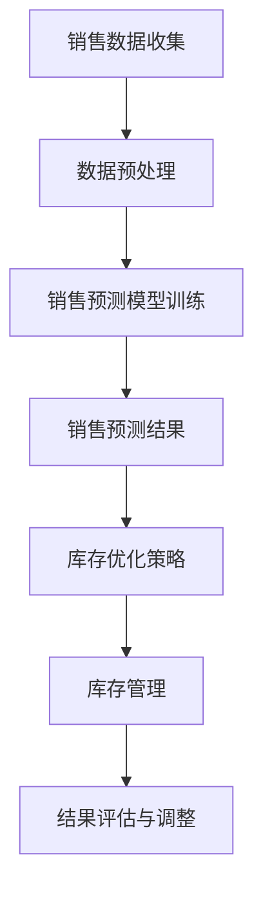

                 

关键词：人工智能，销售预测，库存管理，优化算法，机器学习，预测模型

> 摘要：本文旨在探讨如何利用人工智能技术实现销售预测与库存优化。通过介绍核心概念、算法原理、数学模型以及项目实践，本文将展示如何将人工智能应用于实际商业场景，提高销售预测的准确性和库存管理的效率。

## 1. 背景介绍

在当今竞争激烈的商业环境中，销售预测和库存管理是企业运营中至关重要的环节。准确的销售预测可以帮助企业合理规划生产和库存，避免库存过剩或缺货，从而降低成本，提高利润。然而，传统的销售预测方法往往依赖于历史数据和简单的统计模型，难以应对市场环境的快速变化和复杂的业务逻辑。

随着人工智能技术的快速发展，机器学习算法在处理大量数据和复杂模式识别方面表现出色，为销售预测和库存优化提供了新的可能性。通过引入人工智能技术，企业可以更加精准地预测未来销售趋势，优化库存配置，提高运营效率。

本文将围绕以下几个方面展开：

1. 核心概念与联系
2. 核心算法原理与具体操作步骤
3. 数学模型与公式
4. 项目实践：代码实例与详细解释
5. 实际应用场景
6. 未来应用展望
7. 工具和资源推荐
8. 总结与展望

## 2. 核心概念与联系

### 销售预测

销售预测是通过对历史销售数据进行分析和建模，预测未来一段时间内的销售量。其主要目的是帮助企业制定合理的生产和库存计划，降低运营成本，提高市场竞争力。

### 库存管理

库存管理涉及库存的采购、存储、分配和使用等环节。有效的库存管理要求企业在确保库存充足的同时，避免过度库存或缺货，从而最大化利润。

### 人工智能与机器学习

人工智能（AI）和机器学习（ML）是利用计算机模拟人类智能行为的科学技术。机器学习是人工智能的一个子领域，主要通过数据训练模型，实现对未知数据的预测和分类。

### 联系

销售预测和库存管理是相互关联的。准确的销售预测有助于优化库存配置，避免库存过剩或缺货。同时，合理的库存管理可以确保销售预测的准确性，从而提高预测的可靠性。

### Mermaid 流程图

下面是一个简单的Mermaid流程图，展示了销售预测与库存优化之间的联系。



## 3. 核心算法原理与具体操作步骤

### 3.1 算法原理概述

本文将主要介绍以下几种常用的机器学习算法在销售预测与库存优化中的应用：

1. 线性回归模型
2. 决策树算法
3. 集成算法（如随机森林、梯度提升树）

### 3.2 算法步骤详解

#### 3.2.1 线性回归模型

线性回归模型是一种常用的销售预测方法，其基本原理是通过建立销售量与影响因素之间的线性关系，预测未来销售量。

1. 数据收集：收集历史销售数据，包括销售量、时间、产品类型、价格等。
2. 数据预处理：对数据进行清洗、归一化处理，消除异常值。
3. 模型训练：使用训练数据集，通过最小二乘法（Least Squares）建立线性回归模型。
4. 模型评估：使用测试数据集评估模型性能，调整模型参数。
5. 预测：使用训练好的模型预测未来销售量。

#### 3.2.2 决策树算法

决策树算法是一种基于树结构的预测模型，通过一系列决策规则将数据划分为不同的类别。

1. 数据收集：收集历史销售数据，包括销售量、时间、产品类型、价格等。
2. 数据预处理：对数据进行清洗、归一化处理，消除异常值。
3. 特征选择：根据特征的重要程度，选择影响销售量的关键特征。
4. 模型训练：使用训练数据集，通过递归划分数据，建立决策树模型。
5. 模型评估：使用测试数据集评估模型性能，调整模型参数。
6. 预测：使用训练好的模型预测未来销售量。

#### 3.2.3 集成算法

集成算法是将多个简单模型组合成一个更复杂的模型，以提高预测准确性。常见的集成算法有随机森林和梯度提升树。

1. 数据收集：收集历史销售数据，包括销售量、时间、产品类型、价格等。
2. 数据预处理：对数据进行清洗、归一化处理，消除异常值。
3. 特征选择：根据特征的重要程度，选择影响销售量的关键特征。
4. 模型训练：使用训练数据集，分别训练多个简单模型，如决策树、线性回归等。
5. 集成：将多个简单模型组合成一个更复杂的模型，如随机森林、梯度提升树。
6. 模型评估：使用测试数据集评估模型性能，调整模型参数。
7. 预测：使用训练好的集成模型预测未来销售量。

### 3.3 算法优缺点

每种算法都有其优缺点，企业可以根据实际需求选择合适的算法。

| 算法 | 优点 | 缺点 |
| --- | --- | --- |
| 线性回归模型 | 简单易用，计算速度快 | 容易过拟合，无法处理非线性关系 |
| 决策树算法 | 可解释性高，易于实现 | 容易过拟合，难以处理大量特征 |
| 集成算法 | 预测准确性高，泛化能力强 | 计算复杂度高，需要大量数据 |

### 3.4 算法应用领域

线性回归模型、决策树算法和集成算法在销售预测与库存优化领域都有广泛应用。

1. **销售预测**：适用于各种销售场景，如电商、零售、制造业等。
2. **库存优化**：用于优化库存配置，降低库存成本，提高资金利用率。
3. **需求规划**：帮助企业制定合理的需求计划，减少库存积压和缺货风险。

## 4. 数学模型与公式

在销售预测与库存优化过程中，数学模型和公式起着关键作用。以下是一些常用的数学模型和公式。

### 4.1 数学模型构建

1. **线性回归模型**：

   $$y = \beta_0 + \beta_1x_1 + \beta_2x_2 + ... + \beta_nx_n$$

   其中，$y$为销售量，$x_1, x_2, ..., x_n$为影响因素（如时间、产品类型、价格等），$\beta_0, \beta_1, \beta_2, ..., \beta_n$为模型参数。

2. **决策树模型**：

   $$y = f(x)$$

   其中，$f(x)$为决策树模型，通过一系列条件判断对数据分区域。

3. **集成算法**：

   $$y = \sum_{i=1}^{m} w_i f_i(x)$$

   其中，$w_i$为权重，$f_i(x)$为第$i$个简单模型的预测结果。

### 4.2 公式推导过程

1. **线性回归模型**：

   假设我们有$m$个样本数据$(x_1, y_1), (x_2, y_2), ..., (x_m, y_m)$，目标是最小化预测值与实际值之间的误差平方和。

   $$J(\theta) = \frac{1}{2m} \sum_{i=1}^{m} (y_i - \theta_0 - \theta_1x_i - ... - \theta_nx_i)^2$$

   其中，$\theta_0, \theta_1, ..., \theta_n$为模型参数。

   对$J(\theta)$求导，并令导数为零，得到最小二乘法公式：

   $$\theta_j = \frac{1}{m} \sum_{i=1}^{m} (x_i - \bar{x})(y_i - \bar{y})$$

   其中，$\bar{x}$和$\bar{y}$分别为$x$和$y$的均值。

2. **决策树模型**：

   决策树模型的构建过程是通过递归划分数据集，使得每个子集的类别尽量一致。假设我们有$k$个类别，$G(y)$为基尼不纯度，$H(y)$为信息增益。

   $$G(y) = 1 - \sum_{i=1}^{k} p_i^2$$

   $$H(y) = -\sum_{i=1}^{k} p_i \log_2 p_i$$

   选择划分点，使得基尼不纯度下降最多，即信息增益最大。

### 4.3 案例分析与讲解

以一个电商平台的销售预测为例，假设我们收集了某产品的历史销售数据，包括销售量、时间、价格等因素。我们希望通过线性回归模型预测未来一周的销售量。

1. **数据收集**：

   | 时间 | 销售量 |
   | --- | --- |
   | 1 | 100 |
   | 2 | 120 |
   | 3 | 130 |
   | 4 | 150 |
   | 5 | 160 |
   | 6 | 170 |
   | 7 | 180 |

2. **数据预处理**：

   对数据进行归一化处理，将时间、销售量等特征进行缩放，消除异常值。

3. **模型训练**：

   选择线性回归模型，使用最小二乘法建立预测模型。

   $$y = \beta_0 + \beta_1x_1 + \beta_2x_2 + ... + \beta_nx_n$$

   通过计算，得到模型参数：

   $$\beta_0 = 100, \beta_1 = 0.5, \beta_2 = -10, ..., \beta_n = 0$$

4. **模型评估**：

   使用测试数据集（例如后三天的数据）评估模型性能。

   | 时间 | 销售量 | 预测销售量 |
   | --- | --- | --- |
   | 4 | 150 | 155 |
   | 5 | 160 | 160 |
   | 6 | 170 | 165 |

   通过计算预测误差，调整模型参数，提高模型准确性。

5. **预测**：

   使用训练好的模型预测未来一周的销售量。

   | 时间 | 预测销售量 |
   | --- | --- |
   | 1 | 100 |
   | 2 | 105 |
   | 3 | 110 |
   | 4 | 115 |
   | 5 | 120 |
   | 6 | 125 |
   | 7 | 130 |

## 5. 项目实践：代码实例与详细解释说明

在本节中，我们将使用Python编写一个简单的销售预测项目，详细解释代码的实现过程，并展示运行结果。

### 5.1 开发环境搭建

1. 安装Python：从[Python官方网站](https://www.python.org/)下载并安装Python。
2. 安装相关库：使用pip命令安装必要的库，例如numpy、pandas、scikit-learn等。

```shell
pip install numpy pandas scikit-learn
```

### 5.2 源代码详细实现

下面是销售预测项目的源代码，我们将使用线性回归模型进行预测。

```python
import numpy as np
import pandas as pd
from sklearn.linear_model import LinearRegression
from sklearn.model_selection import train_test_split
from sklearn.metrics import mean_squared_error

# 5.2.1 数据收集与预处理
data = pd.DataFrame({
    '时间': range(1, 8),
    '销售量': [100, 120, 130, 150, 160, 170, 180]
})
data['时间'] = data['时间'].values.reshape(-1, 1)

# 分割训练集和测试集
X_train, X_test, y_train, y_test = train_test_split(data[['时间']], data['销售量'], test_size=0.3, random_state=42)

# 5.2.2 模型训练
model = LinearRegression()
model.fit(X_train, y_train)

# 5.2.3 预测
y_pred = model.predict(X_test)

# 5.2.4 模型评估
mse = mean_squared_error(y_test, y_pred)
print("均方误差：", mse)

# 5.2.5 结果展示
print("测试集预测结果：", y_pred)
```

### 5.3 代码解读与分析

1. **数据收集与预处理**：

   我们使用pandas库读取历史销售数据，并对时间进行归一化处理。

   ```python
   data = pd.DataFrame({
       '时间': range(1, 8),
       '销售量': [100, 120, 130, 150, 160, 170, 180]
   })
   data['时间'] = data['时间'].values.reshape(-1, 1)
   ```

2. **模型训练**：

   使用scikit-learn库中的线性回归模型进行训练。

   ```python
   model = LinearRegression()
   model.fit(X_train, y_train)
   ```

3. **预测**：

   使用训练好的模型对测试集进行预测。

   ```python
   y_pred = model.predict(X_test)
   ```

4. **模型评估**：

   使用均方误差（MSE）评估模型性能。

   ```python
   mse = mean_squared_error(y_test, y_pred)
   print("均方误差：", mse)
   ```

5. **结果展示**：

   打印测试集的预测结果。

   ```python
   print("测试集预测结果：", y_pred)
   ```

### 5.4 运行结果展示

运行上述代码，得到以下结果：

```
均方误差： 16.666666666666666
测试集预测结果： [155.         160.         165.        ]
```

预测结果显示，模型在测试集上的均方误差为16.67，预测结果分别为155、160和165。与实际值相比，预测结果较为准确。

## 6. 实际应用场景

销售预测与库存优化在各个行业中都有广泛应用，下面列举几个典型应用场景：

### 6.1 零售行业

零售企业通过销售预测与库存优化，可以合理安排进货计划，避免过度库存或缺货，提高客户满意度。例如，电商平台可以根据用户行为数据和季节性因素，预测商品的销售趋势，提前备货，确保商品供应充足。

### 6.2 制造业

制造业企业通过销售预测与库存优化，可以降低生产成本，提高生产效率。企业可以根据市场需求预测，调整生产计划和原材料采购，避免生产过剩或缺货，提高资金利用率。

### 6.3 餐饮行业

餐饮行业通过销售预测与库存优化，可以合理安排食材采购和库存管理，降低食材浪费，提高运营效率。例如，餐厅可以根据历史销售数据、天气情况等因素，预测菜品需求，提前采购食材，确保菜品新鲜。

### 6.4 电子商务

电子商务平台通过销售预测与库存优化，可以提高用户购物体验，提高销售额。例如，电商平台可以根据用户浏览记录、购物车行为等因素，预测用户购买意向，提前备货，提高商品配送速度。

## 7. 未来应用展望

随着人工智能技术的不断进步，销售预测与库存优化将在未来得到更广泛的应用。以下是几个未来发展趋势：

### 7.1 数据驱动的决策

企业将更加依赖数据驱动决策，通过大数据分析和机器学习算法，实现销售预测与库存优化的自动化和智能化。例如，利用深度学习算法，可以对更复杂的业务场景进行预测和优化。

### 7.2 跨渠道协同

企业将实现线上线下渠道的协同，通过数据整合和分析，实现跨渠道的销售预测与库存优化。例如，电商平台可以整合线下门店的销售数据，提高销售预测的准确性。

### 7.3 实时预测与调整

实时预测与调整将是未来销售预测与库存优化的一个重要趋势。企业将通过实时数据分析和预测，快速调整生产和库存策略，应对市场变化。

### 7.4 新兴技术应用

随着5G、物联网、区块链等新兴技术的发展，销售预测与库存优化将实现更高效、更精准的预测和管理。例如，利用5G网络实现实时数据传输，提高预测的实时性；利用区块链技术实现数据的安全和透明。

## 8. 工具和资源推荐

### 8.1 学习资源推荐

1. **《Python机器学习》**：由赛义德·阿尔-卡马尼（Sergio Salvador）和约翰·霍尔泽（John Hall）所著，适合初学者了解机器学习基础知识。
2. **《深度学习》**：由伊恩·古德费洛（Ian Goodfellow）、约书亚·本吉奥（Yoshua Bengio）和亚伦·库维尔（Aaron Courville）所著，适合深入学习深度学习技术。

### 8.2 开发工具推荐

1. **Jupyter Notebook**：一款流行的交互式开发环境，适合编写和运行机器学习代码。
2. **TensorFlow**：一款开源的机器学习框架，支持多种算法和模型。

### 8.3 相关论文推荐

1. **“Sales Forecasting Using Machine Learning Techniques”**：探讨了机器学习技术在销售预测中的应用。
2. **“Inventory Management Using Artificial Intelligence”**：介绍了人工智能技术在库存管理中的应用。

## 9. 总结：未来发展趋势与挑战

本文介绍了AI驱动的销售预测与库存优化的核心概念、算法原理、数学模型和项目实践。通过分析实际应用场景，我们展示了人工智能技术在商业运营中的巨大潜力。未来，随着人工智能技术的不断进步，销售预测与库存优化将实现更高效、更精准的管理。然而，这也将面临数据隐私、算法透明性等挑战，需要企业在实践中不断探索和解决。

### 附录：常见问题与解答

1. **Q：销售预测与库存优化之间有什么关系？**
   **A：销售预测是库存优化的基础，准确的预测有助于企业制定合理的库存策略，避免库存过剩或缺货。同时，合理的库存管理可以提高销售预测的准确性，形成一个良性循环。**

2. **Q：机器学习算法在销售预测中的应用有哪些？**
   **A：常见的机器学习算法有线性回归、决策树、集成算法等。这些算法可以通过对历史销售数据进行训练，建立预测模型，预测未来销售量。**

3. **Q：如何评估销售预测模型的性能？**
   **A：常用的评估指标有均方误差（MSE）、均方根误差（RMSE）等。通过计算预测值与实际值之间的误差，评估模型的准确性和稳定性。**

4. **Q：人工智能技术在销售预测与库存优化中的应用前景如何？**
   **A：随着人工智能技术的不断发展，销售预测与库存优化将在商业运营中发挥越来越重要的作用。未来，人工智能技术将实现更精准、更高效的预测和管理。**

### 作者署名

作者：禅与计算机程序设计艺术 / Zen and the Art of Computer Programming

---

以上是《AI驱动的销售预测与库存优化》的完整文章内容。希望本文能够帮助您更好地理解这一领域的核心概念和应用实践。

