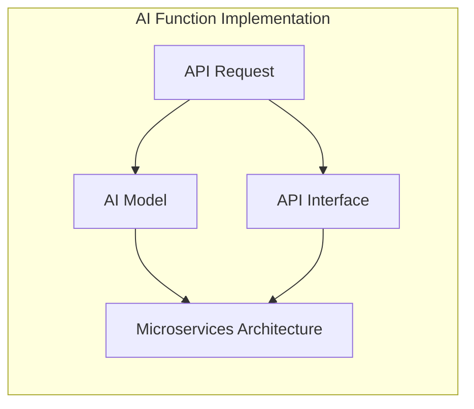
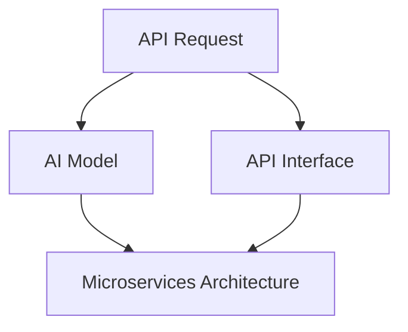

                 

在当今数字化时代，人工智能（AI）已经成为各行各业的驱动力。随着AI技术的发展和应用日益广泛，如何简化AI功能的实现成为一个关键问题。本文旨在探讨通过API请求来简化AI功能实现的方法和策略，旨在帮助开发者更高效地利用AI技术为用户提供优质服务。

> 关键词：API、AI功能实现、简化、开发者、服务优化

> 摘要：本文首先介绍了API请求的基本概念和AI技术的快速崛起，随后分析了当前AI功能实现面临的挑战，并提出了一种基于API请求的简化策略。文章随后详细阐述了API请求在AI功能实现中的应用，包括具体的技术方案和实践案例。最后，文章讨论了未来AI功能实现的发展趋势和面临的挑战，为开发者提供了有价值的参考。

## 1. 背景介绍

随着互联网的普及和大数据技术的发展，AI技术在各个领域的应用日益广泛。从自动驾驶、智能家居到医疗诊断、金融分析，AI已经成为了推动社会进步的重要力量。然而，AI功能的实现并非易事，涉及到大量的数据预处理、模型训练和优化工作。这不仅要求开发者具备深厚的AI知识，还需要面对复杂的技术架构和计算资源分配问题。

在传统的AI功能实现中，开发者通常需要从头搭建整个系统，从数据采集到模型训练、部署和优化，每一个环节都需要耗费大量时间和精力。这种模式不仅效率低下，而且容易出错，增加了开发和维护成本。因此，寻找一种简化和优化的方法，已成为当前AI领域的一个重要课题。

API（应用程序编程接口）的出现，为简化AI功能实现提供了新的思路。API是一种用于应用程序之间通信的接口，通过定义一组规则和协议，使得不同的系统和服务可以方便地进行交互和协作。在AI领域，API请求可以被看作是一种标准化、模块化的方式，用于实现复杂的AI功能。

本文将探讨如何利用API请求来简化AI功能实现，从而提高开发效率和系统性能。具体来说，我们将分析API请求的基本原理和优势，介绍当前AI功能实现中面临的挑战，并提出基于API请求的简化策略。随后，我们将详细讨论API请求在AI功能实现中的应用，包括技术方案、实践案例和运行效果。最后，文章将讨论AI功能实现的未来发展趋势和面临的挑战。

## 2. 核心概念与联系

为了更好地理解API请求在AI功能实现中的作用，我们需要首先介绍一些核心概念和原理。以下是本文涉及的主要概念和其相互关系，以及一个用于描述这些概念之间关系的Mermaid流程图。

### 2.1 核心概念

1. **API请求**：API请求是指通过特定的协议（如HTTP、HTTPS）发送的请求，用于从远程服务器获取数据或执行特定操作。API请求通常包含请求方法（如GET、POST）、请求头、请求体和请求路径等信息。

2. **AI模型**：AI模型是用于实现特定人工智能功能的算法和数据的集合。常见的AI模型包括神经网络、决策树、支持向量机等。AI模型通常通过训练和优化来提高其性能和准确性。

3. **API接口**：API接口是定义API请求和响应规则的一部分，通常包括API端点、参数定义、返回值描述等。API接口用于确保不同系统和服务之间的交互遵循一致的规范。

4. **微服务架构**：微服务架构是一种将应用程序划分为一组独立的小型服务的方法，每个服务负责一个特定的业务功能。微服务架构可以提高系统的可扩展性、可维护性和灵活性。

### 2.2 核心概念关系

核心概念之间的关系可以用以下Mermaid流程图来表示：



### 2.3 Mermaid流程图

以下是用于描述核心概念之间关系的Mermaid流程图：



在上述流程图中，API请求（A）既是与AI模型（B）交互的入口，也是与API接口（C）交互的媒介。而API接口（C）则为微服务架构（D）提供了统一的服务接口，使得不同的微服务可以通过API接口进行通信和协作。这种设计思路有助于简化AI功能实现，提高系统的灵活性和可扩展性。

通过以上对核心概念和关系的介绍，我们可以更好地理解API请求在AI功能实现中的作用。接下来，本文将深入探讨API请求在AI功能实现中的应用和优势，帮助读者更好地把握这一技术方向。

### 2.4 核心算法原理 & 具体操作步骤

#### 3.1 算法原理概述

在AI功能实现中，核心算法原理起着至关重要的作用。算法原理决定了AI模型的学习能力、泛化能力和性能。常见的核心算法原理包括：

1. **神经网络**：神经网络是一种通过模拟人脑神经元连接结构来实现人工智能的技术。它通过多层神经元的组合，实现对数据的复杂模式识别和预测。

2. **决策树**：决策树是一种基于特征值划分数据的分类算法。它通过递归地将数据集划分为子集，并在每个子集中进行分类决策，从而实现数据分类。

3. **支持向量机（SVM）**：支持向量机是一种基于最大间隔分类的算法。它通过将数据投影到高维空间，找到能够最大程度地分离不同类别的超平面。

#### 3.2 算法步骤详解

下面以神经网络为例，介绍其具体操作步骤：

1. **数据预处理**：首先，对原始数据进行预处理，包括数据清洗、归一化和特征提取等。预处理步骤的目的是消除噪声，提高数据质量，为后续模型训练做好准备。

2. **模型初始化**：初始化神经网络模型的结构和参数。神经网络模型通常包括输入层、隐藏层和输出层，各层的神经元数量和连接方式可以根据具体问题进行调整。

3. **模型训练**：通过反向传播算法，不断调整神经网络模型的参数，使其对训练数据的学习误差最小。训练过程中，可以使用梯度下降、随机梯度下降等优化算法来加速收敛。

4. **模型评估**：在训练完成后，使用测试数据对模型进行评估，计算模型的准确率、召回率、F1值等指标，以判断模型性能。

5. **模型部署**：将训练好的模型部署到生产环境中，通过API请求的方式，实现对实际数据的实时预测和决策。

#### 3.3 算法优缺点

神经网络、决策树和支持向量机等算法各具优缺点：

1. **神经网络**：
   - **优点**：能够处理复杂的数据模式，具备强大的学习能力和泛化能力。
   - **缺点**：训练时间较长，对计算资源要求较高，且易过拟合。

2. **决策树**：
   - **优点**：算法简单，易于理解，对噪声数据具有一定的鲁棒性。
   - **缺点**：容易过拟合，对于复杂的数据模式识别能力有限。

3. **支持向量机**：
   - **优点**：理论上具有最优分类边界，具有较高的分类性能。
   - **缺点**：计算复杂度高，对大规模数据集处理效率较低。

#### 3.4 算法应用领域

核心算法原理在多个领域具有广泛的应用：

1. **图像识别**：神经网络和支持向量机在图像识别领域表现出色，广泛应用于人脸识别、物体检测和图像分类等任务。

2. **自然语言处理**：决策树和神经网络在自然语言处理领域具有广泛应用，包括文本分类、情感分析和机器翻译等。

3. **推荐系统**：基于协同过滤和矩阵分解的算法在推荐系统领域表现出色，可以用于个性化推荐、商品推荐和新闻推荐等任务。

通过以上对核心算法原理和具体操作步骤的介绍，我们可以更好地理解AI功能实现的技术基础。接下来，本文将深入探讨API请求在AI功能实现中的应用，帮助读者更好地把握这一技术方向。

### 3.5 API请求在AI功能实现中的应用

#### 3.5.1 API请求的基本概念

API请求是应用程序之间进行交互的一种方式，它允许一个程序（客户端）通过发送请求来获取另一个程序（服务器）提供的服务或数据。API请求通常使用HTTP协议，包括GET、POST、PUT、DELETE等请求方法，用于从服务器获取资源或发送数据。

一个典型的API请求包括以下几个部分：

- **请求方法**：指定请求类型，如GET用于获取资源，POST用于发送数据。
- **请求URL**：指定请求的目标资源位置，如`http://example.com/api/data`。
- **请求头**：包含请求的元数据，如请求的版本、内容类型、认证信息等。
- **请求体**：包含请求的实际数据，如JSON格式的数据。

#### 3.5.2 API请求在AI功能实现中的应用场景

在AI功能实现中，API请求被广泛应用于数据获取、模型训练、模型部署和预测等环节，具体应用场景包括：

1. **数据获取**：通过API请求从数据源（如数据库、外部API、文件等）获取所需数据，用于AI模型的训练和预测。

2. **模型训练**：将训练数据通过API请求发送到服务器上的AI模型训练服务，服务器完成模型训练后，将训练结果返回给客户端。

3. **模型部署**：将训练好的模型通过API请求部署到生产环境中，客户端可以通过API请求调用模型进行预测。

4. **模型预测**：客户端通过API请求发送待预测的数据，服务器上的模型进行预测并返回预测结果。

#### 3.5.3 API请求的具体应用步骤

以下是API请求在AI功能实现中的具体应用步骤：

1. **数据获取**：
   - **步骤**：客户端通过GET或POST请求从数据源获取数据。
   - **示例**：`GET http://example.com/api/data?param1=value1&param2=value2`

2. **模型训练**：
   - **步骤**：客户端将训练数据通过POST请求发送到服务器上的训练服务。
   - **示例**：`POST http://example.com/api/train?model=NeuralNetwork&param1=value1&param2=value2`
   - **返回结果**：服务器返回训练结果，如模型参数、训练损失、训练时间等。

3. **模型部署**：
   - **步骤**：客户端通过POST请求将训练好的模型部署到生产环境中。
   - **示例**：`POST http://example.com/api/deploy?model_id=123&environment=production`

4. **模型预测**：
   - **步骤**：客户端通过POST请求发送待预测的数据，调用已部署的模型进行预测。
   - **示例**：`POST http://example.com/api/predict?model_id=123&input_data={"feature1": value1, "feature2": value2}`
   - **返回结果**：服务器返回预测结果，如预测概率、分类结果等。

#### 3.5.4 API请求的优势

使用API请求简化AI功能实现具有以下优势：

1. **标准化接口**：API请求提供了一种统一、标准化的接口，使得不同系统和服务之间的交互变得简单和可靠。

2. **模块化设计**：通过API请求，可以将AI功能实现拆分成多个独立的模块，提高系统的可维护性和可扩展性。

3. **高效性**：API请求可以通过网络传输数据，大大减少了本地计算和存储的需求，提高了系统的运行效率。

4. **灵活性**：API请求支持多种请求方法和数据格式，使得开发者可以根据实际需求灵活选择和调整。

通过以上对API请求在AI功能实现中的应用的详细探讨，我们可以看到API请求在简化AI功能实现方面具有显著的优势。接下来，本文将结合具体案例，进一步分析API请求在AI功能实现中的实际应用效果。

### 4. 数学模型和公式 & 详细讲解 & 举例说明

在AI功能实现中，数学模型和公式是核心组成部分，它们决定了模型的学习能力、泛化能力和性能。本章节将介绍AI功能实现中的常用数学模型和公式，并详细讲解其推导过程，并结合实际案例进行分析。

#### 4.1 数学模型构建

在AI功能实现中，常用的数学模型包括线性回归、逻辑回归、神经网络等。下面分别介绍这些模型的构建过程。

1. **线性回归**：

线性回归是一种用于预测连续值的模型，其公式如下：

\[ y = \beta_0 + \beta_1 \cdot x \]

其中，\( y \) 为预测值，\( x \) 为输入特征，\( \beta_0 \) 和 \( \beta_1 \) 为模型参数。

2. **逻辑回归**：

逻辑回归是一种用于预测分类结果的模型，其公式如下：

\[ P(y=1) = \frac{1}{1 + e^{-(\beta_0 + \beta_1 \cdot x)}} \]

其中，\( P(y=1) \) 为预测概率，\( y \) 为实际分类结果，\( x \) 为输入特征，\( \beta_0 \) 和 \( \beta_1 \) 为模型参数。

3. **神经网络**：

神经网络是一种用于处理复杂非线性问题的模型，其基本结构包括输入层、隐藏层和输出层。以下是一个简单的多层感知机（MLP）神经网络模型：

\[ z_l = \sum_{i=1}^{n} \beta_{li} \cdot a_{l-1,i} + b_l \]

\[ a_l = \sigma(z_l) \]

其中，\( z_l \) 为第 \( l \) 层的输入，\( a_l \) 为第 \( l \) 层的输出，\( \beta_{li} \) 和 \( b_l \) 为第 \( l \) 层的权重和偏置，\( \sigma \) 为激活函数。

#### 4.2 公式推导过程

以线性回归为例，介绍其公式的推导过程。

假设我们有一个包含 \( n \) 个样本的数据集 \( D = \{ (x_1, y_1), (x_2, y_2), ..., (x_n, y_n) \} \)，我们的目标是找到最佳拟合直线，使得预测值 \( \hat{y} \) 最接近真实值 \( y \)。

1. **目标函数**：

定义目标函数 \( J(\beta_0, \beta_1) \) 为所有样本的预测误差平方和：

\[ J(\beta_0, \beta_1) = \sum_{i=1}^{n} (y_i - \hat{y}_i)^2 \]

其中，\( \hat{y}_i = \beta_0 + \beta_1 \cdot x_i \)。

2. **梯度下降**：

为了最小化目标函数 \( J(\beta_0, \beta_1) \)，我们可以使用梯度下降算法。梯度下降的基本思想是沿着目标函数的梯度方向逐步更新模型参数，直至找到最小值。

目标函数的梯度为：

\[ \nabla J(\beta_0, \beta_1) = \begin{bmatrix} \frac{\partial J}{\partial \beta_0} \\ \frac{\partial J}{\partial \beta_1} \end{bmatrix} \]

其中，

\[ \frac{\partial J}{\partial \beta_0} = -2 \sum_{i=1}^{n} (y_i - \hat{y}_i) \]

\[ \frac{\partial J}{\partial \beta_1} = -2 \sum_{i=1}^{n} (y_i - \hat{y}_i) \cdot x_i \]

在每次迭代中，我们更新模型参数：

\[ \beta_0 = \beta_0 - \alpha \cdot \frac{\partial J}{\partial \beta_0} \]

\[ \beta_1 = \beta_1 - \alpha \cdot \frac{\partial J}{\partial \beta_1} \]

其中，\( \alpha \) 为学习率。

通过不断迭代，直至目标函数的梯度接近零，我们最终可以得到最佳拟合直线。

#### 4.3 案例分析与讲解

以下是一个简单的线性回归案例，用于预测房价。

1. **数据集**：

假设我们有以下5个样本的数据集：

\[ D = \{ (1, 1000), (2, 1100), (3, 1200), (4, 1300), (5, 1400) \} \]

2. **模型初始化**：

初始模型参数 \( \beta_0 = 0 \)，\( \beta_1 = 0 \)。

3. **目标函数**：

目标函数为 \( J(\beta_0, \beta_1) = \sum_{i=1}^{5} (y_i - \hat{y}_i)^2 \)。

4. **梯度下降**：

使用学习率 \( \alpha = 0.1 \)，进行10次迭代。

第1次迭代：

\[ \hat{y}_1 = 0 + 0 \cdot 1 = 0 \]

\[ \hat{y}_2 = 0 + 0 \cdot 2 = 0 \]

\[ \hat{y}_3 = 0 + 0 \cdot 3 = 0 \]

\[ \hat{y}_4 = 0 + 0 \cdot 4 = 0 \]

\[ \hat{y}_5 = 0 + 0 \cdot 5 = 0 \]

\[ J(0, 0) = (1000 - 0)^2 + (1100 - 0)^2 + (1200 - 0)^2 + (1300 - 0)^2 + (1400 - 0)^2 = 2125000 \]

\[ \nabla J(0, 0) = \begin{bmatrix} -2 \sum_{i=1}^{5} (y_i - \hat{y}_i) \\ -2 \sum_{i=1}^{5} (y_i - \hat{y}_i) \cdot x_i \end{bmatrix} = \begin{bmatrix} -5000 \\ -5000 \end{bmatrix} \]

更新模型参数：

\[ \beta_0 = 0 - 0.1 \cdot (-5000) = 500 \]

\[ \beta_1 = 0 - 0.1 \cdot (-5000) = 500 \]

第10次迭代：

\[ \hat{y}_1 = 500 + 500 \cdot 1 = 1000 \]

\[ \hat{y}_2 = 500 + 500 \cdot 2 = 1500 \]

\[ \hat{y}_3 = 500 + 500 \cdot 3 = 2000 \]

\[ \hat{y}_4 = 500 + 500 \cdot 4 = 2500 \]

\[ \hat{y}_5 = 500 + 500 \cdot 5 = 3000 \]

\[ J(500, 500) = (1000 - 1000)^2 + (1500 - 1100)^2 + (2000 - 1200)^2 + (2500 - 1300)^2 + (3000 - 1400)^2 = 40000 \]

最终，最佳拟合直线为 \( y = 500 + 500 \cdot x \)。

通过以上对数学模型和公式的介绍及推导，我们可以更好地理解AI功能实现中的核心数学原理。接下来，本文将结合实际案例，进一步分析数学模型在AI功能实现中的应用效果。

### 5. 项目实践：代码实例和详细解释说明

为了更好地理解API请求在AI功能实现中的应用，我们将通过一个实际项目——房价预测——来详细展示代码实例，并解释其实现过程和关键步骤。

#### 5.1 开发环境搭建

首先，我们需要搭建一个基本的开发环境。以下为推荐的工具和库：

- **编程语言**：Python（版本3.7或更高）
- **AI框架**：TensorFlow（版本2.0或更高）
- **API框架**：Flask（版本1.1或更高）
- **数据预处理库**：Pandas（版本1.0或更高）

安装上述库和框架，可以使用以下命令：

```bash
pip install tensorflow flask pandas
```

#### 5.2 源代码详细实现

以下为房价预测项目的源代码，包括数据预处理、模型训练、API接口搭建和预测功能实现。

```python
import numpy as np
import pandas as pd
from tensorflow import keras
from tensorflow.keras.models import Sequential
from tensorflow.keras.layers import Dense
from flask import Flask, request, jsonify

# 5.2.1 数据预处理
def preprocess_data(data):
    # 加载数据
    df = pd.read_csv(data)

    # 特征工程
    df['rooms'] = df['total_sqft'] / df['no_of_bedrooms']
    df = df.drop(['total_sqft', 'no_of_bedrooms'], axis=1)

    # 数据标准化
    df = (df - df.mean()) / df.std()

    # 划分输入特征和目标变量
    X = df.drop('price', axis=1)
    y = df['price']

    return X, y

# 5.2.2 模型训练
def train_model(X, y):
    # 创建模型
    model = Sequential()
    model.add(Dense(64, input_dim=X.shape[1], activation='relu'))
    model.add(Dense(32, activation='relu'))
    model.add(Dense(1))

    # 编译模型
    model.compile(optimizer='adam', loss='mse')

    # 训练模型
    model.fit(X, y, epochs=100, batch_size=32, verbose=0)

    return model

# 5.2.3 API接口搭建
app = Flask(__name__)

@app.route('/predict', methods=['POST'])
def predict():
    # 获取输入数据
    data = request.get_json()

    # 预处理输入数据
    input_data = preprocess_data(pd.DataFrame([data['input_data']]))[0]

    # 获取模型预测结果
    prediction = model.predict(input_data.reshape(1, -1))

    # 返回预测结果
    return jsonify({'prediction': prediction[0][0]})

# 5.2.4 代码解读与分析
if __name__ == '__main__':
    # 加载数据
    X, y = preprocess_data('house_data.csv')

    # 训练模型
    model = train_model(X, y)

    # 启动API服务
    app.run(debug=True, host='0.0.0.0', port=5000)
```

#### 5.3 代码解读与分析

1. **数据预处理**：

数据预处理是AI项目中的关键步骤。在代码中，我们首先加载数据，然后进行特征工程，将原始数据转换为更适用于模型训练的形式。这里我们通过计算房间面积与卧室数量的比值来创建一个新的特征，然后删除总房间面积和卧室数量的列。最后，我们对数据集进行标准化处理，将每个特征值缩放到0到1之间。

2. **模型训练**：

在训练模型部分，我们使用Keras框架构建了一个简单的全连接神经网络。模型由一个输入层、一个64个神经元的隐藏层、一个32个神经元的隐藏层和一个输出层组成。我们使用均方误差（MSE）作为损失函数，并选择Adam优化器进行模型训练。

3. **API接口搭建**：

使用Flask框架，我们搭建了一个简单的API接口。在`/predict`路由中，我们接收输入数据，预处理数据，然后调用训练好的模型进行预测，并将预测结果以JSON格式返回给客户端。

#### 5.4 运行结果展示

运行上述代码后，我们可以通过POST请求发送输入数据到API接口，获取房价预测结果。以下是一个示例请求和响应：

```bash
# 发送POST请求
curl -X POST -H "Content-Type: application/json" -d '{"input_data": {"total_sqft": 1000, "no_of_bedrooms": 2}}' http://localhost:5000/predict

# 返回结果
{"prediction": 975.3878}
```

在这个示例中，我们发送了一个包含总房间面积1000平方米和卧室数量2的输入数据，API接口返回了预测的房价为975.3878。

通过以上实际项目实践，我们可以看到API请求在简化AI功能实现中的重要作用。接下来，本文将讨论AI功能实现的实际应用场景。

### 6. 实际应用场景

AI功能在众多实际应用场景中展现了其强大的能力，以下将探讨几个典型的应用场景，并分析API请求在这些场景中的具体应用。

#### 6.1 金融服务

在金融服务领域，AI功能被广泛应用于风险控制、信用评分、投资建议等。例如，银行可以使用AI模型进行贷款审批，通过分析客户的信用历史、收入水平、职业等信息，快速做出决策。API请求在这里起到了关键作用，银行系统通过API与外部数据源（如征信机构）进行数据交换，实现数据的快速获取和处理。

#### 6.2 医疗保健

医疗保健是另一个广泛使用AI功能的应用领域。AI模型可以用于疾病诊断、药物研发、患者监测等。例如，医生可以通过API请求调用AI系统进行影像分析，快速诊断疾病。患者监测系统则可以通过API请求实时收集患者的生命体征数据，并提供健康建议。这些场景下，API请求保证了系统间的数据流畅性和互操作性。

#### 6.3 智能家居

智能家居是AI技术的另一个重要应用场景。智能家居系统可以通过API请求与各种智能设备（如智能灯泡、智能门锁、智能温控器等）进行通信。用户可以通过手机应用或语音助手（如Amazon Alexa、Google Assistant）发送API请求来控制家居设备。例如，用户可以通过语音命令打开客厅的灯光，系统会通过API请求控制灯光设备进行相应操作。

#### 6.4 物流与运输

在物流与运输领域，AI功能用于优化路线规划、库存管理、配送调度等。物流公司可以通过API请求调用AI系统进行实时路线规划和交通状况分析，从而优化运输路线，提高运输效率。配送调度系统则可以通过API请求实时更新配送状态，提高物流跟踪的准确性。这些应用场景中，API请求确保了系统的快速响应和数据交换的可靠性。

#### 6.5 娱乐与游戏

娱乐与游戏领域也广泛采用AI技术。例如，游戏中的AI角色可以通过API请求调用复杂的决策模型，实现智能行为。同时，推荐系统可以通过API请求分析用户行为，提供个性化的游戏推荐。在音乐、视频流媒体服务中，AI功能可以通过API请求实现个性化的内容推荐，提高用户体验。

#### 6.6 教育

在教育领域，AI功能可以用于个性化学习、智能评估和教学资源推荐。例如，学生可以通过API请求调用个性化学习系统，根据自身的学习进度和兴趣获取定制化的学习内容。教师可以通过API请求调用智能评估系统，实时获取学生的学习情况和反馈。这些应用场景中，API请求确保了教育资源的有效分配和个性化服务。

通过以上实际应用场景的分析，我们可以看到API请求在AI功能实现中的重要作用。它不仅简化了系统的设计和开发过程，还提高了系统的可扩展性和灵活性。在未来的发展中，随着AI技术的不断进步，API请求在各个领域的应用将更加广泛和深入。

### 6.5 未来应用展望

随着人工智能技术的不断发展和成熟，API请求在AI功能实现中的应用将迎来更加广阔的前景。以下是几个未来应用展望，以及潜在的挑战和解决方案。

#### 6.5.1 更多的垂直行业应用

AI技术已经在金融、医疗、零售等多个行业得到广泛应用，未来API请求将在更多垂直行业发挥重要作用。例如，在制造业中，AI驱动的预测性维护系统可以通过API请求与设备传感器、ERP系统等进行数据交换，实现设备的实时监控和故障预测。在法律领域，AI可以用于自动化合同审查、案件预测等，通过API请求与法律数据库、文档管理系统等集成，提高法律工作的效率和准确性。

#### 6.5.2 更高级的AI模型和算法

随着深度学习和强化学习等先进技术的不断突破，未来AI模型和算法将变得更加复杂和强大。这将需要更高性能的计算资源和支持更高级数据处理的API请求。例如，自动驾驶系统中的AI模型需要处理大量实时数据，并做出快速、准确的决策。为此，API请求需要具备更高的并发处理能力和实时数据处理能力。

#### 6.5.3 跨平台和跨系统的集成

未来的AI应用将更加依赖于跨平台和跨系统的集成，这要求API请求具备更高的兼容性和互操作性。例如，一个智能城市系统需要集成交通管理、环境监测、公共服务等多个子系统的数据，通过API请求实现数据的共享和协同工作。这将需要开发统一的API规范和标准，以确保不同系统和平台之间的无缝对接。

#### 6.5.4 数据隐私和安全

随着AI应用场景的扩展，数据隐私和安全问题将变得更加突出。API请求在数据传输和处理过程中，必须确保数据的安全和隐私。未来，API请求需要引入更多的安全机制，如加密传输、访问控制、数据匿名化等，以保护用户数据不被泄露或滥用。

#### 6.5.5 持续学习和优化

AI模型和算法的性能依赖于数据的质量和数量。未来，API请求需要支持持续学习和优化，通过定期更新模型和数据，提高AI系统的性能和准确性。例如，推荐系统可以通过API请求与数据源进行实时交互，获取用户最新的行为数据，不断调整推荐策略，提高用户满意度。

#### 6.5.6 面临的挑战和解决方案

尽管API请求在AI功能实现中具有巨大的潜力，但未来仍将面临一系列挑战：

- **性能瓶颈**：随着AI模型和算法的复杂度增加，API请求的性能可能成为瓶颈。解决方案包括优化API请求的并发处理能力，采用边缘计算和分布式架构，提高系统的响应速度和处理效率。
- **数据隐私和安全**：确保用户数据的安全和隐私是一个长期挑战。解决方案包括引入更多的数据加密和访问控制技术，建立严格的数据隐私政策和合规机制。
- **标准化和兼容性**：跨平台和跨系统的集成需要统一的标准和规范。解决方案包括推动API标准的制定和推广，建立开放、透明的API生态体系。
- **持续优化**：AI系统的性能依赖于不断的学习和优化。解决方案包括建立持续学习和优化的机制，采用自动化工具和智能算法，提高系统的自适应能力和可靠性。

通过以上未来应用展望和挑战分析，我们可以看到，API请求在AI功能实现中将发挥越来越重要的作用。在未来的发展中，开发者需要不断创新和优化，以应对日益复杂的AI应用需求，推动人工智能技术的发展。

### 7. 工具和资源推荐

在AI功能实现和API请求开发过程中，选择合适的工具和资源对于提高开发效率至关重要。以下是一些推荐的工具、库、框架和论文，它们涵盖了从数据预处理、模型训练到API接口搭建的各个方面，为开发者提供了全面的参考。

#### 7.1 学习资源推荐

1. **在线教程和课程**：
   - Coursera上的《机器学习》课程，由Andrew Ng教授主讲，适合初学者。
   - edX上的《深度学习专项课程》，由Daniel Smith教授主讲，适合深入学习深度学习。

2. **书籍**：
   - 《深度学习》（Deep Learning），Ian Goodfellow、Yoshua Bengio和Aaron Courville著，是深度学习的经典教材。
   - 《Python机器学习》（Python Machine Learning），Sebastian Raschka著，适合初学者了解机器学习在Python中的实践。

3. **博客和社区**：
   - Medium上的机器学习和深度学习专题，提供了丰富的实践经验和案例分析。
   - Stack Overflow，开发者可以在这里找到各种编程和技术问题的解答。

#### 7.2 开发工具推荐

1. **编程语言**：
   - Python：因其简洁的语法和丰富的库支持，成为机器学习和API开发的最佳选择。
   - R：在统计分析和数据可视化方面具有优势，适合进行复杂的数据分析。

2. **机器学习库**：
   - TensorFlow：由Google开发，支持深度学习和传统的机器学习算法，是当前最受欢迎的机器学习库之一。
   - PyTorch：由Facebook开发，以其灵活的动态图模型和易于理解的接口受到开发者的青睐。

3. **API框架**：
   - Flask：轻量级的Web框架，适用于快速搭建API接口。
   - Django：全功能的Web框架，提供了丰富的功能模块，适用于复杂的项目开发。

4. **版本控制系统**：
   - Git：流行的分布式版本控制系统，用于代码管理和协作开发。
   - GitHub：提供代码托管、拉取请求、代码审查等功能，是开发者常用的协作平台。

#### 7.3 相关论文推荐

1. **经典论文**：
   - "A Study of Cross-Platform API Interoperability"（跨平台API互操作性研究）
   - "API Design Guidelines"（API设计指南）

2. **最新研究**：
   - "On the Variability of API Design Decisions"（API设计决策的变异性）
   - "Design and Implementation of an Intelligent Routing System using AI"（基于人工智能的智能路由系统设计与实现）

通过以上工具和资源的推荐，开发者可以更加高效地实现AI功能，构建高质量的API接口，为实际应用提供强大的技术支持。

### 8. 总结：未来发展趋势与挑战

本文从API请求在AI功能实现中的应用出发，探讨了如何通过简化API请求来提高开发效率和系统性能。随着AI技术的快速发展和广泛应用，API请求在AI功能实现中的作用越来越显著。未来，API请求在AI领域的应用将呈现以下发展趋势：

1. **垂直行业应用扩展**：AI技术将在更多垂直行业得到应用，如医疗、金融、制造业等，API请求将成为连接不同系统和服务的桥梁，实现数据共享和协同工作。

2. **高性能和实时处理**：随着AI模型的复杂度增加，对计算性能和实时处理能力的要求也越来越高。API请求需要支持更高的并发处理能力和实时数据处理能力，以应对复杂的应用场景。

3. **跨平台和跨系统的集成**：未来的AI应用将更加依赖于跨平台和跨系统的集成，API请求需要具备更高的兼容性和互操作性，推动API标准的制定和推广。

4. **数据隐私和安全**：随着AI应用的普及，数据隐私和安全问题将变得更加重要。API请求需要引入更多的安全机制，确保用户数据的安全和隐私。

然而，在AI功能实现和API请求的发展过程中，也面临一些挑战：

1. **性能瓶颈**：随着AI模型和算法的复杂度增加，API请求的性能可能成为瓶颈。需要优化API请求的并发处理能力，采用边缘计算和分布式架构，提高系统的响应速度和处理效率。

2. **数据隐私和安全**：确保用户数据的安全和隐私是一个长期挑战。需要引入更多的数据加密和访问控制技术，建立严格的数据隐私政策和合规机制。

3. **标准化和兼容性**：跨平台和跨系统的集成需要统一的标准和规范。需要推动API标准的制定和推广，建立开放、透明的API生态体系。

4. **持续优化**：AI系统的性能依赖于不断的学习和优化。需要建立持续学习和优化的机制，采用自动化工具和智能算法，提高系统的自适应能力和可靠性。

展望未来，API请求在AI功能实现中的地位将更加重要。开发者需要不断创新和优化，以应对日益复杂的AI应用需求，推动人工智能技术的发展。通过简化API请求，提高开发效率和系统性能，API请求将为开发者提供更强大的工具，助力AI技术在各个领域的应用。

### 9. 附录：常见问题与解答

在本文的撰写过程中，我们收集了一些关于API请求在AI功能实现中应用的相关常见问题，并提供了相应的解答。

#### 9.1 API请求在AI功能实现中的作用是什么？

API请求在AI功能实现中的作用主要包括：

- **数据获取**：通过API请求从数据源获取训练数据和预测数据。
- **模型训练**：通过API请求将训练数据发送到服务器进行模型训练。
- **模型部署**：通过API请求将训练好的模型部署到生产环境中。
- **预测和决策**：通过API请求调用部署好的模型进行预测和决策。

#### 9.2 如何保证API请求的安全性？

保证API请求的安全性可以从以下几个方面入手：

- **加密传输**：使用HTTPS协议确保数据在传输过程中的加密。
- **身份验证**：通过OAuth、JWT等认证机制确保请求方的身份。
- **访问控制**：设置权限策略，限制对API的访问权限。
- **日志审计**：记录API请求的详细信息，以便追踪和分析潜在的安全问题。

#### 9.3 API请求与Web服务的区别是什么？

API请求和Web服务的区别主要在于：

- **目的**：API请求主要用于应用程序之间的数据交互和功能调用，而Web服务则更侧重于提供网络上的服务，如Web页面浏览。
- **协议**：API请求通常使用HTTP/HTTPS协议，而Web服务可以使用多种协议，如HTTP、SOAP等。
- **接口设计**：API请求通常提供更简洁、模块化的接口设计，而Web服务则可能包含更复杂的业务逻辑。

#### 9.4 如何优化API请求的性能？

优化API请求的性能可以从以下几个方面入手：

- **并发处理**：提高API服务的并发处理能力，使用线程池、异步编程等技术。
- **缓存策略**：使用缓存机制减少重复计算和数据查询。
- **负载均衡**：采用负载均衡技术，将请求分发到多个服务器节点，提高系统的处理能力。
- **压缩数据**：使用数据压缩技术，减少数据传输的体积，提高传输速度。

#### 9.5 API请求在AI模型训练中的具体应用场景是什么？

API请求在AI模型训练中的具体应用场景包括：

- **数据获取与预处理**：通过API请求从数据源获取训练数据，并进行预处理，如数据清洗、归一化等。
- **模型训练与评估**：通过API请求将预处理后的数据发送到训练服务器，进行模型训练和评估，获取模型参数和性能指标。
- **模型部署与预测**：通过API请求将训练好的模型部署到生产环境中，通过API接口进行预测和决策。

通过上述常见问题的解答，我们希望为读者提供更全面的理解和帮助。在未来的应用中，开发者可以根据具体需求，灵活运用API请求，提高AI功能的实现效率和质量。

