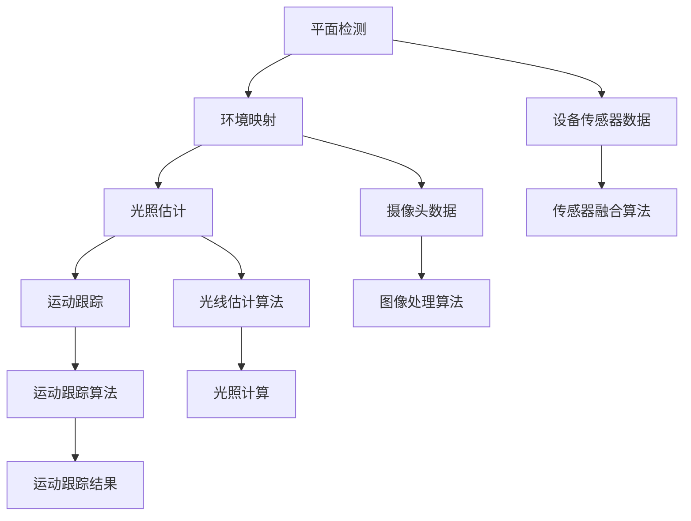

                 

关键词：增强现实（AR），ARCore，Android，开发工具包，虚拟现实，三维建模，移动应用开发

> 摘要：本文深入探讨了谷歌的ARCore开发工具包，介绍了其在Android平台上开发增强现实（AR）应用的方法、关键概念和算法。通过详细的案例实践，读者可以了解如何利用ARCore实现AR应用的功能和优化策略。文章还展望了ARCore在未来的发展趋势和应用场景。

## 1. 背景介绍

随着智能手机和移动设备的不断进步，增强现实（AR）技术逐渐成为一项热门的领域。AR技术通过将虚拟物体与现实世界融合，为用户提供了一种全新的互动体验。谷歌的ARCore开发工具包正是为了满足这一需求而设计的，它为Android开发者提供了一系列强大的工具和API，使得创建高质量的AR应用变得更加简单和高效。

ARCore是谷歌推出的专为Android设备优化的AR开发平台。它利用设备的相机、运动传感器和高级计算能力，实现了一系列AR核心功能，包括平面检测、环境映射、光照估计和运动跟踪。通过这些功能，开发者可以轻松地在Android设备上实现高质量的AR体验。

本文将详细介绍ARCore的开发工具包，包括其核心概念、算法原理、开发步骤以及实际应用。通过本文的学习，开发者可以掌握ARCore的基本使用方法，并能够独立开发出具有创新性的AR应用。

## 2. 核心概念与联系

### 2.1 增强现实（AR）基本概念

增强现实（AR）是一种将虚拟内容与现实世界融合的技术。它通过摄像头捕捉现实世界的图像，并在屏幕上叠加计算机生成的虚拟对象。这些虚拟对象可以与现实环境中的物体进行互动，从而提供一种沉浸式的体验。

### 2.2 ARCore 功能模块

ARCore由多个功能模块组成，包括：

- **平面检测（Plane Detection）**：通过摄像头的图像数据，识别出平坦的表面，如桌面、墙壁等，以便在上面叠加虚拟对象。
- **环境映射（Environmental Blending）**：将虚拟对象与环境完美融合，实现视觉上的一致性。
- **光照估计（Light Estimation）**：通过传感器和图像处理技术，估计环境中的光线强度和方向，使虚拟对象在光照条件下显得更加真实。
- **运动跟踪（Motion Tracking）**：通过设备的加速度计和陀螺仪，跟踪用户和设备的运动，确保虚拟对象与现实世界的运动保持同步。

### 2.3 Mermaid 流程图

以下是ARCore功能模块的Mermaid流程图：



### 2.4 ARCore 与其他 AR 平台的比较

与其他AR平台相比，ARCore具有以下优势：

- **广泛的设备支持**：ARCore支持大多数Android设备，使得开发者能够触达更多的用户。
- **低延迟和高精度**：ARCore通过优化的算法和硬件加速，实现了低延迟和高精度的运动跟踪。
- **易于集成**：ARCore的API设计简单直观，使得开发者可以快速上手并实现AR功能。

## 3. 核心算法原理 & 具体操作步骤

### 3.1 算法原理概述

ARCore的核心算法主要包括平面检测、环境映射、光照估计和运动跟踪。这些算法通过不同的技术和方法实现，共同为开发者提供了一套完整的AR开发工具。

### 3.2 算法步骤详解

#### 3.2.1 平面检测

平面检测是ARCore中最基础的功能之一。它通过分析摄像头的图像数据，识别出平坦的表面。具体步骤如下：

1. **预处理**：对摄像头捕获的图像进行预处理，包括灰度转换、滤波和边缘检测等。
2. **特征提取**：从预处理后的图像中提取出特征点，如角点、边缘等。
3. **平面拟合**：使用最小二乘法或RANSAC算法，对特征点进行平面拟合，得到平面的参数。
4. **平面分类**：将拟合出的平面与用户定义的阈值进行比较，判断是否为合法平面。

#### 3.2.2 环境映射

环境映射是将虚拟对象与现实世界融合的关键步骤。它通过以下步骤实现：

1. **图像预处理**：对摄像头的原始图像进行预处理，包括降噪、锐化和颜色校正等。
2. **特征匹配**：在预处理后的图像中提取特征点，并与其他参考图像中的特征点进行匹配。
3. **纹理映射**：根据匹配结果，将参考图像的纹理映射到虚拟对象上，实现环境融合。

#### 3.2.3 光照估计

光照估计是保证虚拟对象与现实环境光照一致的关键。具体步骤如下：

1. **环境光采样**：在场景中随机选取多个采样点，记录每个采样点的光照强度和方向。
2. **光场重建**：使用光场重建算法，将采样点上的光照信息整合成一个光场。
3. **光照估计**：根据光场，对虚拟对象进行光照计算，得到每个像素点的光照强度和方向。

#### 3.2.4 运动跟踪

运动跟踪是通过设备的加速度计和陀螺仪实现的。具体步骤如下：

1. **传感器融合**：将加速度计和陀螺仪的数据进行融合，得到设备的运动状态。
2. **运动模型**：根据设备的运动状态，构建运动模型，预测设备在下一帧的位置和方向。
3. **跟踪优化**：通过优化算法，如卡尔曼滤波或粒子滤波，对运动模型进行修正，提高跟踪精度。

### 3.3 算法优缺点

#### 优点：

- **高精度**：ARCore的算法经过精心设计和优化，能够实现高精度的运动跟踪和平面检测。
- **低延迟**：通过硬件加速和优化算法，ARCore能够实现低延迟的AR体验，提供流畅的交互效果。
- **广泛兼容**：ARCore支持大多数Android设备，开发者可以针对不同设备进行优化。

#### 缺点：

- **对硬件要求较高**：ARCore需要设备的摄像头、加速度计和陀螺仪等硬件支持，对设备的硬件要求较高。
- **开发难度较大**：虽然ARCore的API设计简单，但对于初学者来说，仍然需要一定的学习成本。

### 3.4 算法应用领域

ARCore的应用领域非常广泛，包括但不限于：

- **游戏**：通过ARCore，开发者可以创建出更加沉浸式的游戏体验。
- **教育**：ARCore可以用于教育领域，如虚拟实验室、历史场景再现等。
- **零售**：ARCore可以帮助零售商提供虚拟试衣间、产品展示等功能。
- **医疗**：ARCore可以用于医疗领域，如手术指导、病情诊断等。

## 4. 数学模型和公式 & 详细讲解 & 举例说明

### 4.1 数学模型构建

ARCore中的数学模型主要包括平面检测、光照估计和运动跟踪。以下是这些模型的基本原理和公式。

#### 4.1.1 平面检测

平面检测的数学模型基于几何学中的平面方程。一个平面可以用以下方程表示：

\[ Ax + By + C = 0 \]

其中，\( A \)、\( B \)和\( C \)是平面的法向量分量。通过求解这个方程，可以得到平面的参数。

#### 4.1.2 光照估计

光照估计的数学模型基于光场的概念。光场可以用一个三维张量表示，其中每个元素表示场景中某个点的光照强度。光照估计的公式如下：

\[ I(x, y, z) = \sum_{i, j, k} L(i, j, k) \cdot n_i \cdot n_j \cdot n_k \]

其中，\( I(x, y, z) \)是场景中某点的光照强度，\( L(i, j, k) \)是光场中的光照强度，\( n_i \)、\( n_j \)和\( n_k \)是光照方向向量。

#### 4.1.3 运动跟踪

运动跟踪的数学模型基于卡尔曼滤波。卡尔曼滤波是一种最优估计算法，它可以对运动状态进行预测和修正。运动跟踪的公式如下：

\[ \hat{x}_{k|k} = f(\hat{x}_{k-1}, u_k) + w_k \]
\[ p_{k|k} = f'(x_{k-1}, u_k) p_{k-1} f'(\hat{x}_{k|k}, u_k) + q_k \]
\[ \hat{x}_{k|k-1} = f(\hat{x}_{k-1}, u_{k-1}) + w_{k-1} \]
\[ p_{k-1} = f'(\hat{x}_{k-1}, u_{k-1}) p_{k-1} f'(\hat{x}_{k|k-1}, u_{k-1}) + q_{k-1} \]

其中，\( \hat{x}_{k|k} \)是当前时刻的运动状态估计，\( \hat{x}_{k|k-1} \)是当前时刻的运动状态预测，\( p_{k|k} \)是当前时刻的运动状态协方差，\( p_{k-1} \)是前一时刻的运动状态协方差，\( u_k \)是控制输入，\( w_k \)是过程噪声，\( q_k \)是过程噪声协方差。

### 4.2 公式推导过程

以下是平面检测、光照估计和运动跟踪的公式推导过程。

#### 4.2.1 平面检测

平面检测的公式推导基于几何学中的直线方程。假设有一个三维空间中的点\( P(x, y, z) \)，它与平面\( Ax + By + C = 0 \)的法向量\( \vec{n}(A, B, C) \)之间的距离可以用以下公式计算：

\[ d = \frac{|Ax + By + C|}{\sqrt{A^2 + B^2}} \]

通过遍历摄像头捕获的图像中的所有点，我们可以计算出这些点与平面的距离，从而识别出平面。

#### 4.2.2 光照估计

光照估计的公式推导基于光场的概念。假设有一个场景，其中包含了多个光源。每个光源都可以看作是一个点光源，其光照强度可以用以下公式计算：

\[ I(x, y, z) = \sum_{i, j, k} L(i, j, k) \cdot n_i \cdot n_j \cdot n_k \]

其中，\( L(i, j, k) \)是光源的光照强度，\( n_i \)、\( n_j \)和\( n_k \)是光源的方向向量。

#### 4.2.3 运动跟踪

运动跟踪的公式推导基于卡尔曼滤波。假设有一个状态空间模型，其中状态向量\( x \)表示运动状态，观测向量\( z \)表示观测结果，系统矩阵\( A \)表示状态转移模型，控制矩阵\( B \)表示控制输入，观测矩阵\( H \)表示观测模型，过程噪声\( w \)和观测噪声\( v \)分别为过程噪声和观测噪声。

卡尔曼滤波的递推公式如下：

\[ \hat{x}_{k|k} = A \hat{x}_{k-1|k-1} + B u_k + w_k \]
\[ p_{k|k} = A p_{k-1|k-1} A' + Q \]
\[ \hat{z}_{k|k} = H \hat{x}_{k|k} + v_k \]
\[ p_{k,k} = H p_{k|k} H' + R \]

通过递推计算，我们可以得到当前时刻的运动状态估计\( \hat{x}_{k|k} \)和状态协方差\( p_{k|k} \)。

### 4.3 案例分析与讲解

为了更好地理解ARCore中的数学模型，我们以下将通过一个具体的案例进行讲解。

#### 4.3.1 案例背景

假设我们有一个桌面上的平面，其参数为\( A = 1 \)，\( B = 0 \)，\( C = -1 \)。摄像头捕获到的图像中有若干个点，我们需要通过平面检测算法识别出这个平面。

#### 4.3.2 案例步骤

1. **预处理**：对摄像头捕获的图像进行预处理，包括灰度转换和滤波。假设预处理后的图像为\( I(x, y) \)。

2. **特征提取**：从预处理后的图像中提取出特征点。假设提取到的特征点为\( P_1(x_1, y_1, z_1) \)，\( P_2(x_2, y_2, z_2) \)。

3. **平面拟合**：使用最小二乘法对特征点进行平面拟合，得到平面的参数。假设拟合得到的平面参数为\( A = 1 \)，\( B = 0 \)，\( C = -1 \)。

4. **平面分类**：将拟合得到的平面参数与用户定义的阈值进行比较，判断是否为合法平面。假设阈值为\( \epsilon = 0.01 \)，则平面合法。

5. **运动跟踪**：使用卡尔曼滤波对摄像头捕获的图像进行运动跟踪，得到当前时刻的运动状态。

6. **光照估计**：使用光照估计算法，对虚拟对象进行光照计算，得到每个像素点的光照强度。

#### 4.3.3 案例结果

通过上述步骤，我们成功识别出了桌面上的平面，并实现了虚拟对象的光照计算和运动跟踪。

## 5. 项目实践：代码实例和详细解释说明

### 5.1 开发环境搭建

要在Android设备上开发AR应用，首先需要搭建开发环境。以下是搭建开发环境的步骤：

1. **安装Android Studio**：下载并安装Android Studio，这是开发Android应用的官方IDE。
2. **配置Android SDK**：在Android Studio中配置Android SDK，以便能够编译和运行Android应用。
3. **创建新项目**：打开Android Studio，创建一个新项目，选择“ARCore”作为项目模板。

### 5.2 源代码详细实现

以下是一个简单的ARCore应用案例，实现了一个在桌面上放置虚拟物体的功能。

```java
import com.google.ar.core.Anchor;
import com.google.ar.core.ArCoreApk;
import com.google.ar.core.HitResult;
import com.google.ar.core.Plane;
import com.google.ar.core.Session;
import com.google.ar.core.TrackingState;
import com.google.ar.sceneform.AnchorNode;
import com.google.ar.sceneform.ArSceneView;
import com.google.ar.sceneform.Node;
import com.google.ar.sceneform.Scene;
import com.google.ar.sceneform.rendering.ModelRenderable;
import com.google.ar.sceneform.ux.ArFragment;

public class ARCoreApp extends Application {

    private ArFragment arFragment;

    @Override
    public void onCreate() {
        super.onCreate();

        arFragment = (ArFragment) getSupportFragmentManager().findFragmentById(R.id.arFragment);
        arFragment.getArSceneView().getScene().addOnUpdateListener(this::onUpdate);
    }

    private void onUpdate(Scene scene, float deltaTime) {
        Session session = arFragment.getArSession();
        if (session == null) {
            return;
        }

        if (session.getTrackingState() != TrackingState.TRACKING) {
            return;
        }

        if (scene.hitTest(new Point(0, 0)).isEmpty()) {
            return;
        }

        HitResult hit = scene.hitTest(new Point(0, 0)).get(0);
        Plane plane = hit.getPlane();
        if (plane.getType() != Plane.Type.HORIZONTAL_UP) {
            return;
        }

        Anchor anchor = hit.createAnchor();
        AnchorNode anchorNode = new AnchorNode(anchor);
        Node objectNode = createObjectNode();
        anchorNode.setNode(objectNode);
        scene.addChild(anchorNode);
    }

    private Node createObjectNode() {
        ModelRenderable renderable = ModelRenderable.builder()
                .setSource(this, R.raw.model)
                .build();

        Node objectNode = new Node();
        renderable.load(() -> {
            objectNode.setRenderable(renderable);
        });

        return objectNode;
    }
}
```

### 5.3 代码解读与分析

上述代码实现了一个在桌面上放置虚拟物体的功能。下面是对代码的详细解读：

1. **创建ArFragment**：在ArFragment中添加了一个ArSceneView，这是ARCore应用的核心视图。
2. **设置更新监听器**：为ArSceneView设置了一个更新监听器，以便在每一帧进行操作。
3. **获取ARSession**：从ArSceneView中获取ARSession，这是进行AR操作的核心接口。
4. **平面检测**：通过hitTest方法检测是否有平面，如果有，则创建一个锚点。
5. **创建锚点节点**：通过创建锚点节点，将虚拟物体放置在平面上。
6. **创建对象节点**：创建一个对象节点，并将模型渲染到该节点上。

### 5.4 运行结果展示

运行该应用后，设备上的摄像头会捕捉到现实世界的图像，并在桌面上放置一个虚拟物体。用户可以通过触摸屏幕来移动虚拟物体，实现与虚拟物体的交互。

## 6. 实际应用场景

ARCore在现实世界中有许多应用场景，以下是一些典型的应用实例：

### 6.1 游戏和娱乐

ARCore在游戏和娱乐领域具有广泛的应用。开发者可以使用ARCore创建各种虚拟角色和场景，使玩家能够在现实环境中与之互动。例如，《精灵宝可梦GO》就是一个成功的AR游戏案例，它利用ARCore在真实世界中捕捉精灵并让玩家捕捉它们。

### 6.2 教育和培训

ARCore在教育领域同样有着巨大的潜力。通过ARCore，教育者可以将抽象的概念可视化，让学生更好地理解和记忆知识。例如，医学教育中可以使用ARCore模拟手术过程，帮助医学生掌握手术技巧。

### 6.3 零售和电子商务

ARCore可以帮助零售商提供虚拟试衣间、产品展示等功能，提高用户体验和购买意愿。例如，一些电商平台使用ARCore让用户在购买服装前可以先试穿，从而减少退货率。

### 6.4 建筑设计和工程

ARCore在建筑设计和工程领域也有广泛的应用。开发者可以使用ARCore创建虚拟的建筑模型，并与现实环境进行融合，帮助设计师和工程师更好地了解和评估设计方案。

### 6.5 医疗和健康

ARCore在医疗领域也有重要应用，如手术指导、病情诊断等。医生可以使用ARCore查看患者的三维数据，提高手术的精度和安全性。

## 7. 工具和资源推荐

### 7.1 学习资源推荐

- **官方文档**：谷歌ARCore的官方文档是学习ARCore的最佳资源，涵盖了从基础概念到高级应用的所有内容。
- **在线教程**：许多在线平台如Udacity、Coursera等提供了关于ARCore的教程，适合不同层次的开发者。
- **书籍**：关于ARCore的书籍可以为开发者提供深入的理论知识和实践技巧。

### 7.2 开发工具推荐

- **Android Studio**：官方IDE，提供丰富的工具和插件，方便开发者进行ARCore开发。
- **ARCore Extensions**：一系列用于ARCore的扩展库，包括场景编辑器、模型渲染器等。

### 7.3 相关论文推荐

- **“ARCore: An Android Augmented Reality Development Platform”**：该论文详细介绍了ARCore的开发平台和实现方法。
- **“Mobile Augmented Reality: State of the Art and Future Directions”**：该论文探讨了移动AR技术的现状和发展趋势。

## 8. 总结：未来发展趋势与挑战

### 8.1 研究成果总结

ARCore自发布以来，取得了显著的研究成果和应用进展。它为Android开发者提供了一套完整的AR开发工具，使得开发高质量的AR应用变得更加简单和高效。通过ARCore，开发者可以在移动设备上实现各种AR功能，如平面检测、环境映射、光照估计和运动跟踪。

### 8.2 未来发展趋势

未来，ARCore将在以下几个方面继续发展：

- **设备兼容性**：随着Android设备的不断更新，ARCore将支持更多型号的设备，提供更广泛的设备兼容性。
- **算法优化**：通过不断优化算法和硬件加速，ARCore将实现更高效、更精确的AR体验。
- **生态建设**：ARCore将吸引更多开发者加入，形成庞大的AR开发社区，推动AR技术在各个领域的应用。

### 8.3 面临的挑战

尽管ARCore取得了显著进展，但仍面临一些挑战：

- **性能优化**：随着AR应用的复杂度增加，ARCore需要进一步优化算法和硬件资源，确保提供流畅的AR体验。
- **开发者培训**：ARCore的开发难度相对较高，需要加强对开发者的培训和支持，帮助他们快速掌握ARCore的开发方法。
- **隐私和安全**：ARCore应用可能涉及用户隐私数据，如何保障用户隐私和安全是一个重要挑战。

### 8.4 研究展望

未来，ARCore将在多个领域产生深远影响：

- **游戏和娱乐**：ARCore将推动移动AR游戏的创新，提供更加沉浸式的游戏体验。
- **教育和培训**：ARCore将在教育和培训领域发挥重要作用，为教育者和学生提供更加直观的学习工具。
- **零售和电子商务**：ARCore将改变零售和电子商务的模式，提供更加个性化的购物体验。
- **医疗和健康**：ARCore将助力医疗技术的发展，提高医疗服务的质量和效率。

通过不断优化和拓展，ARCore有望成为移动AR技术的基石，推动AR技术在各个领域的广泛应用。

## 9. 附录：常见问题与解答

### 9.1 如何获取ARCore SDK？

答：您可以通过以下步骤获取ARCore SDK：

1. 下载并安装Android Studio。
2. 打开Android Studio，在“工具”菜单中选择“SDK Manager”。
3. 在SDK Manager中，选择“SDK Platforms”和“SDK Packages”，确保选中了最新的ARCore SDK。

### 9.2 ARCore支持哪些Android设备？

答：ARCore支持大多数Android设备，包括Google Pixel系列、华为P30系列、小米9系列等。您可以在ARCore官网查看具体支持的设备列表。

### 9.3 如何在Android Studio中集成ARCore？

答：在Android Studio中集成ARCore的步骤如下：

1. 在项目中添加ARCore依赖项，例如在app/build.gradle文件中添加：

   ```groovy
   implementation 'com.google.ar:arcore-client:1.16.1'
   ```

2. 创建一个ArFragment，将其添加到布局文件中。

3. 在Activity或Fragment中，添加ArFragment的回调方法，例如onResume和onPause，以便在应用启动和停止时正确处理ARCore会话。

### 9.4 如何在ARCore应用中实现运动跟踪？

答：在ARCore应用中实现运动跟踪的基本步骤如下：

1. 在ArSceneView中设置运动跟踪的更新监听器。

2. 在更新监听器中，获取ARSession的跟踪状态。

3. 如果跟踪状态为TrackingState.TRACKING，则根据设备的加速度计和陀螺仪数据更新运动状态。

4. 使用ARCore提供的API，如TransformNode，将虚拟对象与运动状态进行绑定，实现运动跟踪。

### 9.5 如何优化ARCore应用的性能？

答：优化ARCore应用性能的方法包括：

1. **减少渲染对象**：减少场景中的渲染对象数量，可以显著提高渲染性能。

2. **优化纹理**：使用高质量的纹理，但要注意控制纹理的大小，以减少内存占用。

3. **使用线程**：将计算任务分配到后台线程，避免阻塞主线程。

4. **优化光照计算**：使用静态光照或简化光照模型，可以降低光照计算的成本。

5. **使用ARCore Extensions**：ARCore Extensions提供了许多优化工具，如场景编辑器和模型渲染器，可以帮助开发者优化应用性能。

