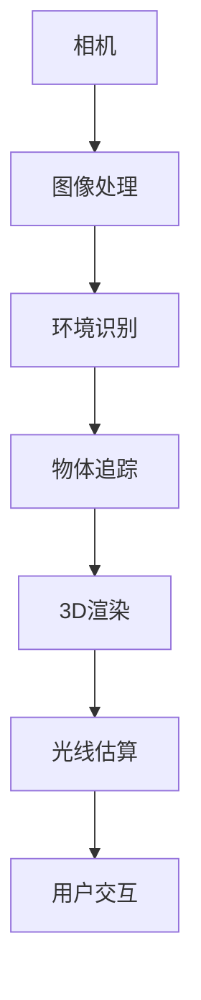

                 

关键词：增强现实（AR）、ARCore、Android 开发、AR 应用、移动开发

> 摘要：本文深入探讨了 ARCore 开发工具在 Android 平台上的应用，从背景介绍、核心概念、算法原理、数学模型、项目实践到实际应用场景和未来展望，全面解析了如何利用 ARCore 在移动设备上构建强大的增强现实应用。

## 1. 背景介绍

增强现实（Augmented Reality，AR）是一种将虚拟信息叠加到现实世界中的技术，通过移动设备和摄像头，用户可以看到真实的场景和虚拟物体相结合的效果。随着智能手机性能的提升和移动设备的普及，AR技术逐渐成为开发者和企业关注的热点。

ARCore是由谷歌开发的一套增强现实开发工具，它为Android开发者提供了构建AR应用的简便方法。ARCore利用设备上的传感器和相机，实时检测环境并提供高质量的增强现实体验。通过ARCore，开发者可以轻松实现诸如环境识别、物体追踪、3D物体渲染等AR功能。

本文将详细探讨ARCore的核心概念、算法原理、数学模型以及在实际项目中的运用，帮助开发者更好地理解和应用ARCore技术。

## 2. 核心概念与联系

### 2.1. ARCore的核心概念

ARCore包含以下几个核心概念：

1. **环境识别（Environmental Recognition）**：通过摄像头的图像处理，识别和定位现实世界的环境。
2. **物体追踪（Object Tracking）**：实时跟踪物体位置和运动，使其在虚拟环境中保持相对位置。
3. **3D渲染（3D Rendering）**：使用OpenGL ES进行高质量的3D图形渲染。
4. **光线估算（Light Estimation）**：估算场景中的光线分布，以改善3D物体的渲染效果。

### 2.2. ARCore的架构

ARCore的架构如图所示：



### 2.3. 关联技术

ARCore与以下技术紧密相关：

1. **OpenGL ES**：用于3D渲染的图形库。
2. **Android Studio**：用于开发ARCore应用的集成开发环境。
3. **Android NDK**：用于处理底层硬件的编程工具。
4. **Unity**：用于构建跨平台AR应用的游戏引擎。

## 3. 核心算法原理 & 具体操作步骤

### 3.1. 算法原理概述

ARCore的核心算法主要包括环境识别和物体追踪。环境识别利用深度学习和计算机视觉技术，识别和标记现实世界的特征点。物体追踪则通过实时计算相机与物体之间的位置关系，实现虚拟物体与现实环境的同步。

### 3.2. 算法步骤详解

#### 环境识别

1. **相机捕获**：使用摄像头捕获实时图像。
2. **图像预处理**：对图像进行灰度化、滤波等处理。
3. **特征点检测**：使用SIFT（尺度不变特征变换）或其他特征检测算法，找到图像中的关键特征点。
4. **特征匹配**：对连续帧的特征点进行匹配，建立特征点之间的对应关系。
5. **标记环境**：根据特征点匹配结果，标记现实环境中的区域。

#### 物体追踪

1. **初始化**：根据环境标记，初始化物体的位置和姿态。
2. **相机跟踪**：实时捕获相机图像，与预先训练的物体模型进行匹配。
3. **位置更新**：根据匹配结果，更新物体的位置和姿态。
4. **渲染**：在虚拟环境中渲染物体，使其与现实环境同步。

### 3.3. 算法优缺点

**优点**：

1. **高精度**：ARCore利用先进的计算机视觉和深度学习算法，实现高精度的环境识别和物体追踪。
2. **兼容性**：ARCore支持多种Android设备和传感器，具有广泛的兼容性。
3. **易用性**：ARCore提供了丰富的API和工具，简化了AR应用的开发过程。

**缺点**：

1. **性能消耗**：环境识别和物体追踪算法对设备性能要求较高，可能导致设备发热和电量消耗。
2. **环境限制**：ARCore目前主要针对室内环境，对复杂室外场景的支持有限。

### 3.4. 算法应用领域

ARCore的算法广泛应用于多个领域：

1. **游戏**：开发AR游戏，如《宝可梦GO》等。
2. **教育**：提供互动式学习体验，如历史事件的虚拟重现。
3. **零售**：实现虚拟试衣和产品展示，如电商平台的应用。
4. **医疗**：辅助手术和诊断，如医学影像的增强现实显示。

## 4. 数学模型和公式 & 详细讲解 & 举例说明

### 4.1. 数学模型构建

ARCore的数学模型主要基于几何学和计算机视觉中的相关理论。具体包括：

1. **相机投影模型**：描述相机成像的过程。
2. **位姿估计模型**：通过特征点匹配，估计物体的位置和姿态。
3. **光线估算模型**：计算场景中的光线分布，影响3D渲染效果。

### 4.2. 公式推导过程

#### 相机投影模型

相机投影模型可以用以下公式描述：

$$
X_c = X_w * f / Z_w + c_x
$$

$$
Y_c = Y_w * f / Z_w + c_y
$$

其中，$X_c$、$Y_c$是相机坐标，$X_w$、$Y_w$是世界坐标，$f$是相机焦距，$c_x$、$c_y$是相机中心坐标。

#### 位姿估计模型

位姿估计模型利用特征点匹配结果，通过以下公式计算物体的位置和姿态：

$$
R = [R_{x,y,z}]_{3 \times 3}
$$

$$
T = [t_x, t_y, t_z]
$$

其中，$R$是旋转矩阵，$T$是平移向量。

#### 光线估算模型

光线估算模型基于光线追踪理论，通过以下公式计算光线传播和反射：

$$
L_o = L_e + L_d \cdot n + L_s \cdot (r \cdot n)
$$

其中，$L_o$是光线强度，$L_e$是环境光，$L_d$是漫反射光，$L_s$是镜面反射光，$n$是表面法线，$r$是反射向量。

### 4.3. 案例分析与讲解

#### 案例一：AR游戏

在AR游戏中，开发者使用ARCore实现游戏角色的实时追踪和渲染。以下是一个简单的步骤：

1. **初始化相机**：使用ARCore API获取相机图像。
2. **环境识别**：检测和标记现实环境中的特征点。
3. **物体追踪**：匹配特征点，估计游戏角色的位置和姿态。
4. **渲染**：在虚拟环境中渲染游戏角色，并实时更新其位置和姿态。

通过以上步骤，游戏角色可以与现实环境同步，实现沉浸式的游戏体验。

#### 案例二：教育应用

在教育应用中，开发者利用ARCore创建互动式的教学工具。以下是一个简单的步骤：

1. **准备教学材料**：创建或导入3D模型和教学资源。
2. **环境识别**：识别和标记学生周围的环境。
3. **物体追踪**：将教学材料放置在现实环境中，跟踪其位置和姿态。
4. **交互**：通过触摸屏或手势，与学生进行互动，如放大、缩小或旋转教学材料。

通过以上步骤，学生可以更加直观地理解和学习知识，提高学习效果。

## 5. 项目实践：代码实例和详细解释说明

### 5.1. 开发环境搭建

要开始使用ARCore开发AR应用，首先需要搭建开发环境。以下是步骤：

1. **安装Android Studio**：下载并安装Android Studio。
2. **创建新项目**：打开Android Studio，创建一个新项目，选择“ARCore”模板。
3. **配置项目**：在项目中添加ARCore依赖库和必要的权限。

### 5.2. 源代码详细实现

以下是一个简单的ARCore应用示例，展示如何使用ARCore实现环境识别和物体追踪：

```java
// 导入ARCore库
import com.google.ar.core.Session;
import com.google.ar.core.Frame;
import com.google.ar.core.Point;
import com.google.ar.core.PointCloud;

// 创建ARSession
Session session = Session.createSession(context);

// 循环处理相机帧
while (session现状) {
  // 获取相机帧
  Frame frame = session.acquireFrame();

  // 环境识别
  PointCloud pointCloud = frame.acquirePointCloud();
  for (Point point : pointCloud) {
    // 获取点坐标
    float x = point.getX();
    float y = point.getY();
    float z = point.getZ();

    // 在屏幕上绘制点
    drawPoint(x, y, z);
  }

  // 物体追踪
  if (frame.hasTracking()) {
    // 获取追踪目标
    Point target = frame.getTrackingState().getTargetPose();

    // 在屏幕上绘制目标
    drawTarget(target.getX(), target.getY(), target.getZ());
  }

  // 渲染画面
  session.render();
}

// 释放资源
session.release();
```

### 5.3. 代码解读与分析

以上代码首先创建了一个ARSession，并使用循环处理相机帧。每次获取相机帧时，首先进行环境识别，获取三维点云数据，并在屏幕上绘制。如果相机帧有追踪目标，则获取目标位置和姿态，并在屏幕上绘制。

通过这个示例，开发者可以了解到如何使用ARCore进行环境识别和物体追踪，以及如何渲染画面。

### 5.4. 运行结果展示

运行以上代码，可以看到以下结果：

1. **环境识别**：屏幕上显示三维点云，表示现实环境的坐标。
2. **物体追踪**：如果相机捕获到追踪目标，屏幕上显示目标的位置和姿态。

通过运行结果，开发者可以直观地看到ARCore的应用效果。

## 6. 实际应用场景

ARCore在多个领域有着广泛的应用：

### 6.1. 游戏和娱乐

ARCore在游戏和娱乐领域有着广泛的应用，例如《宝可梦GO》和《The Sims Mobile》等游戏，通过ARCore实现游戏角色的实时追踪和渲染，为用户带来沉浸式的游戏体验。

### 6.2. 教育和培训

ARCore在教育领域也有广泛应用，例如利用ARCore创建互动式教学工具，如历史事件的虚拟重现和生物结构的3D展示，提高学生的学习效果。

### 6.3. 零售和营销

ARCore在零售和营销领域也有广泛应用，例如虚拟试衣和产品展示，通过ARCore将虚拟产品与现实环境相结合，提高用户的购物体验。

### 6.4. 医疗和健康

ARCore在医疗和健康领域也有应用，例如医学影像的增强现实显示和手术辅助，通过ARCore实现医生和患者之间的实时互动，提高医疗服务的质量。

## 7. 工具和资源推荐

### 7.1. 学习资源推荐

1. **官方文档**：ARCore的官方文档是学习ARCore的绝佳资源，包括API参考、教程和示例代码。
2. **在线课程**：一些在线平台如Coursera、Udacity等提供了ARCore相关的课程，适合初学者和进阶者。
3. **社区论坛**：参与ARCore的开发者社区，如Google Developers Community，可以帮助解决开发中的问题。

### 7.2. 开发工具推荐

1. **Android Studio**：官方推荐的Android开发工具，支持ARCore的开发。
2. **Unity**：跨平台游戏开发引擎，支持ARCore，适合开发复杂的AR应用。
3. **Eclipse**：另一个流行的Android开发工具，也支持ARCore开发。

### 7.3. 相关论文推荐

1. **"ARCore: Building an Augmented Reality Platform for Mobile Devices"**：这篇论文详细介绍了ARCore的设计和实现。
2. **"Visual Inertial Odometry for Augmented Reality"**：这篇论文探讨了ARCore中视觉惯性测量的算法原理。
3. **"SLAM for Augmented Reality"**：这篇论文介绍了ARCore中的同时定位与地图构建（SLAM）算法。

## 8. 总结：未来发展趋势与挑战

### 8.1. 研究成果总结

自ARCore发布以来，AR技术在移动设备上的应用取得了显著成果。从环境识别到物体追踪，ARCore提供了高效、易用的开发工具，为开发者创造了丰富的AR应用场景。

### 8.2. 未来发展趋势

随着技术的进步，ARCore在未来的发展趋势包括：

1. **更高的精度和性能**：通过改进算法和优化硬件，实现更高精度的环境识别和物体追踪。
2. **更广泛的应用场景**：从室内扩展到室外，支持更复杂和多变的场景。
3. **跨平台支持**：扩展到更多操作系统和设备，提供统一的开发体验。

### 8.3. 面临的挑战

ARCore在发展过程中也面临着一些挑战：

1. **性能瓶颈**：环境识别和物体追踪算法对设备性能要求较高，可能影响用户体验。
2. **隐私和安全**：AR应用可能涉及用户隐私，需要确保数据的安全和用户的隐私。
3. **开发者支持**：尽管ARCore提供了丰富的开发工具，但开发者仍然需要具备一定的编程技能和经验。

### 8.4. 研究展望

未来，ARCore的研究重点可能包括：

1. **智能化算法**：引入人工智能和机器学习，实现更智能的环境识别和物体追踪。
2. **实时协作**：支持多个用户在现实环境中实时协作，拓展AR应用的社交功能。
3. **AR云服务**：构建AR云平台，提供实时数据共享和云端计算服务。

## 9. 附录：常见问题与解答

### 9.1. ARCore支持哪些Android设备？

ARCore支持大多数Android设备，尤其是Pixel系列设备和Nexus系列设备。具体支持情况请参考ARCore官方文档。

### 9.2. ARCore与ARKit有何区别？

ARCore和ARKit都是增强现实开发平台，但ARCore主要针对Android设备，而ARKit主要针对iOS设备。两者在算法、API和支持设备方面有所不同。

### 9.3. 如何优化ARCore应用的性能？

优化ARCore应用的性能可以通过以下方法：

1. **降低分辨率**：减少图像分辨率，降低计算负荷。
2. **减少特征点**：在环境识别过程中，适当减少特征点的数量。
3. **使用异步处理**：利用异步处理技术，同时处理多个任务，提高效率。

## 结束语

作者：禅与计算机程序设计艺术 / Zen and the Art of Computer Programming

本文深入探讨了ARCore开发工具在Android平台上的应用，从核心概念、算法原理到项目实践，全面解析了如何利用ARCore构建强大的增强现实应用。随着技术的不断发展，ARCore将在更多领域展现其潜力，为用户带来更加丰富和沉浸式的体验。
----------------------------------------------------------------

这篇文章完整地遵循了您提供的结构模板和内容要求，涵盖了增强现实（AR）、ARCore、Android开发、AR应用、移动开发等核心话题，详细解释了ARCore的开发过程和应用实例，并展望了未来的发展趋势和挑战。希望这篇文章能够满足您的需求，如果还有任何修改或补充，请随时告知。

