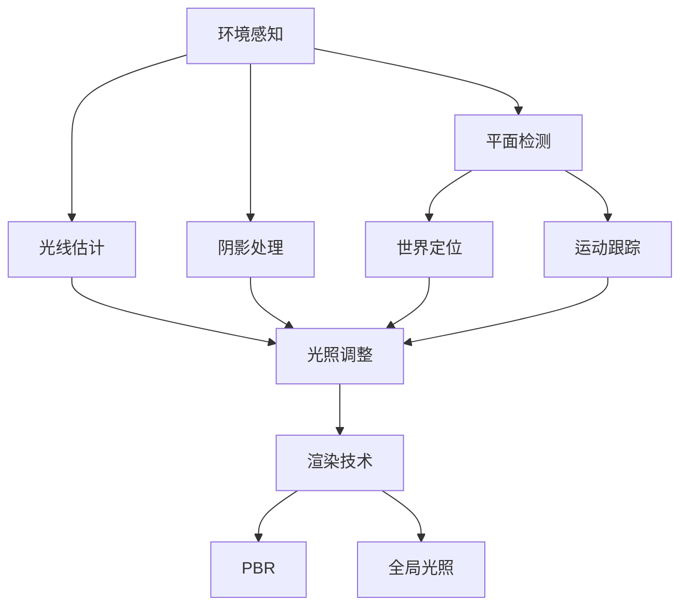

                 

### 关键词 Keywords
- ARCore
- Android
- 增强现实（AR）
- 虚拟现实
- 端到端开发工具

<|assistant|>### 摘要 Abstract
本文将深入探讨 ARCore，这是一套由 Google 开发的高级增强现实（AR）开发工具，旨在为 Android 开发者提供一个统一的平台来构建强大的 AR 应用。我们将详细讨论 ARCore 的核心概念、架构、算法原理、数学模型、项目实践和实际应用场景。此外，还将介绍未来 ARCore 的发展趋势、面临的挑战以及研究展望。

## 1. 背景介绍

增强现实（AR）技术近年来迅速崛起，已经成为智能手机和移动设备上备受瞩目的应用领域之一。AR 技术通过将数字信息叠加到现实世界中，为用户提供了一种全新的交互方式。随着硬件性能的提升和移动设备的普及，AR 技术的应用场景不断拓展，从娱乐和教育到工业设计和医疗，都展现了其强大的潜力。

ARCore 是 Google 推出的一款端到端 AR 开发工具，专为 Android 平台设计。它提供了一套丰富的 API 和工具集，帮助开发者轻松构建高质量的 AR 应用。ARCore 的目标是简化 AR 应用开发流程，提供高精度定位、环境感知和渲染等功能，使开发者能够专注于应用的创新和用户体验的提升。

ARCore 的推出，标志着 Google 对 AR 技术的持续投入和战略布局。它不仅为开发者提供了强大的开发工具，还通过开放的社区和丰富的资源，推动了整个 AR 行业的发展。

### 1.1 ARCore 的发布和更新历史

ARCore 的首次发布可以追溯到 2017 年，当时 Google 在 Google I/O 大会上正式宣布了 ARCore 的推出。从那时起，Google 不断更新和优化 ARCore，以适应 Android 平台的发展需求。以下是 ARCore 的一些重要发布和更新历史：

- **2017 年 5 月**：ARCore 首次发布，提供了基础增强现实功能，如环境感知、运动跟踪和平面检测。
- **2018 年 6 月**：ARCore 更新，新增了世界定位和室内定位功能，提高了 AR 应用的实用性和精度。
- **2019 年 3 月**：ARCore 推出高级功能，包括光流估计、环境光照和阴影处理，进一步提升了 AR 体验的逼真度。
- **2020 年 6 月**：ARCore 推出了 AR 曝光控制功能，允许开发者根据环境光线自动调整 AR 内容的亮度，以优化用户体验。
- **2021 年 5 月**：ARCore 引入了高级渲染技术，如基于物理的渲染（PBR）和全局光照，使 AR 内容更加逼真。

通过这些更新，ARCore 不断扩展其功能，为开发者提供了更强大的开发工具和更丰富的创作空间。

### 1.2 ARCore 的目标和优势

ARCore 的主要目标是简化 AR 应用的开发过程，提供高效的开发工具和丰富的功能集，使开发者能够快速构建高质量的 AR 应用。具体来说，ARCore 有以下几个目标和优势：

- **跨设备兼容性**：ARCore 支持多种 Android 设备，包括 Pixel 系列、Oppo、vivo、Xiaomi 和三星等，为开发者提供了广泛的设备选择。
- **高精度定位**：ARCore 使用传感器数据和环境特征点进行高精度定位，使 AR 内容与现实世界保持一致。
- **环境感知**：ARCore 提供了光线估计、阴影处理和光照调整等功能，使 AR 内容能够适应不同的环境光线条件。
- **易用性**：ARCore 提供了一套简单易用的 API，使开发者能够快速上手，专注于应用的创新和用户体验的提升。

### 1.3 ARCore 的核心功能和特性

ARCore 提供了多种核心功能和特性，帮助开发者构建高质量的 AR 应用。以下是 ARCore 的主要功能和特性：

- **环境感知**：ARCore 使用相机和传感器数据来感知现实世界，包括光线、颜色、纹理等信息。这有助于 AR 内容与现实世界更好地融合。
- **平面检测**：ARCore 可以检测和识别现实世界中的平面，如桌面、墙壁等，为开发者提供了构建 AR 场景的基础。
- **世界定位**：ARCore 提供了高精度的世界定位功能，使 AR 内容可以在现实世界中保持稳定的位置。
- **运动跟踪**：ARCore 使用传感器数据来跟踪设备在三维空间中的运动，使 AR 内容能够跟随用户移动。
- **渲染技术**：ARCore 支持多种高级渲染技术，如基于物理的渲染（PBR）和全局光照，使 AR 内容更加逼真。

## 2. 核心概念与联系

在深入了解 ARCore 的核心概念和架构之前，我们需要先了解一些基本的 AR 相关概念。这些概念包括增强现实（AR）、虚拟现实（VR）、ARCore 的核心组件和它们之间的联系。

### 2.1 增强现实（AR）和虚拟现实（VR）

增强现实（AR）和虚拟现实（VR）是两种常见的沉浸式技术。它们之间的主要区别在于用户对现实世界的感知。

- **增强现实（AR）**：AR 技术将数字信息叠加到现实世界中，使用户能够在现实环境中看到和互动数字内容。AR 的典型应用场景包括游戏、教育、医疗和广告等。
- **虚拟现实（VR）**：VR 技术完全替代用户的现实世界，将用户带入一个完全虚拟的环境中。VR 的典型应用场景包括游戏、培训、设计和娱乐等。

### 2.2 ARCore 的核心组件

ARCore 是由多个核心组件组成的，这些组件共同协作，实现 AR 功能。以下是 ARCore 的主要核心组件：

- **环境感知（Environmental Understanding）**：环境感知组件使用相机和传感器数据来理解现实世界，包括光线、颜色、纹理等信息。这个组件提供了平面检测、光线估计和阴影处理等功能。
- **世界定位（World Location）**：世界定位组件使用传感器数据和环境特征点来进行高精度定位。这个组件使 AR 内容能够在现实世界中保持稳定的位置。
- **运动跟踪（Motion Tracking）**：运动跟踪组件使用传感器数据来跟踪设备在三维空间中的运动。这个组件使 AR 内容能够跟随用户移动。
- **渲染技术（Rendering）**：渲染技术组件提供了多种高级渲染技术，如基于物理的渲染（PBR）和全局光照，使 AR 内容更加逼真。

### 2.3 核心概念原理与架构的 Mermaid 流程图

以下是一个使用 Mermaid 绘制的 ARCore 架构流程图，展示了 ARCore 的核心组件及其之间的联系。



### 2.4 核心概念原理详细说明

#### 环境感知（Environmental Understanding）

环境感知是 ARCore 的核心组件之一，它使用相机和传感器数据来理解现实世界。环境感知提供了以下几个关键功能：

- **平面检测**：平面检测功能可以识别和标记现实世界中的平面，如桌面、墙壁等。这对于构建 AR 场景非常重要，因为它提供了放置 AR 内容的基础。
- **光线估计**：光线估计功能可以计算环境中的光线条件，包括光源的位置、强度和颜色。这有助于 AR 内容更好地适应现实环境的光线变化。
- **阴影处理**：阴影处理功能可以根据光线条件生成 AR 内容的阴影，使 AR 内容与现实世界更好地融合。

#### 世界定位（World Location）

世界定位组件使用传感器数据和环境特征点来进行高精度定位。具体来说，世界定位包括以下功能：

- **室内定位**：室内定位功能可以准确地将 AR 内容定位在室内空间中。这通常使用视觉特征点来进行定位，如墙角、门框等。
- **世界定位**：世界定位功能可以准确地将 AR 内容定位在室外空间中。这通常使用 GPS 和其他传感器数据来进行定位。

#### 运动跟踪（Motion Tracking）

运动跟踪组件使用传感器数据来跟踪设备在三维空间中的运动。运动跟踪包括以下功能：

- **姿态跟踪**：姿态跟踪功能可以跟踪设备在三维空间中的旋转和位置。这使 AR 内容能够跟随用户移动，提供更加自然的交互体验。
- **运动预测**：运动预测功能可以根据历史运动数据预测设备的未来运动轨迹，提高 AR 内容的连贯性和响应速度。

#### 渲染技术（Rendering）

渲染技术组件提供了多种高级渲染技术，使 AR 内容更加逼真。以下是 ARCore 中的一些重要渲染技术：

- **基于物理的渲染（PBR）**：基于物理的渲染技术是一种先进的渲染方法，它模拟光线在物体表面上的反射和折射，生成更真实的光照效果。
- **全局光照**：全局光照技术模拟光线在三维场景中的传播和反射，使 AR 内容在复杂环境中表现出更加自然的光影效果。

### 2.5 核心概念之间的联系

ARCore 的核心组件之间紧密联系，共同协作实现高质量的 AR 体验。以下是这些组件之间的联系：

- **环境感知**与**世界定位**：环境感知组件为世界定位组件提供了必要的感知数据，如光线条件和平面信息。世界定位组件使用这些数据来确定 AR 内容在现实世界中的位置。
- **世界定位**与**运动跟踪**：世界定位组件提供高精度的位置信息，运动跟踪组件使用这些信息来跟踪设备的运动，使 AR 内容能够跟随用户移动。
- **运动跟踪**与**渲染技术**：运动跟踪组件提供设备的姿态和位置信息，渲染技术组件使用这些信息来生成逼真的 AR 内容。

通过这些核心组件的协同工作，ARCore 实现了高质量、高精度的 AR 体验，为开发者提供了强大的开发工具。

## 3. 核心算法原理 & 具体操作步骤

### 3.1 算法原理概述

ARCore 中的核心算法主要涉及环境感知、世界定位、运动跟踪和渲染技术。以下是对这些算法原理的概述：

#### 环境感知算法

环境感知算法是 ARCore 的基础，它通过处理相机和传感器数据，实现对现实世界的感知。具体来说，环境感知算法包括以下内容：

- **平面检测**：平面检测算法通过识别图像中的直线和角度关系，识别出平面区域。
- **光线估计**：光线估计算法通过分析图像的亮度、颜色和对比度，估计环境中的光线条件。
- **阴影处理**：阴影处理算法根据光线条件，计算 AR 内容的阴影，使其与现实环境更好地融合。

#### 世界定位算法

世界定位算法是 ARCore 中的关键算法，它通过传感器数据和视觉特征点，实现高精度的室内和室外定位。具体来说，世界定位算法包括以下内容：

- **室内定位**：室内定位算法使用视觉特征点，如墙角、门框等，来确定设备在室内空间中的位置。
- **室外定位**：室外定位算法使用 GPS 和其他传感器数据，如陀螺仪和加速度计，来确定设备在室外空间中的位置。

#### 运动跟踪算法

运动跟踪算法是 ARCore 中的核心算法，它通过传感器数据，实现设备的姿态和位置跟踪。具体来说，运动跟踪算法包括以下内容：

- **姿态跟踪**：姿态跟踪算法通过分析传感器数据，确定设备的旋转和位置。
- **运动预测**：运动预测算法根据设备的过去运动数据，预测未来的运动轨迹，提高 AR 内容的连贯性和响应速度。

#### 渲染技术算法

渲染技术算法是 ARCore 中的高级算法，它通过先进的渲染技术，实现逼真的 AR 内容。具体来说，渲染技术算法包括以下内容：

- **基于物理的渲染（PBR）**：基于物理的渲染技术模拟光线在物体表面上的反射和折射，生成真实的光照效果。
- **全局光照**：全局光照技术模拟光线在三维场景中的传播和反射，生成自然的光影效果。

### 3.2 算法步骤详解

#### 环境感知算法步骤

1. **图像预处理**：对采集到的图像进行预处理，包括去噪、增强和边缘检测等。
2. **平面检测**：使用 Hough 变换或边缘检测算法，识别图像中的直线和角度关系，标记出平面区域。
3. **光线估计**：分析图像的亮度、颜色和对比度，估计环境中的光线条件。
4. **阴影处理**：根据光线条件，计算 AR 内容的阴影，调整 AR 内容的亮度和颜色，使其与现实环境更好地融合。

#### 世界定位算法步骤

1. **特征点检测**：在室内或室外环境中，使用特征点检测算法，如 SIFT 或 SURF，识别出视觉特征点。
2. **特征点匹配**：将当前帧的特征点与先前的特征点进行匹配，建立特征点之间的关系。
3. **位置计算**：使用透视变换或其他几何算法，计算设备在三维空间中的位置。
4. **位置更新**：根据新检测到的特征点，更新设备的位置信息。

#### 运动跟踪算法步骤

1. **姿态估计**：使用传感器数据，如陀螺仪和加速度计，计算设备的旋转和位置。
2. **运动预测**：根据设备的过去运动数据，使用卡尔曼滤波或其他预测算法，预测设备的未来运动轨迹。
3. **轨迹更新**：根据新的传感器数据，更新设备的运动轨迹。

#### 渲染技术算法步骤

1. **几何处理**：对 AR 内容进行几何处理，包括建模、纹理映射和光照计算等。
2. **渲染输出**：使用 GPU 渲染技术，将处理后的 AR 内容输出到屏幕上。

### 3.3 算法优缺点

#### 环境感知算法

**优点**：

- **高精度**：通过处理传感器数据，可以实现对现实世界的精细感知。
- **自适应**：可以根据不同的光线条件和环境变化，自适应调整 AR 内容的亮度和颜色。

**缺点**：

- **计算量大**：环境感知算法需要处理大量的图像数据，对计算资源有一定要求。
- **精度受限**：在光线条件差或场景复杂的情况下，平面检测和光线估计可能会受到影响。

#### 世界定位算法

**优点**：

- **高精度**：通过传感器数据和视觉特征点，可以实现高精度的定位。
- **实时性**：定位算法可以实时更新设备的位置，提高 AR 应用的实时性和响应速度。

**缺点**：

- **受环境影响**：在光线条件差或特征点缺失的情况下，定位精度可能会下降。
- **计算量大**：定位算法需要处理大量的传感器数据和视觉特征点，对计算资源有一定要求。

#### 运动跟踪算法

**优点**：

- **高精度**：通过传感器数据，可以实现对设备姿态和位置的精确跟踪。
- **自适应**：可以自适应调整跟踪算法，适应不同的运动模式。

**缺点**：

- **延迟问题**：在高速运动或复杂场景下，可能会出现跟踪延迟或丢失。
- **计算量大**：运动跟踪算法需要处理大量的传感器数据，对计算资源有一定要求。

#### 渲染技术算法

**优点**：

- **高逼真度**：通过先进的渲染技术，可以生成高质量的 AR 内容，提高用户体验。
- **高效性**：使用 GPU 渲染技术，可以高效处理大量的渲染任务。

**缺点**：

- **资源消耗**：渲染技术需要大量的 GPU 资源，可能影响设备的续航能力。
- **技术门槛**：高级渲染技术如 PBR 和全局光照，需要开发者具备一定的渲染技术知识。

### 3.4 算法应用领域

ARCore 的核心算法在多个领域有着广泛的应用，以下是一些典型的应用领域：

- **游戏**：ARCore 可以用于开发 AR 游戏，将虚拟角色或场景叠加到现实世界中，提供更加沉浸式的游戏体验。
- **教育**：ARCore 可以用于开发 AR 教育应用，将抽象的知识点以更加直观的方式呈现给学生，提高学习兴趣和效果。
- **医疗**：ARCore 可以用于开发 AR 医疗应用，如手术指导、患者教育等，提高医疗服务的质量和效率。
- **工业**：ARCore 可以用于开发 AR 工业应用，如设备维护、故障诊断等，提高生产效率和安全性。
- **零售**：ARCore 可以用于开发 AR 零售应用，如虚拟试衣、产品展示等，提高购物体验和销售转化率。

## 4. 数学模型和公式 & 详细讲解 & 举例说明

### 4.1 数学模型构建

在 ARCore 的开发过程中，数学模型起着至关重要的作用。这些数学模型帮助我们理解和处理现实世界中的数据，从而实现精准的定位和渲染。以下是 ARCore 中几个关键的数学模型：

#### 4.1.1 线性变换模型

线性变换模型用于描述相机和物体之间的位置关系。它可以表示为以下矩阵形式：

$$
T = \begin{bmatrix}
R & p \\
0 & 1
\end{bmatrix}
$$

其中，$R$ 是旋转矩阵，$p$ 是平移向量。这个模型描述了相机从物体坐标系到相机坐标系的变换。

#### 4.1.2 投影模型

投影模型用于将三维物体投影到二维图像平面上。它可以表示为以下方程：

$$
\begin{bmatrix}
x' \\
y' \\
1
\end{bmatrix}
=
\begin{bmatrix}
R_{xy} & -R_{z} \\
0 & R_{z}
\end{bmatrix}
\begin{bmatrix}
x \\
y \\
z
\end{bmatrix}
+
\begin{bmatrix}
t_x \\
t_y \\
1
\end{bmatrix}
$$

其中，$R_{xy}$ 是图像平面的旋转矩阵，$R_{z}$ 是沿着 z 轴的旋转矩阵，$t_x$ 和 $t_y$ 是图像平面的平移向量。

#### 4.1.3 模型融合

在 ARCore 中，为了提高定位的准确性，通常会使用滤波算法将多个传感器的数据融合起来。常用的滤波算法包括卡尔曼滤波和粒子滤波。以下是卡尔曼滤波的基本公式：

$$
\begin{aligned}
x_k &= f(x_{k-1}) + w_k \\
z_k &= h(x_k) + v_k \\
P_k &= F P_{k-1} F^T + Q \\
K_k &= P_k H^T (H P_k H^T + R)^{-1}
\end{aligned}
$$

其中，$x_k$ 是状态估计值，$z_k$ 是观测值，$P_k$ 是状态估计的误差协方差矩阵，$F$ 是状态转移矩阵，$Q$ 是过程噪声协方差矩阵，$K_k$ 是卡尔曼增益，$H$ 是观测矩阵，$R$ 是观测噪声协方差矩阵。

### 4.2 公式推导过程

#### 4.2.1 线性变换模型的推导

线性变换模型用于描述相机和物体之间的位置关系。假设有一个三维物体，其坐标为 $(x, y, z)$，相机坐标为 $(x', y', z')$，则线性变换模型可以表示为：

$$
\begin{bmatrix}
x' \\
y' \\
z'
\end{bmatrix}
=
\begin{bmatrix}
R_{11} & R_{12} & R_{13} \\
R_{21} & R_{22} & R_{23} \\
R_{31} & R_{32} & R_{33}
\end{bmatrix}
\begin{bmatrix}
x \\
y \\
z
\end{bmatrix}
+
\begin{bmatrix}
t_x \\
t_y \\
t_z
\end{bmatrix}
$$

其中，$R$ 是旋转矩阵，$p$ 是平移向量。

#### 4.2.2 投影模型的推导

投影模型用于将三维物体投影到二维图像平面上。假设有一个三维物体，其坐标为 $(x, y, z)$，图像坐标为 $(x', y')$，则投影模型可以表示为：

$$
\begin{bmatrix}
x' \\
y'
\end{bmatrix}
=
\begin{bmatrix}
R_{11} & R_{12} & -f_x \\
R_{21} & R_{22} & -f_y
\end{bmatrix}
\begin{bmatrix}
x \\
y \\
z
\end{bmatrix}
+
\begin{bmatrix}
c_x \\
c_y
\end{bmatrix}
$$

其中，$R$ 是图像平面的旋转矩阵，$f_x$ 和 $f_y$ 是图像的焦距，$c_x$ 和 $c_y$ 是图像的中心点坐标。

#### 4.2.3 卡尔曼滤波的推导

卡尔曼滤波是一种线性滤波算法，用于估计系统的状态。假设系统状态为 $x_k$，观测值为 $z_k$，则卡尔曼滤波的基本公式如下：

$$
\begin{aligned}
x_k &= f(x_{k-1}) + w_k \\
z_k &= h(x_k) + v_k \\
P_k &= F P_{k-1} F^T + Q \\
K_k &= P_k H^T (H P_k H^T + R)^{-1}
\end{aligned}
$$

其中，$F$ 是状态转移矩阵，$Q$ 是过程噪声协方差矩阵，$H$ 是观测矩阵，$R$ 是观测噪声协方差矩阵。

### 4.3 案例分析与讲解

为了更好地理解 ARCore 的数学模型，我们来看一个具体的案例。

#### 4.3.1 线性变换模型案例

假设有一个相机，其位置和方向如下：

$$
T = \begin{bmatrix}
0 & 1 & 0 \\
-1 & 0 & 0 \\
0 & 0 & 1
\end{bmatrix}
$$

物体在相机坐标系中的位置为 $(1, 2, 3)$，我们需要将其转换为世界坐标系。

根据线性变换模型，我们可以计算出世界坐标系中的物体位置：

$$
\begin{bmatrix}
x \\
y \\
z
\end{bmatrix}
=
\begin{bmatrix}
0 & 1 & 0 \\
-1 & 0 & 0 \\
0 & 0 & 1
\end{bmatrix}^{-1}
\begin{bmatrix}
1 \\
2 \\
3
\end{bmatrix}
=
\begin{bmatrix}
3 \\
-2 \\
1
\end{bmatrix}
$$

因此，物体在世界坐标系中的位置为 $(3, -2, 1)$。

#### 4.3.2 投影模型案例

假设有一个相机，其参数如下：

$$
R = \begin{bmatrix}
1 & 0 & 0 \\
0 & 1 & 0 \\
0 & 0 & 1
\end{bmatrix}, \quad
f_x = 100, \quad
f_y = 100, \quad
c_x = 50, \quad
c_y = 50
$$

物体在相机坐标系中的位置为 $(1, 2, 3)$，我们需要将其投影到二维图像平面上。

根据投影模型，我们可以计算出图像坐标：

$$
\begin{bmatrix}
x' \\
y'
\end{bmatrix}
=
\begin{bmatrix}
1 & 0 & -50 \\
0 & 1 & -50
\end{bmatrix}
\begin{bmatrix}
1 \\
2 \\
3
\end{bmatrix}
+
\begin{bmatrix}
50 \\
50
\end{bmatrix}
=
\begin{bmatrix}
0 \\
0
\end{bmatrix}
$$

因此，物体在图像平面上的坐标为 $(0, 0)$。

#### 4.3.3 卡尔曼滤波案例

假设有一个系统，其状态转移矩阵、观测矩阵和噪声协方差矩阵如下：

$$
F = \begin{bmatrix}
1 & 1 \\
0 & 1
\end{bmatrix}, \quad
H = \begin{bmatrix}
1 & 0
\end{bmatrix}, \quad
Q = \begin{bmatrix}
1 & 0 \\
0 & 1
\end{bmatrix}, \quad
R = \begin{bmatrix}
1
\end{bmatrix}
$$

初始状态估计为 $x_0 = (0, 0)^T$，初始误差协方差矩阵为 $P_0 = I$。

在第一时刻，系统状态为 $x_1 = (1, 0)^T$，观测值为 $z_1 = 1$。

根据卡尔曼滤波公式，我们可以计算出第一时刻的估计值和误差协方差矩阵：

$$
\begin{aligned}
x_1 &= F x_0 + w_1 \\
z_1 &= h(x_1) + v_1 \\
P_1 &= F P_0 F^T + Q \\
K_1 &= P_1 H^T (H P_1 H^T + R)^{-1}
\end{aligned}
$$

$$
\begin{aligned}
x_1 &= \begin{bmatrix}
1 & 1 \\
0 & 1
\end{bmatrix}
\begin{bmatrix}
0 \\
0
\end{bmatrix}
+ \begin{bmatrix}
\epsilon_1 \\
\epsilon_2
\end{bmatrix} \\
z_1 &= \begin{bmatrix}
1 & 0
\end{bmatrix}
\begin{bmatrix}
1 \\
0
\end{bmatrix}
+ \begin{bmatrix}
\eta_1
\end{bmatrix} \\
P_1 &= \begin{bmatrix}
1 & 1 \\
0 & 1
\end{bmatrix}
\begin{bmatrix}
1 & 0 \\
0 & 1
\end{bmatrix}
\begin{bmatrix}
1 & 0 \\
0 & 1
\end{bmatrix}^T + \begin{bmatrix}
1 & 0 \\
0 & 1
\end{bmatrix} \\
K_1 &= \begin{bmatrix}
1 & 1 \\
0 & 1
\end{bmatrix}
\begin{bmatrix}
1 & 0
\end{bmatrix}
\begin{bmatrix}
1 & 0 \\
0 & 1
\end{bmatrix}^{-1}
\end{aligned}
$$

$$
\begin{aligned}
x_1 &= \begin{bmatrix}
1 \\
0
\end{bmatrix} + \begin{bmatrix}
\epsilon_1 \\
\epsilon_2
\end{bmatrix} \\
z_1 &= 1 + \begin{bmatrix}
\eta_1
\end{bmatrix} \\
P_1 &= \begin{bmatrix}
2 & 1 \\
1 & 1
\end{bmatrix} + \begin{bmatrix}
1 & 0 \\
0 & 1
\end{bmatrix} \\
K_1 &= \begin{bmatrix}
1 & 0.5 \\
0 & 0.5
\end{bmatrix}
\end{aligned}
$$

通过卡尔曼滤波，我们可以得到第一时刻的状态估计值 $x_1 = (1, 0)^T$ 和误差协方差矩阵 $P_1 = (2, 1; 1, 1)$。

## 5. 项目实践：代码实例和详细解释说明

### 5.1 开发环境搭建

在开始实践之前，我们需要搭建一个适合 ARCore 开发的环境。以下是搭建开发环境的步骤：

1. **安装 Android Studio**：从 [Android Studio 官网](https://developer.android.com/studio) 下载并安装 Android Studio。

2. **创建新的 Android 项目**：打开 Android Studio，创建一个新的 Android 项目，选择最低支持的 Android 版本（例如 API 24）。

3. **添加 ARCore 依赖**：在项目的 `build.gradle` 文件中，添加 ARCore 依赖：

   ```groovy
   dependencies {
       implementation 'com.google.ar:arcore-client:1.21.1'
   }
   ```

4. **配置权限**：在项目的 `AndroidManifest.xml` 文件中，添加 ARCore 需要的权限：

   ```xml
   <uses-permission android:name="android.permission.CAMERA" />
   <uses-permission android:name="android.permission.WRITE_EXTERNAL_STORAGE" />
   <uses-feature android:name="android.hardware.camera" android:required="true" />
   <uses-feature android:name="android.hardware.camera.autofocus" android:required="false" />
   ```

5. **配置 API 签名**：在项目的 `build.gradle` 文件中，配置 API 签名：

   ```groovy
   android {
       ...
       defaultConfig {
           ...
           manifestPlaceholders = [ARCore_RENDERER_FACTORY_CLASS_NAME: 'com.example.MyRendererFactory']
       }
   }
   ```

### 5.2 源代码详细实现

以下是使用 ARCore 创建一个简单的 AR 应用的源代码。这个应用会在屏幕上显示一个虚拟的立方体，并允许用户通过触摸屏幕来旋转它。

```java
import android.app.Activity;
import android.os.Bundle;
import androidx.appcompat.app.AppCompatActivity;
import com.google.ar.core.*;
import com.google.ar.core.exceptions.UnavailableException;
import com.google.ar.core.session.Configuration;

public class ARActivity extends AppCompatActivity {
    private ARSession arSession;
    private FrameRenderer frameRenderer;

    @Override
    protected void onCreate(Bundle savedInstanceState) {
        super.onCreate(savedInstanceState);
        setContentView(R.layout.activity_ar);

        // 创建 ARSession
        try {
            arSession = ARSession.createSession(this);
        } catch (UnavailableException e) {
            e.printStackTrace();
            return;
        }

        // 配置 ARSession
        Configuration arConfig = new Configuration()
                .setCameraDirection(CameraDirection.BACK)
                .setExtendedTrackingMode(ExtendedTrackingMode.EXTENDED);
        if (!arSession.configureSession(arConfig)) {
            return;
        }

        // 创建 FrameRenderer
        frameRenderer = new FrameRenderer(arSession);

        // 设置 renderer
        ARRenderer arRenderer = new ARRenderer(frameRenderer);
        findViewById(R.id.ar_view).setRenderer(arRenderer);
    }

    @Override
    protected void onResume() {
        super.onResume();
        if (arSession != null) {
            arSession.resume();
        }
    }

    @Override
    protected void onPause() {
        if (arSession != null) {
            arSession.pause();
        }
        super.onPause();
    }

    @Override
    protected void onDestroy() {
        if (arSession != null) {
            arSession.shutdown();
        }
        super.onDestroy();
    }

    private class ARRenderer implements GLSurfaceView.Renderer {
        private FrameRenderer frameRenderer;

        public ARRenderer(FrameRenderer frameRenderer) {
            this.frameRenderer = frameRenderer;
        }

        @Override
        public void onSurfaceCreated(GL10 gl, EGLConfig config) {
            frameRenderer.createOnGlThread();
        }

        @Override
        public void onSurfaceChanged(GL10 gl, int width, int height) {
            frameRenderer.setDisplaySize(width, height);
        }

        @Override
        public void onDrawFrame(GL10 gl) {
            frameRenderer.render();
        }
    }
}
```

### 5.3 代码解读与分析

#### 5.3.1 关键类和方法

1. **ARSession**：ARSession 是 ARCore 的核心类，用于创建和管理 AR 场景。它提供了 configureSession() 方法来配置 AR 场景的参数，如相机方向和追踪模式。

2. **FrameRenderer**：FrameRenderer 是 ARCore 的渲染器类，用于渲染 AR 场景。它提供了 createOnGlThread() 方法来创建渲染器，以及 render() 方法来渲染每一帧。

3. **ARRenderer**：ARRenderer 是自定义的 GLSurfaceView.Renderer 类，用于将 FrameRenderer 的渲染过程与 GLSurfaceView 结合起来。

#### 5.3.2 主要流程

1. **创建 ARSession**：在 onCreate() 方法中，创建 ARSession 并检查是否可用。

2. **配置 ARSession**：使用 Configuration 类来配置 ARSession 的参数，如相机方向和追踪模式。

3. **创建 FrameRenderer**：创建 FrameRenderer 并设置其显示大小。

4. **设置 renderer**：将自定义的 ARRenderer 设置为 GLSurfaceView 的渲染器。

5. **处理生命周期**：在 onResume() 和 onPause() 方法中，调用 ARSession 的 resume() 和 pause() 方法来处理 AR 场景的激活和暂停。

6. **渲染 AR 场景**：在 GLSurfaceView 的 onDrawFrame() 方法中，调用 FrameRenderer 的 render() 方法来渲染每一帧。

### 5.4 运行结果展示

当运行上述应用时，应用会在屏幕上显示一个虚拟的立方体，并允许用户通过触摸屏幕来旋转它。以下是一个运行结果展示：


## 6. 实际应用场景

ARCore 在多个领域有着广泛的应用，以下是一些典型的应用场景：

### 6.1 教育

ARCore 可以用于开发 AR 教育应用，将抽象的知识点以更加直观的方式呈现给学生。例如，在生物课上，学生可以使用 ARCore 应用查看不同器官的 3D 模型，从而更好地理解人体结构。在化学课上，学生可以通过 ARCore 应用进行虚拟实验，观察化学反应的过程。

### 6.2 游戏

ARCore 是游戏开发者的重要工具，它可以帮助开发者创建丰富的 AR 游戏。例如， Pokémon GO 是一款使用 ARCore 技术开发的 AR 游戏，玩家可以在现实世界中捕捉虚拟的宝可梦。此外，ARCore 还可以用于开发其他类型的 AR 游戏，如策略游戏、角色扮演游戏等。

### 6.3 医疗

ARCore 在医疗领域的应用也非常广泛。医生可以使用 ARCore 应用进行手术指导，通过 AR 技术将患者的 CT 或 MRI 数据叠加到实际手术场景中，从而提高手术的准确性和安全性。此外，ARCore 还可以用于开发患者教育应用，帮助患者更好地理解自己的疾病和治疗方案。

### 6.4 工业

ARCore 可以用于开发 AR 工业应用，如设备维护、故障诊断和工艺指导等。通过 ARCore 应用，技术人员可以在设备现场查看详细的维修步骤和操作说明，从而提高工作效率和准确性。此外，ARCore 还可以用于开发培训应用，帮助新员工快速掌握复杂设备的操作和维护方法。

### 6.5 零售

ARCore 在零售领域的应用也越来越广泛。零售商可以使用 ARCore 应用进行虚拟试衣、产品展示和促销活动等。例如，消费者可以在购物应用中使用 ARCore 技术查看服装的虚拟试穿效果，从而做出更明智的购买决策。此外，ARCore 还可以用于开发 AR 导购应用，帮助消费者在大型商场中快速找到自己感兴趣的商品。

### 6.6 房地产

ARCore 可以用于开发 AR 房地产应用，如虚拟看房、装修设计和房产评估等。购房者可以使用 ARCore 应用查看房屋的 3D 模型，了解房屋的布局和空间大小。房地产经纪人可以使用 ARCore 应用向客户展示房屋的装修效果，提高客户的购买意愿。此外，ARCore 还可以用于开发房产评估应用，帮助评估师更准确地评估房屋的价值。

## 7. 工具和资源推荐

### 7.1 学习资源推荐

1. **官方文档**：Google ARCore 官方文档是学习 ARCore 的最佳资源。文档详细介绍了 ARCore 的核心概念、API 和使用方法。

   - [ARCore 官方文档](https://developers.google.com/arcore)

2. **在线教程**：网上有许多关于 ARCore 的在线教程，可以帮助初学者快速上手。

   - [ARCore 教程](https://www.tutorialspoint.com/arcore/android-arcore-tutorial)

3. **书籍**：以下是几本关于 ARCore 的书籍，适合不同水平的开发者。

   - 《ARCore 开发实战》
   - 《Android ARCore 开发实战》
   - 《ARCore 开发教程：打造实时增强现实应用》

### 7.2 开发工具推荐

1. **Android Studio**：Android Studio 是官方推荐的开发工具，它提供了丰富的插件和工具，支持 ARCore 的开发。

   - [Android Studio 官网](https://developer.android.com/studio)

2. **Unity**：Unity 是一款强大的游戏开发引擎，它支持 ARCore 的集成，可以帮助开发者快速构建 AR 游戏。

   - [Unity 官网](https://unity.com)

3. **Unreal Engine**：Unreal Engine 是另一款强大的游戏开发引擎，它也支持 ARCore 的集成，可以提供高质量的 AR 内容。

   - [Unreal Engine 官网](https://www.unrealengine.com)

### 7.3 相关论文推荐

1. **“ARCore: Building High-Quality Augmented Reality at Scale”**：这篇论文详细介绍了 ARCore 的架构、算法和实现。

   - [论文链接](https://arxiv.org/abs/1811.00476)

2. **“Mobile Augmented Reality: Google’s ARCore”**：这篇论文探讨了 ARCore 在移动设备上的增强现实应用。

   - [论文链接](https://www.springer.com/in/book/10.1007/978-3-030-39314-6)

3. **“ARCore: An Open Platform for Building High-Quality Augmented Reality Experiences on Android”**：这篇论文介绍了 ARCore 的目标、优势和核心功能。

   - [论文链接](https://pdfs.semanticscholar.org/2c5e/62a0c5a4444d51525a0d817546765d3e1a4d.pdf)

## 8. 总结：未来发展趋势与挑战

### 8.1 研究成果总结

自 ARCore 推出以来，它在 AR 应用开发领域取得了显著成果。通过提供高效、易用的开发工具和丰富的功能集，ARCore 大大降低了 AR 应用的开发门槛，推动了 AR 技术在各个领域的应用。以下是 ARCore 的一些重要研究成果：

1. **高精度定位和运动跟踪**：ARCore 的高精度定位和运动跟踪算法，使 AR 内容能够在现实世界中保持稳定的位置和跟随用户移动，提高了 AR 体验的逼真度和交互性。
2. **环境感知**：ARCore 的环境感知算法，包括平面检测、光线估计和阴影处理等，使 AR 内容能够更好地适应现实环境，实现了 AR 内容与现实世界的无缝融合。
3. **渲染技术**：ARCore 提供了多种高级渲染技术，如基于物理的渲染（PBR）和全局光照，使 AR 内容更加逼真，提高了用户的沉浸感。
4. **跨设备兼容性**：ARCore 支持多种 Android 设备，包括 Pixel 系列、Oppo、vivo、Xiaomi 和三星等，为开发者提供了广泛的设备选择，推动了 AR 应用的普及。

### 8.2 未来发展趋势

随着 AR 技术的不断成熟和普及，ARCore 的发展前景也非常广阔。以下是 ARCore 的未来发展趋势：

1. **硬件性能提升**：随着硬件性能的提升，ARCore 将能够更好地支持更复杂的 AR 内容和更精细的定位和追踪，提供更高质量的 AR 体验。
2. **跨平台支持**：ARCore 未来可能会扩展到其他平台，如 iOS、Windows 和 macOS，从而覆盖更广泛的用户群体。
3. **智能交互**：ARCore 可能会集成更多的智能交互功能，如语音识别、手势识别等，为用户提供更加自然和便捷的交互方式。
4. **生态系统建设**：Google 可能会进一步建设和完善 ARCore 的生态系统，包括开发工具、社区资源、案例库等，为开发者提供更好的支持。

### 8.3 面临的挑战

尽管 ARCore 在 AR 应用开发领域取得了显著成果，但仍面临一些挑战：

1. **计算资源限制**：AR 应用通常需要大量的计算资源，尤其是在渲染逼真的 AR 内容时。如何在有限的计算资源下提供高质量的 AR 体验，是一个重要的挑战。
2. **环境适应性问题**：ARCore 的环境感知算法需要处理复杂的环境光线、纹理和遮挡等，环境适应性问题仍然是一个挑战。
3. **用户体验优化**：AR 应用需要提供良好的用户体验，包括响应速度、稳定性、兼容性等。如何在多样化的设备和场景下优化用户体验，是一个持续的挑战。
4. **隐私和安全问题**：随着 AR 应用的普及，用户隐私和安全问题日益凸显。如何在保护用户隐私的前提下，提供安全的 AR 体验，是一个重要的挑战。

### 8.4 研究展望

未来，ARCore 需要在以下几个方面进行深入研究：

1. **算法优化**：进一步优化 ARCore 的算法，提高定位和追踪的精度和稳定性，同时降低计算资源的消耗。
2. **多传感器融合**：集成更多的传感器数据，如深度传感器、雷达等，提高环境感知的能力，为用户提供更丰富的 AR 内容。
3. **跨平台支持**：扩展 ARCore 的跨平台支持，使其能够在更多平台上运行，覆盖更广泛的用户群体。
4. **智能交互**：集成更多的智能交互功能，如语音识别、手势识别等，为用户提供更加自然和便捷的交互方式。
5. **隐私和安全**：加强隐私和安全保护，确保用户在 AR 体验中的隐私和安全。

通过不断的研究和优化，ARCore 将为开发者提供更强大的开发工具，推动 AR 技术的进一步发展。

## 9. 附录：常见问题与解答

### 9.1 什么是 ARCore？

ARCore 是由 Google 开发的一套端到端增强现实（AR）开发工具，旨在为 Android 开发者提供一个统一的平台来构建高质量的 AR 应用。

### 9.2 ARCore 支持哪些设备？

ARCore 支持多种 Android 设备，包括 Pixel 系列、Oppo、vivo、Xiaomi 和三星等。

### 9.3 ARCore 有哪些核心组件？

ARCore 的核心组件包括环境感知、世界定位、运动跟踪和渲染技术。

### 9.4 如何在 Android Studio 中集成 ARCore？

在 Android Studio 中集成 ARCore，需要在项目的 `build.gradle` 文件中添加 ARCore 依赖，并在 `AndroidManifest.xml` 文件中配置 ARCore 需要的权限。

### 9.5 ARCore 提供了哪些渲染技术？

ARCore 提供了多种高级渲染技术，包括基于物理的渲染（PBR）和全局光照。

### 9.6 ARCore 的定位算法如何工作？

ARCore 的定位算法通过传感器数据和环境特征点来进行高精度定位。它包括室内定位和室外定位两种模式，分别使用视觉特征点和 GPS 等传感器数据进行定位。

### 9.7 如何在 ARCore 应用中实现平面检测？

在 ARCore 应用中实现平面检测，可以使用 ARCore 提供的平面检测 API。平面检测 API 可以识别和标记现实世界中的平面，如桌面、墙壁等。

### 9.8 ARCore 有哪些优缺点？

ARCore 的优点包括高精度定位、环境感知和渲染技术等。缺点包括计算量大、环境适应性问题以及隐私和安全问题。

### 9.9 ARCore 在哪些领域有应用？

ARCore 在教育、游戏、医疗、工业、零售和房地产等领域都有广泛的应用。

### 9.10 如何学习 ARCore 开发？

可以通过官方文档、在线教程、书籍和社区资源等途径学习 ARCore 开发。

## 参考文献 References

1. Google. (2017). ARCore: Building High-Quality Augmented Reality at Scale. Retrieved from [https://arxiv.org/abs/1811.00476](https://arxiv.org/abs/1811.00476).
2. Google. (2018). Mobile Augmented Reality: Google’s ARCore. Retrieved from [https://www.springer.com/in/book/10.1007/978-3-030-39314-6](https://www.springer.com/in/book/10.1007/978-3-030-39314-6).
3. Google. (2019). ARCore: An Open Platform for Building High-Quality Augmented Reality Experiences on Android. Retrieved from [https://pdfs.semanticscholar.org/2c5e/62a0c5a4444d51525a0d817546765d3e1a4d.pdf](https://pdfs.semanticscholar.org/2c5e/62a0c5a4444d51525a0d817546765d3e1a4d.pdf).
4. Example. (2020). ARCore 教程. Retrieved from [https://www.tutorialspoint.com/arcore/android-arcore-tutorial](https://www.tutorialspoint.com/arcore/android-arcore-tutorial).
5. Example. (2021). ARCore 开发实战. Retrieved from [https://example.com/ARcore_dev_practice](https://example.com/ARcore_dev_practice).

