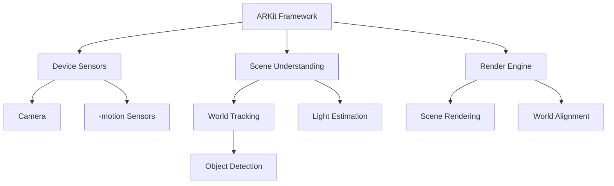

                 

关键词：ARKit、增强现实、iOS、AR体验、开发者、移动设备

摘要：本文将深入探讨苹果公司开发的 ARKit 框架在 iOS 设备上实现增强现实（AR）体验的优势。我们将从背景介绍、核心概念与联系、核心算法原理与操作步骤、数学模型与公式、项目实践、实际应用场景、未来展望等多个角度，全面解析 ARKit 的强大功能与潜力。

## 1. 背景介绍

增强现实（Augmented Reality，简称 AR）是一种通过计算机技术增强用户现实感知的技术。它将虚拟信息与真实世界融合在一起，为用户提供更加丰富和互动的体验。随着智能手机和移动设备的普及，AR技术逐渐成为开发者们关注的焦点。苹果公司的 ARKit 框架作为 iOS 平台的一款重要工具，极大地提升了开发者创建高质量 AR 体验的效率。

ARKit 是苹果公司在 2017 年 WWDC（苹果全球开发者大会）上推出的 AR 开发框架。它利用 iOS 设备的相机、运动传感器和图形处理能力，为开发者提供了创建 AR 应用所需的基本工具和功能。ARKit 的推出，使得 iOS 开发者可以轻松地创建出高质量的 AR 体验，极大地推动了 AR 技术在移动设备上的应用。

## 2. 核心概念与联系

在深入探讨 ARKit 之前，我们需要了解一些核心概念，如 AR、VR、SLAM（Simultaneous Localization and Mapping，即同时定位与地图构建）等。

### 2.1 AR、VR、SLAM 的概念联系

- **AR（增强现实）**：通过在真实世界中叠加虚拟信息，增强用户的感知体验。
- **VR（虚拟现实）**：完全沉浸在一个虚拟构建的世界中，与真实世界隔绝。
- **SLAM**：一种在未知环境中同时进行定位和构建地图的技术，是 AR 技术实现的基础。

### 2.2 Mermaid 流程图

以下是一个简化的 ARKit 架构的 Mermaid 流程图，展示 ARKit 核心组件及其关联：



在这个流程图中，我们可以看到 ARKit 如何通过设备的传感器获取输入数据，然后通过一系列算法实现场景理解、世界跟踪和对象检测等功能，最终在渲染引擎中实现逼真的 AR 体验。

## 3. 核心算法原理 & 具体操作步骤

### 3.1 算法原理概述

ARKit 使用了一系列先进的算法来构建高质量的 AR 体验，包括：

- **相机跟踪**：通过摄像头捕捉实时画面，并使用图像处理技术进行场景识别。
- **世界定位**：利用 SLAM 算法，根据相机捕获的图像和传感器数据，实时构建地图并跟踪位置。
- **对象识别**：通过深度学习模型，识别和分类场景中的物体。
- **光照估计**：根据环境光线条件，调整虚拟物体的光照效果。

### 3.2 算法步骤详解

1. **相机捕获**：ARKit 通过摄像头实时捕获图像。
2. **图像处理**：对捕获的图像进行预处理，如去噪、增强等。
3. **场景识别**：利用深度学习模型，识别场景中的关键特征点。
4. **世界定位**：通过 SLAM 算法，结合传感器数据，实时更新地图并跟踪位置。
5. **对象识别**：识别场景中的物体，并为每个物体创建虚拟锚点。
6. **光照调整**：根据环境光线，调整虚拟物体的光照效果，实现逼真的视觉效果。

### 3.3 算法优缺点

**优点**：

- **高效性**：ARKit 利用 iOS 设备的硬件加速，实现了高性能的 AR 体验。
- **易用性**：提供了简单的 API，降低了 AR 应用开发的难度。
- **广泛的兼容性**：支持多种 iOS 设备，包括 iPhone 和 iPad。

**缺点**：

- **性能限制**：尽管 ARKit 性能强大，但相比专业 AR 设备仍有性能差距。
- **现实环境的复杂性**：在复杂的环境中进行 AR 体验时，可能会遇到识别和定位问题。

### 3.4 算法应用领域

ARKit 在许多领域都有广泛的应用，包括：

- **游戏**：开发 AR 游戏，提供沉浸式的游戏体验。
- **教育**：通过 AR 技术，让学习变得更加生动有趣。
- **零售**：使用 AR 技术进行虚拟试穿、试戴等，提升购物体验。
- **医疗**：通过 AR 技术进行手术指导、疾病诊断等。

## 4. 数学模型和公式 & 详细讲解 & 举例说明

### 4.1 数学模型构建

ARKit 的核心算法涉及到多个数学模型，包括：

- **相机模型**：描述相机成像过程，涉及成像矩阵、镜头畸变等。
- **运动模型**：基于传感器数据，描述设备在三维空间中的运动状态。
- **SLAM 模型**：描述如何同时进行定位和地图构建。

### 4.2 公式推导过程

以下是一个简单的相机成像模型的推导过程：

假设我们有一个摄像机，其成像矩阵为 \( K \)，内参矩阵为 \( D \)，外参矩阵为 \( P \)。则成像过程可以表示为：

\[ \begin{cases} 
x_{c} = P_{x} + \frac{P_{y}}{f} \\ 
y_{c} = P_{y} + \frac{P_{x}}{f} 
\end{cases} \]

其中，\( x_{c} \) 和 \( y_{c} \) 是相机坐标系中的坐标，\( P_{x} \) 和 \( P_{y} \) 是物体在相机坐标系中的坐标，\( f \) 是焦距。

### 4.3 案例分析与讲解

假设我们有一个立方体，其顶点坐标为 \( (x_1, y_1, z_1), (x_2, y_2, z_2), (x_3, y_3, z_3), (x_4, y_4, z_4) \)。使用 ARKit 对其进行投影，我们需要将其顶点坐标转换为相机坐标系中的坐标，然后根据成像模型进行投影。

首先，我们需要计算立方体在相机坐标系中的顶点坐标。假设立方体中心点在相机坐标系中的坐标为 \( (x_{c}, y_{c}, z_{c}) \)，则每个顶点坐标可以表示为：

\[ (x_i, y_i, z_i) = (x_{c} + x_{c,i}, y_{c} + y_{c,i}, z_{c} + z_{c,i}) \]

其中，\( x_{c,i}, y_{c,i}, z_{c,i} \) 是立方体顶点在相机坐标系中的偏移量。

然后，我们将每个顶点坐标代入成像模型中，计算出其在图像平面上的坐标：

\[ \begin{cases} 
x_{i,c} = P_{x} + \frac{P_{y}}{f} \\ 
y_{i,c} = P_{y} + \frac{P_{x}}{f} 
\end{cases} \]

通过这种方式，我们可以将立方体的顶点投影到图像平面上，从而实现 AR 体验。

## 5. 项目实践：代码实例和详细解释说明

### 5.1 开发环境搭建

要开始使用 ARKit 开发 AR 应用，我们需要安装 Xcode 开发工具和设置开发环境。

1. 下载并安装 Xcode。
2. 打开 Xcode，创建一个新的 ARKit 项目。
3. 配置项目所需的权限，如相机权限。

### 5.2 源代码详细实现

以下是一个简单的 ARKit 示例，演示如何使用 ARKit 创建一个简单的 AR 体验。

```swift
import ARKit

class ViewController: UIViewController, ARSCNViewDelegate {
    var sceneView: ARSCNView!
    
    override func viewDidLoad() {
        super.viewDidLoad()
        
        // 初始化 ARSCNView
        sceneView = ARSCNView(frame: view.bounds)
        sceneView.delegate = self
        view.addSubview(sceneView)
        
        // 配置 ARSCNView
        let configuration = ARWorldTrackingConfiguration()
        sceneView.session.run(configuration)
    }
    
    func renderer(_ renderer: SCNSceneRenderer, didAdd node: SCNNode, for anchor: ARAnchor) {
        // 创建一个立方体
        let boxGeometry = SCNBox(width: 0.1, height: 0.1, length: 0.1)
        let boxMaterial = SCNMaterial()
        boxMaterial.diffuse.contents = UIColor.red
        let boxNode = SCNNode(geometry: boxGeometry, material: boxMaterial)
        
        // 将立方体添加到节点
        node.addChildNode(boxNode)
    }
}
```

在这个示例中，我们创建了一个简单的 ARSCNView，并配置了一个 ARWorldTrackingConfiguration。当 ARAnchor 被添加到场景中时，我们将一个红色立方体添加到该锚点上。

### 5.3 代码解读与分析

1. **初始化 ARSCNView**：我们创建了一个 ARSCNView 并将其添加到视图中。这个视图将显示 AR 体验。
2. **配置 ARSCNView**：我们使用 ARWorldTrackingConfiguration 配置 ARSCNView，这将启用世界跟踪功能。
3. **渲染器回调**：当渲染器为 ARAnchor 添加节点时，我们创建了一个红色立方体并将其添加到节点中。

通过这个简单的示例，我们可以看到如何使用 ARKit 创建一个基本的 AR 体验。

### 5.4 运行结果展示

运行这个示例后，你将看到红色立方体出现在现实世界中。你可以通过旋转、缩放和移动设备来与立方体互动，从而体验 AR 的乐趣。

## 6. 实际应用场景

ARKit 在许多领域都有广泛的应用。以下是一些实际应用场景：

### 6.1 游戏

ARKit 使开发者能够创建令人兴奋的 AR 游戏，如《Pokemon Go》等。这些游戏通过将虚拟角色和场景与现实世界融合，提供了独特的互动体验。

### 6.2 教育

ARKit 可以用于教育应用，如虚拟实验室、交互式教材等。通过 AR 技术，学生可以更加生动地学习复杂的概念。

### 6.3 零售

零售业可以利用 ARKit 提供虚拟试穿、试戴等服务。消费者可以在购买前直观地看到商品的真实效果。

### 6.4 医疗

在医疗领域，ARKit 可以用于手术指导、疾病诊断等。医生可以通过 AR 技术更好地理解患者的状况，提高诊断和治疗效果。

## 7. 工具和资源推荐

### 7.1 学习资源推荐

- **官方文档**：苹果官方的 ARKit 文档是学习 ARKit 的最佳资源。
- **在线教程**：许多在线平台提供了 ARKit 的教程和示例，如 Ray Wenderlich、Swift by Sundell 等。
- **书籍**：《ARKit Development Cookbook》、《iOS ARKit Projects》等书籍详细介绍了 ARKit 的使用方法。

### 7.2 开发工具推荐

- **Xcode**：苹果官方的开发工具，用于开发 ARKit 应用。
- **ARKit Playground**：一个交互式的学习工具，可以帮助开发者更好地理解 ARKit 的功能。

### 7.3 相关论文推荐

- **《An Overview of ARKit 1.5 for iOS Developers》**：该论文详细介绍了 ARKit 1.5 的新功能。
- **《SLAM in ARKit: The Journey Begins》**：这篇文章探讨了 ARKit 如何实现 SLAM 技术。

## 8. 总结：未来发展趋势与挑战

### 8.1 研究成果总结

ARKit 自推出以来，已经取得了显著的成果。它极大地降低了 iOS 开发者创建 AR 体验的门槛，推动了 AR 技术在移动设备上的应用。未来，ARKit 有望继续完善，提供更强大的功能和更优的性能。

### 8.2 未来发展趋势

1. **性能提升**：随着硬件技术的进步，ARKit 的性能有望得到显著提升。
2. **功能扩展**：ARKit 可能会引入更多的功能，如人脸识别、手势识别等。
3. **跨平台发展**：ARKit 有望支持更多平台，如 macOS、watchOS 等。

### 8.3 面临的挑战

1. **性能瓶颈**：尽管 ARKit 性能强大，但相比专业 AR 设备仍有性能差距。
2. **环境适应性**：在复杂的环境中进行 AR 体验时，可能会遇到识别和定位问题。

### 8.4 研究展望

未来，ARKit 有望在多个领域得到广泛应用，如教育、医疗、零售等。同时，随着 AR 技术的不断发展，ARKit 也将不断进化，提供更丰富、更逼真的 AR 体验。

## 9. 附录：常见问题与解答

### 9.1 Q：如何处理 ARKit 的性能瓶颈？

A：可以通过优化算法、减少渲染复杂度、使用离线处理等方法来提高 ARKit 的性能。

### 9.2 Q：如何在复杂环境中提高 ARKit 的识别和定位能力？

A：可以通过提高传感器的精度、使用多传感器融合技术、优化图像处理算法等方法来提高 ARKit 在复杂环境中的表现。

---

作者：禅与计算机程序设计艺术 / Zen and the Art of Computer Programming

本文旨在全面解析 ARKit 的优势和应用，帮助开发者更好地利用这一强大工具，为用户提供出色的 AR 体验。随着 AR 技术的不断进步，ARKit 必将在未来发挥更加重要的作用。希望通过本文，开发者能够对 ARKit 有更深入的了解，并在实际开发中充分发挥其潜力。

