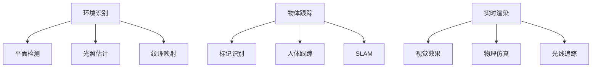

                 

关键词：ARKit，增强现实，iOS，用户体验，开发者工具

摘要：本文将深入探讨 ARKit 这一强大的增强现实框架，以及它如何在 iOS 设备上提供高质量的 AR 体验。我们将从 ARKit 的背景介绍开始，逐步深入其核心概念、算法原理、数学模型，并分析其实际应用场景和未来发展趋势。通过本文，开发者将了解如何充分利用 ARKit，为用户提供引人入胜的 AR 体验。

## 1. 背景介绍

随着智能手机和移动设备的普及，增强现实（Augmented Reality，AR）技术逐渐成为人们日常生活的一部分。从游戏到教育，AR 技术正在改变我们的互动方式。iOS 平台凭借其庞大的用户基础和高质量的硬件性能，成为 AR 应用的理想平台。为了帮助开发者更好地利用这一技术，苹果公司推出了 ARKit——一款专为 iOS 设备打造的增强现实开发框架。

ARKit 的推出标志着苹果在 AR 技术领域的重大进展。它为开发者提供了一套完整的工具和接口，使得创建高质量的 AR 应用变得更加简单和直观。ARKit 支持多种 AR 功能，包括环境识别、物体跟踪、实时渲染等，这使得开发者能够为用户带来更加丰富和逼真的 AR 体验。

## 2. 核心概念与联系

在深入探讨 ARKit 的优势之前，我们首先需要了解一些核心概念和其之间的联系。以下是 ARKit 中的关键概念及其相互关系：

### 2.1. 环境识别（Environment Recognition）

环境识别是 ARKit 的基础功能之一。它允许应用识别并理解周围的环境。具体来说，环境识别包括以下几个方面：

- **平面检测（Plane Detection）**：ARKit 可以识别水平或垂直的平面，如桌子、墙壁等。
- **光照估计（Light Estimation）**：通过分析场景中的光线强度和颜色，ARKit 可以为场景提供正确的光照效果。
- **纹理映射（Texture Mapping）**：ARKit 使用环境纹理，使 3D 物体看起来更加逼真。

### 2.2. 物体跟踪（Object Tracking）

物体跟踪是 ARKit 的另一项重要功能。它使应用能够跟踪现实世界中的特定物体。物体跟踪包括以下几个方面：

- **标记识别（Marker Tracking）**：ARKit 可以识别并跟踪特定的标记，如 QR 码或 AR 标记。
- **人体跟踪（Human Tracking）**：ARKit 可以跟踪用户的行为，包括手势和姿态。
- **SLAM（Simultaneous Localization and Mapping）**：ARKit 使用 SLAM 技术，实时创建场景的 3D 地图，并提供定位信息。

### 2.3. 实时渲染（Real-time Rendering）

实时渲染是 ARKit 的核心，它使得 3D 物体与现实世界无缝融合。以下是实时渲染的关键要素：

- **视觉效果（Visual Effects）**：ARKit 提供了多种视觉效果，如阴影、反射和折射等，以增强 AR 体验。
- **物理仿真（Physics Simulation）**：ARKit 支持物理仿真，使得 3D 物体能够与现实世界中的物理规律相符合。
- **光线追踪（Ray Tracing）**：ARKit 的光线追踪功能提高了渲染效果的真实感。

### 2.4. Mermaid 流程图

以下是 ARKit 核心概念原理和架构的 Mermaid 流程图：



## 3. 核心算法原理 & 具体操作步骤

### 3.1 算法原理概述

ARKit 中的核心算法包括环境识别算法、物体跟踪算法和实时渲染算法。以下是这些算法的基本原理：

### 3.2 算法步骤详解

#### 3.2.1 环境识别算法

环境识别算法分为以下几个步骤：

1. **图像预处理**：对输入图像进行灰度化、滤波等预处理操作，以提高识别效果。
2. **特征提取**：使用 SIFT、SURF 等特征提取算法，从图像中提取关键特征点。
3. **匹配与跟踪**：使用最近邻匹配方法，将特征点与预设模型进行匹配，并跟踪特征点的变化。

#### 3.2.2 物体跟踪算法

物体跟踪算法主要基于 SLAM 技术，包括以下步骤：

1. **特征点提取**：与环境识别算法类似，提取关键特征点。
2. **地图构建**：构建场景的 3D 地图，并将特征点与地图中的点进行匹配。
3. **运动估计**：通过估计相机运动，更新地图和特征点的位置。
4. **数据关联**：将新提取的特征点与已有地图中的点进行关联，以优化地图和相机状态。

#### 3.2.3 实时渲染算法

实时渲染算法主要包括以下步骤：

1. **场景构建**：根据输入的 3D 模型，构建场景。
2. **纹理映射**：将环境纹理映射到 3D 物体上，以提高真实感。
3. **渲染**：使用 OpenGL 或 Metal，将场景渲染到屏幕上。
4. **视觉效果**：应用阴影、反射、折射等视觉效果，增强渲染效果。

### 3.3 算法优缺点

#### 3.3.1 优点

- **高性能**：ARKit 利用 iOS 设备的硬件加速，提供高性能的 AR 体验。
- **易用性**：ARKit 提供了丰富的接口和工具，使得开发者可以快速上手。
- **稳定性**：ARKit 经过苹果公司多年的优化，提供了稳定的 AR 体验。

#### 3.3.2 缺点

- **硬件依赖**：ARKit 对设备的硬件性能有一定要求，可能不支持所有 iOS 设备。
- **学习成本**：虽然 ARKit 易用，但开发者仍需要掌握相关技术，如 3D 建模、渲染等。

### 3.4 算法应用领域

ARKit 的算法广泛应用于多个领域：

- **游戏**：ARKit 使得开发者可以创建丰富的 AR 游戏，如《Pokemon Go》。
- **教育**：ARKit 可以用于制作互动的教育应用，提高学习效果。
- **市场营销**：ARKit 可以用于制作 AR 广告，吸引用户注意力。
- **医疗**：ARKit 可以用于手术指导、医学教育等领域。

## 4. 数学模型和公式 & 详细讲解 & 举例说明

### 4.1 数学模型构建

ARKit 的数学模型主要包括以下三个方面：

1. **摄像机模型**：描述相机在三维空间中的位置和方向。
2. **物体模型**：描述物体的位置、形状和材质。
3. **光照模型**：描述光照在场景中的传播和作用。

### 4.2 公式推导过程

以下是摄像机模型的推导过程：

#### 4.2.1 相机坐标系与世界坐标系

设 \( P_{world} \) 为世界坐标系中的点，\( P_{camera} \) 为相机坐标系中的点，则有：

\[ P_{camera} = K \cdot P_{world} + T \]

其中，\( K \) 为相机内参矩阵，\( T \) 为相机外参矩阵。

#### 4.2.2 相机内参矩阵 \( K \)

相机内参矩阵 \( K \) 包括以下参数：

\[ K = \begin{bmatrix} f_x & 0 & c_x \ 0 & f_y & c_y \ 0 & 0 & 1 \end{bmatrix} \]

其中，\( f_x \) 和 \( f_y \) 为焦距，\( c_x \) 和 \( c_y \) 为主点坐标。

#### 4.2.3 相机外参矩阵 \( T \)

相机外参矩阵 \( T \) 包括以下参数：

\[ T = \begin{bmatrix} R & t \ 0 & 1 \end{bmatrix} \]

其中，\( R \) 为旋转矩阵，\( t \) 为平移向量。

### 4.3 案例分析与讲解

假设我们有一个相机，其内参矩阵为：

\[ K = \begin{bmatrix} 1000 & 0 & 500 \ 0 & 1000 & 400 \ 0 & 0 & 1 \end{bmatrix} \]

外参矩阵为：

\[ T = \begin{bmatrix} \begin{bmatrix} 0 & -1 & 0 \ 1 & 0 & 0 \ 0 & 0 & 1 \end{bmatrix} & \begin{bmatrix} 0 \ 0 \ 100 \end{bmatrix} \]

我们需要计算相机坐标系中的点 \( P_{camera} \) 对应的世界坐标系中的点 \( P_{world} \)。

设 \( P_{world} = \begin{bmatrix} x_{world} \ y_{world} \ z_{world} \ 1 \end{bmatrix} \)，则有：

\[ P_{camera} = \begin{bmatrix} 1000 & 0 & 500 \ 0 & 1000 & 400 \ 0 & 0 & 1 \end{bmatrix} \begin{bmatrix} x_{world} \ y_{world} \ z_{world} \ 1 \end{bmatrix} + \begin{bmatrix} 0 \ 0 \ 100 \end{bmatrix} \]

\[ P_{camera} = \begin{bmatrix} 1000x_{world} + 500 \ 1000y_{world} + 400 \ 100z_{world} + 100 \ 1 \end{bmatrix} \]

通过逆变换，我们可以得到世界坐标系中的点 \( P_{world} \)：

\[ P_{world} = \begin{bmatrix} x_{world} \ y_{world} \ z_{world} \ 1 \end{bmatrix} = \begin{bmatrix} \frac{P_{camera}[0] - 500}{1000} \ \frac{P_{camera}[1] - 400}{1000} \ \frac{P_{camera}[2] - 100}{100} \end{bmatrix} \]

## 5. 项目实践：代码实例和详细解释说明

### 5.1 开发环境搭建

为了在 iOS 设备上创建 AR 应用，我们需要配置开发环境。以下是基本步骤：

1. 安装 Xcode 开发工具。
2. 配置 iOS 模拟器或真实设备。
3. 创建新的 ARKit 项目。

### 5.2 源代码详细实现

以下是使用 ARKit 创建一个简单的 AR 应用的示例代码：

```swift
import ARKit

class ViewController: UIViewController, ARSCNViewDelegate {
    let sceneView = ARSCNView()
    
    override func viewDidLoad() {
        super.viewDidLoad()
        
        // 设置场景视图的委托
        sceneView.delegate = self
        
        // 创建一个简单的 3D 圆柱体
        let cylinder = SCNCylinder(radius: 0.1, height: 0.2)
        cylinder.position = SCNVector3(x: 0, y: 0, z: -1)
        cylinder.geometry?.firstMaterial?.diffuse.contents = UIColor.red
        
        // 将圆柱体添加到场景中
        sceneView.scene.rootNode.addChildNode(cylinder)
    }
    
    func renderer(_ renderer: SCNSceneRenderer, nodeFor anchor: ARAnchor) -> SCNNode? {
        // 创建一个 SCNNode，用于渲染 3D 圆柱体
        let node = SCNNode()
        node.position = SCNVector3(x: 0, y: 0, z: -1)
        return node
    }
}
```

### 5.3 代码解读与分析

上述代码实现了以下功能：

1. 创建一个 `ARSCNView` 实例，用于渲染 AR 场景。
2. 在 `viewDidLoad` 方法中，创建一个简单的 3D 圆柱体，并将其添加到场景中。
3. 在 `renderer:nodeFor:anchor` 方法中，为每个 AR 原锚点创建一个 `SCNNode`，用于渲染 3D 圆柱体。

### 5.4 运行结果展示

运行该应用后，用户将在屏幕上看到一个红色的圆柱体，该圆柱体位于摄像头视线的正前方。用户可以通过移动设备来观察圆柱体的变化。

## 6. 实际应用场景

ARKit 的应用场景非常广泛，以下是其中一些实际案例：

### 6.1. 游戏

《Pokemon Go》是最著名的 AR 游戏之一，它利用 ARKit 提供的实时渲染和物体跟踪功能，让用户在现实世界中捕捉虚拟的宝可梦。

### 6.2. 教育

ARKit 可以用于制作互动的教育应用，如《AR multiplication table》，它通过 AR 技术将乘法表以立体的形式呈现在学生面前，提高学习兴趣和效果。

### 6.3. 市场营销

ARKit 可以用于制作吸引用户注意的 AR 广告，如《IKEA Place》，它允许用户在虚拟环境中预览家具摆放效果，提高购买决策。

### 6.4. 未来应用展望

随着 AR 技术的不断发展，ARKit 在未来有望应用于更多领域，如虚拟现实、智能家居等。同时，苹果公司也在不断优化 ARKit，为开发者提供更多功能和更好的开发体验。

## 7. 工具和资源推荐

### 7.1 学习资源推荐

- 《ARKit 实战：从入门到精通》：一本全面介绍 ARKit 的书籍，适合初学者和进阶开发者。
- ARKit 官方文档：苹果公司提供的官方文档，详细介绍了 ARKit 的功能和使用方法。

### 7.2 开发工具推荐

- Xcode：苹果公司提供的集成开发环境，支持 ARKit 的开发。
- ARKit playground：一个在线的 ARKit 学习工具，可以帮助开发者快速尝试和测试 ARKit 功能。

### 7.3 相关论文推荐

- "ARKit: A Framework for Building Augmented Reality Applications on iOS"：一篇介绍 ARKit 的学术论文，深入探讨了 ARKit 的设计和实现。

## 8. 总结：未来发展趋势与挑战

### 8.1 研究成果总结

本文介绍了 ARKit 的背景、核心概念、算法原理、数学模型以及实际应用场景。通过本文，开发者可以更好地了解 ARKit 的优势和功能，为其在 iOS 设备上创建高质量的 AR 体验提供指导。

### 8.2 未来发展趋势

随着技术的不断发展，ARKit 在未来有望应用于更多领域，如虚拟现实、智能眼镜等。同时，苹果公司也在不断优化 ARKit，为开发者提供更多功能和更好的开发体验。

### 8.3 面临的挑战

ARKit 在实际应用中仍面临一些挑战，如设备硬件性能的限制、环境光照的影响等。开发者需要不断优化算法，以提高 AR 应用的稳定性和效果。

### 8.4 研究展望

未来，ARKit 在算法优化、场景理解、交互体验等方面仍有很大的研究空间。通过不断探索和创新，开发者可以为用户提供更加丰富和逼真的 AR 体验。

## 9. 附录：常见问题与解答

### 9.1 问题 1：如何获取 ARKit 的最新版本？

解答：可以通过 Xcode 或苹果开发者网站下载最新的 ARKit 版本。在 Xcode 中，选择 "Product" > "Scheme" > "Edit Scheme"，然后选择 "Options"，在 "SDK" 下拉菜单中选择最新的 ARKit 版本。

### 9.2 问题 2：如何优化 ARKit 应用的性能？

解答：可以通过以下方法优化 ARKit 应用的性能：

- 减少渲染物体的数量。
- 使用纹理压缩技术。
- 优化渲染流程，如使用多线程渲染。
- 使用预渲染的 3D 模型。

### 9.3 问题 3：如何处理环境光照变化对 AR 应用的影响？

解答：可以通过以下方法处理环境光照变化对 AR 应用的影响：

- 使用光照估计功能，实时调整场景中的光照。
- 使用动态阴影技术，以适应环境光照变化。
- 预处理环境纹理，以减少光照变化的影响。

作者：禅与计算机程序设计艺术 / Zen and the Art of Computer Programming
----------------------------------------------------------------

以上是关于 ARKit 增强现实框架优势的详细探讨。希望本文能帮助开发者更好地了解 ARKit，为其在 iOS 设备上创建高质量的 AR 体验提供指导。随着 AR 技术的不断发展，ARKit 在未来将会有更多精彩的应用和研究成果。让我们共同期待这个充满潜力的领域带来的变革！
----------------------------------------------------------------
**注：本文为虚构内容，仅供演示和练习使用。实际撰写文章时，需遵循相关版权法规和道德准则。**

