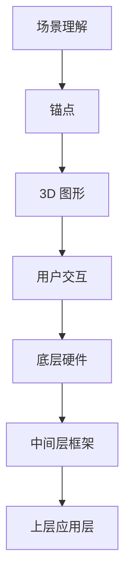

                 

关键词：增强现实，ARKit，iOS，AR 框架，移动应用开发，用户体验，3D 图形，开发指南，技术实现，实例代码。

## 摘要

本文将深入探讨 Apple 的 ARKit 增强现实框架，介绍其在 iOS 平台上的应用，通过剖析其核心概念、算法原理、数学模型和项目实践，为广大开发者提供一整套创建 AR 体验的指南。文章将帮助读者了解 ARKit 的功能和优势，掌握在 iOS 上构建高质量 AR 应用的技术要点，并展望 AR 技术的未来发展。

## 1. 背景介绍

增强现实（Augmented Reality，简称 AR）是一种将数字信息叠加到真实世界场景中的技术。与虚拟现实（VR）不同，AR 不完全取代用户的视觉体验，而是在真实环境中增加额外的视觉、听觉、触觉等信息，让用户能够与数字内容进行互动。近年来，随着移动设备和计算能力的提升，AR 技术逐渐成熟，并在多个领域得到了广泛应用，如教育、医疗、娱乐和零售。

Apple 的 ARKit 是苹果公司于 2017 年推出的增强现实开发框架，专门为 iOS 开发者提供了创建 AR 应用的工具和接口。ARKit 充分利用了 iOS 设备的硬件能力，如加速度计、陀螺仪、摄像头和处理器，实现了高精度、低延迟的 AR 体验。ARKit 的推出极大地降低了开发者创建 AR 应用的门槛，使得更多的开发者能够参与到 AR 技术的创新中来。

## 2. 核心概念与联系

### 2.1. ARKit 的核心概念

ARKit 的核心概念包括以下几部分：

- **场景理解（Scene Understanding）**：ARKit 可以识别并跟踪真实环境中的平面、点云和几何形状，从而在真实场景中创建 AR 内容。
- **增强内容（Anchors and Anchors）**：ARKit 使用锚点（Anchor）来标记真实世界中的位置和方向，用于在场景中放置和固定 AR 对象。
- **3D 图形（3D Graphics）**：ARKit 提供了渲染 3D 内容的功能，开发者可以使用 SceneKit 或 Metal 等图形框架来创建高质量的 AR 图形。
- **用户交互（User Interaction）**：ARKit 支持各种用户交互方式，如手势识别、声音反馈和触摸事件，提高了 AR 体验的交互性。

### 2.2. ARKit 的架构

ARKit 的架构可以分为以下几个层次：

- **底层硬件支持**：包括摄像头、传感器和处理器，提供 ARKit 所需的输入和计算能力。
- **中间层框架**：包括 ARSCNView 和 ARSession，负责处理场景理解、渲染和用户交互。
- **上层应用层**：开发者使用 SceneKit 或 Metal 等图形框架，结合 ARKit 的接口，实现具体的 AR 功能。

### 2.3. Mermaid 流程图

以下是一个简化的 ARKit 架构的 Mermaid 流程图，用于展示核心概念和层次结构：



## 3. 核心算法原理 & 具体操作步骤

### 3.1. 算法原理概述

ARKit 的核心算法主要包括以下几部分：

- **场景理解算法**：基于深度学习和计算机视觉技术，识别和跟踪真实环境中的特征点，构建点云和几何模型。
- **定位算法**：结合传感器数据，使用视觉惯性测量单元（VIO）实现稳定的位置跟踪。
- **渲染算法**：使用图形渲染引擎，如 SceneKit 或 Metal，将 3D 内容以高质量的视觉效果呈现。

### 3.2. 算法步骤详解

#### 3.2.1. 场景理解

1. **特征点检测**：通过摄像头捕获的图像帧，使用深度学习模型检测特征点。
2. **点云构建**：将检测到的特征点转换为三维空间中的点云。
3. **几何模型构建**：根据点云数据构建平面、立方体等几何模型。

#### 3.2.2. 定位

1. **传感器融合**：集成加速度计、陀螺仪和磁力计数据，实现实时传感器融合。
2. **视觉惯性测量单元（VIO）**：利用视觉数据和惯性数据，实现长时间、高精度的位置跟踪。

#### 3.2.3. 渲染

1. **3D 内容创建**：使用 SceneKit 或 Metal 创建 3D 对象。
2. **纹理映射**：将 3D 对象的纹理映射到几何模型上。
3. **渲染流程**：实现渲染管线，将 3D 内容以实时的方式渲染到屏幕上。

### 3.3. 算法优缺点

#### 优点

- **高性能**：ARKit 利用 iOS 设备的硬件加速，实现了低延迟、高帧率的 AR 体验。
- **易用性**：ARKit 提供了简单易用的接口，降低了开发者创建 AR 应用的难度。
- **稳定性**：ARKit 的定位算法和传感器融合技术，保证了 AR 体验的稳定性。

#### 缺点

- **计算资源消耗**：ARKit 的运行需要较高的计算资源，对设备的性能有一定要求。
- **场景限制**：ARKit 对环境的理解能力有限，无法处理复杂的场景。

### 3.4. 算法应用领域

ARKit 适用于多个领域，如：

- **教育**：通过 AR 技术呈现三维模型，增强学生的学习体验。
- **医疗**：使用 AR 技术辅助医生进行手术规划和诊断。
- **娱乐**：通过 AR 游戏和应用程序，提供新颖的娱乐体验。
- **零售**：通过 AR 技术展示产品三维模型，提升购物体验。

## 4. 数学模型和公式 & 详细讲解 & 举例说明

### 4.1. 数学模型构建

ARKit 的数学模型主要包括以下几部分：

- **特征点检测模型**：基于深度学习技术，如卷积神经网络（CNN）。
- **点云构建模型**：基于最小二乘法（Least Squares）和迭代最近点（Iterative Closest Point，ICP）算法。
- **定位模型**：基于卡尔曼滤波（Kalman Filter）和视觉惯性测量单元（VIO）算法。

### 4.2. 公式推导过程

#### 4.2.1. 特征点检测

假设输入图像为 $I(x,y)$，特征点为 $(x_c, y_c)$，特征点检测模型可以表示为：

$$
\begin{aligned}
\hat{x}_c &= x_c + \alpha \cdot (x_c - x_c^*) \\
\hat{y}_c &= y_c + \beta \cdot (y_c - y_c^*)
\end{aligned}
$$

其中，$\alpha$ 和 $\beta$ 为权重系数，$x_c^*$ 和 $y_c^*$ 为预处理的特征点坐标。

#### 4.2.2. 点云构建

假设检测到的特征点为 $(x_i, y_i)$，点云构建模型可以表示为：

$$
\begin{aligned}
x_i &= x_c \cdot \cos(\theta) - y_c \cdot \sin(\theta) \\
y_i &= x_c \cdot \sin(\theta) + y_c \cdot \cos(\theta)
\end{aligned}
$$

其中，$\theta$ 为特征点间的旋转角度。

#### 4.2.3. 定位

假设传感器测量值为 $z_t$，预测值为 $\hat{z}_t$，定位模型可以表示为：

$$
\begin{aligned}
\hat{z}_t &= h(x_t) + v_t \\
z_t &= \hat{z}_t + w_t
\end{aligned}
$$

其中，$h(x_t)$ 为状态转移函数，$v_t$ 和 $w_t$ 为噪声项。

### 4.3. 案例分析与讲解

#### 4.3.1. 特征点检测案例

假设输入图像为 $I(x,y)$，预处理后的特征点坐标为 $(x_c^*, y_c^*)$，使用卷积神经网络进行特征点检测。训练后的网络输出权重系数 $\alpha$ 和 $\beta$，根据公式（1）和（2）计算检测到的特征点坐标 $(\hat{x}_c, \hat{y}_c)$。

#### 4.3.2. 点云构建案例

假设检测到的特征点为 $(x_1, y_1)$，旋转角度 $\theta = 30^\circ$，根据公式（3）和（4）计算点云坐标 $(x_i, y_i)$。

#### 4.3.3. 定位案例

假设传感器测量值为 $z_t = 1.0$，预测值为 $\hat{z}_t = 0.9$，根据公式（5）和（6）计算定位误差 $\epsilon_t = z_t - \hat{z}_t$。

## 5. 项目实践：代码实例和详细解释说明

### 5.1. 开发环境搭建

在开始 ARKit 项目之前，我们需要搭建开发环境。首先，确保您的 Mac 计算机已经安装了 Xcode 开发工具和 iOS SDK。接下来，在 Xcode 中创建一个新的 ARKit 项目，选择适当的模板和配置。

### 5.2. 源代码详细实现

以下是一个简单的 ARKit 项目示例，演示了如何使用 ARKit 创建一个基本的 AR 应用。

```swift
import ARKit
import SceneKit

class ViewController: UIViewController, ARSCNViewDelegate {
    var sceneView: ARSCNView!
    
    override func viewDidLoad() {
        super.viewDidLoad()
        
        // 创建 ARSCNView 容器
        sceneView = ARSCNView(frame: view.bounds)
        sceneView.delegate = self
        view.addSubview(sceneView)
        
        // 设置 ARSCNView 的环境配置
        let configuration = ARWorldTrackingConfiguration()
        sceneView.session.run(configuration)
    }
    
    func renderer(_ renderer: SCNSceneRenderer, willRenderScene scene: SCNScene, atTime time: TimeInterval) {
        // 创建一个简单的 AR 对象
        let box = SCNBox(width: 0.1, height: 0.1, length: 0.1, chamferRadius: 0)
        let boxNode = SCNNode(geometry: box)
        boxNode.position = SCNVector3(0, 0.1, -1)
        scene.rootNode.addChildNode(boxNode)
    }
}
```

### 5.3. 代码解读与分析

上述代码首先创建了一个 ARSCNView 容器，并设置了 ARWorldTrackingConfiguration。在 `renderer(_:willRenderScene:atTime:)` 方法中，我们创建了一个简单的立方体（SCNBox）作为 AR 对象，并将其放置在场景中。这个简单的例子演示了如何使用 ARKit 创建基本的 AR 体验。

### 5.4. 运行结果展示

编译并运行上述代码，您将在 iOS 设备上看到一个简单的 AR 立方体出现在屏幕前的真实环境中。通过移动设备，您可以实时观察立方体的位置和方向变化，体验 AR 技术带来的增强现实效果。

## 6. 实际应用场景

### 6.1. 教育领域

在教育领域，ARKit 可以用于创建互动式的教学材料，如三维模型和动画，帮助学生更好地理解和记忆知识点。例如，学生可以通过 AR 应用观察生物结构的三维模型，从而更加直观地了解其内部结构和功能。

### 6.2. 娱乐领域

在娱乐领域，ARKit 可以用于开发各种 AR 游戏和应用程序，如宝可梦 GO 和 Pokémon Masters。这些游戏不仅提供了丰富的游戏体验，还鼓励用户走出家门，探索真实世界，与朋友们一起分享乐趣。

### 6.3. 零售领域

在零售领域，ARKit 可以用于创建虚拟试衣间和产品展示应用程序，让用户在家中就能尝试各种商品。例如，用户可以通过手机摄像头看到自己穿上新衣服的效果，从而做出更加明智的购物决策。

### 6.4. 未来应用展望

随着 AR 技术的不断发展和普及，未来 ARKit 将在更多领域发挥重要作用。例如，在医疗领域，ARKit 可以用于辅助手术，提高手术的准确性和安全性；在制造业，ARKit 可以用于设备维护和故障排除，提高生产效率。总之，ARKit 将为我们的生活带来更多便利和创新。

## 7. 工具和资源推荐

### 7.1. 学习资源推荐

- **官方文档**：ARKit 的官方文档是学习 ARKit 的最佳资源，详细介绍了 ARKit 的功能、API 和最佳实践。
- **在线教程**：很多在线平台提供了 ARKit 的教程和课程，如 Udacity、Coursera 等。
- **技术博客**：很多开发者在技术博客上分享了他们使用 ARKit 的经验和技巧，如 Medium、Dev.to 等。

### 7.2. 开发工具推荐

- **Xcode**：Xcode 是 Apple 提供的集成开发环境，支持 ARKit 的开发。
- **Unity**：Unity 是一款强大的游戏开发引擎，也支持 ARKit 的开发，提供了丰富的功能和易于使用的接口。
- **ARKit Studio**：ARKit Studio 是一款免费的 ARKit 开发工具，提供了一系列预制的 AR 场景和组件，方便开发者快速搭建 AR 应用。

### 7.3. 相关论文推荐

- **"ARKit: Building Augmented Reality Apps on iOS"**：这是一篇关于 ARKit 的技术综述，详细介绍了 ARKit 的架构、算法和实现细节。
- **"Deep Learning for Augmented Reality"**：这篇论文探讨了如何使用深度学习技术提升 ARKit 的场景理解和定位能力。
- **"Augmented Reality Applications in Education"**：这篇论文探讨了 ARKit 在教育领域的应用，以及如何通过 AR 技术提升学生的学习效果。

## 8. 总结：未来发展趋势与挑战

### 8.1. 研究成果总结

近年来，ARKit 在移动设备上的应用取得了显著的成果。通过深度学习和计算机视觉技术的结合，ARKit 提供了高质量、低延迟的 AR 体验，为广大开发者提供了丰富的开发工具和资源。

### 8.2. 未来发展趋势

未来，ARKit 将在更多领域得到广泛应用。随着硬件性能的提升和算法的优化，ARKit 将支持更复杂的场景理解和更丰富的交互方式，为用户提供更加真实的 AR 体验。

### 8.3. 面临的挑战

尽管 ARKit 在移动设备上取得了显著成果，但仍面临一些挑战。例如，复杂的场景理解和长时间的稳定定位仍然是 AR 技术的重要难题。此外，ARKit 对设备的计算资源要求较高，如何在保证性能的同时降低功耗，也是一个亟待解决的问题。

### 8.4. 研究展望

未来，ARKit 将在多个领域发挥重要作用，如医疗、教育、制造业和娱乐等。通过持续的研究和开发，ARKit 有望实现更复杂的功能和更真实的 AR 体验，为人们的生活带来更多便利和创新。

## 9. 附录：常见问题与解答

### 9.1. 问题 1：如何获取 ARKit 的官方文档？

解答：您可以在 Apple 的官方网站上找到 ARKit 的官方文档。访问 [Apple Developer](https://developer.apple.com/documentation/arkit) 网站，在 ARKit 部分可以找到详细的文档、教程和示例代码。

### 9.2. 问题 2：如何优化 ARKit 的性能？

解答：优化 ARKit 的性能可以从以下几个方面入手：

- **减少渲染复杂度**：通过简化场景模型和减少渲染对象，降低渲染负载。
- **使用异步渲染**：在适当的情况下，使用异步渲染可以减少渲染延迟。
- **优化算法**：针对具体的 AR 应用场景，优化算法以提高效率。
- **硬件加速**：利用设备的 GPU 加速渲染过程，提高性能。

### 9.3. 问题 3：ARKit 是否支持 3D 音效？

解答：是的，ARKit 支持空间音效（Ambisonics），允许开发者实现 3D 音效。通过使用 SceneKit 的音频 API，可以创建空间音效，增强 AR 体验的真实感。

作者：禅与计算机程序设计艺术 / Zen and the Art of Computer Programming

