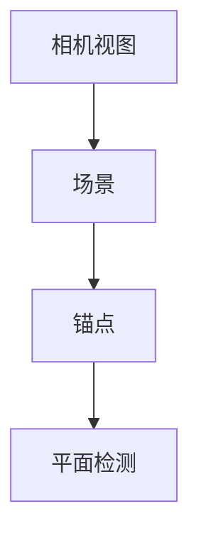

                 

关键词：增强现实、ARKit、iOS、开发框架、增强现实体验、AR 应用、移动平台、虚拟现实技术

> 摘要：本文将深入探讨 ARKit，苹果公司为其 iOS 设备开发的增强现实（AR）框架。我们将了解 ARKit 的核心概念、工作原理、使用方法以及在实际项目中的应用，从而帮助读者更好地掌握 AR 技术在移动平台上的开发与实践。

## 1. 背景介绍

随着智能手机和移动设备的普及，增强现实（AR）技术正逐渐走入大众的视野。AR 技术通过将虚拟内容与现实世界相结合，为用户带来全新的交互体验。苹果公司在 iOS 设备上推出的 ARKit，为开发者提供了一套完整的 AR 开发工具和框架，使得在移动平台上创建 AR 应用变得更加简单和高效。

### ARKit 的历史

ARKit 的第一个版本于 2017 年 6 月在苹果的 WWDC（苹果全球开发者大会）上发布。自那时以来，ARKit 不断发展，引入了许多新的功能和改进，以支持更复杂的 AR 场景和应用。

### ARKit 的优势

- **强大的性能**：ARKit 利用 iOS 设备的硬件加速技术，如 Metal 和 Core ML，提供高效的 AR 体验。
- **易于集成**：ARKit 提供了一套易于使用的 API，使得开发者可以快速地创建 AR 应用。
- **丰富的功能**：ARKit 包含了诸如环境光估计、增强现实物体识别和追踪等功能，极大地丰富了 AR 应用的可能性。

## 2. 核心概念与联系

### ARKit 的核心概念

ARKit 基于以下几个核心概念：

- **相机视图**：ARKit 提供了一个相机视图，允许开发者实时获取设备摄像头的图像。
- **场景**：场景是 ARKit 中用于表示虚拟内容的容器。
- **锚点**：锚点是 ARKit 中的一个关键概念，用于标记现实世界中的特定位置。
- **平面检测**：ARKit 可以检测到现实世界中的平面，如桌子、墙壁等，为虚拟内容提供合适的放置位置。

### Mermaid 流程图

下面是一个简单的 Mermaid 流程图，展示了 ARKit 中的主要组件和它们之间的联系。



## 3. 核心算法原理 & 具体操作步骤

### 3.1 算法原理概述

ARKit 使用多个核心算法来实现其功能：

- **相机追踪**：通过分析摄像头获取的图像，实时跟踪设备的位置和方向。
- **环境光估计**：使用设备的光传感器来估计环境的光照条件，以调整渲染效果。
- **平面检测**：通过分析摄像头获取的图像，检测出平面，如地面、桌子等。
- **增强现实物体识别和追踪**：使用机器学习模型来识别和追踪现实世界中的物体。

### 3.2 算法步骤详解

1. **初始化 ARKit 环境**：在应用程序中设置 ARKit 场景视图和配置。
2. **启动相机视图**：获取设备摄像头的实时视频流。
3. **进行相机追踪**：分析摄像头获取的图像，跟踪设备的位置和方向。
4. **环境光估计**：使用设备的光传感器来估计环境光照。
5. **平面检测**：分析摄像头获取的图像，检测出平面。
6. **创建锚点**：在检测到的平面上创建锚点，用于放置虚拟内容。
7. **渲染虚拟内容**：根据相机追踪的结果和锚点的位置，渲染虚拟内容。

### 3.3 算法优缺点

#### 优点

- **高性能**：ARKit 利用 iOS 设备的硬件加速技术，提供高效的 AR 体验。
- **易于使用**：ARKit 提供了一套易于使用的 API，使得开发者可以快速地创建 AR 应用。
- **丰富的功能**：ARKit 包含了环境光估计、平面检测、增强现实物体识别和追踪等功能，极大地丰富了 AR 应用的可能性。

#### 缺点

- **受限于设备硬件**：ARKit 的性能受限于 iOS 设备的硬件配置，可能在低端设备上体验不佳。
- **平台依赖性**：ARKit 仅为 iOS 设备提供，不能在其他平台上使用。

### 3.4 算法应用领域

ARKit 广泛应用于以下领域：

- **教育**：通过 AR 技术让学习内容更加生动有趣。
- **娱乐**：开发 AR 游戏，提供沉浸式的娱乐体验。
- **零售**：提供 AR 试衣间，让用户在购买前尝试衣物。
- **房地产**：使用 AR 技术展示虚拟房间布局，让用户更直观地了解房屋设计。

## 4. 数学模型和公式 & 详细讲解 & 举例说明

### 4.1 数学模型构建

ARKit 使用一系列数学模型来处理相机追踪、环境光估计、平面检测和增强现实物体识别等功能。以下是其中几个关键数学模型：

1. **相机矩阵**：描述相机成像过程的线性变换，将三维世界坐标转换为二维图像坐标。
2. **投影矩阵**：将三维空间中的点投影到二维平面上。
3. **运动模型**：描述相机在三维空间中的运动，包括旋转和平移。
4. **机器学习模型**：用于识别和追踪现实世界中的物体。

### 4.2 公式推导过程

1. **相机矩阵推导**：

   相机矩阵 \(C\) 可以表示为：

   $$C = \begin{bmatrix}f_x & 0 & c_x \\\ 0 & f_y & c_y \\\ 0 & 0 & 1\end{bmatrix}$$

   其中，\(f_x\) 和 \(f_y\) 分别为水平方向和垂直方向的焦距，\(c_x\) 和 \(c_y\) 分别为水平方向和垂直方向的光心坐标。

2. **投影矩阵推导**：

   投影矩阵 \(P\) 可以表示为：

   $$P = \begin{bmatrix}I & t \\\ 0 & 1\end{bmatrix}$$

   其中，\(I\) 为单位矩阵，\(t\) 为沿视线方向的位移向量。

3. **运动模型推导**：

   相机的运动可以表示为旋转矩阵 \(R\) 和平移向量 \(t\)：

   $$\begin{bmatrix}x' \\\ y' \\\ z' \\\ 1\end{bmatrix} = R \begin{bmatrix}x \\\ y \\\ z \\\ 1\end{bmatrix} + t$$

### 4.3 案例分析与讲解

假设我们想要在屏幕上绘制一个立方体，并使其在相机视图中保持固定位置。我们可以使用以下步骤：

1. **初始化 ARKit 环境**：创建 ARKit 场景视图和配置。
2. **创建立方体**：使用三维图形库（如 SceneKit）创建一个立方体。
3. **设置立方体位置**：根据相机矩阵和投影矩阵，计算立方体在三维空间中的位置。
4. **渲染立方体**：在每次渲染循环中，根据相机追踪的结果更新立方体的位置。

以下是相关的代码示例：

```swift
// 初始化 ARKit 环境
let config = ARWorldTrackingConfiguration()
view.session.run(config)

// 创建立方体
let cube = SCNBox(width: 1, height: 1, length: 1, chamferRadius: 0)

// 设置立方体位置
let cameraPosition = sceneView.camera.position
let cubePosition = cameraPosition + SCNVector3(0, 0, -5)

cube.position = cubePosition

// 添加立方体到场景
scene.rootNode.addChildNode(cube)
```

## 5. 项目实践：代码实例和详细解释说明

### 5.1 开发环境搭建

要开发一个基于 ARKit 的 AR 应用，首先需要搭建合适的开发环境。以下是开发环境搭建的步骤：

1. **安装 Xcode**：从苹果官方网站下载并安装最新的 Xcode。
2. **安装 iOS 开发工具**：确保已经安装了 iOS 开发工具，如 Objective-C 和 Swift。
3. **创建新项目**：使用 Xcode 创建一个新的 iOS 项目，选择 "ARKit" 模板。

### 5.2 源代码详细实现

以下是创建一个简单的 ARKit 应用程序的基本步骤：

1. **初始化 ARKit 环境**：

   在 `ViewController` 类中，初始化 ARKit 环境。

   ```swift
   override func viewDidLoad() {
       super.viewDidLoad()
       let config = ARWorldTrackingConfiguration()
       sceneView.session.run(config)
   }
   ```

2. **设置 ARKit 场景视图**：

   创建一个 `ARSCNView` 对象，并将其添加到视图中。

   ```swift
   let sceneView = ARSCNView(frame: view.bounds)
   view.addSubview(sceneView)
   ```

3. **创建锚点**：

   在相机视图中创建一个锚点，用于放置虚拟内容。

   ```swift
   let anchor = ARAnchor(transform: matrix_identity)
   sceneView.session.add(anchor: anchor)
   ```

4. **渲染虚拟内容**：

   根据相机追踪的结果，渲染虚拟内容。

   ```swift
   func renderer(_ renderer: SCNSceneRenderer, nodeFor anchor: ARAnchor) -> SCNNode? {
       let node = SCNNode(geometry: SCNCube())
       node.position = SCNVector3(0, 0, 1)
       return node
   }
   ```

### 5.3 代码解读与分析

在上面的代码中，我们首先初始化了 ARKit 环境，并设置了 ARKit 场景视图。然后，我们创建了一个锚点，并将其添加到相机视图中。在渲染器中，我们根据锚点的位置和方向，创建了一个立方体节点，并将其添加到场景中。

### 5.4 运行结果展示

当应用程序运行时，相机视图将显示设备摄像头的实时视频流。根据相机追踪的结果，立方体将出现在相机视图中，并保持固定的位置。

## 6. 实际应用场景

ARKit 在实际应用中有着广泛的应用场景，以下是一些例子：

- **教育应用**：通过 ARKit，开发者可以创建交互式的教育应用，使学习过程更加生动有趣。
- **游戏开发**：ARKit 为开发者提供了强大的 AR 游戏开发工具，让用户可以在现实世界中体验虚拟游戏。
- **零售应用**：ARKit 可以用于开发 AR 试衣间、虚拟产品展示等零售应用，提高用户体验。
- **旅游应用**：通过 ARKit，开发者可以创建 AR 旅游指南，让用户在旅行过程中了解历史和文化。

### 6.4 未来应用展望

随着技术的不断进步，ARKit 将在未来的 AR 应用中发挥更加重要的作用。以下是几个未来应用展望：

- **更复杂的 AR 场景**：ARKit 将支持更复杂的 AR 场景，如多人 AR 游戏、AR 现实增强等。
- **更精确的物体识别和追踪**：通过机器学习和深度学习技术，ARKit 将实现更精确的物体识别和追踪。
- **更广泛的硬件支持**：随着 iOS 设备的升级，ARKit 将支持更多硬件，如 AR 眼镜和 AR 头盔。

## 7. 工具和资源推荐

### 7.1 学习资源推荐

- **官方文档**：ARKit 的官方文档提供了详细的 API 文档和教程，是学习 ARKit 的首选资源。
- **在线课程**：许多在线教育平台提供了关于 ARKit 的课程，如 Coursera、Udemy 等。
- **开源项目**：GitHub 上有许多基于 ARKit 的开源项目，可以供开发者参考和学习。

### 7.2 开发工具推荐

- **Xcode**：Xcode 是苹果官方的开发工具，提供了全面的 ARKit 开发支持。
- **ARKit Playground**：ARKit Playground 是一个交互式的在线开发环境，可以让开发者快速尝试 ARKit 功能。

### 7.3 相关论文推荐

- **"ARKit: Building immersive augmented reality experiences on iOS"**：该论文详细介绍了 ARKit 的设计和实现。
- **"Augmented Reality on Mobile Devices: A Survey"**：该论文对移动设备上的增强现实技术进行了全面的综述。

## 8. 总结：未来发展趋势与挑战

### 8.1 研究成果总结

自从 ARKit 发布以来，它已经为 iOS 设备带来了强大的 AR 开发能力。通过 ARKit，开发者可以轻松地创建各种 AR 应用，如教育、游戏、零售和旅游等。ARKit 的研究成果体现在其高性能、易于使用的 API 和丰富的功能上。

### 8.2 未来发展趋势

随着 AR 技术的不断进步，ARKit 将在未来的 AR 应用中发挥更加重要的作用。未来发展趋势包括更复杂的 AR 场景、更精确的物体识别和追踪、更广泛的硬件支持等。

### 8.3 面临的挑战

ARKit 面临的挑战主要包括：

- **性能优化**：如何在有限的硬件资源上提供更高效的 AR 体验。
- **跨平台兼容性**：如何与其他平台的 AR 技术实现无缝对接。

### 8.4 研究展望

未来，ARKit 将继续发展，为开发者提供更强大的 AR 开发工具。同时，随着机器学习和深度学习技术的进步，ARKit 将实现更复杂的 AR 场景和更精确的物体识别。此外，随着硬件设备的升级，ARKit 将支持更多的 AR 应用场景。

## 9. 附录：常见问题与解答

### 9.1 如何解决 ARKit 的性能问题？

- **优化渲染流程**：减少渲染的物体数量和复杂度。
- **使用线程化**：将渲染和处理任务分散到不同的线程，提高性能。

### 9.2 ARKit 支持哪些类型的 AR 应用？

- **位置追踪应用**：如 AR 游戏、导航等。
- **物体识别应用**：如 AR 试衣间、产品展示等。
- **平面检测应用**：如室内导航、空间布局等。

### 9.3 如何在 ARKit 中添加交互功能？

- **使用手势识别**：如触摸、拖动、长按等。
- **使用 ARKit 提供的交互组件**：如标签、按钮等。

---

作者：禅与计算机程序设计艺术 / Zen and the Art of Computer Programming
----------------------------------------------------------------

以上就是关于 ARKit 增强现实框架在 iOS 设备上创建 AR 体验的详细技术博客文章。本文涵盖了 ARKit 的背景介绍、核心概念、算法原理、数学模型、项目实践、实际应用场景、未来展望以及常见问题解答等内容，希望对读者在 ARKit 开发领域的学习和实践有所帮助。

