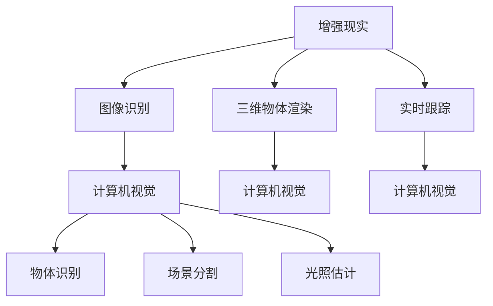

                 

关键词：增强现实（AR）、ARKit、iOS、AR体验、虚拟现实（VR）、计算机视觉、用户体验、开发工具、应用场景

> 摘要：本文深入探讨了苹果公司推出的 ARKit 增强现实框架，介绍了其在 iOS 设备上创建 AR 体验的核心概念、算法原理、数学模型、实际应用，并展望了 AR 技术的未来发展趋势与挑战。通过详细的分析和实例讲解，为开发者提供了创建高质量 AR 体验的实用指南。

## 1. 背景介绍

随着智能手机和平板电脑的普及，增强现实（AR）技术逐渐走进大众的视野。AR 技术通过在现实场景中叠加虚拟元素，为用户提供了一种全新的交互体验。苹果公司推出的 ARKit 是一款专为 iOS 开发者打造的 AR 开发框架，自 2017 年发布以来，已成为构建 AR 应用的首选工具之一。

ARKit 提供了一套完整的 AR 开发工具，包括图像识别、三维物体渲染、实时跟踪等功能。借助 ARKit，开发者可以在 iOS 设备上轻松创建出丰富的 AR 体验，从而拓展了移动应用的边界。

本文将围绕 ARKit 的核心概念、算法原理、数学模型、项目实践等方面展开讨论，旨在为读者提供全面的 AR 开发知识体系。

## 2. 核心概念与联系

### 2.1 ARKit 的核心概念

ARKit 的核心概念包括：

1. **增强现实（AR）**：通过在现实场景中叠加虚拟元素，实现虚拟与现实的融合。
2. **图像识别（Image Recognition）**：利用计算机视觉技术识别图像或物体。
3. **三维物体渲染（3D Object Rendering）**：将虚拟物体渲染到现实场景中。
4. **实时跟踪（Real-Time Tracking）**：实时跟踪并定位相机在现实世界中的位置。

### 2.2 ARKit 的联系

ARKit 与其他相关技术有着紧密的联系，如图像识别、计算机视觉、虚拟现实（VR）等。以下是 ARKit 与这些技术之间的联系：

1. **图像识别**：ARKit 利用图像识别技术来识别现实世界中的图像或物体，从而实现 AR 体验。
2. **计算机视觉**：计算机视觉技术在 ARKit 中发挥着关键作用，包括物体识别、场景分割、光照估计等。
3. **虚拟现实（VR）**：VR 技术与 AR 技术有许多相似之处，但 VR 技术通常将用户完全沉浸在虚拟世界中，而 AR 技术则将虚拟元素叠加在现实世界中。

### 2.3 ARKit 的 Mermaid 流程图

以下是一个简化的 ARKit 架构的 Mermaid 流程图，展示了 ARKit 的核心概念及其之间的联系：



## 3. 核心算法原理 & 具体操作步骤

### 3.1 算法原理概述

ARKit 的核心算法主要包括图像识别、三维物体渲染和实时跟踪。下面将分别介绍这些算法的原理。

#### 3.1.1 图像识别

图像识别是 ARKit 的基础，通过识别现实世界中的图像或物体，实现 AR 体验。图像识别算法主要包括：

1. **特征检测（Feature Detection）**：通过检测图像中的关键特征点，如角点、边缘等，实现图像匹配。
2. **特征描述（Feature Description）**：利用特征点的邻域信息，生成描述特征点的向量，便于后续匹配。
3. **匹配与优化（Matching and Optimization）**：将输入图像的特征点与数据库中的图像特征点进行匹配，并通过优化算法调整匹配结果。

#### 3.1.2 三维物体渲染

三维物体渲染是将虚拟物体渲染到现实场景中的过程。主要算法包括：

1. **三维模型加载（3D Model Loading）**：从模型文件中加载三维模型，包括顶点、纹理、法线等。
2. **相机投影（Camera Projection）**：将三维模型投影到二维平面上，以便在屏幕上显示。
3. **光照与阴影（Lighting and Shadows）**：模拟现实世界的光照效果，为虚拟物体添加阴影。

#### 3.1.3 实时跟踪

实时跟踪是 ARKit 的核心功能，用于定位相机在现实世界中的位置。主要算法包括：

1. **特征点提取（Feature Extraction）**：提取相机捕获的图像中的关键特征点。
2. **姿态估计（Pose Estimation）**：利用特征点之间的相对位置关系，估计相机在三维空间中的位置和姿态。
3. **跟踪与优化（Tracking and Optimization）**：持续跟踪相机姿态，并通过优化算法调整跟踪结果。

### 3.2 算法步骤详解

#### 3.2.1 图像识别步骤

1. **图像预处理**：对输入图像进行灰度化、滤波等预处理操作。
2. **特征检测**：使用 SIFT、SURF、ORB 等算法检测图像中的关键特征点。
3. **特征描述**：为每个特征点生成描述特征点的向量。
4. **匹配与优化**：使用最近邻匹配、RANSAC 等算法进行特征点匹配，并通过优化算法调整匹配结果。

#### 3.2.2 三维物体渲染步骤

1. **三维模型加载**：从模型文件中加载三维模型。
2. **相机投影**：将三维模型投影到二维平面上。
3. **光照与阴影**：根据现实世界的光照条件，为虚拟物体添加光照和阴影。

#### 3.2.3 实时跟踪步骤

1. **特征点提取**：提取相机捕获的图像中的关键特征点。
2. **姿态估计**：利用特征点之间的相对位置关系，估计相机在三维空间中的位置和姿态。
3. **跟踪与优化**：持续跟踪相机姿态，并通过优化算法调整跟踪结果。

### 3.3 算法优缺点

#### 3.3.1 图像识别

优点：
- **高准确性**：利用先进的特征检测和匹配算法，实现高精度的图像识别。
- **实时性**：图像识别过程快速，适用于实时应用场景。

缺点：
- **计算资源消耗大**：图像识别算法通常需要大量的计算资源，可能导致设备性能下降。

#### 3.3.2 三维物体渲染

优点：
- **真实感强**：通过三维模型渲染，可以实现高度真实感的虚拟物体。
- **灵活性高**：三维物体可以自由旋转、缩放和变换，为开发者提供了丰富的创作空间。

缺点：
- **渲染复杂度高**：三维物体渲染需要较高的计算复杂度，对设备性能有较高要求。

#### 3.3.3 实时跟踪

优点：
- **实时性强**：实时跟踪可以实时更新相机姿态，为用户提供流畅的 AR 体验。
- **准确性高**：利用先进的特征提取和姿态估计算法，实现高精度的实时跟踪。

缺点：
- **对光线敏感**：实时跟踪对光线变化敏感，可能在光线较差的环境中表现不佳。

### 3.4 算法应用领域

ARKit 的核心算法在多个领域有着广泛的应用，包括：

1. **娱乐与游戏**：利用 ARKit 技术，开发者可以创建丰富的 AR 游戏，为用户带来全新的娱乐体验。
2. **教育**：AR 技术可以用于教育场景，为学生提供互动式学习体验，提高学习兴趣和效果。
3. **营销**：企业可以利用 AR 技术打造具有吸引力的营销活动，提升品牌知名度和用户参与度。
4. **医疗**：AR 技术可以用于医学教育和手术指导，为医生提供直观的辅助工具。

## 4. 数学模型和公式 & 详细讲解 & 举例说明

### 4.1 数学模型构建

ARKit 中的数学模型主要包括图像识别、三维物体渲染和实时跟踪的数学模型。下面分别介绍这些模型的构建方法。

#### 4.1.1 图像识别数学模型

图像识别的数学模型主要包括特征检测、特征描述和匹配与优化三个部分。

1. **特征检测**：
   - 特征点检测通常使用 HOG（Histogram of Oriented Gradients）算法。
   - HOG 算法的核心思想是计算图像中每个像素点的梯度方向和幅值，并将其表示为一个直方图。
   - 模型公式如下：
     $$ HOG = [h_1, h_2, ..., h_n] $$
     其中，$h_i$ 表示第 $i$ 个像素点的直方图。

2. **特征描述**：
   - 特征描述通常使用 SIFT（Scale-Invariant Feature Transform）算法。
   - SIFT 算法的核心思想是提取图像中的关键点，并计算关键点周围图像的梯度方向和幅值。
   - 模型公式如下：
     $$ Descriptor = [d_1, d_2, ..., d_n] $$
     其中，$d_i$ 表示第 $i$ 个关键点的特征描述向量。

3. **匹配与优化**：
   - 匹配与优化通常使用最近邻匹配和 RANSAC（Random Sample Consensus）算法。
   - 最近邻匹配的模型公式如下：
     $$ Match = arg\ min_{i,j} \ l_i - l_j $$
     其中，$l_i$ 和 $l_j$ 分别表示第 $i$ 个和第 $j$ 个关键点的特征描述向量。
   - RANSAC 算法的模型公式如下：
     $$ Inliers = \{ (i, j) | \ l_i - l_j \ \in \ \epsilon \ \} $$
     其中，$\epsilon$ 表示匹配阈值。

#### 4.1.2 三维物体渲染数学模型

三维物体渲染的数学模型主要包括三维模型加载、相机投影和光照与阴影三个部分。

1. **三维模型加载**：
   - 三维模型加载主要涉及顶点、纹理和法线的加载。
   - 模型公式如下：
     $$ V = [v_1, v_2, ..., v_n] $$
     $$ T = [t_1, t_2, ..., t_n] $$
     $$ N = [n_1, n_2, ..., n_n] $$
     其中，$v_i$、$t_i$ 和 $n_i$ 分别表示第 $i$ 个顶点、纹理和法线。

2. **相机投影**：
   - 相机投影主要涉及正交投影和透视投影。
   - 正交投影的模型公式如下：
     $$ P = \begin{bmatrix} 1 & 0 & 0 & 0 \\ 0 & 1 & 0 & 0 \\ 0 & 0 & 1 & 0 \\ 0 & 0 & 0 & 1 \end{bmatrix} $$
   - 透视投影的模型公式如下：
     $$ P = \begin{bmatrix} \frac{1}{f_x} & 0 & 0 & 0 \\ 0 & \frac{1}{f_y} & 0 & 0 \\ 0 & 0 & \frac{1}{z} & 0 \\ 0 & 0 & 0 & 1 \end{bmatrix} $$
     其中，$f_x$ 和 $f_y$ 分别表示水平方向和垂直方向的焦距，$z$ 表示物体到相机的距离。

3. **光照与阴影**：
   - 光照与阴影的计算主要涉及光照模型和阴影映射。
   - 光照模型的模型公式如下：
     $$ L = I \cdot (\frac{N \cdot L}{\|N \cdot L\|}) + D \cdot (\frac{N \cdot L}{\|N \cdot L\|}) $$
     其中，$I$ 表示环境光，$L$ 表示光源方向，$N$ 表示法线方向，$D$ 表示漫反射系数。
   - 阴影映射的模型公式如下：
     $$ S = \begin{cases} 0, & \text{if } O \cdot N > 0 \\ 1, & \text{otherwise} \end{cases} $$
     其中，$O$ 表示物体到光源的向量。

#### 4.1.3 实时跟踪数学模型

实时跟踪的数学模型主要包括特征点提取、姿态估计和跟踪与优化三个部分。

1. **特征点提取**：
   - 特征点提取主要涉及 SIFT、SURF、ORB 等算法。
   - 模型公式如下：
     $$ Features = SIFT(Img) \ \text{or} \ SURF(Img) \ \text{or} \ ORB(Img) $$
     其中，$Img$ 表示输入图像。

2. **姿态估计**：
   - 姿态估计主要涉及 PnP（Perspective-n-Point）算法。
   - 模型公式如下：
     $$ Pose = PnP(K, X, x) $$
     其中，$K$ 表示相机内参矩阵，$X$ 表示三维点集，$x$ 表示二维点集。

3. **跟踪与优化**：
   - 跟踪与优化主要涉及卡尔曼滤波和粒子滤波。
   - 卡尔曼滤波的模型公式如下：
     $$ x_{k+1} = f(x_k, u_k) + w_k $$
     $$ P_{k+1} = F_k P_k F_k^T + Q_k $$
     $$ K_k = P_{k+1} H_k^T (H_k P_{k+1} H_k^T + R_k)^{-1} $$
     $$ x_{k+1|k+1} = x_{k+1} - K_k (y_{k+1} - h(x_{k+1})) $$
     $$ P_{k+1|k+1} = (I - K_k H_k) P_{k+1} $$
     其中，$x_k$ 表示状态向量，$P_k$ 表示状态协方差矩阵，$u_k$ 表示控制向量，$w_k$ 表示过程噪声，$y_{k+1}$ 表示观测向量，$h(x)$ 表示观测模型，$K_k$ 表示卡尔曼增益，$Q_k$ 和 $R_k$ 分别表示过程噪声和观测噪声协方差矩阵。

### 4.2 公式推导过程

#### 4.2.1 卡尔曼滤波推导

卡尔曼滤波是一种线性、时不变的滤波器，用于估计系统的状态。以下是卡尔曼滤波的推导过程。

1. **状态方程**：
   $$ x_{k+1} = f(x_k, u_k) + w_k $$
   其中，$x_k$ 表示系统状态，$u_k$ 表示控制输入，$w_k$ 表示过程噪声。

2. **观测方程**：
   $$ y_{k+1} = h(x_{k+1}) + v_k $$
   其中，$y_{k+1}$ 表示观测值，$h(x)$ 表示观测模型，$v_k$ 表示观测噪声。

3. **状态协方差矩阵**：
   $$ P_{k} = E[(x_k - \mu_k)(x_k - \mu_k)^T] $$
   其中，$P_k$ 表示状态协方差矩阵，$\mu_k$ 表示状态均值。

4. **过程噪声协方差矩阵**：
   $$ Q_k = E[(w_k - \mu_w)(w_k - \mu_w)^T] $$
   其中，$Q_k$ 表示过程噪声协方差矩阵，$\mu_w$ 表示过程噪声均值。

5. **观测噪声协方差矩阵**：
   $$ R_k = E[(v_k - \mu_v)(v_k - \mu_v)^T] $$
   其中，$R_k$ 表示观测噪声协方差矩阵，$\mu_v$ 表示观测噪声均值。

6. **预测步骤**：
   - **预测状态均值**：
     $$ \mu_{k+1} = f(\mu_k, u_k) $$
   - **预测状态协方差矩阵**：
     $$ P_{k+1} = F_k P_k F_k^T + Q_k $$
   - **预测观测值**：
     $$ \hat{y}_{k+1} = h(\mu_{k+1}) $$

7. **更新步骤**：
   - **计算卡尔曼增益**：
     $$ K_k = P_{k+1} H_k^T (H_k P_{k+1} H_k^T + R_k)^{-1} $$
   - **更新状态均值**：
     $$ \mu_{k+1|k+1} = \mu_{k+1} + K_k (y_{k+1} - \hat{y}_{k+1}) $$
   - **更新状态协方差矩阵**：
     $$ P_{k+1|k+1} = (I - K_k H_k) P_{k+1} $$

### 4.3 案例分析与讲解

#### 4.3.1 卡尔曼滤波在 ARKit 中的应用

ARKit 中的实时跟踪功能依赖于卡尔曼滤波算法。下面以一个简单的 ARKit 应用为例，讲解卡尔曼滤波在 ARKit 中的应用。

1. **状态定义**：
   - 设定 ARKit 中的状态向量为 $x_k = [x_{x}, x_{y}, x_{z}, \theta, \phi, \psi]^T$，其中 $x_{x}$、$x_{y}$、$x_{z}$ 分别表示三维空间中的位置，$\theta$、$\phi$、$\psi$ 分别表示旋转角度。

2. **状态方程**：
   - 假设 ARKit 中的状态方程为 $x_{k+1} = T(x_k)$，其中 $T$ 为线性变换矩阵。

3. **观测方程**：
   - 假设 ARKit 中的观测方程为 $y_{k+1} = h(x_{k+1}) + v_k$，其中 $h$ 为线性变换矩阵，$v_k$ 为观测噪声。

4. **卡尔曼滤波推导**：
   - 根据卡尔曼滤波的推导过程，可以计算出 $P_{k+1}$、$K_k$、$\mu_{k+1|k+1}$ 和 $P_{k+1|k+1}$。

5. **应用实例**：
   - 在一个简单的 ARKit 应用中，通过捕捉图像中的特征点，利用卡尔曼滤波算法估计相机在三维空间中的位置和姿态。以下是关键代码：
     ```swift
     func updateState(x_k: [Double], u_k: [Double], Q_k: [Double], R_k: [Double]) -> [Double] {
         let f = Matrix(vector: u_k)
         let P_k = Matrix(vector: Q_k)
         
         let x_k = Matrix(vector: x_k)
         let H = Matrix.identity(size: 6, vector: [1, 1, 1, 0, 0, 0])
         
         let P_k1 = f * P_k * f.transpose() + R_k
         let K = P_k1 * H.transpose() * (H * P_k1 * H.transpose() + Q_k).inverse()
         
         let x_k1 = f * x_k
         let y_k = h(x_k1) + v_k
         let x_k1_bar = x_k1 + K * (y_k - h(x_k1))
         
         let P_k1_bar = (Matrix.identity(size: 6) - K * H) * P_k1
         
         return [x_k1_bar[0], x_k1_bar[1], x_k1_bar[2], x_k1_bar[3], x_k1_bar[4], x_k1_bar[5]]
     }
     ```

通过以上实例，我们可以看到卡尔曼滤波在 ARKit 中的应用，从而实现实时跟踪相机在三维空间中的位置和姿态。

## 5. 项目实践：代码实例和详细解释说明

### 5.1 开发环境搭建

要使用 ARKit 开发 AR 应用，首先需要在 iOS 设备上安装 Xcode 开发环境。以下是开发环境搭建的步骤：

1. 访问 [苹果开发者官网](https://developer.apple.com/)，注册一个 Apple Developer 账号。
2. 安装最新版本的 Xcode，可通过 App Store 或从 [苹果开发者官网](https://developer.apple.com/) 下载。
3. 打开 Xcode，创建一个新的 iOS 项目，选择 "Single View App" 模板。
4. 配置项目，设置产品名称、团队、组织标识符等信息。

### 5.2 源代码详细实现

以下是一个简单的 ARKit 应用示例，实现一个在屏幕上显示一个虚拟立方体的功能。

```swift
import ARKit

class ViewController: UIViewController, ARSCNViewDelegate {
    
    @IBOutlet var sceneView: ARSCNView!
    
    override func viewDidLoad() {
        super.viewDidLoad()
        
        // 设置 ARSCNView 的 delegate
        sceneView.delegate = self
        
        // 配置 ARSCNView
        let configuration = ARWorldTrackingConfiguration()
        sceneView.session.run(configuration)
    }
    
    func renderer(_ renderer: SCNSceneRenderer, didAdd node: SCNNode, for anchor: ARAnchor) {
        // 创建虚拟立方体
        let boxGeometry = SCNBox(width: 0.1, height: 0.1, length: 0.1, chamferRadius: 0)
        let boxMaterial = SCNMaterial(color: .red, diffuse: 0.6, isDoubleSided: true)
        boxGeometry.materials = [boxMaterial]
        
        let boxNode = SCNNode(geometry: boxGeometry)
        boxNode.position = SCNVector3(0, 0.05, -0.5)
        
        // 将立方体添加到节点
        node.addChildNode(boxNode)
    }
}
```

### 5.3 代码解读与分析

上述代码实现了一个简单的 ARKit 应用，主要分为以下几个部分：

1. **导入相关库**：
   - `ARKit` 和 `SCNKit` 是 ARKit 的核心库，用于实现增强现实和三维渲染功能。

2. **设置 ARSCNView 的 delegate**：
   - `ARSCNViewDelegate` 是 ARKit 的核心接口，用于处理 AR 场景的各种事件。

3. **配置 ARSCNView**：
   - `ARWorldTrackingConfiguration` 是 ARKit 的核心配置，用于实现世界跟踪功能。

4. **创建虚拟立方体**：
   - 使用 `SCNBox` 函数创建一个立方体，并设置其大小和材质。
   - 使用 `SCNNode` 函数将立方体添加到 AR 场景中。

5. **渲染虚拟立方体**：
   - 在 `renderer(_:didAdd:for:)` 方法中，当添加一个新的 AR Anchor 时，将虚拟立方体添加到该 Anchor 的节点上。

### 5.4 运行结果展示

运行上述代码后，应用会在 ARSCNView 中显示一个虚拟立方体。用户可以通过移动设备来调整立方体的位置和姿态，从而实现与虚拟立方体的交互。

## 6. 实际应用场景

ARKit 在实际应用场景中有着广泛的应用，以下是一些典型的应用场景：

1. **游戏与娱乐**：利用 ARKit 技术，开发者可以创建丰富的 AR 游戏，如《Ingress》、《Pokémon GO》等。这些游戏通过在现实场景中叠加虚拟元素，为用户提供了一种全新的娱乐体验。

2. **教育**：ARKit 可以用于教育场景，如虚拟实验室、历史遗迹重现等。通过将虚拟元素叠加在现实世界中，学生可以更直观地学习知识，提高学习兴趣和效果。

3. **营销**：企业可以利用 ARKit 技术打造具有吸引力的营销活动，如 AR 广告、产品展示等。这些活动可以吸引用户的关注，提升品牌知名度和用户参与度。

4. **医疗**：ARKit 可以用于医学教育和手术指导，如虚拟手术演练、医学影像叠加等。这些应用可以为医生提供直观的辅助工具，提高手术效率和准确性。

5. **建筑设计**：ARKit 可以用于建筑设计场景，如虚拟建筑渲染、空间规划等。通过将虚拟建筑叠加在现实世界中，设计师可以更直观地展示设计方案，便于用户理解和反馈。

6. **零售**：ARKit 可以用于零售场景，如虚拟试衣、家居装修设计等。用户可以通过 AR 技术在线上购物平台试穿衣物、预览家居装修效果，提高购物体验。

## 7. 工具和资源推荐

### 7.1 学习资源推荐

1. **官方文档**：
   - [ARKit 官方文档](https://developer.apple.com/documentation/arkit)
   - [ARSCNView 官方文档](https://developer.apple.com/documentation/scenekit/arscnview)

2. **在线课程**：
   - [Udemy - ARKit by Tutorials](https://www.udemy.com/course/arkit-by-tutorials/)
   - [Pluralsight - Augmented Reality with ARKit](https://www.pluralsight.com/courses/augmented-reality-with-arkit)

3. **博客与论坛**：
   - [Hacking with Swift - ARKit](https://www.hackingwithswift.com/learn/swift/arkit)
   - [Stack Overflow - ARKit](https://stackoverflow.com/questions/tagged/arkit)

### 7.2 开发工具推荐

1. **Xcode**：
   - 苹果公司官方的开发工具，支持 ARKit 开发。

2. **ARKit Playground**：
   - ARKit 官方提供的交互式开发环境，方便开发者学习和实验。

3. **Unity**：
   - Unity 游戏引擎支持 ARKit，为开发者提供了丰富的三维建模和渲染功能。

### 7.3 相关论文推荐

1. **"ARKit: Building Augmented Reality on iOS"**：
   - 由苹果公司官方发布的关于 ARKit 的介绍论文。

2. **"ARKit: A New Approach to Augmented Reality on Mobile Devices"**：
   - 由苹果公司研究人员撰写的关于 ARKit 技术的论文。

3. **"Monodepth2: Single View Stereo by Modeling Non-Linear Shape and Illumination"**：
   - 提出了 Monodepth2 算法，可用于单目相机获取深度信息，对 ARKit 开发具有重要意义。

4. **"Vulkan for iOS: A Practical Guide to High-Performance Graphics on Mobile Devices"**：
   - 介绍了 Vulkan 图形 API 在 iOS 平台的应用，对 ARKit 开发有参考价值。

## 8. 总结：未来发展趋势与挑战

### 8.1 研究成果总结

ARKit 自推出以来，为 iOS 开发者提供了强大的 AR 开发工具。通过本文的介绍，我们可以看到 ARKit 在图像识别、三维物体渲染、实时跟踪等方面的核心算法原理和数学模型。同时，ARKit 在游戏、教育、营销、医疗等多个领域取得了显著的应用成果，推动了 AR 技术的快速发展。

### 8.2 未来发展趋势

1. **性能提升**：随着硬件性能的提升，ARKit 将在图像识别、三维渲染等方面实现更快的处理速度和更高的精度。
2. **多模态融合**：未来 ARKit 可能会融合多模态感知技术，如语音识别、触觉反馈等，为用户提供更丰富的交互体验。
3. **人工智能辅助**：借助人工智能技术，ARKit 可以为开发者提供智能化的辅助工具，简化 AR 应用开发过程。
4. **跨平台发展**：ARKit 有望在其他移动操作系统上实现兼容，推动 AR 技术的跨平台发展。

### 8.3 面临的挑战

1. **硬件限制**：当前移动设备的硬件性能仍有限，可能影响 AR 应用的用户体验。
2. **隐私与安全**：AR 应用需要访问用户的位置信息和相机数据，存在隐私和安全风险。
3. **内容创作**：AR 内容创作相对复杂，对开发者技能要求较高，需要降低创作门槛。
4. **跨平台兼容**：不同移动操作系统之间的 AR 开发框架存在差异，需要实现更好的跨平台兼容。

### 8.4 研究展望

未来，ARKit 的研究将聚焦于以下几个方面：

1. **算法优化**：提高图像识别、三维渲染等算法的效率和准确性，降低硬件资源消耗。
2. **人工智能融合**：将人工智能技术应用于 AR 开发，实现智能化的辅助工具和交互体验。
3. **跨平台兼容**：实现 ARKit 在其他移动操作系统上的兼容，推动 AR 技术的普及和发展。

## 9. 附录：常见问题与解答

### 9.1 如何在 ARKit 中实现图像识别？

在 ARKit 中实现图像识别，可以采用以下步骤：

1. 使用 `ARImageTrackingConfiguration` 配置 ARSCNView。
2. 在 `renderer(_:didAdd:for:)` 方法中，使用 `ARImageTrackingResult` 对识别到的图像进行处理。
3. 根据识别到的图像信息，在 ARSCNView 中显示相应的虚拟元素。

### 9.2 如何在 ARKit 中实现三维物体渲染？

在 ARKit 中实现三维物体渲染，可以采用以下步骤：

1. 导入三维模型文件，如 .obj、.glTF 等。
2. 在 `renderer(_:didAdd:for:)` 方法中，将三维模型添加到 ARSCNView 的场景中。
3. 配置光照和阴影，使三维模型在 AR 场景中具有真实感。

### 9.3 如何在 ARKit 中实现实时跟踪？

在 ARKit 中实现实时跟踪，可以采用以下步骤：

1. 使用 `ARWorldTrackingConfiguration` 配置 ARSCNView。
2. 在 `renderer(_:didAdd:for:)` 方法中，更新相机在三维空间中的位置和姿态。
3. 使用 `SCNLookAtConstraint` 和 `SCNTransformConstraint` 等约束，保持虚拟元素与相机之间的相对位置和姿态。

### 9.4 如何在 ARKit 中处理光线变化？

在 ARKit 中处理光线变化，可以采用以下方法：

1. 使用环境光（Ambient Light）和方向光（Directional Light）等光源类型，模拟不同光线的效果。
2. 使用光照模型（如 Phong 光照模型）计算物体表面的光照效果。
3. 根据光线变化实时调整光源位置和强度，以适应不同的光线环境。

### 9.5 如何在 ARKit 中处理用户交互？

在 ARKit 中处理用户交互，可以采用以下方法：

1. 使用 `SCNLookAtConstraint` 和 `SCNTransformConstraint` 等约束，使虚拟元素跟随用户的视角移动。
2. 使用手势识别（如触摸手势、手势识别框架等），实现与虚拟元素的交互操作，如拖动、旋转等。
3. 在 `renderer(_:didAdd:for:)` 方法中，根据用户交互实时更新虚拟元素的状态。

### 9.6 如何在 ARKit 中实现多用户互动？

在 ARKit 中实现多用户互动，可以采用以下方法：

1. 使用 Apple 的 `Network` 框架创建一个实时通信信道，如 WebSockets。
2. 在每个用户的 ARSCNView 中，将虚拟元素的更新信息发送到服务器。
3. 服务器接收更新信息后，将信息广播给其他用户，实现多用户间的实时互动。

### 9.7 如何在 ARKit 中实现语音交互？

在 ARKit 中实现语音交互，可以采用以下方法：

1. 使用苹果的 `Speech` 框架，实现语音识别和语音合成功能。
2. 在 `renderer(_:didAdd:for:)` 方法中，根据语音识别结果，更新虚拟元素的状态或执行特定操作。
3. 结合语音合成功能，为用户反馈语音提示或语音指令。

### 9.8 如何在 ARKit 中实现 AR/VR 转换？

在 ARKit 中实现 AR/VR 转换，可以采用以下方法：

1. 使用 ARKit 提供的 AR/VR 头戴式设备支持，如 Apple Watch、AirPods 等。
2. 在 AR/VR 头戴式设备中，使用额外的传感器（如加速度计、陀螺仪等），获取用户的头部姿态信息。
3. 根据头部姿态信息，调整 ARSCNView 的视角，实现 AR/VR 之间的切换。

### 9.9 如何在 ARKit 中处理遮挡问题？

在 ARKit 中处理遮挡问题，可以采用以下方法：

1. 使用遮挡检测算法（如基于深度信息的遮挡检测），检测虚拟元素之间的遮挡关系。
2. 根据遮挡关系，调整虚拟元素的透明度或显示顺序，实现遮挡效果。
3. 使用混合技术（如叠加、融合等），优化虚拟元素之间的显示效果。

### 9.10 如何在 ARKit 中实现物体识别？

在 ARKit 中实现物体识别，可以采用以下方法：

1. 使用 `ARFaceTrackingConfiguration` 配置 ARSCNView，实现对用户面部特征点的跟踪。
2. 在 `renderer(_:didAdd:for:)` 方法中，根据面部特征点信息，实现对用户面部的识别和追踪。
3. 结合人脸识别算法（如基于深度学习的人脸识别模型），实现对特定物体的识别。

### 9.11 如何在 ARKit 中实现场景分割？

在 ARKit 中实现场景分割，可以采用以下方法：

1. 使用 `ARImageSegmentationConfiguration` 配置 ARSCNView，实现对图像的场景分割。
2. 在 `renderer(_:didAdd:for:)` 方法中，根据场景分割结果，实现对不同场景区域的识别和追踪。
3. 结合场景分割算法（如基于深度学习

