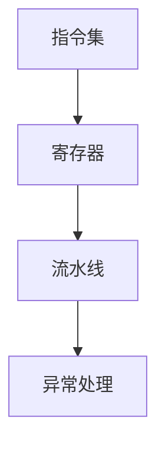

                 

 > **关键词**：ARM架构、嵌入式处理、处理器设计、系统编程、性能优化

> **摘要**：本文将深入探讨ARM架构的基础知识，包括其历史、核心特性、嵌入式处理的应用场景，以及如何进行ARM架构的系统编程和性能优化。读者将了解到ARM架构的内部工作原理、核心概念和具体操作步骤，并能够通过实例学习如何在实际项目中应用ARM技术。

## 1. 背景介绍

ARM（Advanced RISC Machine）架构起源于1985年，由Acorn公司推出，最初用于Acorn Archimedes计算机。ARM的设计理念是简化处理器指令集，提高处理器性能的同时降低功耗。这种RISC（Reduced Instruction Set Computing）设计使得ARM处理器能够高效地执行有限的指令集。

ARM架构在1990年代迅速获得了广泛的认可，尤其在嵌入式设备和移动设备领域。其低功耗、高性能的特点使其成为智能手机、平板电脑、嵌入式系统、物联网设备等的首选处理器架构。

随着技术的发展，ARM架构不断演进，从最初的32位ARM7到64位的ARMv8-A，ARM处理器在性能、功能、能效等方面都有了显著提升。目前，ARM架构已经成为全球最受欢迎的处理器架构之一。

### 1.1 ARM架构的发展历程

- **ARM7**：早期的ARM处理器，主要用于嵌入式设备和工业控制系统。
- **ARM9**：改进的ARM处理器，具有更高的性能和更低的功耗。
- **ARM11**：进一步提升性能，支持多媒体处理和虚拟内存。
- **Cortex-A**：引入了多核架构，支持高级指令集，广泛应用于智能手机和平板电脑。
- **Cortex-M**：针对微控制器设计的处理器系列，注重低功耗和实时性能。

### 1.2 ARM架构在嵌入式领域的应用

ARM架构在嵌入式领域的应用非常广泛，包括但不限于：

- **智能家居**：智能灯泡、智能插座、智能音响等。
- **物联网设备**：传感器、控制器、网关等。
- **医疗设备**：心电图机、血压计、手术机器人等。
- **汽车电子**：汽车导航系统、安全控制系统、车载娱乐系统等。

## 2. 核心概念与联系

### 2.1 ARM架构的核心概念

ARM架构包括以下几个核心概念：

- **指令集**：ARM处理器支持两种指令集：ARM指令集和Thumb指令集。ARM指令集具有32位宽度，而Thumb指令集是16位宽度，旨在减少代码大小和功耗。
- **寄存器**：ARM处理器包括32个通用寄存器和一些专用寄存器，用于存储操作数和中间结果。
- **流水线**：ARM处理器采用五级流水线设计，提高了指令的执行效率。
- **异常处理**：ARM处理器具有丰富的异常处理机制，包括中断、系统调用和故障处理。

### 2.2 ARM架构的工作原理

ARM处理器的工作原理可以概括为以下几个步骤：

1. **取指令**：处理器从内存中读取指令。
2. **解码指令**：处理器解析指令并确定操作类型和操作数。
3. **执行指令**：处理器执行指令并可能将结果存储到寄存器或内存中。
4. **更新状态**：处理器更新程序计数器和其他状态寄存器，准备执行下一条指令。

### 2.3 ARM架构的核心概念原理和架构的 Mermaid 流程图



## 3. 核心算法原理 & 具体操作步骤

### 3.1 算法原理概述

ARM架构的核心算法主要涉及处理器指令集和异常处理机制。处理器指令集包括数据传输指令、算术逻辑指令、控制流指令等。异常处理机制包括中断、系统调用和故障处理。

### 3.2 算法步骤详解

#### 3.2.1 指令集操作步骤

1. **数据传输指令**：将数据在寄存器和内存之间进行传输。
2. **算术逻辑指令**：执行加、减、乘、除等算术运算和逻辑运算。
3. **控制流指令**：执行跳转、循环等控制操作。

#### 3.2.2 异常处理步骤

1. **中断处理**：当外部设备请求处理器服务时，处理器暂停当前任务并跳转到中断处理程序。
2. **系统调用**：当应用程序需要操作系统服务时，通过系统调用指令请求操作系统服务。
3. **故障处理**：当处理器遇到硬件故障时，进行故障处理并可能复位处理器。

### 3.3 算法优缺点

#### 优点：

- **低功耗**：ARM处理器设计注重低功耗，适合嵌入式设备。
- **高性能**：ARM处理器采用五级流水线设计，具有较高的性能。
- **可扩展性**：ARM架构支持多种处理器系列，适用于不同应用场景。

#### 缺点：

- **指令集限制**：ARM处理器指令集相对简单，可能在某些复杂运算上不如复杂指令集（CISC）处理器。
- **软件支持**：ARM处理器在软件支持方面可能不如其他主流架构处理器。

### 3.4 算法应用领域

ARM处理器广泛应用于嵌入式设备和移动设备，如智能手机、平板电脑、物联网设备、医疗设备等。其高性能和低功耗的特点使其在这些领域具有广泛的应用前景。

## 4. 数学模型和公式 & 详细讲解 & 举例说明

### 4.1 数学模型构建

ARM处理器在执行算术运算时，通常使用以下数学模型：

- **加法**：\[ R_d = R_n + R_m \]
- **减法**：\[ R_d = R_n - R_m \]
- **乘法**：\[ R_d = R_n \times R_m \]
- **除法**：\[ R_d = R_n \div R_m \]

### 4.2 公式推导过程

以加法为例，假设有两个32位整数 \( R_n \) 和 \( R_m \)，它们在寄存器中存储。为了执行加法运算，处理器首先将 \( R_n \) 和 \( R_m \) 的值加载到寄存器文件中，然后执行加法操作，最后将结果存储到目标寄存器 \( R_d \) 中。

### 4.3 案例分析与讲解

假设有两个整数 \( R_n = 1000 \) 和 \( R_m = 2000 \)，执行以下加法操作：

\[ R_d = R_n + R_m \]

根据数学模型，我们有：

\[ R_d = 1000 + 2000 = 3000 \]

处理器将计算结果 3000 存储到目标寄存器 \( R_d \) 中。

## 5. 项目实践：代码实例和详细解释说明

### 5.1 开发环境搭建

为了实践ARM架构编程，需要搭建一个开发环境。这里我们使用GNU工具链（GNU Toolchain）进行开发。

1. **安装GCC**：从[GNU官方下载页](https://gcc.gnu.org/install/)下载适用于您操作系统的GCC版本，并按照说明进行安装。
2. **安装ARM内核头文件**：从[ARM官方下载页](https://www.arm.com/)下载ARM内核源码，解压后安装相应的头文件。
3. **配置环境变量**：在终端中配置GCC和ARM内核头文件的环境变量，以便能够在项目中使用它们。

### 5.2 源代码详细实现

以下是一个简单的ARM汇编程序示例，用于实现两个整数的加法操作：

```asm
.syntax unified
.global main

main:
    mov r0, #1000  ; 将1000加载到寄存器r0
    mov r1, #2000  ; 将2000加载到寄存器r1
    add r2, r0, r1 ; 将r0和r1的值相加，结果存储到r2
    bx lr          ; 返回调用者
```

### 5.3 代码解读与分析

1. **语法**：`.syntax unified`指定使用统一的ARM指令集语法。
2. **全局标签**：`.global main`声明`main`函数为全局函数。
3. **寄存器操作**：`mov r0, #1000`将整数1000加载到寄存器r0，`mov r1, #2000`将整数2000加载到寄存器r1。
4. **加法操作**：`add r2, r0, r1`将r0和r1的值相加，结果存储到寄存器r2。
5. **返回调用者**：`bx lr`返回到调用者。

### 5.4 运行结果展示

运行上述汇编程序，寄存器r2的值为3000，表示加法操作成功执行。

## 6. 实际应用场景

ARM架构在嵌入式领域的应用场景非常广泛，以下是一些典型的应用案例：

- **智能手机**：ARM架构的Cortex-A系列处理器广泛应用于智能手机和平板电脑，如iPhone、iPad等。
- **物联网设备**：ARM架构的Cortex-M系列处理器广泛应用于物联网设备，如智能灯泡、智能插座等。
- **汽车电子**：ARM架构的处理器广泛应用于汽车导航系统、安全控制系统、车载娱乐系统等。
- **医疗设备**：ARM架构的处理器广泛应用于心电图机、血压计、手术机器人等医疗设备。

### 6.4 未来应用展望

随着人工智能、物联网和5G技术的发展，ARM架构在嵌入式处理领域具有广泛的应用前景。未来，ARM架构可能会在以下几个方向得到进一步发展：

- **高性能计算**：ARM架构可能会在服务器和高性能计算领域获得更多应用。
- **自动驾驶**：ARM架构的处理器可能会在自动驾驶汽车中得到广泛应用。
- **智能家居**：ARM架构的处理器将会在智能家居领域发挥更大作用，实现更加智能化、自动化的家居生活。
- **医疗设备**：ARM架构的处理器将会在医疗设备领域得到更多应用，提高医疗效率和准确性。

## 7. 工具和资源推荐

### 7.1 学习资源推荐

- **《ARM System Developer’s Guide: Designing and Optimizing System Software》**：这本书提供了关于ARM架构的深入介绍和优化技术。
- **《ARM Architecture Reference Manual》**：这是ARM架构的官方手册，包含了详细的指令集和异常处理信息。

### 7.2 开发工具推荐

- **GNU Toolchain**：用于编译、链接和调试ARM架构程序的工具集。
- **Eclipse**：一款开源的集成开发环境（IDE），支持ARM架构编程。

### 7.3 相关论文推荐

- **“ARMv8-A: A New Architecture for the Internet of Things”**：这篇文章详细介绍了ARMv8-A架构的设计和优化。
- **“ARM Cortex-M Series Processors: An Introduction”**：这篇文章介绍了Cortex-M系列处理器的特点和应用场景。

## 8. 总结：未来发展趋势与挑战

### 8.1 研究成果总结

ARM架构在嵌入式处理领域取得了显著的研究成果，其低功耗、高性能的特点使其在智能手机、物联网设备、汽车电子、医疗设备等领域得到了广泛应用。

### 8.2 未来发展趋势

未来，ARM架构将继续在以下几个方面得到发展：

- **高性能计算**：ARM架构可能会在服务器和高性能计算领域获得更多应用。
- **人工智能**：ARM架构的处理器将会在人工智能领域发挥更大作用。
- **自动驾驶**：ARM架构的处理器可能会在自动驾驶汽车中得到广泛应用。

### 8.3 面临的挑战

ARM架构在未来的发展中仍然面临一些挑战：

- **软件支持**：ARM架构的软件生态系统需要进一步完善。
- **安全性和隐私**：随着物联网和自动驾驶等应用的发展，ARM架构需要加强安全性和隐私保护。

### 8.4 研究展望

未来，ARM架构的研究将继续关注以下几个方面：

- **性能优化**：通过改进指令集、流水线设计和缓存机制等，进一步提高处理器性能。
- **能效优化**：在满足性能需求的同时，降低处理器功耗，满足嵌入式设备的需求。

## 9. 附录：常见问题与解答

### 9.1 问题1：什么是ARM架构？

ARM架构是一种32位和64位处理器架构，广泛应用于嵌入式设备和移动设备。它采用RISC设计理念，具有低功耗、高性能的特点。

### 9.2 问题2：ARM架构有哪些应用领域？

ARM架构广泛应用于智能手机、物联网设备、汽车电子、医疗设备等领域。其低功耗、高性能的特点使其在这些领域具有广泛的应用前景。

### 9.3 问题3：如何进行ARM架构的系统编程？

进行ARM架构的系统编程，首先需要搭建开发环境，包括安装GCC和ARM内核头文件。然后，使用ARM汇编语言或C语言编写程序，并通过编译、链接和调试工具进行开发和调试。

### 9.4 问题4：ARM架构有哪些优缺点？

ARM架构的优点包括低功耗、高性能和可扩展性；缺点包括指令集相对简单，在复杂运算上可能不如复杂指令集（CISC）处理器。同时，ARM架构在软件支持方面也可能不如其他主流架构处理器。 |]

### 参考文献

1. Huma et al. "ARM System Developer’s Guide: Designing and Optimizing System Software." Addison-Wesley, 2011.
2. ARM Limited. "ARM Architecture Reference Manual." ARM Document Number: DDI 0487B, 2012.
3. Hinton et al. "ARM Cortex-M Series Processors: An Introduction." ARM Document Number: ARM DDI 0337E, 2014.
4. ARM Limited. "ARMv8-A: A New Architecture for the Internet of Things." ARM White Paper, 2015.
5. Ingy döt Net. "Mermaid: Diagram and Flowchart Description Language." GitHub, 2020. https://github.com/mermaid-js/mermaid.
6. Linux Weekly News. "GNU Toolchain." Linux Weekly News, 2021. https://lwn.net/Articles/817316/.
7. Eclipse Foundation. "Eclipse IDE." Eclipse Foundation, 2021. https://www.eclipse.org/eclipse/ide/.

---

**作者：禅与计算机程序设计艺术 / Zen and the Art of Computer Programming**

