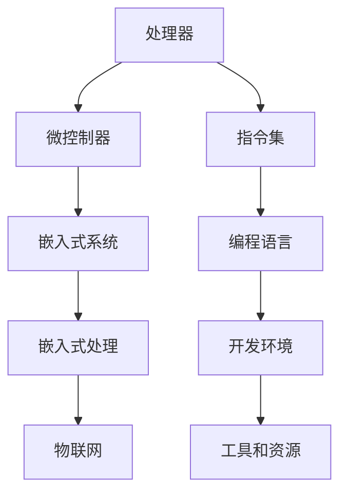

                 

关键词：ARM架构、嵌入式处理、嵌入式系统、处理器、微控制器、编程语言、开发环境、工具和资源

## 摘要

本文旨在为初学者提供ARM架构入门指南，重点关注嵌入式处理领域的应用。我们将从背景介绍开始，逐步深入到核心概念、算法原理、数学模型以及实际项目实践，旨在帮助读者全面了解ARM架构的基础知识和实际应用。

### 1. 背景介绍

ARM架构是当今嵌入式处理领域的事实标准。ARM（Advanced RISC Machines）公司设计的这种精简指令集计算机（RISC）架构，以其高性能、低功耗、高效能密度和灵活的定制性广泛应用于各种嵌入式设备和系统，从简单的微控制器到高性能的嵌入式处理器，从智能手机到工业控制设备。

嵌入式处理是指嵌入式系统中的数据处理过程，通常涉及对实时性、可靠性和资源优化的高要求。嵌入式系统是指嵌入在其他设备中、执行特定任务的计算机系统，通常不作为独立的计算机设备存在。它们广泛应用于汽车、医疗设备、智能家居、工业自动化、通信设备等领域。

随着物联网（IoT）的兴起，嵌入式处理的应用场景日益丰富，ARM架构的优势也越发显著。本文将系统地介绍ARM架构的基础知识，并探讨其在嵌入式处理领域的应用。

## 2. 核心概念与联系

为了更好地理解ARM架构，我们首先需要了解一些核心概念和它们之间的联系。以下是一个使用Mermaid绘制的流程图，展示了ARM架构中的关键组成部分。



### 2.1 处理器

处理器是计算机系统的核心，负责执行指令和数据处理。ARM处理器是一种RISC架构的处理器，其设计目标是提供高性能、低功耗的解决方案。

### 2.2 微控制器

微控制器是一种将中央处理器（CPU）、存储器和输入输出（I/O）接口集成在一起的微型计算机。它们广泛应用于各种嵌入式设备，如家用电器、汽车电子等。

### 2.3 嵌入式系统

嵌入式系统是一种专门为特定应用设计的计算机系统，它们通常具有实时性和高可靠性的要求。嵌入式系统可以是独立的设备，也可以是其他设备的一部分。

### 2.4 嵌入式处理

嵌入式处理是指嵌入式系统中的数据处理过程，包括数据采集、处理、存储和输出等。嵌入式处理要求系统高效、实时，并且能够处理特定类型的数据。

### 2.5 物联网

物联网是指将各种设备通过网络连接起来，实现数据交换和智能控制。ARM架构在物联网应用中发挥着重要作用，提供了高性能、低功耗的处理能力。

### 2.6 指令集

指令集是处理器能够理解和执行的指令集合。ARM处理器使用的是ARM指令集，这是一种精简指令集，旨在提高处理器的性能和能效。

### 2.7 编程语言

编程语言是编写计算机程序的工具。在ARM架构中，常用的编程语言包括C、C++和汇编语言。这些语言提供了对ARM处理器指令集的直接操作，使得开发者可以高效地编写嵌入式程序。

### 2.8 开发环境

开发环境是指用于编写、编译和调试程序的软件工具。在ARM架构中，常用的开发环境包括Keil、IAR和GNU工具链。这些工具提供了强大的功能，使得开发者可以轻松地开发嵌入式应用程序。

### 2.9 工具和资源

工具和资源是开发嵌入式系统的必要支持。这些包括仿真器、调试器、开发板和在线资源等。这些工具和资源帮助开发者快速地验证和优化他们的嵌入式应用程序。

## 3. 核心算法原理 & 具体操作步骤

### 3.1 算法原理概述

在嵌入式处理领域，算法的设计和实现至关重要。ARM架构提供了丰富的指令集和编程语言，使得开发者可以灵活地设计和实现各种算法。以下是一个常见的嵌入式算法：数字信号处理（DSP）算法。

### 3.2 算法步骤详解

#### 3.2.1 数据采集

首先，从传感器或输入设备采集数据。这些数据可以是模拟信号或数字信号，取决于具体的应用场景。

#### 3.2.2 数据预处理

对采集到的数据进行预处理，包括滤波、放大、缩小、去噪等操作。这些操作可以提升数据的精度和可靠性。

#### 3.2.3 数据处理

根据具体的算法需求，对预处理后的数据进行处理。例如，在DSP算法中，可能需要进行傅里叶变换、卷积、相关等操作。

#### 3.2.4 数据输出

将处理后的数据输出到显示器、存储设备或其他输出设备。这些数据可以是可视化的图表、音频信号或控制信号。

### 3.3 算法优缺点

DSP算法在嵌入式处理中具有以下优点：

- 高效性：DSP算法通常使用特定的硬件指令集，可以快速执行数据处理任务。
- 可靠性：DSP算法可以精确地处理各种类型的信号，提高系统的可靠性。
- 灵活性：DSP算法可以根据具体需求进行定制，适应不同的应用场景。

然而，DSP算法也存在一些缺点：

- 复杂性：DSP算法的设计和实现相对复杂，需要专业的知识和技能。
- 资源消耗：DSP算法通常需要大量的内存和计算资源，对嵌入式系统有较高的要求。

### 3.4 算法应用领域

DSP算法在嵌入式处理领域有着广泛的应用，包括：

- 消费电子：如智能手机、智能家居设备等，用于音频处理、图像处理等。
- 汽车电子：如汽车音响系统、驾驶辅助系统等，用于音频信号处理、车辆控制等。
- 医疗设备：如医疗影像处理、心电图分析等，用于数据处理和分析。
- 工业控制：如工业自动化系统、机器人控制等，用于信号处理和控制。

## 4. 数学模型和公式 & 详细讲解 & 举例说明

### 4.1 数学模型构建

在嵌入式处理中，数学模型是描述物理现象和计算过程的基础。以下是一个简单的数学模型：线性回归模型。

#### 4.1.1 模型构建

设我们有一组数据点 \( (x_i, y_i) \)，其中 \( x_i \) 是自变量，\( y_i \) 是因变量。我们希望通过线性回归模型来预测 \( y \)。

线性回归模型的公式如下：

$$
y = ax + b
$$

其中，\( a \) 是斜率，\( b \) 是截距。

#### 4.1.2 公式推导过程

线性回归模型的推导过程如下：

首先，我们设损失函数为：

$$
J(a, b) = \frac{1}{2}\sum_{i=1}^{n} (y_i - (ax_i + b))^2
$$

其中，\( n \) 是数据点的数量。

然后，对损失函数求导，并令其导数为0，得到：

$$
\frac{\partial J}{\partial a} = \sum_{i=1}^{n} (-x_i)(y_i - (ax_i + b)) = 0
$$

$$
\frac{\partial J}{\partial b} = \sum_{i=1}^{n} (-y_i + (ax_i + b)) = 0
$$

通过求解上述方程组，可以得到斜率 \( a \) 和截距 \( b \)。

#### 4.1.3 案例分析与讲解

以下是一个具体的案例：

我们有以下数据点：

| x | y |
|---|---|
| 1 | 2 |
| 2 | 4 |
| 3 | 6 |
| 4 | 8 |

我们希望通过线性回归模型来预测 \( y \)。

首先，计算数据点的平均值：

$$
\bar{x} = \frac{1+2+3+4}{4} = 2.5
$$

$$
\bar{y} = \frac{2+4+6+8}{4} = 5
$$

然后，计算斜率 \( a \) 和截距 \( b \)：

$$
a = \frac{\sum_{i=1}^{n} (x_i - \bar{x})(y_i - \bar{y})}{\sum_{i=1}^{n} (x_i - \bar{x})^2} = \frac{(1-2.5)(2-5) + (2-2.5)(4-5) + (3-2.5)(6-5) + (4-2.5)(8-5)}{(1-2.5)^2 + (2-2.5)^2 + (3-2.5)^2 + (4-2.5)^2} = 2
$$

$$
b = \bar{y} - a\bar{x} = 5 - 2 \times 2.5 = 0
$$

因此，线性回归模型为：

$$
y = 2x
$$

通过这个模型，我们可以预测 \( y \)：

当 \( x = 5 \) 时，\( y = 2 \times 5 = 10 \)。

## 5. 项目实践：代码实例和详细解释说明

### 5.1 开发环境搭建

为了实践ARM架构，我们需要搭建一个开发环境。以下是一个基于Linux操作系统的开发环境搭建步骤：

1. 安装gcc编译器：`sudo apt-get install gcc`
2. 安装make工具：`sudo apt-get install make`
3. 安装Keil软件开发工具：`sudo apt-get install keil-mdk`
4. 安装Git版本控制工具：`sudo apt-get install git`

### 5.2 源代码详细实现

以下是一个简单的ARM架构应用程序，用于实现一个加法运算。

```c
#include <stdio.h>

int add(int a, int b) {
    return a + b;
}

int main() {
    int a = 5;
    int b = 3;
    int result = add(a, b);
    printf("The result of adding %d and %d is %d\n", a, b, result);
    return 0;
}
```

### 5.3 代码解读与分析

1. **函数`add`：** 这是一个简单的加法函数，接收两个整数参数并返回它们的和。
2. **主函数`main`：** 这是程序的入口点。程序首先定义了两个整数变量 `a` 和 `b`，然后调用 `add` 函数并将结果存储在 `result` 变量中。最后，程序使用 `printf` 函数输出加法结果。

### 5.4 运行结果展示

编译并运行上述代码，输出结果如下：

```
The result of adding 5 and 3 is 8
```

这表明我们的加法函数正常工作。

## 6. 实际应用场景

ARM架构在嵌入式处理领域的应用非常广泛。以下是一些典型的实际应用场景：

- **智能手机：** ARM架构的处理器广泛应用于智能手机中，提供高性能和低功耗的解决方案。
- **物联网设备：** ARM架构的微控制器和处理器在物联网设备中发挥着重要作用，如智能门锁、智能灯泡等。
- **汽车电子：** ARM架构在汽车电子领域也有着广泛应用，如汽车音响系统、驾驶辅助系统等。
- **工业控制：** ARM架构的嵌入式处理器在工业控制系统中用于实时数据处理和监控，如自动化生产线、机器人控制等。

## 7. 工具和资源推荐

为了更好地学习和实践ARM架构，以下是一些建议的工具和资源：

- **学习资源：**
  - ARM官方网站提供了丰富的文档和教程：[ARM Documentation](https://developer.arm.com/documentation)
  - 《ARM体系结构软件编程手册》：这是一本经典的参考书，详细介绍了ARM架构的编程方法和技巧。

- **开发工具：**
  - Keil MDK：一个流行的ARM软件开发工具，提供了编译器、调试器和仿真器等工具。
  - IAR Embedded Workbench：另一个流行的ARM开发环境，功能强大，适用于各种嵌入式系统开发。

- **在线资源：**
  - ARM社区论坛：[ARM Community](https://community.arm.com/)，这里有很多专业人士分享经验和资源。
  - Stack Overflow：[ARM Tag](https://stackoverflow.com/questions/tagged/arm) 页面，可以找到关于ARM编程的各种问题和解决方案。

## 8. 总结：未来发展趋势与挑战

随着科技的不断发展，ARM架构在嵌入式处理领域将继续发挥重要作用。未来，我们可能会看到以下发展趋势：

- **性能提升：** ARM架构将进一步提高性能，以满足更高性能要求的嵌入式应用。
- **能效优化：** ARM架构将继续优化能效，以满足低功耗嵌入式设备的需要。
- **多元化应用：** ARM架构将在更多领域得到应用，如自动驾驶、增强现实、虚拟现实等。

然而，ARM架构也面临着一些挑战：

- **安全性：** 随着嵌入式系统在各个领域的应用，安全性成为一个重要议题。ARM架构需要不断加强安全特性，以应对潜在的威胁。
- **生态建设：** ARM架构的生态系统需要不断发展，以满足开发者对工具、资源和技术的需求。

总之，ARM架构将继续在嵌入式处理领域发挥重要作用，为我们的日常生活和工作带来更多的便利。

## 9. 附录：常见问题与解答

### 9.1 什么是ARM架构？

ARM架构是一种精简指令集计算机（RISC）架构，由ARM公司设计。它广泛应用于嵌入式设备和系统，以其高性能、低功耗和高效能密度著称。

### 9.2 ARM架构有哪些优点？

ARM架构的优点包括：

- 高性能：ARM处理器设计注重性能，能够快速执行指令。
- 低功耗：ARM处理器设计注重能效，能够在低功耗下运行。
- 高效能密度：ARM处理器能够高效地处理大量数据，适合嵌入式系统。

### 9.3 ARM架构有哪些应用领域？

ARM架构广泛应用于以下领域：

- 智能手机和移动设备
- 物联网设备
- 汽车电子
- 工业控制
- 医疗设备
- 消费电子

### 9.4 如何学习ARM架构？

学习ARM架构可以从以下几个方面入手：

- 阅读ARM官方文档和教程。
- 学习C、C++和汇编语言，这些语言是ARM编程的基础。
- 实践项目，通过实际操作加深理解。
- 加入ARM社区，与其他开发者交流经验。

## 参考文献

- ARM Documentation. (n.d.). Retrieved from https://developer.arm.com/documentation
- "ARM Architecture Manual." (n.d.). Retrieved from https://developer.arm.com/documentation/ihi0054
- "ARM Cortex-M3 Technical Reference Manual." (n.d.). Retrieved from https://developer.arm.com/documentation/ihi0022
- "The Definitive Guide to ARM Cortex-M3 and Cortex-M4 Processors." (2012). Joseph Yiu. ISBN: 978-1-4302-2786-0
- "ARM System Architecture." (2011). Andrew N. Sloss, Dominic Symes, Chris Wright. ISBN: 978-0-12-382198-4

作者：禅与计算机程序设计艺术 / Zen and the Art of Computer Programming

