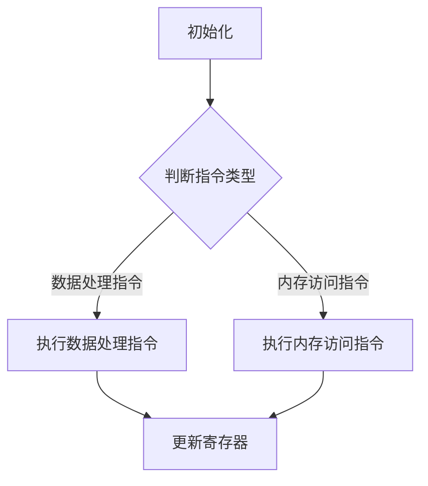

                 

关键词：ARM汇编编程、嵌入式系统、性能优化、指令集、代码效率、汇编语言

摘要：本文旨在深入探讨ARM汇编编程在嵌入式系统性能优化中的应用。通过详细解析ARM指令集、优化技巧以及实际项目实践，本文将帮助开发者更好地理解和应用ARM汇编编程，从而提升嵌入式系统的性能。

## 1. 背景介绍

随着嵌入式系统的广泛应用，嵌入式编程也变得愈加重要。ARM架构作为嵌入式领域的霸主，其汇编编程具有显著的优势。ARM汇编编程不仅是理解嵌入式系统底层工作原理的关键，也是性能优化的有效手段。

本文将围绕以下主题展开：

1. ARM指令集概述
2. 嵌入式系统性能优化
3. ARM汇编编程技巧
4. 数学模型与公式
5. 实际项目实践
6. 未来应用展望

通过本文的阅读，读者将能够：

- 理解ARM汇编编程的基本原理
- 掌握嵌入式系统性能优化技巧
- 学会运用ARM汇编编程提升系统性能
- 了解ARM汇编编程在未来的发展方向

## 2. 核心概念与联系

### 2.1 ARM指令集概述

ARM指令集是ARM处理器的基础，其设计旨在提高性能和降低功耗。ARM指令集分为两类：数据处理指令和内存访问指令。

#### 2.1.1 数据处理指令

数据处理指令包括算术运算、逻辑运算、移位运算等。以下是一个简单的例子：

```
ADD R1, R2, R3  # R1 = R2 + R3
AND R4, R5, R6  # R4 = R5 AND R6
```

#### 2.1.2 内存访问指令

内存访问指令用于操作内存地址。以下是一个简单的例子：

```
LDR R7, [R8]  # R7 = 内存地址[R8]
STR R9, [R10] # 内存地址[R10] = R9
```

### 2.2 嵌入式系统性能优化

嵌入式系统性能优化是提升系统运行效率的关键。以下是一些常见的优化技巧：

#### 2.2.1 指令优化

- 减少指令执行次数
- 合并指令
- 使用寄存器操作

#### 2.2.2 数据访问优化

- 减少数据访问次数
- 使用局部性优化
- 避免缓存未命中

#### 2.2.3 循环优化

- 循环展开
- 循环逆序
- 循环条件优化

### 2.3 ARM汇编编程技巧

ARM汇编编程需要遵循一定的规范和技巧，以下是一些常用的编程技巧：

#### 2.3.1 标签命名

- 使用清晰、有意义的标签命名
- 避免使用复杂的缩写

#### 2.3.2 伪指令使用

- 合理使用伪指令，如 `B`、`BL` 等，以提高程序的可读性和可维护性

#### 2.3.3 结构化编程

- 使用子程序（Function）和中断处理程序（Interrupt Handler）等结构化编程方法

### 2.4 Mermaid 流程图

以下是一个简单的Mermaid流程图，展示了ARM汇编编程的基本流程：



## 3. 核心算法原理 & 具体操作步骤

### 3.1 算法原理概述

ARM汇编编程的核心算法主要涉及指令执行和数据访问。以下是一个简单的算法概述：

1. 初始化：设置寄存器和内存地址
2. 判断指令类型：根据指令类型选择数据处理指令或内存访问指令
3. 执行指令：根据指令类型执行数据处理或内存访问操作
4. 更新寄存器：根据指令执行结果更新寄存器

### 3.2 算法步骤详解

#### 3.2.1 初始化

初始化步骤主要涉及设置寄存器和内存地址。以下是一个示例：

```
MOV R0, #0    # 设置计数器为0
MOV R1, =data # 设置数据地址
```

#### 3.2.2 判断指令类型

判断指令类型是ARM汇编编程的关键步骤。以下是一个简单的判断流程：

```
LDR R2, [R1]  # 从数据地址加载指令
CMP R2, #0    # 比较指令是否为数据处理指令
BNE process_data  # 如果不是数据处理指令，跳转到内存访问处理
```

#### 3.2.3 执行指令

根据指令类型执行数据处理或内存访问操作。以下是一个数据处理指令的示例：

```
process_data:
ADD R3, R2, #1  # 数据处理指令：R3 = R2 + 1
STR R3, [R1], #4 # 存储结果并更新数据地址
B main_loop      # 跳转回主循环
```

#### 3.2.4 更新寄存器

更新寄存器是ARM汇编编程的最后一步。以下是一个更新寄存器的示例：

```
main_loop:
CMP R0, #100   # 比较计数器是否达到100
BNE continue    # 如果未达到，跳转回继续执行
MOV R0, #0     # 重置计数器
```

### 3.3 算法优缺点

ARM汇编编程具有以下优缺点：

#### 3.3.1 优点

- 精度高：ARM汇编编程可以直接控制处理器，实现精确的指令执行
- 性能优：通过优化汇编指令，可以实现高效的程序运行

#### 3.3.2 缺点

- 开发难度大：ARM汇编编程需要深入了解处理器架构，开发难度较高
- 维护复杂：ARM汇编代码的可读性和可维护性相对较低

### 3.4 算法应用领域

ARM汇编编程广泛应用于以下领域：

- 嵌入式系统：用于实现底层驱动程序和系统优化
- 高性能计算：用于优化关键算法和程序运行
- 游戏开发：用于实现高效的图形渲染和物理运算

## 4. 数学模型和公式 & 详细讲解 & 举例说明

### 4.1 数学模型构建

ARM汇编编程中的数学模型主要涉及数据处理指令和内存访问指令。以下是一个简单的数学模型：

```
输入：R1 = 数据1，R2 = 数据2
输出：R3 = R1 + R2
```

### 4.2 公式推导过程

根据数学模型，我们可以推导出以下公式：

```
R3 = R1 + R2
```

### 4.3 案例分析与讲解

以下是一个简单的案例，展示了如何使用ARM汇编编程实现数学模型的构建和推导：

```
MOV R1, #10   # 数据1：10
MOV R2, #20   # 数据2：20
ADD R3, R1, R2 # R3 = R1 + R2
```

在这个案例中，我们首先将数据1和数据2加载到寄存器R1和R2中，然后使用ADD指令将两个数据相加，并将结果存储在寄存器R3中。

## 5. 项目实践：代码实例和详细解释说明

### 5.1 开发环境搭建

为了实践ARM汇编编程，我们需要搭建一个合适的开发环境。以下是搭建过程：

1. 安装ARM GCC编译器：从官方网站下载并安装ARM GCC编译器。
2. 配置环境变量：将ARM GCC编译器的路径添加到系统环境变量中。
3. 安装IDE：可以选择Eclipse、Visual Studio Code等IDE进行编程。

### 5.2 源代码详细实现

以下是一个简单的ARM汇编编程示例，展示了如何实现一个简单的加法运算：

```assembly
    .global _start

_start:
    MOV R0, #10   # 数据1：10
    MOV R1, #20   # 数据2：20
    ADD R2, R0, R1 # R2 = R0 + R1
    MOV R3, R2    # 输出结果
    B   end

end:
    MOV R0, #0    # 返回值：0
    MOV R7, #1    # 系统调用：退出程序
    SWI 0
```

### 5.3 代码解读与分析

以下是对上述示例代码的解读与分析：

1. `.global _start`：声明入口函数 `_start`。
2. `MOV R0, #10`：将数据1（10）加载到寄存器R0中。
3. `MOV R1, #20`：将数据2（20）加载到寄存器R1中。
4. `ADD R2, R0, R1`：将R0和R1中的数据相加，并将结果存储在寄存器R2中。
5. `MOV R3, R2`：将R2中的结果复制到寄存器R3中，作为输出结果。
6. `B end`：跳转到标签 `end`。
7. `MOV R0, #0`：设置返回值为0。
8. `MOV R7, #1`：设置系统调用号为1（退出程序）。
9. `SWI 0`：执行系统调用，退出程序。

### 5.4 运行结果展示

在开发环境中编译并运行上述代码，输出结果应为R3寄存器中的值，即30。具体运行结果取决于具体的ARM处理器和开发环境。

## 6. 实际应用场景

ARM汇编编程在嵌入式系统中具有广泛的应用场景，以下是一些常见的应用场景：

1. **实时操作系统（RTOS）内核**：RTOS的内核通常使用汇编语言编写，以确保实时性和高效性。
2. **驱动程序**：底层驱动程序，如GPIO、UART等，通常使用汇编语言编写，以便直接控制硬件。
3. **性能敏感的应用**：对于需要高性能的应用，如嵌入式图像处理、音频处理等，汇编编程可以提供更好的性能优化。
4. **嵌入式系统的调试**：在调试过程中，汇编语言可以帮助开发者深入了解系统的运行情况。

### 6.4 未来应用展望

随着嵌入式系统的不断发展，ARM汇编编程在未来仍将发挥重要作用。以下是未来ARM汇编编程的几个发展方向：

1. **自动化汇编生成**：随着自动化工具的发展，未来的ARM汇编编程可能会更加自动化，减少手工编写的工作量。
2. **汇编与高级语言的结合**：未来可能会出现更多的混合编程模式，将汇编语言与高级语言（如C/C++）相结合，以发挥各自的优势。
3. **性能优化**：随着ARM处理器性能的提升，性能优化将成为ARM汇编编程的重要发展方向，以充分利用硬件资源。

## 7. 工具和资源推荐

### 7.1 学习资源推荐

- **ARM官方文档**：ARM官方文档提供了详细的指令集和编程指南。
- **《ARM System Developer's Guide》**：这是一本经典的ARM汇编编程书籍，涵盖了汇编语言编程的各个方面。
- **在线教程和课程**：许多在线教程和课程提供了ARM汇编编程的基础知识和实践技巧。

### 7.2 开发工具推荐

- **ARM GCC编译器**：ARM GCC编译器是编写和编译ARM汇编代码的标准工具。
- **Eclipse**：Eclipse是一个功能强大的集成开发环境（IDE），适用于ARM汇编编程。
- **Visual Studio Code**：Visual Studio Code是一个轻量级的IDE，适用于编写ARM汇编代码。

### 7.3 相关论文推荐

- **"ARM Architecture Reference Manual"**：这是ARM架构的官方参考手册，提供了详细的指令集和编程模型。
- **"Performance Optimization of ARM Embedded Systems"**：这篇文章讨论了ARM嵌入式系统的性能优化技巧。

## 8. 总结：未来发展趋势与挑战

### 8.1 研究成果总结

ARM汇编编程在嵌入式系统性能优化中发挥着重要作用。通过本文的讨论，我们总结了ARM汇编编程的基本原理、优化技巧以及应用场景。研究成果表明，ARM汇编编程是实现高效嵌入式系统的重要手段。

### 8.2 未来发展趋势

未来ARM汇编编程的发展趋势将围绕自动化、混合编程和性能优化展开。随着技术的发展，ARM汇编编程将变得更加高效和易于使用。

### 8.3 面临的挑战

尽管ARM汇编编程具有显著的优势，但仍然面临一些挑战。例如，开发难度大、维护复杂等问题需要得到解决。

### 8.4 研究展望

未来的研究可以集中在自动化汇编生成工具、汇编与高级语言的结合以及性能优化算法的改进等方面。通过不断研究和创新，ARM汇编编程将在嵌入式系统中发挥更大的作用。

## 9. 附录：常见问题与解答

### 9.1 ARM汇编编程的基本原则是什么？

- **最小化指令数**：尽量减少指令的执行次数。
- **寄存器优化**：合理使用寄存器，减少内存访问次数。
- **局部性优化**：利用程序的局部性，提高指令和数据的访问效率。

### 9.2 如何优化ARM汇编编程的代码性能？

- **指令选择**：选择合适的指令，避免使用复杂的指令。
- **代码结构**：合理组织代码结构，提高可读性和可维护性。
- **性能测试**：通过性能测试，找出瓶颈并进行优化。

### 9.3 ARM汇编编程与C语言编程的区别是什么？

- **语言层次**：ARM汇编编程位于硬件层面，而C语言编程位于抽象层。
- **控制粒度**：ARM汇编编程可以精确控制硬件操作，而C语言编程则更加抽象。
- **性能**：ARM汇编编程通常可以提供更高的性能，但开发难度更大。

以上是对ARM汇编编程的深入探讨。希望通过本文，读者能够更好地理解和应用ARM汇编编程，从而提升嵌入式系统的性能。作者：禅与计算机程序设计艺术 / Zen and the Art of Computer Programming。|]

