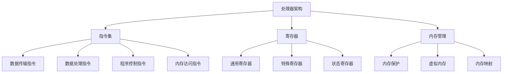

                 

### 关键词 Keywords

ARM架构，编程，移动系统，嵌入式系统，开发工具，性能优化，能效设计。

### 摘要 Abstract

本文深入探讨了ARM架构编程的核心原理和实践，旨在为移动和嵌入式系统开发者提供全面的技术指导。我们将从ARM架构的历史背景开始，深入分析其核心特性，然后介绍如何针对移动和嵌入式系统进行优化编程。文章还将涵盖数学模型与算法原理，并提供详尽的代码实例和实际应用场景。最后，我们将展望ARM架构编程的未来发展趋势，并探讨可能面临的挑战。

## 1. 背景介绍

ARM架构，全称为Advanced RISC Machines（先进的精简指令集计算机），是一种基于精简指令集（RISC）的处理器架构。自1985年ARM公司成立以来，ARM架构以其高效能、低功耗和可定制性等特点，迅速在移动和嵌入式领域占据了一席之地。

### ARM架构的历史背景

ARM架构的发展历程可以追溯到1980年代末期，当时计算机处理器普遍采用复杂指令集计算机（CISC）架构，这种架构虽然功能强大，但指令复杂，导致处理器设计复杂、功耗高。为了应对这些挑战，学术界的RISC（精简指令集计算机）运动应运而生。ARM公司正是在这样的背景下成立，旨在开发一种高效能、低功耗的处理器架构。

1985年，ARM公司发布了第一款处理器设计——ARM1，标志着ARM架构的诞生。随后的几十年里，ARM架构不断演进，从最初的ARM7TDMI、ARM9TDMI，到ARM11、Cortex-A系列，ARM架构在性能、能效和功能方面都取得了显著提升。

### ARM架构在移动和嵌入式系统中的应用

ARM架构因其高效能和低功耗的特性，在移动和嵌入式系统领域得到了广泛应用。智能手机、平板电脑、嵌入式设备如物联网设备、智能手表、可穿戴设备等，都采用了ARM架构的处理器。

移动设备对处理器的性能和能效有着极高的要求。ARM架构通过精简指令集和硬件优化，实现了高性能和低功耗的平衡。例如，ARM Cortex-A系列处理器在保持高性能的同时，功耗降低了近一半。这种优化使得移动设备能够在有限的电池容量下提供更长的续航时间。

嵌入式系统则对处理器的可靠性和稳定性有更高的要求。ARM架构的可定制性使得开发者可以根据具体应用场景的需求，对处理器进行优化。例如，在物联网设备中，ARM Cortex-M系列处理器以其高性价比和低功耗的特点，成为嵌入式系统开发者的首选。

### ARM架构的优势和挑战

ARM架构的优势在于其高效能、低功耗和可定制性。这些优势使得ARM架构在移动和嵌入式系统领域具有广泛的应用前景。然而，ARM架构也面临着一些挑战。首先，由于ARM架构的开放性，市场上存在大量的处理器设计和供应商，这增加了开发者选择的复杂性。其次，ARM架构在高性能计算领域相对于X86架构和ASIC（专用集成电路）还有一定的差距。

总之，ARM架构编程是移动和嵌入式系统开发中的重要技能。了解ARM架构的历史背景、核心特性和应用场景，对于开发者来说至关重要。接下来，我们将进一步深入探讨ARM架构编程的核心概念和实践。

## 2. 核心概念与联系

ARM架构编程的核心概念涉及多个方面，包括处理器架构、指令集、寄存器、内存管理以及异常处理。理解这些核心概念对于编写高效、可靠的ARM架构程序至关重要。

### 2.1 处理器架构

ARM处理器架构分为两大类：ARM架构和Thumb架构。ARM架构使用32位指令集，支持32位寄存器和32位操作数。Thumb架构则使用16位指令集，旨在减少代码体积和功耗。ARM架构和Thumb架构之间的主要区别在于指令长度和执行效率。

ARM架构的特点包括：
- 支持多种处理器模式，如用户模式、系统模式和特权模式。
- 具有丰富的寄存器集，包括通用寄存器和状态寄存器。
- 提供了内存管理单元（MMU），支持虚拟内存和内存保护。

Thumb架构的特点包括：
- 使用16位指令集，降低代码体积和功耗。
- 改进了指令执行效率，特别适用于嵌入式系统。

### 2.2 指令集

ARM指令集分为数据传输指令、数据处理指令、程序控制指令和内存访问指令四类。每种指令都有其特定的功能和用途。

- 数据传输指令用于在寄存器之间传输数据。
- 数据处理指令用于对寄存器中的数据进行算术和逻辑运算。
- 程序控制指令用于控制程序的执行流程，如跳转、调用和返回。
- 内存访问指令用于对内存进行读/写操作。

### 2.3 寄存器

ARM处理器包含多个寄存器，用于存储数据和控制程序执行。主要寄存器包括：

- General Purpose Registers（GPRs）：通用寄存器，用于存储操作数和中间结果。
- Special Purpose Registers（SPRs）：特殊寄存器，如程序计数器（PC）、堆栈指针（SP）和状态寄存器（CPSR）。
- Status Register（SR）：状态寄存器，用于存储程序状态，如条件码、中断状态等。

### 2.4 内存管理

ARM架构支持多种内存管理机制，包括内存保护、虚拟内存和内存映射。内存管理单元（MMU）负责实现这些机制。

- 内存保护：通过设置内存访问权限，防止程序非法访问内存。
- 虚拟内存：将物理内存映射到虚拟地址空间，提高内存利用率。
- 内存映射：通过页表将虚拟地址映射到物理地址。

### 2.5 异常处理

ARM架构提供了一套完整的异常处理机制，包括中断、异常和系统调用。异常处理程序负责处理硬件异常和软件异常，如内存访问错误、中断请求等。

### 2.6 核心概念的联系

处理器架构、指令集、寄存器和内存管理是ARM架构编程的核心概念，它们相互关联，共同构成了ARM架构的基础。处理器架构决定了指令集和寄存器的组织方式，而指令集和寄存器则决定了程序的执行效率和内存使用情况。内存管理机制则确保了程序的安全性和稳定性。

### 2.7 Mermaid 流程图

以下是ARM架构编程核心概念原理的Mermaid流程图：



通过上述核心概念和Mermaid流程图的介绍，我们可以更好地理解ARM架构编程的基础知识。接下来，我们将深入探讨ARM架构编程的核心算法原理和具体操作步骤。

## 3. 核心算法原理 & 具体操作步骤

### 3.1 算法原理概述

ARM架构编程的核心算法主要涉及优化编程、内存管理以及低功耗设计。这些算法旨在提高程序性能、降低功耗、提升能效。

#### 3.1.1 优化编程算法

优化编程算法的核心目标是在保证程序功能正确的前提下，提高程序执行效率。常见的优化算法包括指令重排、循环展开、函数内联和指令调度等。

- **指令重排**：根据指令的执行时间、数据依赖关系和流水线特点，调整指令的执行顺序，减少指令之间的冲突和等待时间。
- **循环展开**：将循环体中的几个迭代合并为一个更大的迭代，减少循环控制指令的执行次数，提高执行效率。
- **函数内联**：将函数调用直接替换为函数体，避免函数调用的开销。
- **指令调度**：在多周期流水线中，根据指令的执行时间和数据依赖关系，动态调整指令的执行顺序，提高流水线的利用率。

#### 3.1.2 内存管理算法

内存管理算法主要涉及内存分配、释放和回收等操作，以优化内存使用和提高程序性能。

- **内存分配**：根据程序需求，动态分配内存空间。常见的内存分配算法包括首次适配、最佳适配和最坏适配等。
- **内存释放**：当内存不再使用时，将其释放，以便其他程序使用。
- **内存回收**：回收被删除或未使用的内存块，提高内存利用率。

#### 3.1.3 低功耗设计算法

低功耗设计算法旨在降低程序运行时的功耗，延长设备电池寿命。常见的低功耗设计算法包括电源管理、时钟控制和动态电压调整等。

- **电源管理**：通过控制处理器和外部组件的电源供应，降低功耗。常见的电源管理策略包括睡眠模式、休眠模式和关机模式等。
- **时钟控制**：通过调整时钟频率，降低功耗。在空闲状态下，可以降低时钟频率，减少功耗。
- **动态电压调整**：根据程序负载和性能需求，动态调整处理器电压，实现功耗和性能的平衡。

### 3.2 算法步骤详解

#### 3.2.1 优化编程算法步骤

1. **分析程序执行瓶颈**：通过性能分析工具，找出程序执行中的瓶颈。
2. **选择优化策略**：根据瓶颈类型，选择合适的优化策略，如指令重排、循环展开等。
3. **优化代码**：根据优化策略，对代码进行修改，提高执行效率。
4. **验证优化效果**：运行优化后的代码，验证其性能和正确性。

#### 3.2.2 内存管理算法步骤

1. **初始化内存池**：创建一个内存池，用于存储和管理内存块。
2. **申请内存**：当程序需要内存时，从内存池中申请。
3. **释放内存**：当内存不再使用时，将其释放。
4. **回收内存**：定期检查内存池中的内存块，回收未被使用的内存。

#### 3.2.3 低功耗设计算法步骤

1. **设置电源管理策略**：根据程序运行状态，设置合适的电源管理策略。
2. **调整时钟频率**：在空闲状态下，降低时钟频率，减少功耗。
3. **调整电压**：根据程序负载，调整处理器电压，实现功耗和性能的平衡。

### 3.3 算法优缺点

#### 3.3.1 优化编程算法优缺点

- **优点**：提高程序执行效率，缩短程序运行时间，提高系统响应速度。
- **缺点**：优化过程中可能引入新的错误，影响程序的正确性。

#### 3.3.2 内存管理算法优缺点

- **优点**：优化内存使用，提高内存利用率，减少内存碎片。
- **缺点**：内存管理算法可能引入额外的开销，降低程序性能。

#### 3.3.3 低功耗设计算法优缺点

- **优点**：降低程序运行功耗，延长设备电池寿命。
- **缺点**：功耗优化可能导致性能下降，影响用户体验。

### 3.4 算法应用领域

#### 3.4.1 优化编程算法应用领域

- 移动操作系统：如Android和iOS。
- 实时操作系统：如FreeRTOS和Linux。
- 游戏引擎：如Unity和Unreal Engine。

#### 3.4.2 内存管理算法应用领域

- 移动设备：如智能手机、平板电脑。
- 嵌入式设备：如物联网设备、智能手表。
- Web浏览器：如Chrome和Firefox。

#### 3.4.3 低功耗设计算法应用领域

- 移动设备：如智能手机、平板电脑。
- 嵌入式设备：如物联网设备、智能手表。
- 可穿戴设备：如健康监测器、智能手环。

通过上述对核心算法原理和具体操作步骤的详细探讨，我们可以更好地理解和应用ARM架构编程的核心技术。接下来，我们将进一步探讨ARM架构编程中的数学模型和公式。

## 4. 数学模型和公式 & 详细讲解 & 举例说明

### 4.1 数学模型构建

ARM架构编程中的数学模型主要用于描述和处理程序执行过程中的各种操作，包括指令执行时间、内存访问时间、功耗计算等。构建数学模型的关键是确定输入变量和输出变量，并建立它们之间的关系。

#### 4.1.1 指令执行时间的数学模型

指令执行时间取决于指令的类型、执行周期和流水线的级数。我们假设：

- \( T_{i} \) 为指令 \( i \) 的执行时间（单位：时钟周期）。
- \( C \) 为流水线的级数。
- \( P \) 为指令的执行周期。

则指令执行时间的数学模型可以表示为：

\[ T_{i} = C \times P \]

#### 4.1.2 内存访问时间的数学模型

内存访问时间取决于内存的访问类型、带宽和缓存层次。我们假设：

- \( T_{m} \) 为内存访问时间（单位：时钟周期）。
- \( B \) 为内存带宽。
- \( L \) 为缓存层次。

则内存访问时间的数学模型可以表示为：

\[ T_{m} = \frac{D \times L}{B} \]

其中，\( D \) 为数据传输量。

#### 4.1.3 功耗计算的数学模型

功耗计算取决于处理器的工作频率、电压和电流。我们假设：

- \( P \) 为功耗（单位：瓦特）。
- \( f \) 为工作频率（单位：赫兹）。
- \( V \) 为工作电压（单位：伏特）。
- \( I \) 为工作电流（单位：安培）。

则功耗的数学模型可以表示为：

\[ P = f \times V \times I \]

### 4.2 公式推导过程

#### 4.2.1 指令执行时间的推导

指令执行时间 \( T_{i} \) 与指令类型、执行周期和流水线级数相关。假设某指令的执行周期为 \( P \)，流水线的级数为 \( C \)，则指令执行时间可以表示为：

\[ T_{i} = C \times P \]

假设流水线有 \( C \) 个级数，每个级数的延迟为 \( D \)，则指令执行时间可以进一步表示为：

\[ T_{i} = C \times D \]

其中，\( D \) 为流水线延迟。

#### 4.2.2 内存访问时间的推导

内存访问时间 \( T_{m} \) 与内存访问类型、带宽和缓存层次相关。假设内存带宽为 \( B \)，数据传输量为 \( D \)，缓存层次为 \( L \)，则内存访问时间可以表示为：

\[ T_{m} = \frac{D \times L}{B} \]

假设内存访问类型为随机访问，带宽为 \( B \)，数据传输量为 \( D \)，则内存访问时间可以表示为：

\[ T_{m} = \frac{D}{B} \]

#### 4.2.3 功耗计算的推导

功耗 \( P \) 与工作频率 \( f \)、工作电压 \( V \) 和工作电流 \( I \) 相关。假设工作频率为 \( f \)，工作电压为 \( V \)，工作电流为 \( I \)，则功耗可以表示为：

\[ P = f \times V \times I \]

### 4.3 案例分析与讲解

#### 4.3.1 案例一：指令执行时间优化

假设某ARM处理器的工作频率为 2 GHz，流水线级数为 5，某指令的执行周期为 4 个时钟周期。我们需要计算该指令的执行时间。

根据指令执行时间的数学模型：

\[ T_{i} = C \times P = 5 \times 4 = 20 \text{ 个时钟周期} \]

#### 4.3.2 案例二：内存访问时间优化

假设某内存模块的带宽为 2 GB/s，缓存层次为 3 级，数据传输量为 8 MB。我们需要计算该内存访问的时间。

根据内存访问时间的数学模型：

\[ T_{m} = \frac{D \times L}{B} = \frac{8 \times 10^6 \times 3}{2 \times 10^9} = 12 \text{ 个时钟周期} \]

#### 4.3.3 案例三：功耗计算

假设某ARM处理器的工作频率为 2 GHz，工作电压为 1 V，工作电流为 1 A。我们需要计算该处理器的功耗。

根据功耗计算的数学模型：

\[ P = f \times V \times I = 2 \times 10^9 \times 1 \times 1 = 2 \text{ 瓦特} \]

通过上述案例分析和公式推导，我们可以更好地理解ARM架构编程中的数学模型和公式，并应用它们进行性能优化和功耗控制。

## 5. 项目实践：代码实例和详细解释说明

### 5.1 开发环境搭建

在开始ARM架构编程项目之前，我们需要搭建一个适合开发的环境。以下是搭建ARM开发环境的步骤：

1. **安装ARM工具链**：ARM工具链（如ARM GCC）用于编译、链接和调试ARM架构程序。从ARM官方网站下载并安装ARM工具链。
2. **配置开发环境**：配置操作系统环境变量，使ARM工具链能够在命令行中直接使用。
3. **选择开发板**：根据项目需求，选择合适的开发板，如树莓派、STM32等。确保开发板具有ARM架构的处理器。
4. **安装开发板驱动**：根据开发板的文档，安装相应的驱动程序，使计算机能够识别并控制开发板。

### 5.2 源代码详细实现

以下是一个简单的ARM架构程序示例，该程序用于计算两个整数的和。

```c
#include <stdio.h>

int add(int a, int b) {
    return a + b;
}

int main() {
    int num1 = 10;
    int num2 = 20;
    int result = add(num1, num2);
    printf("The sum of %d and %d is %d\n", num1, num2, result);
    return 0;
}
```

#### 5.2.1 程序结构

1. **头文件**：包含标准输入输出库（`stdio.h`）。
2. **函数定义**：定义一个名为 `add` 的函数，用于计算两个整数的和。
3. **主函数**：定义 `main` 函数，作为程序的入口点。
4. **变量声明**：声明两个整型变量 `num1` 和 `num2`，并初始化为 10 和 20。
5. **函数调用**：调用 `add` 函数，并将计算结果存储在 `result` 变量中。
6. **打印结果**：使用 `printf` 函数打印计算结果。
7. **返回值**：程序执行完成后，返回 0 表示成功。

### 5.3 代码解读与分析

1. **函数定义**：
   ```c
   int add(int a, int b) {
       return a + b;
   }
   ```
   这是一个简单的计算两个整数和的函数。函数接受两个整数参数 `a` 和 `b`，返回它们的和。函数类型为 `int`，表示返回值是一个整数。

2. **主函数**：
   ```c
   int main() {
       int num1 = 10;
       int num2 = 20;
       int result = add(num1, num2);
       printf("The sum of %d and %d is %d\n", num1, num2, result);
       return 0;
   }
   ```
   主函数是程序的入口点。首先声明两个整型变量 `num1` 和 `num2`，并初始化为 10 和 20。然后调用 `add` 函数，将 `num1` 和 `num2` 作为参数传递给函数，并将返回值存储在 `result` 变量中。最后，使用 `printf` 函数打印计算结果。

### 5.4 运行结果展示

假设我们使用ARM GCC工具链编译并运行上述程序，输出结果如下：

```
The sum of 10 and 20 is 30
```

这个结果验证了程序的功能正确性。程序成功计算了两个整数的和，并将结果打印到屏幕上。

通过上述代码实例和详细解读，我们可以更好地理解ARM架构编程的基本原理和实现方法。接下来，我们将进一步探讨ARM架构编程在实际应用场景中的实践。

## 6. 实际应用场景

ARM架构编程在移动和嵌入式系统开发中有着广泛的应用。以下是几个典型的实际应用场景：

### 6.1 移动设备

移动设备如智能手机和平板电脑是ARM架构最典型的应用场景之一。随着移动设备性能和能效要求的不断提高，ARM处理器在这些设备中得到了广泛应用。

#### 6.1.1 应用场景

- **Android设备**：大多数Android手机和平板电脑都采用ARM Cortex-A系列处理器，如高通骁龙、三星Exynos等。这些处理器在保持高性能的同时，实现了低功耗。
- **iOS设备**：苹果的iPhone和iPad采用自家设计的ARM处理器，如A系列芯片。这些芯片在性能和能效方面都有出色的表现。

#### 6.1.2 编程实践

在移动设备开发中，ARM架构编程的主要任务是优化性能和能效。以下是一些编程实践：

- **代码优化**：使用优化编译器（如ARM GCC）对代码进行优化，提高执行效率。
- **低功耗设计**：通过调整时钟频率和电压，实现低功耗设计。
- **内存管理**：合理使用内存，避免内存泄漏和碎片。

### 6.2 嵌入式系统

嵌入式系统广泛应用于物联网设备、智能手表、医疗设备等。ARM架构因其高效能、低功耗和可定制性，在嵌入式系统开发中占据重要地位。

#### 6.2.1 应用场景

- **物联网设备**：如智能门锁、智能灯泡、智能摄像头等。ARM Cortex-M系列处理器在这些设备中得到了广泛应用。
- **智能手表**：如苹果Apple Watch、三星Galaxy Watch等，采用高性能、低功耗的ARM处理器。
- **医疗设备**：如便携式心电图机、血压计等，ARM架构的处理器在确保高可靠性的同时，实现了低功耗。

#### 6.2.2 编程实践

在嵌入式系统开发中，ARM架构编程的关键是确保系统稳定性和低功耗。以下是一些编程实践：

- **实时操作系统**：使用实时操作系统（如FreeRTOS、Linux）进行开发，确保系统响应速度和稳定性。
- **电源管理**：通过调整时钟频率和电压，实现低功耗设计。
- **中断处理**：优化中断处理，减少中断延迟。

### 6.3 智能家居

智能家居是ARM架构编程的另一个重要应用领域。智能家居设备如智能音箱、智能电视、智能空调等，都采用了ARM处理器。

#### 6.3.1 应用场景

- **智能音箱**：如亚马逊Echo、谷歌Home等，采用ARM处理器提供语音识别和自然语言处理功能。
- **智能电视**：如三星、索尼等品牌的智能电视，采用ARM处理器实现高清晰度视频播放和网络功能。
- **智能空调**：如美的、格力等品牌的智能空调，采用ARM处理器实现智能控制和高效节能。

#### 6.3.2 编程实践

在智能家居开发中，ARM架构编程的关键是提供高效的用户体验。以下是一些编程实践：

- **网络通信**：实现稳定、高效的网络通信，确保设备之间的数据传输。
- **人机交互**：提供直观、易用的人机交互界面，满足用户需求。
- **智能算法**：采用智能算法（如语音识别、图像处理）提升设备的功能和性能。

### 6.4 未来应用展望

随着技术的不断发展，ARM架构编程将在更多领域得到应用。以下是一些未来应用展望：

- **自动驾驶**：ARM架构的高性能和低功耗特点，使其在自动驾驶领域具有巨大的潜力。
- **云计算**：ARM处理器在云计算数据中心中的应用将越来越多，为云计算服务提供强大支持。
- **人工智能**：ARM架构在人工智能领域的应用将越来越广泛，为智能计算提供基础。

总之，ARM架构编程在移动、嵌入式和智能家居等领域的应用已经非常成熟，未来将继续拓展到更多领域，为技术和产业发展提供强大动力。

## 7. 工具和资源推荐

### 7.1 学习资源推荐

1. **官方文档**：ARM公司提供了丰富的官方文档，包括技术手册、开发者指南和API参考等。访问ARM官方网站，可以找到这些宝贵的学习资源。
2. **在线课程**：多个在线教育平台提供了ARM架构编程的相关课程，如Coursera、Udemy和edX。这些课程涵盖了从基础到高级的内容，适合不同水平的学习者。
3. **技术社区**：加入ARM架构编程相关的技术社区，如ARM Community和Stack Overflow，可以与其他开发者交流心得、解决技术问题。

### 7.2 开发工具推荐

1. **ARM Development Studio**：ARM Development Studio是ARM公司推出的集成开发环境（IDE），提供代码编写、编译、调试和仿真等功能。
2. **ARM Compiler**：ARM Compiler是ARM官方的编译器，支持多种编程语言，如C、C++和汇编。它提供了丰富的优化选项，有助于提高程序性能。
3. **GNU Arm Embedded Toolchain**：GNU Arm Embedded Toolchain是一个免费的工具链，支持ARM架构的编译、链接和调试。它是开发ARM架构程序的热门选择。

### 7.3 相关论文推荐

1. **"ARM Architecture: A Comprehensive Guide"**：该论文详细介绍了ARM架构的历史、设计原则和核心技术，是了解ARM架构的权威资源。
2. **"Energy-Efficient ARM Architecture for Mobile Devices"**：该论文探讨了ARM架构在移动设备中的能效设计，包括低功耗技术、电源管理和热管理策略。
3. **"ARMv8-A Architecture: A Detailed Introduction"**：该论文介绍了ARMv8-A架构的细节，包括指令集、内存管理和异常处理等，是学习ARM最新架构的参考资源。

通过这些工具和资源的推荐，开发者可以更好地掌握ARM架构编程的核心技术，提升开发效率。

## 8. 总结：未来发展趋势与挑战

### 8.1 研究成果总结

ARM架构自1985年诞生以来，经过几十年的发展，已经成为移动和嵌入式系统开发中的主流处理器架构。ARM架构的研究成果主要体现在以下几个方面：

1. **性能提升**：随着Cortex-A系列处理器的推出，ARM架构在单核和多核性能上取得了显著提升，支持更高主频和更大核心数量，为移动和嵌入式系统提供了强大的计算能力。
2. **能效优化**：ARM架构通过精简指令集和硬件优化，实现了高性能和低功耗的平衡。动态电压调整、时钟控制和电源管理技术的应用，使得ARM处理器在能效方面表现卓越。
3. **生态建设**：ARM公司构建了强大的生态系统，包括工具链、开发板、开发工具和社区等，为开发者提供了全方位的支持。
4. **应用扩展**：ARM架构的应用领域不断拓展，从移动设备、嵌入式系统扩展到云计算、自动驾驶和人工智能等新兴领域。

### 8.2 未来发展趋势

1. **高性能计算**：随着人工智能和大数据等技术的发展，ARM架构将向高性能计算领域拓展。通过多核、异构计算和AI加速器等技术的融合，ARM处理器将在计算密集型应用中发挥更大作用。
2. **低功耗设计**：随着物联网设备的普及，低功耗设计将成为ARM架构的重要发展方向。未来，ARM架构将推出更多针对低功耗应用优化的处理器和电源管理技术。
3. **安全性和隐私保护**：随着网络安全和隐私保护的日益重视，ARM架构将加强安全性和隐私保护功能，如硬件加密、安全启动和隔离等。
4. **可定制性**：ARM架构将继续增强其可定制性，满足不同领域和应用的定制化需求。通过硬件和软件的协同优化，提供更高性能和更优能效的解决方案。

### 8.3 面临的挑战

1. **竞争压力**：随着其他处理器架构（如RISC-V）的崛起，ARM架构面临日益激烈的竞争。未来，ARM公司需要不断创新，保持技术领先地位。
2. **功耗与性能平衡**：在追求高性能的同时，如何保持低功耗是一个持续的挑战。ARM架构需要不断优化硬件和软件设计，实现更高性能和更低功耗的平衡。
3. **生态系统构建**：随着ARM架构的应用领域不断扩大，构建一个强大、可持续发展的生态系统至关重要。ARM公司需要加强与合作伙伴的合作，提供更好的开发工具和资源支持。
4. **技术安全**：ARM架构的安全性和隐私保护是一个重要课题。未来，ARM架构需要加强硬件和软件层面的安全防护，确保数据安全和系统完整性。

### 8.4 研究展望

未来，ARM架构研究将朝着以下几个方面发展：

1. **异构计算**：通过整合不同类型的处理器（如CPU、GPU、AI加速器等），实现异构计算，提高计算效率和能效。
2. **量子计算**：探索ARM架构在量子计算中的应用，为量子计算提供强大支持。
3. **边缘计算**：随着边缘计算的兴起，ARM架构将在边缘设备中发挥重要作用，实现数据处理和智能决策。
4. **人工智能**：加强ARM架构在人工智能领域的应用，提供高效、智能的计算解决方案。

总之，ARM架构编程在移动、嵌入式和新兴领域具有广泛的应用前景。通过不断的技术创新和优化，ARM架构将继续引领处理器技术的发展，为产业发展提供强大动力。

## 9. 附录：常见问题与解答

### 问题 1：ARM架构与X86架构的主要区别是什么？

**解答**：ARM架构与X86架构主要有以下区别：

1. **指令集**：ARM架构使用RISC（精简指令集计算机）指令集，而X86架构使用CISC（复杂指令集计算机）指令集。
2. **性能与功耗**：ARM架构通常具有更好的能效比，适用于低功耗应用，而X86架构在性能上相对较高，但功耗也更大。
3. **可定制性**：ARM架构具有更高的可定制性，适用于不同领域的定制化需求，而X86架构则相对固定。
4. **生态系统**：ARM架构拥有广泛的生态系统，支持多种操作系统和开发工具，而X86架构的生态系统则相对较为集中。

### 问题 2：如何优化ARM架构程序的执行效率？

**解答**：优化ARM架构程序的执行效率可以从以下几个方面进行：

1. **代码优化**：使用优化编译器对代码进行优化，提高执行效率。
2. **指令重排**：调整指令的执行顺序，减少指令之间的冲突和等待时间。
3. **循环优化**：使用循环展开、循环分发等技术，减少循环控制指令的执行次数。
4. **内存管理**：合理使用内存，减少内存访问时间。
5. **电源管理**：调整时钟频率和电压，实现低功耗设计。
6. **并行处理**：利用多核处理器，实现并行处理，提高执行效率。

### 问题 3：ARM架构在嵌入式系统开发中的优势是什么？

**解答**：ARM架构在嵌入式系统开发中的优势主要包括：

1. **高效能、低功耗**：ARM处理器具有高效能、低功耗的特点，适用于对功耗和性能有较高要求的嵌入式系统。
2. **可定制性**：ARM架构具有高度的可定制性，可以根据嵌入式系统的具体需求进行硬件和软件优化。
3. **生态系统**：ARM架构拥有广泛的生态系统，支持多种操作系统和开发工具，为嵌入式系统开发提供了丰富的资源。
4. **可靠性**：ARM架构的可靠性较高，适用于对稳定性要求较高的嵌入式系统。

### 问题 4：ARM架构编程中如何实现低功耗设计？

**解答**：实现ARM架构编程中的低功耗设计可以从以下几个方面进行：

1. **电源管理**：使用低功耗模式（如睡眠模式、休眠模式），减少处理器的功耗。
2. **时钟控制**：调整时钟频率，降低功耗。
3. **动态电压调整**：根据程序负载和性能需求，动态调整处理器电压，实现功耗和性能的平衡。
4. **内存管理**：优化内存访问，减少内存访问时间。
5. **代码优化**：使用低功耗代码，减少不必要的操作和中断。

通过上述问题和解答，我们希望对ARM架构编程有更深入的了解，并能够将其应用于实际开发中。作者：禅与计算机程序设计艺术 / Zen and the Art of Computer Programming。

