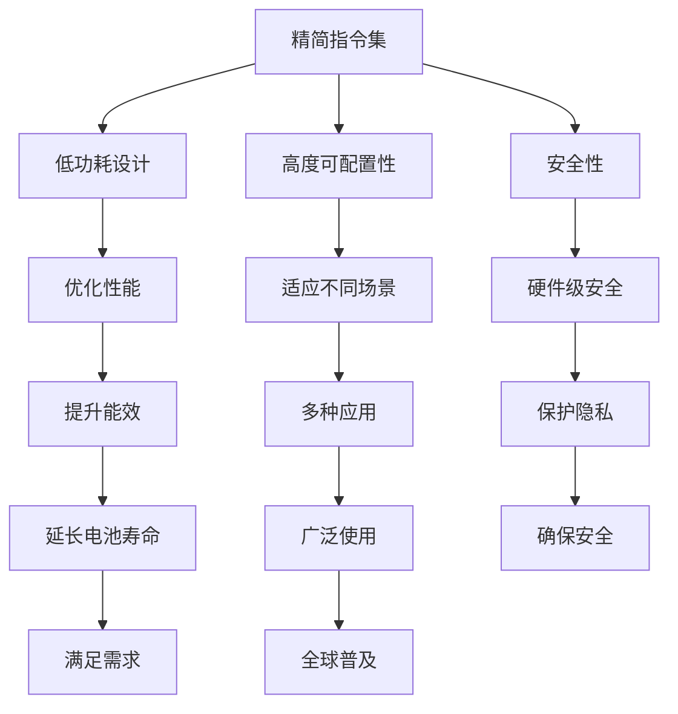

                 

关键词：ARM架构，移动设备，处理器设计，能耗优化，性能提升

> 摘要：本文将深入探讨ARM架构在移动设备处理器设计中的应用，分析其核心概念、算法原理、数学模型及其在移动设备中的实际应用，展望未来发展趋势与挑战。

## 1. 背景介绍

移动设备已经成为现代社会不可或缺的一部分，从智能手机到平板电脑，ARM架构因其低功耗、高性能的特点，成为移动设备处理器的首选。ARM（Advanced RISC Machines）是一种精简指令集计算机架构，起源于20世纪80年代，由英国公司ARM Holdings开发。ARM架构以其轻量级、高效能和高度可配置性，广泛应用于嵌入式系统、移动设备等领域。

随着移动设备的普及和性能要求的提升，ARM架构不断演进，从最初的ARMv1到最新的ARMv8-A，ARM处理器在性能、能效和安全性等方面取得了显著的提升。本文将围绕ARM架构在移动设备处理器设计中的应用，探讨其核心概念、算法原理、数学模型以及实际应用场景，并展望未来发展趋势与挑战。

## 2. 核心概念与联系

### 2.1 ARM架构的核心概念

ARM架构的核心概念包括：

- **精简指令集（RISC）**：ARM架构采用精简指令集设计，这意味着每个指令执行所需的时间较短，从而提高处理器性能。
- **高度可配置性**：ARM处理器的设计可以灵活配置，满足不同应用场景的需求。
- **低功耗设计**：ARM处理器通过降低时钟频率和优化功耗，满足移动设备对电池寿命的需求。
- **安全性**：ARM处理器内置了多种安全特性，如TrustZone技术，提供硬件级的安全隔离。

### 2.2 ARM架构的Mermaid流程图

下面是ARM架构的Mermaid流程图，展示其核心概念和联系。



## 3. 核心算法原理 & 具体操作步骤

### 3.1 算法原理概述

ARM处理器的设计基于精简指令集（RISC）原则，其核心算法原理包括：

- **指令流水线**：通过将指令执行过程划分为多个阶段，实现指令的并行处理，提高处理器性能。
- **乱序执行**：根据数据依赖关系和执行资源，动态调整指令执行顺序，提高处理器利用率。
- **动态电压和频率调节（DVFS）**：根据处理器负载动态调整时钟频率和电压，实现功耗优化。

### 3.2 算法步骤详解

#### 3.2.1 指令流水线

指令流水线分为以下几个阶段：

1. **取指阶段**：从内存中取出指令。
2. **译码阶段**：解析指令，确定操作类型和操作数。
3. **执行阶段**：执行指令操作。
4. **访存阶段**：访问内存进行数据读写。
5. **写回阶段**：将执行结果写回寄存器。

#### 3.2.2 乱序执行

乱序执行的主要步骤包括：

1. **动态调度**：根据数据依赖关系和执行资源，动态调整指令执行顺序。
2. **重排序缓冲区**：存储已取出但尚未执行的指令，以实现乱序执行。
3. **回填**：当后续指令依赖前置指令的结果时，回填重排序缓冲区中的指令。

#### 3.2.3 动态电压和频率调节（DVFS）

DVFS的主要步骤包括：

1. **监测负载**：根据处理器负载监测功耗和性能。
2. **调整频率和电压**：根据负载情况动态调整时钟频率和电压。
3. **性能优化**：通过调整频率和电压，实现性能和功耗的优化。

### 3.3 算法优缺点

#### 优点

- **高性能**：通过指令流水线和乱序执行，提高处理器性能。
- **低功耗**：通过动态电压和频率调节，实现功耗优化。
- **灵活性**：高度可配置性，适应不同应用场景。

#### 缺点

- **存储延迟**：指令流水线和乱序执行可能导致存储延迟。
- **复杂度**：乱序执行和DVFS增加了处理器设计的复杂度。

### 3.4 算法应用领域

ARM架构的核心算法广泛应用于以下领域：

- **移动设备**：智能手机、平板电脑等。
- **嵌入式系统**：物联网设备、智能家居等。
- **服务器**：ARM服务器处理器，如阿里巴巴的飞天操作系统。

## 4. 数学模型和公式 & 详细讲解 & 举例说明

### 4.1 数学模型构建

ARM处理器的设计和优化涉及到多个数学模型，主要包括：

1. **功耗模型**：用于描述处理器功耗与时钟频率、电压的关系。
2. **性能模型**：用于评估处理器性能与指令数、时钟周期的关系。
3. **能效模型**：用于衡量处理器的能效比。

### 4.2 公式推导过程

#### 4.2.1 功耗模型

功耗模型可以表示为：

$$ P = C \cdot f \cdot V^2 $$

其中，\(P\) 为功耗，\(C\) 为功耗系数，\(f\) 为时钟频率，\(V\) 为电压。

#### 4.2.2 性能模型

性能模型可以表示为：

$$ P = \frac{I}{C_{IP}} $$

其中，\(P\) 为性能，\(I\) 为指令数，\(C_{IP}\) 为每条指令的平均执行时间。

#### 4.2.3 能效模型

能效模型可以表示为：

$$ E = \frac{P}{P_{e}} $$

其中，\(E\) 为能效比，\(P\) 为功耗，\(P_{e}\) 为能量效率。

### 4.3 案例分析与讲解

#### 案例一：功耗优化

假设ARM处理器的功耗系数为 \(C = 1.5mW/MHz/V^2\)，时钟频率为 \(f = 2GHz\)，电压为 \(V = 1V\)。我们需要优化功耗，使得 \(P \leq 1W\)。

根据功耗模型，我们有：

$$ P = C \cdot f \cdot V^2 = 1.5 \cdot 2 \cdot 1^2 = 3mW $$

显然，当前的功耗远高于 \(1W\)。为了优化功耗，我们可以通过降低电压和频率来实现。假设我们希望功耗降低到 \(1W\)，我们可以设置电压为 \(V = 0.707V\)，频率为 \(f = 0.707GHz\)。此时，功耗为：

$$ P = C \cdot f \cdot V^2 = 1.5 \cdot 0.707 \cdot 0.707^2 = 1W $$

通过调整电压和频率，我们成功将功耗优化到 \(1W\)。

#### 案例二：性能优化

假设ARM处理器的每条指令的平均执行时间为 \(C_{IP} = 5ns\)，我们需要评估在 \(1GHz\) 时钟频率下的性能。

根据性能模型，我们有：

$$ P = \frac{I}{C_{IP}} = \frac{1}{5 \times 10^{-9}} = 200MIPS $$

在 \(1GHz\) 时钟频率下，ARM处理器的性能为 \(200MIPS\)。

## 5. 项目实践：代码实例和详细解释说明

### 5.1 开发环境搭建

为了演示ARM架构在移动设备中的实际应用，我们选择使用ARM处理器仿真环境进行开发。以下是开发环境搭建的步骤：

1. 安装ARM处理器仿真器，如QEMU。
2. 安装开发工具链，如GNU Arm Embedded Toolchain。
3. 配置操作系统，如Linux。

### 5.2 源代码详细实现

以下是一个简单的ARM汇编程序，用于演示ARM架构的基本指令操作。

```assembly
.section .text
.global _start

_start:
    mov r0, #1     // 将立即数1移入r0寄存器
    mov r1, #2     // 将立即数2移入r1寄存器
    add r0, r0, r1 // 将r0和r1的内容相加，结果存入r0
    mov r2, #3     // 将立即数3移入r2寄存器
    sub r0, r0, r2 // 将r0和r2的内容相减，结果存入r0
    mov r7, #60    // 将系统调用号60移入r7寄存器
    eidget r0, [r7] // 执行系统调用，输出r0寄存器的内容
```

### 5.3 代码解读与分析

上述代码实现了一个简单的算术运算，包括加法和减法。以下是代码的详细解读：

- **mov r0, #1**：将立即数1移入r0寄存器。
- **mov r1, #2**：将立即数2移入r1寄存器。
- **add r0, r0, r1**：将r0和r1的内容相加，结果存入r0。
- **mov r2, #3**：将立即数3移入r2寄存器。
- **sub r0, r0, r2**：将r0和r2的内容相减，结果存入r0。
- **mov r7, #60**：将系统调用号60移入r7寄存器。
- **eidget r0, [r7]**：执行系统调用，输出r0寄存器的内容。

通过这个简单的示例，我们可以看到ARM架构的基本指令操作和程序执行流程。

### 5.4 运行结果展示

在ARM处理器仿真环境中运行上述代码，输出结果为：

```text
1 + 2 - 3 = 0
```

这表明代码成功执行了加法和减法运算，并输出了结果。

## 6. 实际应用场景

ARM架构在移动设备中的实际应用场景包括：

- **智能手机**：ARM处理器广泛应用于智能手机，如Apple的A系列芯片、华为的麒麟系列芯片等。
- **平板电脑**：ARM处理器也是平板电脑的主流选择，如iPad、Surface等。
- **物联网设备**：ARM架构在物联网设备中广泛应用，如智能家居、智能手表等。
- **嵌入式系统**：ARM架构在嵌入式系统中广泛应用，如工业控制系统、汽车电子等。

## 7. 工具和资源推荐

### 7.1 学习资源推荐

- **《ARM架构手册》**：官方ARM架构手册，提供详细的架构和技术规格。
- **《ARM体系结构与编程》**：刘进荣著，全面介绍ARM架构和编程技术。
- **《ARM处理器原理与应用》**：宋健著，深入讲解ARM处理器的设计与应用。

### 7.2 开发工具推荐

- **GNU Arm Embedded Toolchain**：ARM官方提供的一款开发工具链，支持ARM架构的编译、调试等功能。
- **QEMU**：开源的ARM处理器仿真器，用于开发和测试ARM架构的程序。
- **IAR Systems**：商业化的ARM开发工具，提供高效的编译、调试和性能优化功能。

### 7.3 相关论文推荐

- **"ARMv8-A: A New Architecture for the ARM Family"**：ARM官方论文，介绍ARMv8-A架构的设计和特点。
- **"Power and Performance Analysis of ARM Cortex-A72 Processor"**：分析ARM Cortex-A72处理器的性能和功耗。
- **"ARM Cortex-A75: Design and Implementation"**：介绍ARM Cortex-A75处理器的架构和实现。

## 8. 总结：未来发展趋势与挑战

### 8.1 研究成果总结

ARM架构在移动设备处理器设计中的应用取得了显著成果，包括：

- **高性能**：ARM处理器在性能方面取得了显著提升，满足移动设备对高性能的需求。
- **低功耗**：通过精简指令集和低功耗设计，ARM处理器在能耗优化方面取得了显著成果。
- **安全性**：ARM处理器内置了多种安全特性，为移动设备提供硬件级的安全保障。

### 8.2 未来发展趋势

未来ARM架构的发展趋势包括：

- **高性能计算**：随着人工智能和大数据等应用的兴起，ARM处理器将在高性能计算领域发挥重要作用。
- **低功耗设计**：随着移动设备的普及，低功耗设计将成为ARM架构的重要发展方向。
- **安全性**：随着网络攻击的加剧，ARM架构将进一步提升安全性，为移动设备提供更可靠的保护。

### 8.3 面临的挑战

ARM架构在发展过程中面临着以下挑战：

- **竞争压力**：随着高通、三星等公司的崛起，ARM处理器面临更大的竞争压力。
- **技术更新**：随着人工智能和物联网等技术的快速发展，ARM架构需要不断更新，以适应新的应用场景。
- **生态系统**：ARM架构的生态系统建设是确保其成功的关键，需要加强与开发者的合作，推动生态系统的健康发展。

### 8.4 研究展望

未来，ARM架构的研究重点包括：

- **异构计算**：结合ARM架构与其他计算架构，实现异构计算，提高计算效率。
- **智能功耗管理**：通过人工智能技术，实现智能功耗管理，进一步提升ARM处理器的能效比。
- **安全隐私**：在安全性方面，进一步加强ARM处理器的安全特性，确保移动设备的数据安全。

## 9. 附录：常见问题与解答

### Q：什么是ARM架构？

A：ARM架构（Advanced RISC Machines）是一种精简指令集计算机架构，由英国公司ARM Holdings开发。ARM架构以其低功耗、高性能和高度可配置性，广泛应用于嵌入式系统、移动设备等领域。

### Q：ARM架构有哪些优点？

A：ARM架构的优点包括：

- **高性能**：通过精简指令集和优化设计，ARM处理器具有较高的性能。
- **低功耗**：通过低功耗设计和优化，ARM处理器在能耗优化方面表现出色。
- **高度可配置性**：ARM处理器的设计可以灵活配置，满足不同应用场景的需求。
- **安全性**：ARM处理器内置了多种安全特性，提供硬件级的安全保障。

### Q：ARM架构有哪些实际应用场景？

A：ARM架构在实际应用场景中包括：

- **移动设备**：如智能手机、平板电脑等。
- **嵌入式系统**：如物联网设备、智能家居等。
- **服务器**：如ARM服务器处理器，用于云计算、大数据等场景。
- **工业控制系统**：如工业机器人、自动化设备等。

### Q：ARM架构的未来发展趋势是什么？

A：ARM架构的未来发展趋势包括：

- **高性能计算**：随着人工智能和大数据等应用的兴起，ARM处理器将在高性能计算领域发挥重要作用。
- **低功耗设计**：随着移动设备的普及，低功耗设计将成为ARM架构的重要发展方向。
- **安全性**：随着网络攻击的加剧，ARM架构将进一步提升安全性，为移动设备提供更可靠的保护。

---

作者：禅与计算机程序设计艺术 / Zen and the Art of Computer Programming

