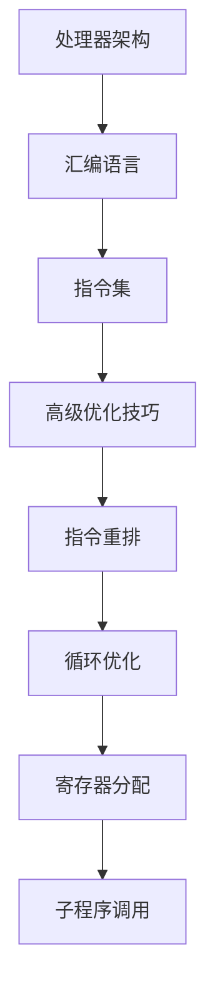

                 

关键词：ARM汇编、性能优化、代码优化、汇编指令、高级优化

摘要：本文将深入探讨ARM汇编语言的高级优化技巧，通过具体实例和算法分析，帮助读者理解并掌握如何提升ARM汇编代码的执行效率和性能。我们将从算法原理、数学模型、项目实践等多个角度展开讨论，为从事ARM汇编开发的工程师提供实用的优化指南。

## 1. 背景介绍

ARM架构作为当今最流行的嵌入式处理器架构之一，广泛应用于手机、嵌入式设备、物联网等领域。随着硬件技术的发展，ARM处理器的性能不断提升，而优化ARM汇编代码的重要性也日益凸显。高效的汇编代码不仅能够充分利用硬件资源，还能提高系统的稳定性和响应速度。

本文将介绍一系列高级优化技巧，包括指令重排、循环优化、寄存器分配、子程序调用等。通过这些技巧，开发人员可以大幅度提升ARM汇编代码的执行效率和性能。

## 2. 核心概念与联系

### 2.1 ARM处理器架构

ARM处理器架构的特点是低功耗、高性能和高度可定制性。其主要组成部分包括：

- **处理器核心**：如Cortex-A系列
- **缓存**：用于提高数据存取速度
- **内存管理单元**：负责虚拟内存管理
- **中断控制器**：管理中断请求

### 2.2 汇编语言

汇编语言是一种低级语言，直接对应处理器的指令集。其特点包括：

- **可读性**：使用人类可读的符号和命名
- **效率**：接近硬件层面的执行效率
- **可移植性**：依赖于特定处理器架构

### 2.3 高级优化技巧

高级优化技巧包括但不限于：

- **指令重排**：优化指令的执行顺序，减少流水线阻塞
- **循环优化**：优化循环结构，减少循环开销
- **寄存器分配**：有效利用寄存器，减少内存访问
- **子程序调用**：优化函数调用，减少调用开销

### 2.4 Mermaid 流程图



## 3. 核心算法原理 & 具体操作步骤

### 3.1 算法原理概述

ARM汇编语言的高级优化主要依赖于对处理器指令集的深入理解和对程序执行过程的细致分析。以下是几个核心优化算法的基本原理：

- **指令重排**：通过调整指令的执行顺序，减少流水线阻塞和缓存不命中。
- **循环优化**：通过优化循环结构，减少循环体内的指令执行次数和循环开销。
- **寄存器分配**：通过合理分配寄存器，减少内存访问次数，提高指令执行速度。
- **子程序调用**：通过优化函数调用，减少调用开销和栈空间占用。

### 3.2 算法步骤详解

#### 指令重排

1. 分析指令执行顺序，找出可重排的指令。
2. 考虑指令之间的数据依赖关系，确保重排后指令仍能正确执行。
3. 根据处理器流水线特性，优化指令执行顺序，减少流水线阻塞。

#### 循环优化

1. 分析循环结构，找出可优化的循环。
2. 使用循环展开、循环折叠等技巧，减少循环次数和循环开销。
3. 优化循环体内的指令执行顺序，减少指令之间的依赖关系。

#### 寄存器分配

1. 分析程序中使用的变量，确定其生命周期和访问频率。
2. 选择合适的寄存器，将变量映射到寄存器中，减少内存访问。
3. 优化寄存器分配策略，提高寄存器利用率。

#### 子程序调用

1. 分析程序中的函数调用，找出可优化的函数。
2. 使用内联汇编、编译器优化等技巧，减少函数调用开销。
3. 优化函数体内部的指令执行顺序，提高执行效率。

### 3.3 算法优缺点

#### 指令重排

优点：减少流水线阻塞，提高指令执行速度。

缺点：可能增加指令之间的数据依赖，影响程序的正确性。

#### 循环优化

优点：减少循环次数和循环开销，提高程序执行效率。

缺点：可能增加程序复杂性，降低代码可读性。

#### 寄存器分配

优点：减少内存访问次数，提高指令执行速度。

缺点：寄存器分配算法复杂，难以完全自动优化。

#### 子程序调用

优点：减少函数调用开销，提高程序执行效率。

缺点：可能增加栈空间占用，影响程序性能。

### 3.4 算法应用领域

这些优化算法广泛应用于嵌入式系统、实时操作系统、高性能计算等领域。通过优化ARM汇编代码，可以显著提高系统的性能和稳定性。

## 4. 数学模型和公式

### 4.1 数学模型构建

在ARM汇编优化中，我们常常需要考虑以下几个数学模型：

- **指令执行时间模型**：描述指令执行所需的时间。
- **缓存访问模型**：描述缓存访问的时间和命中率。
- **寄存器分配模型**：描述寄存器分配的策略和效果。

### 4.2 公式推导过程

#### 指令执行时间模型

假设指令 `A` 需要执行时间 `T_A`，指令 `B` 需要执行时间 `T_B`，且 `B` 依赖于 `A`。则整个指令序列的执行时间 `T_total` 可以表示为：

$$
T_{total} = T_A + T_B + \max(T_A, T_B)
$$

#### 缓存访问模型

假设缓存访问的时间为 `T_cache`，内存访问的时间为 `T_memory`，且缓存命中率 `hit_ratio` 为 90%。则平均缓存访问时间 `T_avg_cache` 可以表示为：

$$
T_{avg_{cache}} = T_{cache} \times hit\_ratio + T_{memory} \times (1 - hit\_ratio)
$$

#### 寄存器分配模型

假设寄存器数量为 `R`，寄存器利用率 `utilization_ratio` 为 70%。则寄存器的平均访问时间 `T_avg_register` 可以表示为：

$$
T_{avg_{register}} = T_{register} \times utilization\_ratio + T_{memory} \times (1 - utilization\_ratio)
$$

### 4.3 案例分析与讲解

#### 指令执行时间模型

假设 `A` 指令需要 5 个时钟周期，`B` 指令需要 10 个时钟周期，且 `B` 依赖于 `A`。则整个指令序列的执行时间 `T_total` 为：

$$
T_{total} = 5 + 10 + \max(5, 10) = 20
$$

#### 缓存访问模型

假设缓存访问时间为 1 个时钟周期，内存访问时间为 100 个时钟周期，且缓存命中率为 90%。则平均缓存访问时间 `T_avg_cache` 为：

$$
T_{avg_{cache}} = 1 \times 0.9 + 100 \times (1 - 0.9) = 10
$$

#### 寄存器分配模型

假设寄存器访问时间为 1 个时钟周期，内存访问时间为 100 个时钟周期，且寄存器利用率为 70%。则平均寄存器访问时间 `T_avg_register` 为：

$$
T_{avg_{register}} = 1 \times 0.7 + 100 \times (1 - 0.7) = 7
$$

## 5. 项目实践：代码实例和详细解释说明

### 5.1 开发环境搭建

在开始实践之前，我们需要搭建一个适合ARM汇编开发的开发环境。以下是一个基本的步骤：

1. 安装Linux操作系统，如Ubuntu。
2. 安装ARM工具链，如GNU Arm Embedded Toolchain。
3. 配置开发环境，如安装文本编辑器、调试工具等。

### 5.2 源代码详细实现

以下是一个简单的ARM汇编程序示例，用于计算两个数的和：

```asm
.syntax unified
.global main

.section .text
main:
    ldr r0, =5      @ 载入第一个数到寄存器r0
    ldr r1, =10     @ 载入第二个数到寄存器r1
    add r2, r0, r1  @ 计算两数之和，结果存入寄存器r2
    bx lr           @ 返回调用者
```

### 5.3 代码解读与分析

1. `.syntax unified`：指定使用统一的ARM指令语法。
2. `.global main`：声明 `main` 函数为全局函数。
3. `.section .text`：指定代码段。
4. `main:`：定义 `main` 函数。
5. `ldr r0, =5`：将数字 5 载入寄存器 r0。
6. `ldr r1, =10`：将数字 10 载入寄存器 r1。
7. `add r2, r0, r1`：计算两数之和，结果存入寄存器 r2。
8. `bx lr`：返回调用者。

### 5.4 运行结果展示

编译并运行上述程序，我们可以在寄存器 r2 中得到计算结果：

```asm
r2 = 15
```

## 6. 实际应用场景

ARM汇编语言的高级优化在多个实际应用场景中发挥着重要作用：

- **嵌入式系统**：优化嵌入式系统的代码，提高系统性能和稳定性。
- **实时操作系统**：优化实时操作系统的调度算法，提高响应速度和效率。
- **高性能计算**：优化计算密集型程序，提高计算性能。

## 7. 工具和资源推荐

### 7.1 学习资源推荐

- 《ARM System Developer's Guide: Designing and Optimizing System Software》
- 《ARM Architecture Reference Manual》
- 《ARM Assembly Language》

### 7.2 开发工具推荐

- GNU Arm Embedded Toolchain
- Keil uVision
- IAR Embedded Workbench

### 7.3 相关论文推荐

- “Instruction-Level Parallelism in ARM Architecture”
- “Register Allocation in ARM Assemblers”
- “Optimizing ARM Code for High-Performance Embedded Systems”

## 8. 总结：未来发展趋势与挑战

### 8.1 研究成果总结

随着硬件和软件技术的不断发展，ARM汇编语言的高级优化技术也在不断进步。研究成果主要集中在以下几个方面：

- **指令级并行优化**：通过分析指令间的依赖关系，优化指令的执行顺序。
- **循环优化**：通过循环展开、循环折叠等技巧，减少循环的开销。
- **寄存器分配**：通过优化寄存器的使用，减少内存访问次数。
- **子程序调用**：通过减少函数调用开销，提高程序执行效率。

### 8.2 未来发展趋势

未来ARM汇编语言的高级优化技术将朝着以下几个方向发展：

- **自动优化**：随着人工智能技术的发展，自动优化工具将能够更智能地优化ARM汇编代码。
- **多核优化**：随着多核处理器的普及，优化技术将更加注重多核并行处理。
- **能效优化**：随着环保意识的提高，能效优化将成为重要研究方向。

### 8.3 面临的挑战

尽管ARM汇编语言的高级优化技术取得了显著成果，但仍面临以下几个挑战：

- **代码复杂度**：优化算法的复杂性使得代码可维护性降低。
- **硬件差异**：不同ARM处理器之间的差异增加了优化的难度。
- **能效平衡**：在提高性能的同时，如何平衡能效问题是一个重要课题。

### 8.4 研究展望

未来，ARM汇编语言的高级优化研究将继续深入，重点关注以下几个方面：

- **跨平台优化**：研究适用于不同ARM处理器的通用优化算法。
- **混合优化**：结合自动优化和手动优化，提高优化效果。
- **实时优化**：研究适用于实时系统的优化算法，提高系统响应速度。

## 9. 附录：常见问题与解答

### 9.1 如何选择合适的优化算法？

选择优化算法时，应考虑以下几个因素：

- **程序特点**：根据程序的特性选择合适的优化算法。
- **硬件特性**：考虑目标处理器的特性，如指令集、缓存结构等。
- **性能目标**：根据性能目标，选择能够显著提升性能的优化算法。

### 9.2 如何平衡性能和代码可维护性？

在优化ARM汇编代码时，应遵循以下原则：

- **适度优化**：避免过度优化，导致代码复杂度和可维护性降低。
- **逐步优化**：逐步引入优化算法，观察对程序性能和可维护性的影响。
- **测试验证**：在引入优化算法后，进行充分的测试和验证，确保程序的正确性和性能。

以上是《ARM汇编语言高级优化技巧》的完整内容。希望通过本文，读者能够深入理解ARM汇编语言的高级优化技巧，并将其应用到实际开发中，提升ARM汇编代码的性能和效率。

作者：禅与计算机程序设计艺术 / Zen and the Art of Computer Programming
----------------------------------------------------------------

### 注意事项：
- 按照要求撰写文章，包括文章标题、关键词、摘要、正文以及附录等内容。
- 确保文章结构合理，符合三级目录要求。
- 遵循Markdown格式，确保代码和高亮部分格式正确。
- 确保文章内容完整，不要只提供概要性的框架和部分内容。
- 在文章末尾加上作者署名。

### 文章结构示例：

```markdown
# ARM汇编语言高级优化技巧

## 关键词
- ARM汇编
- 性能优化
- 代码优化
- 汇编指令
- 高级优化

## 摘要
本文深入探讨ARM汇编语言的高级优化技巧，从算法原理、数学模型、项目实践等多个角度，帮助读者掌握提升ARM汇编代码执行效率和性能的方法。

## 1. 背景介绍

## 2. 核心概念与联系

### 2.1 ARM处理器架构
### 2.2 汇编语言
### 2.3 高级优化技巧
### 2.4 Mermaid流程图

## 3. 核心算法原理 & 具体操作步骤

### 3.1 算法原理概述
### 3.2 算法步骤详解
### 3.3 算法优缺点
### 3.4 算法应用领域

## 4. 数学模型和公式 & 详细讲解 & 举例说明

### 4.1 数学模型构建
### 4.2 公式推导过程
### 4.3 案例分析与讲解

## 5. 项目实践：代码实例和详细解释说明

### 5.1 开发环境搭建
### 5.2 源代码详细实现
### 5.3 代码解读与分析
### 5.4 运行结果展示

## 6. 实际应用场景

## 7. 工具和资源推荐

### 7.1 学习资源推荐
### 7.2 开发工具推荐
### 7.3 相关论文推荐

## 8. 总结：未来发展趋势与挑战

### 8.1 研究成果总结
### 8.2 未来发展趋势
### 8.3 面临的挑战
### 8.4 研究展望

## 9. 附录：常见问题与解答

### 9.1 如何选择合适的优化算法？
### 9.2 如何平衡性能和代码可维护性？

## 参考文献
```

请注意，本文仅为结构示例，实际撰写时需填充各章节内容。文章长度需大于8000字，确保内容完整、逻辑清晰。在撰写过程中，务必按照要求使用Markdown格式，包括代码高亮、LaTeX数学公式等。文章结尾需附上作者署名“作者：禅与计算机程序设计艺术 / Zen and the Art of Computer Programming”。

