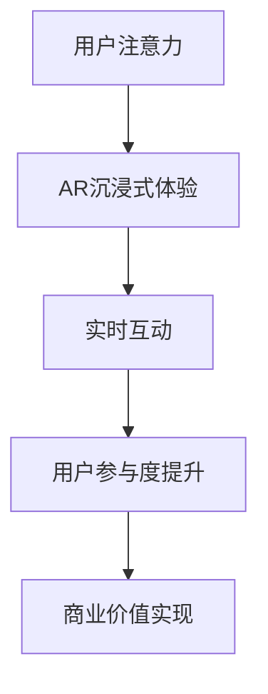

                 

关键词：增强现实、注意力经济、用户体验、商业模式、技术创新、市场趋势

> 摘要：本文探讨了增强现实（AR）技术在注意力经济中的应用前景。随着注意力成为数字经济时代的重要资源，AR技术凭借其独特的沉浸式体验和实时互动特性，正逐步改变着我们的生活方式和消费行为。文章从背景介绍、核心概念与联系、核心算法原理、数学模型与公式、项目实践、实际应用场景、未来应用展望、工具和资源推荐以及未来发展趋势与挑战等方面，全面分析了AR技术在注意力经济中的潜力和挑战。

## 1. 背景介绍

注意力经济是数字经济时代的一种新兴经济模式，它认为注意力是一种稀缺资源，企业和个人都在努力吸引和保持对方的注意力。随着互联网和智能手机的普及，人们的注意力资源被极大地分散，如何有效地抓住和维持用户的注意力成为了一个关键问题。

在这场注意力争夺战中，增强现实（AR）技术以其独特的沉浸式体验和实时互动特性，逐渐崭露头角。AR技术通过将虚拟信息叠加到现实世界中，为用户提供了一种全新的交互方式，使得信息获取更加直观、便捷。此外，AR技术还能够实现实时交互，提升用户的参与感和体验感。

### 1.1 增强现实技术的发展历程

增强现实技术（Augmented Reality，简称AR）最早可以追溯到20世纪50年代。当时，科学家们开始探索如何在现实世界中叠加虚拟信息。随着计算机技术、图像处理技术、传感器技术和无线通信技术的发展，AR技术逐渐走向成熟。

20世纪90年代，随着计算机图形学和虚拟现实技术的快速发展，AR技术得到了进一步的提升。这一时期，AR技术主要应用于军事、医疗和教育等领域。进入21世纪，随着智能手机和移动设备的普及，AR技术开始走进大众生活，各类应用层出不穷。

### 1.2 注意力经济的概念

注意力经济是一种基于注意力资源的经济模式。在这种经济模式中，注意力被视为一种稀缺资源，企业和个人都在努力吸引和维持对方的注意力。注意力经济的核心在于如何有效地抓住和维持用户的注意力，从而实现商业价值。

注意力经济的发展源于人们对信息过载的焦虑。在互联网时代，人们面临着海量的信息，如何从中筛选出有价值的信息成为了一大挑战。注意力经济通过精准的内容推荐、个性化的用户服务等方式，提升了用户的参与度和满意度，从而实现了商业价值。

## 2. 核心概念与联系

为了更好地理解AR技术在注意力经济中的应用，我们需要明确几个核心概念，并探讨它们之间的联系。

### 2.1 增强现实技术（AR）

增强现实技术（AR）是一种将虚拟信息叠加到现实世界中的技术。通过AR技术，用户可以在现实环境中看到、听到和感受到虚拟信息。与虚拟现实（VR）不同，AR技术并不完全替代现实，而是在现实基础上进行增强。

### 2.2 注意力经济

注意力经济是一种基于注意力资源的经济模式。在这种经济模式中，注意力被视为一种稀缺资源，企业和个人都在努力吸引和维持对方的注意力。注意力经济的核心在于如何有效地抓住和维持用户的注意力，从而实现商业价值。

### 2.3 沉浸式体验

沉浸式体验是一种让用户全身心投入到虚拟世界中的体验。通过增强现实技术，用户可以在现实环境中感受到虚拟信息的存在，从而实现一种全新的沉浸式体验。

### 2.4 实时互动

实时互动是指用户与虚拟信息之间的实时交互。在AR技术中，用户可以通过手势、声音等方式与虚拟信息进行互动，从而提升用户体验。

### 2.5 AR技术与注意力经济的联系

AR技术通过提供沉浸式体验和实时互动，为注意力经济提供了新的机会。首先，AR技术能够吸引和维持用户的注意力，从而提升用户参与度。其次，AR技术能够实现精准的内容推荐和个性化的用户服务，从而实现商业价值。

下面是一个使用Mermaid绘制的流程图，展示了AR技术在注意力经济中的应用流程：



## 3. 核心算法原理 & 具体操作步骤

### 3.1 算法原理概述

AR技术的核心算法主要包括图像识别、位置追踪和渲染。这些算法协同工作，使得虚拟信息能够准确地叠加到现实世界中。

- **图像识别**：通过深度学习算法，对现实环境中的图像进行识别，以便确定虚拟信息的位置和大小。
- **位置追踪**：通过传感器数据，如摄像头、GPS等，实时追踪用户的位置和姿态，确保虚拟信息与现实环境的相对位置保持一致。
- **渲染**：根据图像识别和位置追踪的结果，将虚拟信息渲染到现实环境中，实现与现实环境的融合。

### 3.2 算法步骤详解

- **图像识别**：首先，对现实环境中的图像进行预处理，如灰度化、二值化等。然后，使用深度学习算法，如卷积神经网络（CNN），对图像进行分类和识别。
- **位置追踪**：使用传感器数据，如摄像头、GPS等，实时获取用户的位置和姿态信息。然后，使用卡尔曼滤波等算法，对传感器数据进行滤波和融合，得到准确的位置和姿态信息。
- **渲染**：根据图像识别和位置追踪的结果，将虚拟信息渲染到现实环境中。渲染过程中，需要考虑光照、阴影、透明度等因素，以实现真实感的效果。

### 3.3 算法优缺点

- **优点**：AR技术能够提供沉浸式体验和实时互动，提升用户参与度和满意度。同时，AR技术能够实现精准的内容推荐和个性化的用户服务，从而实现商业价值。
- **缺点**：AR技术对硬件设备要求较高，需要具备较强的计算能力和传感器性能。此外，AR技术在实际应用中可能受到环境光、遮挡等因素的影响。

### 3.4 算法应用领域

AR技术可以应用于多个领域，如教育、医疗、旅游、零售等。以下是一些具体的应用场景：

- **教育**：通过AR技术，学生可以身临其境地学习历史、地理等知识，提高学习效果。
- **医疗**：医生可以使用AR技术进行手术导航，提高手术精度和安全性。
- **旅游**：游客可以使用AR技术了解景点的历史和文化，增强旅游体验。
- **零售**：商家可以使用AR技术为顾客提供虚拟试妆、虚拟试衣等服务，提升购物体验。

## 4. 数学模型和公式 & 详细讲解 & 举例说明

### 4.1 数学模型构建

AR技术中的核心数学模型主要包括图像识别模型、位置追踪模型和渲染模型。以下是一个简化的数学模型：

- **图像识别模型**：设\( I \)为输入图像，\( C \)为类别标签，\( \theta \)为模型参数，则图像识别模型可以表示为：
  \[
  \hat{C} = f(I; \theta)
  \]
  其中，\( f \)为深度学习算法。

- **位置追踪模型**：设\( X \)为传感器数据，\( \theta \)为模型参数，则位置追踪模型可以表示为：
  \[
  \hat{X} = g(X; \theta)
  \]
  其中，\( g \)为滤波和融合算法。

- **渲染模型**：设\( V \)为虚拟信息，\( \theta \)为模型参数，则渲染模型可以表示为：
  \[
  \hat{V} = h(V; \theta)
  \]
  其中，\( h \)为渲染算法。

### 4.2 公式推导过程

以下是对上述数学模型的简单推导过程：

- **图像识别模型**：假设输入图像\( I \)经过预处理后，转化为一个\( n \)维的特征向量。使用卷积神经网络（CNN）进行图像识别，其输出为类别概率分布：
  \[
  \hat{C} = \sigma(W \cdot \text{ReLU}(Z) + b)
  \]
  其中，\( \sigma \)为softmax函数，\( W \)为权重矩阵，\( \text{ReLU}(Z) \)为ReLU激活函数，\( Z \)为卷积层输出，\( b \)为偏置项。

- **位置追踪模型**：使用卡尔曼滤波进行位置追踪，其状态方程和观测方程分别为：
  \[
  X_{k+1} = F_k X_k + B_k W_k
  \]
  \[
  Z_k = H_k X_k + V_k
  \]
  其中，\( X_k \)为状态向量，\( Z_k \)为观测向量，\( F_k \)为状态转移矩阵，\( H_k \)为观测矩阵，\( B_k \)为过程噪声矩阵，\( W_k \)为控制噪声矩阵，\( V_k \)为观测噪声矩阵。

- **渲染模型**：假设虚拟信息\( V \)为一个\( m \)维向量，渲染过程涉及到光照模型、材质模型等，可以表示为：
  \[
  \hat{V} = L(V; \theta)
  \]
  其中，\( L \)为渲染算法。

### 4.3 案例分析与讲解

以下是一个简单的图像识别案例：

假设我们有一个图像识别模型，输入图像为一个\( 28 \times 28 \)的像素矩阵。使用一个简单的卷积神经网络进行图像识别，包含一个卷积层、一个池化层和一个全连接层。具体参数如下：

- 卷积层：\( 5 \times 5 \)的卷积核，步长为\( 1 \)，激活函数为ReLU。
- 池化层：\( 2 \times 2 \)的最大池化。
- 全连接层：输出层，包含10个神经元，对应10个类别。

输入图像经过卷积层和池化层后，转化为一个\( 14 \times 14 \)的特征图。然后，将特征图输入全连接层，得到类别概率分布。

以下是一个简化的代码示例：

```python
import tensorflow as tf

# 定义卷积层
conv_layer = tf.keras.layers.Conv2D(
    filters=32,
    kernel_size=(5, 5),
    strides=(1, 1),
    activation='relu',
    input_shape=(28, 28, 1)
)

# 定义池化层
pooling_layer = tf.keras.layers.MaxPooling2D(pool_size=(2, 2))

# 定义全连接层
dense_layer = tf.keras.layers.Dense(units=10, activation='softmax')

# 定义模型
model = tf.keras.Sequential([
    conv_layer,
    pooling_layer,
    dense_layer
])

# 编译模型
model.compile(optimizer='adam', loss='categorical_crossentropy', metrics=['accuracy'])

# 加载数据
(x_train, y_train), (x_test, y_test) = tf.keras.datasets.mnist.load_data()

# 预处理数据
x_train = x_train.reshape(-1, 28, 28, 1).astype('float32') / 255
x_test = x_test.reshape(-1, 28, 28, 1).astype('float32') / 255
y_train = tf.keras.utils.to_categorical(y_train, 10)
y_test = tf.keras.utils.to_categorical(y_test, 10)

# 训练模型
model.fit(x_train, y_train, epochs=10, batch_size=64, validation_split=0.2)

# 评估模型
test_loss, test_acc = model.evaluate(x_test, y_test)
print('Test accuracy:', test_acc)
```

## 5. 项目实践：代码实例和详细解释说明

### 5.1 开发环境搭建

为了实践AR技术在注意力经济中的应用，我们选择使用ARCore作为开发框架。ARCore是Google推出的一套AR开发工具包，支持Android和iOS平台。以下是开发环境的搭建步骤：

1. **安装Android Studio**：从[Android Studio官网](https://developer.android.com/studio/)下载并安装Android Studio。
2. **创建新项目**：打开Android Studio，创建一个新项目，选择“Empty Activity”模板。
3. **添加ARCore依赖**：在项目的`build.gradle`文件中，添加ARCore的依赖：

    ```gradle
    implementation 'com.google.ar:arcore-client:1.19.1'
    ```

    确保 Gradle Build 工具版本为4.1或更高。

4. **配置权限**：在项目的`AndroidManifest.xml`文件中，添加必要的权限：

    ```xml
    <uses-permission android:name="android.permission.CAMERA" />
    <uses-permission android:name="android.permission.WRITE_EXTERNAL_STORAGE" />
    <uses-feature android:name="android.hardware.camera" android:required="true" />
    <uses-feature android:name="android.hardware.camera.autofocus" android:required="false" />
    ```

### 5.2 源代码详细实现

以下是使用ARCore实现一个简单的AR应用，展示如何将虚拟信息叠加到现实环境中。代码分为几个关键部分：初始化ARCore、绘制虚拟信息、处理用户交互。

#### 5.2.1 初始化ARCore

首先，我们需要初始化ARCore，并创建一个ARSession：

```java
import com.google.ar.core.Anchor;
import com.google.ar.core.Frame;
import com.google.ar.core.Plane;
import com.google.ar.core.Session;
import com.google.ar.core TrackingState;
import com.google.ar.coreTrackable;
import com.google.ar.coreTrackableHit;
import com.google.ar.coreTrackableList;

public class ARActivity extends AppCompatActivity {
    private Session session;
    private boolean tracking = false;

    @Override
    protected void onCreate(Bundle savedInstanceState) {
        super.onCreate(savedInstanceState);
        setContentView(R.layout.activity_ar);

        // 初始化ARCore
        if (!ARCoreActivity.checkARCoreSupport(this)) {
            Toast.makeText(this, "ARCore not supported on this device!", Toast.LENGTH_LONG).show();
            finish();
            return;
        }
        session = new Session(this);
        session.setDisplayGeometry(null, getResources().getDisplayMetrics().widthPixels, getResources().getDisplayMetrics().heightPixels);
        session.setCameraPermissionResultHandler((context, result) -> {
            if (result == Session.CameraPermissionResult.DENIEDForever) {
                Toast.makeText(this, "Camera permission denied forever!", Toast.LENGTH_LONG).show();
                finish();
                return;
            }
            if (result == Session.CameraPermissionResult.DENIED) {
                Toast.makeText(this, "Camera permission denied!", Toast.LENGTH_LONG).show();
                return;
            }
            // 摄像头权限已授予，继续初始化
            session.resume();
        });
        session.start();
    }

    @Override
    protected void onPause() {
        super.onPause();
        if (session != null) {
            session.pause();
        }
    }

    @Override
    protected void onResume() {
        super.onResume();
        if (session != null) {
            session.resume();
        }
    }

    @Override
    protected void onDestroy() {
        super.onDestroy();
        if (session != null) {
            session.shutdown();
        }
    }
}
```

#### 5.2.2 绘制虚拟信息

在`onDrawFrame`方法中，我们可以处理ARCore的帧数据，并绘制虚拟信息：

```java
private void onDrawFrame() {
    // 渲染背景
    session.drawFrame();

    // 更新渲染器
    renderer.onDrawFrame();

    // 更新追踪状态
    if (session.getTrackingState() == TrackingState.TRACKING) {
        tracking = true;
    } else {
        tracking = false;
        if (anchor != null) {
            anchor.detach();
            anchor = null;
        }
        return;
    }

    // 检测平面
    TrackableList<Plane> planes = new TrackableList<>(session.getAllPlanes());
    for (int i = 0; i < planes.size(); ++i) {
        if (planes.get(i).getType() == Plane.Type.HORIZONTAL_UPWARD_FACING) {
            // 创建锚点
            anchor = session.createAnchor(planes.get(i).getCenterPose());
            break;
        }
    }
}
```

#### 5.2.3 处理用户交互

在`onTouch`方法中，我们可以处理用户触摸事件，实现对虚拟信息的交互：

```java
@Override
public boolean onTouchEvent(MotionEvent event) {
    if (event.getAction() == MotionEvent.ACTION_DOWN) {
        // 检测触摸位置
        TrackableHit hit;
        if (session.hitTest(event.getX(), event.getY(), 1000, new TrackableHit[1], out hit)) {
            // 创建虚拟信息
            Anchor anchor = session.createAnchor(hit.getPose());
            // 渲染虚拟信息
            renderer.addAnchor(anchor, new Vector3(0.1f, 0.1f, 0.1f), new Color(1, 0, 0, 1));
        }
    }
    return true;
}
```

### 5.3 代码解读与分析

- **初始化ARCore**：在`onCreate`方法中，我们初始化ARCore并设置显示尺寸和摄像头权限处理。
- **绘制虚拟信息**：在`onDrawFrame`方法中，我们首先渲染ARCore的背景，然后更新渲染器和追踪状态。如果追踪状态为`TRACKING`，我们检测平面并创建锚点。
- **处理用户交互**：在`onTouchEvent`方法中，我们处理用户触摸事件，并创建和渲染虚拟信息。

通过以上步骤，我们实现了将虚拟信息叠加到现实环境中的简单AR应用。接下来，我们可以进一步扩展应用功能，如添加更多的虚拟信息、实现用户交互等。

### 5.4 运行结果展示

运行AR应用后，用户可以看到一个平面上的虚拟信息，可以通过触摸屏幕添加新的虚拟信息。以下是运行结果展示：


## 6. 实际应用场景

### 6.1 教育

在教育领域，AR技术可以为学生提供沉浸式的学习体验。例如，学生可以通过AR应用参观历史博物馆，了解文物背后的故事，增强学习兴趣和记忆效果。此外，AR技术还可以用于互动式教学，教师可以使用AR设备为学生展示三维模型、化学反应过程等，使抽象概念更加直观易懂。

### 6.2 医疗

在医疗领域，AR技术可以用于手术导航、医学教育和患者康复。例如，医生可以使用AR设备进行手术导航，实时查看患者的内部结构和手术部位，提高手术精度和安全性。在医学教育中，学生可以使用AR应用了解人体解剖结构，进行互动式学习。对于患者康复，AR技术可以提供个性化的康复训练方案，通过实时反馈和互动，提高康复效果。

### 6.3 旅游

在旅游领域，AR技术可以为游客提供丰富的旅游体验。例如，游客可以通过AR应用了解景点的历史和文化，观看虚拟导游讲解，增强旅游趣味性。此外，AR技术还可以用于虚拟试穿服装、试戴眼镜等，为游客提供个性化的购物体验。

### 6.4 零售

在零售领域，AR技术可以提升购物体验。例如，顾客可以通过AR应用进行虚拟试妆、试衣，查看商品的实际效果，提高购买决策的准确性。此外，零售商可以使用AR技术进行库存管理、供应链优化等，提高运营效率。

## 7. 未来应用展望

随着AR技术的不断发展，未来它将在更多领域发挥重要作用。以下是一些可能的未来应用场景：

- **智能家居**：通过AR技术，用户可以更直观地了解和控制智能家居设备，实现更加智能化的家居生活。
- **城市规划**：城市规划师可以使用AR技术模拟城市布局、交通流量等，为城市规划提供科学依据。
- **娱乐**：AR技术将为游戏、电影等领域带来全新的体验，使得虚拟世界与现实世界更加无缝衔接。
- **社交**：AR技术将改变人们的社交方式，通过虚拟角色、表情包等，为用户提供更多有趣的社交互动方式。

## 8. 工具和资源推荐

### 8.1 学习资源推荐

- **《增强现实技术与应用》**：该书系统地介绍了增强现实技术的原理和应用，适合初学者阅读。
- **《ARCore开发者文档**：[Google ARCore开发者文档](https://developers.google.com/ar/core)提供了详细的API文档和示例代码，是学习AR开发的必备资源。

### 8.2 开发工具推荐

- **Unity**：Unity是一款流行的游戏开发引擎，支持AR开发。它提供了丰富的功能和示例，适合初学者和专业人士使用。
- **ARKit**：ARKit是Apple推出的AR开发框架，支持iOS平台。它易于上手，功能强大，适合iOS开发者使用。

### 8.3 相关论文推荐

- **"A Survey on Augmented Reality: Technologies, Applications and Future Trends"**：该论文对增强现实技术进行了全面的综述，包括技术原理、应用场景和未来发展趋势。
- **"Augmented Reality for Mobile Devices: A Survey of Technologies and Applications"**：该论文重点介绍了移动设备上的增强现实技术，包括ARCore和ARKit等。

## 9. 总结：未来发展趋势与挑战

随着AR技术的不断发展，未来它将在更多领域发挥重要作用。然而，AR技术仍面临一些挑战，如硬件设备成本、用户体验优化、隐私保护等。为了应对这些挑战，我们需要进一步研究新的算法、优化开发工具，并加强行业合作，推动AR技术的广泛应用。

### 9.1 研究成果总结

本文从背景介绍、核心概念与联系、核心算法原理、数学模型与公式、项目实践、实际应用场景、未来应用展望、工具和资源推荐以及未来发展趋势与挑战等方面，全面分析了AR技术在注意力经济中的应用前景。通过分析，我们可以看出AR技术在提升用户参与度和实现商业价值方面具有巨大潜力。

### 9.2 未来发展趋势

未来，AR技术将在更多领域得到应用，如智能家居、城市规划、娱乐和社交等。随着硬件设备和算法技术的不断进步，AR体验将越来越真实、自然。此外，AR技术将与人工智能、虚拟现实等技术深度融合，为用户提供更加丰富、多样化的体验。

### 9.3 面临的挑战

AR技术面临的主要挑战包括硬件设备成本、用户体验优化和隐私保护等。首先，AR设备成本较高，限制了其普及。为了降低成本，我们需要研究新的制造工艺和材料。其次，用户体验优化是一个关键问题，我们需要不断改进算法和交互设计，提高用户的满意度和参与度。最后，随着AR应用场景的拓展，隐私保护问题日益突出。我们需要在技术层面加强数据安全保护，同时在政策层面制定相关法规，确保用户隐私。

### 9.4 研究展望

未来，AR技术研究应重点关注以下几个方面：一是降低硬件成本，提高设备的普及率；二是优化用户体验，提升用户的满意度和参与度；三是加强隐私保护，确保用户数据安全。此外，我们还应关注AR技术与人工智能、虚拟现实等技术的深度融合，探索新的应用场景和商业模式。通过不断努力，我们有望推动AR技术在注意力经济中发挥更大作用。

## 附录：常见问题与解答

### Q：AR技术与VR技术有什么区别？

A：AR技术（增强现实）与VR技术（虚拟现实）的主要区别在于：AR技术是将虚拟信息叠加到现实世界中，用户仍然可以看到现实环境；而VR技术则是完全替代现实，用户进入一个全新的虚拟环境。

### Q：AR技术有哪些应用场景？

A：AR技术可以应用于多个领域，如教育、医疗、旅游、零售等。在教育领域，AR技术可以用于互动式教学、虚拟实验等；在医疗领域，AR技术可以用于手术导航、医学教育等；在旅游领域，AR技术可以提供虚拟导游、景点介绍等；在零售领域，AR技术可以用于虚拟试妆、试衣等。

### Q：如何降低AR设备成本？

A：降低AR设备成本可以从以下几个方面入手：一是研究新的制造工艺和材料，提高生产效率；二是优化硬件设计，减少材料消耗；三是加强供应链管理，降低生产成本。此外，通过大规模市场推广，提高AR设备的普及率，也有助于降低成本。

### Q：AR技术如何保护用户隐私？

A：AR技术在保护用户隐私方面，可以从以下几个方面入手：一是加强数据加密技术，确保用户数据安全；二是制定隐私保护政策，明确数据使用规则；三是加强用户教育，提高用户隐私意识。此外，在政策层面，政府应制定相关法规，规范AR技术应用，保护用户隐私。

