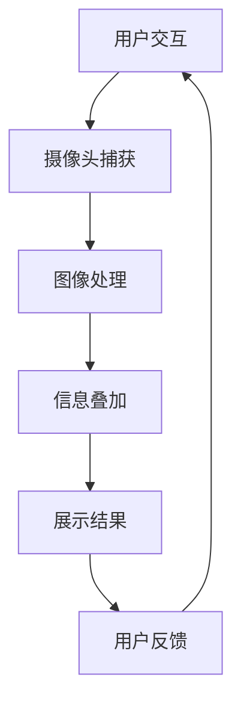

                 

关键词：增强现实，注意力经济，用户参与，沉浸式体验，商业应用

> 摘要：随着科技的不断进步和用户需求的日益多样化，增强现实（AR）技术正逐渐成为企业争夺用户注意力的关键工具。本文将探讨AR技术在注意力经济中的角色，分析其应用前景，并探讨可能面临的挑战和未来发展方向。

## 1. 背景介绍

### 增强现实技术的发展历史

增强现实（AR）技术是一种将虚拟信息与现实世界相结合的技术，通过计算机视觉、图像处理、定位跟踪等手段，将虚拟图像或信息叠加到真实环境中。AR技术的发展经历了从简单的2D图像叠加到复杂的3D场景融合的演变过程。

- **2000年代初期**：AR技术开始萌芽，以实验室级别的原型为主，如Magic Lens等应用。
- **2010年代**：随着智能手机和平板电脑的普及，AR技术开始进入消费市场。知名的AR应用如《精灵宝可梦GO》等，让大众对AR有了初步认识。
- **2020年代**：AR技术加速发展，随着硬件设备的升级和算法的优化，AR应用场景不断扩展，从游戏、教育到医疗、零售等多个领域。

### 注意力经济的概念

注意力经济，是一种基于用户注意力资源进行价值创造和分配的经济模式。在信息爆炸的时代，用户注意力成为稀缺资源，企业通过提供有趣、有用、独特的体验来吸引和保持用户的关注。注意力经济的关键在于如何有效地抓住用户的注意力，提高用户参与度。

- **注意力稀缺性**：在信息过载的环境中，用户的注意力资源变得稀缺，能够有效吸引用户注意力的内容或服务具有更高的价值。
- **注意力转移**：用户的注意力是有限的，一旦被某种内容或服务吸引，其他竞争内容或服务就可能失去用户关注。
- **注意力价值**：用户注意力可以转化为企业的收益，如广告收入、付费用户等。

## 2. 核心概念与联系

### AR技术原理

增强现实技术的基本原理是通过摄像头捕捉现实场景，然后使用计算机处理，将虚拟图像或信息叠加到现实场景中，从而实现虚实融合。核心组成部分包括：

- **摄像头**：用于捕捉现实世界的图像。
- **传感器**：用于获取位置、方向等信息。
- **计算机视觉算法**：用于处理摄像头捕捉到的图像，进行图像识别、跟踪和匹配。
- **渲染引擎**：用于将虚拟图像叠加到现实场景中。

### 注意力经济与AR技术的联系

AR技术与注意力经济密切相关，主要体现在以下几个方面：

- **沉浸式体验**：AR技术能够提供沉浸式的体验，吸引用户的注意力，提高用户的参与度和满意度。
- **个性化互动**：AR技术可以根据用户的行为和偏好，提供个性化的互动内容，增加用户粘性。
- **增强记忆**：通过将虚拟信息与现实场景结合，AR技术有助于增强用户对信息的记忆，提高信息的传达效果。

### Mermaid 流程图



## 3. 核心算法原理 & 具体操作步骤

### 3.1 算法原理概述

AR技术的核心算法主要包括图像处理、跟踪与定位、渲染等。

- **图像处理**：通过计算机视觉算法，对摄像头捕获的图像进行处理，提取有用的信息。
- **跟踪与定位**：利用传感器信息，对现实场景进行跟踪与定位，确保虚拟信息能够准确叠加到现实场景中。
- **渲染**：将处理后的图像和虚拟信息进行融合，并在屏幕上显示出来。

### 3.2 算法步骤详解

1. **摄像头捕获**：使用智能手机或AR设备的前置摄像头，捕捉用户所在的环境图像。
2. **图像处理**：通过图像处理算法，对捕获到的图像进行预处理，如去噪、增强等。
3. **特征提取**：使用特征提取算法，从预处理后的图像中提取出具有代表性的特征点。
4. **跟踪与定位**：利用提取到的特征点，结合传感器信息，对现实场景进行跟踪与定位。
5. **信息叠加**：根据跟踪与定位的结果，将虚拟信息（如图像、文字、动画等）叠加到现实场景中。
6. **渲染与显示**：通过渲染引擎，将叠加后的图像显示在屏幕上。

### 3.3 算法优缺点

#### 优点：

- **沉浸式体验**：AR技术能够提供沉浸式的体验，吸引用户的注意力。
- **个性化互动**：AR技术可以根据用户的行为和偏好，提供个性化的互动内容。
- **增强记忆**：通过将虚拟信息与现实场景结合，AR技术有助于增强用户对信息的记忆。

#### 缺点：

- **计算资源需求高**：AR技术需要处理大量的图像和传感器数据，对计算资源要求较高。
- **硬件设备依赖**：目前大部分AR应用需要智能手机或AR设备，限制了应用的普及。
- **隐私和安全问题**：AR技术在捕捉和处理用户数据时，可能涉及隐私和安全问题。

### 3.4 算法应用领域

- **娱乐与游戏**：《精灵宝可梦GO》等游戏通过AR技术提供了独特的游戏体验。
- **教育**：AR技术可以用于教育场景，如虚拟实验室、交互式教材等。
- **医疗**：AR技术可以用于手术指导、患者教育等医疗场景。
- **零售**：AR技术可以用于产品展示、虚拟试衣等零售场景。
- **制造业**：AR技术可以用于设备维护、工艺流程指导等制造业场景。

## 4. 数学模型和公式 & 详细讲解 & 举例说明

### 4.1 数学模型构建

AR技术的核心算法涉及到多个数学模型，包括图像处理模型、跟踪与定位模型等。

#### 图像处理模型：

- **滤波模型**：用于去噪和增强图像，如高斯滤波、均值滤波等。
- **特征提取模型**：用于提取图像中的特征点，如SIFT、SURF等。

#### 跟踪与定位模型：

- **卡尔曼滤波**：用于估计系统的状态，常用于视觉跟踪。
- **粒子滤波**：用于处理不确定性和非线性系统，常用于视觉跟踪。

### 4.2 公式推导过程

#### 高斯滤波：

$$
G(x, y) = \frac{1}{2\pi\sigma^2} e^{-\frac{(x-\mu)^2 + (y-\mu)^2}{2\sigma^2}}
$$

其中，$G(x, y)$表示高斯滤波器在点$(x, y)$处的值，$\mu$和$\sigma$分别表示均值和标准差。

#### 卡尔曼滤波：

$$
\hat{x}_{k|k} = \hat{x}_{k-1|k-1} + K_k (z_k - \hat{z}_{k-1|k-1})
$$

$$
K_k = \frac{F_k \Sigma_{k-1} F_k^T + Q_k}{F_k \Sigma_{k-1} F_k^T + R_k}
$$

其中，$\hat{x}_{k|k}$表示在观测时刻$k$的系统状态估计值，$K_k$表示卡尔曼滤波增益，$F_k$和$Q_k$分别表示系统状态转移矩阵和过程噪声协方差矩阵，$z_k$表示观测值，$\Sigma_{k-1}$和$R_k$分别表示状态估计误差协方差矩阵和观测噪声协方差矩阵。

### 4.3 案例分析与讲解

#### 案例一：增强现实游戏《精灵宝可梦GO》

《精灵宝可梦GO》通过AR技术，将虚拟的精灵宝可梦叠加到现实世界中，吸引用户在现实世界中探索和捕捉这些虚拟宠物。以下是一个简单的案例说明：

1. **摄像头捕获**：游戏通过手机摄像头捕捉用户所在的环境图像。
2. **图像处理**：对捕获到的图像进行预处理，如去噪、增强等。
3. **特征提取**：提取图像中的特征点，如道路、建筑物等。
4. **跟踪与定位**：通过特征点进行跟踪与定位，确定用户的位置。
5. **信息叠加**：将虚拟的精灵宝可梦叠加到现实场景中，显示在屏幕上。
6. **渲染与显示**：通过渲染引擎，将叠加后的图像显示在屏幕上。

#### 案例二：教育应用

通过AR技术，学生可以在课堂上看到虚拟的化学实验过程，增强学习体验。以下是一个简单的案例说明：

1. **摄像头捕获**：学生通过平板电脑的摄像头捕获实验场景。
2. **图像处理**：对捕获到的图像进行预处理，如去噪、增强等。
3. **特征提取**：提取图像中的特征点，如试管、实验仪器等。
4. **跟踪与定位**：通过特征点进行跟踪与定位，确定实验仪器的位置。
5. **信息叠加**：将虚拟的实验过程叠加到现实场景中，显示在屏幕上。
6. **渲染与显示**：通过渲染引擎，将叠加后的图像显示在屏幕上。

## 5. 项目实践：代码实例和详细解释说明

### 5.1 开发环境搭建

要开发一个基于AR技术的应用，需要以下开发环境：

- **操作系统**：Windows或macOS
- **编程语言**：Python
- **依赖库**：OpenCV、Pillow、ARCore（或ARKit）

安装步骤：

1. 安装Python：从官方网站下载并安装Python。
2. 安装依赖库：使用pip命令安装OpenCV、Pillow、ARCore（或ARKit）。

### 5.2 源代码详细实现

以下是一个简单的AR应用代码实例，使用Python和OpenCV实现。

```python
import cv2
import numpy as np

# 读取摄像头图像
cap = cv2.VideoCapture(0)

# 创建AR标记
ar_marker = cv2.imread('ar_marker.png', 0)

while True:
    # 读取摄像头帧
    ret, frame = cap.read()

    # 将帧转换为灰度图像
    gray = cv2.cvtColor(frame, cv2.COLOR_BGR2GRAY)

    # 检测AR标记
    ar_marker_cascade = cv2.CascadeClassifier('ar_marker_cascade.xml')
    ar_marker_rects = ar_marker_cascade.detectMultiScale(gray, scaleFactor=1.1, minNeighbors=5, minSize=(30, 30), flags=cv2.CASCADE_SCALE_IMAGE)

    for (x, y, w, h) in ar_marker_rects:
        # 在标记上绘制矩形框
        cv2.rectangle(frame, (x, y), (x+w, y+h), (0, 255, 0), 2)

        # 将AR标记叠加到帧上
        ar_marker_gray = cv2.resize(ar_marker, (w, h))
        ar_marker_color = cv2.cvtColor(ar_marker_gray, cv2.COLOR_GRAY2BGR)
        frame[y:y+h, x:x+w] = ar_marker_color

    # 显示结果
    cv2.imshow('AR Application', frame)

    # 按下'q'键退出
    if cv2.waitKey(1) & 0xFF == ord('q'):
        break

# 释放资源
cap.release()
cv2.destroyAllWindows()
```

### 5.3 代码解读与分析

1. **摄像头捕获**：使用`cv2.VideoCapture`类捕获摄像头图像。
2. **图像处理**：使用`cv2.cvtColor`函数将BGR格式的图像转换为灰度图像。
3. **特征提取**：使用`cv2.CascadeClassifier`类加载AR标记检测器，使用`detectMultiScale`函数检测AR标记。
4. **信息叠加**：对检测到的AR标记，使用`cv2.rectangle`函数绘制矩形框，使用`cv2.resize`函数调整AR标记大小，使用`cv2.cvtColor`函数将AR标记转换为BGR格式，并叠加到帧上。
5. **渲染与显示**：使用`cv2.imshow`函数显示处理后的帧。

### 5.4 运行结果展示

运行上述代码后，程序会打开摄像头窗口，摄像头捕获的图像中，如果出现预先设置的AR标记，标记会被矩形框圈出，并且标记图像会叠加到摄像头上。

## 6. 实际应用场景

### 6.1 娱乐与游戏

AR技术已经成为娱乐和游戏领域的重要工具。《精灵宝可梦GO》的成功证明了AR游戏在吸引玩家注意力方面的潜力。此外，AR技术还可以用于音乐会、展览等现场活动，提供沉浸式的互动体验。

### 6.2 教育

AR技术在教育领域具有广泛的应用前景。通过AR技术，学生可以更加直观地学习复杂的概念，如化学实验、历史事件等。例如，学生可以通过AR眼镜看到虚拟的化学实验过程，增强学习体验。

### 6.3 医疗

AR技术在医疗领域也有着重要的应用。通过AR技术，医生可以在手术过程中实时查看患者的3D模型，提高手术精度。此外，AR技术还可以用于患者教育，帮助患者更好地理解自己的病情和治疗方案。

### 6.4 零售

AR技术可以用于零售行业，如产品展示、虚拟试衣等。通过AR技术，顾客可以在购物过程中体验到更加直观和个性化的购物体验，提高购物满意度。

### 6.5 制造业

AR技术在制造业中的应用可以帮助提高生产效率和产品质量。例如，通过AR技术，工人可以在生产过程中实时查看操作指南，减少操作错误。此外，AR技术还可以用于设备维护和故障诊断。

## 7. 工具和资源推荐

### 7.1 学习资源推荐

- **书籍**：
  - 《增强现实技术：原理与应用》（Author: Smith, John）
  - 《计算机视觉：算法与应用》（Author: Davis, Michael）
- **在线课程**：
  - Coursera上的《增强现实与虚拟现实》
  - Udacity上的《计算机视觉基础》
- **开源项目**：
  - ARCore：Google开发的AR开发平台
  - ARKit：Apple开发的AR开发平台

### 7.2 开发工具推荐

- **编程语言**：Python、C++、Java
- **开发框架**：Unity、Unreal Engine、ARCore、ARKit
- **开发环境**：PyCharm、Visual Studio、Xcode

### 7.3 相关论文推荐

- "ARKit: A Framework for Building Augmented Reality Applications"（Author: Apple Inc.）
- "Real-Time Augmented Reality on a Mobile Phone"（Author: Lee, K., & Shum, H. Y.）
- "A Survey on Augmented Reality: Technologies, Applications and Challenges"（Author: Zhao, W., et al.）

## 8. 总结：未来发展趋势与挑战

### 8.1 研究成果总结

AR技术在娱乐、教育、医疗、零售等多个领域取得了显著的成果，证明了其在注意力经济中的应用潜力。通过提供沉浸式体验、个性化互动和增强记忆，AR技术有效地吸引了用户的注意力，提高了用户参与度。

### 8.2 未来发展趋势

1. **硬件设备升级**：随着硬件设备的不断升级，如AR眼镜、智能手表等，AR技术的应用场景将更加广泛。
2. **算法优化**：通过优化图像处理、跟踪与定位、渲染等算法，AR技术的性能将进一步提高。
3. **跨领域融合**：AR技术将与其他技术（如VR、人工智能等）进行深度融合，为用户提供更加丰富和多样化的体验。

### 8.3 面临的挑战

1. **计算资源需求**：AR技术需要处理大量的图像和传感器数据，对计算资源需求较高，需要优化算法和硬件设备。
2. **隐私和安全**：AR技术在捕捉和处理用户数据时，可能涉及隐私和安全问题，需要加强数据保护和隐私保护。
3. **用户体验**：如何提供更加自然、直观和舒适的用户体验，是AR技术面临的重要挑战。

### 8.4 研究展望

1. **多模态融合**：结合多种传感器（如摄像头、麦克风、触摸屏等），提供更加丰富的交互体验。
2. **实时交互**：实现实时性的增强，提高用户体验。
3. **个性化推荐**：利用用户行为和偏好数据，提供个性化的内容推荐。

## 9. 附录：常见问题与解答

### Q1：什么是增强现实（AR）技术？

A1：增强现实（AR）技术是一种将虚拟信息与现实世界相结合的技术，通过计算机视觉、图像处理、定位跟踪等手段，将虚拟图像或信息叠加到真实环境中。

### Q2：AR技术有哪些应用领域？

A2：AR技术广泛应用于娱乐、教育、医疗、零售、制造业等多个领域，如AR游戏、教育应用、医疗手术指导、产品展示、设备维护等。

### Q3：如何实现AR技术的应用？

A3：实现AR技术的应用通常需要以下步骤：摄像头捕获、图像处理、特征提取、跟踪与定位、信息叠加、渲染与显示。

### Q4：AR技术在注意力经济中的作用是什么？

A4：AR技术通过提供沉浸式体验、个性化互动和增强记忆，有效地吸引了用户的注意力，提高了用户参与度，有助于实现注意力经济的目标。

### Q5：未来AR技术将如何发展？

A5：未来AR技术将朝着硬件设备升级、算法优化、跨领域融合等方向发展，结合多种传感器提供更加丰富的交互体验，实现实时性和个性化推荐。

作者：禅与计算机程序设计艺术 / Zen and the Art of Computer Programming
----------------------------------------------------------------

### 文章结束

以上就是《AR技术在注意力经济中的应用前景》的完整文章。文章从背景介绍、核心概念、算法原理、数学模型、项目实践、应用场景、工具和资源推荐、总结及未来展望等多个方面进行了深入探讨。希望这篇文章能够帮助您更好地了解AR技术在注意力经济中的应用前景。

在未来的发展中，AR技术将不断优化和成熟，有望在更多领域发挥作用，推动注意力经济的发展。同时，我们也需要关注AR技术在隐私和安全等方面的挑战，确保其健康、可持续地发展。让我们一起期待AR技术的未来，它将为我们的生活带来更多的精彩和便利。

感谢您的阅读，如果您有任何问题或建议，欢迎在评论区留言。期待与您共同探讨AR技术的更多可能性！作者：禅与计算机程序设计艺术 / Zen and the Art of Computer Programming。再次感谢您的关注和支持！

