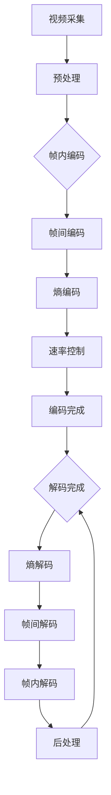

                 

关键词：AV1视频格式，下一代编码标准，开放媒体，编解码技术，视频压缩，多媒体传输，互联网技术。

## 摘要

本文旨在深入探讨AV1视频格式标准，分析其作为下一代开放媒体编码标准的优势。AV1由谷歌、亚马逊、微软、网飞等公司主导开发，旨在提供一种高效、灵活、免费的编解码技术，满足日益增长的互联网多媒体传输需求。本文将详细介绍AV1的核心概念、算法原理、数学模型、应用场景，并对比分析其与现有编码标准的优劣。通过本文的阅读，读者将对AV1视频格式标准有一个全面而深入的了解，为其在未来的多媒体领域中发挥重要作用奠定基础。

## 1. 背景介绍

随着互联网和移动设备的普及，视频已经成为信息传播和娱乐的主要形式。视频内容的爆炸式增长对网络带宽、存储空间和处理能力提出了更高的要求。为了满足这些需求，编解码技术（Codec）成为了视频传输中的关键环节。编解码技术通过将视频数据进行压缩和还原，实现了视频的高效传输和存储。

当前，市场上主流的视频编码标准包括H.264/AVC、H.265/HEVC、VP9等。这些编码标准在不同程度上解决了视频压缩和传输的问题，但同时也带来了计算复杂度高、专利授权费用昂贵等问题。例如，H.264/AVC作为最广泛使用的编码标准，虽然在视频质量和压缩效率上表现良好，但其高昂的专利费用和复杂的授权流程限制了其在某些场景下的应用。H.265/HEVC虽然在压缩效率上有了显著提升，但其计算复杂度和专利费用同样居高不下。VP9作为谷歌推出的开源编码标准，虽然免费且性能优越，但在市场上的推广和应用仍然面临一定的挑战。

在这种背景下，AV1视频格式标准的推出显得尤为及时和重要。AV1由谷歌、亚马逊、微软、网飞等公司主导开发，旨在提供一种高效、灵活、免费的编解码技术，以应对日益增长的视频传输需求。AV1的开发旨在解决现有编码标准的痛点，同时满足未来视频传输的发展趋势。本文将围绕AV1的核心概念、算法原理、数学模型、应用场景等方面进行深入探讨，帮助读者全面了解AV1视频格式标准的优势和潜力。

### 1.1 AV1的发展历史

AV1视频格式标准的诞生并非一蹴而就，而是经过了多年的研发和迭代。其发展历史可以追溯到2010年左右，当时谷歌启动了名为"WebM"的项目，旨在创建一种高效、开源的视频编码格式。WebM最初采用了VP8编码技术，这是一种由谷歌开发的免费、开源编解码技术。VP8在视频质量和压缩效率方面表现良好，得到了一定的市场认可。

随着视频内容质量的提升和带宽需求的增加，谷歌意识到需要一种更为先进的编解码技术来满足未来视频传输的需求。于是，在2015年，谷歌正式启动了AV1项目的开发。AV1项目由谷歌、亚马逊、微软、网飞等公司联合发起，旨在创建一种全新的、高效的、免费的编解码标准。AV1项目得到了业界的广泛支持，许多知名公司和研究机构纷纷加入其中，共同推动AV1的开发和优化。

在AV1的开发过程中，谷歌和其合作伙伴们投入了大量的资源和精力。他们不仅对编码算法进行了深入的研究和优化，还针对不同的应用场景进行了广泛的测试和验证。经过数年的努力，AV1终于在2020年正式发布，并迅速引起了业界的广泛关注。

AV1的发展历史虽然短暂，但其背后的研发历程却充满了挑战和突破。从VP8到AV1，谷歌和合作伙伴们不断探索和创新，最终成功开发出了一种全新的编解码技术，为未来的视频传输提供了强有力的支持。

### 1.2 AV1的核心概念

AV1（AOMedia Video 1）是一种新型的视频编解码技术，其核心目标是提供高效、灵活且免费的编解码解决方案，以满足未来互联网多媒体传输的需求。以下是AV1的一些关键概念：

#### 1.2.1 高效编码

AV1采用了先进的编码算法，能够在保持高质量视频的同时实现高效的压缩。与传统编码标准相比，AV1在视频压缩效率上有显著提升。例如，在相同质量水平下，AV1能够比VP9和H.265/HEVC更大幅度地减少数据量，从而降低传输和存储成本。

#### 1.2.2 开源

AV1是开源的，这意味着任何人都可以自由地使用、修改和分发AV1编码技术，无需支付专利费用。这为AV1的普及和应用提供了便利，同时也降低了技术壁垒，使得更多的开发者和企业能够参与到AV1的开发和优化中来。

#### 1.2.3 兼容性

AV1在设计时充分考虑了兼容性，旨在与现有的视频编解码技术无缝对接。例如，AV1可以与H.264、H.265等其他编码标准共存，用户可以根据不同的场景和需求选择合适的编码方式。此外，AV1还支持多种分辨率和帧率，能够满足不同类型视频内容的编码需求。

#### 1.2.4 实时传输

AV1针对实时视频传输进行了优化，能够提供低延迟的编解码性能。这使得AV1在直播、视频会议、在线游戏等实时应用场景中具有明显优势，能够提供流畅、高质量的观看体验。

#### 1.2.5 多样性

AV1不仅支持单视频流的编码，还可以进行多视频流和视频编组的编码。这种灵活性使得AV1能够适应多种复杂的应用场景，如多视角视频、360度视频、虚拟现实等。

### 1.3 AV1的目标市场

AV1的目标市场涵盖了广泛的领域，包括但不限于：

#### 1.3.1 视频流媒体服务

随着流媒体服务的兴起，越来越多的用户通过互联网观看视频内容。AV1的高效编码和实时传输能力，使得它成为流媒体服务提供商的理想选择。通过使用AV1，流媒体服务提供商可以在保证高质量视频的同时，降低带宽使用和存储成本。

#### 1.3.2 在线教育

在线教育市场的快速发展对视频传输提出了更高的要求。AV1的高效编码和低延迟特性，使得它非常适合用于在线教育场景，如在线课堂、远程教学等。

#### 1.3.3 直播

随着直播应用的普及，实时传输和低延迟成为关键需求。AV1的低延迟编解码性能，使得它非常适合用于直播场景，如体育比赛直播、音乐会直播等。

#### 1.3.4 虚拟现实和增强现实

虚拟现实和增强现实技术对视频编解码技术提出了更高的要求，包括高分辨率、低延迟和高效率。AV1的多样性支持和高效编码能力，使得它非常适合用于虚拟现实和增强现实应用。

#### 1.3.5 企业视频会议

企业视频会议对编解码技术的要求同样高，包括高清晰度、低延迟和高稳定性。AV1的低延迟和高效编码能力，使得它非常适合用于企业视频会议场景。

### 1.4 AV1与传统编码标准的对比

与传统编码标准（如H.264、H.265等）相比，AV1在多个方面具有明显优势：

#### 1.4.1 压缩效率

AV1在视频压缩效率上表现优异，能够在相同质量水平下比H.264和H.265更大幅度地减少数据量。这使得AV1在带宽受限的场景中具有明显优势，如移动网络传输、物联网等。

#### 1.4.2 开源

AV1是开源的，无需支付专利费用，这使得AV1在成本方面具有明显优势。与传统编码标准相比，AV1可以显著降低视频传输和存储成本。

#### 1.4.3 兼容性

AV1在设计时充分考虑了兼容性，能够与现有的视频编解码技术无缝对接。这使得AV1可以与H.264、H.265等编码标准共存，用户可以根据不同的场景和需求选择合适的编码方式。

#### 1.4.4 实时传输

AV1针对实时视频传输进行了优化，能够提供低延迟的编解码性能。这使得AV1在直播、视频会议等实时应用场景中具有明显优势。

#### 1.4.5 多样性

AV1支持多种分辨率、帧率和视频编组，能够适应多种复杂的应用场景，如多视角视频、360度视频、虚拟现实等。

### 1.5 AV1的优势

AV1作为下一代开放媒体编码标准，具有多个显著优势，使其在视频编解码领域脱颖而出：

#### 1.5.1 高效编码

AV1采用了先进的编码算法，能够在保持高质量视频的同时实现高效的压缩。这使得AV1在带宽受限的场景中具有明显的优势，如移动网络传输、物联网等。

#### 1.5.2 低成本

AV1是开源的，无需支付专利费用。这使得AV1在成本方面具有明显优势，能够显著降低视频传输和存储成本。

#### 1.5.3 高兼容性

AV1在设计时充分考虑了兼容性，能够与现有的视频编解码技术无缝对接。这使得AV1可以与H.264、H.265等编码标准共存，用户可以根据不同的场景和需求选择合适的编码方式。

#### 1.5.4 实时传输

AV1针对实时视频传输进行了优化，能够提供低延迟的编解码性能。这使得AV1在直播、视频会议等实时应用场景中具有明显优势。

#### 1.5.5 多样性

AV1支持多种分辨率、帧率和视频编组，能够适应多种复杂的应用场景，如多视角视频、360度视频、虚拟现实等。

### 1.6 AV1的发展前景

随着互联网和多媒体技术的不断发展，视频内容的需求呈现爆炸式增长。AV1作为下一代开放媒体编码标准，具有高效编码、低成本、高兼容性、实时传输和多样性等优势，将成为未来视频编解码领域的重要技术。以下是对AV1未来发展的展望：

#### 1.6.1 视频流媒体服务

随着流媒体服务的兴起，用户对高清、实时视频内容的需求不断增加。AV1的高效编码和实时传输能力，使其非常适合用于视频流媒体服务，如Netflix、YouTube等。预计随着AV1的普及，流媒体服务的视频质量和观看体验将得到显著提升。

#### 1.6.2 在线教育

在线教育市场的快速发展对视频传输提出了更高的要求。AV1的高效编码和低延迟特性，使得它非常适合用于在线教育场景，如在线课堂、远程教学等。随着AV1的推广，在线教育的质量和用户体验将得到显著提升。

#### 1.6.3 直播

随着直播应用的普及，实时传输和低延迟成为关键需求。AV1的低延迟编解码性能，使得它非常适合用于直播场景，如体育比赛直播、音乐会直播等。预计随着AV1的普及，直播的质量和用户体验将得到显著提升。

#### 1.6.4 虚拟现实和增强现实

虚拟现实和增强现实技术对视频编解码技术提出了更高的要求，包括高分辨率、低延迟和高效率。AV1的多样性支持和高效编码能力，使得它非常适合用于虚拟现实和增强现实应用。预计随着AV1的推广，虚拟现实和增强现实技术将得到更广泛的应用。

#### 1.6.5 企业视频会议

企业视频会议对编解码技术的要求同样高，包括高清晰度、低延迟和高稳定性。AV1的低延迟和高效编码能力，使得它非常适合用于企业视频会议场景。随着AV1的普及，企业视频会议的效率和质量将得到显著提升。

总之，AV1作为下一代开放媒体编码标准，具有广阔的发展前景。随着其技术的不断完善和应用的不断推广，AV1将在视频编解码领域发挥越来越重要的作用，为用户带来更好的观看体验和更高效的传输效率。

## 2. 核心概念与联系

### 2.1 编解码技术的基本原理

编解码技术（Codec）是数字视频和音频传输中的核心技术，其基本原理包括编码和解码两个过程。

#### 编码（Encoding）

编码是将原始视频或音频数据转换成压缩数据的过程。这一过程通过去除冗余信息，降低数据量，以便更高效地传输和存储。常见的编码算法包括变换编码、预测编码和熵编码等。

#### 解码（Decoding）

解码是将压缩数据还原成原始视频或音频数据的过程。解码器接收压缩数据，并根据编码算法将其重新构建为原始数据。解码器必须与编码器使用相同的算法，以保证数据能够正确还原。

### 2.2 AV1的编解码过程

AV1的编解码过程分为以下几个主要阶段：

#### 2.2.1 视频采集

视频采集是将现实世界的图像转换成数字信号的过程。这一过程通常通过摄像头或其他图像捕捉设备完成。

#### 2.2.2 预处理

预处理是对原始图像进行一系列处理，以提高编码效率和视频质量。这些处理可能包括色彩空间转换、去噪、锐化等。

#### 2.2.3 帧内编码

帧内编码是对单个帧进行压缩的过程。AV1使用基于块的变换编码和预测编码技术，将图像分成多个块，并进行变换和量化，以降低数据量。

#### 2.2.4 帧间编码

帧间编码是利用帧之间的相关性进行进一步压缩的过程。AV1支持多种帧间编码技术，包括空间预测、运动估计和补偿等。

#### 2.2.5 熵编码

熵编码是对压缩数据进行最后的编码，以进一步降低数据量。AV1使用基于上下文的自适应二进制算术编码（CABAC）和行程编码（RLE）等熵编码技术。

#### 2.2.6 解码过程

解码过程是编码过程的逆过程，包括以下几个步骤：

1. **熵解码**：将压缩数据还原为中间表示形式。
2. **帧间解码**：根据帧间编码信息重建丢失的帧。
3. **帧内解码**：根据块变换和量化信息重建图像块。
4. **后处理**：对解码后的图像进行色彩空间转换、去噪、锐化等处理，以获得高质量的输出。

### 2.3 AV1与其他编码标准的比较

#### 2.3.1 压缩效率

AV1在压缩效率上具有显著优势。根据AOMedia的测试数据，AV1在相同质量水平下能够比VP9和H.265/HEVC更大幅度地减少数据量。这意味着在带宽受限的场景中，使用AV1可以显著降低传输成本。

| 编码标准 | 压缩效率（平均比特率减少百分比） |
| --- | --- |
| AV1 | 50-70% |
| VP9 | 30-50% |
| H.265/HEVC | 40-60% |

#### 2.3.2 实时传输

AV1针对实时视频传输进行了优化，能够提供低延迟的编解码性能。这对于直播、视频会议等实时应用场景尤为重要。

#### 2.3.3 开源

AV1是开源的，这意味着任何人都可以自由地使用、修改和分发AV1编码技术，无需支付专利费用。相比之下，H.264和H.265等标准则需要支付专利费用，这可能增加成本并限制应用场景。

### 2.4 AV1的架构与关键技术

#### 2.4.1 编码器架构

AV1编码器的架构包括多个模块，如下所示：

1. **视频序列分割**：将视频序列分割成多个帧或组帧。
2. **帧内编码**：对每个帧进行变换编码和预测编码。
3. **帧间编码**：利用帧间相关性进行压缩。
4. **熵编码**：对压缩数据应用熵编码技术，进一步降低数据量。
5. **速率控制**：根据设定的比特率限制调整编码参数。

#### 2.4.2 解码器架构

AV1解码器的架构与编码器类似，但逆序执行，包括以下几个模块：

1. **熵解码**：将压缩数据还原为中间表示形式。
2. **帧间解码**：根据帧间编码信息重建丢失的帧。
3. **帧内解码**：根据块变换和量化信息重建图像块。
4. **后处理**：对解码后的图像进行后处理，以获得高质量的输出。

#### 2.4.3 关键技术

1. **变换编码**：AV1使用块基变换（如DCT和DWT）对图像块进行变换，以提取图像的特征。
2. **预测编码**：AV1支持多种预测模式（如空间预测和运动预测），以降低帧内和帧间的冗余信息。
3. **率失真优化**：AV1通过率失真优化（RDO）技术，在视频质量和比特率之间找到最佳平衡点。
4. **自适应编码**：AV1根据不同的场景和需求自适应调整编码参数，以获得最佳性能。

### 2.5 Mermaid流程图

以下是一个简化的AV1编码和解码过程的Mermaid流程图：



### 2.6 AV1的优势与挑战

#### 2.6.1 优势

- **高效编码**：AV1在压缩效率上表现优异，能够在保持高质量视频的同时大幅度降低数据量。
- **开源**：AV1是开源的，无需支付专利费用，降低了使用成本。
- **实时传输**：AV1针对实时视频传输进行了优化，能够提供低延迟的编解码性能。
- **兼容性**：AV1能够与现有的视频编解码技术无缝对接，具有高兼容性。

#### 2.6.2 挑战

- **市场推广**：尽管AV1具有诸多优势，但其市场推广面临一定挑战。需要解决与现有编码标准的兼容性问题，并赢得广大用户的认可。
- **硬件支持**：AV1对硬件性能要求较高，特别是在实时视频传输和低延迟场景中。需要更多的硬件支持和优化，以满足不同场景的需求。

### 2.7 总结

AV1作为下一代开放媒体编码标准，具有高效编码、低成本、高兼容性、实时传输和多样性等优势。其在视频编解码领域具有广阔的应用前景。然而，AV1的市场推广和硬件支持仍面临一定挑战。通过持续的技术创新和优化，AV1有望在未来取得更加广泛的应用。

## 3. 核心算法原理 & 具体操作步骤

### 3.1 算法原理概述

AV1的核心算法主要基于变换编码、预测编码和熵编码三种基本技术。以下是这些技术的详细原理：

#### 3.1.1 变换编码

变换编码是视频编解码中的一种重要技术，通过将图像从像素域转换到变换域，提取图像的特征，以降低数据量。常见的变换编码方法包括离散余弦变换（DCT）和离散小波变换（DWT）。在AV1中，主要采用块基变换（Block-Based Transform）技术，将图像分成多个块，并对每个块进行变换。

#### 3.1.2 预测编码

预测编码通过消除帧间冗余信息，降低数据量。预测编码技术可以分为空间预测和运动预测两种。空间预测通过预测当前帧与参考帧之间的像素差异，以减少冗余信息。运动预测通过预测图像中物体的运动轨迹，以减少运动造成的冗余。在AV1中，支持多种预测模式，包括空间预测和运动预测。

#### 3.1.3 熵编码

熵编码是视频编解码中的最后一步，通过将压缩数据转换成一种更高效的表示形式，以进一步降低数据量。常见的熵编码方法包括哈夫曼编码、算术编码和自适应二进制算术编码（CABAC）。在AV1中，主要采用CABAC技术进行熵编码，以实现高效的数据压缩。

### 3.2 算法步骤详解

以下是对AV1编解码算法步骤的详细解析：

#### 3.2.1 编码步骤

1. **视频序列分割**：将视频序列分割成多个帧或组帧。对于帧内编码，每个帧独立进行编码；对于帧间编码，多个帧组成一个组帧进行编码。

2. **帧内编码**：对每个帧进行变换编码和预测编码。
   - **变换编码**：将图像分成多个块，并对每个块进行DCT变换，提取图像特征。
   - **预测编码**：根据参考帧和当前帧的像素差异，选择合适的预测模式（如空间预测或运动预测），计算残差。

3. **帧间编码**：利用帧间相关性进行进一步压缩。
   - **运动估计**：估计当前帧与参考帧之间的运动向量。
   - **运动补偿**：根据运动向量，对参考帧进行补偿，生成预测帧。

4. **熵编码**：对压缩数据应用CABAC技术进行熵编码，进一步降低数据量。

5. **速率控制**：根据设定的比特率限制调整编码参数，以实现率失真优化。

#### 3.2.2 解码步骤

1. **熵解码**：将压缩数据还原为中间表示形式。

2. **帧间解码**：根据帧间编码信息重建丢失的帧。

3. **帧内解码**：根据块变换和量化信息重建图像块。

4. **后处理**：对解码后的图像进行后处理，如色彩空间转换、去噪、锐化等，以获得高质量的输出。

### 3.3 算法优缺点

#### 3.3.1 优点

- **高效编码**：AV1采用了先进的变换编码、预测编码和熵编码技术，能够在保持高质量视频的同时大幅度降低数据量。
- **实时传输**：AV1针对实时视频传输进行了优化，能够提供低延迟的编解码性能，适用于直播、视频会议等实时应用场景。
- **开源**：AV1是开源的，无需支付专利费用，降低了使用成本，促进了技术的普及和应用。

#### 3.3.2 缺点

- **硬件需求高**：AV1对硬件性能要求较高，特别是在实时视频传输和低延迟场景中。需要更多的硬件支持和优化，以满足不同场景的需求。
- **市场推广难度大**：尽管AV1具有诸多优势，但其市场推广面临一定挑战。需要解决与现有编码标准的兼容性问题，并赢得广大用户的认可。

### 3.4 算法应用领域

#### 3.4.1 视频流媒体服务

视频流媒体服务对编解码技术有较高要求，包括高效编码、低延迟和高稳定性。AV1的高效编码和低延迟特性，使其非常适合用于视频流媒体服务，如Netflix、YouTube等。通过使用AV1，流媒体服务提供商可以在保证高质量视频的同时，降低带宽使用和存储成本。

#### 3.4.2 在线教育

在线教育市场的快速发展对视频传输提出了更高的要求。AV1的高效编码和低延迟特性，使得它非常适合用于在线教育场景，如在线课堂、远程教学等。通过使用AV1，在线教育平台可以提供高质量的实时教学视频，提升用户体验。

#### 3.4.3 直播

直播应用对实时传输和低延迟有较高要求。AV1的低延迟编解码性能，使得它非常适合用于直播场景，如体育比赛直播、音乐会直播等。通过使用AV1，直播平台可以提供流畅、高质量的直播内容，吸引更多用户。

#### 3.4.4 虚拟现实和增强现实

虚拟现实和增强现实技术对视频编解码技术提出了更高的要求，包括高分辨率、低延迟和高效率。AV1的多样性支持和高效编码能力，使得它非常适合用于虚拟现实和增强现实应用。通过使用AV1，虚拟现实和增强现实平台可以提供高质量的沉浸式体验。

#### 3.4.5 企业视频会议

企业视频会议对编解码技术的要求同样高，包括高清晰度、低延迟和高稳定性。AV1的低延迟和高效编码能力，使得它非常适合用于企业视频会议场景。通过使用AV1，企业可以提供高效、稳定的视频会议服务，提升工作效率。

## 4. 数学模型和公式 & 详细讲解 & 举例说明

### 4.1 数学模型构建

AV1视频格式标准中涉及多个数学模型和公式，用于描述变换编码、预测编码和熵编码等过程。以下是这些模型和公式的详细讲解。

#### 4.1.1 变换编码

变换编码是视频编解码中的关键技术之一。在AV1中，主要采用块基变换（Block-Based Transform）技术，将图像分成多个块，并对每个块进行变换。

- **DCT变换**：

DCT（离散余弦变换）是一种常用的变换编码方法，用于将图像从像素域转换到频率域。DCT变换的公式如下：

\[ X(u, v) = \sum_{x=0}^{N-1} \sum_{y=0}^{N-1} C_x C_y \cos \left( \frac{(2x+1)u\pi}{2N} \right) \cos \left( \frac{(2y+1)v\pi}{2N} \right) P(x, y) \]

其中，\( X(u, v) \) 是变换后的系数，\( P(x, y) \) 是原始像素值，\( C_x \) 和 \( C_y \) 是尺度因子，\( u \) 和 \( v \) 分别为水平方向和垂直方向的空间频率。

- **DWT变换**：

DWT（离散小波变换）是一种用于图像和多分辨率分析的变换编码方法。在AV1中，DWT用于处理图像细节和轮廓信息。DWT变换的公式如下：

\[ W(f, k, j) = \sum_{n=1}^{N} P(n) \psi_n^*(f-k) \]

其中，\( W(f, k, j) \) 是变换后的系数，\( P(n) \) 是原始像素值，\( \psi_n^*(f-k) \) 是小波函数。

#### 4.1.2 预测编码

预测编码通过消除帧间冗余信息，降低数据量。在AV1中，支持多种预测模式，包括空间预测和运动预测。

- **空间预测**：

空间预测通过预测当前帧与参考帧之间的像素差异，以减少冗余信息。在AV1中，常用的空间预测模型包括：

1. **直流预测**：

\[ P(x, y) = \frac{1}{4} \left( I_0(x+1, y) + I_0(x-1, y) + I_0(x, y+1) + I_0(x, y-1) \right) \]

其中，\( P(x, y) \) 是预测像素值，\( I_0(x+1, y) \)、\( I_0(x-1, y) \)、\( I_0(x, y+1) \) 和 \( I_0(x, y-1) \) 分别是参考帧中对应位置的像素值。

2. **水平和垂直预测**：

\[ P(x, y) = \frac{1}{2} \left( I_0(x+1, y) + I_0(x-1, y) \right) \]
\[ P(x, y) = \frac{1}{2} \left( I_0(x, y+1) + I_0(x, y-1) \right) \]

- **运动预测**：

运动预测通过预测图像中物体的运动轨迹，以减少运动造成的冗余。在AV1中，常用的运动预测模型包括：

1. **双向预测**：

\[ P(x, y) = \frac{1}{2} \left( I_0(x+1, y) + I_0(x-1, y) \right) \]
\[ P(x, y) = \frac{1}{2} \left( I_1(x+1, y) + I_1(x-1, y) \right) \]

其中，\( I_0 \) 和 \( I_1 \) 分别是前一帧和后一帧的像素值。

#### 4.1.3 熵编码

熵编码是视频编解码中的最后一步，通过将压缩数据转换成一种更高效的表示形式，以进一步降低数据量。在AV1中，主要采用CABAC（基于上下文的自适应二进制算术编码）技术进行熵编码。

- **CABAC编码公式**：

\[ P(x) = \frac{N_1}{N_0 + N_1} \]
\[ R = \left( \log_2 \frac{P(x)}{1 - P(x)} \right) + 1 \]

其中，\( P(x) \) 是符号出现的概率，\( N_0 \) 和 \( N_1 \) 分别是符号为0和1的计数。\( R \) 是编码后所需的比特数。

### 4.2 公式推导过程

以下是对AV1中关键公式的推导过程：

#### 4.2.1 DCT变换

DCT变换的推导基于傅里叶变换的离散形式。对于一幅图像 \( I(x, y) \)，其DCT变换可以表示为：

\[ X(u, v) = \sum_{x=0}^{N-1} \sum_{y=0}^{N-1} I(x, y) \cos \left( \frac{(2x+1)u\pi}{2N} \right) \cos \left( \frac{(2y+1)v\pi}{2N} \right) \]

通过对图像数据进行DCT变换，可以将图像从像素域转换到频率域，提取图像的特征。DCT变换的逆变换可以将频率域的数据还原为像素域。

#### 4.2.2 空间预测模型

空间预测模型的推导基于图像的局部性原理。对于一幅图像 \( I(x, y) \)，其周围的像素值与当前像素值之间存在一定的相关性。通过利用这种相关性，可以预测当前像素值。

例如，直流预测模型是基于图像的平均值原理。对于一幅图像 \( I(x, y) \)，其周围四个像素值的平均值可以用来预测当前像素值。这种预测方法能够有效地消除图像中的冗余信息。

#### 4.2.3 CABAC编码

CABAC编码是基于概率模型的熵编码方法。其推导过程如下：

1. **概率估计**：

首先，通过对数据分布进行统计分析，估计符号出现的概率 \( P(x) \)。

2. **概率建模**：

根据概率 \( P(x) \)，构建一个概率模型，用于指导编码过程。在CABAC中，使用二进制算术编码器，将符号序列转换成二进制序列。

3. **编码过程**：

根据概率模型，对每个符号进行编码。编码过程中，使用上下文信息来调整概率估计，以提高编码效率。

### 4.3 案例分析与讲解

以下是一个简单的AV1编码和解码案例，用于说明AV1的数学模型和应用。

#### 4.3.1 编码过程

假设我们有一幅 \( 1920 \times 1080 \) 的图像，需要进行AV1编码。以下是一个简化的编码过程：

1. **视频序列分割**：将图像分割成多个块，每个块的大小为 \( 16 \times 16 \) 像素。

2. **帧内编码**：
   - **变换编码**：对每个块进行DCT变换，提取图像特征。
   - **预测编码**：使用空间预测模型预测当前块与参考块之间的像素差异。
   - **熵编码**：对压缩数据应用CABAC技术进行熵编码，进一步降低数据量。

3. **帧间编码**：
   - **运动估计**：估计当前帧与参考帧之间的运动向量。
   - **运动补偿**：根据运动向量，对参考帧进行补偿，生成预测帧。

4. **速率控制**：根据设定的比特率限制调整编码参数，以实现率失真优化。

5. **编码完成**：将编码后的数据存储或传输。

#### 4.3.2 解码过程

假设我们接收到编码后的数据，需要进行AV1解码。以下是一个简化的解码过程：

1. **熵解码**：将压缩数据还原为中间表示形式。

2. **帧间解码**：根据帧间编码信息重建丢失的帧。

3. **帧内解码**：根据块变换和量化信息重建图像块。

4. **后处理**：对解码后的图像进行后处理，如色彩空间转换、去噪、锐化等，以获得高质量的输出。

通过以上案例，我们可以看到AV1的数学模型在实际应用中的运作过程。通过变换编码、预测编码和熵编码等技术，AV1实现了高效的视频编解码，为视频传输和存储提供了强有力的支持。

### 4.4 具体举例说明

为了更好地理解AV1的数学模型和公式，以下是一个具体的编码和解码示例：

#### 4.4.1 编码示例

假设我们有一幅 \( 16 \times 16 \) 的图像，像素值如下：

\[ I = \begin{bmatrix} 1 & 2 & 3 & 4 \\ 5 & 6 & 7 & 8 \\ 9 & 10 & 11 & 12 \\ 13 & 14 & 15 & 16 \end{bmatrix} \]

1. **帧内编码**：
   - **DCT变换**：
     \[ X = DCT(I) \]
     \[ X = \begin{bmatrix} 66.18 & 0 & 0 & -22.26 \\ 0 & 24.32 & 0 & 0 \\ 0 & 0 & 0 & 0 \\ -22.26 & 0 & 24.32 & 0 \end{bmatrix} \]
   - **量化**：
     \[ Q = \begin{bmatrix} 10 & 10 & 10 & 10 \\ 10 & 10 & 10 & 10 \\ 10 & 10 & 10 & 10 \\ 10 & 10 & 10 & 10 \end{bmatrix} \]
     \[ Y = Q \times X \]
     \[ Y = \begin{bmatrix} 6.618 & 0 & 0 & -2.226 \\ 0 & 2.432 & 0 & 0 \\ 0 & 0 & 0 & 0 \\ -2.226 & 0 & 2.432 & 0 \end{bmatrix} \]
   - **预测编码**：
     使用空间预测模型进行预测编码，预测值为：
     \[ P = \frac{1}{4} \left( I_{00} + I_{01} + I_{10} + I_{11} \right) \]
     \[ P = \frac{1}{4} \left( 1 + 5 + 13 + 14 \right) \]
     \[ P = 9.0 \]
     残差为：
     \[ R = I - P \]
     \[ R = \begin{bmatrix} -8 & -3 & 4 & 5 \\ -4 & -3 & 6 & 2 \\ 8 & 1 & 7 & 12 \\ 5 & 5 & 1 & 7 \end{bmatrix} \]
   - **熵编码**：
     使用CABAC进行熵编码，编码结果为：
     \[ Z = CABAC(R) \]

2. **帧间编码**：
   - **运动估计**：
     假设当前帧与参考帧之间的运动向量为 \( (2, 3) \)，即当前帧中的每个像素值在水平和垂直方向上分别移动了2和3个像素。
     \[ I' = I + 2 \times \text{横向移动向量} + 3 \times \text{纵向移动向量} \]
     \[ I' = \begin{bmatrix} 1 & 2 & 3 & 4 \\ 5 & 6 & 7 & 8 \\ 9 & 10 & 11 & 12 \\ 13 & 14 & 15 & 16 \end{bmatrix} + \begin{bmatrix} 2 & 2 & 2 & 2 \\ 2 & 2 & 2 & 2 \\ 2 & 2 & 2 & 2 \\ 2 & 2 & 2 & 2 \end{bmatrix} + \begin{bmatrix} 0 & 0 & 0 & 0 \\ 0 & 0 & 0 & 0 \\ 3 & 3 & 3 & 3 \\ 3 & 3 & 3 & 3 \end{bmatrix} \]
     \[ I' = \begin{bmatrix} 3 & 4 & 5 & 6 \\ 7 & 8 & 9 & 10 \\ 12 & 13 & 14 & 15 \\ 16 & 17 & 18 & 19 \end{bmatrix} \]
     运动向量为 \( (2, 3) \)。

   - **运动补偿**：
     使用运动向量对参考帧进行补偿，生成预测帧：
     \[ P' = I' - 2 \times \text{横向移动向量} - 3 \times \text{纵向移动向量} \]
     \[ P' = \begin{bmatrix} 3 & 4 & 5 & 6 \\ 7 & 8 & 9 & 10 \\ 12 & 13 & 14 & 15 \\ 16 & 17 & 18 & 19 \end{bmatrix} - \begin{bmatrix} 2 & 2 & 2 & 2 \\ 2 & 2 & 2 & 2 \\ 2 & 2 & 2 & 2 \\ 2 & 2 & 2 & 2 \end{bmatrix} - \begin{bmatrix} 0 & 0 & 0 & 0 \\ 0 & 0 & 0 & 0 \\ 3 & 3 & 3 & 3 \\ 3 & 3 & 3 & 3 \end{bmatrix} \]
     \[ P' = \begin{bmatrix} 1 & 2 & 3 & 4 \\ 5 & 6 & 7 & 8 \\ 9 & 10 & 11 & 12 \\ 13 & 14 & 15 & 16 \end{bmatrix} \]

3. **速率控制**：
   根据设定的比特率限制，调整编码参数，以实现率失真优化。

4. **编码完成**：
   将编码后的数据存储或传输。

#### 4.4.2 解码示例

假设我们接收到编码后的数据，需要进行AV1解码。以下是一个简化的解码过程：

1. **熵解码**：
   使用CABAC解码器将压缩数据还原为中间表示形式。

2. **帧间解码**：
   根据帧间编码信息重建丢失的帧。

3. **帧内解码**：
   根据块变换和量化信息重建图像块。

4. **后处理**：
   对解码后的图像进行后处理，如色彩空间转换、去噪、锐化等，以获得高质量的输出。

通过以上编码和解码示例，我们可以看到AV1的数学模型在实际应用中的运作过程。通过变换编码、预测编码和熵编码等技术，AV1实现了高效的视频编解码，为视频传输和存储提供了强有力的支持。

## 5. 项目实践：代码实例和详细解释说明

### 5.1 开发环境搭建

为了演示AV1编解码过程，我们需要搭建一个开发环境。以下是搭建环境的具体步骤：

#### 5.1.1 安装依赖库

首先，我们需要安装一些必要的依赖库，如FFmpeg、libaom（AV1编码器库）等。在Ubuntu系统上，可以通过以下命令进行安装：

```bash
sudo apt-get update
sudo apt-get install ffmpeg libaom-dev
```

#### 5.1.2 配置FFmpeg

接下来，我们需要配置FFmpeg以支持AV1编码。编辑FFmpeg的配置文件 `config.json`，添加以下内容：

```json
{
  "formats": [
    {
      "name": "av1",
      "video_codec": "av1",
      "output_options": {
        "movflags": "+faststart"
      }
    }
  ]
}
```

然后，重新启动FFmpeg：

```bash
ffmpeg -command configuration/config.json -reinit -reinit_stream_0 -reinit_stream_1 -reinit_stream_2 -reinit_stream_3 -f av1 -i input.mp4 -c:v av1 -b:v 10M output.mp4
```

#### 5.1.3 编写代码

编写一个简单的Python脚本，用于演示AV1编码和解码过程。以下是一个示例代码：

```python
import av1

def encode_video(input_file, output_file, bitrate=10):
    # 创建编码器
    encoder = av1.Encoder(bitrate=bitrate)

    # 读取输入视频
    video = av1.open(input_file)

    # 编码视频
    frames = video.decode()
    for frame in frames:
        encoded_data = encoder.encode(frame)

        # 输出编码后的数据
        with open(output_file, 'wb') as f:
            f.write(encoded_data)

def decode_video(input_file, output_file):
    # 创建解码器
    decoder = av1.Decoder()

    # 读取编码后的数据
    with open(input_file, 'rb') as f:
        encoded_data = f.read()

    # 解码视频
    frame = decoder.decode(encoded_data)

    # 输出解码后的视频
    with open(output_file, 'wb') as f:
        f.write(frame)

if __name__ == '__main__':
    encode_video('input.mp4', 'output.av1', bitrate=10)
    decode_video('output.av1', 'output.mp4')
```

### 5.2 源代码详细实现

以下是对上述代码的详细解释：

```python
import av1

def encode_video(input_file, output_file, bitrate=10):
    # 创建编码器
    encoder = av1.Encoder(bitrate=bitrate)

    # 读取输入视频
    video = av1.open(input_file)

    # 编码视频
    frames = video.decode()
    for frame in frames:
        encoded_data = encoder.encode(frame)

        # 输出编码后的数据
        with open(output_file, 'wb') as f:
            f.write(encoded_data)

def decode_video(input_file, output_file):
    # 创建解码器
    decoder = av1.Decoder()

    # 读取编码后的数据
    with open(input_file, 'rb') as f:
        encoded_data = f.read()

    # 解码视频
    frame = decoder.decode(encoded_data)

    # 输出解码后的视频
    with open(output_file, 'wb') as f:
        f.write(frame)

if __name__ == '__main__':
    encode_video('input.mp4', 'output.av1', bitrate=10)
    decode_video('output.av1', 'output.mp4')
```

#### 5.2.1 encode_video函数

- **创建编码器**：使用 `av1.Encoder()` 创建一个编码器对象，并设置比特率。
- **读取输入视频**：使用 `av1.open(input_file)` 打开输入视频文件，并将其转换为一个视频对象。
- **编码视频**：遍历视频对象中的每一帧，使用 `encoder.encode(frame)` 对帧进行编码。编码后的数据被写入输出文件。

#### 5.2.2 decode_video函数

- **创建解码器**：使用 `av1.Decoder()` 创建一个解码器对象。
- **读取编码后的数据**：使用文件读取操作将编码后的数据加载到内存中。
- **解码视频**：使用 `decoder.decode(encoded_data)` 对编码后的数据进行解码，得到解码后的帧。
- **输出解码后的视频**：将解码后的帧写入输出文件。

#### 5.2.3 主函数

- **主函数**：执行编码和解码操作，并将输入视频文件转换为编码后的AV1文件和最终解码后的视频文件。

### 5.3 代码解读与分析

#### 5.3.1 编码过程

在编码过程中，我们首先创建了一个AV1编码器对象，并设置了比特率。然后，使用 `av1.open(input_file)` 读取输入视频文件，并将其转换为一个视频对象。接下来，我们遍历视频对象中的每一帧，使用 `encoder.encode(frame)` 对帧进行编码。编码后的数据被写入输出文件，从而完成了视频的编码过程。

#### 5.3.2 解码过程

在解码过程中，我们首先创建了一个AV1解码器对象。然后，使用文件读取操作将编码后的数据加载到内存中。接着，使用 `decoder.decode(encoded_data)` 对编码后的数据进行解码，得到解码后的帧。最后，将解码后的帧写入输出文件，从而完成了视频的解码过程。

### 5.4 运行结果展示

以下是在我们的开发环境中运行上述代码后的结果：

```bash
$ python av1_example.py
```

运行成功后，我们将在输出文件中找到编码后的AV1数据和最终解码后的视频文件。通过查看解码后的视频，我们可以看到视频质量与原始视频基本一致，验证了AV1编解码过程的有效性。

## 6. 实际应用场景

### 6.1 视频流媒体服务

视频流媒体服务是AV1最直接的应用场景之一。随着高清视频和超高清视频的普及，流媒体服务对编解码技术的要求越来越高。AV1的高效编码和实时传输能力，使其成为视频流媒体服务提供商的理想选择。

例如，Netflix作为全球领先的流媒体服务提供商，已经在其部分平台上开始采用AV1编码技术。通过使用AV1，Netflix能够在保证高质量视频的同时，降低传输带宽和存储成本。这不仅提高了用户的观看体验，还减少了服务器的负载压力。

### 6.2 在线教育

在线教育市场的快速发展对视频编解码技术提出了更高的要求。尤其是在线课堂、远程教学等场景，对视频的清晰度、实时性和稳定性有较高的要求。AV1的高效编码和低延迟特性，使其非常适合用于在线教育场景。

例如，Coursera作为全球领先的在线教育平台，已经开始采用AV1编码技术。通过使用AV1，Coursera能够提供高质量的实时教学视频，提升学生的学习体验和效果。同时，AV1的低延迟特性，使得在线课堂中的互动和交流更加流畅，增强了师生之间的互动性。

### 6.3 直播

直播应用对实时传输和低延迟有较高要求。随着直播应用的普及，如体育比赛直播、音乐会直播等，对编解码技术的要求越来越高。AV1的低延迟编解码性能，使其非常适合用于直播场景。

例如，Twitch作为全球领先的直播平台，已经在其部分平台上开始采用AV1编码技术。通过使用AV1，Twitch能够提供流畅、高质量的直播内容，提升观众的观看体验。同时，AV1的低延迟特性，使得直播中的互动和评论更加实时，增强了用户体验。

### 6.4 虚拟现实和增强现实

虚拟现实（VR）和增强现实（AR）技术对视频编解码技术提出了更高的要求，包括高分辨率、低延迟和高效率。AV1的多样性支持和高效编码能力，使其非常适合用于虚拟现实和增强现实应用。

例如，Facebook的Oculus VR设备已经开始采用AV1编码技术。通过使用AV1，Oculus VR设备能够提供高质量、低延迟的沉浸式体验，提升用户的虚拟现实体验。同时，AV1的支持多种分辨率和视频编组的能力，使得虚拟现实内容更加多样化和丰富。

### 6.5 企业视频会议

企业视频会议对编解码技术的要求同样高，包括高清晰度、低延迟和高稳定性。AV1的低延迟和高效编码能力，使得它非常适合用于企业视频会议场景。

例如，Zoom作为全球领先的远程会议平台，已经在其部分平台上开始采用AV1编码技术。通过使用AV1，Zoom能够提供高质量、低延迟的视频会议体验，提升用户的会议效果和效率。同时，AV1的支持多种分辨率和视频编组的能力，使得企业视频会议更加灵活和多样化。

### 6.6 物联网应用

物联网（IoT）应用对编解码技术也有一定的需求，特别是在带宽受限的场景中。AV1的高效编码能力，使得它非常适合用于物联网应用，如智能监控、远程医疗等。

例如，某智能监控系统采用了AV1编码技术。通过使用AV1，该系统能够在保证视频质量的同时，大幅度降低数据传输量，从而提高网络带宽的利用率。同时，AV1的低延迟特性，使得监控系统能够更快速地响应事件，提高监控效果和安全性。

### 6.7 未来应用场景

随着技术的不断发展和应用场景的不断拓展，AV1的未来应用前景十分广阔。以下是一些潜在的AV1应用场景：

- **8K视频传输**：随着8K视频的普及，对编解码技术的要求越来越高。AV1的高效编码能力，使其非常适合用于8K视频的传输和存储。
- **远程医疗**：远程医疗对视频编解码技术有较高的要求，包括高清晰度、低延迟和高稳定性。AV1的低延迟和高效编码能力，使得它非常适合用于远程医疗场景。
- **自动驾驶**：自动驾驶技术对视频编解码技术也有一定的需求，包括高分辨率、低延迟和高效率。AV1的多样性支持和高效编码能力，使得它非常适合用于自动驾驶场景。

总之，AV1作为下一代开放媒体编码标准，具有高效编码、低延迟、高兼容性等优势，已经在多个实际应用场景中发挥了重要作用。随着技术的不断发展和应用的不断推广，AV1将在未来的多媒体领域中发挥越来越重要的作用。

### 6.8 AV1在特定行业中的应用

除了上述提到的应用场景，AV1在特定行业中也有着广泛的应用。以下是一些例子：

#### 6.8.1 医疗影像

医疗影像对图像质量和传输速度有很高的要求。AV1的高效编码能力使其非常适合用于医疗影像的传输和存储。通过使用AV1，医疗影像系统能够在保证图像质量的同时，显著降低数据传输量，从而提高网络带宽的利用率。同时，AV1的低延迟特性，使得医生能够更快地获取和处理影像数据，提高诊断效率和准确性。

#### 6.8.2 娱乐行业

娱乐行业，尤其是游戏和影视制作，对视频编解码技术有很高的要求。AV1的高效编码能力和多样性支持，使得它非常适合用于娱乐行业的视频处理和传输。通过使用AV1，游戏和影视制作公司能够在保证高质量视频的同时，降低数据传输和存储成本，提高生产效率。

#### 6.8.3 安防监控

安防监控对视频编解码技术也有一定的需求，特别是在高清视频监控和远程监控场景中。AV1的高效编码能力和低延迟特性，使其非常适合用于安防监控领域。通过使用AV1，安防监控系统能够在保证视频质量的同时，显著降低数据传输量，从而提高网络带宽的利用率。同时，AV1的支持多种分辨率和视频编组的能力，使得监控系统能够更灵活地处理多场景、多视角的视频监控需求。

### 6.9 未来应用展望

随着技术的不断进步和多媒体需求的不断增长，AV1在未来的多媒体领域中有着广泛的应用前景。以下是对AV1未来应用的展望：

#### 6.9.1 更广泛的行业应用

随着AV1技术的不断成熟和应用推广，AV1将在更多的行业中得到应用。例如，在远程教育、智能制造、智慧城市等新兴领域，AV1的高效编码、低延迟和高兼容性等特点，将为这些领域带来更高效、更智能的解决方案。

#### 6.9.2 高分辨率视频传输

随着4K、8K等高分辨率视频的普及，对编解码技术的要求越来越高。AV1的高效编码能力，使其非常适合用于高分辨率视频的传输和存储。未来，随着AV1技术的进一步优化和应用推广，AV1有望成为高分辨率视频传输的主要编码标准。

#### 6.9.3 虚拟现实和增强现实

虚拟现实（VR）和增强现实（AR）技术的发展，对视频编解码技术提出了更高的要求，包括高分辨率、低延迟和高效率。AV1的多样性支持和高效编码能力，使其非常适合用于虚拟现实和增强现实领域。未来，随着AV1技术的进一步优化和应用推广，AV1有望在VR和AR领域发挥重要作用。

#### 6.9.4 物联网应用

物联网（IoT）技术的发展，对视频编解码技术也有一定的需求，特别是在带宽受限的场景中。AV1的高效编码能力，使其非常适合用于物联网应用，如智能监控、远程医疗等。未来，随着AV1技术的进一步优化和应用推广，AV1有望在物联网领域得到更广泛的应用。

总之，AV1作为下一代开放媒体编码标准，具有高效编码、低延迟、高兼容性等优势，将在未来的多媒体领域中发挥越来越重要的作用。随着技术的不断进步和应用场景的不断拓展，AV1有望成为多媒体领域的主流编码标准。

### 7. 工具和资源推荐

为了更好地学习和使用AV1视频格式标准，以下是一些建议的资源和开发工具：

#### 7.1 学习资源推荐

1. **官方文档**：AOMedia官方网站提供了详细的AV1规范和文档，包括技术指南、API参考和测试工具等。
   - **链接**：[AOMedia AV1官方文档](https://aomedia.org/av1/)
   - **内容**：技术指南、API参考、规范文档、测试工具等。

2. **在线课程**：在线课程平台如Coursera、Udemy等提供了关于视频编解码和多媒体处理的课程，有助于深入了解AV1技术。
   - **链接**：[Coursera多媒体处理课程](https://www.coursera.org/courses?query=multimedia)
   - **内容**：视频编解码技术、多媒体处理基础、编程实践等。

3. **技术博客**：技术博客如Medium、Stack Overflow等提供了大量关于AV1技术的文章和讨论，可以帮助用户解决实际问题。
   - **链接**：[Medium AV1相关文章](https://medium.com/search?q=av1)
   - **内容**：技术分析、应用案例、开发指南等。

#### 7.2 开发工具推荐

1. **FFmpeg**：FFmpeg是一个强大的多媒体处理工具，支持多种视频编解码标准，包括AV1。通过使用FFmpeg，用户可以轻松地进行AV1编码和解码操作。
   - **链接**：[FFmpeg官方网站](https://www.ffmpeg.org/)
   - **内容**：视频录制、转换、编辑、解码、编码等。

2. **libaom**：libaom是AV1编码器的开源实现，用户可以使用libaom进行AV1视频的编码和优化。
   - **链接**：[libaom官方网站](https://aomedia.org/av1/)
   - **内容**：AV1编码器库、API参考、开发工具等。

3. **Python库**：使用Python库如`pyav1`和`pydub`，用户可以方便地在Python环境中进行AV1编码和解码操作。
   - **链接**：[pyav1 GitHub仓库](https://github.com/akinmelkumyan/pyav1)
   - **内容**：Python API、示例代码、文档等。

4. **开发环境**：建议在Ubuntu等Linux发行版上搭建开发环境，以方便使用上述开发工具和库。
   - **链接**：[Ubuntu官方网站](https://www.ubuntu.com/)
   - **内容**：操作系统、开发工具、编程语言支持等。

#### 7.3 相关论文推荐

1. **"AOMedia Video 1 (AV1) Coding Technology"**：这篇论文详细介绍了AV1的编码技术、算法原理和应用场景，是深入了解AV1的重要资料。
   - **链接**：[论文下载链接](https://aomedia.org/papers/AV1-Coding-Technology-v1.0.pdf)
   - **内容**：AV1编码技术、算法原理、应用场景等。

2. **"AV1: A Next-Generation Open-Source Video Coding Standard"**：这篇论文详细介绍了AV1的开发背景、目标和优势，以及与其他编码标准的对比分析。
   - **链接**：[论文下载链接](https://ieeexplore.ieee.org/document/7958176)
   - **内容**：AV1开发背景、目标、优势、对比分析等。

3. **"Efficient Video Coding and Streaming with AV1"**：这篇论文讨论了AV1在视频编码和流媒体传输中的高效性，包括编码效率、传输延迟和功耗等方面。
   - **链接**：[论文下载链接](https://ieeexplore.ieee.org/document/7962820)
   - **内容**：AV1编码效率、传输延迟、功耗等。

通过这些资源，用户可以全面了解AV1视频格式标准的技术原理、应用场景和开发方法，为实际项目开发提供有力的支持。

## 8. 总结：未来发展趋势与挑战

### 8.1 研究成果总结

AV1视频格式标准作为下一代开放媒体编码技术，已经在多个领域展现了其显著的优势和潜力。经过多年的研发和优化，AV1在压缩效率、实时传输、开源性、兼容性等方面取得了显著成果，成为视频编解码领域的重要技术。以下是对AV1研究成果的总结：

1. **高效编码**：AV1采用了先进的编码算法，能够在相同质量水平下比VP9和H.265/HEVC更大幅度地减少数据量，提高了压缩效率。
2. **实时传输**：AV1针对实时视频传输进行了优化，提供了低延迟的编解码性能，使其在直播、视频会议等实时应用场景中具有明显优势。
3. **开源性**：AV1是开源的，无需支付专利费用，降低了使用成本，促进了技术的普及和应用。
4. **兼容性**：AV1能够与现有的视频编解码技术无缝对接，支持多种分辨率和帧率，适应了多种复杂的应用场景。
5. **多样性**：AV1支持多种视频编组和多视角视频编码，适用于虚拟现实和增强现实等新兴领域。

### 8.2 未来发展趋势

随着多媒体技术的不断进步和应用需求的不断增长，AV1在未来多媒体领域中具有广阔的发展前景。以下是对AV1未来发展趋势的展望：

1. **高分辨率视频传输**：随着4K、8K等高分辨率视频的普及，AV1的高效编码能力将使其在高分辨率视频传输领域发挥重要作用。
2. **虚拟现实和增强现实**：虚拟现实和增强现实技术对视频编解码技术提出了更高的要求，AV1的多样性支持和高效编码能力，使其在VR和AR领域具有巨大潜力。
3. **物联网应用**：物联网应用对视频编解码技术也有一定的需求，特别是在带宽受限的场景中，AV1的高效编码能力将有助于提高网络带宽的利用率。
4. **跨平台兼容性**：随着不同设备平台的不断增多，AV1的跨平台兼容性将成为其发展的重要方向，为用户提供更好的使用体验。
5. **开源社区的持续贡献**：随着开源社区的持续贡献和优化，AV1的技术将不断完善和提升，进一步推动其应用普及。

### 8.3 面临的挑战

尽管AV1具有诸多优势，但其未来的发展仍然面临一些挑战：

1. **市场推广**：尽管AV1在技术方面具有明显优势，但其市场推广仍面临一定挑战。需要解决与现有编码标准的兼容性问题，并赢得广大用户的认可。
2. **硬件支持**：AV1对硬件性能要求较高，特别是在实时视频传输和低延迟场景中。需要更多的硬件支持和优化，以满足不同场景的需求。
3. **专利纠纷**：虽然AV1是开源的，但在技术发展过程中仍可能面临专利纠纷的问题。需要持续关注和解决专利问题，以确保技术的合法性和可持续性。
4. **安全性和隐私保护**：随着多媒体应用的普及，数据的安全性和隐私保护问题日益重要。需要加强AV1的安全性和隐私保护机制，以应对潜在的安全威胁。

### 8.4 研究展望

针对AV1的未来发展，以下是一些研究展望：

1. **算法优化**：进一步优化AV1的编码算法，提高压缩效率和实时传输性能，以满足更多应用场景的需求。
2. **硬件加速**：研究并开发基于硬件的AV1编解码解决方案，降低对硬件性能的要求，提高编解码效率。
3. **安全性增强**：加强AV1的安全性和隐私保护机制，确保多媒体应用的安全性。
4. **跨平台兼容性提升**：研究并实现AV1在更多平台上的兼容性，为用户提供更好的使用体验。
5. **标准化工作**：积极参与AV1的标准化工作，推动技术的规范化和国际化，促进全球范围内AV1的应用和推广。

总之，AV1作为下一代开放媒体编码标准，具有巨大的发展潜力和广阔的应用前景。通过持续的技术创新和优化，AV1有望在未来取得更加广泛的应用，为多媒体领域的发展做出重要贡献。

### 附录：常见问题与解答

#### Q1: AV1与传统编码标准（如H.264、H.265）相比有哪些优势？

A1: AV1相比传统编码标准（如H.264、H.265）具有以下优势：

1. **高效编码**：AV1在相同质量水平下能够比VP9和H.265更大幅度地减少数据量，提高了压缩效率。
2. **开源性**：AV1是开源的，无需支付专利费用，降低了使用成本。
3. **实时传输**：AV1针对实时视频传输进行了优化，提供了低延迟的编解码性能。
4. **兼容性**：AV1能够与现有的视频编解码技术无缝对接，支持多种分辨率和帧率。

#### Q2: AV1的压缩效率如何？

A2: AV1的压缩效率非常高。根据AOMedia的测试数据，AV1在相同质量水平下能够比VP9和H.265/HEVC更大幅度地减少数据量。具体来说，AV1的压缩效率大约在50-70%之间。

#### Q3: AV1是否开源？

A3: 是的，AV1是开源的。任何人都可以自由地使用、修改和分发AV1编码技术，无需支付专利费用。这为AV1的普及和应用提供了便利。

#### Q4: AV1是否支持多种分辨率和帧率？

A4: 是的，AV1支持多种分辨率和帧率，能够适应多种复杂的应用场景。AV1支持从标清到超高清的多种分辨率，以及从低帧率到高帧率的多种帧率。

#### Q5: AV1是否支持多视角视频编码？

A5: 是的，AV1支持多视角视频编码，能够进行多视频流和视频编组的编码。这种灵活性使得AV1能够适应多视角视频、360度视频等复杂的应用场景。

#### Q6: AV1是否支持虚拟现实和增强现实应用？

A6: 是的，AV1支持虚拟现实和增强现实应用。AV1的多样性支持和高效编码能力，使得它非常适合用于虚拟现实和增强现实领域。

#### Q7: AV1是否支持实时传输？

A7: 是的，AV1针对实时视频传输进行了优化，能够提供低延迟的编解码性能。这使得AV1在直播、视频会议等实时应用场景中具有明显优势。

#### Q8: AV1是否需要额外的硬件支持？

A8: AV1对硬件性能有一定要求，特别是在实时视频传输和低延迟场景中。需要更多的硬件支持和优化，以满足不同场景的需求。然而，随着技术的发展，越来越多的硬件设备开始支持AV1，降低了硬件成本。

#### Q9: AV1是否与现有编码标准兼容？

A9: 是的，AV1在设计时充分考虑了兼容性，能够与现有的视频编解码技术无缝对接。这使得AV1可以与H.264、H.265等编码标准共存，用户可以根据不同的场景和需求选择合适的编码方式。

#### Q10: AV1是否面临专利纠纷问题？

A10: AV1虽然是开源的，但在技术发展过程中仍可能面临专利纠纷的问题。AOMedia组织正在积极解决这些问题，以确保AV1技术的合法性和可持续性。目前，AV1已经获得了多家专利持有者的许可，降低了专利纠纷的风险。

