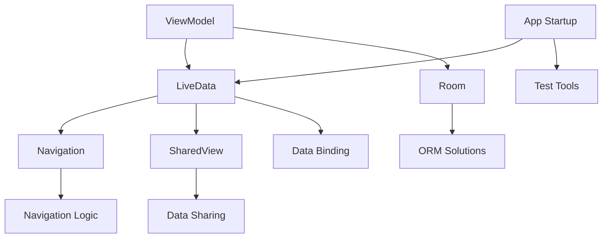

                 

关键词：Android Jetpack、开发效率、用户体验、组件化、架构设计、架构组件、生活化应用、未来展望

摘要：本文将深入探讨Android Jetpack组件库的核心概念、设计理念、具体实现及未来发展趋势。通过实例和详细解释，读者将了解如何利用Jetpack组件库优化Android应用的开发流程，提升开发效率和用户体验。

## 1. 背景介绍

Android Jetpack是Google推出的一套现代化的Android开发组件库，旨在帮助开发者构建高质量的Android应用。Jetpack不仅提供了丰富的架构组件，如LiveData、ViewModel、Room等，还包含了功能组件，如Navigation、SharedView、App Startup等。这些组件的设计和实现遵循了Android设计最佳实践，有助于减少代码冗余，提高开发效率。

### 1.1 开发者的痛点和需求

在传统的Android开发中，开发者常常面临以下痛点和需求：

- **代码冗余**：在Android应用开发中，尤其是大型应用，常常需要重复编写相同或类似的代码逻辑，这导致了代码冗余，增加了维护成本。
- **生命周期管理**：Android应用的生命周期复杂，开发者需要手动管理Activity、Fragment等组件的生命周期，这增加了出错的风险。
- **数据绑定**：在数据视图绑定方面，传统方法往往需要编写大量的模板代码，既繁琐又不灵活。
- **架构设计**：随着应用规模的扩大，开发者需要设计复杂的架构来管理应用的各个模块，这需要大量的时间和专业知识。

### 1.2 Jetpack组件库的解决方案

Jetpack组件库旨在解决上述痛点和需求，提供了一系列的解决方案：

- **架构组件**：通过架构组件，如ViewModel和LiveData，开发者可以轻松实现生命周期管理和数据绑定，减少代码冗余。
- **导航组件**：Navigation组件简化了多Activity或Fragment之间的导航逻辑，提供了一种更加直观和一致的方式。
- **共享视图组件**：SharedView组件帮助开发者实现多个Activity或Fragment之间的数据共享，无需重复传递数据。
- **启动器组件**：App Startup组件可以优化应用的启动速度，使应用更快地达到可交互状态。
- **测试工具**：Jetpack还提供了一系列测试工具，如Mockk和AndroidX Test Library，帮助开发者更轻松地进行单元测试和UI测试。

## 2. 核心概念与联系

为了更好地理解Android Jetpack组件库，我们需要了解其核心概念和整体架构。

### 2.1 核心概念

- **ViewModel**：用于存储和管理UI相关的数据，不绑定到特定生命周期组件，使得数据可以在组件之间共享。
- **LiveData**：用于在数据发生变化时通知UI组件，确保UI与数据同步。
- **Room**：Android的数据持久化库，提供了一套轻量级的ORM解决方案。
- **Navigation**：简化Activity和Fragment之间的导航逻辑。
- **SharedView**：用于在组件之间共享数据和状态。
- **App Startup**：用于优化应用的启动速度。

### 2.2 整体架构


如上架构图所示，Jetpack组件库通过架构组件、功能组件和测试工具共同工作，提供了一种模块化、可扩展的开发框架。

### 2.3 Mermaid 流程图

以下是一个Mermaid流程图，展示了Jetpack组件库的核心概念和相互关系：



## 3. 核心算法原理 & 具体操作步骤

### 3.1 算法原理概述

Jetpack组件库的核心算法原理主要围绕以下几个方面：

- **生命周期管理**：通过ViewModel和LiveData，实现UI组件和数据的生命周期绑定，确保数据在合适的时刻更新UI。
- **数据绑定**：通过LiveData，实现数据的自动绑定，减少手动编写数据绑定代码的繁琐。
- **数据持久化**：通过Room，实现数据的持久化存储，提供了一套轻量级的ORM解决方案。
- **导航**：通过Navigation，简化Activity和Fragment之间的导航逻辑。

### 3.2 算法步骤详解

#### 3.2.1 ViewModel的使用

1. 在Activity或Fragment中定义ViewModel。
2. 通过`ViewModelProviders.of()`获取ViewModel实例。
3. 在ViewModel中处理数据逻辑，如数据获取、更新等。
4. 通过LiveData将数据更新通知UI组件。

#### 3.2.2 LiveData的使用

1. 在ViewModel中定义LiveData实例。
2. 在数据发生变化时，调用`LiveData.postValue()`更新数据。
3. 在UI组件中观察LiveData实例，获取数据更新。

#### 3.2.3 Room的使用

1. 创建Room数据库和实体类。
2. 通过Room数据库访问对象进行数据操作。
3. 使用 LiveData 实现数据观察。

#### 3.2.4 Navigation的使用

1. 定义导航目的地。
2. 在Activity或Fragment中使用`NavigationUI`类实现导航逻辑。

### 3.3 算法优缺点

#### 优点

- **提高开发效率**：通过减少代码冗余和数据绑定，提高开发效率。
- **简化生命周期管理**：通过ViewModel和LiveData，简化生命周期管理，减少出错风险。
- **数据持久化简单**：通过Room，实现简单的数据持久化。
- **导航逻辑清晰**：通过Navigation，简化导航逻辑，提高用户体验。

#### 缺点

- **学习曲线**：对于新手开发者，可能需要一定时间来学习和适应。
- **兼容性问题**：在某些旧版本的Android设备上，可能存在兼容性问题。

### 3.4 算法应用领域

- **移动应用开发**：适用于各种移动应用，特别是大型应用。
- **数据驱动的应用**：需要实时更新UI的应用。

## 4. 数学模型和公式 & 详细讲解 & 举例说明

### 4.1 数学模型构建

在Jetpack组件库中，数学模型主要涉及数据绑定和生命周期管理。以下是一个简单的数学模型示例：

$$
\text{ViewModel} \rightarrow \text{LiveData} \rightarrow \text{UI Component}
$$

### 4.2 公式推导过程

在数据绑定过程中，LiveData会将数据变化通知给ViewModel，然后ViewModel将数据更新传递给UI组件。这个过程可以表示为以下公式：

$$
\text{LiveData.postValue(data)} \rightarrow \text{ViewModel.onChanged(data)} \rightarrow \text{UI Component.update(data)}
$$

### 4.3 案例分析与讲解

假设我们有一个简单的应用，其中包含一个列表界面和详情界面。列表界面需要显示数据列表，详情界面需要显示选中项的详细信息。

1. 在ViewModel中定义LiveData，用于存储和更新数据。
2. 在列表界面中观察LiveData，实时更新UI。
3. 在详情界面中，通过LiveData获取选中项的详细信息。

通过这个案例，我们可以看到LiveData在数据绑定和生命周期管理中的重要作用。

## 5. 项目实践：代码实例和详细解释说明

### 5.1 开发环境搭建

要使用Android Jetpack组件库，首先需要在Android Studio中配置开发环境。

1. 安装Android Studio。
2. 创建一个新的Android项目。
3. 在项目的`build.gradle`文件中添加Jetpack组件库依赖：

```groovy
dependencies {
    implementation 'androidx.lifecycle:lifecycle-viewmodel-ktx:2.3.1'
    implementation 'androidx.lifecycle:lifecycle-livedata-ktx:2.3.1'
    implementation 'androidx.room:room-runtime:2.3.0'
    kapt 'androidx.room:room-compiler:2.3.0'
    implementation 'androidx.navigation:navigation-fragment-ktx:2.3.5'
    implementation 'androidx.navigation:navigation-ui-ktx:2.3.5'
}
```

### 5.2 源代码详细实现

以下是一个简单的示例，展示如何使用Jetpack组件库构建一个简单的应用。

#### 5.2.1 数据模型

```kotlin
@Entity
data class Item(
    @PrimaryKey val id: Int,
    val title: String,
    val description: String
)
```

#### 5.2.2 数据库

```kotlin
@Database(entities = [Item::class], version = 1)
abstract class AppDatabase : RoomDatabase() {
    abstract fun itemDao(): ItemDao
}
```

#### 5.2.3 DAO

```kotlin
@Dao
interface ItemDao {
    @Query("SELECT * FROM item")
    fun getAllItems(): List<Item>

    @Insert
    fun insert(item: Item)
}
```

#### 5.2.4 ViewModel

```kotlin
class ItemViewModel(appDatabase: AppDatabase) : ViewModel() {
    private val itemDao = appDatabase.itemDao()
    private val _items = MutableLiveData<List<Item>>()
    val items: LiveData<List<Item>> = _items

    fun loadItems() {
        viewModelScope.launch {
            _items.value = itemDao.getAllItems()
        }
    }
}
```

#### 5.2.5 Activity

```kotlin
class ItemActivity : AppCompatActivity() {
    private lateinit var itemViewModel: ItemViewModel

    override fun onCreate(savedInstanceState: Bundle?) {
        super.onCreate(savedInstanceState)
        setContentView(R.layout.activity_item)

        itemViewModel = ViewModelProviders.of(this).get(ItemViewModel::class.java)
        itemViewModel.items.observe(this, Observer { items ->
            // 更新UI
        })

        itemViewModel.loadItems()
    }
}
```

### 5.3 代码解读与分析

以上代码展示了如何使用Jetpack组件库构建一个简单的列表应用。我们定义了一个数据模型`Item`，一个数据库`AppDatabase`和一个DAO`ItemDao`。在ViewModel中，我们使用LiveData来存储和更新数据，并在Activity中观察LiveData来更新UI。通过这个简单的示例，我们可以看到Jetpack组件库如何简化Android应用的开发。

### 5.4 运行结果展示

运行以上代码，我们将看到一个简单的列表界面，显示数据库中的所有数据。用户可以点击列表项，跳转到详情界面，显示选中项的详细信息。

## 6. 实际应用场景

Android Jetpack组件库在多个实际应用场景中表现出色，以下是一些典型的应用案例：

### 6.1 大型应用架构

在构建大型Android应用时，架构组件如ViewModel和LiveData可以帮助开发者更好地管理生命周期和数据绑定，减少代码冗余，提高维护性。

### 6.2 实时数据更新

对于需要实时数据更新的应用，如社交媒体、金融应用等，LiveData组件可以确保UI与后端数据保持同步。

### 6.3 数据持久化

Room组件提供了一种简单且高效的数据持久化解决方案，适用于需要存储大量数据的应用。

### 6.4 多Activity导航

Navigation组件可以简化多Activity或Fragment之间的导航逻辑，提供更好的用户体验。

### 6.5 应用启动优化

App Startup组件可以帮助开发者优化应用的启动速度，提高应用的响应速度。

## 6.4 未来应用展望

随着Android技术的不断发展，Jetpack组件库也在不断更新和完善。未来的发展趋势可能包括：

### 6.4.1 更好的跨平台支持

Jetpack组件库可能会进一步扩展对跨平台支持，如支持Flutter和React Native。

### 6.4.2 深度集成AI功能

随着AI技术的发展，Jetpack组件库可能会集成更多AI功能，如自动数据清洗、智能推荐等。

### 6.4.3 更强大的测试工具

Jetpack组件库可能会引入更多强大的测试工具，如自动化测试和性能分析工具，帮助开发者更高效地进行测试。

### 6.4.4 生态扩展

Jetpack组件库可能会与其他开源库和工具更好地集成，形成更完整的开发生态。

## 7. 工具和资源推荐

### 7.1 学习资源推荐

- 《Android Jetpack 实战》
- 《Android Jetpack 学习指南》
- 《Android Jetpack：现代Android应用开发》

### 7.2 开发工具推荐

- Android Studio
- Android Studio Profiler
- AndroidX Test Library

### 7.3 相关论文推荐

- "Android Architecture Components: Building Blocks for Clean and Maintainable Apps"
- "Android Jetpack Navigation: Simplifying Navigation in Android Applications"
- "Android Room: Building a Simple Database for Android"

## 8. 总结：未来发展趋势与挑战

Android Jetpack组件库为Android应用开发提供了强大的支持，提高了开发效率和用户体验。然而，随着技术的发展，Jetpack组件库也面临一些挑战：

### 8.1 研究成果总结

- Jetpack组件库在提高开发效率、简化生命周期管理、数据绑定和数据持久化方面取得了显著成果。
- Navigation组件在简化多Activity导航方面表现出色。
- Room组件提供了一种简单高效的数据持久化解决方案。

### 8.2 未来发展趋势

- 跨平台支持：Jetpack组件库可能会进一步扩展对跨平台支持。
- AI集成：Jetpack组件库可能会集成更多AI功能。
- 测试工具：Jetpack组件库可能会引入更多强大的测试工具。

### 8.3 面临的挑战

- 学习曲线：对于新手开发者，可能需要一定时间来学习和适应。
- 兼容性问题：在某些旧版本的Android设备上，可能存在兼容性问题。

### 8.4 研究展望

Android Jetpack组件库将继续在Android应用开发中发挥重要作用。通过不断更新和完善，Jetpack组件库将更好地适应未来的技术发展趋势，为开发者提供更加便捷和高效的开发体验。

## 9. 附录：常见问题与解答

### 9.1 什么是ViewModel？

ViewModel是一个存储和管理UI相关数据的类，不绑定到特定生命周期组件，使得数据可以在组件之间共享。

### 9.2 LiveData如何工作？

LiveData是一个可观察的数据持有类，当数据发生变化时，它会通知观察者，确保UI与数据同步。

### 9.3 Room如何工作？

Room是一个轻量级的ORM解决方案，用于实现数据的持久化存储。通过定义实体类和数据库访问对象，Room可以简化数据的CRUD操作。

### 9.4 Navigation如何工作？

Navigation是一个组件，用于简化Activity和Fragment之间的导航逻辑。通过定义导航目的地和导航图，Navigation可以提供一种直观和一致的导航体验。

### 9.5 如何优化应用启动速度？

使用App Startup组件，可以优化应用的启动速度。App Startup组件可以帮助开发者按需启动组件，减少应用的启动时间。

---

本文由禅与计算机程序设计艺术 / Zen and the Art of Computer Programming 撰写，旨在为开发者提供关于Android Jetpack组件库的全面介绍和深入探讨。通过本文，读者可以了解Jetpack组件库的核心概念、设计理念、具体实现及未来发展趋势。希望本文能帮助开发者更好地利用Jetpack组件库，提升Android应用的开发效率和用户体验。

