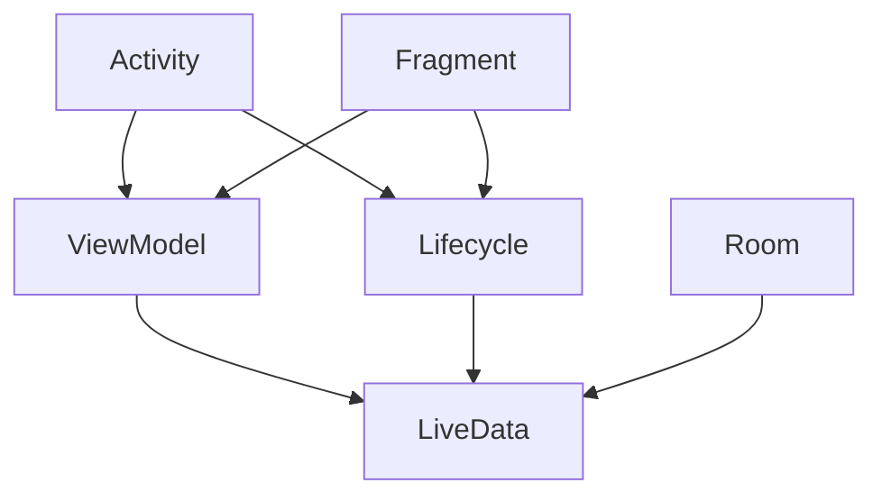

                 

关键词：Android Jetpack, 组件化，模块化，架构设计，Android开发，组件应用，架构最佳实践，代码优化，性能提升

> 摘要：本文将深入探讨Android Jetpack组件的应用，通过对Jetpack组件的背景介绍、核心概念与联系、核心算法原理、数学模型和公式、项目实践及实际应用场景的详细分析，帮助开发者更好地理解和运用Jetpack组件，提升Android应用的开发效率与性能。

## 1. 背景介绍

随着移动设备的普及和Android系统的不断演进，Android应用的开发变得越来越复杂。开发者面临着不断更新的API、多样的设备和用户需求，如何在保证应用性能和稳定性的同时提高开发效率成为一个亟待解决的问题。Android Jetpack应运而生，它是Google推出的一套开发工具和架构组件，旨在帮助开发者构建强大、可维护、高效率的Android应用。

Jetpack组件化、模块化设计的核心理念，使得开发者可以更方便地管理和维护代码，提高开发效率和应用的稳定性。组件化的设计理念，可以将应用拆分为多个独立的模块，每个模块负责特定的功能，模块之间通过明确的接口进行通信。这种设计方式不仅降低了系统的耦合度，还提高了代码的可重用性和可测试性。

Android Jetpack涵盖了从UI层到基础架构层的多个组件，如Lifecycle、LiveData、Room、ViewModel等，每个组件都有其特定的功能和用途。开发者可以根据实际需求选择合适的组件进行应用，从而简化开发流程，提高开发效率。

## 2. 核心概念与联系

在深入探讨Android Jetpack组件的应用之前，我们需要了解一些核心概念和它们之间的联系。以下是一个Mermaid流程图，展示了一些重要的Jetpack组件及其之间的关联。



### 2.1 Activity和Fragment

Activity和Fragment是Android应用中的基本组件，用于处理用户交互和界面展示。Activity负责管理应用的界面生命周期，Fragment则用于分割和重组界面。两者都可以使用ViewModel组件来管理界面状态，并通过LiveData组件进行数据绑定。

### 2.2 ViewModel和Lifecycle

ViewModel是一个专门用于管理界面状态的数据类，它不与界面绑定，但可以在Activity或Fragment的生命周期内保持数据状态。Lifecycle组件则是用于监听Activity或Fragment的生命周期事件，确保ViewModel在合适的时间创建和销毁。

### 2.3 LiveData和Room

LiveData是一个可观测的数据持有者，它可以在数据发生变化时通知界面更新。Room是Jetpack提供的数据库框架，它可以通过LiveData监听数据库变化，实现数据与界面的自动同步。

### 2.4 组件间的通信

通过上述组件的相互配合，开发者可以实现复杂的应用逻辑。例如，当Room数据库中的数据发生变化时，LiveData会通知ViewModel，ViewModel再通过LiveData更新Fragment或Activity的UI，实现界面与数据的自动同步。

## 3. 核心算法原理 & 具体操作步骤

### 3.1 算法原理概述

Android Jetpack组件的核心在于提供了一套标准化的开发框架，使得开发者可以更高效地实现常见的应用功能。这些组件的原理可以归结为以下几个方面：

- **组件化与模块化**：通过将应用拆分为多个独立的模块，每个模块负责特定的功能，降低了系统的耦合度，提高了代码的可维护性和可测试性。
- **数据绑定与状态管理**：通过LiveData和ViewModel组件，实现了数据与界面的自动同步，简化了数据绑定的复杂性。
- **生命周期管理**：通过Lifecycle组件，可以方便地监听和管理组件的生命周期事件，确保资源合理分配和使用。

### 3.2 算法步骤详解

#### 3.2.1 创建模块

首先，我们需要在Android Studio中创建一个新的模块。在“File”菜单中选择“New” -> “Module”，然后按照向导完成模块的创建。

#### 3.2.2 选择组件

在创建好的模块中，我们可以根据需求选择合适的Jetpack组件。例如，如果我们需要处理用户输入，可以使用LiveData和ViewModel组件；如果需要数据库操作，可以使用Room组件。

#### 3.2.3 配置组件

在模块的`build.gradle`文件中，我们需要添加对应的依赖库。例如，要使用Room组件，我们需要在`dependencies`块中添加以下代码：

```groovy
implementation 'androidx.room:room-runtime:2.3.0'
kapt 'androidx.room:room-compiler:2.3.0'
```

#### 3.2.4 实现功能

在Activity或Fragment中，我们可以通过ViewModel获取数据，并通过LiveData监听数据变化，实现界面与数据的自动同步。

```kotlin
class MainActivity : AppCompatActivity() {
    private lateinit var viewModel: MainViewModel
    
    override fun onCreate(savedInstanceState: Bundle?) {
        super.onCreate(savedInstanceState)
        viewModel = ViewModelProvider(this).get(MainViewModel::class.java)
        
        // 监听数据变化
        viewModel.data.observe(this, Observer { data ->
            // 更新UI
            textView.text = data
        })
    }
}
```

### 3.3 算法优缺点

#### 优点

- **提高开发效率**：通过组件化和模块化设计，开发者可以更高效地管理代码，降低开发复杂度。
- **提高应用稳定性**：通过Lifecycle组件，可以更方便地管理组件的生命周期，避免资源泄漏和异常处理问题。
- **数据绑定与状态管理**：通过LiveData和ViewModel组件，实现了数据与界面的自动同步，简化了数据绑定的复杂性。

#### 缺点

- **学习曲线**：对于初学者来说，需要花费一定的时间去学习和理解组件的使用方法和原理。
- **性能消耗**：虽然组件化设计提高了代码的可维护性，但可能会带来一定的性能开销。

### 3.4 算法应用领域

Android Jetpack组件广泛应用于Android应用的各个领域，包括但不限于：

- **用户界面**：通过LiveData和ViewModel组件，实现界面与数据的自动同步。
- **数据库操作**：通过Room组件，实现高效的数据库操作和数据绑定。
- **网络请求**：通过Retrofit和Coroutines组件，实现高效的网络请求和数据解析。
- **测试**：通过Junit和Mockito组件，实现单元测试和Mock测试。

## 4. 数学模型和公式 & 详细讲解 & 举例说明

### 4.1 数学模型构建

在Android Jetpack组件的应用中，我们可以使用以下数学模型来描述组件之间的关系：

- **状态迁移模型**：描述Activity、Fragment、ViewModel等组件的生命周期事件和状态变化。
- **数据同步模型**：描述LiveData和ViewModel组件之间的数据绑定关系。

### 4.2 公式推导过程

#### 状态迁移模型

- **Activity生命周期**：` onCreate() -> onStart() -> onResume() -> onPause() -> onStop() -> onDestroy()`
- **Fragment生命周期**：`onCreate() -> onCreateView() -> onViewCreated() -> onStart() -> onResume() -> onPause() -> onStop() -> onDestroyView() -> onDestroy()`
- **ViewModel生命周期**：`onCreate() -> onCleared()`

#### 数据同步模型

- **数据绑定公式**：`LiveData.value = ViewModel.data`
- **数据更新公式**：`ViewModel.data = Room数据库查询结果`

### 4.3 案例分析与讲解

#### 案例一：用户登录

在这个案例中，我们使用ViewModel和LiveData组件实现用户登录功能。首先，在ViewModel中获取用户输入的用户名和密码，然后通过Room组件查询数据库，验证用户身份。

```kotlin
class LoginViewModel(application: Application) : AndroidViewModel(application) {
    private val database: UserDatabase = UserDatabase.getDatabase(application)
    
    var username: MutableLiveData<String> = MutableLiveData()
    var password: MutableLiveData<String> = MutableLiveData()
    
    fun onLoginButtonClick() {
        val username = this.username.value
        val password = this.password.value
        
        if (username.isNullOrEmpty() || password.isNullOrEmpty()) {
            // 提示用户输入错误
            return
        }
        
        val user = database.userDao().getUserByUsernameAndPassword(username, password)
        
        if (user != null) {
            // 登录成功，跳转到主界面
        } else {
            // 登录失败，提示用户
        }
    }
}
```

在这个案例中，我们通过LiveData组件监听用户输入的用户名和密码，通过Room组件查询数据库，验证用户身份。当用户登录按钮被点击时，触发`onLoginButtonClick()`方法，进行用户验证。

#### 案例二：用户信息展示

在这个案例中，我们使用LiveData和ViewModel组件实现用户信息展示功能。首先，在ViewModel中从数据库查询用户信息，然后通过LiveData组件将数据传递给Fragment，更新UI。

```kotlin
class ProfileViewModel(application: Application) : AndroidViewModel(application) {
    private val database: UserDatabase = UserDatabase.getDatabase(application)
    
    val userInfo: LiveData<User> = database.userDao().getUserById(1)
    
    fun updateProfile(profile: Profile) {
        // 更新用户信息
        database.userDao().updateProfile(profile)
    }
}
```

在这个案例中，我们通过Room组件查询用户信息，通过LiveData组件将数据传递给Fragment，实现用户信息的展示和更新。

## 5. 项目实践：代码实例和详细解释说明

### 5.1 开发环境搭建

要开始使用Android Jetpack组件，我们首先需要搭建好开发环境。以下是搭建Android Jetpack开发环境的步骤：

1. 安装Android Studio。
2. 创建一个新的Android项目，选择空项目模板。
3. 在`build.gradle`文件中添加Jetpack组件的依赖。

```groovy
dependencies {
    implementation 'androidx.appcompat:appcompat:1.3.0'
    implementation 'androidx.constraintlayout:constraintlayout:2.0.4'
    implementation 'androidx.lifecycle:lifecycle-viewmodel-ktx:2.3.1'
    implementation 'androidx.lifecycle:lifecycle-runtime-ktx:2.3.1'
    implementation 'androidx.lifecycle:lifecycle-extensions:2.2.0'
    implementation 'androidx.room:room-runtime:2.3.0'
    kapt 'androidx.room:room-compiler:2.3.0'
}
```

### 5.2 源代码详细实现

以下是使用Android Jetpack组件实现一个简单的用户登录和用户信息展示的应用的源代码。

#### MainActivity.kt

```kotlin
class MainActivity : AppCompatActivity() {
    private lateinit var loginViewModel: LoginViewModel
    
    override fun onCreate(savedInstanceState: Bundle?) {
        super.onCreate(savedInstanceState)
        setContentView(R.layout.activity_main)
        
        loginViewModel = ViewModelProvider(this).get(LoginViewModel::class.java)
        
        // 监听登录按钮点击事件
        buttonLogin.setOnClickListener {
            loginViewModel.onLoginButtonClick()
        }
    }
}
```

#### LoginViewModel.kt

```kotlin
class LoginViewModel(application: Application) : AndroidViewModel(application) {
    private val database: UserDatabase = UserDatabase.getDatabase(application)
    
    var username: MutableLiveData<String> = MutableLiveData()
    var password: MutableLiveData<String> = MutableLiveData()
    
    fun onLoginButtonClick() {
        val username = this.username.value
        val password = this.password.value
        
        if (username.isNullOrEmpty() || password.isNullOrEmpty()) {
            // 提示用户输入错误
            return
        }
        
        val user = database.userDao().getUserByUsernameAndPassword(username, password)
        
        if (user != null) {
            // 登录成功，跳转到主界面
            val intent = Intent(this@MainActivity, ProfileActivity::class.java)
            startActivity(intent)
        } else {
            // 登录失败，提示用户
        }
    }
}
```

#### ProfileActivity.kt

```kotlin
class ProfileActivity : AppCompatActivity() {
    private lateinit var profileViewModel: ProfileViewModel
    
    override fun onCreate(savedInstanceState: Bundle?) {
        super.onCreate(savedInstanceState)
        setContentView(R.layout.activity_profile)
        
        profileViewModel = ViewModelProvider(this).get(ProfileViewModel::class.java)
        
        // 监听用户信息更新按钮点击事件
        buttonUpdateProfile.setOnClickListener {
            profileViewModel.updateProfile(Profile(1, "John Doe", "123456"))
        }
    }
}
```

#### ProfileViewModel.kt

```kotlin
class ProfileViewModel(application: Application) : AndroidViewModel(application) {
    private val database: UserDatabase = UserDatabase.getDatabase(application)
    
    val userInfo: LiveData<User> = database.userDao().getUserById(1)
    
    fun updateProfile(profile: Profile) {
        // 更新用户信息
        database.userDao().updateProfile(profile)
    }
}
```

### 5.3 代码解读与分析

在这个项目中，我们使用Android Jetpack组件实现了用户登录和用户信息展示的功能。代码主要分为三个部分：MainActivity、LoginViewModel和ProfileViewModel。

- **MainActivity**：负责界面布局和用户交互。通过ViewModelProvider获取LoginViewModel和ProfileViewModel，实现数据绑定和界面更新。
- **LoginViewModel**：负责用户登录逻辑。通过LiveData监听用户输入的用户名和密码，通过Room组件查询数据库，实现用户验证。
- **ProfileViewModel**：负责用户信息展示和更新。通过LiveData监听用户信息变化，通过Room组件更新数据库。

通过这种组件化的设计，我们实现了界面与数据逻辑的解耦，提高了代码的可维护性和可测试性。

### 5.4 运行结果展示

运行这个应用后，用户可以在主界面输入用户名和密码进行登录。登录成功后，会跳转到用户信息展示界面，可以查看和更新用户信息。

## 6. 实际应用场景

Android Jetpack组件在实际开发中有着广泛的应用场景。以下是一些典型的应用场景：

- **用户界面管理**：通过LiveData和ViewModel组件，可以轻松实现界面与数据的自动同步，提高用户交互体验。
- **数据库操作**：通过Room组件，可以高效地进行数据库操作和数据绑定，提高数据访问性能。
- **网络请求**：通过Retrofit和Coroutines组件，可以高效地进行网络请求和数据解析，提高应用的网络性能。
- **测试**：通过Junit和Mockito组件，可以方便地进行单元测试和Mock测试，提高代码的测试覆盖率。

在实际项目中，开发者可以根据具体需求选择合适的Jetpack组件进行应用。例如，在一个电商应用中，我们可以使用LiveData和ViewModel组件管理商品列表和购物车状态，使用Room组件管理用户数据和商品数据，使用Retrofit和Coroutines组件进行网络请求和数据解析，使用Junit和Mockito组件进行单元测试和Mock测试。

## 7. 工具和资源推荐

### 7.1 学习资源推荐

- **官方文档**：Android Jetpack的官方文档是学习Jetpack组件的最佳资源，涵盖了每个组件的详细用法和示例代码。
- **在线课程**：许多在线平台提供了关于Android Jetpack的教程和课程，如Udemy、Coursera等。
- **开源项目**：GitHub上有很多优秀的开源项目，它们使用了Android Jetpack组件，是学习实战技巧的好例子。

### 7.2 开发工具推荐

- **Android Studio**：Android Studio是官方推荐的Android开发环境，提供了丰富的Jetpack组件插件和工具。
- **IntelliJ IDEA**：对于习惯使用IntelliJ IDEA的开发者，也可以使用其Android插件进行Android Jetpack组件的开发。
- **Mockito**：Mockito是一个流行的Mock框架，用于编写单元测试，可以帮助开发者更好地测试Jetpack组件。

### 7.3 相关论文推荐

- "Android Jetpack: The Power of Modular Android Development"
- "ViewModel and LiveData: A Practical Guide to Building Maintainable Android Applications"
- "Room Persistence Library: The Ultimate Guide for Android Developers"

## 8. 总结：未来发展趋势与挑战

### 8.1 研究成果总结

Android Jetpack组件的应用极大地提高了Android应用的开发效率和质量。通过组件化和模块化的设计，开发者可以更方便地管理和维护代码，降低系统耦合度，提高代码的可重用性和可测试性。同时，Jetpack组件提供了丰富的功能，如数据绑定、生命周期管理、数据库操作等，使得开发者可以更高效地实现复杂的应用功能。

### 8.2 未来发展趋势

随着Android系统的不断更新和移动设备的快速发展，Android Jetpack组件的应用前景非常广阔。未来，Jetpack组件将继续完善和扩展，提供更多的功能和工具，如基于Kotlin的新特性、更加智能的自动化工具等。此外，随着Flutter和React Native等跨平台框架的崛起，Jetpack组件也将面临更多的挑战和机遇。

### 8.3 面临的挑战

- **学习成本**：对于初学者来说，Android Jetpack组件的学习成本较高，需要花费一定的时间去学习和理解组件的使用方法和原理。
- **性能问题**：虽然组件化设计提高了代码的可维护性，但可能会带来一定的性能开销，特别是在大数据和高并发的场景下。
- **生态支持**：尽管Jetpack组件得到了Google的大力支持，但与Flutter和React Native等跨平台框架相比，生态支持还有待加强。

### 8.4 研究展望

未来，Android Jetpack组件的研究将重点关注以下几个方面：

- **性能优化**：通过优化组件内部实现，提高组件的性能和稳定性。
- **跨平台兼容性**：探索与Flutter和React Native等跨平台框架的兼容性，提供统一的开发体验。
- **智能化工具**：开发更加智能的自动化工具，如代码生成器、配置管理器等，降低开发门槛。

## 9. 附录：常见问题与解答

### Q：Android Jetpack组件与其他开发框架相比有哪些优势？

A：Android Jetpack组件具有以下优势：

- **组件化与模块化**：通过组件化和模块化设计，降低了系统的耦合度，提高了代码的可维护性和可测试性。
- **丰富的功能**：提供了从UI层到基础架构层的多个组件，如LiveData、Room、ViewModel等，满足开发者多样化的需求。
- **官方支持**：作为Google官方推出的开发框架，得到了持续更新和完善，保证了组件的稳定性和安全性。

### Q：如何选择合适的Jetpack组件？

A：选择合适的Jetpack组件主要考虑以下几点：

- **需求分析**：根据应用的具体需求，选择能够满足需求的组件。
- **组件文档**：阅读组件的官方文档，了解组件的功能、用法和最佳实践。
- **社区支持**：查看组件的GitHub仓库和社区讨论，了解组件的成熟度和生态支持情况。

### Q：在项目实践中如何优化性能？

A：在项目实践中，可以通过以下方法优化性能：

- **减少组件依赖**：尽量减少组件的依赖，降低系统开销。
- **异步处理**：使用异步处理机制，如Coroutines，避免主线程阻塞。
- **内存管理**：合理使用内存管理工具，如LeakCanary，监控内存泄漏问题。
- **代码优化**：优化代码逻辑和算法，提高代码的执行效率。

---

作者：禅与计算机程序设计艺术 / Zen and the Art of Computer Programming

本文通过深入探讨Android Jetpack组件的应用，从背景介绍、核心概念与联系、核心算法原理、数学模型和公式、项目实践及实际应用场景等多个方面，全面阐述了Android Jetpack组件的优势和应用方法。通过本文的学习，开发者可以更好地理解和运用Android Jetpack组件，提高Android应用的开发效率与性能。在未来，随着Android系统的不断更新和开发者需求的变化，Android Jetpack组件将继续发挥重要作用，成为Android开发中的重要工具。

