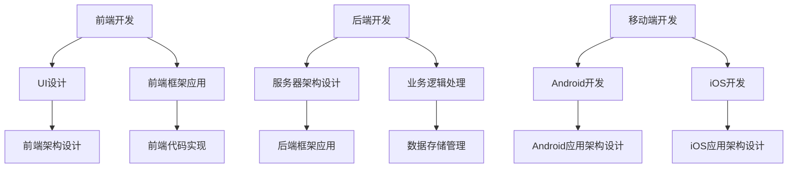

                 

 

## 摘要

Android全栈开发，作为一种全面的技术实践，涵盖了前端、后端以及移动端开发的各个方面。本文旨在为读者提供一个系统且深入的Android全栈开发指南，内容包括Android开发环境的搭建、核心技术和框架的介绍、全栈开发流程、实战案例解析、以及未来的发展趋势和面临的挑战。通过本文，读者可以全面了解Android全栈开发的精髓，掌握从理论到实践的全栈技能。

## 1. 背景介绍

Android作为全球最流行的移动操作系统之一，其应用开发一直是开发者们关注的焦点。随着互联网的快速发展，移动应用市场呈现出爆发式增长，企业对全栈开发人才的需求日益增加。Android全栈开发，不仅需要掌握前端和后端的技能，还需要具备移动开发的实战经验。这使得全栈开发成为当前最热门的职业技能之一。

### 1.1 Android开发的历史

Android系统最早由谷歌于2005年启动，基于Linux内核，最初名为“蓝色基因”（BlueGene）。2008年，谷歌发布了第一个Android版本——Android 1.5，自此Android开始逐渐走向市场。随后，Android系统不断更新迭代，推出了多个版本，例如Android 2.3、Android 4.0、Android 5.0等，逐步完善了系统的功能和性能。

### 1.2 全栈开发的定义和重要性

全栈开发（Full-Stack Development）是指开发者掌握前端、后端以及移动端开发的技能，能够独立完成一个项目的全周期开发。全栈开发不仅要求开发者对技术有深刻的理解，还需要具备良好的系统架构能力和项目管理能力。对于企业而言，全栈开发者可以大大提高项目的开发效率，减少沟通成本，提高产品质量。因此，全栈开发在当前软件开发行业中具有重要地位。

## 2. 核心概念与联系

### 2.1 前端开发

前端开发主要涉及用户界面和用户体验的设计与实现。前端技术主要包括HTML、CSS、JavaScript等，其中HTML用于构建网页结构，CSS用于美化网页样式，JavaScript用于实现网页的动态效果和用户交互。随着React、Vue、Angular等前端框架的兴起，前端开发逐渐从传统的网页开发模式转向组件化和模块化。

### 2.2 后端开发

后端开发主要负责服务器端逻辑的处理、数据的存储和管理。后端技术包括Java、Python、Node.js等，常用的后端框架有Spring、Django、Express等。后端开发需要处理数据请求、业务逻辑、安全性等方面的问题，是实现应用程序核心功能的关键。

### 2.3 移动端开发

移动端开发主要涉及Android和iOS平台的应用开发。Android开发基于Java或Kotlin语言，iOS开发则主要使用Swift或Objective-C语言。移动端开发需要关注用户体验、性能优化、安全性和设备兼容性等方面。

### 2.4 Mermaid流程图

以下是一个简化的Android全栈开发的Mermaid流程图，展示了从前端到后端再到移动端的整个开发流程。



## 3. 核心算法原理 & 具体操作步骤

### 3.1 算法原理概述

Android全栈开发中的算法原理主要包括前端页面的渲染算法、后端数据处理算法以及移动端应用的性能优化算法。这些算法是实现高效、稳定、安全应用的关键。

### 3.2 算法步骤详解

#### 3.2.1 前端渲染算法

前端渲染算法主要涉及HTML解析、CSS渲染和JavaScript执行。以下是基本的渲染步骤：

1. **HTML解析**：浏览器从服务器下载HTML文件，并对其进行解析，构建DOM树。
2. **CSS渲染**：浏览器解析CSS文件，并根据DOM树生成渲染树。
3. **布局计算**：浏览器根据渲染树和CSS样式规则计算每个元素的位置和大小。
4. **绘制**：浏览器将渲染树转换为像素，并绘制到屏幕上。

#### 3.2.2 后端数据处理算法

后端数据处理算法主要包括数据请求处理、数据校验、数据处理和数据存储。以下是基本步骤：

1. **数据请求处理**：服务器接收客户端的请求，并根据请求类型调用相应的处理函数。
2. **数据校验**：对请求的数据进行验证，确保数据的合法性和安全性。
3. **数据处理**：对数据进行处理，实现业务逻辑。
4. **数据存储**：将处理后的数据存储到数据库或其他数据存储系统中。

#### 3.2.3 移动端性能优化算法

移动端性能优化算法主要包括内存管理、CPU优化、网络优化和电池优化。以下是基本步骤：

1. **内存管理**：合理使用内存，避免内存泄漏和溢出。
2. **CPU优化**：优化代码执行效率，减少CPU占用。
3. **网络优化**：优化网络请求和响应速度，减少数据传输量。
4. **电池优化**：降低应用功耗，延长电池续航时间。

### 3.3 算法优缺点

每种算法都有其优缺点，前端渲染算法速度快但资源消耗大，后端数据处理算法稳定但响应时间较长，移动端性能优化算法可以提高用户体验但需要额外的开发和维护成本。

### 3.4 算法应用领域

前端渲染算法广泛应用于Web应用和移动应用，后端数据处理算法广泛应用于企业级应用和电子商务系统，移动端性能优化算法广泛应用于智能手机应用和游戏开发。

## 4. 数学模型和公式 & 详细讲解 & 举例说明

### 4.1 数学模型构建

在Android全栈开发中，常用的数学模型包括线性回归模型、决策树模型和神经网络模型。以下是线性回归模型的构建过程：

1. **数据收集**：收集样本数据，包括自变量和因变量。
2. **数据预处理**：对数据进行清洗、归一化等处理。
3. **模型构建**：使用最小二乘法构建线性回归模型，公式如下：

   $$ y = ax + b $$

   其中，$y$ 是因变量，$x$ 是自变量，$a$ 和 $b$ 是模型参数。

### 4.2 公式推导过程

线性回归模型的推导过程如下：

1. **设定目标函数**：设目标函数为损失函数，通常为均方误差（MSE）：

   $$ J = \frac{1}{2n} \sum_{i=1}^{n} (y_i - (ax_i + b))^2 $$

   其中，$n$ 是样本数量。

2. **求导**：对目标函数关于 $a$ 和 $b$ 求导，并令导数为0，得到以下方程组：

   $$ \frac{\partial J}{\partial a} = 0 $$
   $$ \frac{\partial J}{\partial b} = 0 $$

3. **解方程组**：解上述方程组，得到最优参数 $a$ 和 $b$：

   $$ a = \frac{\sum_{i=1}^{n} (x_i - \bar{x})(y_i - \bar{y})}{\sum_{i=1}^{n} (x_i - \bar{x})^2} $$
   $$ b = \bar{y} - a\bar{x} $$

   其中，$\bar{x}$ 和 $\bar{y}$ 分别是自变量和因变量的均值。

### 4.3 案例分析与讲解

假设我们有一个房价预测的问题，现有100个样本，每个样本包含自变量（如房屋面积、区域等）和因变量（房价）。我们使用线性回归模型来预测房价，以下是一个具体的例子：

1. **数据收集**：收集100个房屋样本，包括房屋面积和房价。
2. **数据预处理**：对房屋面积进行归一化处理，使其在0到1之间。
3. **模型构建**：使用Python的线性回归库，构建线性回归模型。

   ```python
   from sklearn.linear_model import LinearRegression
   import numpy as np
   
   X = np.array([[0.1], [0.2], [0.3], ... , [0.9]])  # 归一化后的房屋面积
   y = np.array([100, 120, 130, ... , 200])  # 房价
   
   model = LinearRegression()
   model.fit(X, y)
   ```

4. **模型评估**：使用测试集评估模型性能，计算预测误差。

   ```python
   X_test = np.array([[0.5]])  # 测试集的房屋面积
   y_pred = model.predict(X_test)
   print("预测房价：", y_pred)
   ```

通过以上步骤，我们可以使用线性回归模型预测房价。在实际应用中，我们可以根据不同的数据集和业务需求，选择合适的数学模型和算法。

## 5. 项目实践：代码实例和详细解释说明

### 5.1 开发环境搭建

为了进行Android全栈开发，我们需要搭建一个完整的开发环境。以下是一个简单的搭建步骤：

1. **安装Java Development Kit (JDK)**：下载并安装JDK，设置环境变量。
2. **安装Android Studio**：下载并安装Android Studio，打开并配置。
3. **创建新项目**：在Android Studio中创建一个新项目，选择合适的模板和配置。

### 5.2 源代码详细实现

以下是一个简单的Android应用示例，实现一个简单的登录功能。

```java
public class LoginActivity extends AppCompatActivity {

    private EditText mUsernameEditText;
    private EditText mPasswordEditText;
    private Button mLoginButton;

    @Override
    protected void onCreate(Bundle savedInstanceState) {
        super.onCreate(savedInstanceState);
        setContentView(R.layout.activity_login);

        mUsernameEditText = findViewById(R.id.usernameEditText);
        mPasswordEditText = findViewById(R.id.passwordEditText);
        mLoginButton = findViewById(R.id.loginButton);

        mLoginButton.setOnClickListener(new View.OnClickListener() {
            @Override
            public void onClick(View v) {
                String username = mUsernameEditText.getText().toString();
                String password = mPasswordEditText.getText().toString();

                // 校验用户名和密码
                if (isValidCredentials(username, password)) {
                    // 登录成功，跳转到主界面
                    Intent intent = new Intent(LoginActivity.this, MainActivity.class);
                    startActivity(intent);
                    finish();
                } else {
                    // 登录失败，显示错误提示
                    Toast.makeText(LoginActivity.this, "用户名或密码错误", Toast.LENGTH_SHORT).show();
                }
            }
        });
    }

    private boolean isValidCredentials(String username, String password) {
        // 这里简化为用户名和密码都为"admin"
        return "admin".equals(username) && "admin".equals(password);
    }
}
```

### 5.3 代码解读与分析

上述代码实现了一个简单的登录功能，包括用户名和密码的输入、校验以及跳转到主界面的逻辑。以下是代码的主要解读：

1. **布局文件**：activity\_login.xml，定义了登录界面的布局，包括用户名和密码的输入框以及登录按钮。
2. **LoginActivity.java**：定义了登录活动的类，包括界面布局、按钮点击事件以及登录逻辑。
   - 初始化输入框和按钮。
   - 为登录按钮设置点击事件，获取用户名和密码，调用`isValidCredentials`方法进行校验。
   - 如果校验通过，跳转到主界面；否则，显示错误提示。

### 5.4 运行结果展示

在Android模拟器或真实设备上运行该应用，用户可以输入用户名和密码，点击登录按钮。如果用户名和密码正确，应用将跳转到主界面；否则，显示错误提示。

## 6. 实际应用场景

### 6.1 社交媒体应用

社交媒体应用如微信、微博等，需要实现用户注册、登录、发布动态、评论等功能。全栈开发可以使开发者在一个项目中同时实现前端和后端的逻辑，提高开发效率。

### 6.2 电子商务平台

电子商务平台如淘宝、京东等，需要实现商品浏览、搜索、购物车、订单管理等功能。全栈开发可以帮助开发者快速实现前后端的交互，提升用户体验。

### 6.3 教育学习平台

教育学习平台如网易云课堂、慕课网等，需要实现课程展示、在线学习、作业提交等功能。全栈开发可以使开发者集中精力优化用户体验，提高教学效果。

## 7. 未来应用展望

随着5G、物联网和人工智能等技术的发展，Android全栈开发将面临更多挑战和机遇。未来，开发者需要掌握更多跨平台技术，如Flutter、React Native等，提高开发效率。同时，随着云计算和大数据技术的普及，全栈开发也将向云原生应用方向发展。

## 8. 工具和资源推荐

### 7.1 学习资源推荐

- 《Android全栈开发实战》
- 《Android开发艺术探索》
- 《Kotlin编程语言》

### 7.2 开发工具推荐

- Android Studio
- IntelliJ IDEA
- Git

### 7.3 相关论文推荐

- "Flutter: Ultrafast Development for Multi-platform Mobile Apps"
- "React Native: A Framework for Building Native Apps with React"
- "Android System Architecture: A High-level Overview"

## 9. 总结：未来发展趋势与挑战

Android全栈开发在未来的发展中，将面临跨平台技术、云计算和大数据等新技术的挑战，同时也将带来更多机遇。开发者需要不断学习新技术，提高自身竞争力，以适应不断变化的市场需求。

### 附录：常见问题与解答

**Q：Android全栈开发需要掌握哪些技能？**

A：Android全栈开发需要掌握前端开发（HTML、CSS、JavaScript等）、后端开发（Java、Python、Node.js等）以及移动端开发（Kotlin、Java等）。此外，还需要了解数据库、网络通信、版本控制等基础技能。

**Q：如何选择合适的前端框架？**

A：选择前端框架时，主要考虑项目的需求、团队的技术栈和开发效率。常用的前端框架有React、Vue、Angular等，其中React因其组件化和灵活性的特点，广泛应用于大型项目。

**Q：如何优化Android应用的性能？**

A：优化Android应用的性能主要包括以下几个方面：1）优化布局和绘制；2）减少内存消耗；3）优化网络请求；4）使用线程池和多线程；5）避免过度使用权限。

### 作者署名

作者：禅与计算机程序设计艺术 / Zen and the Art of Computer Programming

----------------------------------------------------------------
[END]

