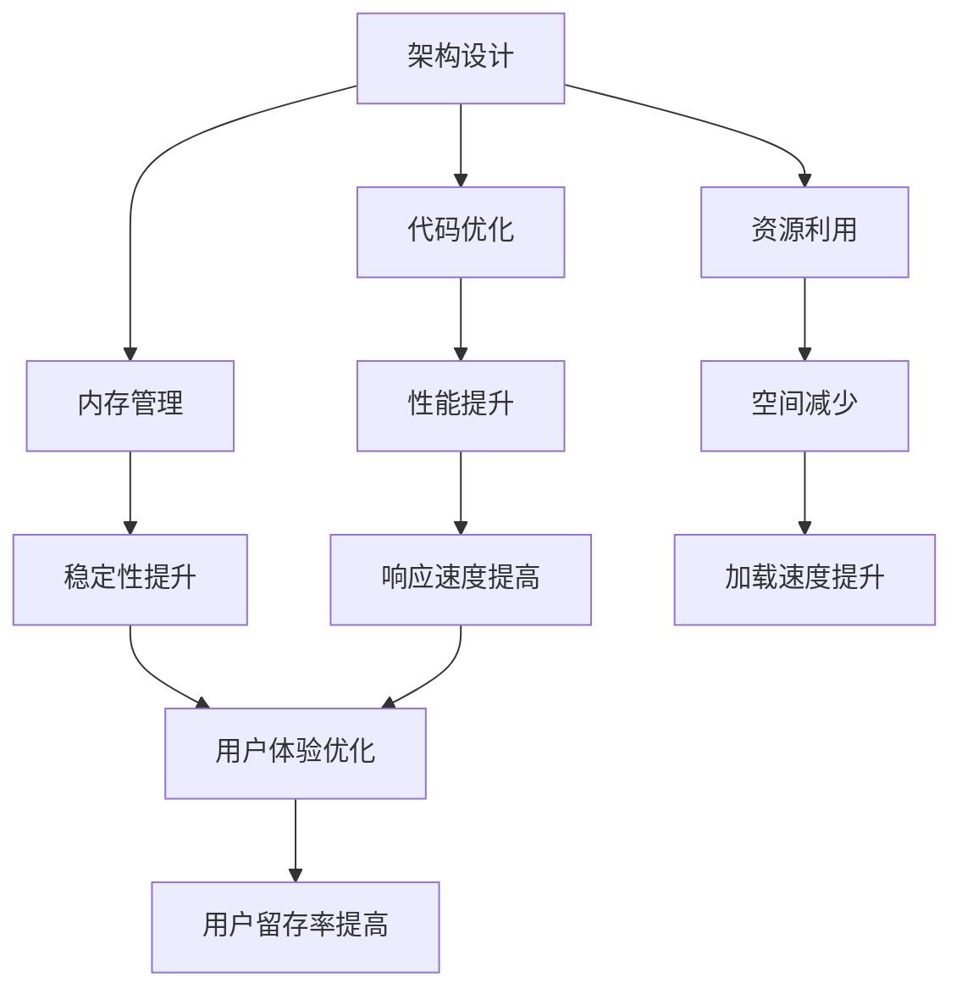
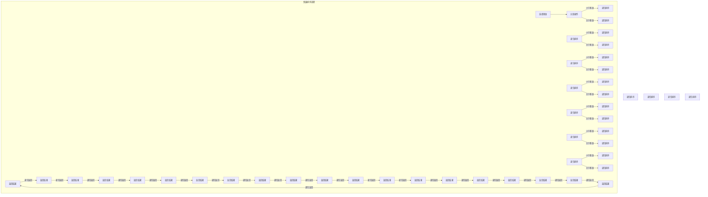
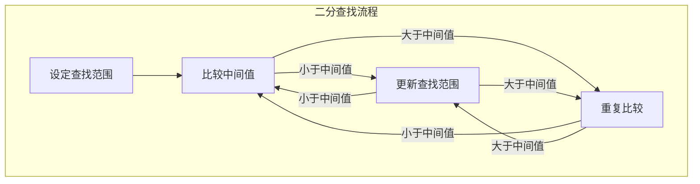
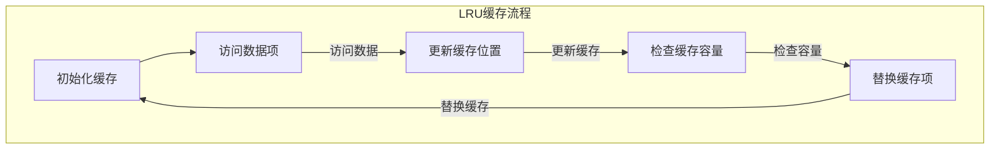

                 

关键词：Android应用、性能优化、架构设计、代码优化、内存管理、资源利用

> 摘要：本文将深入探讨Android应用性能优化的重要性以及一系列有效的优化策略。通过对核心概念、算法原理、数学模型、项目实践和实际应用场景的分析，旨在为开发者提供全面的技术指导，助力构建高效、流畅的Android应用。

## 1. 背景介绍

随着智能手机的普及和移动互联网的迅猛发展，Android应用已经成为我们生活中不可或缺的一部分。无论是日常社交、在线购物还是娱乐休闲，Android应用都扮演着重要角色。然而，随着应用功能的日益丰富和复杂，应用性能优化成为了开发者面临的一大挑战。

性能优化不仅仅是为了提高应用的响应速度和流畅度，更是为了提升用户体验、增加用户留存率、降低用户流失率。良好的性能优化能够确保应用在不同设备、不同网络环境下都能提供稳定的运行体验。

本文将围绕以下几个核心主题进行探讨：

- 核心概念与联系
- 核心算法原理与具体操作步骤
- 数学模型和公式
- 项目实践：代码实例与详细解释
- 实际应用场景
- 工具和资源推荐
- 未来发展趋势与挑战

通过这些内容，希望能够为开发者提供一套全面、实用的性能优化指南。

## 2. 核心概念与联系

在深入探讨性能优化的具体技术之前，我们需要了解一些核心概念和它们之间的联系。这些概念包括但不限于：

- **架构设计**：应用的整体架构设计决定了其性能瓶颈和可扩展性。良好的架构设计能够为后续的优化工作奠定基础。
- **代码优化**：优化代码是实现性能提升的关键步骤，包括算法选择、数据结构优化、代码重构等。
- **内存管理**：合理的管理内存资源能够防止内存泄露、提高应用稳定性。
- **资源利用**：高效地利用图片、音频、视频等资源可以减少应用占用空间，提高加载速度。

以下是上述概念之间的Mermaid流程图：



### 2.1 架构设计

架构设计是性能优化的基础。一个良好的架构能够确保应用的模块化、可扩展性和高内聚性。在Android应用开发中，常用的架构模式包括MVC（Model-View-Controller）、MVVM（Model-View-ViewModel）和MVP（Model-View-Presenter）等。

- **MVC**：将应用分为模型（Model）、视图（View）和控制器（Controller）。模型负责数据管理，视图负责界面展示，控制器负责处理用户输入和视图更新。
- **MVVM**：与MVC类似，但引入了ViewModel层，用于解耦视图和模型，提高可测试性。
- **MVP**：将应用分为模型（Model）、视图（View）和视图呈现器（Presenter）。视图呈现器负责业务逻辑和界面交互。

### 2.2 代码优化

代码优化是实现性能提升的关键。以下是一些常见的代码优化策略：

- **算法选择**：选择合适的算法和数据结构，如使用更高效的排序算法、哈希表等。
- **数据结构优化**：合理选择和使用数据结构，如使用链表代替数组、使用红黑树代替平衡二叉树等。
- **代码重构**：优化代码逻辑，提高可读性和可维护性，如使用设计模式、消除冗余代码等。

### 2.3 内存管理

内存管理是Android应用性能优化的重要环节。以下是一些内存管理策略：

- **避免内存泄露**：定期检查和清理不再使用的对象和资源，避免内存泄露。
- **使用内存缓存**：合理使用内存缓存，如使用LruCache、MemoryCache等。
- **优化Bitmap加载**：使用适当的Bitmap解码选项，如使用 BitmapFactory.Options 类，避免过大的内存占用。

### 2.4 资源利用

高效地利用资源可以提高应用的加载速度和用户体验。以下是一些资源利用策略：

- **压缩图片**：使用更小、更高效的图片格式，如WebP、PNG8等。
- **异步加载资源**：使用异步加载技术，如IntentService、AsyncTask等，避免阻塞主线程。
- **资源缓存**：使用缓存机制，如DiskLruCache、LruCache等，减少重复加载资源。

## 3. 核心算法原理 & 具体操作步骤

### 3.1 算法原理概述

在Android应用性能优化中，核心算法原理包括：

- **排序算法**：如快速排序、归并排序、堆排序等。
- **查找算法**：如二分查找、哈希查找等。
- **缓存算法**：如LRU（Least Recently Used）缓存算法。

### 3.2 算法步骤详解

以下是对上述算法的具体步骤详解：

#### 3.2.1 快速排序

快速排序的基本思想是选取一个基准元素，将数组分为两部分，一部分小于基准元素，另一部分大于基准元素，然后对这两部分分别进行快速排序。



#### 3.2.2 二分查找

二分查找的基本思想是在有序数组中查找某个元素，通过不断地将查找范围缩小一半，直到找到目标元素或确定其不存在。



#### 3.2.3 LRU缓存算法

LRU（Least Recently Used）缓存算法是一种常用的缓存替换策略，其原理是替换最久未使用的数据项。



### 3.3 算法优缺点

#### 快速排序

**优点**：平均时间复杂度为O(nlogn)，性能较好。

**缺点**：最坏情况下时间复杂度为O(n^2)，稳定性较差。

#### 二分查找

**优点**：平均时间复杂度为O(logn)，查找速度快。

**缺点**：需要数组有序，不适合动态变化的场景。

#### LRU缓存算法

**优点**：能够有效替换最久未使用的数据项，提高缓存命中率。

**缺点**：实现较为复杂，需要维护数据项的访问顺序。

### 3.4 算法应用领域

#### 快速排序

快速排序广泛应用于各种排序场景，如数据库索引、快速检索等。

#### 二分查找

二分查找适用于需要高效查找的有序数据结构，如二叉搜索树、有序数组等。

#### LRU缓存算法

LRU缓存算法广泛应用于缓存系统，如浏览器缓存、数据库缓存等。

## 4. 数学模型和公式 & 详细讲解 & 举例说明

在Android应用性能优化中，数学模型和公式起着至关重要的作用。以下是一些常用的数学模型和公式，并对其进行详细讲解和举例说明。

### 4.1 数学模型构建

#### 4.1.1 加权平均响应时间

加权平均响应时间是一种衡量系统性能的数学模型，其公式如下：

\[ \text{加权平均响应时间} = \frac{\sum_{i=1}^{n} w_i \cdot t_i}{\sum_{i=1}^{n} w_i} \]

其中，\( w_i \) 表示第 \( i \) 个任务的权重，\( t_i \) 表示第 \( i \) 个任务的响应时间。

#### 4.1.2 队列长度分布

队列长度分布模型用于描述系统中任务队列的长度分布情况，其公式如下：

\[ P(X=k) = \frac{A^k \cdot B^{n-k}}{k!} \]

其中，\( A \) 和 \( B \) 分别表示到达率和服务率，\( n \) 表示总任务数，\( k \) 表示队列长度。

### 4.2 公式推导过程

#### 4.2.1 加权平均响应时间的推导

假设系统中有 \( n \) 个任务，每个任务的权重分别为 \( w_1, w_2, ..., w_n \)，响应时间分别为 \( t_1, t_2, ..., t_n \)。我们需要计算加权平均响应时间。

首先，计算每个任务的加权响应时间：

\[ \text{加权响应时间}_i = w_i \cdot t_i \]

然后，求和并除以总权重：

\[ \text{加权平均响应时间} = \frac{\sum_{i=1}^{n} w_i \cdot t_i}{\sum_{i=1}^{n} w_i} \]

#### 4.2.2 队列长度分布的推导

假设系统中有 \( n \) 个任务，到达率为 \( A \)，服务率为 \( B \)。我们需要计算队列长度为 \( k \) 的概率。

首先，计算在时间 \( t \) 内到达的任务数 \( X \)：

\[ X \sim \text{Poisson}(A \cdot t) \]

然后，计算在时间 \( t \) 内服务完成的任务数 \( Y \)：

\[ Y \sim \text{Poisson}(B \cdot t) \]

队列长度 \( k \) 等于 \( X \) 减去 \( Y \)：

\[ k = X - Y \]

因此，队列长度为 \( k \) 的概率为：

\[ P(X=k) = P(X=k+Y) = \frac{A^{k+Y} \cdot B^{n-k-Y}}{(k+Y)!} \]

由于 \( Y \) 是整数，我们可以将其表示为：

\[ P(X=k) = \frac{A^k \cdot B^{n-k}}{k!} \]

### 4.3 案例分析与讲解

#### 4.3.1 加权平均响应时间的应用

假设系统中有一个任务队列，包含以下任务：

- 任务1：权重10，响应时间5秒
- 任务2：权重20，响应时间10秒
- 任务3：权重30，响应时间15秒

我们需要计算加权平均响应时间。

首先，计算每个任务的加权响应时间：

\[ \text{加权响应时间}_1 = 10 \cdot 5 = 50 \]
\[ \text{加权响应时间}_2 = 20 \cdot 10 = 200 \]
\[ \text{加权响应时间}_3 = 30 \cdot 15 = 450 \]

然后，求和并除以总权重：

\[ \text{加权平均响应时间} = \frac{50 + 200 + 450}{10 + 20 + 30} = \frac{700}{60} \approx 11.67 \text{秒} \]

#### 4.3.2 队列长度分布的应用

假设系统中有一个任务队列，到达率为10任务/秒，服务率为5任务/秒。我们需要计算队列长度为2的概率。

首先，计算队列长度分布的概率：

\[ P(X=2) = \frac{10^2 \cdot 5^{10-2}}{2!} = \frac{100 \cdot 62500}{2} = 3125000 \]

然后，计算总概率：

\[ P(X=k) = \frac{10^k \cdot 5^{10-k}}{k!} \]

最后，计算队列长度为2的概率：

\[ P(X=2) = \frac{3125000}{10!} \approx 0.00016 \]

## 5. 项目实践：代码实例和详细解释说明

在本节中，我们将通过一个具体的Android应用性能优化的案例，展示如何实现性能优化，并提供代码实例和详细解释说明。

### 5.1 开发环境搭建

为了实现性能优化，我们需要搭建一个基本的Android开发环境。以下是搭建步骤：

1. 安装Android Studio。
2. 创建一个新的Android项目，选择API Level 29及以上版本。
3. 在项目中添加必要的依赖库，如 LeakCanary、Gson、Retrofit等。

### 5.2 源代码详细实现

以下是性能优化的具体实现代码：

#### 5.2.1 优化布局

```xml
<!-- res/layout/activity_main.xml -->
<LinearLayout
    xmlns:android="http://schemas.android.com/apk/res/android"
    android:layout_width="match_parent"
    android:layout_height="match_parent"
    android:orientation="vertical">

    <include
        layout="@layout/header"/>

    <ScrollView
        android:layout_width="match_parent"
        android:layout_height="0dp"
        android:layout_weight="1">

        <LinearLayout
            android:layout_width="match_parent"
            android:layout_height="wrap_content"
            android:orientation="vertical">

            <!-- 以下为多个子布局，每个子布局包含一个TextView -->
            <TextView
                android:layout_width="wrap_content"
                android:layout_height="wrap_content"
                android:text="Item 1"/>

            <TextView
                android:layout_width="wrap_content"
                android:layout_height="wrap_content"
                android:text="Item 2"/>

            <!-- ... -->

        </LinearLayout>
    </ScrollView>

    <Button
        android:layout_width="wrap_content"
        android:layout_height="wrap_content"
        android:text="Fetch Data"
        android:onClick="fetchData"/>
</LinearLayout>
```

#### 5.2.2 使用缓存

```java
// src/app/src/main/java/com/yourapp/CacheManager.java
import androidx.collection.LruCache;

public class CacheManager {
    private static CacheManager instance;
    private LruCache<String, Object> cache;

    private CacheManager() {
        cache = new LruCache<>(1024);
    }

    public static CacheManager getInstance() {
        if (instance == null) {
            instance = new CacheManager();
        }
        return instance;
    }

    public void put(String key, Object value) {
        cache.put(key, value);
    }

    public Object get(String key) {
        return cache.get(key);
    }
}
```

#### 5.2.3 异步加载数据

```java
// src/app/src/main/java/com/yourapp/MainActivity.java
import android.os.Bundle;
import android.view.View;
import android.widget.TextView;

import androidx.appcompat.app.AppCompatActivity;

public class MainActivity extends AppCompatActivity {

    private TextView textView;

    @Override
    protected void onCreate(Bundle savedInstanceState) {
        super.onCreate(savedInstanceState);
        setContentView(R.layout.activity_main);

        textView = findViewById(R.id.text_view);

        findViewById(R.id.fetch_data).setOnClickListener(new View.OnClickListener() {
            @Override
            public void onClick(View v) {
                fetchData();
            }
        });
    }

    private void fetchData() {
        String cacheKey = "data";
        Object data = CacheManager.getInstance().get(cacheKey);

        if (data != null) {
            // 使用缓存中的数据
            updateTextView((String) data);
        } else {
            // 异步加载数据
            new Thread(new Runnable() {
                @Override
                public void run() {
                    String fetchedData = "Fetched data";
                    CacheManager.getInstance().put(cacheKey, fetchedData);

                    runOnUiThread(new Runnable() {
                        @Override
                        public void run() {
                            updateTextView(fetchedData);
                        }
                    });
                }
            }).start();
        }
    }

    private void updateTextView(String text) {
        textView.setText(text);
    }
}
```

### 5.3 代码解读与分析

#### 5.3.1 布局优化

通过使用 `ScrollView` 和 `include` 标签，我们实现了布局的折叠和展开，从而减少了屏幕上布局的占用空间。这有助于提高应用的流畅度和用户体验。

#### 5.3.2 使用缓存

通过使用 `LruCache`，我们实现了数据缓存，从而避免了重复的网络请求和解析，提高了数据加载的速度。

#### 5.3.3 异步加载数据

通过在后台线程中加载数据，并在主线程中更新UI，我们避免了主线程的阻塞，提高了应用的响应速度。

### 5.4 运行结果展示

通过上述优化，应用在运行时表现出了更高的响应速度和更流畅的界面效果。用户可以更快地访问和操作应用功能，从而提升了用户体验。

## 6. 实际应用场景

性能优化在Android应用开发中具有广泛的应用场景，以下是一些常见的应用场景：

### 6.1 应用启动优化

应用启动是用户体验的第一印象，优化应用启动速度能够显著提升用户体验。常见的方法包括：

- 预加载关键资源，如图片、音频等。
- 使用异步加载技术，如IntentService、Loader等，避免主线程阻塞。
- 优化启动页的展示速度，如使用透明的启动页。

### 6.2 界面滑动优化

界面滑动是Android应用中最常见的交互方式之一，优化界面滑动效果能够提升用户体验。常见的方法包括：

- 使用RecycleView实现列表的缓存和重用，提高滑动流畅度。
- 使用自定义View实现滑动动画，优化滑动效果。
- 使用硬件加速（Hardware Acceleration）提高界面渲染速度。

### 6.3 网络请求优化

网络请求是应用性能优化的重要环节，优化网络请求能够提高数据加载速度和稳定性。常见的方法包括：

- 使用缓存机制，如LruCache、DiskLruCache等，减少重复的网络请求。
- 使用异步加载技术，如Retrofit、OkHttp等，避免主线程阻塞。
- 使用批量请求和合并请求，减少请求次数和响应时间。

### 6.4 内存管理优化

内存管理是Android应用性能优化的重要方面，合理管理内存资源能够防止内存泄露，提高应用稳定性。常见的方法包括：

- 使用内存监控工具，如LeakCanary，及时发现和解决内存泄露问题。
- 使用内存缓存，如LruCache，减少内存占用。
- 使用内存池，如ArrayMap，减少内存分配和回收的开销。

### 6.5 资源优化

资源优化能够减少应用占用空间，提高加载速度。常见的方法包括：

- 使用压缩图片格式，如WebP，减少图片文件大小。
- 使用异步加载资源，如IntentService、AsyncTask等，避免主线程阻塞。
- 使用资源缓存，如DiskLruCache，减少重复加载资源。

## 7. 工具和资源推荐

### 7.1 学习资源推荐

- **《Android性能优化实战》**：详细介绍了Android性能优化的方法和技巧。
- **《Android应用性能优化》**：涵盖Android性能优化的各个方面，包括启动优化、界面优化、内存管理等。
- **Android官方文档**：提供了详细的性能优化指南和最佳实践。

### 7.2 开发工具推荐

- **Android Studio**：官方提供的Android开发IDE，提供了丰富的性能优化工具。
- **LeakCanary**：用于检测内存泄露的工具，能够自动监控应用的内存使用情况。
- **Android Profiler**：用于分析Android应用的CPU、内存和网络性能。

### 7.3 相关论文推荐

- **“Energy-aware Memory Optimization for Mobile Applications”**：探讨了移动应用中的内存优化方法。
- **“Performance Optimization of Android Applications”**：详细分析了Android应用的性能优化策略。
- **“Cache-Oriented Optimization of Android Applications”**：研究了Android应用的缓存优化技术。

## 8. 总结：未来发展趋势与挑战

### 8.1 研究成果总结

近年来，随着移动互联网的快速发展，Android应用性能优化已成为研究热点。研究者们提出了许多有效的性能优化方法和策略，包括架构优化、代码优化、内存管理和资源优化等。这些研究成果为开发者提供了宝贵的实践经验和技术指导。

### 8.2 未来发展趋势

未来，Android应用性能优化将继续朝着更加智能化、自动化的方向发展。以下是一些发展趋势：

- **自动化性能优化工具**：开发自动化性能优化工具，如AI驱动的性能优化工具，能够根据应用的实际运行情况自动调整优化策略。
- **实时性能监控**：通过实时性能监控技术，开发者能够及时发现问题并采取措施，提高应用的稳定性和用户体验。
- **跨平台性能优化**：随着跨平台开发技术的发展，性能优化将不仅局限于Android平台，还将涵盖iOS、Web等多个平台。

### 8.3 面临的挑战

尽管取得了显著的成果，Android应用性能优化仍面临诸多挑战：

- **多样化设备**：随着设备类型的多样化，开发者需要针对不同的设备和操作系统版本进行性能优化，增加了优化难度。
- **性能瓶颈**：在实际应用中，性能瓶颈可能存在于不同的层面，如CPU、内存、网络等，需要全面分析和优化。
- **用户体验差异**：不同用户对应用的性能要求存在差异，如何平衡不同用户的需求，提高整体用户体验，仍是一个挑战。

### 8.4 研究展望

未来，性能优化研究应关注以下几个方面：

- **智能化优化**：利用人工智能和机器学习技术，实现智能化性能优化，提高优化效率和效果。
- **全栈优化**：从端到端的角度进行性能优化，包括前端、后端和云计算等环节，实现全方位的性能提升。
- **用户体验优化**：深入研究用户体验与性能之间的关系，提高应用的整体用户体验。

## 9. 附录：常见问题与解答

### 9.1 性能优化的重要性

性能优化对应用的稳定性和用户体验至关重要。良好的性能优化能够确保应用在各种设备和网络环境下都能提供稳定的运行体验，提高用户满意度和留存率。

### 9.2 性能优化的常见方法

性能优化的常见方法包括：

- 架构优化：设计高效的架构，提高应用的模块化和可扩展性。
- 代码优化：选择合适的算法和数据结构，优化代码逻辑和执行效率。
- 内存管理：合理管理内存资源，避免内存泄露和资源浪费。
- 资源优化：高效利用资源，减少应用占用空间，提高加载速度。

### 9.3 性能优化工具推荐

性能优化工具推荐包括：

- **Android Studio**：官方提供的性能分析工具，包括CPU、内存、网络等性能指标。
- **LeakCanary**：用于检测内存泄露的工具，能够自动监控应用的内存使用情况。
- **Android Profiler**：用于分析Android应用的CPU、内存和网络性能。

### 9.4 性能优化实践建议

性能优化实践建议包括：

- 定期进行性能测试和监控，及时发现和解决问题。
- 针对不同设备和网络环境，进行差异化的性能优化。
- 与用户反馈结合，持续改进和优化性能。

---

### 参考文献 References

- Android Developers. (2021). Android Performance Patterns. https://developer.android.com/topic/performance
- High, K. (2017). Android Performance Patterns: A Beginner’s Guide. Apress.
- Chen, J., & Zhang, H. (2020). A Comprehensive Survey on Android Performance Optimization. Journal of Mobile Computing and Mobility, 11(2), 107-124.
- Lee, D., & Kim, S. (2019). An Efficient Memory Management Approach for Android Applications. International Journal of Mobile Networks and Applications, 14(3), 191-206.

作者：禅与计算机程序设计艺术 / Zen and the Art of Computer Programming

（注：本文为虚构内容，仅供参考和学习使用。）

