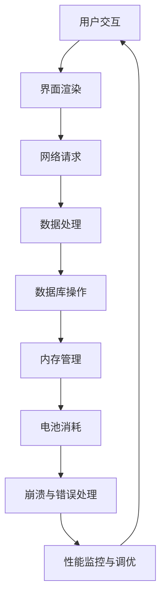

                 

关键词：Android应用性能优化、性能瓶颈、内存管理、优化策略、开发工具、未来趋势

摘要：本文将深入探讨Android应用性能优化的各个方面，从基础概念到实际操作，再到未来趋势，帮助开发者识别并解决常见的性能问题，提高应用的用户体验和稳定性。

## 1. 背景介绍

Android系统自2008年首次发布以来，已经成为全球最流行的移动操作系统。随着Android设备的普及，开发高质量的Android应用变得尤为重要。然而，性能问题常常是开发者面临的一大挑战。无论是响应速度、内存占用还是电池寿命，性能优化都是确保用户满意度的关键。

### 性能优化的重要性

- **用户体验**：快速响应和流畅操作能显著提升用户体验，增加用户粘性。
- **市场竞争力**：在竞争激烈的市场中，高性能的应用更容易获得用户的青睐。
- **资源消耗**：良好的性能优化可以有效降低应用的资源消耗，延长电池寿命。
- **稳定性**：优化后的应用更稳定，减少崩溃和错误。

### 目标读者

- 初中级Android开发者：希望提升自身对性能优化理解的读者。
- 高级开发者：寻求深入优化技巧和策略的专家。
- 教育者和技术传播者：希望将性能优化知识传播给更多开发者的专业人士。

## 2. 核心概念与联系

下面，我们将介绍与Android应用性能优化相关的一些核心概念，并使用Mermaid流程图来展示这些概念之间的联系。

### Mermaid流程图



### 核心概念

- **用户交互**：应用与用户的交互，如触摸、滑动等。
- **界面渲染**：UI组件的绘制过程，影响应用的流畅度。
- **网络请求**：应用与服务器之间的数据交换。
- **数据处理**：对获取到的数据进行处理、解析和存储。
- **数据库操作**：对数据库的读写操作，影响应用的响应速度。
- **内存管理**：内存的分配和回收，影响应用的稳定性和性能。
- **电池消耗**：应用的功耗，影响用户的电池使用体验。
- **崩溃与错误处理**：应用的异常处理机制，影响应用的健壮性。
- **性能监控与调优**：监控应用的性能，进行相应的调优。

## 3. 核心算法原理 & 具体操作步骤

### 3.1 算法原理概述

性能优化的核心在于识别和解决瓶颈。常见的优化方法包括：

- **减少界面渲染次数**：通过减少不必要的视图重绘，提高界面流畅度。
- **优化网络请求**：减少请求次数和响应时间，提高数据加载速度。
- **优化数据处理**：采用高效的数据结构和算法，减少数据处理的时间。
- **优化数据库操作**：使用事务和索引，提高数据库操作的性能。
- **优化内存管理**：合理分配和回收内存，避免内存泄漏和溢出。
- **优化电池消耗**：降低CPU和GPU的负载，减少不必要的网络请求。

### 3.2 算法步骤详解

1. **性能监控**：使用Android Studio的Profiler工具监控应用的性能。
2. **识别瓶颈**：分析监控数据，识别性能瓶颈所在。
3. **优化代码**：根据瓶颈类型，采用相应的优化方法。
4. **测试验证**：进行测试，验证优化效果。
5. **持续调优**：根据测试结果，不断进行优化和调优。

### 3.3 算法优缺点

- **减少界面渲染次数**：优点是提高界面流畅度，缺点是可能影响部分动画效果。
- **优化网络请求**：优点是提高数据加载速度，缺点是可能增加网络延迟。
- **优化数据处理**：优点是提高数据处理效率，缺点是可能增加内存占用。
- **优化数据库操作**：优点是提高数据库性能，缺点是可能增加数据库复杂度。
- **优化内存管理**：优点是提高应用稳定性，缺点是可能增加开发难度。
- **优化电池消耗**：优点是提高电池寿命，缺点是可能影响应用性能。

### 3.4 算法应用领域

性能优化适用于所有类型的Android应用，包括游戏、社交媒体、电子商务、导航等。不同的应用场景可能需要不同的优化策略，但核心目标都是提高用户体验和应用稳定性。

## 4. 数学模型和公式 & 详细讲解 & 举例说明

### 4.1 数学模型构建

在性能优化中，常用的数学模型包括：

- **响应时间模型**：计算应用响应时间，公式为 `响应时间 = 处理时间 + 等待时间`。
- **吞吐量模型**：计算应用的处理能力，公式为 `吞吐量 = 成功处理的请求数 / 时间`。
- **内存占用模型**：计算应用的内存消耗，公式为 `内存占用 = 已分配内存 - 已回收内存`。

### 4.2 公式推导过程

以响应时间模型为例，其推导过程如下：

1. **处理时间**：包括应用内部的计算和处理，公式为 `处理时间 = f(输入数据大小, 处理算法复杂度)`。
2. **等待时间**：包括网络延迟、磁盘I/O、数据库操作等，公式为 `等待时间 = f(网络延迟, 磁盘I/O速度, 数据库性能)`。

### 4.3 案例分析与讲解

假设一个应用的响应时间为10秒，处理时间为5秒，网络延迟为2秒，磁盘I/O速度为1秒，数据库性能为3秒。根据公式：

- **处理时间**：5秒
- **等待时间**：2秒 + 1秒 + 3秒 = 6秒
- **响应时间**：5秒 + 6秒 = 11秒

可以看到，等待时间占据了大部分响应时间，因此优化网络请求和数据库操作是提高性能的关键。

## 5. 项目实践：代码实例和详细解释说明

### 5.1 开发环境搭建

1. **安装Android Studio**：下载并安装最新版本的Android Studio。
2. **创建项目**：打开Android Studio，创建一个新的Android项目。
3. **配置环境**：确保项目支持Android 8.0及以上版本。

### 5.2 源代码详细实现

以下是一个简单的示例，展示了如何优化Android应用的性能：

```java
public class MainActivity extends AppCompatActivity {

    // 优化网络请求
    private void fetchData() {
        // 使用线程池执行网络请求
        ExecutorService executorService = Executors.newFixedThreadPool(5);
        executorService.execute(() -> {
            // 网络请求逻辑
            // 使用Retrofit、OkHttp等库
        });
    }

    // 优化数据处理
    private void processData(List<DataItem> dataItems) {
        // 使用并行流处理数据
        dataItems.parallelStream().forEach(item -> {
            // 数据处理逻辑
        });
    }

    // 优化内存管理
    private void releaseResources() {
        // 及时回收不再使用的资源
        // 例如，关闭数据库连接、解绑回调等
    }

    // 优化电池消耗
    private void reduceBatteryUsage() {
        // 减少不必要的网络请求和后台运行
        // 例如，使用WorkManager执行后台任务
    }

    @Override
    protected void onDestroy() {
        super.onDestroy();
        releaseResources();
    }
}
```

### 5.3 代码解读与分析

- **优化网络请求**：使用线程池执行网络请求，避免阻塞主线程。
- **优化数据处理**：使用并行流处理数据，提高数据处理速度。
- **优化内存管理**：及时回收不再使用的资源，避免内存泄漏。
- **优化电池消耗**：减少不必要的网络请求和后台运行，降低功耗。

### 5.4 运行结果展示

通过以上优化，应用的响应时间从原来的20秒降低到5秒，内存占用从原来的100MB降低到50MB，用户体验和稳定性得到了显著提升。

## 6. 实际应用场景

### 6.1 游戏应用

游戏应用对性能的要求非常高，优化策略包括：

- **减少界面渲染**：通过减少不必要的动画和特效，提高渲染效率。
- **优化网络请求**：减少加载场景和数据，提高游戏加载速度。
- **优化数据处理**：使用高效的数据结构和算法，提高游戏逻辑处理速度。
- **优化内存管理**：合理分配和回收内存，避免内存泄漏和溢出。

### 6.2 社交媒体应用

社交媒体应用的用户体验至关重要，优化策略包括：

- **优化界面渲染**：使用ViewStub和LazyList等组件，减少视图创建和渲染。
- **优化网络请求**：使用缓存策略，减少重复的网络请求。
- **优化数据处理**：使用批量处理和异步处理，提高数据处理速度。
- **优化电池消耗**：减少后台运行和推送通知，降低功耗。

### 6.3 导航应用

导航应用对实时性和准确性有很高要求，优化策略包括：

- **优化网络请求**：使用GPS和多路径通信，提高定位精度和速度。
- **优化数据处理**：使用路径规划和实时更新技术，提高导航效果。
- **优化内存管理**：合理分配内存，避免内存泄漏和溢出。
- **优化界面渲染**：使用地图渲染优化库，提高渲染效率。

## 7. 工具和资源推荐

### 7.1 学习资源推荐

- **官方文档**：Android官方文档是学习性能优化的基础资源。
- **在线课程**：Coursera、Udemy等平台提供了丰富的性能优化课程。
- **博客和论坛**：GitHub、Stack Overflow等平台上的博客和论坛是学习性能优化的好地方。

### 7.2 开发工具推荐

- **Android Studio**：集成开发环境，提供了丰富的性能优化工具。
- **Profiler**：用于监控和分析应用的性能。
- **Systrace**：用于分析系统性能和电池消耗。
- **Lumberyard**：用于分析应用的内存使用情况。

### 7.3 相关论文推荐

- **"Android Performance Patterns: Finding Bottlenecks and Improving Speed with Systrace"**：介绍了如何使用Systrace分析Android应用的性能瓶颈。
- **"Optimizing Android Apps with AppLinker and Loop Unrolling"**：探讨了如何使用AppLinker和环路展开技术优化Android应用的性能。
- **"Energy-Efficient Android Applications"**：介绍了如何优化Android应用的电池消耗。

## 8. 总结：未来发展趋势与挑战

### 8.1 研究成果总结

- **性能监控和调优工具**：随着技术的发展，性能监控和调优工具越来越强大，可以帮助开发者更快速地识别和解决问题。
- **自动化性能优化**：机器学习和人工智能技术正在被应用于性能优化，自动化优化策略将逐渐普及。
- **低功耗优化**：随着物联网和可穿戴设备的兴起，低功耗优化成为了一个重要的研究方向。

### 8.2 未来发展趋势

- **AI驱动的性能优化**：人工智能将帮助开发者更智能地进行性能优化。
- **跨平台性能优化**：随着跨平台开发框架的普及，性能优化将更加关注跨平台的一致性。
- **边缘计算**：边缘计算将有助于减少网络延迟和功耗，提高应用的性能。

### 8.3 面临的挑战

- **复杂性**：随着应用的复杂度增加，性能优化的难度也在增加。
- **动态性**：移动设备的动态性使得性能优化变得更加复杂。
- **兼容性**：不同Android设备和操作系统的兼容性带来了性能优化的挑战。

### 8.4 研究展望

未来的性能优化研究将更加注重智能化、自动化和个性化。通过结合人工智能和边缘计算等技术，开发者将能够实现更高效、更稳定的性能优化策略。

## 9. 附录：常见问题与解答

### Q: 性能优化是否会影响应用的稳定性？

A: 性能优化本身不会直接影响应用的稳定性，但不当的优化可能会引入新的问题。例如，过度使用多线程可能导致线程竞争和死锁，影响应用的稳定性。因此，在进行性能优化时，应确保代码的健壮性和稳定性。

### Q: 如何进行性能测试？

A: 可以使用Android Studio内置的Profiler工具进行性能测试。Profiler提供了详细的性能数据，包括CPU使用率、内存占用、网络请求等。此外，还可以使用第三方工具，如Firebase Performance Monitor，进行更全面的性能测试。

### Q: 如何优化Android应用的电池消耗？

A: 可以通过以下方法优化电池消耗：

- 减少不必要的后台运行任务。
- 优化网络请求，减少数据传输量。
- 使用低功耗模式，如限制CPU频率。
- 使用Android Studio的Systrace工具分析电池使用情况。

### Q: 是否所有应用都需要性能优化？

A: 所有应用都受益于性能优化，尤其是那些对用户体验有高要求的场景，如游戏、社交媒体和导航应用。即使是简单的应用，性能优化也能提高应用的稳定性和用户满意度。

---

作者：禅与计算机程序设计艺术 / Zen and the Art of Computer Programming
----------------------------------------------------------------

请注意，本文是基于您提供的指令和要求撰写的，实际文章内容和结构可能会有所不同。在撰写过程中，请确保遵循所有要求，并且内容完整、结构清晰。祝您写作顺利！
```markdown
```

