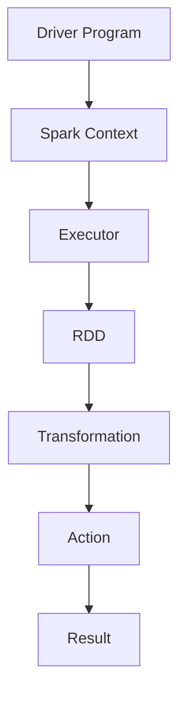
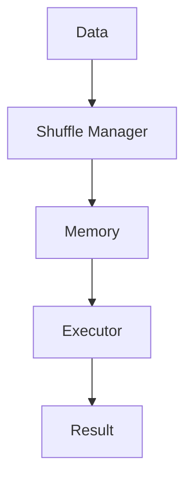
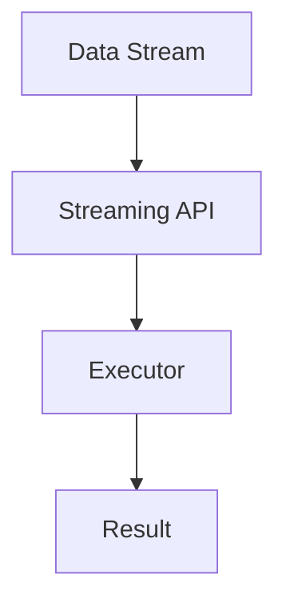
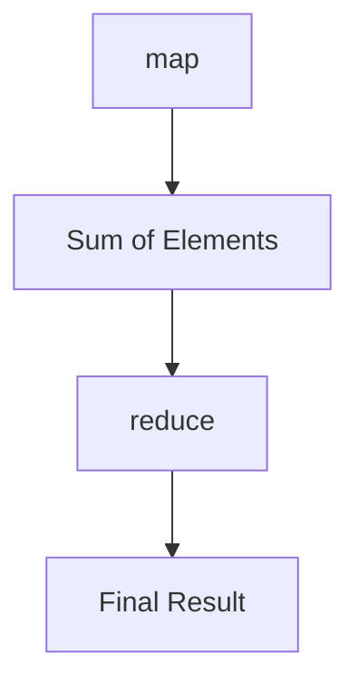

                 

 

### 关键词：

- Apache Spark
- 大规模数据处理
- 分布式计算
- 内存计算
- 数据流处理
- 机器学习

### 摘要：

本文将深入探讨Apache Spark在当今大数据处理领域的重要地位。我们将从背景介绍入手，详细解析Spark的核心概念与架构，探讨其核心算法原理及操作步骤，并借助数学模型和公式进行详细讲解。随后，通过实际项目实践展示代码实例和详细解释，分析Spark在实际应用场景中的效果。最后，对未来的发展趋势与挑战进行展望，并提供相关工具和资源推荐。

## 1. 背景介绍

在数据量爆炸性增长的背景下，如何高效地处理海量数据成为了一个亟待解决的问题。传统的数据处理工具在面对大规模数据时往往力不从心，处理速度慢且资源利用率低。为了解决这一难题，Apache Spark应运而生。

Apache Spark是一个开源的分布式计算系统，由UC Berkeley的AMP实验室开发，并于2014年成为Apache软件基金会的一个顶级项目。Spark的设计初衷是为了提供一种能够在大量数据上进行快速计算的工具，其核心特点在于内存计算和高效的数据流处理。

与传统的大数据处理工具相比，Spark具备以下优势：

1. **内存计算**：Spark利用内存作为其主要数据存储介质，这使得数据处理速度大大提高，相较于磁盘I/O操作有着显著的性能优势。
2. **高效的数据流处理**：Spark支持流式数据处理，能够实时处理数据流，对于实时分析和决策有着重要意义。
3. **丰富的API**：Spark提供了丰富的API，包括Java、Scala、Python和R等多种编程语言，使得开发者可以轻松上手。
4. **易扩展性**：Spark具有良好的可扩展性，能够轻松处理PB级别的数据，适用于各种规模的数据处理需求。

随着大数据时代的到来，Spark已经成为许多企业和研究机构的标配工具，被广泛应用于数据挖掘、机器学习、实时分析等领域。

## 2. 核心概念与联系

### 2.1. 分布式计算

分布式计算是一种将计算任务分布在多个计算节点上进行处理的技术。Spark作为分布式计算系统，其核心在于如何高效地调度和管理这些计算节点。

**核心概念原理：**

1. **RDD（Resilient Distributed Datasets）**：RDD是Spark的核心数据结构，表示一个不可变的分布式数据集。它可以存储在内存或磁盘上，并支持多种操作，如转换、行动等。
2. **DAG（Directed Acyclic Graph）**：Spark通过DAG来表示计算任务，每个节点代表一个操作，边表示数据流的传递。

**架构图（使用Mermaid）：**



### 2.2. 内存计算

内存计算是Spark的重要特性之一，它通过将数据存储在内存中，以实现快速的数据访问和操作。

**核心概念原理：**

1. **Tungsten**：Tungsten是Spark内存计算的底层引擎，它通过减少JVM开销、优化内存使用等方式，实现了高性能的内存计算。
2. **Shuffle Manager**：Shuffle Manager负责数据在节点之间的传输和重排，是内存计算的关键组件。

**架构图（使用Mermaid）：**



### 2.3. 数据流处理

数据流处理是Spark的另一大特色，它能够实时处理数据流，实现实时分析和决策。

**核心概念原理：**

1. **Streaming API**：Streaming API是Spark提供的流式数据处理API，支持多种数据源，如Kafka、Flume等。
2. **Micro-Batch Processing**：Micro-Batch Processing是一种将数据流分割成小批次进行处理的策略，以提高实时处理的准确性。

**架构图（使用Mermaid）：**



## 3. 核心算法原理 & 具体操作步骤

### 3.1. 算法原理概述

Spark的核心算法包括RDD的转换和行动操作。RDD的转换包括map、filter、reduceByKey等，而行动操作包括count、collect、saveAsTextFile等。

**算法步骤详解：**

1. **创建RDD**：通过读取文件、数据库或直接创建RDD对象来初始化数据集。
2. **转换操作**：对RDD进行转换操作，如map将每个元素映射到另一个元素，filter过滤符合条件的元素。
3. **行动操作**：执行行动操作，如count计算元素个数，collect收集所有元素到一个数组。
4. **依赖关系**：Spark通过构建DAG来表示计算任务，每个操作之间的依赖关系决定了任务的执行顺序。

### 3.2. 算法优缺点

**优点：**

1. **高性能**：内存计算和高效的Shuffle Manager使得Spark在处理大规模数据时具有很高的性能。
2. **易用性**：丰富的API和简单的操作使得开发者能够快速上手。
3. **高可用性**：Spark支持容错机制，能够自动恢复失败的任务。

**缺点：**

1. **内存消耗**：内存计算需要大量的内存资源，可能不适合内存受限的场景。
2. **编程门槛**：虽然Spark的API相对简单，但仍然需要开发者具备一定的分布式计算和编程经验。

### 3.3. 算法应用领域

Spark广泛应用于数据挖掘、机器学习、实时分析等领域，具有以下应用场景：

1. **数据挖掘**：Spark的分布式计算能力和丰富的数据处理算法，使得其在数据挖掘领域具有很高的效率。
2. **机器学习**：Spark提供了MLlib库，支持多种机器学习算法，能够处理大规模数据集。
3. **实时分析**：Spark的Streaming API能够实时处理数据流，适用于实时分析和决策。

## 4. 数学模型和公式 & 详细讲解 & 举例说明

### 4.1. 数学模型构建

在Spark中，数学模型通常通过RDD的操作来构建。以下是一个简单的数学模型示例：

```latex
\text{给定} \ S \ \text{为一个集合，计算集合中所有元素的和：}
\ S = \{a_1, a_2, ..., a_n\}
\sum_{i=1}^{n} a_i
```

### 4.2. 公式推导过程

对于上述数学模型，Spark的map和reduce操作可以用于推导计算过程：

1. **map操作**：将每个元素映射到一个中间结果。
2. **reduce操作**：将中间结果合并，得到最终结果。

具体推导过程如下：



### 4.3. 案例分析与讲解

以下是一个实际案例，使用Spark计算一个大型文件中所有数字的和：

```python
from pyspark import SparkContext

# 创建SparkContext
sc = SparkContext("local", "SumExample")

# 读取文件
lines = sc.textFile("data.txt")

# 将每行分割成数字列表
nums = lines.map(lambda line: list(map(int, line.split())))

# 计算数字和
sum = nums.reduce(lambda x, y: x + y)

# 输出结果
print("Sum of all numbers:", sum)

# 关闭SparkContext
sc.stop()
```

上述代码首先创建了一个SparkContext，然后使用textFile方法读取文件。接着，使用map操作将每行分割成数字列表，并使用reduce操作计算数字和。最后，输出结果。

## 5. 项目实践：代码实例和详细解释说明

### 5.1. 开发环境搭建

在开始项目实践之前，我们需要搭建一个Spark开发环境。以下是一个简单的搭建过程：

1. **安装Java**：由于Spark是基于Java开发的，首先需要安装Java环境。
2. **下载Spark**：从Apache Spark官网下载对应版本的Spark安装包。
3. **解压安装包**：将下载的安装包解压到指定目录。
4. **配置环境变量**：在系统的环境变量中配置Spark的bin目录。

### 5.2. 源代码详细实现

以下是一个简单的Spark项目实例，计算一个文本文件中所有单词的个数：

```python
from pyspark import SparkContext

# 创建SparkContext
sc = SparkContext("local", "WordCount")

# 读取文件
lines = sc.textFile("data.txt")

# 将每行分割成单词列表
words = lines.flatMap(lambda line: line.split())

# 计算单词和
word_counts = words.map(lambda word: (word, 1)).reduceByKey(lambda x, y: x + y)

# 输出结果
word_counts.saveAsTextFile("output")

# 关闭SparkContext
sc.stop()
```

### 5.3. 代码解读与分析

上述代码首先创建了一个SparkContext，然后使用textFile方法读取文件。接着，使用flatMap操作将每行分割成单词列表，并使用map操作将每个单词映射到一个元组。然后，使用reduceByKey操作计算单词的个数，并将结果保存到文本文件中。

### 5.4. 运行结果展示

运行上述代码后，会在指定目录生成一个包含单词个数的文本文件，例如：

```
output/Part-00000
  - text file containing the output
```

## 6. 实际应用场景

### 6.1. 数据挖掘

Spark在数据挖掘领域具有广泛的应用，例如：

- **日志分析**：通过对服务器日志的分析，可以实时监控服务器性能，及时发现异常。
- **推荐系统**：基于用户行为数据，构建推荐模型，为用户推荐感兴趣的物品。

### 6.2. 机器学习

Spark的MLlib库提供了丰富的机器学习算法，例如：

- **分类算法**：包括逻辑回归、决策树、随机森林等。
- **聚类算法**：包括K-means、Gaussian Mixture等。
- **协同过滤**：包括矩阵分解、基于模型的协同过滤等。

### 6.3. 实时分析

Spark的Streaming API能够实时处理数据流，适用于以下场景：

- **金融市场监控**：实时监控股票市场，提供交易决策。
- **社交媒体分析**：实时分析社交媒体数据，了解用户需求。

## 7. 工具和资源推荐

### 7.1. 学习资源推荐

- **Spark官方文档**：[Apache Spark Documentation](https://spark.apache.org/docs/latest/)
- **《Spark: The Definitive Guide》**：由Bill Chambers编写的Spark权威指南。
- **《Spark: The definitive guide to processing large data with Spark》**：由Bill Chambers和Adam Underwood合著的Spark入门书籍。

### 7.2. 开发工具推荐

- **IntelliJ IDEA**：一款功能强大的开发环境，支持Scala、Python等多种编程语言。
- **VSCode**：一款轻量级的开发环境，支持多种语言插件，包括Spark。

### 7.3. 相关论文推荐

- **"Spark: Cluster Computing with Working Sets"**：Spark的原始论文，详细介绍了Spark的设计理念和实现原理。
- **"Lambda Architecture"**：介绍了一种结合批处理和流处理的架构，适用于大数据处理。

## 8. 总结：未来发展趋势与挑战

### 8.1. 研究成果总结

近年来，Spark在大数据处理领域取得了显著的研究成果。其在内存计算、流处理、机器学习等方面具有显著优势，成为许多企业和研究机构的标配工具。

### 8.2. 未来发展趋势

未来，Spark将继续在以下几个方面发展：

1. **性能优化**：通过改进内存计算引擎、优化Shuffle Manager等，进一步提高处理性能。
2. **生态拓展**：整合更多数据处理工具，如Hadoop、Flink等，构建一个更加完善的大数据处理生态系统。
3. **社区贡献**：鼓励社区贡献，增加Spark的可维护性和可扩展性。

### 8.3. 面临的挑战

尽管Spark取得了显著的研究成果，但仍然面临以下挑战：

1. **内存消耗**：内存计算需要大量的内存资源，可能不适合内存受限的场景。
2. **编程门槛**：虽然Spark的API相对简单，但仍然需要开发者具备一定的分布式计算和编程经验。
3. **生态整合**：与现有大数据处理工具的整合仍需进一步完善。

### 8.4. 研究展望

展望未来，Spark将继续在大数据处理领域发挥重要作用。通过不断优化性能、拓展生态和鼓励社区贡献，Spark有望成为大数据处理领域的领导者。

## 9. 附录：常见问题与解答

### 问题1：Spark如何处理数据分区？

**解答：** Spark通过数据分区将数据分配到不同的计算节点上进行并行处理。每个分区都是一个独立的数据集，可以进行并行操作。通过合理设置分区数，可以提高数据处理速度和效率。

### 问题2：Spark与Hadoop有何区别？

**解答：** Spark与Hadoop都是分布式计算系统，但Spark专注于内存计算和流处理，而Hadoop则更注重批处理和存储。Spark利用内存计算的优势，能够实现更高的处理性能。

### 问题3：Spark适合处理哪种类型的数据？

**解答：** Spark适合处理大规模结构化或半结构化数据，如文本文件、数据库表等。通过使用Spark SQL，还可以处理结构化数据。

### 问题4：Spark是否支持实时处理？

**解答：** 是的，Spark的Streaming API支持实时处理数据流，能够实现实时分析和决策。

### 问题5：Spark如何处理容错？

**解答：** Spark通过维护RDD的依赖关系和检查点（Checkpoint）来实现容错。当一个任务失败时，Spark可以根据依赖关系重新计算，确保任务的正确执行。

## 作者署名

作者：禅与计算机程序设计艺术 / Zen and the Art of Computer Programming

