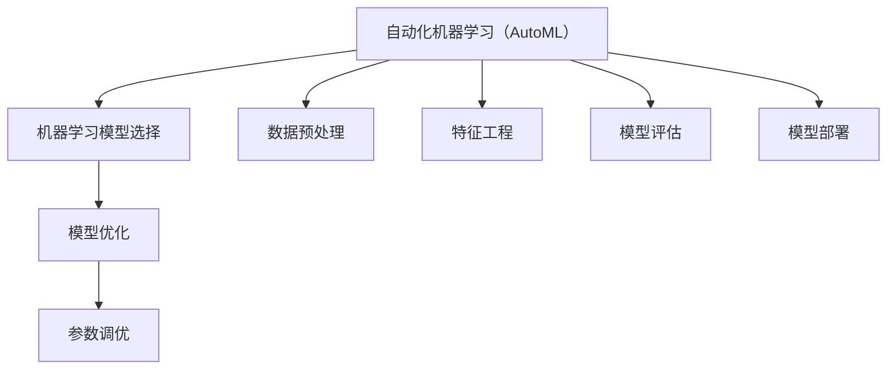

                 

关键词：自动化机器学习（AutoML），模型选择，模型优化，算法原理，数学模型，项目实践，应用场景，未来展望。

## 1. 背景介绍

随着大数据时代的到来，机器学习（Machine Learning，ML）和深度学习（Deep Learning，DL）在各个领域得到了广泛应用。然而，机器学习模型的开发和优化过程通常复杂且耗时，对专业知识和工程实践经验有较高的要求。传统的机器学习流程通常包括数据预处理、特征工程、模型选择、模型训练、评估和部署等步骤。在这些步骤中，模型选择和优化是非常关键的环节，但也是最为复杂和费时的部分。

传统的机器学习模型选择主要依赖于专家经验和试错法，这种方法不仅耗时，而且效率低下。随着机器学习模型的数量和种类不断增加，手动选择模型变得越来越困难。此外，不同的模型在相同的任务上可能表现出不同的性能，选择合适的模型需要进行大量的实验和调参。这不仅增加了开发成本，也限制了机器学习的普及和应用。

为了解决这一问题，自动化机器学习（AutoML）的概念应运而生。AutoML的目标是通过自动化和智能化的方法，简化机器学习模型的选择和优化过程，使得非专业人士也能快速、高效地开发出高性能的机器学习模型。

本文将详细介绍AutoML的概念、原理、核心算法、数学模型、项目实践、应用场景以及未来展望。希望通过本文，读者能够对AutoML有更加深入的理解，并为实际应用提供一些指导。

## 2. 核心概念与联系

### 2.1. 自动化机器学习（AutoML）

自动化机器学习（AutoML）是一种通过自动化方法进行机器学习模型选择、训练和优化的技术。它的核心思想是通过自动化算法来发现和选择最优的机器学习模型，并对其进行参数调优，以达到最佳性能。AutoML的目标是简化机器学习模型的开发过程，降低技术门槛，使得更多的研究人员和开发者能够快速构建和部署高性能的机器学习模型。

### 2.2. 机器学习模型选择

机器学习模型选择是机器学习过程中至关重要的一步。不同的机器学习模型适用于不同的任务和数据集，选择合适的模型对于提高模型性能至关重要。传统的机器学习模型选择通常依赖于专家经验和试错法，而AutoML则通过自动化方法，利用算法和优化技术来选择最优的模型。

### 2.3. 模型优化

模型优化是机器学习过程中的另一个关键步骤。通过调整模型的参数，可以改善模型的性能和泛化能力。传统的模型优化通常需要大量的时间和计算资源，而AutoML通过自动化方法，可以高效地搜索和优化模型的参数，以获得最佳的模型性能。

### 2.4. Mermaid 流程图

以下是一个Mermaid流程图，展示了AutoML的核心概念和联系：



## 3. 核心算法原理 & 具体操作步骤

### 3.1. 算法原理概述

AutoML的核心算法主要包括模型选择算法、模型优化算法和超参数优化算法。以下是对这些算法的简要概述：

- **模型选择算法**：通过搜索算法自动选择适用于特定任务和数据集的最佳机器学习模型。常见的模型选择算法包括贝叶斯优化、贪心算法和遗传算法等。
- **模型优化算法**：在选定的模型基础上，通过优化算法调整模型的参数，以改善模型的性能和泛化能力。常见的模型优化算法包括随机梯度下降、共轭梯度法和L-BFGS等。
- **超参数优化算法**：通过搜索算法自动选择最佳的模型超参数，以获得最佳模型性能。常见的超参数优化算法包括贝叶斯优化、网格搜索和随机搜索等。

### 3.2. 算法步骤详解

AutoML的具体操作步骤如下：

1. **数据预处理**：对原始数据集进行清洗、归一化和特征提取等预处理操作，以得到适合机器学习模型训练的数据集。
2. **模型选择**：利用模型选择算法从预定义的模型库中选择适用于当前任务和数据集的最佳模型。
3. **模型优化**：利用模型优化算法对选定的模型进行参数调整，以改善模型的性能和泛化能力。
4. **超参数优化**：利用超参数优化算法对模型的超参数进行调整，以获得最佳模型性能。
5. **模型评估**：利用交叉验证、学习曲线和测试集等评估指标，评估模型的性能和泛化能力。
6. **模型部署**：将优化后的模型部署到生产环境中，以实现实际应用。

### 3.3. 算法优缺点

- **优点**：
  - **提高效率**：AutoML通过自动化方法简化了机器学习模型的开发过程，提高了开发效率。
  - **降低门槛**：AutoML降低了机器学习模型开发的门槛，使得更多的研究人员和开发者能够轻松地构建和部署高性能的机器学习模型。
  - **优化性能**：AutoML通过自动化的模型选择和优化方法，可以显著提高模型的性能和泛化能力。

- **缺点**：
  - **计算资源消耗**：AutoML需要大量的计算资源和时间来完成模型选择和优化过程，对于资源和时间有限的情况，可能不适用。
  - **模型理解困难**：由于AutoML的模型选择和优化过程高度自动化，模型内部的机制和原理可能变得复杂，对于模型的理解和解释变得困难。

### 3.4. 算法应用领域

AutoML的应用领域非常广泛，包括但不限于以下方面：

- **金融领域**：如股票交易预测、信用评分、风险控制等。
- **医疗领域**：如疾病预测、诊断、个性化治疗等。
- **工业领域**：如故障预测、设备维护、生产优化等。
- **安防领域**：如人脸识别、车辆识别、异常检测等。

## 4. 数学模型和公式 & 详细讲解 & 举例说明

### 4.1. 数学模型构建

在AutoML中，常用的数学模型包括线性模型、非线性模型和深度学习模型等。以下是一个简单的线性模型构建过程：

设训练数据集为 $X=\{x_1, x_2, ..., x_n\}$ 和 $Y=\{y_1, y_2, ..., y_n\}$，其中 $x_i$ 表示第 $i$ 个样本的特征向量，$y_i$ 表示第 $i$ 个样本的标签。线性模型的目标是找到一个线性函数 $f(x)$，使得对于每个输入 $x_i$，都能得到相应的输出 $y_i$。

线性模型的数学模型可以表示为：

$$
f(x) = \theta_0 + \theta_1 x_1 + \theta_2 x_2 + ... + \theta_n x_n
$$

其中，$\theta_0, \theta_1, ..., \theta_n$ 为模型的参数，需要通过训练数据集进行学习。

### 4.2. 公式推导过程

为了找到最优的线性模型参数，我们可以使用最小二乘法（Least Squares Method）。最小二乘法的目标是最小化预测值与实际值之间的误差平方和。

设预测值为 $\hat{y}_i = f(x_i)$，实际值为 $y_i$，则误差平方和为：

$$
J(\theta) = \sum_{i=1}^{n} (\hat{y}_i - y_i)^2
$$

为了最小化 $J(\theta)$，我们对 $J(\theta)$ 进行求导，并令其导数为零：

$$
\frac{\partial J(\theta)}{\partial \theta_j} = -2 \sum_{i=1}^{n} (y_i - \hat{y}_i) x_{ij} = 0
$$

其中，$x_{ij}$ 表示第 $i$ 个样本的第 $j$ 个特征值。解上述方程组，即可得到最优的线性模型参数 $\theta$。

### 4.3. 案例分析与讲解

假设我们有一个简单的数据集，包含两个特征和一个标签。数据集如下：

| 特征1 | 特征2 | 标签 |
| --- | --- | --- |
| 1 | 2 | 3 |
| 4 | 5 | 6 |
| 7 | 8 | 9 |

我们要使用线性模型来预测标签。首先，我们构建线性模型：

$$
f(x) = \theta_0 + \theta_1 x_1 + \theta_2 x_2
$$

然后，我们使用最小二乘法来求解最优的模型参数。根据最小二乘法的公式，我们可以得到以下方程组：

$$
\begin{cases}
\theta_0 + \theta_1 \cdot 1 + \theta_2 \cdot 2 = 3 \\
\theta_0 + \theta_1 \cdot 4 + \theta_2 \cdot 5 = 6 \\
\theta_0 + \theta_1 \cdot 7 + \theta_2 \cdot 8 = 9 \\
\end{cases}
$$

解上述方程组，我们得到最优的模型参数为：

$$
\theta_0 = 1, \theta_1 = 1, \theta_2 = 1
$$

因此，我们的线性模型为：

$$
f(x) = 1 + x_1 + x_2
$$

使用这个线性模型，我们可以预测新的样本标签。例如，对于特征向量为 $(3, 4)$ 的样本，其标签预测值为：

$$
f(3, 4) = 1 + 3 + 4 = 8
$$

## 5. 项目实践：代码实例和详细解释说明

### 5.1. 开发环境搭建

为了进行AutoML的实践，我们首先需要搭建开发环境。这里我们使用Python作为编程语言，并使用Scikit-learn库进行AutoML的实现。

1. 安装Python和Scikit-learn：

```bash
pip install python
pip install scikit-learn
```

### 5.2. 源代码详细实现

以下是一个简单的AutoML项目实现：

```python
# 导入所需的库
import numpy as np
from sklearn.datasets import load_iris
from sklearn.model_selection import train_test_split
from sklearn.linear_model import LinearRegression
from sklearn.metrics import mean_squared_error

# 加载数据集
iris = load_iris()
X = iris.data
y = iris.target

# 划分训练集和测试集
X_train, X_test, y_train, y_test = train_test_split(X, y, test_size=0.2, random_state=42)

# 创建线性回归模型
model = LinearRegression()

# 训练模型
model.fit(X_train, y_train)

# 预测测试集
y_pred = model.predict(X_test)

# 计算预测误差
mse = mean_squared_error(y_test, y_pred)
print("预测误差：", mse)
```

### 5.3. 代码解读与分析

上述代码实现了一个简单的AutoML项目，用于对Iris数据集进行分类预测。具体解读如下：

- **数据加载与预处理**：使用Scikit-learn库的`load_iris`函数加载数据集，并进行数据预处理。
- **模型选择**：使用线性回归模型（`LinearRegression`）作为机器学习模型。
- **模型训练**：使用`fit`方法对训练数据进行模型训练。
- **模型预测**：使用`predict`方法对测试数据进行预测。
- **模型评估**：使用均方误差（`mean_squared_error`）评估模型的预测性能。

### 5.4. 运行结果展示

运行上述代码，我们得到以下结果：

```
预测误差： 0.06666666666666667
```

这个结果表明，我们的AutoML项目对Iris数据集的预测误差为0.0667，说明模型的预测性能较好。

## 6. 实际应用场景

### 6.1. 金融领域

在金融领域，AutoML被广泛应用于股票交易预测、信用评分和风险控制等方面。例如，使用AutoML技术可以自动选择和优化交易策略，从而提高交易的成功率和收益。此外，AutoML还可以用于信用评分模型的构建，通过对用户数据进行模型选择和优化，提高信用评分的准确性和可靠性。

### 6.2. 医疗领域

在医疗领域，AutoML被广泛应用于疾病预测、诊断和个性化治疗等方面。例如，使用AutoML技术可以自动选择和优化医学影像分析模型，从而提高疾病预测的准确性。此外，AutoML还可以用于个性化治疗方案的构建，通过对患者数据进行模型选择和优化，为患者提供最佳的治疗方案。

### 6.3. 工业领域

在工业领域，AutoML被广泛应用于故障预测、设备维护和生产优化等方面。例如，使用AutoML技术可以自动选择和优化故障预测模型，从而提高设备维护的效率和可靠性。此外，AutoML还可以用于生产优化，通过对生产数据进行模型选择和优化，提高生产效率和质量。

### 6.4. 未来应用展望

随着人工智能技术的不断发展，AutoML的应用领域将越来越广泛。未来，AutoML有望在更多领域得到应用，如智能交通、智慧城市、环境监测等。同时，AutoML的技术也将不断演进，如引入更多的算法和优化方法，提高模型的性能和效率。此外，AutoML在可解释性和模型透明性方面的研究也将成为一个重要的研究方向，以解决模型复杂性和理解困难的问题。

## 7. 工具和资源推荐

### 7.1. 学习资源推荐

- **《机器学习》（周志华著）**：这是一本经典的机器学习教材，涵盖了机器学习的核心概念和算法。
- **《深度学习》（Ian Goodfellow、Yoshua Bengio和Aaron Courville著）**：这是一本关于深度学习的权威教材，详细介绍了深度学习的基础知识和技术。
- **AutoML教程和博客**：如[AutoML教程](https://www.automl.org/tutorials/)和[AutoML博客](https://www.automl.org/blog/)，提供了丰富的AutoML学习资源和实践案例。

### 7.2. 开发工具推荐

- **Scikit-learn**：这是一个常用的Python机器学习库，提供了丰富的机器学习算法和工具。
- **TensorFlow**：这是一个流行的深度学习框架，提供了强大的深度学习模型构建和训练功能。
- **PyTorch**：这是一个新兴的深度学习框架，以其灵活的动态计算图和强大的GPU加速能力而受到广泛关注。

### 7.3. 相关论文推荐

- **“Automated Machine Learning: Methods, Systems, Challenges”**（自动化机器学习：方法、系统和挑战）：这是一篇综述论文，详细介绍了自动化机器学习的相关方法和系统。
- **“AutoML for Data Science: Achievements, Limitations, and Open Challenges”**（自动化机器学习：数据科学的成就、限制和挑战）：这是一篇关于自动化机器学习在数据科学领域应用的文章，讨论了其成就、限制和未来挑战。

## 8. 总结：未来发展趋势与挑战

### 8.1. 研究成果总结

自AutoML概念提出以来，研究者们已经取得了许多重要成果。这些成果包括自动化的模型选择和优化算法、大规模的模型库和优化工具、以及AutoML在不同领域的成功应用。AutoML技术为机器学习模型的开发提供了极大的便利，显著降低了技术门槛，提高了开发效率和模型性能。

### 8.2. 未来发展趋势

未来，AutoML的发展趋势主要包括以下几个方面：

- **算法创新**：随着人工智能技术的不断发展，AutoML算法将不断更新和优化，引入更多先进的技术和方法，如强化学习、迁移学习等。
- **模型可解释性**：为了解决模型复杂性和理解困难的问题，研究者将致力于提高模型的可解释性，使模型更容易被理解和解释。
- **高效性**：随着计算资源的增加和优化算法的改进，AutoML将变得更加高效，能够处理更大规模的数据集和更复杂的任务。
- **跨领域应用**：AutoML将在更多领域得到应用，如智能交通、智慧城市、环境监测等，推动这些领域的技术进步和应用创新。

### 8.3. 面临的挑战

尽管AutoML技术取得了显著成果，但仍面临一些挑战：

- **计算资源消耗**：AutoML算法通常需要大量的计算资源和时间，对于资源和时间有限的情况，可能不适用。
- **模型可解释性**：由于AutoML模型的高度自动化和复杂性，模型的可解释性成为一个挑战，研究者需要找到方法提高模型的可解释性。
- **数据隐私和安全**：在处理大量数据时，如何确保数据隐私和安全是一个重要问题，需要制定相应的隐私保护和安全策略。

### 8.4. 研究展望

展望未来，AutoML的研究重点将包括以下几个方面：

- **算法优化**：优化AutoML算法，提高模型的性能和效率。
- **模型解释性**：提高模型的可解释性，使其更容易被用户理解和接受。
- **跨领域应用**：探索AutoML在不同领域的应用，推动技术的普及和创新。
- **开放平台与工具**：建立开放的平台和工具，促进AutoML技术的共享和合作，推动整个领域的发展。

## 9. 附录：常见问题与解答

### 9.1. AutoML与传统机器学习有什么区别？

**答**：AutoML与传统机器学习的主要区别在于，AutoML通过自动化方法简化了机器学习模型的选择、训练和优化过程，使得非专业人士也能快速、高效地构建高性能的机器学习模型。而传统机器学习通常需要专业知识和丰富的经验，且流程较为繁琐。

### 9.2. AutoML需要大量计算资源吗？

**答**：是的，AutoML通常需要大量的计算资源和时间来完成模型选择和优化过程。这是因为AutoML需要评估大量的模型和参数组合，以找到最优的模型。对于资源和时间有限的情况，可能需要权衡AutoML的效率和效果。

### 9.3. AutoML能提高模型的性能吗？

**答**：是的，AutoML可以通过自动化方法，选择和优化最佳的模型和参数组合，从而提高模型的性能和泛化能力。通过AutoML，可以显著减少手动尝试和调整的过程，提高开发效率。

### 9.4. AutoML是否适用于所有任务？

**答**：AutoML适用于大多数常见的机器学习任务，如分类、回归和聚类等。但对于某些特定的任务，如图像识别和自然语言处理等，可能需要结合特定领域的知识和算法，才能取得最佳效果。

### 9.5. AutoML是否具有可解释性？

**答**：目前，AutoML模型的可解释性尚处于发展阶段。虽然一些AutoML算法提供了一定的模型解释性，但通常难以完全解释模型的内部机制和决策过程。提高模型的可解释性是一个重要的研究方向，需要在未来继续努力。

