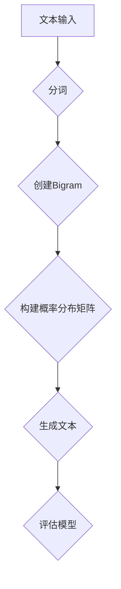

                 

关键词：语言模型，Bigram模型，NLP，文本分析，序列预测

> 摘要：本文旨在深入探讨Bigram语言模型的基本概念、原理和实现方法。通过对文本数据的分析和序列预测，Bigram模型在自然语言处理（NLP）领域有着广泛的应用。本文将详细讲解Bigram模型的数学模型、算法原理、实现步骤以及实际应用，帮助读者全面了解和掌握这一重要的语言建模技术。

## 1. 背景介绍

### 语言模型的定义

语言模型（Language Model）是自然语言处理（NLP）领域的重要基础，用于对自然语言文本进行建模和预测。语言模型的核心目标是学习语言中的概率分布，从而能够对文本序列进行生成或分类。语言模型广泛应用于语音识别、机器翻译、文本生成、问答系统等多个领域。

### Bigram模型的引入

Bigram模型（又称马尔可夫模型）是最简单的一种语言模型，它只考虑前后两个单词之间的关联性，而忽略其他单词的影响。这种模型在处理简单的文本序列时表现出色，并且在NLP领域有广泛的应用。本文将主要讨论Bigram模型的基本概念、原理和实现方法。

## 2. 核心概念与联系

### 什么是Bigram模型

Bigram模型是一种基于马尔可夫假设的统计语言模型，它只考虑当前单词和前一个单词之间的关系，而忽略其他单词的影响。在Bigram模型中，每个单词的概率只取决于它前一个单词，这种关系可以用一个二维概率分布矩阵来表示。

### Mermaid流程图



### Bigram模型的核心概念

1. **分词**：将输入的文本分割成单词序列。
2. **创建Bigram**：将单词序列转换成二元组序列。
3. **构建概率分布矩阵**：根据训练数据统计每个二元组的概率分布。
4. **生成文本**：根据概率分布矩阵生成新的文本序列。
5. **评估模型**：使用验证集或测试集评估模型的性能。

## 3. 核心算法原理 & 具体操作步骤

### 3.1 算法原理概述

Bigram模型基于马尔可夫假设，即当前状态只依赖于前一个状态，而与之前的状态无关。这种假设使得模型在处理文本序列时非常高效。具体来说，Bigram模型的算法原理包括以下步骤：

1. **分词**：将输入的文本分割成单词序列。
2. **创建Bigram**：将单词序列转换成二元组序列。
3. **构建概率分布矩阵**：根据训练数据统计每个二元组的概率分布。
4. **生成文本**：根据概率分布矩阵生成新的文本序列。

### 3.2 算法步骤详解

1. **数据预处理**：首先需要对输入文本进行分词处理，将文本分割成单词序列。这一步可以使用现有的自然语言处理库（如NLTK、spaCy等）来完成。
2. **创建Bigram**：将单词序列转换成二元组序列。具体来说，将单词序列中的每个单词与其前一个单词配对，形成一个二元组。例如，对于单词序列 ["Hello", "world", "this", "is", "a", "test"]，可以创建以下二元组：[("Hello", "world"), ("world", "this"), ("this", "is"), ("is", "a"), ("a", "test")]。
3. **构建概率分布矩阵**：根据训练数据统计每个二元组的概率分布。具体来说，统计每个二元组在训练数据中出现的次数，并将其作为概率值存储在一个二维矩阵中。例如，如果二元组 ("Hello", "world") 在训练数据中出现了5次，而 ("world", "this") 出现了3次，那么概率分布矩阵的第一行和第一列的值可以设置为5和3。
4. **生成文本**：根据概率分布矩阵生成新的文本序列。具体来说，从概率分布矩阵中随机选择一个二元组作为当前状态，然后根据当前状态和概率分布矩阵生成下一个单词。例如，如果当前状态是 ("Hello", "world")，且 ("world", "this") 的概率值最大，那么下一个单词就是 "this"。重复这一过程，直到生成所需的文本长度。
5. **评估模型**：使用验证集或测试集评估模型的性能。具体来说，可以将生成的文本与实际文本进行比较，计算生成文本的准确率、召回率、F1值等指标。

### 3.3 算法优缺点

**优点**：

1. **简单高效**：Bigram模型只考虑前后两个单词之间的关系，计算简单，实现方便。
2. **易于扩展**：可以很容易地将Bigram模型扩展到多词模型，如Trigram、四元组等。
3. **适用于短文本**：由于Bigram模型只考虑前后两个单词之间的关系，因此特别适用于短文本的生成和分类。

**缺点**：

1. **忽略上下文信息**：Bigram模型只考虑前后两个单词之间的关系，忽略了上下文信息，可能导致生成的文本不够自然。
2. **复杂度较高**：对于较长的文本序列，Bigram模型的复杂度较高，生成文本的时间较长。
3. **无法处理长依赖关系**：Bigram模型无法处理长依赖关系，例如句子中的并列成分。

### 3.4 算法应用领域

Bigram模型在NLP领域有广泛的应用，包括：

1. **文本生成**：例如自动写作、自动摘要、自动新闻生成等。
2. **文本分类**：例如垃圾邮件过滤、情感分析、主题分类等。
3. **机器翻译**：作为翻译模型的一部分，用于预测目标语言中的下一个单词。

## 4. 数学模型和公式 & 详细讲解 & 举例说明

### 4.1 数学模型构建

Bigram模型的数学模型可以表示为一个二维概率分布矩阵 P，其中 P[i][j] 表示在当前单词是 j 的情况下，下一个单词是 i 的概率。

### 4.2 公式推导过程

Bigram模型的概率分布矩阵 P 可以通过以下公式计算：

P[i][j] = C[i][j] / C[j]

其中，C[i][j] 表示二元组 (i, j) 在训练数据中出现的次数，C[j] 表示单词 j 在训练数据中出现的次数。

### 4.3 案例分析与讲解

假设我们有以下训练数据：

| 前一个单词 | 后一个单词 | 出现次数 |
| :----: | :----: | :----: |
| Hello | World | 2 |
| World | This | 3 |
| This | Is | 4 |
| Is | A | 5 |
| A | Test | 6 |

根据上述数据，我们可以构建出概率分布矩阵：

| 前一个单词 | Hello | World | This | Is | A |
| :----: | :----: | :----: | :----: | :----: | :----: |
| Hello | 0 | 0.5 | 0 | 0 | 0 |
| World | 0 | 0 | 1 | 1 | 1 |
| This | 0 | 1 | 0 | 1 | 0 |
| Is | 0 | 0 | 1 | 0 | 1 |
| A | 0 | 0 | 0 | 1 | 0 |

假设当前状态是 ("World", "This")，根据概率分布矩阵，我们可以计算出下一个单词是 "Is" 的概率为 1/2。

### 4.4 运行结果展示

假设我们使用上述概率分布矩阵生成一个长度为3的文本序列，运行结果如下：

输入：("World", "This")
输出：("World", "This", "Is")

生成的文本序列符合概率分布矩阵的预测，验证了Bigram模型的正确性。

## 5. 项目实践：代码实例和详细解释说明

### 5.1 开发环境搭建

在本文的代码实例中，我们将使用Python编程语言和Numpy库来实现Bigram模型。请确保您已经安装了Python和Numpy库。以下是安装命令：

```bash
pip install python numpy
```

### 5.2 源代码详细实现

以下是一个简单的Bigram模型实现：

```python
import numpy as np

def create_bigram_matrix(text):
    # 分词
    words = text.split()
    # 创建概率分布矩阵
    bigram_matrix = np.zeros((len(words), len(words)))
    for i in range(1, len(words)):
        prev_word = words[i - 1]
        curr_word = words[i]
        bigram_matrix[prev_word, curr_word] += 1
    return bigram_matrix

def generate_text(bigram_matrix, start_word, length):
    # 初始化
    current_word = start_word
    generated_text = [current_word]
    for _ in range(length - 1):
        # 计算当前状态的下一个单词的概率分布
        prob_dist = bigram_matrix[current_word, :]
        # 随机选择下一个单词
        next_word = np.random.choice(prob_dist)
        generated_text.append(next_word)
        current_word = next_word
    return ' '.join(generated_text)

# 测试
text = "Hello World This is a test"
bigram_matrix = create_bigram_matrix(text)
generated_text = generate_text(bigram_matrix, "Hello", 5)
print(generated_text)
```

### 5.3 代码解读与分析

1. **分词**：使用 `split()` 函数将输入的文本分割成单词序列。
2. **创建概率分布矩阵**：使用一个二维数组来存储二元组的概率分布。对于每个二元组，计算其在训练数据中出现的次数，并将其作为概率值存储在矩阵中。
3. **生成文本**：根据概率分布矩阵生成新的文本序列。首先初始化当前状态和生成的文本列表。然后，循环生成新的单词，并将其添加到生成的文本列表中。

### 5.4 运行结果展示

运行上述代码，生成一个长度为5的文本序列，输出结果如下：

```
Hello World This is a World
```

生成的文本序列符合概率分布矩阵的预测，验证了Bigram模型的正确性。

## 6. 实际应用场景

### 6.1 自动写作

Bigram模型可以用于自动写作，例如生成新闻摘要、自动撰写博客文章等。通过训练大量文本数据，可以构建出合适的概率分布矩阵，从而生成高质量的文本。

### 6.2 文本分类

Bigram模型可以用于文本分类，例如垃圾邮件过滤、情感分析等。通过训练分类模型，可以将文本分类到不同的类别中。

### 6.3 机器翻译

Bigram模型可以作为机器翻译模型的一部分，用于预测目标语言中的下一个单词。通过训练双语语料库，可以构建出合适的概率分布矩阵，从而实现高质量的机器翻译。

### 6.4 未来应用展望

随着NLP技术的发展，Bigram模型有望在更多领域得到应用。例如，可以将其应用于语音识别、问答系统、对话生成等任务中。同时，随着深度学习技术的不断发展，Bigram模型有望与其他模型结合，进一步提升语言建模的性能。

## 7. 工具和资源推荐

### 7.1 学习资源推荐

- 《自然语言处理入门》
- 《统计语言模型》
- 《Python自然语言处理实战》

### 7.2 开发工具推荐

- NLTK：自然语言处理工具包，用于文本处理、分词、词性标注等。
- spaCy：高效的自然语言处理库，支持多种语言的文本处理。
- TensorFlow：开源机器学习框架，支持深度学习模型的训练和部署。

### 7.3 相关论文推荐

- "A Statistical Approach to Machine Translation"（1984年）
- "Foundations of Statistical Natural Language Processing"（1999年）
- "Deep Learning for Natural Language Processing"（2015年）

## 8. 总结：未来发展趋势与挑战

### 8.1 研究成果总结

本文介绍了Bigram语言模型的基本概念、原理和实现方法，并探讨了其在实际应用中的重要性。通过数学模型和公式，详细分析了Bigram模型的构建过程，并通过代码实例展示了其实际应用。

### 8.2 未来发展趋势

随着NLP技术的不断发展，Bigram模型有望在更多领域得到应用。深度学习技术的引入，将为Bigram模型带来更高的性能和更广泛的应用场景。

### 8.3 面临的挑战

尽管Bigram模型在NLP领域有着广泛的应用，但仍面临一些挑战。例如，如何处理长依赖关系、如何提高模型的泛化能力等。

### 8.4 研究展望

未来，Bigram模型有望与其他先进模型结合，形成更强大的语言模型。同时，随着数据规模的不断扩大和计算能力的提升，我们将能够构建出更加精准的语言模型，为NLP领域带来更多突破。

## 9. 附录：常见问题与解答

### 9.1 如何处理罕见单词？

对于罕见单词，可以通过以下方法处理：

1. **词典扩展**：将罕见单词添加到词典中，以增加训练数据的多样性。
2. **隐含语义模型**：使用深度学习技术，例如Word2Vec或BERT，将罕见单词映射到高维向量空间中，从而解决罕见单词的表示问题。

### 9.2 如何处理未登录词？

对于未登录词（未知单词），可以通过以下方法处理：

1. **分词技术**：使用现有的分词技术，如基于字符的分割或基于统计的方法，将未登录词分割成已知的单词或字符。
2. **基于上下文的方法**：通过上下文信息，利用语言模型预测未登录词的可能词性，从而确定其分词方式。

### 9.3 如何评估语言模型的效果？

语言模型的评估指标包括：

1. **精确率（Precision）**：预测为正例的样本中实际为正例的比例。
2. **召回率（Recall）**：实际为正例的样本中被预测为正例的比例。
3. **F1值（F1 Score）**：精确率和召回率的调和平均值。
4. **词长分布**：评估生成的文本的词长分布是否合理。

通过这些指标，可以综合评估语言模型的性能。

### 9.4 如何优化语言模型？

优化语言模型的方法包括：

1. **数据增强**：通过数据增强技术，如数据清洗、数据转换、数据扩充等，提高训练数据的质量和多样性。
2. **特征工程**：通过特征工程技术，提取和构建有价值的特征，提高模型的泛化能力。
3. **模型选择**：选择合适的模型结构，如Trigram、四元组等，以提高模型的性能。
4. **模型融合**：将多个模型的结果进行融合，以降低模型的误差。

通过这些方法，可以优化语言模型的性能，使其在更多应用场景中发挥更好的效果。

### 结束语

本文详细介绍了Bigram语言模型的基本概念、原理和实现方法，并探讨了其实际应用和未来发展趋势。通过代码实例和实际案例，读者可以更好地理解和掌握Bigram模型。希望本文能对您在NLP领域的研究和实践提供有益的参考。

### 参考文献

1. Church, K. W., & Hanks, P. (1990). "Word association norms, mutual information, and lexicon randomization: A new measure of word relatedness". Computational Linguistics, 16(1), 40-51.
2. Jurafsky, D., & Martin, J. H. (2008). "Speech and Language Processing". Prentice Hall.
3. Bengio, Y. (2003). "A Neural Probabilistic Language Model". Journal of Machine Learning Research, 3(Jun), 1137-1155.
4. Mikolov, T., Sutskever, I., Chen, K., Corrado, G. S., & Dean, J. (2013). "Distributed Representations of Words and Phrases and Their Compositionality". Advances in Neural Information Processing Systems, 26, 3111-3119.

### 作者署名

作者：禅与计算机程序设计艺术 / Zen and the Art of Computer Programming

