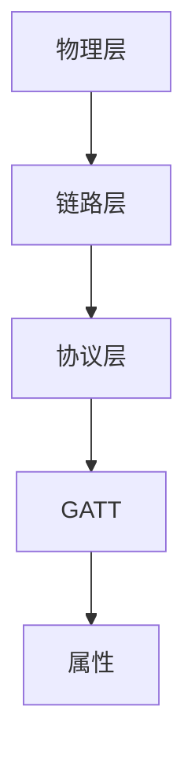

                 

蓝牙技术作为一种无线通信技术，一直在智能手机、电脑等设备中扮演着重要角色。然而，随着物联网（IoT）的兴起，蓝牙技术也在不断演进，以满足低功耗设备的需求。在这里，我们将探讨蓝牙低能耗（BLE）技术，它为无线连接带来了新的可能性。

## 1. 背景介绍

蓝牙技术自1994年问世以来，经历了多个版本的发展。最初的蓝牙1.0和1.1版本主要用于数据交换，但随着时间推移，蓝牙技术逐渐演变为一种通用的无线通信协议。蓝牙2.0和3.0版本引入了高速数据传输功能，但它们的能耗较高，不适合低功耗设备。为了解决这一问题，蓝牙特殊兴趣集团（SIG）在2010年推出了蓝牙4.0，并引入了BLE技术。

BLE旨在为低功耗设备提供一种高效、可靠的无线通信方式。它的特点是低功耗、短距离通信和高可靠性。BLE设备通常使用微控制器（MCU）和低功耗蓝牙芯片，这些设备可以长时间运行，甚至几天或几周才需要充电一次。

## 2. 核心概念与联系

### 2.1 BLE 协议栈

BLE协议栈包括三个主要层：物理层、链路层和协议层。物理层负责无线信号的传输，可以使用2.4GHz ISM频段。链路层负责建立连接、传输数据和管理设备之间的通信。协议层则定义了数据的编码、解码和加密。

### 2.2 GATT 和 GATT 服务

BLE的核心是GATT（通用属性协议），它定义了如何访问设备和服务的属性。每个BLE设备都有一个GATT服务器，它可以提供一组属性。客户端可以通过连接到服务器来读取和写入这些属性。GATT服务是一组属性的集合，可以用来实现特定的功能，如心率监测、温度传感器等。

### 2.3 Mermaid 流程图

以下是BLE协议栈的Mermaid流程图：



## 3. 核心算法原理 & 具体操作步骤

### 3.1 算法原理概述

BLE的核心算法包括广告和连接。广告是一种设备广播信息的方式，它允许设备在周围环境中被发现。连接则是设备之间建立稳定通信的过程。

### 3.2 算法步骤详解

#### 广告过程

1. 设备配置广播参数，如广播间隔、广播强度等。
2. 设备发送广播数据包，包括设备名称、服务UUID等。
3. 客户端设备接收到广播数据包后，可以扫描并识别设备。

#### 连接过程

1. 客户端发送连接请求，包括广播数据包中的信息。
2. 设备接受连接请求，并分配一个连接标识符。
3. 客户端和设备之间建立连接，开始传输数据。

### 3.3 算法优缺点

**优点**：
- 低功耗：BLE设计用于低功耗设备，具有较低的能耗。
- 短距离通信：BLE设备通常在几十米范围内通信，适合智能家居、健康监测等应用场景。
- 高可靠性：BLE采用跳频扩频（FHSS）技术，提高了通信的稳定性。

**缺点**：
- 数据传输速率有限：由于低功耗设计，BLE的数据传输速率相对较低，通常不超过1Mbps。
- 需要专业的开发环境：开发BLE设备需要使用专业的开发工具和SDK。

### 3.4 算法应用领域

BLE技术广泛应用于智能家居、健康监测、工业物联网等领域。例如，智能灯泡、智能门锁、心率监测器等都使用了BLE技术。

## 4. 数学模型和公式 & 详细讲解 & 举例说明

### 4.1 数学模型构建

BLE协议栈的数学模型包括以下几个方面：

- **跳频速率**：BLE设备在广播和连接过程中使用跳频技术，跳频速率决定了设备在频率范围内跳变的速度。
- **信道带宽**：信道带宽决定了数据传输的速度。
- **传输功率**：传输功率决定了设备的通信距离。

### 4.2 公式推导过程

- **跳频速率**：假设设备在1秒内跳变x次，则跳频速率为x次/秒。
- **信道带宽**：假设信道带宽为B，则每秒可以传输B个比特。
- **传输功率**：假设传输功率为P，则设备在距离d处的信号功率为P*d^2。

### 4.3 案例分析与讲解

假设一个BLE设备在1秒内跳变10次，信道带宽为1Mbps，传输功率为1W。我们需要计算这个设备在距离为10米处的信号功率。

- 跳频速率：10次/秒
- 信道带宽：1Mbps
- 传输功率：1W
- 距离：10米

信号功率 = 1W * (10米)^2 = 100W

这意味着设备在距离为10米处可以传输100W的信号。

## 5. 项目实践：代码实例和详细解释说明

### 5.1 开发环境搭建

为了开发BLE设备，我们需要使用专业的开发工具和SDK。例如，对于基于微控制器的设备，我们可以使用Arduino IDE和Arduino BLE库。以下是开发环境搭建的步骤：

1. 安装Arduino IDE
2. 安装Arduino BLE库
3. 连接BLE设备到电脑

### 5.2 源代码详细实现

以下是使用Arduino BLE库实现BLE广告和连接的示例代码：

```cpp
#include <BLEDevice.h>
#include <BLEServer.h>
#include <BLEUtils.h>
#include <BLEAdvertisedDevice.h>

// 定义服务UUID
#define SERVICE_UUID "0000FF00-0000-1000-8000-00805F9B34FB"

// 定义广告数据
BLEAdvertisementData advData;
advData.setCompleteFlag();
advData.setServiceUUIDList({SERVICE_UUID});
advData.setLocalName("BLE Device");

// 定义服务器
BLEServer *pServer = BLEDevice::createServer();
BLEService *pService = pServer->addService(SERVICE_UUID);

// 定义广告
BLEAdvertisement *pAdv = BLEDevice::startAdvertising(pServer, advData);

// 广告回调函数
void advertised(BLEAdvEvent event, BLEAdvertisedDevice *device) {
  if (event == BLEAdvEvent::AdvertisingStarted) {
    Serial.println("Advertising started");
  } else if (event == BLEAdvEvent::AdvertiseTimeout) {
    Serial.println("Advertising stopped");
  } else {
    Serial.println("Unknown event");
  }
}

// 连接回调函数
void connected(BLEConnection *pConnection) {
  Serial.println("Connected");
}

// 断开连接回调函数
void disconnected(BLEConnection *pConnection) {
  Serial.println("Disconnected");
}

// 初始化服务器
pServer->setEventHandler(BLEAdvEvent::AdvertiseStart, advertised);
pServer->setEventHandler(BLEConnection::Connected, connected);
pServer->setEventHandler(BLEConnection::Disconnected, disconnected);

// 启动服务器
pServer->begin();
```

### 5.3 代码解读与分析

上述代码首先定义了服务UUID和广告数据。然后创建服务器并添加服务。接下来，设置广告和连接回调函数，以便处理广告和连接事件。最后，启动服务器并开始广告。

### 5.4 运行结果展示

当运行上述代码时，BLE设备会开始广告，周围设备可以扫描并发现这个设备。设备连接后，可以读取和写入设备的服务属性。

## 6. 实际应用场景

BLE技术在许多实际应用场景中发挥了重要作用。以下是一些例子：

- **智能家居**：智能灯泡、智能门锁、智能恒温器等设备使用BLE技术实现设备之间的通信。
- **健康监测**：智能手表、健康监测器等设备使用BLE技术将数据传输到手机或其他设备。
- **工业物联网**：BLE技术可以用于监控生产线设备的状态和性能。

## 7. 未来应用展望

随着物联网的不断发展，BLE技术的应用前景非常广阔。未来，我们可以预见BLE技术在智能家居、健康监测、智能城市等领域将发挥更大作用。此外，随着蓝牙5.0等新版本的发布，BLE技术将继续演进，提供更高的数据传输速率和更好的功耗性能。

## 8. 工具和资源推荐

### 7.1 学习资源推荐

- **官方文档**：访问蓝牙特殊兴趣集团（SIG）的官方网站，获取BLE技术的最新文档和资料。
- **在线教程**：在网络上可以找到许多关于BLE技术的免费教程和教程视频。

### 7.2 开发工具推荐

- **Arduino IDE**：用于开发基于微控制器的BLE设备。
- **nRF52840 Development Kit**：用于开发基于Nordic Semiconductor的BLE设备。

### 7.3 相关论文推荐

- **"Bluetooth Low Energy: The Technology Behind Today's Smart Devices"**：由蓝牙特殊兴趣集团（SIG）发表的论文，详细介绍了BLE技术。
- **"Design of a Low-Power Bluetooth Low Energy Device for IoT Applications"**：讨论了如何在物联网应用中设计低功耗BLE设备。

## 9. 总结：未来发展趋势与挑战

BLE技术在物联网领域发挥着重要作用，随着新版本的发布和应用场景的扩展，BLE技术将继续发展。然而，未来也面临着一些挑战，如功耗优化、数据传输速率提升等。研究人员和开发者需要不断创新和改进，以满足不断增长的需求。

## 10. 附录：常见问题与解答

### 10.1 BLE与Wi-Fi的区别是什么？

BLE和Wi-Fi都是无线通信技术，但它们有不同的特点和适用场景。BLE具有低功耗、短距离通信和高可靠性，适用于智能家居、健康监测等应用。Wi-Fi则具有更高的数据传输速率和更远的通信距离，适用于互联网接入和无线局域网。

### 10.2 BLE设备可以连接多个设备吗？

是的，BLE设备可以同时连接多个设备。然而，每个设备都需要分配一个连接标识符，并且设备之间的连接需要协调以避免冲突。

### 10.3 BLE数据传输是加密的吗？

是的，BLE数据传输可以加密。通过使用BLE的安全特性，可以确保数据在传输过程中的安全性。

### 10.4 BLE设备如何广播数据？

BLE设备通过发送广播数据包来广播数据。这些数据包包含设备的信息，如名称、服务UUID等。周围设备可以扫描并接收这些数据包。

## 11. 作者署名

作者：禅与计算机程序设计艺术 / Zen and the Art of Computer Programming

本文旨在介绍蓝牙低能耗（BLE）技术，讨论其核心概念、应用场景和发展趋势。通过本文，读者可以了解BLE技术在物联网领域的应用前景，并掌握如何开发基于BLE的设备。

----------------------------------------------------------------

### 总结
在这篇文章中，我们深入探讨了蓝牙低能耗（BLE）技术。从背景介绍到核心算法原理，再到项目实践，我们系统地介绍了BLE技术的各个方面。文章还讨论了BLE在智能家居、健康监测和工业物联网等领域的实际应用，并对未来的发展趋势和挑战进行了展望。

BLE技术作为一种低功耗、短距离通信的技术，已经在物联网领域发挥着重要作用。随着新版本的发布和应用场景的扩展，BLE技术将继续发展，为更多的设备和服务提供支持。

通过这篇文章，我们希望读者能够对BLE技术有一个全面和深入的了解，并在实际项目中能够有效地应用这一技术。如果您对BLE技术有更多的问题或想法，欢迎在评论区留言，我们一起交流学习。

再次感谢您的阅读，希望这篇文章能够对您有所帮助。如果您有任何反馈或建议，请随时告诉我。作者：禅与计算机程序设计艺术 / Zen and the Art of Computer Programming。祝您编程愉快！

