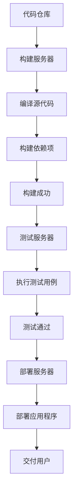

                 

关键词：持续集成（CI）、持续交付（CD）、自动化、软件交付、敏捷开发、DevOps

> 摘要：本文旨在探讨CI/CD管道在自动化软件交付流程中的应用，以及如何通过CI/CD提高软件交付效率和质量。文章将从背景介绍、核心概念与联系、核心算法原理与具体操作步骤、数学模型和公式、项目实践、实际应用场景、工具和资源推荐、总结与展望等多个方面进行深入分析，帮助读者全面了解CI/CD管道的重要性及其在软件开发中的广泛应用。

## 1. 背景介绍

在现代软件开发中，持续集成（Continuous Integration，简称CI）和持续交付（Continuous Delivery，简称CD）已经成为提高软件交付效率和质量的重要手段。CI/CD是一种软件开发实践，通过自动化工具和流程，确保软件的每个部分都能在集成和交付过程中无缝衔接，从而实现快速、可靠和高效的软件交付。

CI/CD起源于敏捷开发（Agile Development）和DevOps文化的兴起。敏捷开发强调快速迭代和持续交付，DevOps则强调开发和运维的紧密协作。CI/CD正是这两种文化碰撞的结果，通过自动化工具将开发、测试、部署和运维环节紧密结合，从而实现从代码提交到软件交付的全过程自动化。

在CI/CD管道中，开发人员将代码提交到版本控制系统中，CI工具会自动触发构建、测试和部署流程。如果出现任何问题，CI工具会立即通知开发人员，以便及时修复。CD则进一步将自动化流程扩展到部署和发布阶段，确保软件可以在任何环境中无缝部署。

### 1.1 CI/CD与敏捷开发、DevOps的关系

- **敏捷开发**：敏捷开发强调快速响应变化，通过短周期的迭代和持续交付，确保软件能够及时交付给用户。CI/CD与敏捷开发紧密相连，通过自动化测试和构建，确保每次迭代都能交付高质量的功能。
- **DevOps**：DevOps强调开发和运维的协同工作，CI/CD作为其核心组成部分，通过自动化和协作工具，实现从代码提交到生产环境部署的全过程自动化，从而提高交付效率和质量。

## 2. 核心概念与联系

在深入了解CI/CD之前，我们需要了解一些核心概念，包括版本控制、自动化构建、自动化测试、容器化等。

### 2.1 版本控制

版本控制是CI/CD的基础。通过版本控制系统（如Git），开发人员可以跟踪代码的变更历史，协作开发，并确保代码的一致性。版本控制系统将代码存储在远程仓库中，开发人员可以通过克隆（Clone）或拉取（Pull）仓库中的代码进行开发。

### 2.2 自动化构建

自动化构建是将源代码转换为可执行软件的过程。构建过程通常包括编译、打包和构建依赖项。自动化构建工具（如Jenkins、GitLab CI等）可以自动化执行这些任务，确保每次代码变更都能生成正确的构建结果。

### 2.3 自动化测试

自动化测试是CI/CD的重要环节。通过自动化测试工具（如Selenium、JUnit等），可以自动化执行测试用例，确保软件的功能和性能符合预期。自动化测试不仅提高测试效率，还可以确保每次代码变更都不会引入新的缺陷。

### 2.4 容器化

容器化技术（如Docker）使得软件开发变得更加灵活和可移植。通过将应用程序及其依赖项打包成一个独立的容器，可以在任何环境中运行，从而确保软件的一致性和可重复性。

### 2.5 CI/CD管道的架构

CI/CD管道的架构通常包括以下几个部分：

- **源代码管理（Source Control）**：存储和管理源代码。
- **构建服务器（Build Server）**：自动化执行构建任务。
- **测试服务器（Test Server）**：自动化执行测试任务。
- **部署服务器（Deployment Server）**：自动化部署应用程序。

下面是一个简单的CI/CD管道的Mermaid流程图：



## 3. 核心算法原理 & 具体操作步骤

### 3.1 算法原理概述

CI/CD的核心算法原理是自动化。通过自动化工具和脚本，将软件开发、测试、部署和运维的各个环节紧密衔接，从而实现快速、可靠和高效的软件交付。核心算法包括：

- **自动化构建**：将源代码转换为可执行软件。
- **自动化测试**：执行测试用例，确保软件功能符合预期。
- **自动化部署**：将应用程序部署到生产环境。

### 3.2 算法步骤详解

以下是CI/CD管道的具体操作步骤：

#### 3.2.1 设置源代码管理

1. **选择版本控制系统**：如Git。
2. **初始化仓库**：在远程服务器上创建仓库，并在本地克隆仓库。
3. **提交代码**：开发人员将代码提交到仓库。

#### 3.2.2 配置构建服务器

1. **安装构建工具**：如Jenkins。
2. **创建构建项目**：配置构建工具，设置构建脚本。
3. **触发构建**：每次代码提交都会触发构建。

#### 3.2.3 编译源代码

1. **获取源代码**：构建服务器从仓库获取源代码。
2. **编译代码**：使用编译器（如GCC、Maven等）编译源代码。
3. **生成可执行文件**：编译成功后，生成可执行文件。

#### 3.2.4 构建依赖项

1. **解析依赖关系**：分析源代码中的依赖项。
2. **下载依赖项**：从远程仓库下载依赖项。
3. **安装依赖项**：将依赖项安装到构建环境中。

#### 3.2.5 执行自动化测试

1. **编写测试用例**：开发人员编写测试用例。
2. **执行测试**：使用测试工具（如JUnit、Selenium等）执行测试用例。
3. **报告测试结果**：将测试结果报告给开发人员。

#### 3.2.6 自动化部署

1. **配置部署环境**：设置部署服务器的环境。
2. **部署应用程序**：将构建成功的应用程序部署到生产环境。
3. **发布版本**：更新版本信息，发布新版本。

### 3.3 算法优缺点

#### 3.3.1 优点

- **提高交付效率**：通过自动化，加快开发、测试和部署的速度。
- **确保软件质量**：自动化测试确保每次交付的软件都经过严格测试。
- **降低人力成本**：减少手动操作，降低人力成本。

#### 3.3.2 缺点

- **初期投入成本**：需要投入时间和资源配置自动化工具和环境。
- **依赖外部工具**：CI/CD依赖于外部工具和平台，可能受到外部因素影响。

### 3.4 算法应用领域

CI/CD在软件开发中广泛应用，包括以下领域：

- **Web应用开发**：快速迭代和持续交付Web应用。
- **移动应用开发**：自动化构建和测试移动应用。
- **微服务架构**：自动化部署和管理微服务。
- **DevOps实践**：通过CI/CD实现开发和运维的紧密协作。

## 4. 数学模型和公式 & 详细讲解 & 举例说明

### 4.1 数学模型构建

在CI/CD管道中，一个关键的数学模型是构建时间模型。构建时间模型用于预测代码提交后构建和测试所需的时间。构建时间模型可以表示为：

$$
T_{build} = f(T_{compile}, T_{dependency}, T_{test})
$$

其中，$T_{build}$ 是总构建时间，$T_{compile}$ 是编译时间，$T_{dependency}$ 是依赖项下载和安装时间，$T_{test}$ 是测试时间。

### 4.2 公式推导过程

构建时间的推导过程如下：

1. **编译时间**：编译时间取决于源代码的复杂度和编译器的性能。假设编译时间为 $T_{compile} = \alpha \cdot N_{lines}$，其中 $\alpha$ 是编译时间常数，$N_{lines}$ 是源代码行数。

2. **依赖项下载和安装时间**：依赖项下载和安装时间取决于依赖项的数量和大小。假设下载和安装时间为 $T_{dependency} = \beta \cdot D_{size}$，其中 $\beta$ 是下载和安装时间常数，$D_{size}$ 是依赖项总大小。

3. **测试时间**：测试时间取决于测试用例的数量和测试工具的性能。假设测试时间为 $T_{test} = \gamma \cdot T_{cases}$，其中 $\gamma$ 是测试时间常数，$T_{cases}$ 是测试用例总数。

将这些公式代入构建时间模型，得到：

$$
T_{build} = \alpha \cdot N_{lines} + \beta \cdot D_{size} + \gamma \cdot T_{cases}
$$

### 4.3 案例分析与讲解

假设我们有一个Web应用项目，源代码有10000行，依赖项总大小为500MB，共有50个测试用例。根据以上公式，我们可以计算构建时间：

- **编译时间**：$T_{compile} = \alpha \cdot 10000 = 10000\alpha$。
- **依赖项下载和安装时间**：$T_{dependency} = \beta \cdot 500MB = 500\beta$。
- **测试时间**：$T_{test} = \gamma \cdot 50 = 50\gamma$。

假设 $\alpha = 0.01s/行$，$\beta = 0.01s/MB$，$\gamma = 0.1s/测试用例$，则：

- **编译时间**：$T_{compile} = 10000 \cdot 0.01s = 100s$。
- **依赖项下载和安装时间**：$T_{dependency} = 500 \cdot 0.01s = 5s$。
- **测试时间**：$T_{test} = 50 \cdot 0.1s = 5s$。

总构建时间 $T_{build} = 100s + 5s + 5s = 110s$。

这意味着，在不考虑其他因素的情况下，该项目的构建时间约为110秒。

## 5. 项目实践：代码实例和详细解释说明

为了更好地理解CI/CD管道的实际应用，我们将通过一个简单的Web应用项目进行实践。该项目使用Python和Django框架，并在Jenkins上配置CI/CD管道。

### 5.1 开发环境搭建

1. **安装Python和Django**：

```bash
# 安装Python
sudo apt-get install python3-pip

# 安装Django
pip3 install django
```

2. **创建Django项目**：

```bash
django-admin startproject myproject
cd myproject
```

3. **创建应用**：

```bash
python manage.py startapp myapp
```

### 5.2 源代码详细实现

在`myapp`应用中，创建一个简单的视图函数，并在`myproject/settings.py`中配置数据库。

`views.py`：

```python
from django.http import HttpResponse

def hello_world(request):
    return HttpResponse("Hello, world!")
```

`settings.py`：

```python
DATABASES = {
    'default': {
        'ENGINE': 'django.db.backends.sqlite3',
        'NAME': BASE_DIR / 'db.sqlite3',
    }
}
```

### 5.3 代码解读与分析

- **视图函数**：`hello_world` 视图函数处理HTTP请求，并返回一个包含文本的HTTP响应。
- **数据库配置**：配置使用SQLite3数据库。

### 5.4 运行结果展示

1. **启动Django开发服务器**：

```bash
python manage.py runserver
```

2. **访问Web应用**：

在浏览器中输入 `http://127.0.0.1:8000/`，可以看到显示 "Hello, world!" 的页面。

### 5.5 配置Jenkins CI/CD管道

1. **安装Jenkins**：

```bash
sudo apt-get install jenkins
```

2. **配置Jenkins**：

- 启动Jenkins服务：

```bash
sudo systemctl start jenkins
```

- 访问Jenkins Web界面：在浏览器中输入 `http://127.0.0.1:8080/`，使用默认管理员密码登录。

3. **创建Jenkins项目**：

- 创建一个新的Jenkins项目，命名为 "myproject"。
- 配置Git源代码仓库地址。
- 添加构建触发器，如 "Git Hook Trigger"。

4. **配置构建脚本**：

在Jenkins项目中添加构建步骤，包括：

- **执行Python虚拟环境**：
  ```bash
  python -m venv venv
  source venv/bin/activate
  ```

- **安装依赖项**：
  ```bash
  pip install -r requirements.txt
  ```

- **运行测试用例**：
  ```bash
  python manage.py test
  ```

- **部署应用程序**：
  ```bash
  python manage.py runserver
  ```

### 5.6 构建和测试

1. **提交代码**：

将代码提交到Git仓库，触发Jenkins构建。

2. **查看构建结果**：

在Jenkins界面中查看构建结果，包括构建日志、测试报告等。

3. **自动化部署**：

如果构建和测试成功，Jenkins会自动部署应用程序，并启动开发服务器。

### 5.7 代码解读与分析

- **虚拟环境**：使用Python虚拟环境隔离项目依赖。
- **依赖安装**：从`requirements.txt`文件中安装项目依赖。
- **测试用例**：使用Django测试框架运行测试用例。
- **部署**：启动Django开发服务器，提供Web服务。

通过以上步骤，我们成功配置了一个简单的CI/CD管道，实现了代码的自动化构建、测试和部署。

## 6. 实际应用场景

CI/CD管道在软件开发中的实际应用场景非常广泛，以下是一些典型的应用场景：

### 6.1 Web应用开发

Web应用开发是CI/CD最常用的场景之一。通过CI/CD，可以快速构建和测试前端和后端代码，并自动化部署到生产环境，从而实现持续交付。

### 6.2 移动应用开发

移动应用开发中，CI/CD可以自动化构建和测试Android和iOS应用。通过CI/CD，可以确保每次代码变更都能生成正确的应用版本，并自动化发布到应用商店。

### 6.3 微服务架构

在微服务架构中，CI/CD可以自动化构建、测试和部署每个微服务。通过CI/CD，可以确保微服务之间的协作和一致性，提高系统的可维护性和可扩展性。

### 6.4 DevOps实践

CI/CD是DevOps实践的核心组成部分。通过CI/CD，可以自动化软件开发、测试、部署和运维的各个环节，实现开发和运维的紧密协作，从而提高交付效率和质量。

### 6.5 大型项目协作

在大型项目中，CI/CD可以帮助多个开发团队协同工作。通过CI/CD，可以确保每个团队的代码变更都能在集成和交付过程中无缝衔接，从而提高项目的整体进度和质量。

## 7. 工具和资源推荐

### 7.1 学习资源推荐

- **书籍**：《CI/CD实战》
- **在线课程**：Coursera上的《DevOps基础》
- **博客和教程**：Jenkins官方文档、GitLab CI文档

### 7.2 开发工具推荐

- **版本控制**：Git
- **构建工具**：Jenkins、GitLab CI、Travis CI
- **测试工具**：Selenium、JUnit、pytest
- **容器化**：Docker、Kubernetes

### 7.3 相关论文推荐

- **《CI/CD in Practice》**：讨论CI/CD在不同组织中的应用案例。
- **《DevOps: AOPS plus DevOps》**：分析DevOps的核心概念和实践方法。
- **《Continuous Delivery: Reliable Software Releases through Build, Test, and Deployment Automation》**：深入探讨CD的原理和实践。

## 8. 总结：未来发展趋势与挑战

### 8.1 研究成果总结

CI/CD已经成为软件开发的核心实践，通过自动化和协作，提高了软件交付效率和质量。未来，CI/CD将继续在以下几个方面发展：

- **更高效的自动化工具**：优化构建、测试和部署流程，提高效率。
- **更智能的测试**：引入智能测试技术，提高测试质量和覆盖率。
- **更灵活的架构**：支持微服务、容器化等新型架构，实现更灵活的部署和运维。

### 8.2 未来发展趋势

- **全链路CI/CD**：从开发、测试、部署到运维的全过程自动化。
- **智能化CI/CD**：利用AI技术优化自动化流程，提高交付效率和质量。
- **开源生态**：随着开源技术的普及，CI/CD工具将更加丰富和多样化。

### 8.3 面临的挑战

- **复杂性和多样性**：随着项目规模和技术的复杂性增加，CI/CD管道的配置和管理将变得更加困难。
- **安全性**：确保CI/CD管道的安全性，防止恶意攻击和数据泄露。
- **团队合作**：促进开发、测试、运维团队的紧密协作，提高整体交付效率。

### 8.4 研究展望

未来，CI/CD将继续发展，并在以下几个方面取得突破：

- **智能化**：通过引入AI技术，实现更智能的构建、测试和部署。
- **生态融合**：与DevOps、微服务、容器化等新兴技术深度融合，实现更高效的全链路自动化。
- **开源生态**：推动开源CI/CD工具的发展，构建更加丰富和多样化的开源生态。

## 9. 附录：常见问题与解答

### 9.1 如何配置Jenkins CI/CD管道？

**解答**：配置Jenkins CI/CD管道需要以下步骤：

1. 安装Jenkins。
2. 创建Jenkins项目。
3. 配置Git源代码仓库。
4. 添加构建步骤，如执行构建脚本、运行测试用例等。
5. 配置部署步骤，如部署到生产环境。
6. 触发构建，查看构建结果。

### 9.2 CI/CD与DevOps有什么区别？

**解答**：CI/CD是DevOps的核心组成部分，主要关注软件开发和测试的自动化。DevOps则是一个更广泛的概念，包括CI/CD、自动化部署、监控、日志管理等。DevOps强调开发和运维的紧密协作，实现从代码提交到生产环境部署的全过程自动化。

### 9.3 CI/CD对软件质量有何影响？

**解答**：CI/CD可以提高软件质量，主要体现在以下几个方面：

- **频繁测试**：通过自动化测试，确保每次代码变更都不会引入新的缺陷。
- **快速反馈**：发现问题时，立即通知开发人员，及时修复。
- **持续改进**：通过不断优化自动化流程，提高软件交付效率和质量。

### 9.4 CI/CD与敏捷开发有何关系？

**解答**：CI/CD是敏捷开发的重要实践之一，通过自动化和协作，实现快速迭代和持续交付。敏捷开发强调快速响应变化，而CI/CD通过自动化工具和流程，确保每次迭代都能交付高质量的功能。

---

作者：禅与计算机程序设计艺术 / Zen and the Art of Computer Programming
----------------------------------------------------------------

以上就是本文的完整内容，涵盖了CI/CD管道的背景介绍、核心概念、算法原理、数学模型、项目实践、实际应用场景、工具和资源推荐、未来发展趋势与挑战以及常见问题与解答等多个方面。希望通过这篇文章，读者能够全面了解CI/CD管道在自动化软件交付流程中的应用和重要性。未来，随着技术的不断进步，CI/CD将继续发挥重要作用，推动软件开发和交付的智能化、自动化发展。

