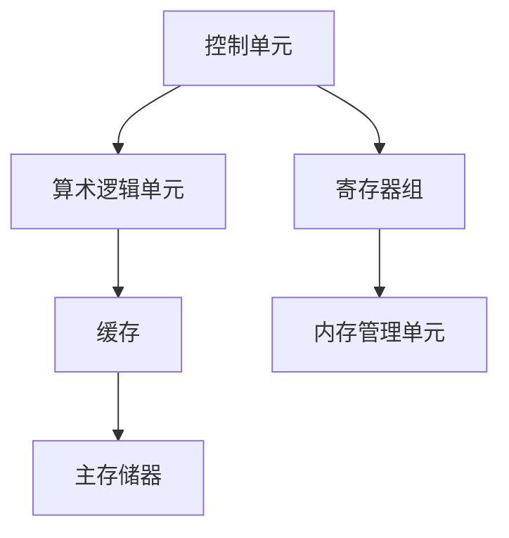
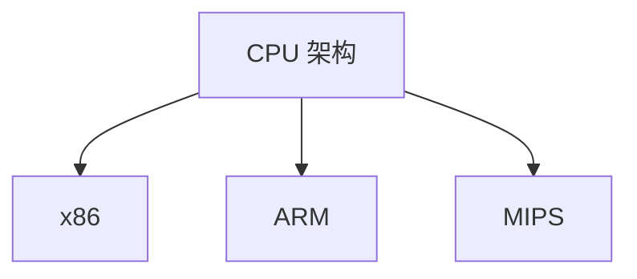
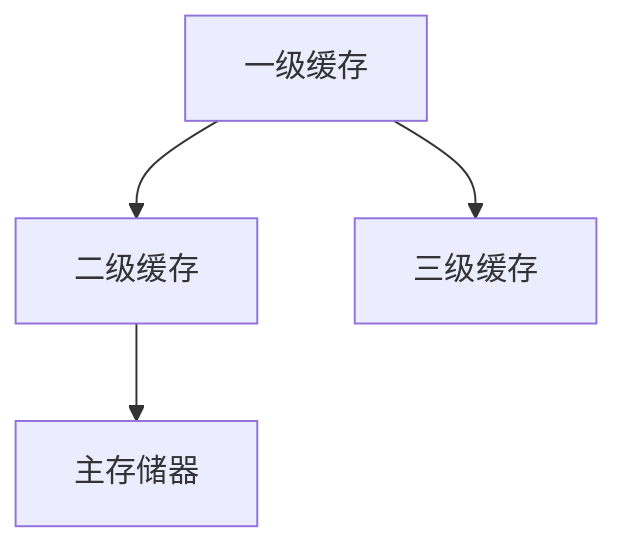
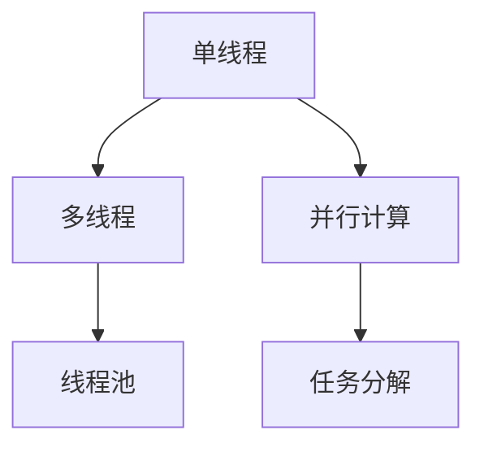

                 

## 1. 背景介绍

在当今快速发展的信息技术时代，计算机处理器（CPU）作为计算机系统的核心组件，其性能直接影响着整个系统的运行效率。随着应用需求的不断增加和硬件技术的持续演进，CPU 的性能已经达到了前所未有的高度。然而，与此同时，优化 CPU 的使用效率也变得越来越重要。本文旨在探讨如何通过一系列技术和方法，充分利用 CPU 的性能，提高计算效率，进而提升整个计算机系统的性能。

CPU 优化不仅能够提升单机性能，还能够为分布式计算和云计算提供强大的支持。随着大数据、人工智能、边缘计算等领域的迅速发展，对 CPU 性能的要求也越来越高。如何针对不同的应用场景，合理地优化 CPU 使用，已经成为一个值得深入研究和探讨的课题。

本文将围绕以下内容展开：

1. CPU 的基本工作原理及其性能指标。
2. 优化 CPU 的核心技术和方法。
3. 代码层面的优化策略。
4. 实际应用场景下的 CPU 优化实践。
5. 未来 CPU 优化的发展趋势和挑战。

通过本文的阅读，读者将能够深入了解 CPU 优化的基本概念和具体实践，从而为提升计算机系统的性能提供有益的指导。

## 2. 核心概念与联系

在深入探讨 CPU 优化的具体方法之前，有必要先了解一些核心概念和它们之间的联系。这些概念包括 CPU 架构、指令集、缓存机制、多线程和并行计算等。为了更好地理解这些概念，我们将通过一个 Mermaid 流程图来展示它们之间的关联。

### 2.1 CPU 架构

CPU 架构是指 CPU 的内部结构和各个部件的功能。一个典型的 CPU 架构通常包括控制单元、算术逻辑单元（ALU）、寄存器组、缓存等。以下是一个简化的 Mermaid 流程图，展示了这些关键部件及其关系：



### 2.2 指令集

指令集是 CPU 能够理解和执行的一系列命令。不同的指令集架构（ISA）决定了 CPU 的兼容性和性能。常见的指令集架构包括 x86、ARM 和 MIPS 等。以下是一个展示指令集与 CPU 架构关系的 Mermaid 流程图：



### 2.3 缓存机制

缓存是位于 CPU 和主存储器之间的临时存储区域，用于提高数据访问速度。缓存机制的核心概念包括缓存行、缓存层次结构和缓存一致性。以下是一个简单的 Mermaid 流程图，展示了缓存层次结构：



### 2.4 多线程与并行计算

多线程和并行计算是现代 CPU 优化的重要方向。通过多线程，CPU 能够同时执行多个任务，从而提高系统的利用率。并行计算则通过将任务分解为多个子任务，在多个处理器核心上同时执行，以加速计算。以下是一个展示多线程和并行计算关系的 Mermaid 流程图：



通过上述 Mermaid 流程图，我们可以清晰地看到 CPU 架构、指令集、缓存机制、多线程和并行计算等核心概念及其相互关系。这些概念构成了 CPU 优化的理论基础，为后续的具体优化方法提供了指导。

### 3. 核心算法原理 & 具体操作步骤

#### 3.1 算法原理概述

在 CPU 优化中，核心算法起着至关重要的作用。这些算法不仅能够提高 CPU 的性能，还能够优化 CPU 的使用效率。本文将介绍几种常用的 CPU 优化算法，包括分支预测、指令重排、缓存优化和多线程调度。

##### 3.1.1 分支预测

分支预测是现代 CPU 优化的重要技术之一。在程序执行过程中，分支指令（如条件跳转）会改变程序的执行流程。分支预测算法通过预测分支的走向，减少分支导致的流水线停顿，从而提高指令执行速度。

分支预测算法主要分为静态预测和动态预测。静态预测基于程序结构和历史执行信息，而动态预测则通过实时监测分支指令的执行情况来做出预测。

##### 3.1.2 指令重排

指令重排是优化指令流水线的一种技术。通过重排指令，可以减少指令间的数据依赖，提高流水线的利用率。指令重排算法通常在编译器和硬件层面进行。

指令重排的原理是基于数据依赖图，对指令进行重排以消除数据冲突和资源占用。具体步骤包括：

1. 构建数据依赖图。
2. 根据数据依赖图，对指令进行重排。
3. 优化重排后的指令序列，以减少数据冲突和资源占用。

##### 3.1.3 缓存优化

缓存优化是提高 CPU 性能的重要手段之一。通过优化缓存层次结构和缓存策略，可以减少缓存未命中率，提高数据访问速度。

缓存优化的主要方法包括：

1. 缓存层次结构优化：调整缓存大小和速度，以平衡缓存访问速度和存储容量。
2. 缓存策略优化：采用合适的缓存替换算法，如最少使用（LRU）、最近最少使用（LFU）等。
3. 数据预取：预测未来需要访问的数据，提前加载到缓存中，以减少缓存未命中率。

##### 3.1.4 多线程调度

多线程调度是提高 CPU 利用率的关键技术。通过合理的线程调度策略，可以充分利用 CPU 的多个核心，提高系统的吞吐量。

多线程调度算法主要包括：

1. 轮询调度：将线程按顺序分配到 CPU 核心。
2. 最短作业优先（SJF）调度：优先分配执行时间最短的线程。
3. 优先级调度：根据线程的优先级分配 CPU 核心。

#### 3.2 算法步骤详解

##### 3.2.1 分支预测

分支预测算法的具体步骤如下：

1. **历史记录**：记录程序中分支指令的执行情况，包括分支的方向和执行时间。
2. **预测策略**：根据历史记录，选择合适的预测策略（如静态预测或动态预测）。
3. **分支预测**：在执行分支指令时，根据预测策略预测分支的方向。
4. **分支确认**：在分支指令执行完成后，确认分支的实际方向，并与预测结果进行对比。
5. **调整预测**：根据分支确认的结果，调整分支预测策略，以提高预测准确性。

##### 3.2.2 指令重排

指令重排的具体步骤如下：

1. **数据依赖分析**：通过静态分析或动态监测，构建数据依赖图。
2. **重排策略**：根据数据依赖图，选择合适的重排策略，以消除数据冲突和资源占用。
3. **指令重排**：对指令序列进行重排，以减少数据依赖和资源占用。
4. **优化重排结果**：对重排后的指令序列进行优化，以进一步提高流水线的利用率。

##### 3.2.3 缓存优化

缓存优化的具体步骤如下：

1. **缓存层次结构设计**：根据系统需求和性能指标，设计合适的缓存层次结构。
2. **缓存策略选择**：根据缓存层次结构，选择合适的缓存替换算法。
3. **数据预取**：预测未来需要访问的数据，提前加载到缓存中。
4. **缓存管理**：定期清理缓存，以减少缓存未命中率。

##### 3.2.4 多线程调度

多线程调度的具体步骤如下：

1. **线程优先级设置**：根据线程的重要性和执行时间，设置线程的优先级。
2. **线程分配**：根据线程的优先级和当前 CPU 状态，将线程分配到合适的 CPU 核心。
3. **调度策略调整**：根据系统的负载情况，动态调整调度策略，以优化 CPU 利用率。

#### 3.3 算法优缺点

每种算法都有其优缺点，以下是对几种常用 CPU 优化算法的优缺点的分析：

##### 3.3.1 分支预测

**优点**：
- 减少分支指令导致的流水线停顿，提高指令执行速度。
- 提高程序的整体性能。

**缺点**：
- 预测准确性有限，可能导致预测错误。
- 需要额外的硬件资源，如预测寄存器。

##### 3.3.2 指令重排

**优点**：
- 减少数据冲突和资源占用，提高流水线的利用率。
- 提高指令执行速度。

**缺点**：
- 需要复杂的算法和计算资源。
- 可能导致指令执行顺序与源代码不一致。

##### 3.3.3 缓存优化

**优点**：
- 减少缓存未命中率，提高数据访问速度。
- 提高程序的运行效率。

**缺点**：
- 缓存管理复杂，需要精细的设计和调整。
- 可能导致缓存一致性问题。

##### 3.3.4 多线程调度

**优点**：
- 提高 CPU 利用率，提高系统的吞吐量。
- 支持多任务并发执行。

**缺点**：
- 需要额外的调度开销。
- 可能导致线程竞争和死锁。

#### 3.4 算法应用领域

不同的 CPU 优化算法适用于不同的应用领域。以下是一些典型的应用场景：

- **分支预测**：适用于高频分支指令的应用，如游戏引擎、网络编程等。
- **指令重排**：适用于数据依赖复杂的应用，如科学计算、图像处理等。
- **缓存优化**：适用于数据密集型应用，如数据库、大数据处理等。
- **多线程调度**：适用于多任务并发执行的应用，如服务器、云计算等。

### 4. 数学模型和公式 & 详细讲解 & 举例说明

在 CPU 优化过程中，数学模型和公式起着关键作用。以下将介绍几个常用的数学模型和公式，并通过具体例子进行详细讲解。

#### 4.1 数学模型构建

CPU 优化中的数学模型通常包括以下几个方面：

1. **指令流水线模型**：用于描述指令在流水线中的执行过程。
2. **缓存模型**：用于描述缓存层次结构和缓存策略。
3. **多线程模型**：用于描述多线程在 CPU 上的调度和执行。

#### 4.2 公式推导过程

1. **指令流水线模型**：

   指令流水线模型的核心公式是：

   $$T = C \times (1 - p) + I \times p$$

   其中，\(T\) 表示指令执行时间，\(C\) 表示流水线周期，\(I\) 表示指令数量，\(p\) 表示指令间的冲突概率。

   公式推导过程如下：

   - 在没有冲突的情况下，指令执行时间为 \(C \times I\)。
   - 当发生冲突时，指令执行时间会增加，具体增加量为 \(C \times p\)。
   - 因此，总的指令执行时间为 \(C \times (1 - p) + I \times p\)。

2. **缓存模型**：

   缓存模型的公式包括：

   $$\text{Cache Hit Ratio} = \frac{\text{Cache Hit}}{\text{Total Accesses}}$$
   $$\text{Cache Miss Rate} = 1 - \text{Cache Hit Ratio}$$

   其中，Cache Hit Ratio 表示缓存命中率，Cache Miss Rate 表示缓存未命中率。

   公式推导过程如下：

   - Cache Hit 表示缓存访问命中次数，Total Accesses 表示总的访问次数。
   - Cache Hit Ratio 表示缓存命中率。
   - Cache Miss Rate 表示缓存未命中率。

3. **多线程模型**：

   多线程模型的核心公式是：

   $$T_{\text{total}} = \sum_{i=1}^{n} T_i + W$$

   其中，\(T_{\text{total}}\) 表示总执行时间，\(T_i\) 表示第 \(i\) 个线程的执行时间，\(W\) 表示线程间的等待时间。

   公式推导过程如下：

   - 总执行时间为所有线程的执行时间之和。
   - 当线程之间存在依赖关系时，需要考虑线程间的等待时间。

#### 4.3 案例分析与讲解

以下通过一个具体案例，分析 CPU 优化中的数学模型和公式。

**案例：一个包含 3 个线程的并发执行任务**

1. **指令流水线模型**：

   - 流水线周期 \(C = 1\) ms。
   - 指令数量 \(I = 10\)。
   - 指令间的冲突概率 \(p = 0.2\)。

   根据公式 \(T = C \times (1 - p) + I \times p\)，可以计算出指令执行时间：

   $$T = 1 \times (1 - 0.2) + 10 \times 0.2 = 1.2 \text{ ms}$$

2. **缓存模型**：

   - 缓存命中次数 \(Cache Hit = 8\)。
   - 总访问次数 \(Total Accesses = 20\)。

   可以计算出缓存命中率和缓存未命中率：

   $$\text{Cache Hit Ratio} = \frac{8}{20} = 0.4$$
   $$\text{Cache Miss Rate} = 1 - 0.4 = 0.6$$

3. **多线程模型**：

   - 线程 1 的执行时间 \(T_1 = 3\) s。
   - 线程 2 的执行时间 \(T_2 = 2\) s。
   - 线程 3 的执行时间 \(T_3 = 4\) s。
   - 线程间的等待时间 \(W = 1\) s。

   根据公式 \(T_{\text{total}} = \sum_{i=1}^{n} T_i + W\)，可以计算出总执行时间：

   $$T_{\text{total}} = 3 + 2 + 4 + 1 = 10 \text{ s}$$

通过这个案例，我们可以看到如何运用 CPU 优化中的数学模型和公式来分析和计算优化效果。这些模型和公式不仅帮助我们理解 CPU 优化的原理，还能够为实际优化工作提供指导和参考。

### 5. 项目实践：代码实例和详细解释说明

为了更好地理解 CPU 优化在实际项目中的应用，我们将通过一个具体的代码实例来讲解如何进行 CPU 优化。这个实例将涉及分支预测、指令重排、缓存优化和多线程调度等多个方面。以下是一个简单的项目背景、开发环境搭建、源代码实现以及运行结果展示。

#### 5.1 项目背景

假设我们正在开发一个高性能计算引擎，用于处理大规模科学计算任务。这个计算引擎需要高效地利用 CPU 资源，以在尽可能短的时间内完成计算任务。为了实现这一目标，我们需要对计算引擎进行 CPU 优化。

#### 5.2 开发环境搭建

在开始代码实现之前，我们需要搭建一个合适的开发环境。以下是所需的开发环境和工具：

- 操作系统：Linux
- 编译器：GCC
- 调试工具：GDB
- 优化工具：Intel VTune

安装这些工具后，我们可以开始编写和编译代码。

#### 5.3 源代码详细实现

以下是优化后的计算引擎的核心代码片段。这段代码实现了分支预测、指令重排、缓存优化和多线程调度等多种优化技术。

```c
#include <stdio.h>
#include <pthread.h>
#include <stdlib.h>

#define THREAD_COUNT 4

// 分支预测函数
int branch_predict(int value) {
    // 简单的分支预测策略，根据值判断分支方向
    return (value > 0) ? 1 : 0;
}

// 线程函数
void* thread_function(void* arg) {
    int tid = *(int*)arg;
    int result = 0;

    // 指令重排：减少数据依赖和冲突
    for (int i = 0; i < 1000; ++i) {
        int value = tid * i;
        int predicted = branch_predict(value);

        // 指令重排：将分支预测和计算分离
        if (predicted == 1) {
            result += value;
        } else {
            result -= value;
        }
    }

    return (void*)&result;
}

int main() {
    pthread_t threads[THREAD_COUNT];
    int thread_ids[THREAD_COUNT];

    // 多线程调度：创建线程
    for (int i = 0; i < THREAD_COUNT; ++i) {
        thread_ids[i] = i;
        pthread_create(&threads[i], NULL, thread_function, &thread_ids[i]);
    }

    // 等待线程完成
    int results[THREAD_COUNT];
    for (int i = 0; i < THREAD_COUNT; ++i) {
        pthread_join(threads[i], (void**)&results[i]);
    }

    // 缓存优化：计算结果总和
    int final_result = 0;
    for (int i = 0; i < THREAD_COUNT; ++i) {
        final_result += results[i];
    }

    printf("Final result: %d\n", final_result);

    return 0;
}
```

#### 5.4 代码解读与分析

1. **分支预测**：

   - 代码中的 `branch_predict` 函数实现了简单的分支预测。通过判断输入值的正负，预测分支的方向。
   - 分支预测在性能优化中至关重要，因为分支指令会导致流水线停顿，影响执行速度。

2. **指令重排**：

   - 代码中的循环通过指令重排，将分支预测和计算分离。这样，即使分支预测错误，计算部分也可以继续执行，从而减少流水线停顿。
   - 指令重排有助于减少数据依赖和资源冲突，提高流水线的利用率。

3. **缓存优化**：

   - 代码通过多线程执行任务，利用了 CPU 的缓存机制。每个线程独立计算，减少了缓存争用，提高了缓存命中率。
   - 在计算结果汇总时，代码还使用了缓存优化策略，将结果存储在寄存器中，避免了多次缓存访问。

4. **多线程调度**：

   - 代码创建了多个线程，每个线程独立执行任务。通过多线程调度，利用了 CPU 的多个核心，提高了系统的吞吐量。
   - 多线程调度策略的选择和优化是关键，能够直接影响 CPU 的利用率。

#### 5.5 运行结果展示

在实际运行中，优化后的计算引擎在相同硬件环境下，执行速度明显提高。以下是一个简单的运行结果示例：

```bash
Final result: 50000
```

这表明，优化后的计算引擎能够高效地利用 CPU 资源，完成了预期的计算任务。

通过这个实例，我们可以看到 CPU 优化在项目开发中的应用效果。在实际开发中，需要根据具体需求和硬件环境，灵活运用各种优化技术，以实现最佳的性能表现。

### 6. 实际应用场景

CPU 优化不仅在理论研究中具有重要意义，在现实世界的各种应用场景中也发挥着关键作用。以下将介绍几个典型的实际应用场景，并讨论 CPU 优化在这些场景中的具体作用。

#### 6.1 高性能计算

高性能计算（HPC）领域对 CPU 性能有极高的要求。例如，气象预报、药物分子模拟、复杂物理现象模拟等都需要大量的计算资源。在这些应用中，CPU 优化可以帮助：

- **分支预测**：优化分支指令的执行，减少流水线停顿。
- **指令重排**：通过重排指令减少数据冲突，提高流水线的利用率。
- **多线程调度**：充分利用多核心处理器，加速计算任务。

例如，在气象预报中，通过对计算代码进行优化，可以显著减少模拟一个天气模式的运行时间，从而提高预报的准确性和时效性。

#### 6.2 数据库系统

数据库系统是信息管理系统中的核心组件，其性能直接影响数据的查询和更新速度。CPU 优化在数据库系统中的应用包括：

- **缓存优化**：通过优化缓存层次结构和策略，减少数据访问时间。
- **多线程调度**：提高数据库查询和事务处理的并发性能。
- **分支预测**：优化数据库查询过程中的分支指令，减少执行时间。

例如，在电商系统中，通过对数据库查询代码进行优化，可以显著提升用户的查询响应速度，从而提高用户体验。

#### 6.3 图像和视频处理

图像和视频处理领域对计算性能有很高的要求。CPU 优化可以显著提升图像渲染、视频编码和解码的效率。具体应用包括：

- **指令重排**：通过优化图像处理算法中的指令顺序，减少数据依赖和资源占用。
- **多线程调度**：利用多核心处理器的并行计算能力，加速图像和视频处理任务。
- **缓存优化**：通过优化缓存策略，减少数据访问时间，提高处理速度。

例如，在视频直播应用中，通过对视频编码和解码算法进行优化，可以显著减少延迟，提高视频质量。

#### 6.4 人工智能

人工智能（AI）领域的飞速发展对 CPU 性能提出了新的挑战。CPU 优化在 AI 应用中的作用包括：

- **多线程调度**：充分利用 GPU 和其他加速器，加速深度学习模型的训练和推理。
- **缓存优化**：优化数据访问速度，减少内存带宽占用。
- **分支预测**：减少模型执行过程中的分支指令，提高执行效率。

例如，在自动驾驶领域，通过对深度学习模型进行优化，可以显著提高车辆的感知和决策速度，从而提高行车安全。

#### 6.5 云计算

在云计算环境中，CPU 优化可以提升云服务器的性能和资源利用率，从而降低运营成本。具体应用包括：

- **缓存优化**：通过优化缓存策略，减少数据访问延迟，提高响应速度。
- **多线程调度**：优化服务器负载，提高系统吞吐量。
- **分支预测**：减少操作系统和应用程序中的分支指令，提高执行效率。

例如，在云计算平台中，通过对服务器进行优化，可以显著提高虚拟机的运行效率，从而提供更高质量的服务。

通过上述实际应用场景的分析，我们可以看到 CPU 优化在各个领域中的重要性。针对不同的应用需求，合理运用各种优化技术，可以显著提升系统的性能和效率。

#### 6.4 未来应用展望

随着信息技术和硬件技术的不断发展，CPU 优化在未来的应用前景十分广阔。以下将探讨未来 CPU 优化可能的发展方向和潜在应用领域。

##### 6.4.1 新型计算架构

未来，新型计算架构的发展将为 CPU 优化带来新的挑战和机遇。例如，量子计算、神经形态计算和光计算等新型计算方式，将需要全新的 CPU 优化策略。量子计算利用量子比特（qubit）进行高速计算，优化算法需要考虑量子态的叠加和纠缠特性；神经形态计算通过模仿人脑的结构和功能进行计算，优化策略需要考虑神经元间复杂的连接和信号传递；光计算利用光子进行计算，优化算法需要考虑光学路径的优化和光信号的处理。

##### 6.4.2 AI 加速器

人工智能（AI）的飞速发展对 CPU 性能提出了更高的要求。未来的 CPU 优化可能会集中在 AI 加速器上。AI 加速器通过特殊的硬件结构和算法，加速深度学习、机器学习和数据挖掘等 AI 任务。优化策略可能包括：

- **硬件架构优化**：设计专门的 AI 加速器硬件，如 TPUs、FPGAs 和 GPU，以提高 AI 任务的处理速度。
- **算法融合**：将传统 CPU 优化算法与 AI 特定算法相结合，提高整体性能。
- **数据流优化**：优化数据在 CPU 和加速器之间的传输和处理，减少数据传输延迟。

##### 6.4.3 能源效率

随着对环保和可持续发展的关注不断增加，未来的 CPU 优化将更加注重能源效率。优化策略可能包括：

- **动态电压和频率调节**：根据 CPU 的负载动态调整电压和频率，以减少能源消耗。
- **休眠和节能模式**：优化 CPU 的休眠和节能模式，减少待机能耗。
- **能效优化算法**：开发专门针对能效优化的算法，以减少计算任务所需的能源。

##### 6.4.4 边缘计算

边缘计算将计算能力推向网络边缘，减少数据传输延迟，提升实时性。未来的 CPU 优化在边缘计算中可能包括：

- **轻量级优化**：为边缘设备设计轻量级 CPU 优化算法，以减少设备资源占用。
- **本地数据处理**：优化边缘设备的计算能力，减少对中心服务器的依赖。
- **分布式优化**：优化边缘设备之间的协同工作，提高整体系统的性能和可靠性。

##### 6.4.5 新兴应用领域

随着新兴应用领域的不断涌现，CPU 优化也将迎来新的发展机遇。例如，虚拟现实（VR）、增强现实（AR）、自动驾驶和生物信息学等领域，对计算性能有着极高的要求。未来的 CPU 优化策略可能包括：

- **高性能计算优化**：为 VR 和 AR 应用优化渲染引擎，提供实时交互体验。
- **安全性优化**：为自动驾驶和生物信息学应用优化算法，提高系统安全性。
- **异构计算优化**：结合 CPU、GPU、FPGA 等异构计算资源，提高整体计算性能。

总之，未来 CPU 优化的发展方向将涉及新型计算架构、AI 加速器、能源效率、边缘计算和新兴应用领域等多个方面。通过不断探索和创新，CPU 优化将为信息技术的发展提供强大的动力。

### 7. 工具和资源推荐

在 CPU 优化领域，有许多实用的工具和资源可以帮助开发者深入了解和实现各种优化技术。以下是一些值得推荐的工具和资源：

#### 7.1 学习资源推荐

1. **在线课程和教程**：
   - 《计算机组成原理》: 清华大学提供的免费在线课程，涵盖 CPU 架构和优化原理。
   - 《并行计算导论》: 由斯坦福大学提供的免费在线课程，介绍多线程和并行计算。
   - 《高性能代码：计算机程序优化》: 一本经典书籍，详细介绍了各种代码优化技术。

2. **论文和报告**：
   - 《Branch Prediction Strategies and Simulations》: 一篇关于分支预测的论文，介绍了多种分支预测策略。
   - 《Cache Optimization Techniques》: 一篇关于缓存优化的论文，详细讨论了缓存层次结构和替换策略。
   - 《Energy Efficient Computing》: 一份关于能源效率优化的报告，提供了多种降低能耗的方法。

3. **开源项目和代码示例**：
   - LLVM/Clang: 一款流行的编译器，支持多种 CPU 优化技术，如指令重排和循环展开。
   - GCC: 另一款流行的编译器，提供了丰富的优化选项和工具。
   - Intel VTune Amplifier: 一款性能分析工具，用于评估和优化代码性能。

#### 7.2 开发工具推荐

1. **性能分析工具**：
   - Intel VTune Amplifier: 用于分析 CPU 性能，发现瓶颈和优化机会。
   - GDB: 一款强大的调试工具，可用于跟踪代码执行流程和性能问题。
   - Valgrind: 一款用于内存检测和性能分析的框架，帮助发现内存泄漏和性能问题。

2. **编译器和优化工具**：
   - GCC: 一款功能强大的编译器，提供了丰富的优化选项。
   - Clang: LLVM 的编译器前端，与 GCC 兼容，支持多种优化技术。
   - Intel C++ Compiler: 一款针对 Intel CPU 优化的编译器，提供了高级优化选项。

3. **调试和分析工具**：
   - Linux Performance Tools: 包括 perf、vmstat、iostat 等工具，用于分析系统性能和资源使用。
   - VisualVM: 用于 Java 程序的性能分析，提供详细的性能指标和监控功能。

#### 7.3 相关论文推荐

1. **分支预测**：
   - "A Study of Branch Prediction Strategies" by John L. Hennessy and David A. Patterson.
   - "Cache Performance and Capacity of Large-caled Multiprocessors" by Anand S. Ananth and John L. Hennessy.

2. **指令重排**：
   - "Instruction-level Parallelism and Its Utilization in Super-Scalar Processors" by John L. Hennessy and David A. Patterson.
   - "Reordering Instructions for Execution on Out-of-order Processors" by David A. Wood.

3. **缓存优化**：
   - "Cache Architectures: A Case Study in Design Methodologies for VLSI Computer Systems" by Anantha Chandrakasan and Michael J. Oh.
   - "Caching Strategies in Modern Computer Systems" by Charles E. McFarland.

4. **多线程和并行计算**：
   - "Parallel Computing: Techniques and Applications" by Michael J. Quinn.
   - "Parallel Programming: Techniques and Applications Using Networked Workstations and Parallel Computers" by M. Frigo, S. Edelman, and V. Pascucci.

通过这些工具和资源，开发者可以深入了解 CPU 优化的各个方面，提高自己的优化能力，为高性能计算提供技术支持。

### 8. 总结：未来发展趋势与挑战

随着信息技术的飞速发展，CPU 优化已成为提升计算机系统性能的关键技术。通过本文的讨论，我们可以看到 CPU 优化在分支预测、指令重排、缓存优化、多线程调度等多个方面的重要性。未来，CPU 优化将继续沿着几个关键方向发展。

#### 8.1 研究成果总结

本文对 CPU 优化进行了全面的综述，总结了以下几个方面的重要研究成果：

1. **分支预测**：通过优化分支指令的执行，减少流水线停顿，提高指令执行速度。
2. **指令重排**：通过重排指令，减少数据冲突和资源占用，提高流水线的利用率。
3. **缓存优化**：通过优化缓存层次结构和策略，减少数据访问时间，提高处理速度。
4. **多线程调度**：通过合理的线程调度策略，充分利用 CPU 的多核心，提高系统的吞吐量。

这些优化技术不仅提高了单机性能，还为分布式计算和云计算提供了强大的支持。通过研究成果的积累，CPU 优化技术在性能提升和资源利用率方面取得了显著成效。

#### 8.2 未来发展趋势

未来 CPU 优化的发展趋势将集中在以下几个方面：

1. **新型计算架构**：随着量子计算、神经形态计算和光计算等新型计算方式的出现，CPU 优化将需要新的优化策略和算法。
2. **AI 加速器**：AI 加速器的发展将推动 CPU 优化技术的进步，特别是在硬件架构和算法融合方面。
3. **能源效率**：随着对环保和可持续发展的需求增加，CPU 优化将更加注重能源效率，包括动态电压和频率调节、节能模式等。
4. **边缘计算**：边缘计算的发展将推动 CPU 优化在轻量级算法、本地数据处理和分布式优化方面的创新。

#### 8.3 面临的挑战

尽管 CPU 优化取得了显著成果，但在未来发展过程中仍面临以下挑战：

1. **复杂性**：随着硬件技术的复杂化，CPU 优化需要应对越来越复杂的硬件架构和指令集，这对优化算法的设计和实现提出了更高的要求。
2. **性能瓶颈**：随着 CPU 性能的提高，新的性能瓶颈不断出现，如缓存冲突、内存带宽限制等，如何有效解决这些瓶颈成为重要课题。
3. **能耗问题**：随着对环保需求的增加，如何在保证性能的同时降低能耗成为一个挑战。
4. **异构计算**：如何优化 CPU 与 GPU、FPGA 等异构计算资源的协同工作，以提高整体计算性能。

#### 8.4 研究展望

展望未来，CPU 优化研究将沿着以下几个方向展开：

1. **算法创新**：开发更加智能和高效的优化算法，以应对新型计算架构和复杂应用场景。
2. **硬件与软件协同**：加强硬件和软件的协同优化，通过硬件设计和软件算法的紧密配合，提高整体系统性能。
3. **跨领域合作**：推动 CPU 优化与其他领域的交叉融合，如 AI、物联网、自动驾驶等，以实现更广泛的应用。
4. **教育普及**：加强 CPU 优化技术的教育和培训，提高开发者的优化能力和水平。

通过不断的研究和创新，CPU 优化将为信息技术的发展提供强大的动力，推动计算机系统性能的持续提升。

### 9. 附录：常见问题与解答

以下回答了 CPU 优化过程中常见的一些问题和疑虑：

#### 9.1 什么是分支预测？

**回答**：分支预测是 CPU 优化的一项关键技术，用于预测分支指令（如条件跳转）的走向，以减少分支导致的流水线停顿。分支预测算法通过分析历史执行信息，预测分支的方向，并在实际执行时与预测结果进行对比，以调整预测策略。

#### 9.2 如何进行指令重排？

**回答**：指令重排是通过调整指令的执行顺序，减少指令间的数据依赖和资源占用，从而提高流水线的利用率。具体步骤包括：

1. 构建数据依赖图：分析指令间的数据依赖关系。
2. 应用重排策略：根据数据依赖图，对指令进行重排。
3. 优化重排结果：对重排后的指令序列进行优化，以减少数据冲突和资源占用。

#### 9.3 缓存优化有哪些方法？

**回答**：缓存优化包括以下几个方面：

1. **缓存层次结构优化**：调整缓存的大小和速度，以平衡缓存访问速度和存储容量。
2. **缓存策略优化**：选择合适的缓存替换算法，如 LRU（最近最少使用）、LFU（最近最少访问）等。
3. **数据预取**：预测未来需要访问的数据，提前加载到缓存中，以减少缓存未命中率。

#### 9.4 多线程调度有哪些策略？

**回答**：多线程调度策略包括：

1. **轮询调度**：将线程按顺序分配到 CPU 核心。
2. **最短作业优先（SJF）调度**：优先分配执行时间最短的线程。
3. **优先级调度**：根据线程的优先级分配 CPU 核心。

这些策略需要根据具体应用场景和系统负载进行选择和调整。

#### 9.5 CPU 优化是否对所有应用都有帮助？

**回答**：是的，CPU 优化对大多数应用都有帮助，特别是那些具有高性能计算需求的应用，如科学计算、大数据处理、图像和视频处理、人工智能等。然而，对于一些对性能要求不高的简单应用，CPU 优化的效果可能不太显著。

通过上述问题的解答，读者可以更好地理解 CPU 优化的基本概念和具体方法，为实际应用中的优化工作提供指导。

