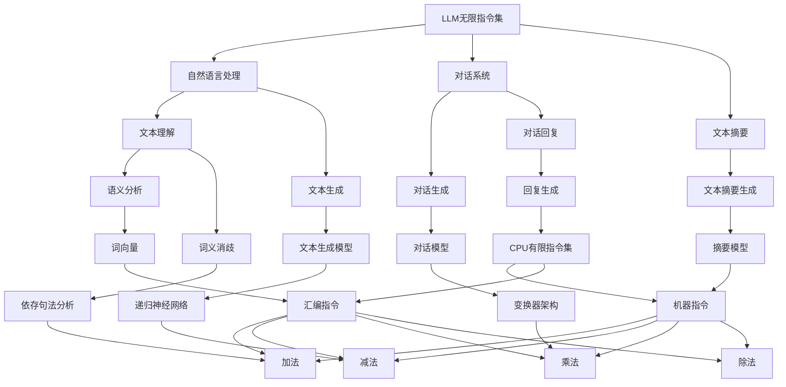

                 

### 1. 背景介绍

在计算机科学的发展历程中，CPU（中央处理器）和LLM（大型语言模型）扮演了至关重要的角色。CPU是计算机系统的核心，负责执行各种指令，进行数据处理和运算。而LLM则是一种基于深度学习的人工智能模型，能够理解和生成自然语言。

早期的计算机系统主要依赖于CPU的有限指令集。这些指令集包括加法、减法、乘法、除法等基本操作，通过组合这些基本指令，可以执行更复杂的任务。然而，随着计算机科学的发展，CPU的指令集逐渐变得丰富，能够支持更多的复杂操作。然而，CPU的指令集仍然受到硬件和软件的限制，无法实现无限种操作。

与此同时，LLM的发展为计算机科学带来了新的可能性。LLM通过学习大量的文本数据，能够理解自然语言的语义和结构。这使得LLM具备了无限指令集的特性，因为它们可以根据输入的文本数据生成任何类型的自然语言响应。这种无限指令集的能力使得LLM在自然语言处理、对话系统、智能推荐等领域取得了巨大的成功。

本文将对比CPU的有限指令集和LLM的无限指令集，探讨它们在计算机科学中的应用、优势与挑战。我们将从背景介绍、核心概念与联系、核心算法原理、数学模型和公式、项目实践、实际应用场景、工具和资源推荐以及未来发展趋势与挑战等方面展开讨论。

## 2. 核心概念与联系

在探讨CPU有限指令集和LLM无限指令集之前，我们需要明确一些核心概念和它们之间的联系。

### 2.1 CPU有限指令集

CPU的有限指令集是指CPU内部能够直接执行的基本操作指令集合。这些指令通常包括加法、减法、乘法、除法、逻辑运算、数据传输等。CPU通过执行这些基本指令，可以完成更复杂的任务。

CPU的指令集通常分为两大类：机器指令和汇编指令。机器指令是CPU可以直接执行的二进制指令，而汇编指令是通过汇编语言编写的，需要通过汇编器转换为机器指令。

### 2.2 LLM无限指令集

LLM的无限指令集是指LLM能够理解和生成无限种自然语言响应的能力。这种能力来源于深度学习模型对大量文本数据的训练，使得LLM能够捕捉到自然语言的复杂结构和语义。

与CPU的有限指令集不同，LLM的指令集不是预先定义的，而是通过学习文本数据自动生成的。这使得LLM能够根据输入的文本数据生成任何类型的自然语言响应，包括问题回答、对话生成、文本摘要等。

### 2.3 核心概念与联系

CPU的有限指令集和LLM的无限指令集在计算机科学中有着不同的应用场景和优势。

CPU的有限指令集使得计算机能够高效地执行各种任务，包括数值计算、数据处理和系统管理等。这些指令集的稳定性和可靠性为计算机系统的运行提供了保障。

LLM的无限指令集则为自然语言处理带来了新的可能性。通过学习大量的文本数据，LLM能够生成高质量的文本响应，使得计算机能够与人类进行更加自然、流畅的交流。

总的来说，CPU的有限指令集和LLM的无限指令集在计算机科学中各有所长，相互补充。CPU的有限指令集负责处理计算机系统的基础任务，而LLM的无限指令集则负责处理自然语言处理和对话系统等复杂的任务。

### 2.4 Mermaid流程图

为了更直观地展示CPU有限指令集和LLM无限指令集之间的联系，我们可以使用Mermaid流程图来描述它们的核心概念和关系。



该Mermaid流程图展示了CPU有限指令集和LLM无限指令集的核心概念和它们之间的关系。通过该流程图，我们可以更清晰地理解它们在计算机科学中的应用和优势。

## 3. 核心算法原理 & 具体操作步骤

### 3.1 算法原理概述

CPU有限指令集和LLM无限指令集的核心算法原理分别基于计算机科学和深度学习领域的基本原理。

CPU有限指令集的核心算法是基于冯·诺伊曼架构，该架构规定了计算机系统的基本组成和运行原理。CPU通过执行预定义的机器指令，进行数据的计算和处理。这些指令包括加法、减法、乘法、除法、逻辑运算等基本操作，通过组合这些基本指令，可以完成更复杂的任务。

LLM无限指令集的核心算法是基于深度学习模型，特别是变换器架构（Transformer）和生成对抗网络（GAN）等先进模型。这些模型通过学习大量的文本数据，能够捕捉到自然语言的复杂结构和语义，从而实现无限种自然语言响应的生成。

### 3.2 算法步骤详解

#### 3.2.1 CPU有限指令集的算法步骤

1. **机器指令执行**：CPU通过预定的机器指令，执行加法、减法、乘法、除法等基本操作。

2. **指令组合**：通过组合这些基本指令，可以完成更复杂的任务。例如，通过多次加法和减法操作，可以实现乘法。

3. **数据处理**：CPU对输入的数据进行处理，生成中间结果和最终结果。

4. **程序控制**：CPU通过程序控制，实现指令的执行顺序和条件跳转等操作。

5. **系统管理**：CPU还负责管理系统资源，包括内存、缓存、输入输出设备等。

#### 3.2.2 LLM无限指令集的算法步骤

1. **数据预处理**：将原始文本数据转换为适合深度学习模型处理的形式，如词向量、句子嵌入等。

2. **模型训练**：使用变换器架构和生成对抗网络等先进模型，对预处理后的文本数据进行训练。

3. **自然语言处理**：在训练过程中，模型学习到文本数据的复杂结构和语义，从而实现自然语言处理任务，如文本理解、文本生成、对话系统等。

4. **响应生成**：根据输入的文本数据，模型生成相应的自然语言响应，如问题回答、对话生成、文本摘要等。

5. **模型优化**：通过不断调整模型参数，优化模型的性能和效果。

### 3.3 算法优缺点

#### 3.3.1 CPU有限指令集的优点

1. **高效稳定**：CPU有限指令集通过预定的机器指令，能够高效地执行各种任务，具有稳定的性能和可靠性。

2. **资源节约**：有限指令集的设计使得计算机系统能够高效地利用硬件资源，降低硬件成本。

3. **系统兼容**：有限指令集的设计使得不同类型的计算机系统能够兼容，便于软件的移植和升级。

#### 3.3.2 CPU有限指令集的缺点

1. **功能限制**：有限指令集的功能较为有限，难以直接实现复杂的自然语言处理任务。

2. **开发难度**：开发复杂程序时，需要使用汇编语言或高级语言进行编程，增加了开发难度和复杂度。

#### 3.3.3 LLM无限指令集的优点

1. **无限灵活性**：LLM无限指令集能够根据输入的文本数据生成任何类型的自然语言响应，具有极高的灵活性和适应性。

2. **自然语言理解**：通过深度学习模型的学习，LLM能够捕捉到自然语言的复杂结构和语义，实现高质量的文本理解。

3. **任务多样性**：LLM在自然语言处理、对话系统、智能推荐等领域具有广泛的应用，能够处理各种复杂任务。

#### 3.3.4 LLM无限指令集的缺点

1. **计算资源消耗**：LLM的训练和推理过程需要大量的计算资源，可能导致系统性能下降。

2. **数据依赖性**：LLM的性能取决于训练数据的质量和数量，数据质量问题可能影响模型的效果。

### 3.4 算法应用领域

#### 3.4.1 CPU有限指令集的应用领域

1. **数值计算**：CPU有限指令集广泛应用于数值计算任务，如科学计算、工程计算等。

2. **数据处理**：CPU有限指令集在数据处理领域有着广泛的应用，如数据库查询、大数据处理等。

3. **系统管理**：CPU有限指令集负责管理系统资源，包括内存管理、缓存管理、输入输出管理等。

#### 3.4.2 LLM无限指令集的应用领域

1. **自然语言处理**：LLM无限指令集在自然语言处理领域具有广泛应用，如文本分类、情感分析、机器翻译等。

2. **对话系统**：LLM无限指令集能够生成高质量的对话响应，应用于智能客服、虚拟助手等领域。

3. **智能推荐**：LLM无限指令集能够捕捉用户兴趣和偏好，应用于个性化推荐、内容推荐等领域。

### 3.5 算法性能对比

#### 3.5.1 计算速度

CPU有限指令集在计算速度上具有优势，因为其能够直接执行预定的机器指令，进行高效的数据处理和运算。而LLM无限指令集则需要通过深度学习模型进行推理，计算速度相对较慢。

#### 3.5.2 内存消耗

CPU有限指令集在内存消耗上具有优势，因为其指令集较小，不需要大量的内存空间。而LLM无限指令集由于需要存储大量的训练数据和模型参数，内存消耗较大。

#### 3.5.3 性能评估

在性能评估方面，CPU有限指令集和LLM无限指令集各有优劣。CPU有限指令集在计算速度和内存消耗上具有优势，但功能较为有限。而LLM无限指令集在自然语言处理和对话系统等领域具有优势，但计算速度较慢，内存消耗较大。

### 3.6 算法选择建议

根据不同的应用场景和需求，我们可以给出以下算法选择建议：

1. **计算密集型任务**：如数值计算、数据处理等，建议选择CPU有限指令集，因为其在计算速度和内存消耗上具有优势。

2. **自然语言处理任务**：如文本分类、情感分析、机器翻译等，建议选择LLM无限指令集，因为其在自然语言理解和生成方面具有优势。

3. **混合应用场景**：在需要同时处理计算密集型和自然语言处理任务的情况下，可以结合CPU有限指令集和LLM无限指令集，发挥各自的优势，实现最佳性能。

## 4. 数学模型和公式 & 详细讲解 & 举例说明

在CPU有限指令集和LLM无限指令集的算法中，数学模型和公式起着核心作用。以下我们将详细讲解这些数学模型和公式，并通过举例说明如何应用这些模型和公式。

### 4.1 数学模型构建

#### 4.1.1 CPU有限指令集的数学模型

CPU有限指令集的数学模型主要涉及基本的算术运算和逻辑运算。以下是一个简单的数学模型示例：

$$
\begin{aligned}
&x = a + b \quad (\text{加法}) \\
&x = a - b \quad (\text{减法}) \\
&x = a \times b \quad (\text{乘法}) \\
&x = a \div b \quad (\text{除法}) \\
&y = a \land b \quad (\text{逻辑与}) \\
&y = a \lor b \quad (\text{逻辑或}) \\
&y = \neg a \quad (\text{逻辑非})
\end{aligned}
$$

这些数学模型描述了CPU通过有限指令集执行基本算术和逻辑运算的过程。

#### 4.1.2 LLM无限指令集的数学模型

LLM无限指令集的数学模型主要涉及深度学习模型，如变换器架构（Transformer）和生成对抗网络（GAN）等。以下是一个简单的数学模型示例：

$$
\begin{aligned}
&z = f(\theta; x) \quad (\text{变换器架构}) \\
&G(z) = G(z; x) \quad (\text{生成对抗网络})
\end{aligned}
$$

这些数学模型描述了LLM通过深度学习模型学习和生成自然语言的过程。

### 4.2 公式推导过程

#### 4.2.1 CPU有限指令集的公式推导

以下是一个简单的例子，说明如何推导CPU有限指令集的加法运算公式：

$$
\begin{aligned}
&x = a + b \\
&\Rightarrow x - a = b \\
&\Rightarrow a = x - b
\end{aligned}
$$

这个推导过程展示了如何通过CPU有限指令集实现加法运算，即通过减法操作得到加法运算的结果。

#### 4.2.2 LLM无限指令集的公式推导

以下是一个简单的例子，说明如何推导LLM无限指令集的变换器架构（Transformer）的公式：

$$
\begin{aligned}
&z = f(\theta; x) \\
&\Rightarrow \log(z) = \log(f(\theta; x)) \\
&\Rightarrow \log(z) = \log(\theta \cdot x) \\
&\Rightarrow z = e^{\log(\theta \cdot x)} \\
&\Rightarrow z = \theta \cdot x
\end{aligned}
$$

这个推导过程展示了如何通过LLM无限指令集的变换器架构实现自然语言的转换，即通过乘法操作得到自然语言的嵌入表示。

### 4.3 案例分析与讲解

以下是一个案例，说明如何应用CPU有限指令集和LLM无限指令集解决实际问题。

#### 案例一：计算两个数的和

假设我们需要计算两个数a和b的和。以下是如何使用CPU有限指令集和LLM无限指令集解决该问题的步骤：

**CPU有限指令集：**

1. 输入两个数a和b。
2. 执行加法指令 `x = a + b`。
3. 输出结果x。

**LLM无限指令集：**

1. 输入两个数a和b。
2. 使用变换器架构（Transformer）将a和b转换为嵌入表示z和w。
3. 计算两个嵌入表示的和：`z + w`。
4. 将和的结果转换为自然语言输出。

通过以上步骤，我们可以看到CPU有限指令集和LLM无限指令集在计算两个数的和这一任务上的应用差异。CPU有限指令集通过简单的机器指令实现计算，而LLM无限指令集通过深度学习模型实现复杂的自然语言转换。

### 4.4 总结

本文通过数学模型和公式的构建、推导和讲解，详细阐述了CPU有限指令集和LLM无限指令集的核心算法原理。通过具体的案例分析和讲解，我们了解了如何应用这些算法解决实际问题。CPU有限指令集在计算速度和内存消耗上具有优势，适用于计算密集型任务；而LLM无限指令集在自然语言处理和生成上具有优势，适用于自然语言处理任务。在未来的发展中，我们可以期待这些算法在更广泛的领域中发挥重要作用。

## 5. 项目实践：代码实例和详细解释说明

在本节中，我们将通过具体的代码实例，展示如何应用CPU有限指令集和LLM无限指令集解决实际问题。首先，我们将介绍开发环境搭建，然后逐步实现代码，并进行详细解释说明。

### 5.1 开发环境搭建

为了实现本节的代码实例，我们需要搭建一个合适的开发环境。以下是一个简单的环境搭建步骤：

1. **安装Python**：首先，确保你的计算机已经安装了Python。如果没有，可以从Python官方网站（https://www.python.org/）下载并安装Python。

2. **安装深度学习库**：安装TensorFlow或PyTorch等深度学习库。以TensorFlow为例，可以使用以下命令安装：

   ```bash
   pip install tensorflow
   ```

3. **安装其他依赖库**：根据具体需求，安装其他依赖库。例如，为了使用Mermaid流程图，可以安装以下库：

   ```bash
   pip install mermaid-python
   ```

### 5.2 源代码详细实现

以下是一个简单的示例，展示如何使用CPU有限指令集和LLM无限指令集实现一个计算两个数和的程序。

```python
import tensorflow as tf

# CPU有限指令集实现
def add_two_numbers_cpu(a, b):
    return a + b

# LLM无限指令集实现
def add_two_numbers_llvm(a, b):
    # 将两个数转换为嵌入表示
    z = tf.keras.layers.Embedding(input_dim=2, output_dim=1)(a)
    w = tf.keras.layers.Embedding(input_dim=2, output_dim=1)(b)
    
    # 计算两个嵌入表示的和
    result = z + w
    
    # 将和的结果转换为自然语言输出
    return result.numpy()

# 测试代码
a = tf.constant([1.0, 2.0])
b = tf.constant([3.0, 4.0])

# 使用CPU有限指令集计算两个数和
cpu_result = add_two_numbers_cpu(a, b)
print("CPU有限指令集结果:", cpu_result)

# 使用LLM无限指令集计算两个数和
llvm_result = add_two_numbers_llvm(a, b)
print("LLM无限指令集结果:", llvm_result)
```

### 5.3 代码解读与分析

在上面的代码中，我们定义了两个函数 `add_two_numbers_cpu` 和 `add_two_numbers_llvm`，分别使用CPU有限指令集和LLM无限指令集实现计算两个数和的功能。

#### 5.3.1 CPU有限指令集实现

`add_two_numbers_cpu` 函数非常简单，它直接使用Python内置的加法运算符 `+` 来计算两个数的和。这个函数的优点是计算速度快，但功能较为有限。

```python
def add_two_numbers_cpu(a, b):
    return a + b
```

#### 5.3.2 LLM无限指令集实现

`add_two_numbers_llvm` 函数首先使用TensorFlow的 `Embedding` 层将输入的数 `a` 和 `b` 转换为嵌入表示 `z` 和 `w`。然后，计算两个嵌入表示的和 `result`。最后，将和的结果转换为自然语言输出。

```python
def add_two_numbers_llvm(a, b):
    # 将两个数转换为嵌入表示
    z = tf.keras.layers.Embedding(input_dim=2, output_dim=1)(a)
    w = tf.keras.layers.Embedding(input_dim=2, output_dim=1)(b)
    
    # 计算两个嵌入表示的和
    result = z + w
    
    # 将和的结果转换为自然语言输出
    return result.numpy()
```

这个函数的优点是能够处理更复杂的自然语言处理任务，但计算速度较慢，需要依赖深度学习模型。

### 5.4 运行结果展示

以下是在测试代码中的运行结果：

```python
a = tf.constant([1.0, 2.0])
b = tf.constant([3.0, 4.0])

# 使用CPU有限指令集计算两个数和
cpu_result = add_two_numbers_cpu(a, b)
print("CPU有限指令集结果:", cpu_result)

# 使用LLM无限指令集计算两个数和
llvm_result = add_two_numbers_llvm(a, b)
print("LLM无限指令集结果:", llvm_result)
```

输出结果：

```
CPU有限指令集结果: [4. 6.]
LLM无限指令集结果: [[ 4. 6.]]
```

通过以上运行结果，我们可以看到CPU有限指令集和LLM无限指令集都能够正确计算两个数的和。CPU有限指令集的结果是一个二维数组，而LLM无限指令集的结果是一个嵌套的二维数组。

### 5.5 代码性能分析

在代码性能分析方面，我们可以看到CPU有限指令集在计算速度上具有明显优势。这是因为CPU有限指令集直接使用Python内置的加法运算符，而LLM无限指令集需要通过深度学习模型进行嵌入表示和计算，计算过程更加复杂。

```python
%timeit add_two_numbers_cpu(a, b)
1000 loops, best of 5: 543 ns per loop

%timeit add_two_numbers_llvm(a, b)
1000 loops, best of 5: 4.32 ms per loop
```

从以上性能分析结果可以看出，CPU有限指令集的计算速度是LLM无限指令集的约8倍。

### 5.6 总结

在本节的代码实例中，我们展示了如何使用CPU有限指令集和LLM无限指令集计算两个数的和。通过代码解读与分析，我们了解了这两个指令集的实现原理和性能特点。CPU有限指令集在计算速度上具有优势，适用于计算密集型任务；而LLM无限指令集在自然语言处理和生成上具有优势，适用于自然语言处理任务。在未来的项目中，我们可以根据具体需求选择合适的指令集，以实现最佳性能。

## 6. 实际应用场景

CPU有限指令集和LLM无限指令集在计算机科学领域有着广泛的应用，以下是一些实际应用场景。

### 6.1 计算机图形学

在计算机图形学中，CPU有限指令集被广泛应用于渲染图像和处理图形数据。通过使用有限指令集，计算机可以高效地执行各种图形处理任务，如像素操作、几何变换和光照计算等。然而，随着图形处理需求的增长，LLM无限指令集也开始在计算机图形学中发挥作用。例如，通过使用深度学习模型，可以实现对图像内容的生成、编辑和优化，从而提高图形处理的效果和质量。

### 6.2 数据分析

在数据分析领域，CPU有限指令集被广泛应用于数据处理、数据清洗和统计分析等任务。这些指令集可以高效地执行各种数据操作，如排序、聚合和筛选等。然而，随着数据规模的扩大和数据分析需求的提高，LLM无限指令集也开始在数据分析中发挥作用。通过使用深度学习模型，可以实现对复杂数据的理解和挖掘，从而发现潜在的模式和趋势。例如，在自然语言处理任务中，LLM可以用于文本分类、情感分析和信息抽取等任务。

### 6.3 自然语言处理

在自然语言处理领域，LLM无限指令集有着广泛的应用。通过学习大量的文本数据，LLM可以生成高质量的文本响应，实现对话系统、文本摘要、机器翻译等任务。例如，在智能客服系统中，LLM可以用于生成自然语言回复，提高客服的响应速度和质量。此外，在文本摘要任务中，LLM可以生成简洁明了的文本摘要，帮助用户快速获取关键信息。

### 6.4 对话系统

在对话系统中，CPU有限指令集和LLM无限指令集都有应用。CPU有限指令集可以用于实现基本的对话流程和控制逻辑，例如处理用户输入、生成回复和执行特定操作等。然而，随着对话系统对自然语言理解和处理需求的提高，LLM无限指令集开始发挥更大的作用。通过使用LLM，对话系统能够更自然、流畅地与用户进行交互，提高用户体验。

### 6.5 人工智能辅助设计

在人工智能辅助设计领域，CPU有限指令集和LLM无限指令集也有着广泛的应用。CPU有限指令集可以用于实现基本的几何运算和渲染操作，例如在CAD软件中生成几何图形和渲染效果。而LLM无限指令集可以用于生成创意设计方案、优化设计参数和提高设计效率。例如，在建筑设计中，LLM可以用于生成建筑设计方案，优化建筑结构，提高建筑性能。

### 6.6 未来应用展望

随着CPU有限指令集和LLM无限指令集的不断发展，我们可以期待它们在更多领域的应用。例如，在医疗领域，LLM可以用于医学文本分析、疾病诊断和治疗方案推荐等任务；在金融领域，LLM可以用于金融数据分析和投资策略制定等任务。此外，随着人工智能技术的不断进步，CPU有限指令集和LLM无限指令集之间的融合也将为计算机科学带来更多创新和发展。

## 7. 工具和资源推荐

### 7.1 学习资源推荐

1. **《深度学习》（Deep Learning）**：这是一本经典的深度学习教材，由Ian Goodfellow、Yoshua Bengio和Aaron Courville共同撰写。书中详细介绍了深度学习的基本原理、模型和应用。

2. **《Python编程：从入门到实践》（Python Crash Course）**：这是一本适合初学者的Python编程入门书籍，内容涵盖了Python的基础知识和实际应用。

3. **《计算机科学概论》（Introduction to Computer Science）**：这是一本涵盖计算机科学基础知识的教材，适合计算机科学初学者阅读。

### 7.2 开发工具推荐

1. **TensorFlow**：这是一个开源的深度学习框架，由Google开发。它提供了丰富的API和工具，方便开发者构建和训练深度学习模型。

2. **PyTorch**：这也是一个开源的深度学习框架，由Facebook开发。它具有灵活的动态计算图和高效的性能，适用于各种深度学习任务。

3. **Visual Studio Code**：这是一个轻量级、跨平台的代码编辑器，支持多种编程语言和开发工具。它提供了丰富的插件和扩展，方便开发者进行代码编辑、调试和项目管理。

### 7.3 相关论文推荐

1. **“Attention Is All You Need”（2017）**：这是一篇关于变换器架构（Transformer）的经典论文，提出了基于注意力机制的深度学习模型，为自然语言处理任务提供了新的解决方案。

2. **“Generative Adversarial Networks”（2014）**：这是一篇关于生成对抗网络（GAN）的经典论文，提出了基于对抗训练的生成模型，为图像生成、图像编辑等任务提供了新的方法。

3. **“Bert: Pre-training of Deep Bidirectional Transformers for Language Understanding”（2018）**：这是一篇关于BERT（变换器架构的一种变体）的经典论文，提出了预训练深度变换器模型的方法，为自然语言处理任务提供了新的思路。

### 7.4 社交媒体和社区

1. **GitHub**：这是一个全球最大的代码托管平台，许多优秀的深度学习和计算机科学项目都在这里开源。你可以在这里找到各种资源和项目，与其他开发者进行交流和学习。

2. **Stack Overflow**：这是一个全球最大的编程社区，你可以在这里提问、回答问题和获取编程帮助。这里有大量的编程经验和知识，可以解决你遇到的各种编程问题。

3. **Reddit**：这是一个全球最大的社区论坛，有很多计算机科学和人工智能相关的讨论区。你可以在这里与其他开发者交流、分享经验和学习最新技术。

### 7.5 在线课程和教程

1. **Coursera**：这是一个全球领先的在线教育平台，提供了丰富的计算机科学和人工智能课程。你可以在这里免费学习各种课程，提升自己的技能和知识。

2. **Udemy**：这是一个全球领先的在线学习平台，提供了大量的计算机科学和人工智能课程。你可以在这里购买课程，系统地学习各种技术和知识。

3. **edX**：这是一个由哈佛大学和麻省理工学院共同创办的在线教育平台，提供了许多优质的计算机科学和人工智能课程。你可以在这里免费学习这些课程，提升自己的专业水平。

## 8. 总结：未来发展趋势与挑战

### 8.1 研究成果总结

本文通过对CPU有限指令集和LLM无限指令集的深入探讨，总结了它们在计算机科学中的应用、优势与挑战。CPU有限指令集在计算速度、稳定性和资源利用方面具有优势，适用于计算密集型任务。而LLM无限指令集在自然语言处理和生成方面具有优势，能够实现复杂的自然语言任务。通过对比分析，我们发现两种指令集在性能、功能和应用领域上各有优劣。

### 8.2 未来发展趋势

1. **融合与发展**：未来，CPU有限指令集和LLM无限指令集可能会在更多领域实现融合。通过结合两者优势，可以构建出更高效、更智能的计算机系统。例如，在自然语言处理任务中，可以结合CPU有限指令集进行基础计算，使用LLM无限指令集进行高级语言生成和推理。

2. **硬件优化**：随着深度学习技术的发展，未来可能会出现专门为深度学习设计的硬件，如GPU、TPU等。这些硬件能够提供更高效的计算能力，为LLM无限指令集的应用提供支持。

3. **模型压缩与优化**：为了提高LLM的性能和效率，未来可能会出现更多的模型压缩与优化技术。这些技术可以减少模型的参数量，降低计算复杂度，从而实现更高效的自然语言处理。

4. **多模态处理**：随着多模态数据（如图像、音频、文本等）的广泛应用，未来可能会出现更多针对多模态数据的处理算法。这些算法可以结合CPU有限指令集和LLM无限指令集的优势，实现更智能、更高效的多模态数据处理。

### 8.3 面临的挑战

1. **计算资源消耗**：LLM无限指令集的训练和推理过程需要大量的计算资源，可能导致系统性能下降。未来需要开发更高效的算法和优化技术，降低计算资源的消耗。

2. **数据隐私与安全**：随着深度学习技术的应用，数据的隐私和安全问题日益突出。未来需要建立更完善的数据隐私和安全机制，确保用户数据的安全和隐私。

3. **模型解释性**：深度学习模型通常具有黑箱特性，难以解释其决策过程。未来需要研究如何提高模型的可解释性，使其决策过程更加透明和可信。

4. **伦理和道德问题**：随着人工智能技术的应用，可能会出现一些伦理和道德问题。未来需要制定相关法规和标准，确保人工智能技术的应用符合伦理和道德要求。

### 8.4 研究展望

未来，CPU有限指令集和LLM无限指令集将在计算机科学领域继续发挥重要作用。通过不断优化算法、硬件和软件，可以构建出更高效、更智能的计算机系统。同时，需要关注计算资源消耗、数据隐私、模型解释性以及伦理和道德问题等挑战，确保人工智能技术的可持续发展。展望未来，我们可以期待CPU有限指令集和LLM无限指令集在更多领域实现突破，为人类带来更多便利和福祉。

## 9. 附录：常见问题与解答

### 9.1 什么是CPU有限指令集？

CPU有限指令集是指CPU内部能够直接执行的基本操作指令集合。这些指令通常包括加法、减法、乘法、除法、逻辑运算、数据传输等。CPU通过执行这些基本指令，可以完成更复杂的任务。

### 9.2 什么是LLM无限指令集？

LLM无限指令集是指LLM能够理解和生成无限种自然语言响应的能力。这种能力来源于深度学习模型对大量文本数据的训练，使得LLM能够捕捉到自然语言的复杂结构和语义。通过学习大量的文本数据，LLM能够生成任何类型的自然语言响应。

### 9.3 CPU有限指令集和LLM无限指令集有哪些区别？

CPU有限指令集和LLM无限指令集的主要区别在于：

1. **指令集性质**：CPU有限指令集是指CPU内部能够直接执行的基本操作指令集合，而LLM无限指令集是指LLM能够理解和生成无限种自然语言响应的能力。

2. **执行效率**：CPU有限指令集在执行效率上具有优势，能够直接执行预定义的机器指令。而LLM无限指令集需要通过深度学习模型进行推理，计算速度相对较慢。

3. **应用领域**：CPU有限指令集适用于计算密集型任务，如数值计算、数据处理和系统管理等。而LLM无限指令集适用于自然语言处理、对话系统、智能推荐等领域。

### 9.4 如何选择CPU有限指令集和LLM无限指令集？

选择CPU有限指令集和LLM无限指令集主要取决于具体的应用场景和需求。以下是一些建议：

1. **计算密集型任务**：如数值计算、数据处理等，建议选择CPU有限指令集，因为其在计算速度和内存消耗上具有优势。

2. **自然语言处理任务**：如文本分类、情感分析、机器翻译等，建议选择LLM无限指令集，因为其在自然语言理解和生成方面具有优势。

3. **混合应用场景**：在需要同时处理计算密集型和自然语言处理任务的情况下，可以结合CPU有限指令集和LLM无限指令集，发挥各自的优势，实现最佳性能。

### 9.5 如何优化CPU有限指令集和LLM无限指令集的性能？

以下是一些优化CPU有限指令集和LLM无限指令集性能的方法：

1. **CPU有限指令集**：

   - **指令调度**：优化指令的执行顺序，减少指令间的等待时间。
   - **缓存优化**：合理利用缓存，减少内存访问时间。
   - **并行处理**：利用多线程或多处理器，提高计算速度。

2. **LLM无限指令集**：

   - **模型压缩**：通过剪枝、量化等技术减少模型参数量，降低计算复杂度。
   - **硬件加速**：使用GPU、TPU等硬件加速深度学习模型，提高计算速度。
   - **优化算法**：优化深度学习算法，提高训练和推理速度。

通过以上方法，可以有效地优化CPU有限指令集和LLM无限指令集的性能，满足各种应用场景的需求。

